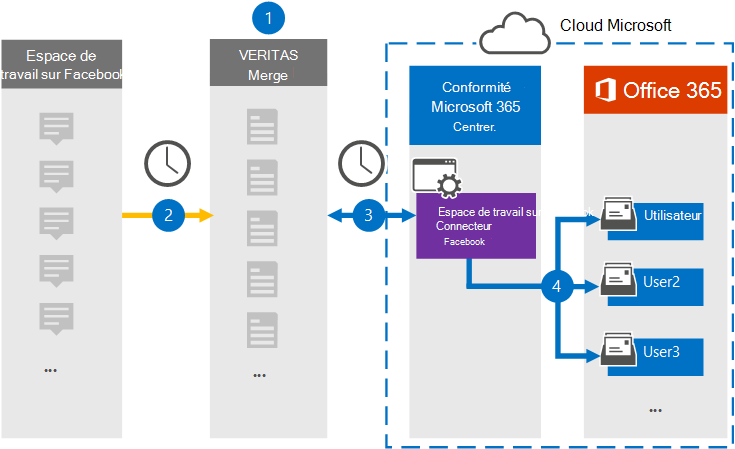

# Configurer un connecteur pour archiver les données Workplace à partir de Facebook

[!include[Purview banner](../includes/purview-rebrand-banner.md)]

Utilisez un connecteur Veritas dans le portail de conformité Microsoft Purview pour importer et archiver des données de Workplace de Facebook vers des boîtes aux lettres utilisateur dans votre organisation Microsoft 365. Veritas fournit un connecteur [Workplace from Facebook](https://globanet.com/workplace/) configuré pour capturer des éléments à partir de la source de données tierce (régulièrement) et importer ces éléments dans Microsoft 365. Le connecteur convertit le contenu tel que les conversations, les pièces jointes, les publications et les vidéos de Workplace au format de message électronique, puis importe ces éléments dans des boîtes aux lettres utilisateur dans Microsoft 365.

Une fois que les données Workplace sont stockées dans des boîtes aux lettres utilisateur, vous pouvez appliquer des fonctionnalités Microsoft Purview telles que la conservation des litiges, la découverte électronique, les stratégies de rétention et les étiquettes de rétention, ainsi que la conformité des communications. L’utilisation du connecteur Workplace from Facebook pour importer et archiver des données dans Microsoft 365 peut aider votre organisation à rester conforme aux politiques gouvernementales et réglementaires.

## Vue d’ensemble de l’archivage des données Workplace à partir de Facebook

La vue d’ensemble suivante explique le processus d’utilisation d’un connecteur pour archiver les données Workplace dans Microsoft 365.

1. Votre organisation travaille avec Workplace from Facebook pour configurer et configurer un site Workplace.

2. Toutes les 24 heures, les éléments de Workplace sont copiés sur le site Veritas Merge1. Le connecteur convertit également le contenu de ces éléments au format de message électronique.

3. Le connecteur Workplace from Facebook que vous créez dans le portail de conformité, se connecte au Veritas Merge1 tous les jours et transfère les éléments Workplace à un emplacement stockage Azure sécurisé dans le cloud Microsoft.

4. Le connecteur importe les éléments convertis dans les boîtes aux lettres d’utilisateurs spécifiques à l’aide de la valeur de la propriété *Email du mappage* automatique des utilisateurs, comme décrit à l’étape 3. Un sous-dossier dans le dossier Boîte de réception nommé **Workplace from Facebook** est créé et les éléments Workplace sont importés dans ce dossier. Pour ce faire, le connecteur utilise la valeur de la propriété *Email* . Chaque élément Workplace contient cette propriété, qui est remplie avec l’adresse e-mail de chaque conversation ou participant post.

## Avant de commencer

- Créez un compte Veritas Merge1 pour les connecteurs Microsoft. Pour créer ce compte, contactez le [support technique Veritas](https://globanet.com/ms-connectors-contact). Vous vous connecterez à ce compte lorsque vous créerez le connecteur à l’étape 1.

- Créez une intégration personnalisée pour https://my.workplace.com/work/admin/apps/ récupérer des données de Workplace via des API à des fins de conformité et eDiscovery.

   Lors de la création de l’intégration, la plateforme Workplace génère un ensemble d’informations d’identification uniques utilisées pour générer des jetons utilisés pour l’authentification. Ces jetons sont utilisés dans l’Assistant Configuration du connecteur Workplace from Facebook à l’étape 2. Pour obtenir des instructions pas à pas sur la création des applications, consultez le [Guide d’utilisation des connecteurs tiers Merge1](https://docs.ms.merge1.globanetportal.com/Merge1%20Third-Party%20Connectors%20Workplace%20from%20Facebook%20User%20Guide%20.pdf).

- L’utilisateur qui crée le connecteur Workplace from Facebook à l’étape 1 (et le termine à l’étape 3) doit avoir le rôle Administrateur du connecteur de données. Ce rôle est requis pour ajouter des connecteurs sur la page **Connecteurs de données** dans le portail de conformité. Ce rôle est ajouté par défaut à plusieurs groupes de rôles. Pour obtenir la liste de ces groupes de rôles, consultez la section « Rôles dans les centres de sécurité et de conformité » dans [Autorisations dans le Centre de sécurité & conformité](../security/office-365-security/permissions-in-the-security-and-compliance-center.md#roles-in-the-security--compliance-center). Un administrateur de votre organisation peut également créer un groupe de rôles personnalisé, attribuer le rôle Administrateur du connecteur de données, puis ajouter les utilisateurs appropriés en tant que membres. Pour obtenir des instructions, consultez la section « Créer un groupe de rôles personnalisé » dans [Autorisations dans le portail de conformité Microsoft Purview](microsoft-365-compliance-center-permissions.md#create-a-custom-role-group).

- Ce connecteur de données Veritas est en préversion publique dans Cloud de la communauté du secteur public environnements dans le cloud Microsoft 365 US Government. Les applications et services tiers peuvent impliquer le stockage, la transmission et le traitement des données client de votre organisation sur des systèmes tiers qui ne font pas partie de l’infrastructure Microsoft 365 et ne sont donc pas couverts par les engagements de Microsoft Purview et de protection des données. Microsoft ne fait aucune représentation que l’utilisation de ce produit pour se connecter à des applications tierces implique que ces applications tierces sont conformes FEDRAMP.

## Étape 1 : Configurer le connecteur Workplace from Facebook

La première étape consiste à accéder à la page **Connecteurs de données** dans le portail de conformité et à créer un connecteur pour les données Workplace.

1. Accédez, [https://compliance.microsoft.com](https://compliance.microsoft.com/) puis cliquez sur **Data connectorsWorkplace** >  **à partir de Facebook**.

2. Dans la page **de description du produit Workplace from Facebook** , cliquez sur **Ajouter un connecteur**.

3. Dans la page **Conditions d’utilisation** , cliquez sur **Accepter**.

4. Entrez un nom unique qui identifie le connecteur, puis cliquez sur **Suivant**.

5. Connectez-vous à votre compte Merge1 pour configurer le connecteur.

## Étape 2 : Configurer le connecteur Workplace from Facebook sur le site Veritas Merge1

La deuxième étape consiste à configurer le connecteur Workplace from Facebook sur le site Merge1. Pour plus d’informations sur la configuration du connecteur Workplace from Facebook, consultez le [Guide d’utilisation des connecteurs tiers Merge1](https://docs.ms.merge1.globanetportal.com/Merge1%20Third-Party%20Connectors%20Workplace%20from%20Facebook%20User%20Guide%20.pdf).

Une fois que vous avez cliqué sur **Enregistrer & Terminer**, la page De **mappage utilisateur** de l’Assistant Connecteur dans le portail de conformité s’affiche.

## Étape 3 : Mapper les utilisateurs et terminer la configuration du connecteur

Pour mapper les utilisateurs et terminer la configuration du connecteur dans le portail de conformité, procédez comme suit :

1. Dans la page **Mapper des utilisateurs externes à Microsoft 365**, activez le mappage automatique des utilisateurs. Les éléments Workplace incluent une propriété appelée *Email* qui contient des adresses e-mail pour les utilisateurs de votre organisation. Si le connecteur peut associer cette adresse à un utilisateur Microsoft 365, les éléments sont importés dans la boîte aux lettres de cet utilisateur.

2. Cliquez sur **Suivant**, passez en revue vos paramètres, puis accédez à la page **Connecteurs de données** pour voir la progression du processus d’importation du nouveau connecteur.

## Étape 4 : Surveiller le lieu de travail à partir du connecteur Facebook

Après avoir créé le connecteur Workplace from Facebook, vous pouvez afficher l’état du connecteur dans le portail de conformité.

1. Accédez et [https://compliance.microsoft.com](https://compliance.microsoft.com) cliquez sur **Connecteurs de données** dans le volet de navigation gauche.

2. Cliquez sur l’onglet **Connecteurs** , puis sélectionnez le connecteur **Workplace from Facebook** pour afficher la page de menu volant. Cette page contient les propriétés et les informations sur le connecteur.

3. Sous **État du connecteur avec source**, cliquez sur le lien **Télécharger le journal** pour ouvrir (ou enregistrer) le journal d’état du connecteur. Ce journal contient des informations sur les données qui ont été importées dans le cloud Microsoft.

## Problèmes détectés

- Pour l’instant, nous ne prenons pas en charge l’importation de pièces jointes ou d’éléments supérieurs à 10 Mo. La prise en charge des éléments plus volumineux sera disponible ultérieurement.