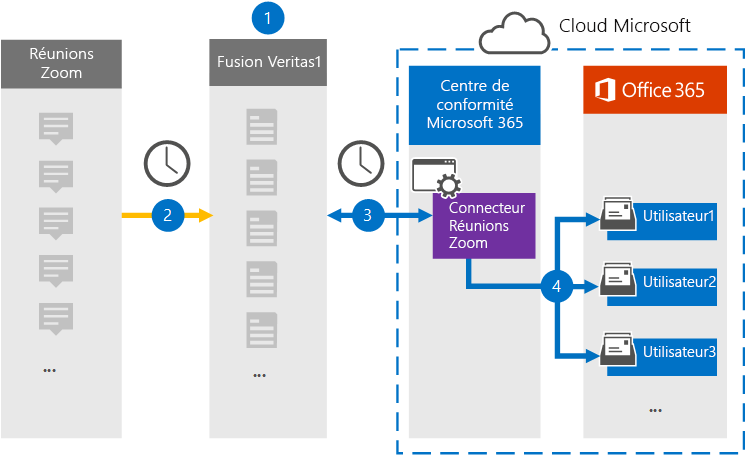

# Configurer un connecteur pour archiver les données de Zoom Meetings

Utilisez un connecteur Veritas dans le Centre de conformité Microsoft 365 pour importer et archiver des données de Réunions Zoom vers les boîtes aux lettres des utilisateurs de Microsoft 365 organisation. Veritas fournit un connecteur [Zoom Meetings](https://globanet.com/zoom/) qui est configuré pour capturer des éléments à partir de la source de données tierce (régulièrement) et importer ces éléments dans Microsoft 365. Le connecteur convertit le contenu des réunions (y compris les conversations, les fichiers enregistrés et les métadonnées) du compte Zoom Meetings au format de message électronique, puis importe ces éléments dans les boîtes aux lettres des utilisateurs dans Microsoft 365.

Une fois que les données Zoom Meetings sont stockées dans les boîtes aux lettres des utilisateurs, vous pouvez appliquer des fonctionnalités de conformité Microsoft 365 telles que la conservation pour litige, eDiscovery, les stratégies et étiquettes de rétention et la conformité des communications. L’utilisation d’un connecteur Zoom Meetings pour importer et archiver des données dans Microsoft 365 peut aider votre organisation à rester conforme aux stratégies gouvernementales et réglementaires.

## Vue d’ensemble de l’archivage des données de zoom des réunions

La vue d’ensemble suivante explique le processus d’utilisation d’un connecteur pour archiver les données Zoom Meetings Microsoft 365.

1. Votre organisation travaille avec Zoom Meetings pour configurer un site Zoom Meetings.

2. Toutes les 24 heures, les éléments de réunion de Zoom Meetings sont copiés sur le site Veritas Merge1. Le connecteur convertit également le contenu des réunions au format de message électronique.

3. Le connecteur Zoom Meetings que vous créez dans le Centre de conformité Microsoft 365, se connecte à Veritas Merge1 tous les jours et transfère les messages de réunion vers un emplacement stockage Azure sécurisé dans le cloud Microsoft.

4. Le connecteur importe les éléments de réunion convertis dans les boîtes aux lettres d’utilisateurs spécifiques à l’aide de la valeur de la propriété *Email* et du mappage automatique des utilisateurs, comme décrit à l’étape 3. Un nouveau sous-dossier dans le dossier Boîte de réception nommé Réunions avec zoom est créé dans les boîtes aux lettres des **utilisateurs** et les éléments de réunion sont importés dans ce dossier. Pour ce faire, le connecteur utilise la valeur de la *propriété Email.* Chaque élément de réunion contient cette propriété, qui est remplie avec l’adresse e-mail de chaque participant de la réunion.

## Avant de commencer

- Créez un compte Veritas Merge1 pour les connecteurs Microsoft. Pour créer ce compte, contactez le support [technique Veritas.](https://globanet.com/ms-connectors-contact) Vous vous connectez à ce compte lorsque vous créez le connecteur à l’étape 1.

- Obtenez le nom d’utilisateur et le mot de passe du compte Zoom Entreprise ou Zoom Enterprise de votre organisation. Vous devez vous inscrire à ce compte à l’étape 2 lorsque vous configurez le connecteur Zoom Meetings.

- Créez les applications suivantes dans [Zoom Marketplace](https://marketplace.zoom.us):

  - Application OAuth

  - Application JWT

  Après avoir créé ces applications, la plateforme Zoom génère un ensemble d’informations d’identification uniques utilisées pour générer les jetons. Ces jetons sont utilisés pour authentifier le connecteur lorsqu’il se connecte à votre compte Zoom et copie les éléments sur le site Merge1. Vous utiliserez ces jetons lorsque vous configurerez le connecteur Zoom à l’étape 2.

  Pour obtenir des instructions détaillées sur la création des applications OAuth et JWT, consultez le Guide de l’utilisateur [Merge1 Third-Party Connectors](https://docs.ms.merge1.globanetportal.com/Merge1%20Third-Party%20Connectors%20Zoom%20Meetings%20User%20Guide%20.pdf).

- L’utilisateur qui crée le connecteur Zoom Meetings à l’étape 1 (et le termine à l’étape 3) doit être affecté au rôle Importation/Exportation de boîte aux lettres dans Exchange Online. Ce rôle est requis pour ajouter des connecteurs sur la page **Connecteurs** de données dans la Centre de conformité Microsoft 365. Par défaut, ce rôle n’est pas attribué à un groupe de rôles dans Exchange Online. Vous pouvez ajouter le rôle Importation/Exportation de boîte aux lettres au groupe de rôles Gestion de l’organisation dans Exchange Online. Vous pouvez également créer un groupe de rôles, attribuer le rôle Importation/Exportation de boîte aux lettres, puis ajouter les utilisateurs appropriés en tant que membres. Pour plus d’informations, voir les [sections](/Exchange/permissions-exo/role-groups#modify-role-groups) Créer des groupes de rôles ou Modifier des groupes de rôles dans l’article « Gérer les groupes de rôles dans Exchange Online ». 

## Étape 1 : Configurer le connecteur Zoom Meetings

La première étape consiste à accéder aux **connecteurs** de données dans le Centre de conformité Microsoft 365 créer un connecteur Zoom Meetings.

1. Go to [https://compliance.microsoft.com](https://compliance.microsoft.com/) and then click Data **connectors**  >  **Zoom Meetings**.

2. Dans la page de description **du produit Zoom Meetings,** cliquez **sur Ajouter un connecteur.**

3. Dans la page **Conditions d’utilisation,** cliquez sur **Accepter.**

4. Entrez un nom unique qui identifie le connecteur, puis cliquez sur **Suivant**.

5. Connectez-vous à votre compte Merge1 pour configurer le connecteur.

## Étape 2 : Configurer le connecteur Zoom Meetings

La deuxième étape consiste à configurer le connecteur Zoom Meetings sur le site Merge1. Pour plus d’informations sur la configuration du connecteur Zoom Meetings sur le site Veritas Merge1, voir [Merge1 Third-Party Connectors User Guide](https://docs.ms.merge1.globanetportal.com/Merge1%20Third-Party%20Connectors%20Zoom%20Meetings%20User%20Guide%20.pdf).

Une fois que vous avez **cliqué sur &** terminé, la **page** Mappage de l’utilisateur dans l’Assistant connecteur du Centre de conformité Microsoft 365 s’affiche.

## Étape 3 : Masons les utilisateurs et terminez la configuration du connecteur

1. Dans la page **Ma mappage des utilisateurs externes Microsoft 365 utilisateurs,** activez le mappage automatique des utilisateurs.

   Les éléments Zoom Meetings incluent une propriété appelée *Email* qui contient les adresses de messagerie des utilisateurs de votre organisation. Si le connecteur peut associer cette adresse à un utilisateur Microsoft 365, les éléments sont importés dans la boîte aux lettres de cet utilisateur.

2. Cliquez **sur** Suivant, examinez vos paramètres et allez à la page **Connecteurs** de données pour voir la progression du processus d’importation pour le nouveau connecteur.

## Étape 4 : Surveiller le connecteur Zoom Meetings

Après avoir créé le connecteur Zoom Meetings, vous pouvez afficher l’état du connecteur dans le Centre de conformité Microsoft 365.

1. Go to [https://compliance.microsoft.com](https://compliance.microsoft.com) and click **Data connectors** in the left nav.

2. Cliquez sur **l’onglet Connecteurs,** puis sélectionnez le connecteur **Zoom Réunions** pour afficher la page volante. Cette page contient les propriétés et les informations sur le connecteur.

3. Sous **État du connecteur avec source,** cliquez sur le lien Télécharger le journal pour ouvrir (ou enregistrer) le journal d’état du connecteur.  Ce journal contient des informations sur les données qui ont été importées dans le cloud Microsoft.

## Problèmes détectés

- Pour l’instant, l’importation de pièces jointes ou d’éléments dont la taille est supérieure à 10 Mo n’est pas prise en charge. La prise en charge des éléments plus volumineux sera disponible à une date ultérieure.

- Pour que le connecteur Zoom Meetings fonctionne, vous devez activer les enregistrements lors de la configuration de Zoom Meetings.