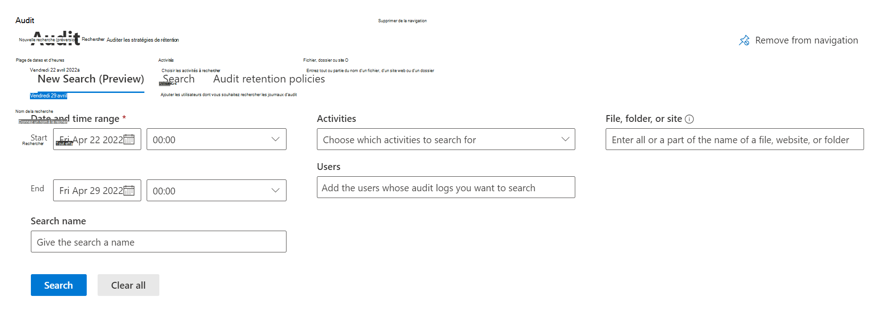

# Auditer la nouvelle recherche

Votre organisation a besoin d’accéder aux données d’événements critiques du journal d’audit pour obtenir des informations et examiner plus en détail les activités des utilisateurs. Auparavant, vos travaux de recherche dans l’interface utilisateur portail de conformité Microsoft Purview étaient limités dans leur capacité à créer des travaux de recherche d’audit simultanés et à passer en revue les travaux de recherche historiques. Ces travaux de recherche d’audit critiques avaient également une dépendance vis-à-vis de la fenêtre du navigateur qui restait ouverte pour se terminer.

La nouvelle recherche d’audit s’appuie sur les fonctionnalités de recherche existantes et inclut les principales améliorations suivantes :

- Les travaux de recherche lancés via l’interface utilisateur du portail de conformité ne nécessitent plus que la fenêtre du navigateur web reste ouverte pour se terminer. Ces travaux continueront à s’exécuter même après la fermeture de la fenêtre du navigateur.
- Les travaux de recherche terminés sont désormais stockés pendant 30 jours, ce qui permet aux clients de référencer les recherches d’audit historiques. Ces travaux de recherche sont présentés dans l’interface utilisateur, répertoriant le nom de la recherche, l’état du travail de recherche, la progression %, le nombre de résultats, l’heure de création et la recherche par.
- Chaque utilisateur de compte d’audit administrateur peut avoir un maximum de 10 travaux de recherche simultanés en cours, avec un maximum d’un travail de recherche non filtré.

[!INCLUDE [purview-preview](../includes/purview-preview.md)]

## Informations de prise en main

Consultez la documentation d’audit Microsoft Purview disponible, car les expériences de création et d’exportation de travaux de recherche présentent de nombreux parallèles avec l’expérience de recherche actuelle :

- [Effectuez une recherche dans le journal d’audit dans le portail de conformité Microsoft Purview](search-the-audit-log-in-security-and-compliance.md) (notez que PowerShell n’est pas encore compatible avec la recherche d’audit V2)
- [Propriétés détaillées dans le journal d’audit](detailed-properties-in-the-office-365-audit-log.md)
- [Exporter, configurer et afficher des enregistrements du journal d’audit](export-view-audit-log-records.md)

Informations supplémentaires :

- La recherche via une session EXO PowerShell à l’aide de l’applet de commande Search-UnifiedAuditLog n’est pas compatible avec la nouvelle recherche pour l’instant.
- Les travaux de recherche peuvent prendre les critères suivants : Plage de dates, Intervalle de temps, Nom du travail de recherche, Activités, Utilisateurs, Fichiers, Dossiers et Sites.
- La recherche et le filtrage à l’aide de la date, de l’heure, du nom de recherche, des activités et des utilisateurs sont entièrement fonctionnels
- Les données du journal d’audit sont stockées pendant la période de rétention définie, quelle que soit la suppression d’un travail de recherche

## Prise en main de l’audit de la nouvelle recherche

Suivez les étapes ci-dessous pour tester et valider l’expérience Auditer la nouvelle recherche :

1. Connectez-vous au [portail de conformité Microsoft Purview](https://compliance.microsoft.com)
2. Sélectionnez l’onglet **Audit** dans le volet gauche de la page d’accueil pour accéder à l’outil Audit
3. Sélectionner **l’onglet Nouvelle recherche** en haut de la page **Audit**

      

4. Testez différents travaux de recherche dans l’outil Audit New Search à l’aide de différents critères de recherche.
Voici quelques exemples de recherches différentes. Explorez ces différentes méthodes de recherche tout en effectuant des recherches dans le journal d’audit.

    - Effectuez une recherche sur différents intervalles de temps.
      - Un jour
      - Semaine
      - Mois
      - Plusieurs mois
    - Rechercher parmi les utilisateurs sélectionnés
    - Étendue de la recherche à l’aide du champ d’activités
    - Ajout d’un fichier, d’un dossier ou d’un site spécifique

  

5. Lancez une autre recherche de 2 à 9 dans le portail de conformité. Un maximum de 10 travaux de recherche peuvent être exécutés en parallèle dans un compte.
6. Explorez l’historique des travaux de recherche et sélectionnez différents travaux de recherche pour obtenir leurs données correspondantes à partir des résultats du travail de recherche. Les résultats peuvent être triés en fonction de leur heure de création en sélectionnant le bouton correspondant en haut du tableau.

  

7. Sélectionnez un travail de recherche pour afficher les résultats du travail affichés dans un format d’élément de ligne. Explorez les différentes fonctionnalités de l’interface utilisateur, notamment :

    - Référencement de la requête de recherche complète en haut de la page, qui inclut tous les critères de recherche entrés lors de la fin de la recherche d’origine
    - Sélection de différents résultats pour plus d’informations dans la fenêtre volante
    - Filtrage dans le travail de recherche à l’aide de l’adresse IP, de l’utilisateur, de l’activité, de la date, de l’élément et des détails.
    - Exportation de recherches non filtrées et non filtrées
    - Triez les résultats en cliquant sur les boutons correspondants en haut de la table, notamment Date, Adresse IP (le cas échéant), Utilisateur, Activité, Élément et Détail (le cas échéant).

  

## Vue d’ensemble du travail de recherche d’audit

- Les travaux de recherche peuvent prendre les critères suivants : Plage de dates, Intervalle de temps, Nom du travail de recherche, Activités, Utilisateurs, Fichiers, Dossiers et Sites.
- La zone de texte Fichier, dossier ou recherche de site renvoie tous les résultats associés pour le fichier, les dossiers et les sites correspondants
- Les travaux de recherche s’exécutent en bas de la page de recherche.
  - Les travaux de recherche peuvent être *mis en file d’attente*, *en cours* et *terminés*
  - Un maximum de 10 travaux de recherche *en cours* peuvent être effectués simultanément par utilisateur
- Les noms de recherche complets pour les travaux peuvent être affichés en pointant le curseur sur le travail de recherche
- Les travaux de recherche affichent le nom de la recherche, l’état, la progression %, le nombre de résultats, l’heure de création et la recherche par

## Vue d’ensemble des résultats de la recherche d’audit

- Les résultats de la recherche sont affichés dans un élément de ligne une fois qu’un travail de recherche est sélectionné
- La requête de recherche s’affiche en haut de la page des résultats du travail de recherche pour référence et le nombre total d’éléments
  > [!NOTE]
  > Le nombre total de résultats déduit les doublons, c’est pourquoi il peut être inférieur au nombre d’éléments dans la fenêtre principale de recherche d’audit
- Vous trouverez des informations sur la date, l’adresse IP, l’utilisateur, l’activité et l’élément dans la page des résultats du travail de recherche pour chaque élément.
- Sélectionnez une activité pour afficher une fenêtre volante avec plus de détails sur l’activité
- La fonctionnalité de filtrage des résultats des travaux de recherche peut vous aider à analyser les résultats.
- L’exportation est entièrement fonctionnelle et exporte tous les éléments de travail de recherche dans un fichier .csv. Export prend en charge les résultats jusqu’à 50 Ko.

## Foire aux questions

- **Existe-t-il un nombre maximal de travaux de recherche par utilisateur ?**
  Il y a un maximum de 10 travaux de recherche *en cours* par utilisateur. Si un utilisateur a besoin de plus de 10 travaux de recherche, il doit attendre qu’un travail *en cours* se termine ou supprime un travail de recherche. Nous vous serions reconnaissants de votre avis sur cette limite.
- **La suppression d’un travail de recherche supprime-t-elle les données back-end ?**
  Non, la suppression du travail de recherche supprime uniquement la définition du travail de recherche et le résultat de recherche associé.
