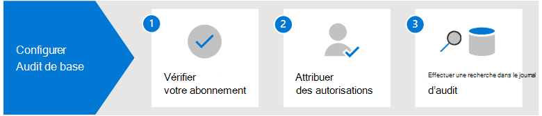

# Solutions d’audit dans Microsoft Purview

[!include[Purview banner](../includes/purview-rebrand-banner.md)]

Les solutions d’audit Microsoft Purview fournissent une solution intégrée pour aider les organisations à répondre efficacement aux événements de sécurité, aux enquêtes médico-légales, aux enquêtes internes et aux obligations de conformité. Des milliers d’opérations utilisateur et administrateur effectuées dans des dizaines de services et solutions Microsoft 365 sont capturées, enregistrées et conservées dans le journal d’audit unifié de votre organisation. Les enregistrements d'audit de ces événements peuvent être utilisables dans une recherchepar les responsables de la sécurité, les administrateurs informatiques, les équipes chargées de la lutte contre le risque interne et les enquêteurs chargés de la conformité et de la législation au sein de votre organisation. Cette fonctionnalité permet de gagner en visibilité sur les activités effectuées au sein de votre organisation Microsoft 365.

## Solutions d’audit Microsoft Purview

Microsoft Purview fournit deux solutions d’audit : Audit (Standard) et Audit (Premium).

### Audit (Standard)

Microsoft Purview Audit (Standard) vous offre la possibilité de consigner et de rechercher des activités auditées et d’alimenter vos enquêtes médico-légales, informatiques, de conformité et juridiques.

- **Activé par défaut**. L’audit (standard) est activé par défaut pour toutes les organisations avec l’abonnement approprié. Cela signifie que les enregistrements des activités auditées seront capturés et peuvent faire l’objet de recherches. La seule configuration requise consiste à attribuer les autorisations nécessaires pour accéder à l’outil de recherche de journaux d’audit (et à l’applet de commande correspondante) et à s’assurer que l’utilisateur dispose de la bonne licence pour les fonctionnalités Microsoft Purview Audit (Premium).
- **Des milliers d’événements d’audit peuvent faire l’objet de recherches**. Vous pouvez rechercher un large éventail d'activités auditées qui se produisent dans la plupart des services Microsoft 365 au sein de votre organisation. Pour obtenir une liste partielle des activités que vous pouvez rechercher, consultez [Activités auditées](search-the-audit-log-in-security-and-compliance.md#audited-activities). Pour obtenir la liste des services et fonctionnalités qui prennent en charge les activités auditées, consultez[Type d’enregistrement du journal d’audit](/office/office-365-management-api/office-365-management-activity-api-schema#auditlogrecordtype).
- **Outil de recherche d’audit dans le portail de conformité Microsoft Purview**. Utilisez l’outil de recherche de journaux d’audit dans le portail de conformité pour rechercher des enregistrements d’audit. Vous pouvez rechercher des activités spécifiques, des activités effectuées par des utilisateurs spécifiques et des activités effectuées avec une plage de dates. Voici une capture d’écran de l’Outil de recherche d’audit dans le Centre de conformité.

   

- **Applet de commande Search-UnifiedAuditLog**. Vous pouvez également utiliser **l'applet de commande Search-UnifiedAuditLog** dans Exchange Online PowerShell (l'applet de commande sous-jacente de l'outil de recherche) pour rechercher des événements d'audit ou à utiliser dans un script. Pour plus d'informations, consultez :

  - [Référence de la cmdlet Search-UnifiedAuditLog](/powershell/module/exchange/search-unifiedauditlog)
  - [Utiliser un script PowerShell pour effectuer une recherche dans le journal d’audit](audit-log-search-script.md)

- **Exporter des enregistrements d’audit dans un fichier CSV**. Après avoir exécuté l’outil de recherche dans le journal d’audit dans le portail de conformité, vous pouvez exporter les enregistrements d’audit renvoyés par la recherche dans un fichier CSV. Vous pouvez ainsi trier et filtrer des fichiers Microsoft Excel sur différentes propriétés d’enregistrement d’audit. Vous pouvez également utiliser la fonctionnalité de transformation de Power Query d’Excel pour diviser chaque propriété de l’objet JSON AuditData dans sa propre colonne. Cela vous permet d’afficher et de comparer efficacement des données similaires pour différents événements. Pour plus d’informations, consultez [Exporter, configurer et afficher des enregistrements du journal d’audit](export-view-audit-log-records.md).

- **Accès aux journaux d’audit via l’API Activité de gestion d’Office 365**. Une troisième méthode pour accéder et récupérer des enregistrements d’audit consiste à utiliser l’API Activité de gestion d’Office 365. Cela permet aux organisations de conserver les données d’audit pendant des périodes plus longues que les 90 jours par défaut, et de les importer dans une solution SIEM. Pour plus d’informations, consultez [Référence de l’API Activité de gestion Office 365](/office/office-365-management-api/office-365-management-activity-api-reference).

- **Rétention du journal d’audit de 90**. Lorsqu’une activité auditée est effectuée par un utilisateur ou un administrateur, un enregistrement d’audit est généré et stocké dans le journal d’audit pour votre organisation. Dans Audit (Standard), les enregistrements sont conservés pendant 90 jours, ce qui signifie que vous pouvez rechercher des activités qui se sont produites au cours des trois derniers mois.

### Audit (Premium)

Audit (Premium) s’appuie sur les fonctionnalités d’Audit (Standard) en fournissant des stratégies de conservation des journaux d’audit, une conservation plus longue des enregistrements d’audit, des événements cruciaux de grande valeur et un accès à une bande passante plus élevée à l’API Office 365 Management Activity.

- **Stratégies de rétention du journal d'audit**. Vous pouvez créer des stratégies de rétention personnalisées pour conserver les enregistrements d’audit pendant une durée maximale d’un an (et jusqu’à 10 ans pour les utilisateurs titulaires d’une licence de module complémentaire requise). Vous pouvez créer une stratégie de rétention des enregistrements d’audit en fonction du service sur lequel se produisent les activités auditées, des activités d’audit spécifiques ou de l’utilisateur qui effectue une activité auditée.

- **Rétention plus longue des enregistrements d’audit**. Les enregistrements d'audit Exchange, SharePoint et Azure Active Directory sont conservés par défaut pendant un an. Par défaut, les enregistrements d’audit pour toutes les autres activités sont conservés pendant 90 jours. Vous pouvez utiliser des stratégies de rétention du journal d’audit pour configurer des périodes de rétention plus longues.

- **Événements d’audit (Premium) cruciaux et de grande valeur**. Les enregistrements d’audit pour les événements cruciaux peuvent aider votre organisation à mener des enquêtes d’investigation et de conformité en offrant une visibilité sur des événements tels que le moment où les éléments de courrier ont été consultés, ou le moment où les éléments de courrier ont été répondus et transférés, ou quand et ce qu’un utilisateur a recherché dans Exchange Online et SharePoint. En ligne. Ces événements cruciaux peuvent vous aider à enquêter sur d’éventuelles violations et à déterminer l’étendue de la compromission.

- **Bande passante supérieure à l’API Activité de gestion Office 365**. Audit (Premium) fournit aux organisations plus de bande passante pour accéder aux journaux d’audit via l’API Office 365 Management Activity. Bien que toutes les organisations (qui disposent d’Audit (Standard) ou d’Audit (Premium)) se voient initialement allouer une base de 2 000 requêtes par minute, cette limite augmentera dynamiquement en fonction du nombre de sièges d’une organisation et de son abonnement à la licence. Ainsi, les organisations avec Audit (Premium) obtiennent environ deux fois plus de bande passante que les organisations avec Audit (Standard).

Pour plus d’informations sur les fonctionnalités d’audit (Premium), voir [Audit (Premium) dans Microsoft 365](advanced-audit.md).

## Comparaison des principales fonctionnalités

Le tableau suivant compare les fonctionnalités clés disponibles dans Audit (Standard) et Audit (Premium). Toutes les fonctionnalités d’Audit (Standard) sont incluses dans Audit (Premium).

|Fonctionnalité|Audit (Standard)|Audit (Premium)|
|:------|:-------------|:-------------|
|Activé par défaut|||
|Des milliers d’événements d’audit peuvent faire l’objet de recherches.|||
|Outil de recherche d’audit dans le portail de conformité|||
|Cmdlet Search-UnifiedAuditLog.|||
|Exporter des enregistrements d’audit dans un fichier CSV.|||
|Accès aux journaux d’audit via l’API Activité de gestion Office 3651.|||
|Rétention du journal d’audit de 90|||
|Rétention du journal d’audit d’un an|||
|Rétention du journal d’audit de 10 ans 2|||
|Stratégies de rétention du journal d'audit|||
|Événements importants et essentiels.|||

> [!NOTE]
> 1 Audit (Premium) inclut un accès à bande passante plus élevée à l’API Office 365 Management Activity, qui fournit un accès plus rapide aux données d’audit. 2 En plus de la licence requise pour Audit (Premium) (décrite dans la section suivante), un utilisateur doit se voir attribuer une licence supplémentaire de conservation du journal d’audit de 10 ans pour conserver ses enregistrements d’audit pendant 10 ans.

## Conditions d'octroi de licence

Les sections suivantes identifient les exigences de licence pour Audit (Standard) et Audit (Premium). La fonctionnalité Audit (Standard) est incluse avec Audit (Premium).

### Audit (Standard)

- Souscription De base Microsoft Business
- Abonnement Microsoft Business Standard
- Abonnement Microsoft 365 Apps for business
- Abonnement Microsoft 365 Entreprise E3
- Microsoft 365 Business Premium
- Abonnement Microsoft 365 Éducation A3
- Abonnement Microsoft 365 pour le gouvernement américain G3
- Abonnement Microsoft 365 pour le gouvernement américain G1
- Abonnement Microsoft 365 Première ligne F1 ou F3 ou module complémentaire Sécurité F5
- Abonnement Office 365 Entreprise E3
- Abonnement Office 365 Entreprise E1
- Abonnement Office 365 Éducation A1
- Abonnement Office 365 Éducation A3

### Audit (Premium)

- Abonnement Microsoft 365 Entreprise E5
- Abonnement Microsoft 365 Entreprise E3 + module complémentaire Microsoft 365 E5 Conformité
- Abonnement Microsoft 365 Entreprise E3 + module complémentaire Microsoft 365 E5 eDiscovery et Audit
- Abonnement Microsoft 365 Éducation A5
- Abonnement Microsoft 365 Éducation A3 + module complémentaire Microsoft 365 A5 Conformité
- Abonnement Microsoft 365 Éducation A3 + module complémentaire Microsoft 365 A5 eDiscovery et Audit
- Microsoft 365 pour le gouvernement américain G5
- Abonnement Microsoft 365 Government G3 + le module complémentaire de conformité Microsoft 365 G5
- Abonnement Microsoft 365 Government G3 + le module complémentaire Microsoft 365 G5 eDiscovery et Audit
- Microsoft 365 Première ligne F5 Conformité ou F5 Sécurité et module complémentaire Conformité
- Abonnement Office 365 Entreprise E5
- Abonnement Office 365 Éducation A5

## Configurer les solutions d’audit Microsoft Purview

Pour commencer à utiliser les solutions d’audit dans Microsoft Purview, consultez les conseils de configuration suivants.

### Configurer l’audit (Standard)

La première étape consiste à configurer Audit (Standard), puis à lancer des recherches dans le journal d’audit.

1. Vérifiez que votre organisation dispose d’un abonnement prenant en charge Audit (Standard) et, le cas échéant, d’un abonnement prenant en charge Audit (Premium).

2. Attribuez des autorisations dans Exchange Online aux personnes de votre organisation qui utiliseront l’outil de recherche de journaux d’audit dans le portail de conformité ou utiliseront la cmdlet **Search-UnifiedAuditLog**. Plus précisément, les utilisateurs doivent avoir le rôle Journaux d’audit en affichage seul ou Journaux d’audit dans Exchange Online.

3. Effectuer une recherche dans le journal d’audit. À l’issue des étapes 1 et 2, les utilisateurs de votre organisation peuvent utiliser l’outil de recherche dans le journal d’audit (ou cmdlet correspondante) pour rechercher des activités auditées.

Pour des instructions plus détaillées, voir [Configurer l’audit (Standard)](set-up-basic-audit.md).

### Configurer l’audit (Premium)

Si votre organisation a un abonnement qui prend en charge Audit (Premium), effectuez les étapes suivantes pour configurer et utiliser les fonctionnalités supplémentaires dans Audit (Premium).

1. Configurer Audit (Premium) pour les utilisateurs. Cette étape comprend les tâches suivantes :

   - Vérifier que les utilisateurs disposent de la licence ou de la licence complémentaire appropriée pour Audit (Premium).
  
   - L’activation de l’application/du plan de service Audit (Premium) doit être destinée à ces utilisateurs.
  
   - Activer l’audit des événements cruciaux, puis activer l’application/plan de service Audit (Premium) pour ces utilisateurs.

2. Activer la journalisation des événements d’audit (Premium) lorsque les utilisateurs effectuent des recherches dans Exchange Online et SharePoint Online.

3. Configurer des stratégies de rétention du journal d’audit. En plus de la stratégie par défaut qui conserve les enregistrements d’audit Exchange, SharePoint et Azure AD pendant un an, vous pouvez créer des stratégies de rétention supplémentaires pour le journal d’audit afin de répondre aux exigences des équipes de sécurité, informatique et de conformité de votre organisation.

4. Rechercher des événements d’audit (Premium) cruciaux et d’autres activités lors de la conduite d’enquêtes médico-légales. Après avoir terminé les étapes 1 et 2, vous pouvez rechercher dans le journal d’audit des événements d’audit (Premium) et d’autres activités lors d’enquêtes judiciaires sur des comptes compromis et d’autres types d’enquêtes de sécurité ou de conformité.

Pour des instructions plus détaillées, voir [Configurer l’audit (Premium)](set-up-advanced-audit.md).

<!--
## Encrypt audit records using Customer Key

You can enable Customer Key encryption for audit records. Auditing builds on the [Service encryption with Customer Key](customer-key-overview.md) to encrypt sensitive information in your organization's auditing data. Implementing Customer Key provides extra protection by preventing unauthorized systems or Microsoft data center personnel from viewing your auditing data in the auditing pipeline and at rest. Using Customer Key to encrypt your auditing data also helps you meet regulatory or compliance obligations because your organization provides and controls the encryption keys.

To implement Customer Key for auditing, you have to create a multi-workload Data Encryption Policy (DEP), which defines the encryption hierarchy. For detailed step-by-step instructions, see [Set up Customer Key](customer-key-set-up.md).

> [!NOTE]
> Not all audit records in your organization are encrypted. The Microsoft Purview service that generates specific audit records for activity in that service defines whether the audit record is encrypted or not.
-->

## Formation

Former votre équipe d’opérations de sécurité, vos administrateurs informatiques et votre équipe d’enquêteurs de conformité aux fondamentaux de l’audit (standard) et de l’audit (premium) peut aider votre organisation à démarrer plus rapidement en utilisant l’audit pour vous aider dans vos enquêtes. Microsoft Purview fournit la ressource suivante pour aider ces utilisateurs de votre organisation à démarrer l’audit : [Décrire les fonctionnalités eDiscovery et d’audit de Microsoft Purview](/learn/modules/describe-ediscovery-capabilities-of-microsoft-365).
