# <a name="manage-the-lifecycle-of-sharepoint-documents-with-retention-labels"></a>Gérer le cycle de vie des documents SharePoint avec étiquettes de rétention

>*[Guide de sécurité et conformité pour les licences Microsoft 365](https://aka.ms/ComplianceSD).*

Cet article vous explique comment gérer le cycle de vie de documents relatifs à des produits stockés dans SharePoint Online en utilisant des étiquettes de rétention, en particulier en appliquant automatiquement des étiquettes et en configurant une rétention basée sur les événements. La fonctionnalité d’application automatique utilise la classification de documents en utilisant des métadonnées SharePoint. Le scénario décrit dans cet article est basé sur des documents relatifs à des produits, mais les mêmes concepts peuvent être utilisés dans d’autres scénarios. Par exemple, dans l’industrie pétrolière et gazière, vous pouvez gérer le cycle de vie des documents relatifs aux biens matériels tels que les plateformes pétrolières, les registres de forage ou les licences de production. Le secteur des services financiers, vous permet de gérer les documents associés aux comptes bancaires, aux hypothèques ou aux contrats d’assurance. Dans le secteur public, vous pouvez gérer les documents relatifs aux permis de construction ou aux formulaires fiscaux.

Examinons le scénario de cet article. Nous examinerons l’architecture des informations et la définition des étiquettes de rétention. Nous examinerons ensuite la classification des documents en appliquant automatiquement les étiquettes, puis en générant les événements qui commencent au début de la période de rétention.

## <a name="information-architecture"></a>Architecture des informations

Le scénario de cet article est basé sur une entreprise manufacturière qui utilise SharePoint Online pour stocker tous les documents relatifs aux produits qu’elle développe. Ces documents incluent les spécifications du produit, les accords avec des fournisseurs et les manuels de l’utilisateur. Lorsque ces documents sont stockés dans SharePoint dans le cadre des stratégies de gestion de contenu d’entreprise, les métadonnées de document sont définies et utilisées pour les classifier. Chaque document possède les propriétés de métadonnées suivantes :

- **Type de document** (par exemple, spécification de produit, contrat et manuel de l’utilisateur)

- **Nom du produit**

- **État** (brouillon ou final)

Ces métadonnées constituent le type de contenu de base appelé **Document de production** pour tous les documents.

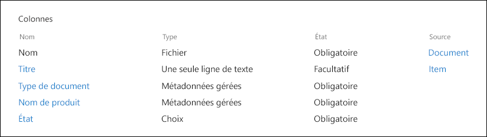

> [!NOTE]
> Les propriétés **Type de document** et **État** sont utilisées par les stratégies de rétention plus tard dans le scénario pour classifier et appliquer automatiquement les étiquettes de rétention.

Nous pouvons avoir plusieurs types de contenu représentant différents types de documents, mais nous allons nous concentrer sur la documentation du produit.

Dans ce scénario, nous utilisons le service de métadonnées gérées et le magasin de termes pour créer un ensemble de termes pour **Type de document** et un autre pour **Nom du produit**. Pour chaque ensemble de termes, nous créons un terme pour chaque valeur. Il ressemble à ceci dans le magasin de termes pour votre organisation SharePoint :


Le type de contenu peut être créé et publié à l’aide du [Hub type de contenu](https://support.office.com/article/manage-content-type-publishing-06f39ac0-5576-4b68-abbc-82b68334889b). Vous pouvez également créer et publier un type de contenu à l’aide d’outils d’approvisionnement de site tels que le [infrastructure d’approvisionnement PnP](https://docs.microsoft.com/sharepoint/dev/solution-guidance/pnp-provisioning-framework) ou le [Schéma JSON de création de site](https://docs.microsoft.com/sharepoint/dev/declarative-customization/site-design-json-schema#define-a-new-content-type).

Chaque produit possède un site SharePoint Online dédié qui contient une bibliothèque de documents, avec les types de contenu appropriés activés. Tous les documents sont stockés dans cette bibliothèque de documents.


> [!NOTE]
> Au lieu d’avoir un site SharePoint Online par produit, l’entreprise manufacturière dans ce scénario pourrait utiliser une équipe Microsoft par produit qui prend en charge la collaboration avec les membres de l’équipe, tels que la conversation permanente et l’onglet **Fichiers** de l’équipe pour la gestion des documents. Dans cet article, nous nous focalisons uniquement sur les documents, par conséquent nous n'utiliserons qu'un site.

Voici un aperçu de la bibliothèque de documents pour le produit widget de rotation :

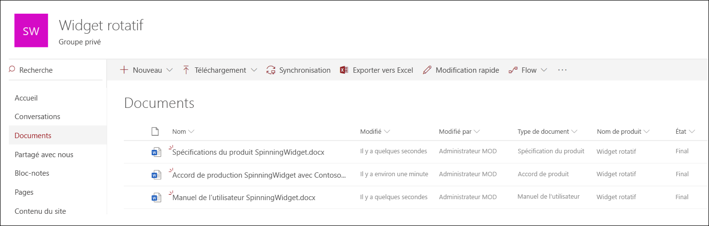

Maintenant que nous avons l’architecture d’informations de base en place pour la gestion des documents, examinons la stratégie de rétention et de suppression des documents qui utilisent les métadonnées et la classification des documents.

## <a name="retention-and-disposition"></a>Rétention et destruction

Les stratégies de conformité et de gouvernance des données de l'entreprise manufacturière dictent la façon dont les données sont conservées et supprimées. Les documents relatifs à des produits doivent être conservés pendant toute la durée de fabrication du produit et pendant une période donnée. Cette période est différente pour les spécifications, les accords et les manuels d’utilisation du produit. Le tableau suivant indique les conditions requises pour la rétention et la suppression :

| **Type de document**          | **Rétention**                          | **Destruction**                              |
| -------------------------- | -------------------------------------- | -------------------------------------------- |
| Spécification du produit      | 5 ans après la cessation de la production  | Supprimer                                       |
| Accord de produit          | 10 ans après la cessation de la production | Révision                                       |
| Manuel de l’utilisateur                | 5 ans après la cessation de la production  | Supprimer                                       |
| Tous les autres types de documents | Ne pas conserver activement d’autres documents  | Supprimer lorsque le document date de plus de 3 ans<sup>\*</sup>  |
|||

> [!NOTE]
> <sup>\*</sup> Un document est considéré comme datant de plus de 3 ans s’il n’a pas été modifié au cours des 3 dernières années.

Dans le centre de sécurité et conformité, nous créons les étiquettes de rétention suivantes :

  - Spécification du produit

  - Accord de produit

  - Manuel de l’utilisateur

Dans cet article, nous expliquons uniquement comment créer et appliquer automatiquement l’étiquette de rétention de la spécification de produit. Pour implémenter le scénario complet, vous devez créer et appliquer automatiquement des étiquettes de rétention pour les deux autres types de documents.

### <a name="settings-for-the-product-specification-retention-label"></a>Paramètres de l’étiquette de rétention de la spécification de produit

Voici le [plan de gestion de fichiers](file-plan-manager.md) l’étiquette de rétention de la spécification de produit : 

- **Nom :** Spécifications du produit

- **Description pour les administrateurs :** étiquette de spécification de produit, conservée pendant cinq ans après la cessation de la production, la suppression automatique, la rétention basée sur les événements, le type d’événement est la cessation du produit.

- **Description pour les utilisateurs :** retenir pendant cinq ans après la cessation de production.

- **Action de rétention :** conserver et supprimer

- **Durée de rétention :** cinq ans (1825 jours)

- **Étiquette d’enregistrement** : configurez l’étiquette de rétention pour classifier le contenu en tant qu’[enregistrement](records.md) (les documents classés en tant qu’enregistrement ne peuvent pas être modifiés ou supprimés par les utilisateurs).

- **Descripteurs de plan de gestion de fichiers :** (pour simplifier le scénario, aucun descripteur de fichier n’est fourni)

La capture d’écran suivante montre les paramètres lorsque vous créez l’[étiquette de rétention](retention.md#retention-labels) de la spécification du produit dans le centre de conformité de Microsoft 365. Vous pouvez créer le type d’événement de **Cessation de produit** lorsque vous créez l’étiquette de rétention. Consultez les étapes suivantes.

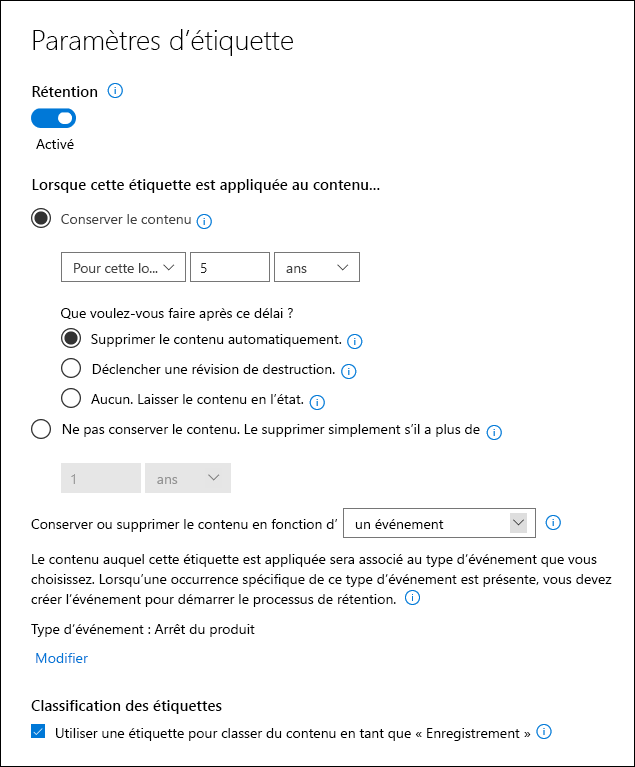

> [!NOTE]
> Aux fins pratiques et pour éviter d’avoir besoin d’attendre 5 ans pour afficher automatiquement un document supprimé, définissez la durée de rétention à 1 jour si vous recréez ce scénario dans votre environnement de test.

### <a name="create-an-event-type-when-creating-a-retention-label"></a>Créer un type d’événement lors de la création d’une étiquette de rétention

1. Dans **Conserver ou supprimer le contenu basé** dans la liste déroulante, sélectionnez **un d’événement**.

2. Sélectionnez **Choisir un type d’événement**.

   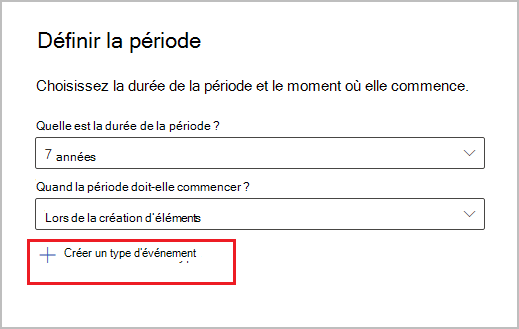

3. Dans la page **Choisir un type d’événement**, sélectionnez **Vous pouvez créer des types d’événements ici**.

4. Créez un type d’événement nommé **Cessation de produit**, donnez une description, puis sélectionnez **Terminer** pour le créer. 

5. Dans la page **choisir un type d’événement**, sélectionnez le type d’événement **Cessation de produit** que vous avez créé, puis sélectionnez **Ajouter**.

Voici à quoi ressemblent les paramètres de l’étiquette de rétention de spécification de produit. Sélectionnez **Créer cette étiquette** pour la créer.


> [!TIP]
> Pour plus d’informations, voir [Créer une étiquette dont la période de rétention est basée sur un événement](event-driven-retention.md#step-1-create-a-label-whose-retention-period-is-based-on-an-event).

À présent que l’étiquette de rétention est créée, voyons comment appliquer automatiquement l’étiquette de rétention au contenu de la spécification de produit.

## <a name="classifying-content-by-auto-applying-retention-labels"></a>Classification de contenu en appliquant automatiquement des étiquettes de rétention

Nous allons [appliquer automatiquement](apply-retention-labels-automatically.md) les étiquettes de rétention que nous avons créées pour ce scénario à l’aide de KQL (Keyword Query Language). KQL est le langage utilisé pour créer des requêtes de recherche. Dans KQL, vous pouvez effectuer une recherche à l’aide de mots clés ou de propriétés gérées. Pour plus d’informations sur le KQL, voir <https://docs.microsoft.com/sharepoint/dev/general-development/keyword-query-language-kql-syntax-reference>

À un niveau élevé, nous voulons indiquer à Microsoft 365 d’appliquer l’étiquette de rétention de la **spécification de produit** à tous les documents qui ont un **État** de spécification**Final** et un **Type de document** de **Spécification de produit**. Rappelez-vous que **État** et **Type de document** correspondent aux colonnes de site précédemment définies pour le type de contenu documentation produit dans la section [Architecture d’informations](#information-architecture). Pour y parvenir, vous devez configurer le schéma de recherche.

Lorsque SharePoint indexe le contenu, il génère automatiquement des propriétés analysées pour chaque colonne de site. Pour ce scénario, nous sommes intéressés par les propriétés **Type de document** et **État**. Vous avez besoin de documents dans la bibliothèque en utilisant le type de contenu approprié et avoir renseigné les colonnes de site pour que la recherche puisse créer les propriétés analysées.

Dans le centre d’administration SharePoint, nous pouvons ouvrir la configuration de la recherche et sélectionner **Gérer le schéma de recherche** pour afficher et configurer les propriétés analysées.

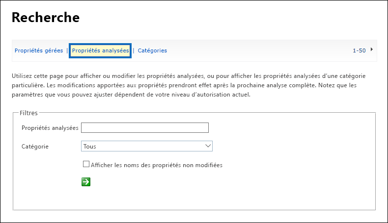

Si vous entrez **État** dans la boîte de dialogue **Propriétés analysées**, puis sélectionnez la flèche verte, un résultat semblable au suivant s’affiche :

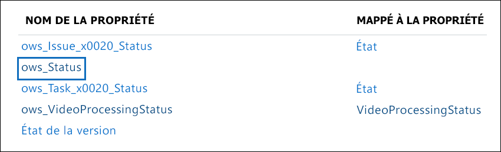

La propriété **ows\_\_État** (remarquez le double trait de soulignement) est celui qui nous intéresse. Elle correspond à la propriété **État** du type de contenu document de production.

À présent, si vous tapez **OWS\_document** et que vous sélectionnez la flèche verte, vous devriez voir ce qui suit :

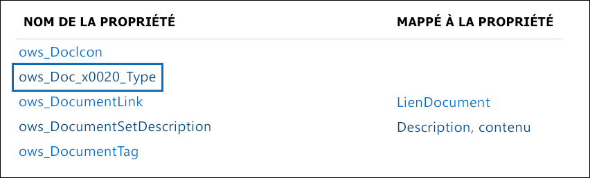

La propriété **ows\_document\_x0020\_Type** est la deuxième propriété qui nous intéresse. Elle correspond à la propriété **Type de document** du type de contenu document de production.

> [!TIP]
> Pour identifier le nom d’une propriété analysée dans le cadre de ce scénario, accédez à la bibliothèque de documents qui contient les documents de production, puis accédez aux paramètres de la bibliothèque. Dans les **Colonnes**, sélectionnez le nom de la colonne (par exemple, **État** ou **type de document**) pour ouvrir la page colonne du site. Le paramètre **Champ** dans l’URL de la page contient le nom du champ. Ce nom de champ, préfixé avec « ows_ », est le nom de la propriété analysée. Par exemple, l’URL `https://tenantname.sharepoint.com/sites/SpinningWidget/_layouts/15/FldEdit.aspx?List=%7BC38C2F45-3BD6-4C3B-AA3B-EF5DF6B3D172%7D&Field=_Status` correspond à **ows\_\_État** propriété analysée.

Si les propriétés analysées que vous recherchez n’apparaissent pas dans la section gérer le schéma de recherche du centre d’administration SharePoint, cela peut être dû à l’une des raisons suivantes :

- Les documents n’ont pas été indexés. Vous pouvez forcer la réindexation de la bibliothèque en accédant aux paramètres de la bibliothèque de documents > Paramètres avancés.

- Si la bibliothèque de documents se trouve sur un site moderne, assurez-vous que l’administrateur SharePoint est également un administrateur de collection de sites.

Pour plus d’informations sur les propriétés gérées et analysées, voir [A propos des propriétés gérées créées automatiquement dans le serveur SharePoint](https://docs.microsoft.com/sharepoint/technical-reference/automatically-created-managed-properties-in-sharepoint).

### <a name="mapping-crawled-properties-to-pre-defined-managed-properties"></a>Mappage des propriétés analysées avec des propriétés gérées prédéfinies

KQL ne peut pas utiliser les propriétés analysées dans les requêtes de recherche. Elle doit utiliser une propriété gérée. Dans un scénario de recherche normal, vous créez une propriété gérée et la mappez à la propriété analysée dont vous avez besoin. Toutefois, pour appliquer automatiquement des étiquettes de rétention, vous pouvez uniquement spécifier dans propriétés gérées prédéfinies de KQL et non les propriétés gérées personnalisées. Un ensemble de propriétés gérées prédéfinies déjà créé dans le système pour la chaîne RefinableString00 à RefinableString199 peut être utilisé. Pour obtenir la liste complète, voir [Propriétés gérées non utilisées par défaut](https://docs.microsoft.com/sharepoint/manage-search-schema#default-unused-managed-properties). Ces propriétés gérées par défaut sont généralement utilisées pour définir des affinements de recherche.

Pour que la requête KQL fonctionne et applique automatiquement l’étiquette de rétention correcte au contenu du document de produit, nous mappez les propriétés analysées **ows\_doc\_x0020\_Type** et **os\_\_État** à deux propriété gérée utilisable dans une recherche approfondie. Dans notre environnement de test pour ce scénario, **RefinableString00** et **RefinableString01** ne sont pas utilisées. Nous avons déterminé ceci en examinant les **Propriétés gérées** dans **Gérer le schéma de recherche** dans le centre d’administration SharePoint.

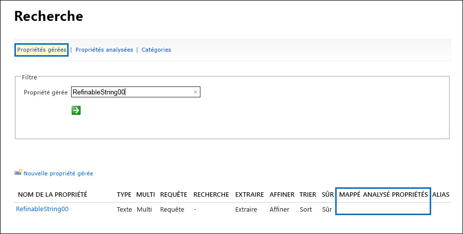

Notez que la colonne **Propriétés analysées mappées** de la capture d’écran précédente est vide.

Pour mapper la propriété analysée **ows\_doc\_x0020\_Type**, procédez comme suit :

1. Dans la zone de filtre **Propriété gérée**, tapez **RefinableString00** puis sélectionnez la flèche verte.

2. Dans la liste des résultats, sé le lien **RefinableString00**, puis faites défiler vers le bas jusqu’à la section**Mappages aux propriétés analysées**.  

3. Sélectionnez **Ajouter un mappage**, puis tapez **ows\_doc\_x0020\_Type** dans la zone **Rechercher un nom de propriété analysée** dans la fenêtre **Sélection de propriété analysée**. Sélectionnez **Rechercher**.  

4. Dans la liste des résultats, sélectionnez **ows\_doc\_x0020\_Type** puis sélectionnez **OK**.

   Dans la section **Propriétés analysées mappées**, vous devriez voir quelque chose de semblable à la capture d’écran suivante :

   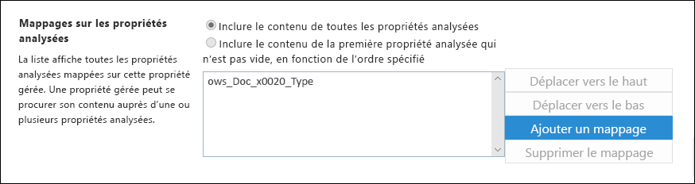

5. Faites défiler l’écran vers le bas de la page, sélectionnez sur **OK** pour enregistrer le mappage.

Répétez cette procédure pour mapper RefinableString01 et ows\_\_État.

Vous devez à présent avoir deux propriétés gérées mappées aux deux propriétés analysées :


Nous allons vérifier qu’il est correctement configuré en exécutant une recherche d’entreprise. Dans un navigateur, accédez à https://yourtenant.sharepoint.com/search. Dans la zone de recherche, tapez **RefinableString00 : « spécification de produit »** puis appuyez sur entrée. Cette opération doit renvoyer tous les documents qui ont une spécification de produit en tant que **Type de document**.

Dans la zone de recherche, tapez **RefinableString00 : « spécification de produit » ET RefinableString01 : final**, puis appuyez sur entrée. Celle-ci doit renvoyer tous les documents qui ont une spécification de produit en tant que **Type de document** et l’état de **Final**.

### <a name="creating-the-auto-apply-label-policies"></a>Création des stratégies d’étiquette à application automatique

Maintenant que nous avons vérifié que la requête KQL fonctionne correctement, créons la stratégie d’étiquette qui utilise une requête KQL pour appliquer automatiquement l’étiquette de rétention de la spécification de produit aux documents appropriés.

1. Dans le [centre de conformité](https://compliance.microsoft.com/homepage), accédez à **Gestion des enregistrements** > **Stratégies d’étiquette**, puis sélectionnez **Appliquer automatiquement une étiquette**. 

   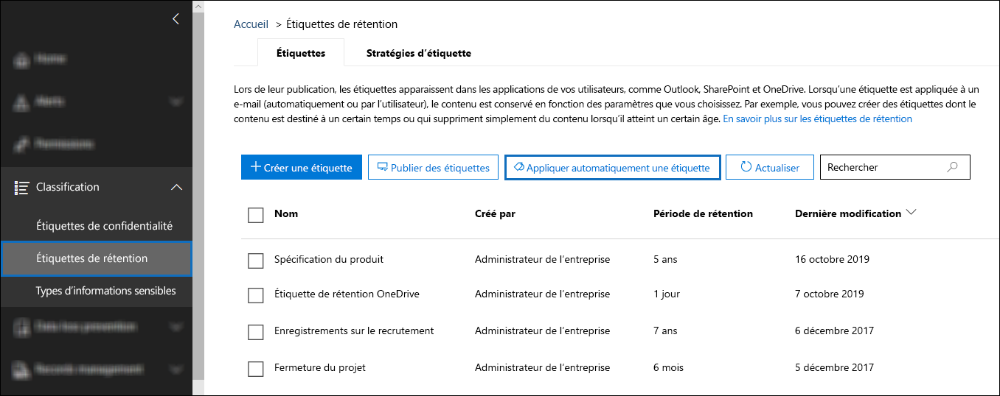

2. Dans la page de l’Assistant **Choisir une étiquette à appliquer automatiquement**, sélectionnez **Choisir une étiquette à appliquer automatiquement**.

3. Dans la liste des étiquettes, sélectionnez **Spécification de produit**, sélectionnez **Ajouter**, puis **Suivant**.

4. Sélectionnez **Appliquer l’étiquette au contenu comportant des mots ou phrases ou propriétés spécifiques**, puis sélectionnez **Suivant**.

   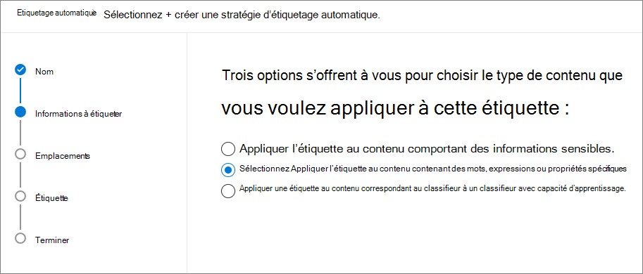

   Dans l’étape suivante, vous allez fournir la même requête de recherche KQL que nous avons testée dans la section précédente. Si vous vous souvenez, cette requête renvoyait tous les documents de spécification de produit présentant l’état final. Le résultat de l’utilisation de cette même requête dans la stratégie d’étiquette signifie que l’étiquette de rétention de la spécification de produit est automatiquement appliquée à tous les documents qui correspondent à cette requête de recherche.

5. Dans la zone **Éditeur de requête de mot clé**, tapez**RefinableString00 : « spécification de produit » ET RefinableString01 : Final**, puis sélectionnez **Suivant**.

   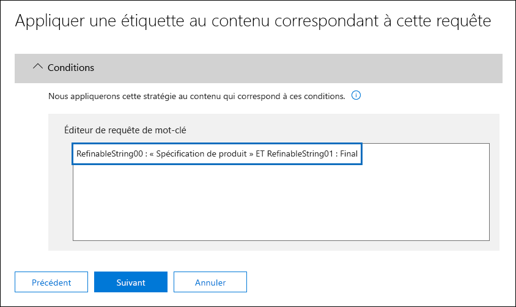

6. Tapez un nom (par exemple, **Appliquer automatiquement une étiquette de spécification de produit**), ainsi qu’une description facultative pour la stratégie d’étiquette, puis sélectionnez **Suivant**. 

7. Dans la page de l'assistant **Choisir des emplacements**, sélectionnez les emplacements de contenu auxquels vous voulez appliquer la stratégie. Dans ce scénario, nous appliquons la stratégie uniquement aux emplacements SharePoint, car tous les documents de production sont stockés uniquement dans les bibliothèques de documents SharePoint. Sélectionnez **Me laisser choisir des emplacements spécifiques**, activez ou désactivez l’état du courrier Exchange, des comptes OneDrive et de Groupes Microsoft 365, et vérifiez que l’état des sites SharePoint est activé. 

    

   > [!TIP]
   > Au lieu d’appliquer la stratégie à tous les sites SharePoint, vous pouvez sélectionner **Choisir des sites** et ajouter les URL de sites SharePoint spécifiques.

8. Sélectionnez **Suivant** pour afficher la page **Vérifier vos paramètres**. 

    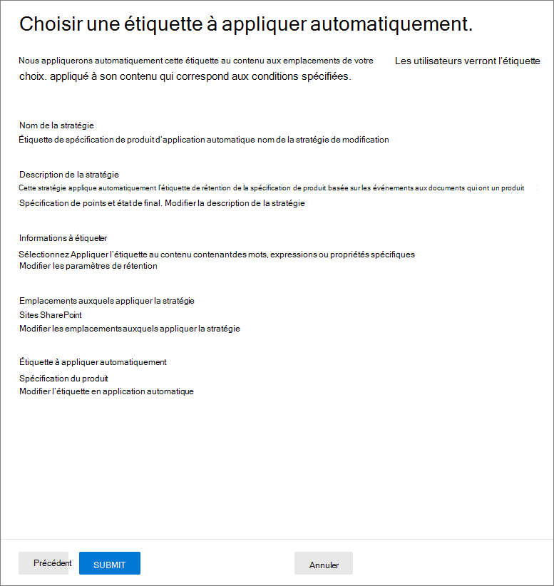

9. Sélectionnez **Appliquer automatiquement** pour créer la stratégie d’étiquette. Appliquer automatique une étiquette de spécification de produit à tous les documents correspondant à la requête de recherche KQL que vous avez fournie prend jusqu’à sept jours.

### <a name="verifying-the-retention-label-was-automatically-applied"></a>La vérification de l’étiquette de rétention a été appliquée automatiquement

Après sept jours, utilisez l’[Explorateur des activités d’étiquette](view-label-activity-for-documents.md) dans le centre de conformité pour voir que la stratégie d’étiquette que nous avons créée a appliqué automatiquement les étiquettes de rétention dans ce scénario aux documents de produit. 

Une autre étape de la vérification consiste à consulter les propriétés du document dans la bibliothèque de documents. Dans le panneau d’informations, vous pouvez voir que l’étiquette de rétention est appliquée à un document sélectionné.

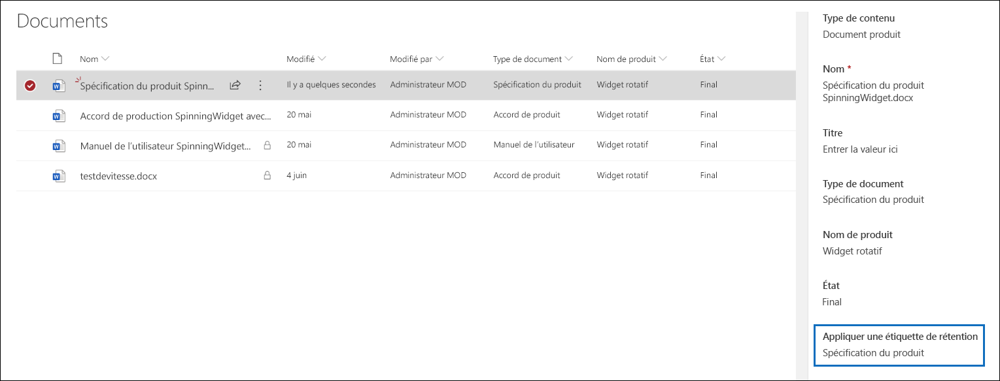

Étant donné que les étiquettes de rétention ont été appliquées automatiquement aux documents, les documents sont protégés contre les suppressions, car l’étiquette de rétention a été configurée de manière à déclarer les documents comme enregistrements. Par exemple, un message d’erreur apparaît dans la capture d’écran suivante lorsque nous essayons de supprimer l’un de ces documents.

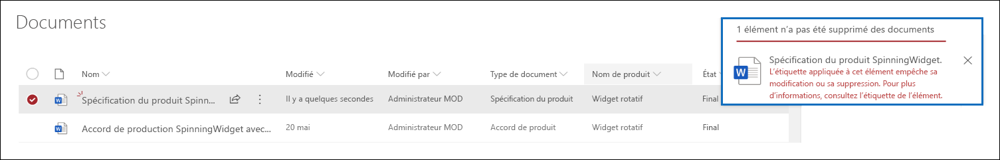

## <a name="generating-the-events-that-trigger-the-start-of-the-retention-period"></a>Génération des événements qui déclenchent le début de la période de rétention

À présent que les étiquettes de rétention ont été appliquées automatiquement, nous allons nous concentrer sur l’événement indiquant la fin de la production pour un produit spécifique. Lorsque cet événement se produit, il déclenche le début de la période de rétention définie dans les étiquettes de rétention appliquées automatiquement aux documents. Par exemple, pour les documents de spécification de produit, la période de rétention de 5 ans commence lorsque l’événement « fin de production » est déclenché.

Vous pouvez créer manuellement l’événement dans le centre de sécurité et conformité en accédant à **Gestion des enregistrements** > **Événements**, puis en choisissant le type d’événement, en définissant les ID d’actif appropriés et en entrant une date pour l’événement. Pour plus d’informations, consultez [Débuter la rétention lorsqu’un événement se produit](event-driven-retention.md).

Pour ce scénario, nous allons créer automatiquement l’événement en le générant à partir d’un système de production externe. Dans ce cas, le système qui génère l’événement est une simple liste SharePoint qui indique si un produit est en production et un [Microsoft Flow](https://docs.microsoft.com/flow/getting-started) associé à la liste et qui déclenche l’événement. Dans un scénario concret, il peut s’agit d’un système qui génère l’événement, tel qu’un système RH ou CRM. Flow contient un grand nombre d’interactions et de blocs de construction prêts à l’emploi pour les charges de travail Microsoft 365 telles qu’Exchange, SharePoint, Teams et Dynamics 365, ainsi que des applications tierces telles que Twitter, Box, Salesforce et Workdays. Vous pouvez ainsi intégrer facilement Flow à ces systèmes. Pour plus d’informations, voir[Automatiser la rétention basée sur un événement](automate-event-driven-retention.md).

La capture d’écran suivante montre la liste SharePoint qui sera utilisée pour déclencher l’événement : 


Ces deux produits sont actuellement en production, ce qui est indiqué par la valeur **Oui** dans la colonne **En production**. Lorsque la valeur dans cette colonne est définie sur **Aucun** pour un produit, le flux associé à la liste génère automatiquement l’événement. Cela a pour effet de déclencher le début de la période de rétention de l’étiquette de rétention appliquée automatiquement aux documents correspondants du produit.

Pour ce scénario, nous utilisons le flux suivant pour déclencher l’événement :

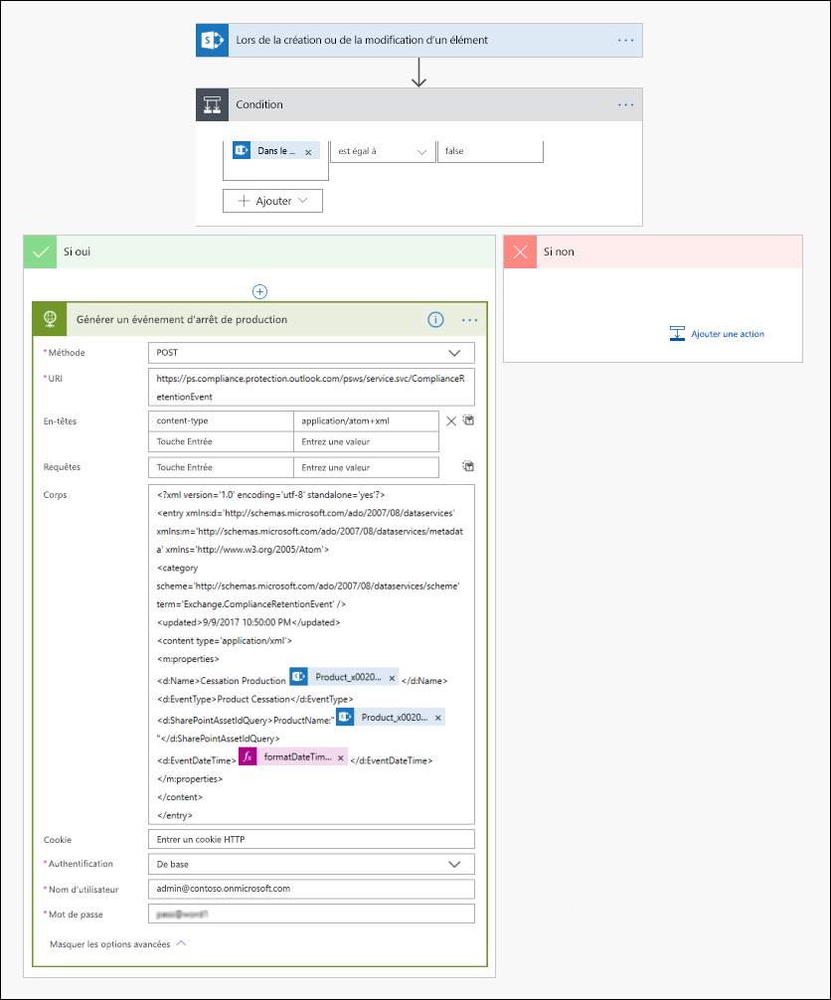

Pour créer ce flux, commencez à partir d’un connecteur SharePoint et sélectionnez le déclencheur**Lorsqu’un élément est créé ou modifié**. Spécifiez l’adresse du site et le nom de la liste, puis ajoutez une condition basée sur la date à laquelle la valeur de la colonne de liste **En production** est définie sur **Aucun** (ou égal à faux dans la carte de condition). Ajoutez ensuite une action basée sur le modèle HTTP intégré. Utilisez les valeurs de la section suivante pour configurer l’action HTTP. Vous pouvez copier les valeurs des propriétés d’URI et de corps de la section ci-dessous, puis les coller dans le modèle.

- **Method** : PUBLIER
- **URI** : `https://ps.compliance.protection.outlook.com/psws/service.svc/ComplianceRetentionEvent`
- **Headers** : Clé = Type de contenu, Valeur = application/atom+xml
- **Body** :
    
    ```HTML
    <?xml version='1.0' encoding='utf-8' standalone='yes'>
    <entry xmlns:d='http://schemas.microsoft.com/ado/2007/08/dataservices' xmlns:m='http://schemas.microsoft.com/ado/2007/08/dataservices/metadata' xmlns='https://www.w3.org/2005/Atom'>
    <category scheme='http://schemas.microsoft.com/ado/2007/08/dataservices/scheme' term='Exchange.ComplianceRetentionEvent'>
    <updated>9/9/2017 10:50:00 PM</updated>
    <content type='application/xml'>
    <m:properties>
    <d:Name>Cessation Production @{triggerBody()?['Product_x0020_Name']?['Value']}</d:Name>
    <d:EventType>Product Cessation&lt;</d:EventType>
    <d:SharePointAssetIdQuery>ProductName:&quot;@{triggerBody()?['Product_x0020_Name']?['Value']}<d:SharePointAssetIdQuery>
    <d:EventDateTime>@{formatDateTime(utcNow(),'yyyy-MM-dd')}</d:EventDateTime>
    </m:properties>
    </content&gt>
    </entry>
    ```

La section suivante décrit les paramètres de la propriété du *corps* de l'action qui doit être configurée spécifiquement pour ce scénario.

- **Name** : ce paramètre spécifie le nom de l’événement qui est créé dans le centre de sécurité et conformité. Dans ce scénario, le nom est « Cessation de production xxx », où xxx est la valeur de la propriété gérée ProductName que nous avons créée précédemment.
- **EventType** : la valeur de ce paramètre correspond au type d’événement auquel l’événement créé s'applique. Ce type d’événement a été défini lors de la création de l’étiquette de rétention. Dans ce scénario, le type d’événement est Cessation de produit ».
- **SharePointAssetldQuery** : ce paramètre définit l’ID d’élément pour l’événement. La rétention basée sur les événements nécessite un identificateur unique pour le document. Nous pouvons utiliser des ID d’élément pour identifier les documents auxquels un événement particulier s'applique, ou, comme c’est le cas pour ce scénario, une colonne de métadonnées, notre propre nom de produit. Pour ce faire, nous devons créer une propriété gérée nommée ProductName qui peut être utilisée dans la requête KQL (vous pouvez également utiliser RefinableString00 au lieu de créer une nouvelle propriété gérée). Nous devons également mapper cette nouvelle propriété gérée sur la propriété analysée ows_Product_x0020_Name. Voici une capture d’écran de cette propriété gérée.

    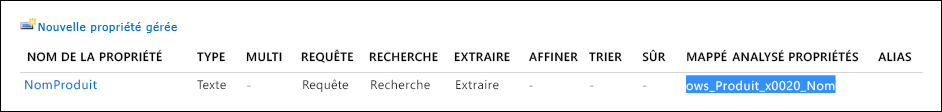

- **EventDateTime** : ce paramètre définit la date à laquelle l'événement se produit. Utilisez le format de date actuel : *formatDateTime(utcNow(),'aaaa-MM-jj'*)

### <a name="putting-it-all-together"></a>Exemple complet

À présent que l’étiquette de rétention créée et appliquée automatiquement et que le flux est configuré et créé, voici ce qui se produit lorsque la valeur de la colonne **En production** pour le produit widget de rotation dans la liste Produits est remplacée de **Oui** par **Non**. Le flux est déclenché et crée l’événement. Pour voir cet événement dans le centre de sécurité et conformité, accédez à **Gestion des enregistrements** > **Événements**.

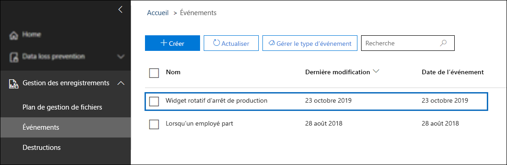

Sélectionnez l’événement pour afficher les détails de la page de menu volant. Notez que même si l’événement est créé, les détails de l’état de l’événement indiquent qu’aucun site ou document SharePoint n’a été traité.


Mais après un certain temps, la section état de l’événement indique qu’un site SharePoint et un document SharePoint ont été traités.  

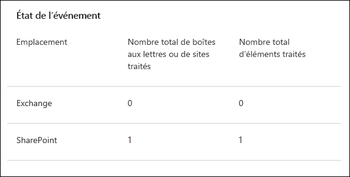
 
Cela signifie que la période de rétention de l’étiquette appliquée au document de produit du widget rotation a été initiée, en fonction de la date de l’événement du widget de rotation de cessation de production. En supposant que vous avez implémenté le scénario dans votre environnement de test en configurant une période de rétention d’un jour, vous pouvez accéder à la bibliothèque de documents de vos documents de produits quelques jours après la création de l’événement et vérifier que le document est supprimé (après la suppression la tâche dans SharePoint a été exécutée).

### <a name="more-about-asset-ids"></a>En savoir plus sur les ID d’élément

Comme expliqué dans l’article [Débuter la rétention lorsqu’un événement se produit](event-driven-retention.md), il est important de comprendre la relation entre les types d’événement, les étiquettes de rétention, les événements et les ID d’élément. L’ID d’élément constitue simplement une autre propriété de document dans SharePoint et OneDrive. Il vous aide à identifier plus précisément les documents dont la période de rétention sera déclenchée par l’événement. Par défaut, SharePoint possède une propriété ID d’élément que vous pouvez utiliser pour la rétention basée sur les événements :

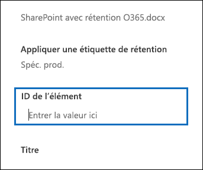

Comme illustré dans la capture d’écran suivante, la propriété gérée ID d’élément est appelée **ComplianceAssetId**.


Au lieu d’utiliser la propriété ID d’élément par défaut, vous pouvez également utiliser n’importe quelle autre propriété, comme c’est le cas dans ce scénario. Mais il est important de comprendre que si vous ne spécifiez pas d’ID d’élément ou de mot clé pour un événement, tout le contenu portant une étiquette de ce type d’événement verra sa période de rétention déclenchée par l’événement.

### <a name="using-advanced-search-in-sharepoint"></a>Utilisation de la recherche avancée dans SharePoint

Dans la capture d’écran précédente, nous pouvons également voir qu’il existe une autre propriété gérée liée aux étiquettes de rétention appelée **ComplianceTag** et qu’elle est mappée à une propriété analysée. La propriété gérée **ComplianceAssetId** est également mappée à une propriété analysée. Cela signifie que vous pouvez utiliser ces propriétés gérées dans la recherche avancée pour récupérer tous les documents marqués avec une étiquette de rétention.

## <a name="summary"></a>Résumé

Cet article illustre un scénario de gestion des documents dans lequel nous avons appliqué automatiquement une étiquette de rétention basée sur une colonne de site dans SharePoint. Nous avons ensuite utilisé la rétention basée sur les événements et Microsoft Flow pour déclencher automatiquement le début de la période de rétention sur la base d’un événement externe.

## <a name="credits"></a>Crédits

Ce scénario a été créé par : 

Frederic Lapierre<br/>Consultant principal, services Microsoft
