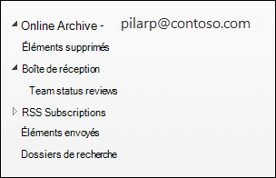
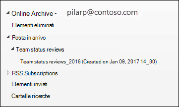

# En savoir plus sur l’archivage à extension automatique

Dans Office 365, les boîtes aux lettres d’archivage fournissent aux utilisateurs un espace de stockage de boîte aux lettres supplémentaire. Une fois la boîte aux lettres d’archivage d’un utilisateur activée, jusqu’à 100 Go de stockage supplémentaire sont disponibles. Dans le passé, lorsque le quota de stockage de 100 Go était atteint, les organisations deviez contacter Microsoft pour demander de l’espace de stockage supplémentaire pour une boîte aux lettres d’archivage. Ce n’est plus le cas.

La fonctionnalité d’archivage à extension automatique dans Office 365 (appelée *archivage en auto-expansion*) fournit jusqu’à 1,5 To de stockage supplémentaire dans les boîtes aux lettres d’archivage. Lorsque le quota de stockage dans la boîte aux lettres d’archivage est atteint, Microsoft 365 augmente automatiquement (et incrémentiellement) la taille de l’archive jusqu’à ce que la boîte aux lettres d’archivage atteigne 1,5 To.

Pour obtenir des instructions détaillées sur l’activation de l’archivage à extension automatique, consultez [Activer l’archivage en auto-expansion](enable-autoexpanding-archiving.md).

> [!NOTE]
> L’archivage en auto-expansion prend aussi en charge les boîtes aux lettres partagées. Pour activer l’archive pour une boîte aux lettres partagée, une licence Exchange Online Plan 2 ou une licence Exchange Online Plan 1 avec une licence d’archivage Exchange Online est requise.

## Fonctionnement de l’archivage en auto-expansion

Comme indiqué précédemment, un espace de stockage de boîte aux lettres supplémentaire est créé lorsque la boîte aux lettres d’archivage d’un utilisateur est activée. Lorsque l’archivage en auto-expansion est activé, Microsoft 365 vérifie régulièrement la taille de la boîte aux lettres d’archivage. Lorsqu’une boîte aux lettres d’archivage approche de sa limite de stockage, Microsoft 365 crée automatiquement un espace de stockage supplémentaire pour l’archive. Si l’utilisateur manque de cet espace de stockage supplémentaire, Microsoft 365 ajoute plus d’espace de stockage à l’archive de l’utilisateur. Ce processus se poursuit jusqu’à ce que l’archive de l’utilisateur atteigne une taille de 1,5 To. Ce processus se produit automatiquement, ce qui signifie que les administrateurs n’ont pas besoin de demander un stockage d’archivage supplémentaire ou de gérer l’archivage en auto-expansion.

Voici une vue d’ensemble rapide du processus.

1. L’archivage est activé pour une boîte aux lettres utilisateur ou une boîte aux lettres partagée. Une boîte aux lettres d’archivage avec 100 Go d’espace de stockage est créée et le quota d’avertissement pour la boîte aux lettres d’archivage est défini sur 90 Go.

2. Un administrateur active l’archivage en auto-expansion pour la boîte aux lettres. Lorsque la boîte aux lettres d’archivage (y compris le dossier Éléments récupérables) atteint 90 Go, elle est convertie en archivage en auto-expansion et Microsoft 365 ajoute de l’espace de stockage à l’archive jusqu’à ce qu’elle atteigne une taille maximale de 1,5 To. La mise en service de l’espace de stockage supplémentaire peut prendre jusqu’à 30 jours.

   > [!NOTE]
   > Si une boîte aux lettres est placée en conservation ou affectée à une stratégie de rétention, le quota de stockage de la boîte aux lettres d’archivage est augmenté à 110 Go lorsque l’archivage à extension automatique est activé. De même, le quota d’avertissement d’archivage est augmenté à 100 Go.

3. Microsoft 365 ajoute automatiquement plus d’espace de stockage si nécessaire.

> [!IMPORTANT]
> L’archivage en auto-expansion est pris en charge uniquement pour les boîtes aux lettres utilisées pour des utilisateurs individuels (ou des boîtes aux lettres partagées) avec un taux de croissance qui ne dépasse pas 1 Go par jour. La boîte aux lettres d'archivage d'un utilisateur est destinée uniquement à cet utilisateur. L'utilisation de la fonction de journalisation, des règles de transport ou des règles de transfert automatique pour copier des messages vers une boîte aux lettres Exchange Online à des fins d'archivage n'est pas autorisée. Microsoft se réserve le droit de refuser l’archivage illimité dans les cas où la boîte aux lettres d’archivage d’un utilisateur sert à stocker les données d’archivage d’autres utilisateurs ou dans d’autres cas d’utilisation inappropriée.

## Qu’est-ce qui est déplacé vers l’espace de stockage d’archivage supplémentaire ?

Pour utiliser efficacement le stockage d’archivage en auto-expansion, les dossiers peuvent être déplacés. Microsoft 365 détermine quels dossiers sont déplacés lorsque du stockage supplémentaire est ajouté à l’archive. Parfois, lorsqu’un dossier est déplacé, un ou plusieurs sous-dossiers sont automatiquement créés et les éléments du dossier d’origine sont distribués dans ces dossiers pour faciliter le processus de déplacement. Lorsque vous affichez la partie archive de la liste des dossiers dans Outlook, ces sous-dossiers sont affichés sous le dossier d’origine. La convention d’affectation de noms utilisée par Microsoft 365 pour nommer ces sous-dossiers est **\<folder name\>_aaaa (créée sur mmm jj, aaaa h_mm)**, où :

- **aaaa est l’année** de réception des messages dans le dossier.

- **mmm jj, aaaa h_m** est la date et l’heure auxquelles le sous-dossier a été créé par Office 365, au format UTC, en fonction du fuseau horaire et des paramètres régionaux de l’utilisateur dans Outlook.

Les captures d’écran suivantes montrent une liste de dossiers avant et après le déplacer vers une archive en auto-expansion.

 **Avant l’ajout d’un espace de stockage supplémentaire**

 **Une fois le stockage supplémentaire ajouté**

> [!NOTE]
> Comme décrit précédemment, Microsoft 365 déplace les éléments vers des sous-documents (et les nomme à l’aide de la convention d’attribution de noms décrite ci-dessus) pour aider à distribuer le contenu vers une archive auxiliaire. Toutefois, le déplacement d’éléments vers des sous-dossiers peut ne pas toujours être le cas. Parfois, un dossier entier peut être déplacé vers une archive auxiliaire. Dans ce cas, le dossier conserve son nom d’origine.  Il n’apparaît pas dans la liste des dossiers Outlook que le dossier a été déplacé vers une archive auxiliaire.

## Conditions requises d’Outlook pour accéder aux éléments dans une archive en auto-expansion

Pour accéder aux messages stockés dans une archive en auto-expansion, les utilisateurs doivent utiliser l’un des clients Outlook suivants :

- Outlook dans le cadre de Microsoft 365 Apps for enterprise (anciennement Office 365 ProPlus)

- Outlook dans le cadre de Microsoft 365 Apps for business (anciennement Office 365 Business)

- Outlook 2016 ou Outlook 2019 pour Windows

- Outlook sur le web

- Outlook 2016 ou Outlook 2019 pour Mac

Voici quelques éléments à prendre en compte lorsque vous utilisez Outlook ou Outlook sur le web pour accéder aux messages stockés dans une archive en auto-expansion.

- Vous pouvez accéder à n’importe quel dossier de votre boîte aux lettres d’archivage, y compris ceux qui ont été déplacés vers la zone de stockage en auto-expansion.

- Si une boîte aux lettres d’archivage possède au moins une zone de stockage en auto-expansion, vous ne pouvez pas supprimer un dossier de la boîte aux lettres d’archivage ou de l’archive auxiliaire. En d’autres termes, une fois qu’une zone de stockage en auto-expansion a été mise en service, vous ne pouvez supprimer aucun dossier dans l’archive.

- Vous pouvez supprimer des éléments dans une zone de stockage développée automatiquement. Toutefois, vous ne pouvez pas utiliser la fonctionnalité Récupérer les éléments supprimés pour récupérer un élément après l’activation de l’archivage à extension automatique pour une boîte aux lettres.

- La recherche d’archivage en auto-expansion est disponible dans Outlook pour le web (OWA). Comme pour les archives en ligne, vous pouvez rechercher des éléments qui ont été déplacés vers une zone de stockage supplémentaire. Lorsque l’archive est sélectionnée en tant qu’étendue de recherche dans OWA, toutes les archives (y compris les archivage en auto-expansion) et leurs sous-documents correspondants sont recherchés. Notez que la recherche n’est pas prise en charge pour la fonctionnalité d’archivage à extension automatique dans une situation d’archivage cloud uniquement (boîte aux lettres principale toujours locale).

- La recherche d’archives développée automatiquement est disponible dans Outlook pour Windows dans le canal d’entreprise mensuel. Avec cette mise à jour, l’étendue de la boîte aux lettres actuelle est disponible, ce qui vous permet de rechercher dans l’archive développée automatiquement. Notez que la recherche n’est pas prise en charge pour la fonctionnalité d’archivage à extension automatique dans une situation d’archivage cloud uniquement (boîte aux lettres principale toujours locale). Pour plus d’informations à ce sujet et d’autres fonctionnalités de support Microsoft Search, consultez [Comment Outlook pour Windows connecté à Exchange Online utilise Microsoft Search](https://techcommunity.microsoft.com/t5/outlook-global-customer-service/how-outlook-for-windows-connected-to-exchange-online-utilizes/ba-p/1715045). 

- Le nombre d’éléments Outlook et le nombre de lecture/non lus (en Outlook et Outlook sur le web) dans une archive en auto-expansion peuvent ne pas être exacts.

## Archivage en auto-expansion et autres fonctionnalités de conformité

Cette section explique la fonctionnalité entre l’archivage en auto-expansion et d’autres fonctionnalités de conformité et de gouvernance des données.

- **eDiscovery :** Lorsque vous utilisez un outil eDiscovery, tel que la recherche de contenu ou In-Place eDiscovery, les zones de stockage supplémentaires dans une archive en auto-expansion sont également recherchés.

- **Rétention :** Lorsque vous placez une boîte aux lettres en conservation à l’aide d’outils tels que la conservation pour litige dans Exchange Online ou les conservations de cas eDiscovery et les stratégies de rétention dans le centre de sécurité et conformité, le contenu situé dans une archive en auto-expansion est également mis en attente.

- **Gestion des enregistrements de messagerie (MRM) :** Si vous utilisez des stratégies de suppression de la MRM dans Exchange Online pour supprimer définitivement les éléments de boîte aux lettres expirés, les éléments expirés situés dans l’archive en auto-expansion sont également supprimés.

- **Service d’importation :** Vous pouvez utiliser le service d Office 365 pour importer des fichiers PST dans l’archive en auto-expansion d’un utilisateur. Vous pouvez importer jusqu’à 100 Go de données à partir de fichiers PST vers la boîte aux lettres d’archivage de l’utilisateur.

## Prochaines étapes

Pour plus d’informations techniques sur l’archivage en auto-expansion, consultez [Microsoft 365 : FAQ sur l’archivage en auto-expansion](https://techcommunity.microsoft.com/t5/exchange-team-blog/office-365-auto-expanding-archives-faq/ba-p/607784).

Si vous êtes prêt à activer l’archivage à extension automatique, consultez [Activer l’archivage à extension automatique](enable-autoexpanding-archiving.md).
