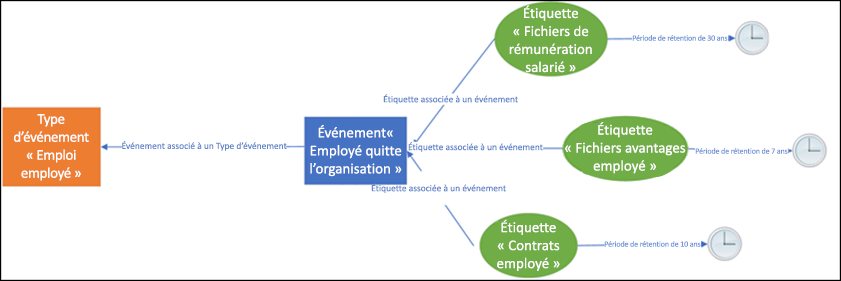
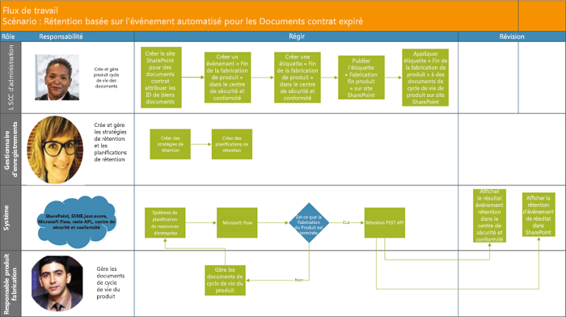

# <a name="automate-event-based-retention"></a>Rétention basée sur des événements

>*[Guide de sécurité et conformité pour les licences Microsoft 365](https://aka.ms/ComplianceSD).*

The explosion of content in organizations and how it can become ROT (redundant, obsolete, trivial) is serious business. To continue to meet legal, business, and regulatory compliance challenges, organizations must be able to keep and protect important information and quickly find what’s relevant. Retaining only important, pertinent information is key to an organization's success.

To help meet this need, organizations can take advantage of retention solutions in the Office 365 Security & Compliance Center. Retention can be triggered by using [retention labels](labels.md). A retention label has the option to [base the retention period on a specific event](event-driven-retention.md). Typically, the retention period is based on a known date, such as the creation date or last modified date for the content. However, organizations also have requirements to dispose of content based on the occurrence of an event, such as seven years after an employee leaves an organization.

To ensure compliant disposal of content, it's imperative to know when an event takes place. With the volume of content increasing rapidly, it's becoming challenging to retain and dispose content in a timely and compliant manner.

Event-based retention solves this problem. This topic explains how to set up your business process flows to automate retention through events by using the Microsoft 365 REST API.

## <a name="about-event-based-retention"></a>Rétentions basées sur des événements

An organization can be small, medium, or large. The number of business documents, legal documents, employee files, contracts, and product documents that get created and managed on a day-to-day basis is increasing dramatically.

For example, each day, tens and hundreds of employees are joining and leaving organizations. The HR department continues to create, update, or delete employee-related documents as per business requirements. This process is subject to the different retention policies outlined for the business:

- **The period of retention for content can be a known date** such as the date the content was created, last modified, or labeled. For example, you might retain documents for seven years after they're created and then delete them.

- **The period of retention of content can also be an unknown date**. For example, with retention labels, you can also base a retention period on when a specific type of event occurs, such as an employee leaving the organization.

The event triggers the start of the retention period, and all content with a label applied for that type of event get the label's retention actions enforced on them. This is called event-based retention. To learn more, see [Overview of event-driven retention](event-driven-retention.md).

## <a name="set-up-event-based-retention"></a>Définir la rétentions basées sur des événements

Cette section décrit les activités devant être effectuées avant la conservation du contenu.

### <a name="identify-roles"></a>Identifier les rôles

Identifier les différents rôles d’une organisation qui effectuent des tâches de gestion d’enregistrement et seraient responsables de la rétention efficace et de documents professionnels.

  | Persona | Role |
  | - | - |
  | Administrateur | Crée des types d’Événement de Rétention, Étiquettes de Rétention et Référentiels d’Enregistrement dans SharePoint |
  | Gestionnaire d’enregistrements                                  | Fournit des détails de recommandations et de conformité stratégies de rétention et des plannings de rétention   |
  | Administrateur système (entreprise)                          | Configure et gère les systèmes externes pour fonctionner avec Microsoft 365                       |
  | Travailleur de l'information                               | Gère le cycle de vie de leur processus métier (RH, Finance, informatique, etc.)                 |

### <a name="set-up-the-security--compliance-center"></a>Accéder au Centre de Conformité et de Sécurité
  
1. L’administrateur de conformité crée un type d’événement &ndash; par exemple, la résiliation employé ou expiration de contrat ou fin de fabrication de produit. (Voir le processus détaillé de[Rétentions basées sur des événements](event-driven-retention.md).
    
2. L’administrateur de conformité crée une étiquette en fonction d’un événement et l’associe à un type d’événement.
    
    Il existe quatre types de déclencheurs pour les étiquettes de rétention :
            
    1. Date de création
                
    2. Dernière modification
                
    3. Date étiquette (lorsque le contenu a été étiqueté)
                
    4. Basé sur des événements
    
3. L’administrateur de conformité publie l’étiquette.

### <a name="set-up-sharepoint"></a>Configurer SharePoint
   
Pour créer un référentiel des enregistrements, l’administrateur de conformité :

1. Crée un site SharePoint.

2. Effectue les opérations suivantes :
        
   - Creates a SharePoint library: Set event-based label at the library level. For more information, see [Applying a default retention label to all content in a SharePoint library, folder, or document set](labels.md#applying-a-default-retention-label-to-all-content-in-a-sharepoint-library-folder-or-document-set).
          
   - Configure un ensemble de documents dans SharePoint. Pour plus d'informations, voir [Présentation des ensembles de documents](https://support.microsoft.com/fr-FR/office/introduction-to-document-sets-3dbcd93e-0bed-46b7-b1ba-b31de2bcd234).
      
3. Affecte un ID d'élément à chaque ensemble de documents de l'employé. Un ID d’élément est un nom de produit ou un code utilisé par l’organisation, par exemple, le numéro d’employé peut être un ID d’élément. En attribuant l’ID d’élément au dossier, tous les éléments de ce dossier héritent automatiquement du même ID d’élément. Cela signifie que la période de rétention de tous les éléments peut être déclenchée par le même événement.

## <a name="ways-to-trigger-event-based-retention"></a>Méthodes pour déclencher la lecture rétention basée sur l’événement

Il existe deux façons avec lesquelles la rétention basée sur l’événement peut être déclenchée :

- **Utilisation de l’interface utilisateur du centre d’administration** il s’agit d’un processus qui peut être utilisé pour conserver moins de contenu à la fois, ou la fréquence à laquelle le déclenchement de la rétention n’est pas fréquente (par exemple, mensuelle ou annuelle). Pour plus d'informations sur cette méthode, voir[Vue d’ensemble de la rétention basée sur un événement](event-driven-retention.md). Toutefois, cette méthode de déclenchement de la rétention peut prendre du temps et être sujette à des erreurs, ce qui freine l'évolutivité. Par conséquent, une solution automatisée et transparente de déclenchement de la rétention peut améliorer la sécurité et la conformité des données.

- **Using a M365 REST API** This process can be used when large amounts of content are to be retained at a time and/or the frequency to trigger retention is often such as daily or weekly. The flow detects when an event occurs in your line-of-business system, and then automatically creates a related event in the Security & Compliance Center. You don't need to manually create an event in the UI each time one occurs.

Il existe deux options d’utilisation de l’API REST :

- **Microsoft Flow ou une application similaire** peut être utilisée pour déclencher automatiquement l’occurrence d’un événement. Microsoft Flow est un Orchestrator pour la connexion à d’autres systèmes. L’utilisation de Microsoft Flow ne nécessite pas de solution personnalisée.

- **PowerShell ou un HTTP client pour appeler des API REST** à l’aide de PowerShell (version 6 ou version ultérieure) pour appeler l’API REST Microsoft 365 pour créer des événements. 

Une API REST est un point de terminaison de service qui prend en charge les ensembles d’opérations HTTP (méthodes), qui fournissent l’accès de création, récupération/mise à jour/suppression aux ressources du service. Pour plus d’informations, voir [composants d’une demande/réponse API REST](https://docs.microsoft.com/rest/api/gettingstarted/#components-of-a-rest-api-requestresponse). Dans ce cas, l’API REST de Microsoft 365 vous permet de créer et d’extraire des événements à l’aide d’opérations (méthodes) publier et récupérer.

## <a name="example-scenarios"></a>Exemples de scénarios

Envisagez les scénarios suivants.

### <a name="scenario-1-employees-leaving-the-organization"></a>Scénario 1 : Employés quittant l’organisation 

Une organisation crée et stocke de nombreux documents liés à des employés par employé. Ces documents sont gérés et conservés pendant l’embauche de chaque employé. Cependant, lorsque l’employé quitte l’organisation ou que l’emploi est résilié, l’organisation est obligée par les exigences légales et commerciales de conserver les documents de cet employé pendant une période spécifiée.

Maintenant si plusieurs employés quittent l’organisation tous les jours, l’organisation doit déclencher la lecture l’horloge de rétention de centaines si ce n’est pas de milliers de documents chaque jour.

En plus de cela, la période de rétention doit être calculée pour chacun de ces employés comme date d’achèvement employé + nombre de jours, mois ou années en fonction du type de l’employé enregistrer. Par exemple, la rémunération du collaborateur des employés et les déclarations d’avantages du même employé peuvent nécessiter une rétention différente.

Le diagramme ci-dessous montre comment plusieurs étiquettes peuvent être associées à un seul événement. Dans cet exemple, tous les fichiers figurant sous l’étiquette indemnités du collaborateur et tous les fichiers sous l’étiquette avantages sociaux des employés sont associés à un seul événement, qui est l’employé quittant l’organisation. Chacun de ces fichiers a des horloges de rétention différentes. Par conséquent, lorsqu’un employé quitte l’organisation, ces fichiers au sein de chaque étiquette ont une période de rétention différente. Le déclenchement de toutes ces horloges de rétention pour chaque type de fichier ou étiquette pour chaque employé constitue une tâche complexe. Imaginez qu’il s’agit de plusieurs employés.



Un processus automatisé associé au déclenchement de ces différentes horloges de rétention pour plusieurs employés sera donc un gagne-temps, exempte d’erreur et très efficace.

**Configuration Automatisée de Rétention Basée sur des événements pour ce scénario:**


  - L’administrateur crée des dossiers d’employé lié au Document, telles Cartier Marie, John Smith.

  - L’administrateur ajoute des fichiers employé tels que les avantages, paie, rémunération de travailleur à chaque dossier employé.

  - L’administrateur affecte des ID d’élément à chaque dossier employé. 

  - L’administrateur SCG se connecte au Centre de Conformité et de Sécurité.

  - L’administrateur SCC crée des types d’événements liés à l’employé tels que « Renvoi employé », « Embauche employé » dans le Centre de Sécurité et Conformité.

  - Administrateur SCC crée une étiquette « Employés ».

  - Cette étiquette « Employés » est publiée et appliquée manuellement ou automatiquement aux fichiers employé dans SharePoint.

  - Le Système de Gestion des Ressources Humaines comme Workday peut fonctionner avec Microsoft Flow pour exécuter cette page régulièrement pour gérer les fichiers de l’employé.

  - Si un employé a quitté l’organisation, le flux déclenche l’événement M365 en fonction de la rétention l’API REST qui va commencer l’horloge de rétention sur des fichiers de l’employé.

#### <a name="using-microsoft-flow"></a>Utilisation Microsoft Flow

Étape 1-créer un flux de créer un événement en utilisant l’API REST Microsoft 365


##### <a name="create-an-event"></a>Créer un événement

Utilisation du code d’exemple pour appeler des API REST :

- **Method** : PUBLIER
- **URL** :`https://ps.compliance.protection.outlook.com/psws/service.svc/ComplianceRetentionEvent`
- **Headers** : Clé = Type de contenu, Valeur = application/atom+xml
- **Body** :
    
    ```xml
    <?xml version='1.0' encoding='utf-8' standalone='yes'?>
    
    <entry xmlns:d='http://schemas.microsoft.com/ado/2007/08/dataservices'
    
    xmlns:m='http://schemas.microsoft.com/ado/2007/08/dataservices/metadata'
    
    xmlns='http://www.w3.org/2005/Atom'>
    
    <category scheme='http://schemas.microsoft.com/ado/2007/08/dataservices/scheme' term='Exchange.ComplianceRetentionEvent' />
    
    <updated>9/9/2017 10:50:00 PM</updated>
    
    <content type='application/xml'>
    
    <m:properties>
    
    <d:Name>Employee Termination </d:Name>
    
    <d:EventType>99e0ae64-a4b8-40bb-82ed-645895610f56</d:EventType>
    
    <d:SharePointAssetIdQuery>1234</d:SharePointAssetIdQuery>
    
    <d:EventDateTime>2018-12-01T00:00:00Z </d:EventDateTime>
    
    </m:properties>
    
    </content>
    
    </entry>
    ```
- **Authentification** : de base
- **Nom d’utilisateur** : « Complianceuser »
- **Password** : « Compliancepassword »


##### <a name="available-parameters"></a>Paramètres disponibles


|Paramètres|Description|Notes|
|--- |--- |--- |
|<d:Name></d:Name>|Entrez un nom unique pour la base de données,|Un nom ne peut pas contenir les espaces et les caractères suivants : % * \ & < \> \| # ? , : ;|
|<d:EventType></d:EventType>|Entrez le nom de l’événement (ou Guid),|Example: “Employee termination”. Event type has to be associated with a retention label.|
|<d:SharePointAssetIdQuery></d:SharePointAssetIdQuery>|Entrez « ComplianceAssetId : « + Id d’employé|Example: "ComplianceAssetId:12345"|
|<d:EventDateTime></d:EventDateTime>|Date et heure de l’événement.|Format : AAAA-MM-jjTHH : mm : ssZ ; exemple : 2018-12-01T00:00:00Z
|

##### <a name="response-codes"></a>Codes de réponse

| Code de réponse | Description       |
| ----------------- | --------------------- |
| 302               | Rediriger              |
| 201               | Créé               |
| 403               | Autorisation échouée  |
| 401               | Message d’échec d’authentification |

##### <a name="get-events-based-on-time-range"></a>Obtenir des événements en fonction de l’intervalle de temps

- **Méthode **: GET

- **URL** :`https://ps.compliance.protection.outlook.com/psws/service.svc/ComplianceRetentionEvent?BeginDateTime=2019-01-11&EndDateTime=2019-01-16`

- **Headers** : Clé = Type de contenu, Valeur = application/atom+xml

- **Authentification** : de base

- **Nom d’utilisateur** : « Complianceuser »

- **Password** : « Compliancepassword »


##### <a name="response-codes"></a>Codes de réponse

| Code de réponse | Description                   |
| ----------------- | --------------------------------- |
| 200               | OK, une liste d’événements dans atome + xml |
| 404               | Introuvable                         |
| 302               | Rediriger                          |
| 401               | Autorisation échouée              |
| 403               | Message d’échec d’authentification             |

##### <a name="get-an-event-by-id"></a>Obtenir un événement par ID

- **Méthode **: GET

- **URL** :`https://ps.compliance.protection.outlook.com/psws/service.svc/ComplianceRetentionEvent('174e9a86-74ff-4450-8666-7c11f7730f66')`

- **Headers** : Clé = Type de contenu, Valeur = application/atom+xml

- **Authentification** : de base

- **Nom d’utilisateur** : « Complianceuser »

- **Password** : « Compliancepassword »


##### <a name="response-codes"></a>Codes de réponse

| Code de réponse | Description                                      |
| ----------------- | ---------------------------------------------------- |
| 200               | OK, le corps du message de réponse contient l’événement dans atome + xml |
| 404               | Introuvable                                            |
| 302               | Rediriger                                             |
| 401               | Autorisation échouée                                 |
| 403               | Message d’échec d’authentification                                |

##### <a name="get-an-event-by-name"></a>Obtenir un événement par le nom

- **Méthode **: GET

- **URL** :`https://ps.compliance.protection.outlook.com/psws/service.svc/ComplianceRetentionEvent`

- **Headers** : Clé = Type de contenu, Valeur = application/atom+xml

- **Authentification** : de base

- **Nom d’utilisateur** : « Complianceuser »

- **Password** : « Compliancepassword »


##### <a name="response-codes"></a>Codes de réponse

| Code de réponse | Description                                      |
| ----------------- | ---------------------------------------------------- |
| 200               | OK, le corps du message de réponse contient l’événement dans atome + xml |
| 404               | Introuvable                                            |
| 302               | Rediriger                                             |
| 401               | Autorisation échouée                                 |
| 403               | Message d’échec d’authentification                                |

#### <a name="using-powershell-version-6-or-later-or-any-http-client"></a>Utilisation de PowerShell (version 6 ou une version ultérieure) ou n’importe quel client HTTP

Étape 1: Connectez-vous à PowerShell.

Étape 2: Exécutez le script suivant.

```powershell
param([string]$baseUri)

$userName = "UserName"

$password = "Password"

$securePassword = ConvertTo-SecureString $password -AsPlainText -Force

$credentials = New-Object System.Management.Automation.PSCredential($userName, $securePassword)

$EventName="EventByRESTPost-$(([Guid]::NewGuid()).ToString('N'))"

Write-Host "Start to create an event with name: $EventName"

$body = "<?xml version='1.0' encoding='utf-8' standalone='yes'?>

<entry xmlns:d='http://schemas.microsoft.com/ado/2007/08/dataservices'

xmlns:m='http://schemas.microsoft.com/ado/2007/08/dataservices/metadata'

xmlns='http://www.w3.org/2005/Atom'>

<category scheme='http://schemas.microsoft.com/ado/2007/08/dataservices/scheme' term='Exchange.ComplianceRetentionEvent' />

<updated>7/14/2017 2:03:36 PM</updated>

<content type='application/xml'>

<m:properties>

<d:Name>$EventName</d:Name>

<d:EventType>e823b782-9a07-4e30-8091-034fc01f9347</d:EventType>

<d:SharePointAssetIdQuery>'ComplianceAssetId:123'</d:SharePointAssetIdQuery>

</m:properties>

</content>

</entry>"

$event = $null

try

{

$event = Invoke-RestMethod -Body $body -Method 'POST' -Uri "$baseUri/ComplianceRetentionEvent" -ContentType "application/atom+xml" -Authentication Basic -Credential $credentials -MaximumRedirection 0

}

catch

{

$response = $_.Exception.Response

if($response.StatusCode -eq "Redirect")

{

$url = $response.Headers.Location

Write-Host "redirected to $url"

$event = Invoke-RestMethod -Body $body -Method 'POST' -Uri $url -ContentType "application/atom+xml" -Authentication Basic -Credential $credentials -MaximumRedirection 0

}

}

$event | fl *

```


#### <a name="verify-the-outcome-in-both-options"></a>Vérifier le résultat dans les deux options

Étape 1 : Accéder au centre de conformité et de sécurité.

Étape 2 : Sélectionner **Évènements** sous **Gouvernance des informations**.

Étape 3 : Vérifier l’Événement a été créé.

De même, les options ci-dessus pour automatiser la rétention basée sur des événements peuvent être également utilisées pour les scénarios suivants.

### <a name="scenario-2-contracts-expiring"></a>Scénario 2 : Contrats expiration

Une organisation peut avoir plusieurs enregistrements pour un seul contrat avec des clients, des fournisseurs et des partenaires. Ces documents peuvent résider dans une bibliothèque de documents telle que SharePoint. La fin d’un contrat détermine le début de la période de rétention des documents associés au contrat. Par exemple, tous les documents relatifs aux contrats doivent être conservés pendant cinq ans après l'expiration du contrat. L’événement qui déclenche la période de rétention de cinq ans est l’expiration du contrat.

Un système de gestion de relation client (CRM) pouvez travailler avec Microsoft 365 et la rétention de déclencheur de documents de contrat.

**Configuration Automatisée de Rétention Basée sur des événements pour ce scénario:**


  - L’administrateur crée une bibliothèque SharePoint avec les différents dossiers pour chaque type de contrat.

  - L’administrateur ajoute des fichiers de contrat tels que des contrats de licence, les contrats de développement pour chaque dossier contrat.

  - L’administrateur affecte des ID délément à chaque dossier de contrat.

  - L’administrateur SCG se connecte au Centre de Conformité et de Sécurité.

  - L’administrateur SCC crée un contrat lié aux types événements tels que « Création de contrat, » , « Expiration de contrat » dans le Centre de Sécurité et Conformité.

  - Administrateur SCC crée une étiquette « Expiration de contrat ».

  - Cette étiquette « Expiration du Contrat » est publiée et appliquée manuellement ou automatiquement aux fichiers employé dans SharePoint.

  - Le Système de Gestion de Contrat peut fonctionner avec Microsoft Flow ou une application similaire pour exécuter cette page régulièrement pour gérer les fichiers de contrat.

  - Si un employé a quitté l’organisation, Microsoft Flow déclenche l’événement M365 en fonction de la rétention l’API REST qui va commencer l’horloge de rétention sur des fichiers de l’employé.

### <a name="scenario-3-end-of-product-manufacturing"></a>Scénario 3 : Fin de la fabrication de produit

A manufacturing company that produces different lines of products creates many manufacturing specifications and pricing documents. When the product is no longer manufactured, all specifications and documents linked to this product need to be retained for a specific period after the end of the lifetime of the product.

Un système de planification (ERP) peut fonctionner avec Microsoft 365 et Microsoft Flow pour la rétention de déclencheur.

**Configuration Automatisée de Rétention Basée sur des événements pour ce scénario:**



  - L’administrateur crée des dossiers du produit dans l’ensemble de Documents tel que produit 1, produit 2, etc.

  - L’administrateur ajoute des fichiers produit tels que les spécifications de fabrication, produit sur les tarifs, les licences produit pour chaque dossier du produit.

  - L’administrateur affecte des ID d’élément à chaque dossier produit.

  - L’administrateur SCG se connecte au Centre de Conformité et de Sécurité.

  - L’administrateur SCC crée des types d’événement liés à l’employé tels que « Commencer la fabrication de produit », « Fin de fabrication de produit » dans le Centre de Sécurité et Conformité.

  - L’administrateur SCC crée l’étiquette « Fin de la Fabrication du Produit » dans le Centre de Sécurité et Conformité.

  - Cette étiquette «Fin de la Fabrication du Produit» est publiée et appliquée manuellement ou automatiquement aux fichiers employé dans SharePoint.

  - Le Système de Gestion de Contrat ERP peut fonctionner avec Microsoft Flow ou des applications similaires pour s’exécuter régulièrement pour gérer les fichiers de produit.

  - Si la fabrication d’un produit se termine, Microsoft Flow déclenche l’événement M365 en fonction de la rétention l’API REST qui va commencer l’horloge de rétention sur des fichiers de produit spécifiques.

## <a name="appendix"></a>Annexe

### <a name="using-redirect-302-response-results-to-call-the-rest-api"></a>Utiliser les résultats de réponses 302 de redirection pour appeler des API REST

1. Appeler un appel d’événement de rétention POST à l’aide de l’URL API REST : `https://ps.compliance.protection.outlook.com/psws/service.svc/ComplianceRetentionEvent`
    
    Les autorisations d'administrateur global sont requises.

2. Vérifiez le code de réponse. S’il s’agit 302, puis obtenez l’URL redirigé de propriété de l’emplacement de l’en-tête de réponse.

3. Appeler l’appel d’événement rétention POST à l’aide d’URL redirigé.

## <a name="credits"></a>Crédits

Cette rubrique a été révisée par :

Antonio Maio<br/>MVP Services et applications Microsoft Office<br/> Antonio.Maio@Protiviti.com
