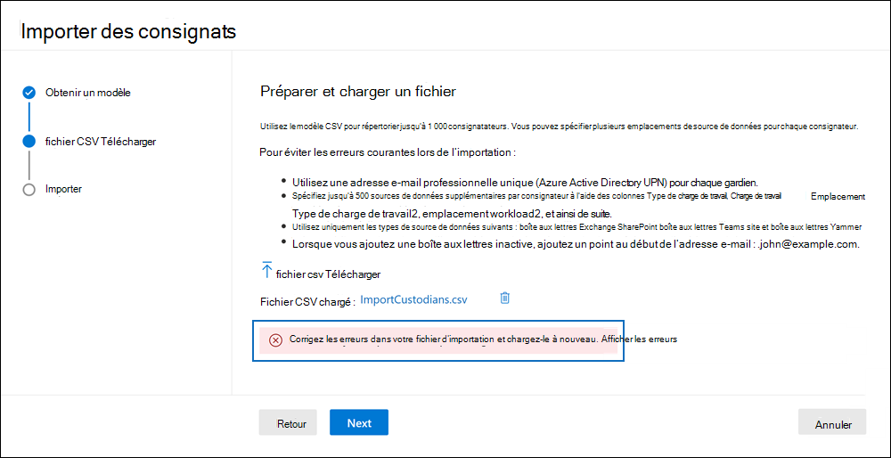

# Importer des consignats dans un cas eDiscovery (Premium)

[!include[Purview banner](../includes/purview-rebrand-banner.md)]

Pour les cas Microsoft Purview eDiscovery (Premium) qui impliquent de nombreux consignats, vous pouvez importer plusieurs consignatateurs à la fois à l’aide d’un fichier CSV qui contient les informations nécessaires pour les ajouter à un cas. L’outil des consignats d’importation valide également le fichier CSV avant la création du travail d’importation. Cela signifie que vous pouvez corriger toutes les erreurs dans le fichier CSV au lieu d’attendre que le travail d’importation soit terminé avant d’apprendre qu’il existe des erreurs qui empêchent l’ajout d’un consignateur au cas.

## Avant d’importer des consignatateurs

- Vous pouvez importer un maximum de 1 000 consignats (lignes) par fichier CSV.

- Vous pouvez associer jusqu’à 500 sources de données pour chaque dépositaire.  

- Vous pouvez uniquement importer des consignatateurs qui font partie des Azure Active Directory de votre organisation.

- Chaque consigna ateur doit avoir une adresse e-mail unique.

- Pour importer une boîte aux lettres inactive en tant que consignateur ou associer une boîte aux lettres inactive à un autre consignateur, ajoutez un préfixe « . » à l’adresse e-mail de la boîte aux lettres inactive (par exemple, .sarad@contoso.onmmicrosoft.com).

## Importer des consignats

1. Ouvrez le cas eDiscovery (Premium) et sélectionnez l’onglet **Sources de données**.

2. Cliquez sur **Ajouter des** **consignats** De source  >  de donnéesImport.

3. Dans la page De l’Assistant **Obtention d’un modèle** , cliquez sur **Télécharger le modèle CSV** pour télécharger un fichier CSV de modèle de dépôt.

   

4. Ajoutez les informations de garde au fichier CSV et enregistrez-les sur votre ordinateur local. Pour plus d’informations sur les propriétés requises dans le fichier CSV, consultez la section fichier [CSV du consignateur](#custodian-csv-file) .

5. Une fois que vous avez préparé le fichier CSV avec les informations de conservation, revenez à l’onglet **Sources** de données, puis cliquez à nouveau sur Ajouter **des consignatateurs** De **source** >  de donnéesImport.

6. Dans la **page Télécharger’Assistant Fichier CSV**, cliquez sur **Télécharger fichier csv**, puis chargez le fichier CSV qui contient les informations de conservation.

   Après avoir chargé le fichier CSV, l’Assistant Importation valide le fichier CSV. S’il existe des erreurs de validation, l’Assistant affiche une bannière d’erreur avec un lien pour afficher les erreurs.

   

   Les informations d’erreur identifient la ligne et la colonne de la cellule qui contient l’erreur et suggèrent une action de correction. Vous devez corriger toute erreur de validation, puis recharger le fichier CSV fixe. Le fichier CSV doit être validé avec succès avant de pouvoir créer le travail du consignateur d’importation.

7. Une fois le fichier CSV validé, cliquez sur **Suivant** , puis sur **Importer** pour démarrer le travail d’importation.

Après avoir démarré le travail d’importation, eDiscovery (Premium) effectue les opérations suivantes :

- Crée un travail nommé **BulkAddCustodian** sous l’onglet **Travaux** du cas.

- Effectue l’indexation avancée de toutes les sources de données pour chaque consignateur.

- Met toutes les sources de données consignatières en attente (si la propriété **Is OnHold** dans le fichier CSV est définie sur TRUE)

Une fois le travail du consigna ateur d’importation terminé, les consignats et leurs sources de données associées sont ajoutés à la page **Sources** de données du cas.

## Fichier CSV du consignateur

Après avoir téléchargé le modèle de consignatateur CSV, vous pouvez ajouter des consignatateurs et leurs sources de données dans chaque ligne. Veillez à ne pas modifier les noms des colonnes dans la ligne d’en-tête. Utilisez le type de charge de travail et les colonnes d’emplacement de charge de travail pour associer d’autres sources de données à un consignateur.

| Nom de colonne|Description|
|:------- |:------------------------------------------------------------|
|**ContactEmail du consignateur**     |Adresse e-mail UPN du consignateur. Par exemple, sarad@contoso.onmicrosoft.com.           |
|**Exchange activé** | Valeur TRUE/FALSE à inclure ou à ne pas inclure dans la boîte aux lettres du consignateur.      |
|**OneDrive activé** | Valeur TRUE/FALSE à inclure ou non dans le compte OneDrive Entreprise du consignat. |
|**Is OnHold**        | Valeur TRUE/FALSE pour indiquer si les sources de données du consignateur doivent être mises en attente. 1     |
|**Type de charge de travail 1**         |Valeur de chaîne indiquant le type de source de données à associer au consignateur. Les valeurs admises sont les suivantes :  - ExchangeMailbox  - SharePointSite - TeamsMailbox2 - YammerMailbox2. Les valeurs précédentes de ces types de charge de travail respectent la casse. Le fichier CSV contient des colonnes pour trois types de charge de travail et leurs emplacements de charge de travail correspondants. Vous pouvez ajouter un total de 500 types et emplacements de charge de travail.|
|**Emplacement de la charge de travail 1**     | Selon votre type de charge de travail, il s’agit de l’emplacement de la source de données. Par exemple, l’adresse e-mail d’une boîte aux lettres Exchange ou l’URL d’un site SharePoint. |
|||

> [!NOTE]
> 1 Si vous mettez plus de 1 000 boîtes aux lettres ou 100 sites en attente dans un cas, le système met automatiquement à l’échelle la conservation eDiscovery en fonction des besoins. Cela signifie que le système ajoute automatiquement des emplacements de données à plusieurs stratégies de conservation, au lieu de les ajouter à une seule stratégie. Toutefois, la limite de 10 000 stratégies de conservation des cas par organisation s’applique toujours. Pour plus d’informations sur les limites de conservation, consultez [Limites dans eDiscovery (Premium).](limits-ediscovery20.md#hold-limits)
 
> 2 Lorsque vous incluez des charges de travail TeamsMailbox et YammerMailbox dans le fichier CSV, le site de groupe (TeamSite et YammerSite) est automatiquement ajouté par défaut. Vous n’avez pas besoin de spécifier TeamsSite et YammerSite séparément dans le fichier CSV.

Voici un exemple de fichier CSV avec des informations de conservation :  

|ContactEmail du consignateur      | Exchange activé | OneDrive activé | Is OnHold | Type de charge de travail 1 | Emplacement de la charge de travail 1             |
| ----------------- | ---------------- | ---------------- | --------- | -------------- | ------------------------------ |
|robinc@contoso.onmicrosoft.com | TRUE             | TRUE             | TRUE      | SharePointSite | https://contoso.sharepoint.com |
|pillarp@contoso.onmicrosoft.com | TRUE             | TRUE             | TRUE      | |  |
|.johnj@contoso.onmicrosoft.com|TRUE|TRUE|TRUE||
|sarad@contoso.onmicrosoft.com|TRUE|TRUE|TRUE|ExchangeMailbox|.saradavis@contoso.onmicrosoft.com
||||||

> [!NOTE]
> Comme expliqué précédemment, ajoutez un préfixe « . » à l’adresse UPN d’une boîte aux lettres inactive pour importer une boîte aux lettres inactive en tant que consignateur ou associer une boîte aux lettres inactive à un autre consignateur.
