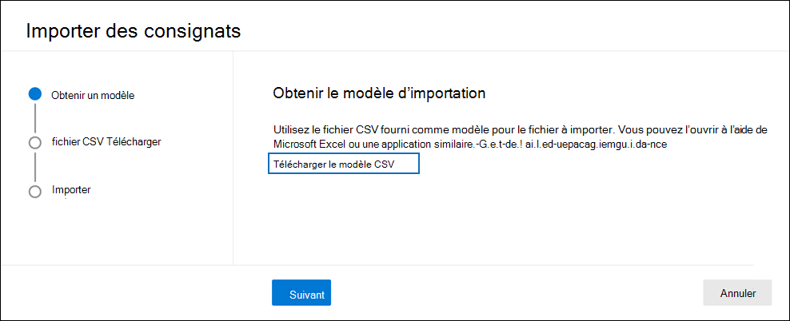

# Importer des dépositaires dans un Advanced eDiscovery de données

Pour Advanced eDiscovery cas qui impliquent de nombreux dépositaires, vous pouvez importer plusieurs dépositaires à la fois à l’aide d’un fichier CSV qui contient les informations nécessaires pour les ajouter à un cas.

## Importer des dépositaires

1. Ouvrez le Advanced eDiscovery et sélectionnez **l’onglet Sources de** données.

2. Cliquez **sur Ajouter des dépositaires**  >  **d’importation de source de données.**

3. Dans la page de présentation des **dépositaires** d’importation, cliquez sur Télécharger un modèle **vide** pour télécharger un fichier CSV de modèle de dépositaire.

   

4. Ajoutez les informations de garde au fichier CSV et enregistrez-les sur votre ordinateur local. Pour plus d’informations sur les propriétés requises dans le fichier [CSV,](#custodian-csv-file) consultez la section du fichier CSV du dépositaire.

5. Une fois que vous avez préparé le fichier CSV avec les informations du dépositaire, revenir à l’onglet **Sources** de données, puis cliquez à nouveau sur Ajouter des dépositaires d’importation de **source**  >   de données.

6. Dans la page **de flyout des dépositaires** d’importation, cliquez sur **Parcourir,** puis téléchargez le fichier CSV qui contient les informations du dépositaire.

   Une fois le fichier CSV chargé, un travail nommé **BulkAddCustodian** est créé et affiché sous **l’onglet Travaux.** Le travail valide les dépositaires et leurs sources de données associées, puis les ajoute à la page **Sources** de données du cas.

## Fichier CSV du dépositaire

Après avoir téléchargé le modèle de dépositaire CSV, vous pouvez ajouter des dépositaires et leur source de données dans chaque ligne. N’oubliez pas de ne pas modifier les noms de colonne dans la ligne d’en-tête. Utilisez les colonnes de type de charge de travail et d’emplacement de charge de travail pour associer d’autres sources de données à un dépositaire.

| Nom de colonne|Description|
|:------- |:------------------------------------------------------------|
|**ContactEmail du dépositaire**     |Adresse de messagerie UPN du dépositaire. Par exemple, sarad@contoso.onmicrosoft.com.           |
|**Exchange Activé** | Valeur TRUE/FALSE à inclure ou non à la boîte aux lettres du dépositaire.      |
|**OneDrive Activé** | Valeur TRUE/FALSE à inclure ou non le compte de OneDrive Entreprise dépositaire. |
|**Is OnHold**        | Valeur TRUE/FALSE pour indiquer s’il faut placer les sources de données du dépositaire en conservation. 1     |
|**Workload1 Type**         |Valeur de chaîne indiquant le type de source de données à associer au dépositaire. Les valeurs admises sont les suivantes :  - ExchangeMailbox  - SharePointSite - TeamsMailbox - TeamsSite  - YammerMailbox - YammerSite |
|**Emplacement de charge de travail1**     | En fonction de votre type de charge de travail, il s’errait de l’emplacement de la source de données. Par exemple, l’adresse e-mail d’Exchange boîte aux lettres ou l’URL d’SharePoint site. |
|||

> [!NOTE]
> 1 Vous pouvez placer un maximum de 1 000 boîtes aux lettres et 100 sites en conservation à l’aide du processus d’importation du dépositaire et du fichier CSV. Vous pouvez utiliser ce processus pour ajouter plus de 1 000 dépositaires à un cas, mais les limites de conservation s’appliquent toujours. Pour plus d’informations sur les limites de la Advanced eDiscovery [.](limits-ediscovery20.md#hold-limits)

Voici un exemple de fichier CSV avec des informations de dépositaire :  

|ContactEmail du dépositaire      | Exchange Activé | OneDrive Activé | Is OnHold | Workload1 Type | Emplacement de charge de travail1             |
| ----------------- | ---------------- | ---------------- | --------- | -------------- | ------------------------------ |
|robinc@onmicrosoft.contoso.com | TRUE             | TRUE             | TRUE      | SharePointSite | https://contoso.sharepoint.com |
|pillarp@onmicrosoft.contoso.com | TRUE             | TRUE             | TRUE      | |  |
||||||

## Validation du dépositaire et de la source de données

Après avoir chargé le fichier CSV du dépositaire, Advanced eDiscovery les choses suivantes :

1. Valide les dépositaires et leurs sources de données.

2. Indexe toutes les sources de données pour chaque dépositaire et les place en conservation (si la propriété **Is OnHold** dans le fichier CSV est définie sur TRUE).

### Validation du dépositaire

Pour l’instant, nous 5 000 personnes qui sont incluses dans l’Azure Active Directory de votre organisation (Azure AD).

L’outil d’importation du dépositaire trouve et valide les dépositaires à l’aide de la valeur UPN dans la colonne **contactEmail** du dépositaire dans le fichier CSV. Les dépositaires validés sont automatiquement ajoutés au cas et répertoriés sous l’onglet **Sources** de données du cas. Si un dépositaire ne peut pas être validé, il est répertorié dans le journal des erreurs  pour le travail BulkAddCustodian qui est répertorié sous l’onglet Travaux dans le cas. Les dépositaires nonvaleurs ne sont pas ajoutés au cas ou répertoriés sous l’onglet **Sources de** données.

### Validation de la source de données

Une fois les dépositaires validés et ajoutés au cas, chaque boîte aux lettres principale OneDrive compte associé à un dépositaire est ajouté.

Toutefois, si l’une des autres sources de données (telles que les sites SharePoint, les Microsoft Teams, les groupes Microsoft 365 ou les groupes Yammer) associées à  un dépositaire est in  trouver, aucune d’entre elles n’est attribuée au dépositaire et la valeur Non validée est affichée dans la colonne État à côté du dépositaire sous l’onglet **Sources** de données.

Pour ajouter des sources de données validées pour un dépositaire :

1. Sous **l’onglet Sources de** données, sélectionnez un dépositaire qui contient des sources de données qui ne sont pas validées.

2. Dans la page de flyout du dépositaire, faites défiler la **page** Emplacements de conservation pour afficher les sources de données validées et nonvalidées associées au dépositaire.

3. Cliquez **sur Modifier** en haut de la page volante pour supprimer des sources de données non valides ou en ajouter de nouvelles.

4. Après avoir supprimé des sources de données nonvalidées ou en  avoir ajouté une nouvelle, la valeur **Active** s’affiche dans la colonne État du dépositaire sous l’onglet **Sources** de données. Pour ajouter des sources qui apparaissaient précédemment comme non valides, suivez les étapes de correction ci-dessous pour les ajouter manuellement à un dépositaire.

### Correction des sources de données non valides

Pour ajouter et associer manuellement une source de données qui n’était pas valide :

1. Sous **l’onglet Sources de** données, sélectionnez un dépositaire pour ajouter et associer manuellement une source de données qui n’était pas valide précédemment.

2. Cliquez **sur Modifier** en haut de la page volante pour associer des boîtes aux lettres, des sites, des Teams ou des groupes Yammer au dépositaire. Pour ce faire, cliquez sur **Modifier** à côté du type d’emplacement de données approprié.

3. Cliquez **sur Suivant** pour afficher la page **Paramètres de** la mise en attente et configurer le paramètre de mise en attente pour les sources de données que vous avez ajoutées.

4. Cliquez **sur Suivant** pour afficher la page Des dépositaires de **révision,** puis cliquez sur **Envoyer** pour enregistrer vos modifications.
