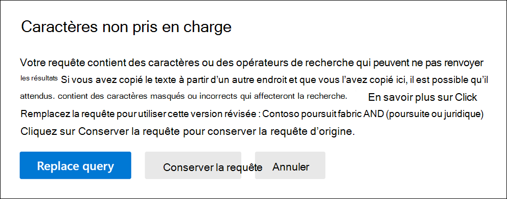

# Vérifier la présence d’erreurs dans vos requêtes de recherche de contenu

Lorsque vous créez ou modifiez une recherche de contenu, vous pouvez demander à Microsoft 365 de vérifier si votre requête contient des caractères non pris en charge et des opérateurs booléens en minuscules. Comment ? Cliquez simplement sur **Vérifier la requête pour les fautes de frappe** sur la page de requête d’une recherche de contenu. 
  

  
Voici une liste des caractères non pris en charge que nous vérifions. Les caractères non pris en charge sont souvent masqués et ils provoquent généralement une erreur de recherche ou renvoient des résultats inattendus.
  
- Guillemets **typographiques** -les guillemets simples et doubles intelligents (également appelés guillemets) ne sont pas pris en charge. Seuls les guillemets droits peuvent être utilisés dans une requête de recherche. 
    
- **Caractères non imprimables et de contrôle** -les caractères non imprimables et de contrôle ne représentent pas un symbole écrit, tel qu’un caractère alphanumérique. Il peut s'agir de caractères servant à mettre en forme le texte ou à séparer des lignes. 
    
- **Repères de gauche à droite et de droite à gauche** : ces marques sont utilisées pour indiquer l’orientation du texte pour les langues se lisant de gauche à droite (telles que l’anglais et l’espagnol) et les langues se lisant de droite à gauche (comme l’arabe et l’hébreu).
    
- **Opérateurs booléens en minuscules** : Si vous utilisez un opérateur booléen, comme **and**, **or**et **not** dans une requête de recherche, il doit être en majuscules. Lorsque nous vérifions une requête pour rechercher des fautes de frappe, la syntaxe de requête indique souvent qu’un opérateur booléen est utilisé même si des opérateurs en minuscules peuvent être utilisés ; par exemple, `(WordA or WordB) and (WordC or WordD)` .
    
## Que se passe-t-il si une requête contient un caractère non pris en charge ?

Si vous trouvez des caractères non pris en charge dans votre requête, un message d’avertissement s’affiche indiquant que des caractères non pris en charge ont été trouvés et suggère une alternative. Vous pouvez ensuite conserver la requête d’origine ou la remplacer par la requête modifiée suggérée. Voici un exemple du message d’avertissement qui s’affiche une fois que vous avez cliqué sur **Vérifier la requête pour rechercher les fautes** de recherche dans la capture d’écran précédente. Notez que la requête d’origine contient des guillemets typographiques et des opérateurs booléens en minuscules. 
  

  
## Comment empêcher les caractères non pris en charge dans vos requêtes de recherche

Les caractères non pris en charge sont généralement ajoutés à une requête lorsque vous copiez la requête ou des parties de la requête à partir d’autres applications (telles que Microsoft Word ou Microsoft Excel) et collez-les dans la zone de mot clé dans la page de requête d’une recherche de contenu. Le meilleur moyen d'éviter les caractères non pris en charge est de saisir la requête dans la zone de mot clé. Vous pouvez aussi copier une requête à partir de Word ou Excel, puis la coller dans un éditeur de texte brut, tel que le bloc-notes Microsoft. Enregistrez le fichier texte et sélectionnez **ANSI** dans la liste déroulante **Encoding** . Cette action supprime tout le formatage et tous les caractères non pris en charge. Vous pouvez ensuite copier la requête du fichier texte vers la zone de mot clé de la requête. 
