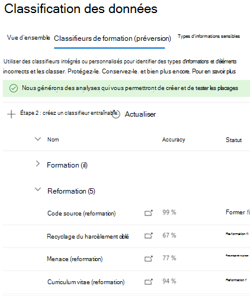

# Comment reformer un classificateur en explorateur de contenu

Un Microsoft 365 classifieur entraisable est un outil que vous pouvez former pour reconnaître différents types de contenu en lui donnant des exemples à examiner. Une fois formé, vous pouvez l’utiliser pour identifier l’élément à appliquer Office étiquettes de confidentialité, stratégies de conformité des communications et stratégies d’étiquette de rétention.

Cet article vous montre comment améliorer les performances des classifieurs entraisables personnalisés et de certains classifieurs pré-formés en leur fournissant des commentaires supplémentaires.

Pour en savoir plus sur les différents types de classifieurs, voir En savoir plus sur les [classifieurs entraisables.](classifier-learn-about.md)

Regardez cette vidéo pour obtenir un résumé rapide du processus d’ajustement et de formation. Vous devrez tout de même lire cet article complet pour obtenir les détails.

 

> [!VIDEO https://www.microsoft.com/videoplayer/embed/RWyGMs]

## Autorisations

Pour accéder aux classifieurs dans le centre Microsoft 365 conformité :

- le rôle d’administrateur de conformité ou l’administrateur des données de conformité est requis pour former un classificateur

Vous aurez besoin de comptes avec ces autorisations pour utiliser des classifieurs dans les scénarios suivants :

- Scénario de stratégie d’étiquette de rétention : rôles gestion des enregistrement et gestion de la rétention 

## Flux de travail global

> [!IMPORTANT]
> Vous fournissez des commentaires dans l’Explorateur de contenu pour appliquer automatiquement des stratégies d’étiquette de rétention Exchange les éléments et utilise le classifieur comme condition. **Si vous n’avez pas de stratégie de rétention qui applique automatiquement une étiquette de rétention à Exchange éléments et utilise un classificateur comme condition, arrêtez-vous ici.**

Lorsque vous utilisez vos classifieurs, vous souhaitez peut-être augmenter la précision des classifications qu’ils sont en train d’effectuer. Pour ce faire, vous devez évaluer la qualité des classifications des éléments qu’il a identifiés comme étant une correspondance ou non. Une fois que vous avez fait 30 évaluations pour un classificateur, il prend ce retour d’expérience et se réévalue automatiquement.

Pour en savoir plus sur le flux de travail global de la nouvelle formation d’un classifieur, voir Flux de processus pour former à nouveau [un classificateur.](classifier-learn-about.md#retraining-classifiers)

> [!NOTE]
> Un classificateur doit déjà être publié et en cours d’utilisation avant de pouvoir être à nouveau formé.

## Comment reformer un classificateur en explorateur de contenu

1. Connectez-vous au centre Microsoft 365 conformité avec l’accès au rôle d’administrateur de conformité ou d’administrateur de sécurité et ouvrez **Microsoft 365'explorateur** de contenu de classification des données du centre  >    >  **de conformité.** 
2. Sous le filtre **sur les étiquettes, les types d’informations** ou la liste des catégories, développez **classifieurs Avec formation.**

> [!IMPORTANT]
> L’apparition des éléments agrégés sous l’en-tête classifieurs entraçables peut prendre jusqu’à huit jours.

3. Choisissez le classifieur entraisable que vous avez utilisé dans votre stratégie d’étiquette de rétention à appliquer automatiquement. Il s’agit du classifieur entraçable sur qui vous allez nous faire part de vos commentaires.

> [!NOTE]
> Si un élément possède une entrée dans la **colonne** Étiquette de rétention, cela signifie que l’élément a été classé en tant que `match` .  Si un élément n’a pas  d’entrée dans la colonne Étiquette de rétention, cela signifie qu’il a été classé en tant que `close match` . Vous pouvez améliorer le plus la précision du classificateur en fournissant des commentaires sur `close match` les éléments. 

4. Choisissez un élément et ouvrez-le.
 
 > [!TIP]
> Vous pouvez fournir des commentaires sur plusieurs éléments simultanément en les sélectionnant tous, puis en choisissant **Améliorer la classification** dans la barre de commandes.

5. Choose **Provide feedback**.
6. Dans le **volet commentaires détaillés,** si l’élément est un vrai positif, choisissez, **Match**.  Si l’élément est un faux positif, c’est-à-dire qu’il a été inclus de manière incorrecte dans la catégorie, **sélectionnez Ne pas correspondre.**
7. S’il existe un autre classificateur qui serait plus approprié pour l’élément, vous pouvez le choisir dans la liste Suggérer d’autres **classifieurs entra nessifiables.** Cela déclenchera l’évaluation de l’élément par l’autre classificateur.
8. Choose **Send feedback** to send your evaluation of the , `match` `not a match` classifications and suggest other trainable classifiers. Une fois que vous avez fourni 30 instances de commentaires à un classifieur, il se formera automatiquement. La formation peut prendre entre une et quatre heures. Les classifieurs ne peuvent être formés que deux fois par jour.

> [!IMPORTANT]
> Ces informations sont ensuite données au classifieur de votre client, elles ne sont **pas revenir à Microsoft.**

9. Ouvrez **les classifieurs Avec formation.**
10. Le classificateur qui a été utilisé dans votre stratégie de conformité des communications s’affiche sous **l’en-tête Nouvelle** formation.

11. Une fois la nouvelle formation terminée, choisissez le classificateur pour ouvrir la vue d’ensemble de la nouvelle formation.

12. Examinez l’action recommandée, ainsi que les comparaisons de prédictions des versions du classifieur actuellement publiées et retentées.
13. If you satisfied with the results of the retraining, choose **Re-publish**.
14. Si vous n’êtes pas satisfait des résultats de la nouvelle formation, vous pouvez choisir de fournir des commentaires supplémentaires au classificateur dans l’interface de l’Explorateur de contenu et de démarrer un autre cycle de formation ou de ne rien faire, auquel cas la version actuellement publiée du classificateur continuera d’être utilisée. 

## Détails sur la republier des recommandations

Voici quelques informations sur la façon dont nous formulerons la recommandation pour publier à nouveau un classifieur retrained ou suggérer une nouvelle formation. Cela nécessite une compréhension plus approfondie du fonctionnement des classifieurs entraisables.

Après une nouvelle formation, nous évaluons les performances du classificateur à la fois sur les éléments avec des commentaires, ainsi que sur tous les éléments utilisés à l’origine pour former le classificateur. 

- Pour les modèles intégrés, les éléments utilisés pour former le classifieur sont les éléments utilisés par Microsoft pour créer le modèle.
- Pour les modèles personnalisés, les éléments utilisés dans la formation d’origine du classifieur sont issus des sites que vous avez ajoutés pour le test et la révision.

Nous comparons les nombres de performances sur les deux ensembles d’éléments pour le classifieur réécrit et publié afin de fournir une recommandation sur l’amélioration de la publication. 

## Voir aussi

- [En savoir plus sur les classifieurs avec capacité d’apprentissage](classifier-learn-about.md)
- [Extensions de nom de fichier et types de fichier analysés par défaut dans SharePoint Server](/sharepoint/technical-reference/default-crawled-file-name-extensions-and-parsed-file-types)