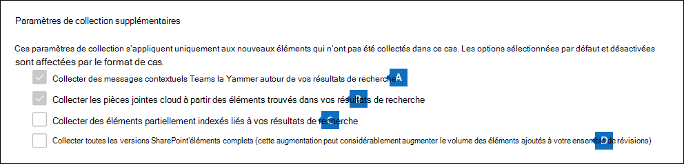

# Valider un brouillon de collection dans un ensemble de révisions dans eDiscovery (Premium)

[!include[Purview banner](../includes/purview-rebrand-banner.md)]

Lorsque vous êtes satisfait des éléments que vous avez collectés dans une collection brouillon et que vous êtes prêt à les analyser, les étiqueter et les examiner, vous pouvez ajouter une collection à un ensemble de révisions dans le cas présent. Lorsque vous validez un brouillon de collection dans un ensemble de révisions, les éléments collectés sont copiés à partir de leur emplacement de contenu d’origine dans Microsoft 365 vers un jeu de révision. Un ensemble de révisions est un emplacement stockage Azure sécurisé fourni par Microsoft dans le cloud Microsoft.

## Valider une collection au brouillon vers un ensemble de révisions

1. Dans le portail de conformité Microsoft Purview, ouvrez le cas microsoft Purview eDiscovery (Premium), puis sélectionnez l’onglet **Collections** pour afficher la liste des collections dans le cas.

   

   > [!TIP]
   > La valeur de `Estimated` la colonne **État** identifie les collections brouillons qui peuvent être ajoutées à un ensemble de révisions. L’état indique qu’une `Committed` collection a déjà été ajoutée à un ensemble de révisions.

2. Dans la page **Collections** , sélectionnez le brouillon de collection que vous souhaitez valider dans un ensemble de révisions.

3. En bas de la page de menu volant, sélectionnez **la** **collection ActionsEdit** > .

4. Dans l’Assistant Modification de collection, cliquez sur **Suivant** jusqu’à ce que la page **Enregistrer le brouillon ou collecter** s’affiche.

5. Configurez les paramètres suivants :

   1. Sélectionnez **Collecter les éléments et ajoutez à l’ensemble de révisions**.

   2. Décidez s’il faut ajouter la collection à un nouvel ensemble de révisions (qui est créé après avoir soumis la collection) ou l’ajouter à un jeu de révision existant. Terminez cette section en fonction de votre décision.

   3. Configurez les paramètres de collecte supplémentaires :

      .

       a. **Teams et Yammer messages** : sélectionnez cette option pour ajouter des threads de conversation à la collection qui incluent les éléments de conversation renvoyés par la requête de recherche dans la collection. Cela signifie que la conversation de conversation qui contient des éléments qui correspondent aux critères de recherche est reconstruite. Cela vous permet de passer en revue les éléments de conversation dans le contexte de la conversation aller-retour. Pour plus d’informations, consultez [Threading conversation dans eDiscovery (Premium).](conversation-review-sets.md)

       b. **Pièces jointes cloud** : sélectionnez cette option pour inclure des pièces jointes modernes ou des fichiers liés lorsque les résultats de la collection sont ajoutés au jeu de révision. Cela signifie que le fichier cible d’une pièce jointe moderne ou d’un fichier lié est ajouté au jeu de révision.

       > [!NOTE]
       > Les deux options permettant de collecter les Teams contextuels et les messages Yammer et les pièces jointes cloud sont sélectionnées par défaut (et grisées) pour les cas qui ont été créés à l’aide du nouveau format de cas. Pour plus d’informations, consultez [Utiliser le nouveau format de cas](advanced-ediscovery-new-case-format.md).

       c. **Éléments partiellement indexés** : sélectionnez cette option pour ajouter des éléments partiellement indexés à partir de sources de données supplémentaires au jeu de révision. Si la collection a recherché des sources de données supplémentaires (comme spécifié dans la page **Emplacements supplémentaires** dans l’Assistant Collections), il peut y avoir des éléments partiellement indexés à partir de ces emplacements que vous souhaitez ajouter au jeu de révision. Les sources de données custodiales et non-custodiales n’ont généralement pas d’éléments partiellement indexés. Cela est dû au fait que le processus d’indexation avancé réindexe les éléments lorsque des sources de données custodiales et non liées à la garde sont ajoutées à un cas. En outre, l’ajout d’éléments partiellement indexés augmente le nombre d’éléments ajoutés au jeu de révision. 
 Une fois les éléments partiellement indexés ajoutés au jeu de révision, vous pouvez appliquer un filtre pour afficher spécifiquement ces éléments. Pour plus d’informations, consultez [Filtrer les éléments partiellement indexés](review-set-search.md#filter-partially-indexed-items)

      d. **SharePoint versions** : sélectionnez cette option pour activer la collecte de toutes les versions d’un document SharePoint en fonction des limites de version et des paramètres de recherche de la collection. La sélection de cette option augmente considérablement la taille des éléments ajoutés à l’ensemble de révision. Une fois les versions de document ajoutées au jeu de révision, 

   4. Configurez les paramètres pour définir l’échelle de la collection à ajouter au jeu de révision :

      - **Ajouter tous les résultats de la collection** : sélectionnez cette option pour ajouter tous les éléments qui correspondent aux critères de recherche de la collection au jeu de révisions.

      - **Ajoutez un exemple de résultats de collection** : sélectionnez cette option pour ajouter un échantillon des résultats de la collection au jeu de révision au lieu d’ajouter tous les résultats. Si vous sélectionnez cette option, cliquez sur **Modifier les exemples de paramètres** et choisissez l’une des options suivantes :

         - **Exemple basé sur la confiance** : les éléments de la collection sont ajoutés à l’ensemble de révisions seront déterminés par les paramètres statistiques que vous définissez. Si vous utilisez généralement un niveau de confiance et un intervalle lors de l’échantillonnage des résultats, spécifiez-les dans les zones déroulantes. Sinon, utilisez les paramètres par défaut.

         - **Exemple aléatoire** : Les éléments de la collection sont ajoutés au jeu de révision en fonction d’une sélection aléatoire du pourcentage spécifié du nombre total d’éléments retournés par la recherche.

6. Dans la page **Vérifier votre collection** , vous pouvez passer en revue les paramètres de collection que vous avez configurés sur la page précédente. Cliquez sur **Modifier** si vous souhaitez les modifier.

7. Cliquez sur **Envoyer** pour créer le brouillon de la collection. Une page s’affiche pour confirmer que la collection a été créée.

## Que se passe-t-il après avoir validé un brouillon de collection ?

Lorsque vous validez un brouillon de collection dans un ensemble de révisions, les événements suivants se produisent :

- Si vous avez créé un jeu de révision pour valider la collection, le jeu de révisions est créé et affiché sous l’onglet **Ensembles** de révision dans le cas. L’état du nouveau jeu de révision est **Prêt**. Cette valeur d’état signifie que le jeu de révision a été créé ; cela ne signifie pas que la collection a été ajoutée à l’ensemble de révisions. L’état d’ajout d’éléments dans la collection au jeu de révision s’affiche sous l’onglet **Collections** .

- La requête de recherche de collection est réexécutée. Cela signifie que les résultats de recherche réels copiés dans l’ensemble de révisions peuvent être différents des résultats estimés qui ont été retournés lors de la dernière exécution de la recherche de collection.

- Tous les éléments des résultats de la recherche sont copiés à partir de la source de données d’origine dans le service en direct et copiés vers un emplacement stockage Azure sécurisé dans le cloud Microsoft.

- Les SharePoint chiffrés et les documents OneDrive et les fichiers chiffrés joints aux messages électroniques retournés dans les résultats de recherche sont déchiffrés lorsque vous validez la collection dans un ensemble de révisions. Vous pouvez examiner et interroger les fichiers déchiffrés dans le jeu de révisions. Pour plus d’informations, consultez [Déchiffrement dans Microsoft 365 outils eDiscovery](ediscovery-decryption.md).

- La fonctionnalité de reconnaissance optique de caractères (OCR) extrait le texte des images et inclut le texte de l’image avec le contenu ajouté à un jeu de révision. Pour plus d’informations, consultez la section [Reconnaissance optique des caractères](#optical-character-recognition) de cet article.

- Une fois la validation terminée, la valeur de la colonne d’état de l’onglet **Collections** est remplacée `Committed`par .

## Reconnaissance optique des caractères

Lorsque vous validez une collection dans un jeu de révision, la fonctionnalité de reconnaissance optique de caractères (OCR) dans eDiscovery (Premium) extrait automatiquement le texte des images et inclut le texte de l’image avec le contenu ajouté à un jeu de révision. Vous pouvez afficher le texte extrait dans la visionneuse de texte du fichier image sélectionné dans le jeu de révision. afin de l’examiner et de l’analyser de manière plus approfondie. La reconnaissance optique des caractères est prise en charge pour les fichiers isolés, les pièces jointes et les images incorporées. Pour obtenir la liste des formats de fichier image pris en charge pour OCR, consultez [Types de fichiers pris en charge dans eDiscovery (Premium).](supported-filetypes-ediscovery20.md#image)

Vous devez activer la fonctionnalité OCR pour chaque cas que vous créez dans eDiscovery (Premium). Pour plus d’informations, consultez [Configurer les paramètres de recherche et d’analytique](configure-search-and-analytics-settings-in-advanced-ediscovery.md#optical-character-recognition-ocr).
