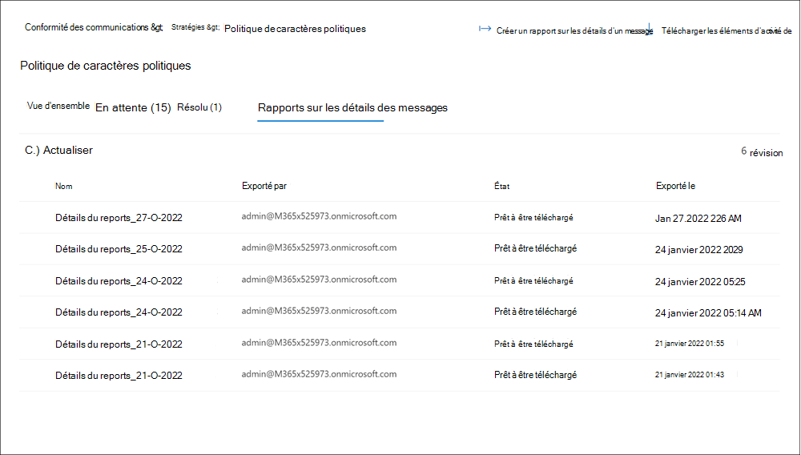

# <a name="use-communication-compliance-reports-and-audits"></a>Utiliser les rapports et audits de conformité des communications

[!include[Purview banner](../includes/purview-rebrand-banner.md)]

## <a name="reports"></a>Rapports

Le nouveau tableau **de bord Rapports** est l’emplacement central pour afficher tous les rapports de conformité des communications. Les widgets de rapport fournissent une vue rapide des insights les plus couramment nécessaires pour une évaluation globale de l’état des activités de conformité des communications. Les informations contenues dans les widgets de rapport ne sont pas exportables. Les rapports détaillés fournissent des informations détaillées sur des domaines spécifiques de conformité des communications et offrent la possibilité de filtrer, de regrouper, de trier et d’exporter des informations lors de l’examen. 

Pour le filtre de plage de dates, la date et l’heure des événements sont répertoriées en temps universel coordonné (UTC). Lors du filtrage des messages pour les rapports, la date/heure locale de l’utilisateur demandeur détermine les résultats en fonction de la conversion de la date/heure locale de l’utilisateur en UTC. Par exemple, si un utilisateur de l’heure d’été du Pacifique (PDT) filtre un rapport du 30/08/2021 au 31/08/2021 à 00:00, le rapport inclut des messages du 30/08/2021 de 07:00 UTC au 31/08/2021 07:00 UTC. Si le même utilisateur se trouvait à l’heure d’été de l’Est des États-Unis (EDT) lors du filtrage à 00:00, le rapport inclut les messages du 30/08/2021 04:00 UTC au 31/08/2021 04:00 UTC.


Le **tableau de bord Rapports** contient les widgets de rapport suivants et des liens de rapports détaillés :

### <a name="report-widgets"></a>Widgets de rapport

- **Correspondances de stratégie récentes** : affiche le nombre de correspondances par stratégie active au fil du temps.
- **Éléments résolus par stratégie** : affiche le nombre d’alertes de correspondance de stratégie résolues par stratégie au fil du temps.
- **Utilisateurs avec la plupart des correspondances de stratégie** : affiche les utilisateurs (ou les noms d’utilisateur anonymes) et le nombre de correspondances de stratégie pour une période donnée.
- **Stratégie avec la plupart des correspondances** : affiche les stratégies et le nombre de correspondances pour une période donnée, classées du plus haut au plus bas pour les correspondances.
- **Escalades par stratégie** : affiche le nombre d’escalades par stratégie sur une période donnée.

### <a name="detailed-reports"></a>Rapports détaillés

Utilisez l’option *Exporter* pour créer un fichier .csv contenant les détails du rapport pour tout rapport détaillé. L’option *Exporter* un rapport prend en charge les téléchargements de taille de fichier jusqu’à 3 Mo.

- **Paramètres et état** de la stratégie : fournit un examen détaillé de la configuration et des paramètres de stratégie, ainsi que l’état général de chacune des stratégies (correspondances et actions) sur les messages. Inclut les informations de stratégie et la façon dont les stratégies sont associées aux utilisateurs et aux groupes, aux emplacements, aux pourcentages de révision, aux réviseurs, à l’état et au moment de la dernière modification de la stratégie. Utilisez l’option *Exporter* pour créer un fichier .csv contenant les détails du rapport.
- **Éléments et actions par stratégie** : examinez et exportez les éléments correspondants et les actions de correction par stratégie. Inclut des informations de stratégie et la façon dont les stratégies sont associées :

    - Éléments mis en correspondance
    - Éléments escaladés
    - Éléments résolus
    - Marqué comme conforme
    - Marqué comme non conforme
    - Marqué comme étant contestable
    - Éléments en attente de révision
    - Notification de l’utilisateur
    - Cas créé

- **Élément et actions par emplacement** : examinez et exportez les éléments correspondants et les actions de correction par emplacement Microsoft 365. Inclut des informations sur la façon dont les plateformes de charge de travail sont associées :

    - Éléments mis en correspondance
    - Éléments escaladés
    - Éléments résolus
    - Marqué comme conforme
    - Marqué comme non conforme
    - Marqué comme étant contestable
    - Éléments en attente de révision
    - Notification de l’utilisateur
    - Cas créé

- **Activité par utilisateur** : examinez et exportez les éléments correspondants et les actions de correction par utilisateur. Inclut des informations sur la façon dont les utilisateurs sont associés :

    - Éléments mis en correspondance
    - Éléments escaladés
    - Éléments résolus
    - Marqué comme conforme
    - Marqué comme non conforme
    - Marqué comme étant contestable
    - Éléments en attente de révision
    - Notification de l’utilisateur
    - Cas créé

- **Type d’informations sensibles par emplacement** (préversion) : passez en revue et exportez des informations sur la détection des types d’informations sensibles et les sources associées dans les stratégies de conformité des communications. Inclut le total global et la répartition spécifique des instances de type d’informations sensibles dans les sources configurées dans votre organisation. Les valeurs de chaque source tierce sont affichées dans des colonnes distinctes dans le fichier .csv. Voici quelques exemples :

    - **E-mail** : types d’informations sensibles détectés dans Exchange messages électroniques.
    - **Teams** : Types d’informations sensibles détectés dans Microsoft Teams canaux et messages de conversation.
    - **Skype Entreprise** : Types d’informations sensibles détectés dans Skype pour les communications métier.
    - **Yammer** : Types d’informations sensibles détectés dans Yammer boîtes de réception, publications, conversations et réponses.
    - **Sources tierces** : types d’informations sensibles détectés pour les activités associées à des connecteurs tiers configurés dans votre organisation. Pour afficher la répartition des sources tierces pour un type d’informations sensibles spécifique dans le rapport, placez la souris sur la valeur du type d’informations sensibles dans la colonne source tierce.
    - **Autre** : types d’informations sensibles utilisés pour le traitement interne du système. La sélection ou la désélection de cette source pour le rapport n’affecte aucune valeur.

### <a name="message-details-report-preview"></a>Rapport des détails du message (préversion)

Créez des rapports personnalisés et examinez les détails des messages contenus dans des stratégies spécifiques sous l’onglet **Stratégies** . Ces rapports peuvent être utilisés pour toutes les révisions de messages et pour créer un instantané de rapport pour l’état des messages pendant une période personnalisable. Après avoir créé un rapport, vous pouvez afficher et télécharger le rapport de détails sous la forme d’un fichier .csv sous l’onglet **Rapports de détails** du message.



Pour créer un rapport de détails de message, effectuez les étapes suivantes :

1. Connectez-vous au portail de conformité Microsoft Purview avec un compte membre du groupe de *rôles Enquêteurs de conformité des communications* .
2. Accédez à l’onglet **Stratégies** , sélectionnez une stratégie, puis **sélectionnez Créer un rapport de détails de message**.
3. Dans le volet **Créer un rapport de détails du message** , entrez un nom pour le rapport dans le champ **Nom** du rapport.
4. Dans **Choisir une plage de dates**, sélectionnez une *date de début* et une *date de fin* pour le rapport.
5. Sélectionnez **Créer**.
6. La confirmation de création du rapport s’affiche.

Selon le nombre d’éléments du rapport, le téléchargement du rapport peut prendre quelques minutes à quelques heures. Vous pouvez vérifier la progression sous l’onglet Rapports de détails du message. L’état du rapport est *en cours* ou *prêt à être téléchargé*. Vous pouvez traiter jusqu’à 15 rapports distincts simultanément. Pour télécharger un rapport, sélectionnez un rapport dans l’état *Prêt à télécharger* , puis **sélectionnez Télécharger le rapport**.

> [!NOTE]
> Si votre période sélectionnée ne retourne aucun résultat de message dans le rapport, il n’y a pas eu de messages pour la période sélectionnée. Le rapport sera vide.

Les rapports de détails du message contiennent les informations suivantes pour chaque élément de message dans la stratégie :

- **ID de correspondance** : ID unique du message dans la stratégie.
- **Expéditeur** : expéditeur du message.
- **Destinataires** : destinataires inclus pour le message.
- **Date d’envoi** : date d’envoi du message.
- **Date de** correspondance : date à laquelle le message correspond aux conditions de stratégie.
- **Objet** : objet du message.
- **Contient des pièces jointes** : état des pièces jointes pour le message. Les valeurs sont Oui ou Non.
- **Nom** de la stratégie : nom de la stratégie associée au message. Cette valeur est identique pour tous les messages du rapport.
- **État de** l’élément : état de l’élément de message dans la stratégie. Les valeurs sont en attente ou résolues.
- **Balises** : balises affectées au message. Les valeurs sont contestables, conformes ou non conformes.
- **Correspondances de mot clé** : correspondances de mot clé pour le message.
- **Réviseurs** : réviseurs affectés au message.
- **En attente pendant (jours)** : nombre de jours pendant lesquels le message est dans un état en attente. Pour les messages résolus, la valeur est 0.
- **Commentaire pour résolu** : commentaires du message entré lorsqu’il est résolu.
- **Date de résolution** : date et heure de résolution du message.
- **Dernière mise à jour par** : nom d’utilisateur du dernier updater.
- **Dernière mise à jour :** date et heure de la dernière mise à jour du message.
- **Historique des commentaires** : liste de tous les commentaires pour l’alerte de message, y compris l’auteur du commentaire et la date/heure du commentaire.

## <a name="audit"></a>Audit

Dans certains cas, vous devez fournir des informations aux auditeurs de réglementation ou de conformité pour prouver la supervision des activités et des communications des utilisateurs. Ces informations peuvent être un résumé de toutes les activités associées à une stratégie organisationnelle définie ou chaque fois qu’une stratégie de conformité des communications change. Les stratégies de conformité des communications ont des pistes d’audit intégrées pour une préparation complète pour les audits internes ou externes. Les historiques d’audit détaillés de chaque action de création, de modification et de suppression sont capturés par vos stratégies de communication pour fournir une preuve des procédures de surveillance.

> [!IMPORTANT]
> L’audit doit être activé pour votre organisation avant l’enregistrement des événements de conformité des communications. Pour activer l’audit, consultez [Activer le journal d’audit](communication-compliance-configure.md#step-2-required-enable-the-audit-log). Lorsque des activités déclenchent des événements capturés dans le journal d’audit Microsoft 365, l’affichage de ces événements dans les stratégies de conformité des communications peut prendre jusqu’à 48 heures.

Pour afficher les activités de mise à jour de la stratégie de conformité des communications, sélectionnez le contrôle **Exporter les mises à jour** de stratégie sur la page principale pour toute stratégie. Vous devez disposer des rôles *d’administrateur général* ou *d’administrateur de conformité* des communications pour exporter les activités de mise à jour. Cette action génère un fichier d’audit au format .csv qui contient les informations suivantes :

|**Field**|**Détails**|
|:-----|:-----|
| **CreationDate** | Date à laquelle l’activité de mise à jour a été effectuée dans une stratégie. |
| **ID utilisateur** | Utilisateur qui a effectué l’activité de mise à jour dans une stratégie. |
| **Operations** | Opérations de mise à jour effectuées sur la stratégie. |
| **AuditData** | Ce champ est la principale source de données pour toutes les activités de mise à jour de stratégie. Toutes les activités de mise à jour sont enregistrées et séparées par des séparateurs de virgules. |

Pour afficher les activités de révision de conformité des communications pour une stratégie, sélectionnez le contrôle **Exporter les activités de révision** dans la page **Vue d’ensemble** d’une stratégie spécifique. Les rôles *Administrateur général* ou *Administrateur de conformité des communications* doivent vous être attribués pour exporter les activités de révision. Cette action génère un fichier d’audit au format .csv qui contient les informations suivantes :

|**Field**|**Détails**|
|:-----|:-----|
| **CreationDate** | Date à laquelle l’activité de révision a été effectuée dans une stratégie. |
| **ID utilisateur** | Utilisateur qui a effectué l’activité de révision dans une stratégie. |
| **Operations** | Opérations de révision effectuées sur la stratégie. |
| **AuditData** | Ce champ est la principale source de données pour toutes les activités de révision de stratégie. Toutes les activités de révision sont enregistrées et séparées par des délimiteurs de virgules. |

Vous pouvez également afficher les activités d’audit dans le journal d’audit unifié ou avec l’applet de commande PowerShell [Search-UnifiedAuditLog](/powershell/module/exchange/search-unifiedauditlog) . Pour en savoir plus sur les stratégies de rétention des journaux d’audit, consultez [Gérer les stratégies de rétention des journaux d’audit](audit-log-retention-policies.md).

Par exemple, l’exemple suivant retourne les activités pour toutes les activités d’examen de surveillance (stratégies et règles) :

```PowerShell
Search-UnifiedAuditLog -StartDate $startDate -EndDate $endDate -RecordType AeD -Operations SupervisoryReviewTag
```

Cet exemple retourne les activités de mise à jour pour vos stratégies de conformité des communications :

```PowerShell
Search-UnifiedAuditLog -StartDate $startDate -EndDate $endDate -RecordType Discovery -Operations SupervisionPolicyCreated,SupervisionPolicyUpdated,SupervisionPolicyDeleted
```

Cet exemple retourne des activités qui correspondent à vos stratégies de conformité des communications actuelles :

```PowerShell
Search-UnifiedAuditLog -StartDate $startDate -EndDate $endDate -Operations SupervisionRuleMatch
```

Les correspondances de stratégie de conformité des communications sont stockées dans une boîte aux lettres de supervision pour chaque stratégie. Dans certains cas, vous devrez peut-être vérifier la taille de votre boîte aux lettres de supervision pour une stratégie afin de vous assurer que vous n’approchez pas de la taille de stockage actuelle de 100 Go ou de la limite de 1 million de messages. Si la limite de boîte aux lettres est atteinte, les correspondances de stratégie ne sont pas capturées et vous devez créer une stratégie (avec les mêmes paramètres) pour continuer à capturer des correspondances pour les mêmes activités.

Pour vérifier la taille d’une boîte aux lettres de supervision pour une stratégie, procédez comme suit :

1. Utilisez [l’applet de commande Connecter-ExchangeOnline](/powershell/module/exchange/connect-exchangeonline) dans le module Exchange Online PowerShell V2 pour vous connecter à Exchange Online PowerShell à l’aide de l’authentification moderne.
2. Exécutez la commande suivante dans PowerShell :

    ```PowerShell
    ForEach ($p in Get-SupervisoryReviewPolicyV2 | Sort-Object Name)
    {
       "<Name of your communication compliance policy>: " + $p.Name
       Get-MailboxStatistics $p.ReviewMailbox | ft ItemCount,TotalItemSize
    }
    ```
