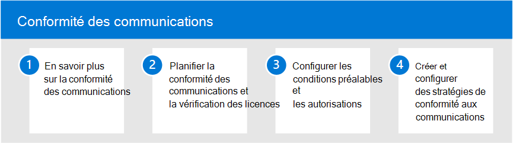

# Conformité des communications

>[!IMPORTANT]
>Conformité des communications Microsoft Purview fournit les outils pour aider les organisations à détecter les violations de conformité réglementaire (par exemple SEC ou FINRA), telles que des informations sensibles ou confidentielles, des propos harcelants ou menaçants, et le partage de contenu pour adultes. Conçu avec la confidentialité par défaut, les noms d’utilisateur sont pseudonymisés par défaut, les contrôles d’accès en fonction du rôle sont intégrés, les enquêteurs sont activés par un administrateur et les journaux d’audit sont en place pour garantir la confidentialité au niveau de l’utilisateur.

La protection des informations sensibles et la détection des incidents de harcèlement en milieu de travail et leur action sont des éléments importants de la conformité aux politiques et normes internes. Conformité des communications Microsoft Purview permet de réduire ces risques en vous aidant à détecter, capturer et prendre rapidement des mesures correctives pour la messagerie électronique et les communications Microsoft Teams. Il s’agit notamment de communications potentiellement inappropriées contenant des grossièretés, des menaces, du harcèlement et des communications qui partagent des informations sensibles à l’intérieur et à l’extérieur de votre organisation.

[!INCLUDE [purview-preview](../includes/purview-preview.md)]

## Configurer la conformité des communications

Procédez comme suit pour configurer la conformité des communications pour votre organisation :

1. En savoir plus sur [la conformité des communications](/microsoft-365/compliance/communication-compliance)
2. Planifier la [conformité des communications](/microsoft-365/compliance/communication-compliance-plan) et [vérifier les licences](/microsoft-365/compliance/communication-compliance-configure#subscriptions-and-licensing)
3. Configurer [les prérequis](/microsoft-365/compliance/communication-compliance-configure#step-2-required-enable-the-audit-log) et [les autorisations](/microsoft-365/compliance/communication-compliance-configure#step-1-required-enable-permissions-for-communication-compliance)
4. Créer et configurer des [stratégies de conformité des communications](/microsoft-365/compliance/communication-compliance-configure#step-5-required-create-a-communication-compliance-policy)

## Plus d’informations sur la conformité des communications

- [Examiner et corriger les alertes](/microsoft-365/compliance/communication-compliance-investigate-remediate)
- [Étude de cas : Contoso configure rapidement une stratégie de contenu inappropriée pour les communications Microsoft Teams, Exchange et Yammer](/microsoft-365/compliance/communication-compliance-case-study)
