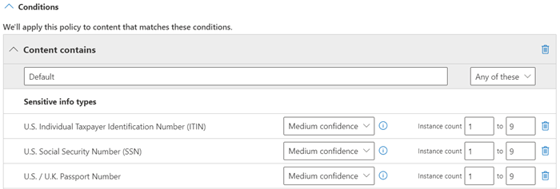

# <a name="create-a-custom-sensitive-information-type-using-powershell"></a>Créer un type d’informations sensibles personnalisé à l’aide de PowerShell

Cet article vous montre comment créer un fichier de *package de règles* XML qui définit des [types d’informations sensibles](sensitive-information-type-entity-definitions.md) personnalisés. Cet article décrit un type d’informations sensibles personnalisé qui identifie un ID d’employé. Vous pouvez utiliser l’exemple de code XML de cet article comme point de départ pour votre propre fichier XML.

Pour plus d’informations sur les types d’informations sensibles, consultez [En savoir plus sur les types d’informations sensibles](sensitive-information-type-learn-about.md).

Une fois que vous avez créé un fichier XML bien formé, vous pouvez le charger dans Microsoft 365 à l’aide de PowerShell. Ensuite, vous êtes prêt à utiliser votre type d’informations sensibles personnalisé dans les stratégies. Vous pouvez tester son efficacité dans la détection des informations sensibles comme prévu.

> [!NOTE]
> Si vous n’avez pas besoin du contrôle affiné fourni par PowerShell, vous pouvez créer des types d’informations sensibles personnalisés dans le portail de conformité Microsoft Purview. Pour en savoir plus, consulter [Créer un type d’informations sensibles personnalisé](create-a-custom-sensitive-information-type.md).

## <a name="important-disclaimer"></a>Clause d’exclusion de responsabilité importante

Support Microsoft ne peut pas vous aider à créer des définitions de correspondance de contenu.

Pour le développement, les tests et le débogage de contenus personnalisés, vous devez utiliser vos propres ressources informatiques internes ou utiliser des services de conseil, tels que Microsoft Consulting Services (MCS). Support Microsoft ingénieurs peuvent fournir une prise en charge limitée de cette fonctionnalité, mais ils ne peuvent pas garantir que les suggestions personnalisées de correspondance de contenu répondront pleinement à vos besoins.

MCS peut fournir des expressions régulières à des fins de test. Ils peuvent également vous aider à résoudre les problèmes d’un modèle RegEx existant qui ne fonctionne pas comme prévu avec un seul exemple de contenu spécifique.

Consultez [les problèmes de validation potentiels à prendre en compte](#potential-validation-issues-to-be-aware-of) dans cet article.

Pour plus d’informations sur le moteur Boost.RegEx (anciennement RegEx ++) utilisé pour traiter le texte, consultez [Boost.Regex 5.1.3](https://www.boost.org/doc/libs/1_68_0/libs/regex/doc/html/).

> [!NOTE]
> Si vous utilisez un caractère ampersand (&) dans le cadre d’un mot clé dans votre type d’informations sensibles personnalisé, vous devez ajouter un terme supplémentaire avec des espaces autour du caractère. Par exemple, n’utilisez `L & P` _pas_ `L&P`.

## <a name="sample-xml-of-a-rule-package"></a>Exemple de code XML d’un package de règles

Voici l’exemple de code XML du package de règles que nous allons créer dans cet article. Les éléments et les attributs sont expliqués dans les sections ci-dessous.

```xml
<?xml version="1.0" encoding="UTF-16"?>
<RulePackage xmlns="http://schemas.microsoft.com/office/2011/mce">
<RulePack id="DAD86A92-AB18-43BB-AB35-96F7C594ADAA">
  <Version build="0" major="1" minor="0" revision="0"/>
  <Publisher id="619DD8C3-7B80-4998-A312-4DF0402BAC04"/>
  <Details defaultLangCode="en-us">
    <LocalizedDetails langcode="en-us">
      <PublisherName>Contoso</PublisherName>
      <Name>Employee ID Custom Rule Pack</Name>
      <Description>
      This rule package contains the custom Employee ID entity.
      </Description>
    </LocalizedDetails>
  </Details>
</RulePack>
<Rules>
<!-- Employee ID -->
  <Entity id="E1CC861E-3FE9-4A58-82DF-4BD259EAB378" patternsProximity="300" recommendedConfidence="75">
    <Pattern confidenceLevel="65">
      <IdMatch idRef="Regex_employee_id"/>
    </Pattern>
    <Pattern confidenceLevel="75">
      <IdMatch idRef="Regex_employee_id"/>
      <Match idRef="Func_us_date"/>
    </Pattern>
    <Pattern confidenceLevel="85">
      <IdMatch idRef="Regex_employee_id"/>
      <Match idRef="Func_us_date"/>
      <Any minMatches="1">
        <Match idRef="Keyword_badge" minCount="2"/>
        <Match idRef="Keyword_employee"/>
      </Any>
      <Any minMatches="0" maxMatches="0">
        <Match idRef="Keyword_false_positives_local"/>
        <Match idRef="Keyword_false_positives_intl"/>
      </Any>
    </Pattern>
  </Entity>
  <Regex id="Regex_employee_id">(\s)(\d{9})(\s)</Regex>
  <Keyword id="Keyword_employee">
    <Group matchStyle="word">
      <Term>Identification</Term>
      <Term>Contoso Employee</Term>
    </Group>
  </Keyword>
  <Keyword id="Keyword_badge">
    <Group matchStyle="string">
      <Term>card</Term>
      <Term>badge</Term>
      <Term caseSensitive="true">ID</Term>
    </Group>
  </Keyword>
  <Keyword id="Keyword_false_positives_local">
    <Group matchStyle="word">
      <Term>credit card</Term>
      <Term>national ID</Term>
    </Group>
  </Keyword>
  <Keyword id="Keyword_false_positives_intl">
    <Group matchStyle="word">
      <Term>identity card</Term>
      <Term>national ID</Term>
      <Term>EU debit card</Term>
    </Group>
  </Keyword>
  <LocalizedStrings>
    <Resource idRef="E1CC861E-3FE9-4A58-82DF-4BD259EAB378">
      <Name default="true" langcode="en-us">Employee ID</Name>
      <Description default="true" langcode="en-us">
      A custom classification for detecting Employee IDs.
      </Description>
      <Description default="false" langcode="de-de">
      Description for German locale.
      </Description>
    </Resource>
  </LocalizedStrings>
</Rules>
</RulePackage>
```

## <a name="what-are-your-key-requirements-rule-entity-pattern-elements"></a>Quelles sont vos principales exigences ? [Rule, Entity, Pattern elements]

Il est important de comprendre la structure de base du schéma XML pour une règle. Votre compréhension de la structure aidera votre type d’informations sensibles personnalisé à identifier le contenu approprié.

Une règle définit une ou plusieurs entités (également appelées types d’informations sensibles). Chaque entité définit un ou plusieurs modèles. Un modèle correspond à ce qu’une stratégie recherche lorsqu’elle évalue le contenu (par exemple, l’e-mail et les documents).

Dans le balisage XML, les « règles » désignent les modèles qui définissent le type d’informations sensibles. N’associez pas les références aux règles de cet article à des « conditions » ou des « actions » courantes dans d’autres fonctionnalités de Microsoft.

### <a name="simplest-scenario-entity-with-one-pattern"></a>Scénario le plus simple : entité avec un modèle

Voici un scénario simple : vous souhaitez que votre stratégie identifie le contenu qui contient des ID d’employé à neuf chiffres utilisés dans votre organisation. Un modèle fait référence à l’expression régulière dans la règle qui identifie les nombres à neuf chiffres. Tout contenu qui contient un nombre à neuf chiffres correspond au modèle.


Toutefois, ce modèle peut identifier **n’importe quel** nombre à neuf chiffres, y compris les nombres plus longs ou d’autres types de nombres à neuf chiffres qui ne sont pas des ID d’employé. Ce type de correspondance indésirable est appelé *faux positif*.

### <a name="more-common-scenario-entity-with-multiple-patterns"></a>Scénario le plus courant : entité avec plusieurs modèles

En raison du potentiel de faux positifs, vous utilisez généralement plusieurs modèles pour définir une entité. Plusieurs modèles fournissent des preuves de prise en charge pour l’entité cible. Par exemple, des mots clés supplémentaires, des dates ou un autre texte peuvent aider à identifier l’entité d’origine (par exemple, le numéro d’employé à neuf chiffres).

Par exemple, pour augmenter la probabilité d’identifier le contenu qui contient un ID d’employé, vous pouvez définir d’autres modèles à rechercher :

- Modèle qui identifie une date d’embauche.
- Modèle qui identifie à la fois une date d’embauche et le mot clé « ID d’employé ».


Il existe des points importants à prendre en compte pour plusieurs correspondances de modèle :

- Les modèles qui nécessitent plus de preuves ont un niveau de confiance plus élevé. En fonction du niveau de confiance, vous pouvez effectuer les actions suivantes :
  - Utilisez des actions plus restrictives (telles que le contenu de bloc) avec des correspondances plus fiables.
  - Utilisez des actions moins restrictives (telles que l’envoi de notifications) avec des correspondances de confiance inférieure.

- Les éléments et `Match` les éléments de prise en `IdMatch` charge font référence à RegExes et aux mots clés qui sont en fait des enfants de l’élément`Rule`, et non le `Pattern`. Ces éléments de prise en charge sont référencés par le `Pattern`, mais sont inclus dans le `Rule`. Ce comportement signifie qu’une définition unique d’un élément de prise en charge, telle qu’une expression régulière ou une liste de mots clés, peut être référencée par plusieurs entités et modèles.

## <a name="what-entity-do-you-need-to-identify-entity-element-id-attribute"></a>Quelle entité devez-vous identifier ? [Élément d’entité, attribut ID]

Une entité est un type d’informations sensibles, tel qu’un numéro de carte de crédit, associé à un modèle bien défini. Chaque entité possède un GUID unique en tant qu’ID.

### <a name="name-the-entity-and-generate-its-guid"></a>Nommer l’entité et générer son GUID

1. Dans votre éditeur XML de votre choix, ajoutez les éléments et `Entity` les `Rules` éléments.
2. Ajoutez un commentaire qui contient le nom de votre entité personnalisée, par exemple l’ID d’employé. Plus tard, vous ajouterez le nom de l’entité à la section chaînes localisées, et ce nom apparaît dans le centre d’administration lorsque vous créez une stratégie.
3. Générez un GUID unique pour votre entité. Par exemple, dans Windows PowerShell, vous pouvez exécuter la commande `[guid]::NewGuid()`. Plus tard, vous ajouterez également le GUID à la section chaînes localisées de l’entité.


## <a name="what-pattern-do-you-want-to-match-pattern-element-idmatch-element-regex-element"></a>Quel modèle voulez-vous mettre en correspondance ? [Élément Pattern, élément IdMatch, élément Regex]

Le modèle contient la liste de ce que recherche le type d’informations sensibles. Le modèle peut inclure des regex, des mots clés et des fonctions intégrées. Les fonctions effectuent des tâches telles que l’exécution de RegExes pour rechercher des dates ou des adresses. Ces types d’informations sensibles peuvent avoir plusieurs modèles avec des niveaux de confiance uniques.

Dans le diagramme suivant, tous les modèles référencent la même expression régulière. Ce RegEx recherche un nombre `(\d{9})` à neuf chiffres entouré d’espaces blancs `(\s) ... (\s)`. Cette expression régulière est référencée par l’élément `IdMatch` et est l’exigence courante pour tous les modèles qui recherchent l’entité Employee ID. `IdMatch` est l’identificateur que le modèle doit essayer de mettre en correspondance. Un `Pattern` élément doit avoir exactement un élément `IdMatch` .


Une correspondance de modèle satisfait retourne un nombre et un niveau de confiance, que vous pouvez utiliser dans les conditions de votre stratégie. Lorsque vous ajoutez une condition pour détecter un type d’informations sensibles à une stratégie, vous pouvez modifier le nombre et le niveau de confiance, comme indiqué dans le diagramme suivant. Le niveau de confiance (également appelé précision des correspondances) est expliqué plus loin dans cet article.



Les expressions régulières sont puissantes, il y a donc des problèmes que vous devez connaître. Par exemple, un RegEx qui identifie trop de contenu peut affecter les performances. Pour en savoir plus sur ces problèmes, consultez les [problèmes de validation potentiels à connaître dans la](#potential-validation-issues-to-be-aware-of) section plus loin dans cet article.

## <a name="do-you-want-to-require-additional-evidence-match-element-mincount-attribute"></a>Voulez-vous exiger des preuves supplémentaires ? [Élément Match, attribut minCount]

En plus, `IdMatch`un modèle peut utiliser l’élément `Match` pour exiger des preuves de prise en charge supplémentaires, telles qu’un mot clé, RegEx, une date ou une adresse.

Un `Pattern` peut inclure plusieurs `Match` éléments :

- Directement dans l’élément `Pattern` .
- Combiné à l’aide de l’élément `Any` .

`Match` sont joints par un opérateur AND implicite. En d’autres termes, tous les `Match` éléments doivent être satisfaits pour que le modèle soit mis en correspondance.

Vous pouvez utiliser l’élément `Any` pour introduire des opérateurs AND ou OR. L’élément `Any` est décrit plus loin dans cet article.

Vous pouvez utiliser l’attribut facultatif `minCount` pour spécifier le nombre d’instances d’une correspondance à trouver pour chaque `Match` élément. Par exemple, vous pouvez spécifier qu’un modèle est satisfait uniquement quand au moins deux mots clés d’une liste de mots clés sont trouvés.


### <a name="keywords-keyword-group-and-term-elements-matchstyle-and-casesensitive-attributes"></a>Mots clés [éléments Keyword, Group et Term, attributs matchStyle et caseSensitive]

Comme décrit précédemment, l’identification d’informations sensibles nécessite souvent des mots clés supplémentaires comme preuve corroborante. Par exemple, en plus de la correspondance d’un nombre à neuf chiffres, vous pouvez rechercher des mots tels que « carte », « badge » ou « ID » à l’aide de l’élément Keyword. L’élément `Keyword` a un `ID` attribut qui peut être référencé par plusieurs `Match` éléments dans plusieurs modèles ou entités.

Les mots clés sont inclus sous la forme d’une liste d’éléments `Term` dans un `Group` élément. L’élément `Group` a un `matchStyle` attribut avec deux valeurs possibles :

- **matchStyle="word »** : une correspondance de mots identifie des mots entiers entourés d’espaces blancs ou d’autres délimiteurs. Vous devez toujours utiliser **le mot** , sauf si vous avez besoin de faire correspondre des parties de mots ou de mots dans les langues asiatiques.

- **matchStyle="string »** : une correspondance de chaîne identifie les chaînes, peu importe ce qui les entoure. Par exemple, « ID » correspond à « bid » et « idea ». Utilisez `string` uniquement lorsque vous devez faire correspondre des mots asiatiques ou si votre mot clé peut être inclus dans d’autres chaînes.

Enfin, vous pouvez utiliser l’attribut `caseSensitive` de l’élément `Term` pour spécifier que le contenu doit correspondre exactement au mot clé, y compris les lettres minuscules et majuscules.


### <a name="regular-expressions-regex-element"></a>Expressions régulières [élément Regex]

Dans cet exemple, l’entité employee `ID` utilise déjà l’élément `IdMatch` pour référencer une expression régulière pour le modèle : un nombre à neuf chiffres entouré d’espaces blancs. En outre, un modèle peut utiliser un `Match` élément pour référencer un élément supplémentaire `Regex` afin d’identifier des preuves corroborantes, telles qu’un nombre à cinq chiffres ou à neuf chiffres au format d’un code postal américain.

### <a name="additional-patterns-such-as-dates-or-addresses-built-in-functions"></a>Autres modèles tels que des dates ou des adresses [fonctions intégrées]

Les types d’informations sensibles peuvent également utiliser des fonctions intégrées pour identifier les preuves corroborantes. Par exemple, une date des États-Unis, une date de l’UE, une date d’expiration ou une adresse des États-Unis. Microsoft 365 ne prend pas en charge le chargement de vos propres fonctions personnalisées. Toutefois, lorsque vous créez un type d’informations sensibles personnalisé, votre entité peut référencer des fonctions intégrées.

Par exemple, un badge d’ID d’employé comporte une date d’embauche. Cette entité personnalisée peut donc utiliser la fonction intégrée `Func_us_date` pour identifier une date au format couramment utilisé aux États-Unis.

Pour plus d’informations, consultez [fonctions de type Informations sensibles](sit-functions.md).


## <a name="different-combinations-of-evidence-any-element-minmatches-and-maxmatches-attributes"></a>Différentes combinaisons de preuves [élément Any, attributs minMatches et maxMatches]

Dans un `Pattern` élément, tous les éléments et `Match` tous `IdMatch` les éléments sont joints par un opérateur AND implicite. En d’autres termes, toutes les correspondances doivent être satisfaites avant que le modèle puisse être satisfait.

Vous pouvez créer une logique de correspondance plus flexible à l’aide de l’élément `Any` pour regrouper `Match` des éléments. Par exemple, vous pouvez utiliser l’élément `Any` pour faire correspondre tous, aucun ou un sous-ensemble exact de ses éléments enfants `Match` .

L’élément `Any` a des attributs facultatifs `minMatches` et `maxMatches` que vous pouvez utiliser pour définir le nombre d’éléments enfants `Match` qui doivent être satisfaits avant que le modèle ne soit mis en correspondance. Ces attributs définissent le *nombre* d’éléments `Match` , et non le nombre d’instances de preuve trouvées pour les correspondances. Pour définir un nombre minimal d’instances pour une correspondance spécifique, par exemple deux mots clés d’une liste, utilisez l’attribut `minCount` d’un `Match` élément (voir ci-dessus).

### <a name="match-at-least-one-child-match-element"></a>Faire correspondre au moins un élément Match enfant

Pour n’exiger qu’un nombre minimal d’éléments `Match` , vous pouvez utiliser l’attribut `minMatches` . En effet, ces `Match` éléments sont joints par un opérateur OR implicite. Cet `Any` élément est satisfait si une date mise en forme aux États-Unis ou un mot clé de l’une ou l’autre liste est trouvé.

```xml
<Any minMatches="1" >
     <Match idRef="Func_us_date" />
     <Match idRef="Keyword_employee" />
     <Match idRef="Keyword_badge" />
</Any>
```

### <a name="match-an-exact-subset-of-any-children-match-elements"></a>Faire correspondre un sous-ensemble exact d’éléments Match enfants

Pour exiger un nombre exact d’éléments`Match`, définissez et `maxMatches` affectez `minMatches` la même valeur. Cet `Any` élément n’est satisfait que si une seule date ou mot clé est trouvé. S’il y a d’autres correspondances, le modèle n’est pas mis en correspondance.

```xml
<Any minMatches="1" maxMatches="1" >
     <Match idRef="Func_us_date" />
     <Match idRef="Keyword_employee" />
     <Match idRef="Keyword_badge" />
</Any>
```

### <a name="match-none-of-children-match-elements"></a>Faire correspondre tous les enfants Match enfants

Si vous voulez exiger l’absence de preuve spécifique pour qu’un modèle soit satisfait, vous pouvez définir les attributs minMatches et maxMatches sur 0. Cela est utile si vous avez une liste de mots clés ou d’autres preuves susceptibles d’indiquer de faux positifs.

Par exemple, l’entité d’ID d’employé recherche le mot clé « carte », car il peut désigner une « carte d’identité ». Toutefois, si « carte » apparaît uniquement dans l’expression « carte de crédit », il est peu probable que « carte » dans ce contenu signifie « carte d’identité ». Par conséquent, vous pouvez ajouter « carte de crédit » comme mot clé à une liste de termes que vous voulez exclure de la satisfaction du modèle.

```xml
<Any minMatches="0" maxMatches="0" >
    <Match idRef="Keyword_false_positives_local" />
    <Match idRef="Keyword_false_positives_intl" />
</Any>
```

### <a name="match-a-number-of-unique-terms"></a>Corrélation de termes uniques

Si vous voulez corréler un certain nombre de termes uniques, utilisez le paramètre *uniqueResults* et définissez-le sur *true* comme illustré dans l’exemple suivant :

```xml
<Pattern confidenceLevel="75">
    <IdMatch idRef="Salary_Revision_terms" />
    <Match idRef=" Salary_Revision_ID " minCount="3" uniqueResults="true" />
</Pattern>
```

Dans cet exemple, un modèle est défini pour une révision salariale utilisant au moins trois correspondances uniques.

## <a name="how-close-to-the-entity-must-the-other-evidence-be-patternsproximity-attribute"></a>Quel doit être le degré de proximité de l’entité par rapport à l’autre preuve ? [attribut patternsProximity]

Votre type d’informations sensibles recherche un modèle qui représente un ID d’employé et dans le cadre de ce modèle, il recherche également comme preuve probante un mot clé tel que « ID ». Il est logique que plus la proximité de cette preuve est élevée, plus le modèle est susceptible d’être un ID d’employé. Vous pouvez déterminer le degré de proximité d’autres preuves par rapport à l’entité dans le modèle à l’aide de l’attribut obligatoire patternsProximity de l’élément Entity.


Pour chaque modèle de l’entité, la valeur de l’attribut patternsProximity définit la distance (en caractères Unicode) à partir de l’emplacement IdMatch pour toutes les autres correspondances spécifiées pour ce modèle. La fenêtre de proximité est ancrée par l’emplacement IdMatch. La fenêtre s’étend à gauche et à droite de l’IdMatch.


L’exemple indiqué ci-après illustre comment la fenêtre de proximité affecte la correspondance du modèle là où l’élément IdMatch requiert au moins une correspondance probante de mot clé ou de date pour l’entité personnalisée d’ID d’employé. Seul ID1 correspond, car pour ID2 et ID3, seule une preuve probante partielle (voire aucune preuve probante) a été détectée au sein de la fenêtre de proximité.


Notez que pour l’e-mail, le corps du message et chaque pièce jointe sont traités comme des éléments distincts. Cela signifie que la fenêtre de proximité ne s’étend pas au-delà de la fin de chacun de ces éléments. Pour chaque élément (pièce jointe ou corps), la preuve idMatch et corroborante doit résider dans cet élément.

## <a name="what-are-the-right-confidence-levels-for-different-patterns-confidencelevel-attribute-recommendedconfidence-attribute"></a>Quels sont les niveaux de confiance appropriés pour les différents modèles ? [attributs confidenceLevel et recommendedConfidence]

Plus un modèle nécessite de preuves, plus vous pouvez être certain qu’une entité (par exemple, l’ID d’employé) a effectivement été identifiée lorsque le modèle a été mis en correspondance. Par exemple, vous pouvez davantage compter sur un modèle qui nécessite un numéro d’identification à neuf chiffres, une date d’embauche et un mot clé situés à proximité immédiate les uns des autres, que sur un modèle qui nécessite uniquement un numéro d’identification à neuf chiffres.

L’élément Pattern est associé à un attribut confidenceLevel obligatoire. Vous pouvez considérer la valeur de confidenceLevel (valeur comprise entre 65/75/85 et 85 indiquant des niveaux de confiance faible/moyen/élevé) comme un ID unique pour chaque modèle d’une entité. Une fois que vous avez chargé votre type d’informations sensibles personnalisé et que vous avez créé une stratégie, vous pouvez référencer ces niveaux de confiance dans les conditions des règles que vous créez.


En plus de l’attribut confidenceLevel de chaque modèle, l’entité possède un attribut recommendedConfidence. L’attribut de niveau de confiance recommandé est assimilable au niveau de confiance par défaut de la règle. Lorsque vous créez une règle dans une stratégie, si vous n’indiquez pas le niveau de confiance que la règle doit utiliser, cette règle recherche les correspondances en fonction du niveau de confiance recommandé pour l’entité. Notez que l’attribut recommendedConfidence est obligatoire pour chaque ID d’entité dans le package de règles, sans lui, vous ne pourrez pas enregistrer les stratégies utilisant le type d’informations sensibles.

## <a name="do-you-want-to-support-other-languages-in-the-ui-of-the-compliance-center-localizedstrings-element"></a>Voulez-vous prendre en charge d’autres langues dans l’interface utilisateur du centre de conformité ? Élément LocalizedStrings

Si votre équipe de conformité utilise le portail de conformité Microsoft Purview pour créer des stratégies dans différents paramètres régionaux et dans différentes langues, vous pouvez fournir des versions localisées du nom et de la description de votre type d’informations sensibles personnalisé. Lorsque votre équipe de conformité utilise Microsoft 365 dans une langue que vous prenez en charge, le nom localisé s’affiche dans l’interface utilisateur.


L’élément Rules doit contenir un élément LocalizedStrings, qui contient un élément Resource référençant le GUID de votre entité personnalisée. À son tour, chaque élément Resource contient un ou plusieurs éléments Name et Description qui utilisent l’attribut langcode afin de fournir une chaîne localisée pour une langue spécifique.


Notez que vous utilisez des chaînes localisées uniquement pour l’affichage de votre type d’informations sensibles dans l’interface utilisateur du Centre de conformité. Vous ne pouvez pas utiliser des chaînes localisées pour fournir différentes versions localisées d’une liste de mots clés ou une expression régulière.

## <a name="other-rule-package-markup-rulepack-guid"></a>Autre balisage de package de règles [GUID RulePack]

Enfin, le début de chaque RulePackage contient des informations générales que vous avez besoin de compléter. Vous pouvez utiliser le balisage suivant comme modèle et remplacer les espaces réservés « ... » avec vos propres informations.

Vous devez surtout générer un GUID pour le RulePack. Ci-dessus, vous avez généré un GUID pour l’entité ; il s’agit d’un second GUID pour le RulePack. Il existe plusieurs méthodes pour générer des GUID, mais vous pouvez le faire facilement dans PowerShell en saisissant [guid]::NewGuid().

L’élément Version est également important. Lorsque vous chargez votre package de règles pour la première fois, Microsoft 365 prend note du numéro de version. Si vous mettez à jour le package de règles ultérieurement et téléchargez une nouvelle version, veillez à mettre à jour le numéro de version, sinon Microsoft 365 ne déploiera pas le package de règles.

```xml
<?xml version="1.0" encoding="utf-16"?>
<RulePackage xmlns="http://schemas.microsoft.com/office/2011/mce">
  <RulePack id=". . .">
    <Version major="1" minor="0" build="0" revision="0" />
    <Publisher id=". . ." />
    <Details defaultLangCode=". . .">
      <LocalizedDetails langcode=" . . . ">
         <PublisherName>. . .</PublisherName>
         <Name>. . .</Name>
         <Description>. . .</Description>
      </LocalizedDetails>
    </Details>
  </RulePack>

 <Rules>
  . . .
 </Rules>
</RulePackage>
```

Lorsque vous avez terminé, votre élément RulePack doit ressembler à ce qui suit :


## <a name="validators"></a>Validateurs

Microsoft 365 expose les processeurs de fonction pour les SIT couramment utilisés en tant que validateurs. Voici une liste d’entre eux.

### <a name="list-of-currently-available-validators"></a>Liste des validateurs actuellement disponibles

- `Func_credit_card`
- `Func_ssn`
- `Func_unformatted_ssn`
- `Func_randomized_formatted_ssn`
- `Func_randomized_unformatted_ssn`
- `Func_aba_routing`
- `Func_south_africa_identification_number`
- `Func_brazil_cpf`
- `Func_iban`
- `Func_brazil_cnpj`
- `Func_swedish_national_identifier`
- `Func_india_aadhaar`
- `Func_uk_nhs_number`
- `Func_Turkish_National_Id`
- `Func_australian_tax_file_number`
- `Func_usa_uk_passport`
- `Func_canadian_sin`
- `Func_formatted_itin`
- `Func_unformatted_itin`
- `Func_dea_number_v2`
- `Func_dea_number`
- `Func_japanese_my_number_personal`
- `Func_japanese_my_number_corporate`

Cela vous permet de définir votre propre RegEx et de les valider. Pour utiliser des validateurs, définissez votre propre RegEx et utilisez la `Validator` propriété pour ajouter le processeur de fonction de votre choix. Une fois défini, vous pouvez utiliser ce RegEx dans un SIT.

Dans l’exemple ci-dessous, une expression régulière Regex_credit_card_AdditionalDelimiters est définie pour la carte de crédit, qui est ensuite validée à l’aide de la fonction somme de contrôle pour la carte de crédit en utilisant Func_credit_card comme validateur.

```xml
<Regex id="Regex_credit_card_AdditionalDelimiters" validators="Func_credit_card"> (?:^|[\s,;\:\(\)\[\]"'])([0-9]{4}[ -_][0-9]{4}[ -_][0-9]{4}[ -_][0-9]{4})(?:$|[\s,;\:\(\)\[\]"'])</Regex>
<Entity id="675634eb7-edc8-4019-85dd-5a5c1f2bb085" patternsProximity="300" recommendedConfidence="85">
<Pattern confidenceLevel="85">
<IdMatch idRef="Regex_credit_card_AdditionalDelimiters" />
<Any minMatches="1">
<Match idRef="Keyword_cc_verification" />
<Match idRef="Keyword_cc_name" />
<Match idRef="Func_expiration_date" />
</Any>
</Pattern>
</Entity>
```

Microsoft 365 fournit deux validateurs génériques

### <a name="checksum-validator"></a>Validateur de somme de contrôle

Dans cet exemple, un validateur de somme de contrôle pour l’ID d’employé est défini pour valider l’expression Régulière pour EmployeeID.

```xml
<Validators id="EmployeeIDChecksumValidator">
<Validator type="Checksum">
<Param name="Weights">2, 2, 2, 2, 2, 1</Param>
<Param name="Mod">28</Param>
<Param name="CheckDigit">2</Param> <!-- Check 2nd digit -->
<Param name="AllowAlphabets">1</Param> <!— 0 if no Alphabets -->
</Validator>
</Validators>
<Regex id="Regex_EmployeeID" validators="ChecksumValidator">(\d{5}[A-Z])</Regex>
<Entity id="675634eb7-edc8-4019-85dd-5a5c1f2bb085" patternsProximity="300" recommendedConfidence="85">
<Pattern confidenceLevel="85">
<IdMatch idRef="Regex_EmployeeID"/>
</Pattern>
</Entity>
```

### <a name="date-validator"></a>Validateur de date

Dans cet exemple, un validateur de date est défini pour une partie RegEx dont la date est définie.

```xml
<Validators id="date_validator_1"> <Validator type="DateSimple"> <Param name="Pattern">DDMMYYYY</Param> <!—supported patterns DDMMYYYY, MMDDYYYY, YYYYDDMM, YYYYMMDD, DDMMYYYY, DDMMYY, MMDDYY, YYDDMM, YYMMDD --> </Validator> </Validators>
<Regex id="date_regex_1" validators="date_validator_1">\d{8}</Regex>
```

## <a name="changes-for-exchange-online"></a>Modifications pour Exchange Online

Auparavant, vous utilisiez peut-être Exchange Online PowerShell pour importer vos types d’informations sensibles personnalisés pour DLP. Vos types d’informations sensibles personnalisés peuvent désormais être utilisés à la fois dans le <a href="https://go.microsoft.com/fwlink/p/?linkid=2059104" target="_blank">Centre d’administration Exchange</a> et dans le Centre de conformité. Dans le cadre de cette amélioration, vous devez utiliser Security & Compliance PowerShell pour importer vos types d’informations sensibles personnalisés . Vous ne pouvez plus les importer à partir de Exchange Online PowerShell. Vos types d’informations sensibles personnalisés continueront à fonctionner comme d’habitude. Toutefois, l’affichage dans le centre d’administration Exchange des modifications apportées aux types d’informations sensibles personnalisés dans le centre de conformité peut prendre au maximum une heure.

Notez que, dans le centre de conformité, vous pouvez utiliser la cmdlet **[New-DlpSensitiveInformationTypeRulePackage](/powershell/module/exchange/new-dlpsensitiveinformationtyperulepackage)** pour charger un package de règles. (Auparavant, dans le centre d’administration Exchange, vous utilisiez la cmdlet **ClassificationRuleCollection**.)

## <a name="upload-your-rule-package"></a>Télécharger votre package de règles

Pour télécharger votre package de règles, procédez comme suit :

1. Enregistrez-le en tant que fichier .xml avec le codage Unicode.

2. [Se connecter à la sécurité et conformité PowerShell](/powershell/exchange/exchange-online-powershell)

3. Utilisez la syntaxe suivante :

   ```powershell
   New-DlpSensitiveInformationTypeRulePackage -FileData ([System.IO.File]::ReadAllBytes('PathToUnicodeXMLFile'))
   ```

   Cet exemple télécharge le fichier XML Unicode nommé MyNewRulePack.xml à partir de C:\My Documents.

   ```powershell
   New-DlpSensitiveInformationTypeRulePackage -FileData ([System.IO.File]::ReadAllBytes('C:\My Documents\MyNewRulePack.xml'))
   ```

   Pour une syntaxe détaillée et des informations de paramètrage, voir [New-DlpSensitiveInformationTypeRulePackage](/powershell/module/exchange/new-dlpsensitiveinformationtyperulepackage).

   > [!NOTE]
   > Le nombre maximal de packages de règles pris en charge est de 10. Cependant, chaque package peut contenir la définition de plusieurs types d’informations sensibles.

4. Pour vérifier que vous avez correctement créé un nouveau type d’informations sensibles, effectuez l’une des opérations suivantes :

   - Exécutez la cmdlet [Get-DlpSensitiveInformationTypeRulePackage](/powershell/module/exchange/get-dlpsensitiveinformationtyperulepackage) pour vérifier que le nouveau package de règles est répertorié :

     ```powershell
     Get-DlpSensitiveInformationTypeRulePackage
     ```

   - Exécutez la cmdlet [Get-DlpSensitiveInformationType](/powershell/module/exchange/get-dlpsensitiveinformationtype) pour vérifier que le type d’informations sensibles est répertorié :

     ```powershell
     Get-DlpSensitiveInformationType
     ```

     Pour les types d’informations sensibles personnalisés, la valeur de propriété Publisher sera un numéro autre que Microsoft Corporation.

   - Remplacez \<Name\> par la valeur Name du type d’informations sensibles (par exemple, Réf employé), puis exécutez la cmdlet [Get-DlpSensitiveInformationType](/powershell/module/exchange/get-dlpsensitiveinformationtype) :

     ```powershell
     Get-DlpSensitiveInformationType -Identity "<Name>"
     ```

## <a name="potential-validation-issues-to-be-aware-of"></a>Problèmes de validation éventuels à prendre en compte

Lorsque vous chargez votre fichier XML de package de règles, le système valide le fichier XML et recherche des modèles incorrects connus et des problèmes de performance évidents. Voici quelques-uns des problèmes connus que la validation contrôle. Une expression régulière :

- Les assertions Lookbehind dans l’expression régulière doivent être de longueur fixe uniquement. Les assertions de longueur variable entraînent des erreurs.

  Par exemple, `"(?<=^|\s|_)"` ne réussira pas la validation. Le premier modèle (`^`) est de longueur nulle, tandis que les deux modèles suivants (`\s` et `_`) ont une longueur d’un. Une autre façon d’écrire cette expression régulière est `"(?:^|(?<=\s|_))"`.

- Impossible de commencer ou de se terminer par l’alternater `|`, qui correspond à tout, car il est considéré comme une correspondance vide.

  Par exemple, `|a` ou `b|` ne réussira pas la validation.

- Impossible de commencer ou de se terminer par un `.{0,m}` modèle, qui n’a aucun objectif fonctionnel et nuit uniquement aux performances.

  Par exemple, `.{0,50}ASDF` ou `ASDF.{0,50}` ne réussira pas la validation.

- Impossible d’avoir `.{0,m}` ou `.{1,m}` de groupes, et ne peut pas avoir `.\*` ou `.+` en groupes.

  Par exemple, `(.{0,50000})` ne réussira pas la validation.

- Impossible d’avoir un caractère avec `{0,m}` ou `{1,m}` des répéteurs dans des groupes.

  Par exemple, `(a\*)` ne réussira pas la validation.

- Impossible de commencer ou de se terminer par `.{1,m}`; à la place, utilisez `.`.

  Par exemple, `.{1,m}asdf` ne réussira pas la validation. Au lieu de cela, utilisez `.asdf`.

- Impossible d’avoir un répéteur indépendant (tel que `*` ou `+`) sur un groupe.

  Par exemple, `(xx)\*` et `(xx)+` ne réussira pas la validation.

- Les mots clés ne peuvent pas contenir plus de 50 caractères.  Si un mot clé au sein d’un groupe dépasse cette limite, une solution suggérée consiste à créer le groupe de termes en tant que [Dictionnaire de mots clés](./create-a-keyword-dictionary.md) et à référencer le GUID du dictionnaire de mots clés au sein de la structure XML dans le cadre de l’entité pour les correspondances ou idMatch dans le fichier.

- Chaque type d’informations sensibles personnalisé peut contenir un total maximum de 2 048 mots clés.

- La taille maximale des dictionnaires de mots clés dans un seul locataire est de 480 Ko compressées pour respecter les limites du schéma AD. Faites référence au même dictionnaire autant de fois que nécessaire lors de la création de types d’informations sensibles personnalisés. Commencez par créer des listes de mots clés personnalisés dans le type informations sensibles, puis utilisez des dictionnaires de mots clés si une liste de mots clés en comporte plus de 2048 ou si un mot clé comporte plus de 50 caractères.

- Un maximum de 50 types d’informations sensibles basés sur un dictionnaire de mots clés sont autorisés dans un client.

- Vérifiez que chaque élément Entité contient un attribut recommendedConfidence.

- Lorsque vous utilisez l’applet de commande PowerShell, il existe une taille de retour maximale des données désérialisées d’environ 1 mégaoctet.   Cela affecte la taille de votre fichier XML de pack de règles. Conservez le fichier chargé limité à un maximum de 770 kilo-octets comme limite recommandée pour obtenir des résultats cohérents sans erreur lors du traitement.

- La structure XML ne nécessite pas de caractères de mise en forme tels que des espaces, des onglets ou des entrées de retour chariot/saut de ligne.  Prenez-en note lorsque vous optimisez l’espace disponible sur les téléchargements. Des outils tels que Microsoft Visual Code fournissent des fonctionnalités de ligne de jointure permettant de compacter le fichier XML.

Si un type d’informations sensibles personnalisé contient un problème qui peut affecter les performances, il n’est pas chargé et l’un des messages d’erreur suivants s’affichent :

- `Generic quantifiers which match more content than expected (e.g., '+', '*')`

- `Lookaround assertions`

- `Complex grouping in conjunction with general quantifiers`

## <a name="recrawl-your-content-to-identify-the-sensitive-information"></a>Analyser de nouveau le contenu pour identifier les informations sensibles

Microsoft 365 utilise le robot de recherche pour identifier et classer les informations sensibles du contenu d’un site. Le contenu des sites SharePoint Online et OneDrive Entreprise est à nouveau analysé automatiquement chaque fois qu’il est mis à jour. Mais pour que votre nouveau type d’informations sensibles personnalisé puisse être identifié dans l’ensemble du contenu existant, il doit être de nouveau analysé.

Dans Microsoft 365, vous ne pouvez pas demander manuellement une nouvelle version d’une organisation entière, mais vous pouvez demander manuellement une nouvelle recherche pour une collection de sites, une liste ou une bibliothèque. Pour plus d’informations, consultez [Demander manuellement l’analyse et la réindexation d’un site, d’une bibliothèque ou d’une liste](/sharepoint/crawl-site-content).

## <a name="reference-rule-package-xml-schema-definition"></a>Référence : Définition du schéma XML du package de règles

Vous pouvez copier ce balisage, l’enregistrer sous la forme d’un fichier XSD et l’utiliser pour valider le fichier XML de votre package de règles.

```xml
<?xml version="1.0" encoding="utf-8"?>
<xs:schema xmlns:mce="http://schemas.microsoft.com/office/2011/mce"
           targetNamespace="http://schemas.microsoft.com/office/2011/mce"
           xmlns:xs="https://www.w3.org/2001/XMLSchema"
           elementFormDefault="qualified"
           attributeFormDefault="unqualified"
           id="RulePackageSchema">
  <!-- Use include if this schema has the same target namespace as the schema being referenced, otherwise use import -->
  <xs:element name="RulePackage" type="mce:RulePackageType"/>
  <xs:simpleType name="LangType">
    <xs:union memberTypes="xs:language">
      <xs:simpleType>
        <xs:restriction base="xs:string">
          <xs:enumeration value=""/>
        </xs:restriction>
      </xs:simpleType>
    </xs:union>
  </xs:simpleType>
  <xs:simpleType name="GuidType" final="#all">
    <xs:restriction base="xs:token">
      <xs:pattern value="[0-9a-fA-F]{8}\-([0-9a-fA-F]{4}\-){3}[0-9a-fA-F]{12}"/>
    </xs:restriction>
  </xs:simpleType>
  <xs:complexType name="RulePackageType">
    <xs:sequence>
      <xs:element name="RulePack" type="mce:RulePackType"/>
      <xs:element name="Rules" type="mce:RulesType">
        <xs:key name="UniqueRuleId">
          <xs:selector xpath="mce:Entity|mce:Affinity|mce:Version/mce:Entity|mce:Version/mce:Affinity"/>
          <xs:field xpath="@id"/>
        </xs:key>
        <xs:key name="UniqueProcessorId">
          <xs:selector xpath="mce:Regex|mce:Keyword|mce:Fingerprint"></xs:selector>
          <xs:field xpath="@id"/>
        </xs:key>
        <xs:key name="UniqueResourceIdRef">
          <xs:selector xpath="mce:LocalizedStrings/mce:Resource"/>
          <xs:field xpath="@idRef"/>
        </xs:key>
        <xs:keyref name="ReferencedRuleMustExist" refer="mce:UniqueRuleId">
          <xs:selector xpath="mce:LocalizedStrings/mce:Resource"/>
          <xs:field xpath="@idRef"/>
        </xs:keyref>
        <xs:keyref name="RuleMustHaveResource" refer="mce:UniqueResourceIdRef">
          <xs:selector xpath="mce:Entity|mce:Affinity|mce:Version/mce:Entity|mce:Version/mce:Affinity"/>
          <xs:field xpath="@id"/>
        </xs:keyref>
      </xs:element>
    </xs:sequence>
  </xs:complexType>
  <xs:complexType name="RulePackType">
    <xs:sequence>
      <xs:element name="Version" type="mce:VersionType"/>
      <xs:element name="Publisher" type="mce:PublisherType"/>
      <xs:element name="Details" type="mce:DetailsType">
        <xs:key name="UniqueLangCodeInLocalizedDetails">
          <xs:selector xpath="mce:LocalizedDetails"/>
          <xs:field xpath="@langcode"/>
        </xs:key>
        <xs:keyref name="DefaultLangCodeMustExist" refer="mce:UniqueLangCodeInLocalizedDetails">
          <xs:selector xpath="."/>
          <xs:field xpath="@defaultLangCode"/>
        </xs:keyref>
      </xs:element>
      <xs:element name="Encryption" type="mce:EncryptionType" minOccurs="0" maxOccurs="1"/>
    </xs:sequence>
    <xs:attribute name="id" type="mce:GuidType" use="required"/>
  </xs:complexType>
  <xs:complexType name="VersionType">
    <xs:attribute name="major" type="xs:unsignedShort" use="required"/>
    <xs:attribute name="minor" type="xs:unsignedShort" use="required"/>
    <xs:attribute name="build" type="xs:unsignedShort" use="required"/>
    <xs:attribute name="revision" type="xs:unsignedShort" use="required"/>
  </xs:complexType>
  <xs:complexType name="PublisherType">
    <xs:attribute name="id" type="mce:GuidType" use="required"/>
  </xs:complexType>
  <xs:complexType name="LocalizedDetailsType">
    <xs:sequence>
      <xs:element name="PublisherName" type="mce:NameType"/>
      <xs:element name="Name" type="mce:RulePackNameType"/>
      <xs:element name="Description" type="mce:OptionalNameType"/>
    </xs:sequence>
    <xs:attribute name="langcode" type="mce:LangType" use="required"/>
  </xs:complexType>
  <xs:complexType name="DetailsType">
    <xs:sequence>
      <xs:element name="LocalizedDetails" type="mce:LocalizedDetailsType" maxOccurs="unbounded"/>
    </xs:sequence>
    <xs:attribute name="defaultLangCode" type="mce:LangType" use="required"/>
  </xs:complexType>
  <xs:complexType name="EncryptionType">
    <xs:sequence>
      <xs:element name="Key" type="xs:normalizedString"/>
      <xs:element name="IV" type="xs:normalizedString"/>
    </xs:sequence>
  </xs:complexType>
  <xs:simpleType name="RulePackNameType">
    <xs:restriction base="xs:token">
      <xs:minLength value="1"/>
      <xs:maxLength value="64"/>
    </xs:restriction>
  </xs:simpleType>
  <xs:simpleType name="NameType">
    <xs:restriction base="xs:normalizedString">
      <xs:minLength value="1"/>
      <xs:maxLength value="256"/>
    </xs:restriction>
  </xs:simpleType>
  <xs:simpleType name="OptionalNameType">
    <xs:restriction base="xs:normalizedString">
      <xs:minLength value="0"/>
      <xs:maxLength value="256"/>
    </xs:restriction>
  </xs:simpleType>
  <xs:simpleType name="RestrictedTermType">
    <xs:restriction base="xs:string">
      <xs:minLength value="1"/>
      <xs:maxLength value="100"/>
    </xs:restriction>
  </xs:simpleType>
  <xs:complexType name="RulesType">
    <xs:sequence>
      <xs:choice maxOccurs="unbounded">
        <xs:element name="Entity" type="mce:EntityType"/>
        <xs:element name="Affinity" type="mce:AffinityType"/>
        <xs:element name="Version" type="mce:VersionedRuleType"/>
      </xs:choice>
      <xs:choice minOccurs="0" maxOccurs="unbounded">
        <xs:element name="Regex" type="mce:RegexType"/>
        <xs:element name="Keyword" type="mce:KeywordType"/>
        <xs:element name="Fingerprint" type="mce:FingerprintType"/>
        <xs:element name="ExtendedKeyword" type="mce:ExtendedKeywordType"/>
      </xs:choice>
      <xs:element name="LocalizedStrings" type="mce:LocalizedStringsType"/>
    </xs:sequence>
  </xs:complexType>
  <xs:complexType name="EntityType">
    <xs:sequence>
      <xs:element name="Pattern" type="mce:PatternType" maxOccurs="unbounded"/>
      <xs:element name="Version" type="mce:VersionedPatternType" minOccurs="0" maxOccurs="unbounded" />
    </xs:sequence>
    <xs:attribute name="id" type="mce:GuidType" use="required"/>
    <xs:attribute name="patternsProximity" type="mce:ProximityType" use="required"/>
    <xs:attribute name="recommendedConfidence" type="mce:ProbabilityType"/>
    <xs:attribute name="workload" type="mce:WorkloadType"/>
  </xs:complexType>
  <xs:complexType name="PatternType">
    <xs:sequence>
      <xs:element name="IdMatch" type="mce:IdMatchType"/>
      <xs:choice minOccurs="0" maxOccurs="unbounded">
        <xs:element name="Match" type="mce:MatchType"/>
        <xs:element name="Any" type="mce:AnyType"/>
      </xs:choice>
    </xs:sequence>
    <xs:attribute name="confidenceLevel" type="mce:ProbabilityType" use="required"/>
  </xs:complexType>
  <xs:complexType name="AffinityType">
    <xs:sequence>
      <xs:element name="Evidence" type="mce:EvidenceType" maxOccurs="unbounded"/>
      <xs:element name="Version" type="mce:VersionedEvidenceType" minOccurs="0" maxOccurs="unbounded" />
    </xs:sequence>
    <xs:attribute name="id" type="mce:GuidType" use="required"/>
    <xs:attribute name="evidencesProximity" type="mce:ProximityType" use="required"/>
    <xs:attribute name="thresholdConfidenceLevel" type="mce:ProbabilityType" use="required"/>
    <xs:attribute name="workload" type="mce:WorkloadType"/>
  </xs:complexType>
  <xs:complexType name="EvidenceType">
    <xs:sequence>
      <xs:choice maxOccurs="unbounded">
        <xs:element name="Match" type="mce:MatchType"/>
        <xs:element name="Any" type="mce:AnyType"/>
      </xs:choice>
    </xs:sequence>
    <xs:attribute name="confidenceLevel" type="mce:ProbabilityType" use="required"/>
  </xs:complexType>
  <xs:complexType name="IdMatchType">
    <xs:attribute name="idRef" type="xs:string" use="required"/>
  </xs:complexType>
  <xs:complexType name="MatchType">
    <xs:attribute name="idRef" type="xs:string" use="required"/>
    <xs:attribute name="minCount" type="xs:positiveInteger" use="optional"/>
    <xs:attribute name="uniqueResults" type="xs:boolean" use="optional"/>
  </xs:complexType>
  <xs:complexType name="AnyType">
    <xs:sequence>
      <xs:choice maxOccurs="unbounded">
        <xs:element name="Match" type="mce:MatchType"/>
        <xs:element name="Any" type="mce:AnyType"/>
      </xs:choice>
    </xs:sequence>
    <xs:attribute name="minMatches" type="xs:nonNegativeInteger" default="1"/>
    <xs:attribute name="maxMatches" type="xs:nonNegativeInteger" use="optional"/>
  </xs:complexType>
  <xs:simpleType name="ProximityType">
    <xs:union>
      <xs:simpleType>
        <xs:restriction base='xs:string'>
          <xs:enumeration value="unlimited"/>
        </xs:restriction>
      </xs:simpleType>
      <xs:simpleType>
        <xs:restriction base="xs:positiveInteger">
          <xs:minInclusive value="1"/>
        </xs:restriction>
      </xs:simpleType>
    </xs:union>
  </xs:simpleType>
  <xs:simpleType name="ProbabilityType">
    <xs:restriction base="xs:integer">
      <xs:minInclusive value="1"/>
      <xs:maxInclusive value="100"/>
    </xs:restriction>
  </xs:simpleType>
  <xs:simpleType name="WorkloadType">
    <xs:restriction base="xs:string">
      <xs:enumeration value="Exchange"/>
      <xs:enumeration value="Outlook"/>
    </xs:restriction>
  </xs:simpleType>
  <xs:simpleType name="EngineVersionType">
    <xs:restriction base="xs:token">
      <xs:pattern value="^\d{2}\.01?\.\d{3,4}\.\d{1,3}$"/>
    </xs:restriction>
  </xs:simpleType>
  <xs:complexType name="VersionedRuleType">
    <xs:choice maxOccurs="unbounded">
      <xs:element name="Entity" type="mce:EntityType"/>
      <xs:element name="Affinity" type="mce:AffinityType"/>
    </xs:choice>
    <xs:attribute name="minEngineVersion" type="mce:EngineVersionType" use="required" />
  </xs:complexType>
  <xs:complexType name="VersionedPatternType">
    <xs:sequence>
      <xs:element name="Pattern" type="mce:PatternType" maxOccurs="unbounded"/>
    </xs:sequence>
    <xs:attribute name="minEngineVersion" type="mce:EngineVersionType" use="required" />
  </xs:complexType>
  <xs:complexType name="VersionedEvidenceType">
    <xs:sequence>
      <xs:element name="Evidence" type="mce:EvidenceType" maxOccurs="unbounded"/>
    </xs:sequence>
    <xs:attribute name="minEngineVersion" type="mce:EngineVersionType" use="required" />
  </xs:complexType>
  <xs:simpleType name="FingerprintValueType">
    <xs:restriction base="xs:string">
      <xs:minLength value="2732"/>
      <xs:maxLength value="2732"/>
    </xs:restriction>
  </xs:simpleType>
  <xs:complexType name="FingerprintType">
    <xs:simpleContent>
      <xs:extension base="mce:FingerprintValueType">
        <xs:attribute name="id" type="xs:token" use="required"/>
        <xs:attribute name="threshold" type="mce:ProbabilityType" use="required"/>
        <xs:attribute name="shingleCount" type="xs:positiveInteger" use="required"/>
        <xs:attribute name="description" type="xs:string" use="optional"/>
      </xs:extension>
    </xs:simpleContent>
  </xs:complexType>
  <xs:complexType name="RegexType">
    <xs:simpleContent>
      <xs:extension base="xs:string">
        <xs:attribute name="id" type="xs:token" use="required"/>
      </xs:extension>
    </xs:simpleContent>
  </xs:complexType>
  <xs:complexType name="KeywordType">
    <xs:sequence>
      <xs:element name="Group" type="mce:GroupType" maxOccurs="unbounded"/>
    </xs:sequence>
    <xs:attribute name="id" type="xs:token" use="required"/>
  </xs:complexType>
  <xs:complexType name="GroupType">
    <xs:sequence>
      <xs:choice>
        <xs:element name="Term" type="mce:TermType" maxOccurs="unbounded"/>
      </xs:choice>
    </xs:sequence>
    <xs:attribute name="matchStyle" default="word">
      <xs:simpleType>
        <xs:restriction base="xs:NMTOKEN">
          <xs:enumeration value="word"/>
          <xs:enumeration value="string"/>
        </xs:restriction>
      </xs:simpleType>
    </xs:attribute>
  </xs:complexType>
  <xs:complexType name="TermType">
    <xs:simpleContent>
      <xs:extension base="mce:RestrictedTermType">
        <xs:attribute name="caseSensitive" type="xs:boolean" default="false"/>
      </xs:extension>
    </xs:simpleContent>
  </xs:complexType>
  <xs:complexType name="ExtendedKeywordType">
    <xs:simpleContent>
      <xs:extension base="xs:string">
        <xs:attribute name="id" type="xs:token" use="required"/>
      </xs:extension>
    </xs:simpleContent>
  </xs:complexType>
  <xs:complexType name="LocalizedStringsType">
    <xs:sequence>
      <xs:element name="Resource" type="mce:ResourceType" maxOccurs="unbounded">
      <xs:key name="UniqueLangCodeUsedInNamePerResource">
        <xs:selector xpath="mce:Name"/>
        <xs:field xpath="@langcode"/>
      </xs:key>
      <xs:key name="UniqueLangCodeUsedInDescriptionPerResource">
        <xs:selector xpath="mce:Description"/>
        <xs:field xpath="@langcode"/>
      </xs:key>
    </xs:element>
    </xs:sequence>
  </xs:complexType>
  <xs:complexType name="ResourceType">
    <xs:sequence>
      <xs:element name="Name" type="mce:ResourceNameType" maxOccurs="unbounded"/>
      <xs:element name="Description" type="mce:DescriptionType" minOccurs="0" maxOccurs="unbounded"/>
    </xs:sequence>
    <xs:attribute name="idRef" type="mce:GuidType" use="required"/>
  </xs:complexType>
  <xs:complexType name="ResourceNameType">
    <xs:simpleContent>
      <xs:extension base="xs:string">
        <xs:attribute name="default" type="xs:boolean" default="false"/>
        <xs:attribute name="langcode" type="mce:LangType" use="required"/>
      </xs:extension>
    </xs:simpleContent>
  </xs:complexType>
  <xs:complexType name="DescriptionType">
    <xs:simpleContent>
      <xs:extension base="xs:string">
        <xs:attribute name="default" type="xs:boolean" default="false"/>
        <xs:attribute name="langcode" type="mce:LangType" use="required"/>
      </xs:extension>
    </xs:simpleContent>
  </xs:complexType>
</xs:schema>
```

## <a name="more-information"></a>Plus d’informations

- [En savoir plus sur la protection contre la perte de données Microsoft Purview](dlp-learn-about-dlp.md)
- [Définitions d’entités des types d’informations sensibles](sensitive-information-type-entity-definitions.md)
- [Fonctions de type d’informations sensibles](sit-functions.md)
