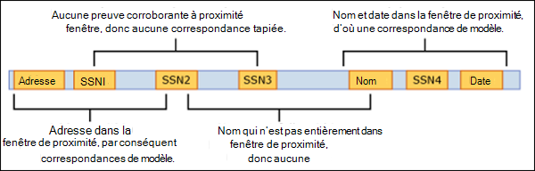

# <a name="create-a-custom-sensitive-information-type-in-security--compliance-center-powershell"></a>Créer un type d’informations sensibles personnalisé dans l’interface PowerShell du Centre de sécurité et conformité

Data loss prevention (DLP) in Microsoft 365 includes many built-in [Sensitive information type entity definitions](sensitive-information-type-entity-definitions.md) that are ready for you to use in your DLP policies. These built-in types can help identify and protect credit card numbers, bank account numbers, passport numbers, and more.
  
But what if you need to identify and protect a different type of sensitive information (for example, an employee ID that uses a format specific to your organization)? To do this, you can create a custom sensitive information type that is defined in an XML file called a *rule package*.
  
This topic shows you how to create an XML file that defines your own custom sensitive information type. You need to know how to create a regular expression. As an example, this topic creates a custom sensitive information type that identifies an employee ID. You can use this example XML as a starting point for your own XML file.
  
After you've created a well-formed XML file, you can upload it to Microsoft 365 by using Microsoft 365 PowerShell. Then you're ready to use your custom sensitive information type in your DLP policies and test that it's detecting the sensitive information as you intended.

> [!NOTE]
> You can also create less complex custom sensitive information types in the Security & Compliance Center UI. For more information, see [Create a custom sensitive information type](create-a-custom-sensitive-information-type.md).

## <a name="important-disclaimer"></a>Clause d’exclusion de responsabilité importante
<!-- this is worded much better than the previous one is -->
Due to the variances in customer environments and content match requirements, Microsoft Support cannot assist in providing custom content-matching definitions; e.g., defining custom classifications or regular expression (also known as RegEx) patterns. For custom content-matching development, testing, and debugging, Microsoft 365 customers will need to rely upon internal IT resources, or use an external consulting resource such as Microsoft Consulting Services (MCS). Support engineers can provide limited support for the feature, but cannot provide assurances that any custom content-matching development will fulfill the customer's requirements or obligations.  As an example of the type of support that can be provided, sample regular expression patterns may be provided for testing purposes. Or, support can assist with troubleshooting an existing RegEx pattern which is not triggering as expected with a single specific content example.

Voir [Problèmes de validation éventuels à prendre en compte](#potential-validation-issues-to-be-aware-of) dans cette rubrique.

Pour plus d’informations sur le moteur Boost.RegEx (anciennement RegEx ++) utilisé pour traiter le texte, consultez [Boost.Regex 5.1.3](https://www.boost.org/doc/libs/1_68_0/libs/regex/doc/html/).

## <a name="sample-xml-of-a-rule-package"></a>Exemple de code XML d’un package de règles

Here's the sample XML of the rule package that we'll create in this topic. Elements and attributes are explained in the sections below.
  
```xml
<?xml version="1.0" encoding="UTF-16"?>
<RulePackage xmlns="https://schemas.microsoft.com/office/2011/mce">
<RulePack id="DAD86A92-AB18-43BB-AB35-96F7C594ADAA">
    <Version build="0" major="1" minor="0" revision="0"/>
    <Publisher id="619DD8C3-7B80-4998-A312-4DF0402BAC04"/>
    <Details defaultLangCode="en-us">
        <LocalizedDetails langcode="en-us">
            <PublisherName>Contoso</PublisherName>
            <Name>Employee ID Custom Rule Pack</Name>
            <Description>
            This rule package contains the custom Employee ID entity.
            </Description>
        </LocalizedDetails>
    </Details>
</RulePack>
<Rules>
<!-- Employee ID -->
    <Entity id="E1CC861E-3FE9-4A58-82DF-4BD259EAB378" patternsProximity="300" recommendedConfidence="70">
        <Pattern confidenceLevel="60">
            <IdMatch idRef="Regex_employee_id"/>
        </Pattern>
        <Pattern confidenceLevel="70">
            <IdMatch idRef="Regex_employee_id"/>
            <Match idRef="Func_us_date"/>
        </Pattern>
        <Pattern confidenceLevel="80">
            <IdMatch idRef="Regex_employee_id"/>
            <Match idRef="Func_us_date"/>
            <Any minMatches="1">
                <Match idRef="Keyword_badge" minCount="2"/>
                <Match idRef="Keyword_employee"/>
            </Any>
            <Any minMatches="0" maxMatches="0">
                <Match idRef="Keyword_false_positives_local"/>
                <Match idRef="Keyword_false_positives_intl"/>
            </Any>
        </Pattern>
    </Entity>
    <Regex id="Regex_employee_id">(\s)(\d{9})(\s)</Regex>
    <Keyword id="Keyword_employee">
        <Group matchStyle="word">
            <Term>Identification</Term>
            <Term>Contoso Employee</Term>
        </Group>
    </Keyword>
    <Keyword id="Keyword_badge">
        <Group matchStyle="string">
            <Term>card</Term>
            <Term>badge</Term>
            <Term caseSensitive="true">ID</Term>
        </Group>
    </Keyword>
    <Keyword id="Keyword_false_positives_local">
        <Group matchStyle="word">
            <Term>credit card</Term>
            <Term>national ID</Term>
        </Group>
    </Keyword>
    <Keyword id="Keyword_false_positives_intl">
        <Group matchStyle="word">
            <Term>identity card</Term>
            <Term>national ID</Term>
            <Term>EU debit card</Term>
        </Group>
    </Keyword>
    <LocalizedStrings>
        <Resource idRef="E1CC861E-3FE9-4A58-82DF-4BD259EAB378">
            <Name default="true" langcode="en-us">Employee ID</Name>
            <Description default="true" langcode="en-us">
            A custom classification for detecting Employee IDs.
            </Description>
            <Description default="false" langcode="de-de">
            Description for German locale.
            </Description>
        </Resource>
    </LocalizedStrings>
</Rules>
</RulePackage>
```

## <a name="what-are-your-key-requirements-rule-entity-pattern-elements"></a>What are your key requirements? [Rule, Entity, Pattern elements]

Avant de commencer, il est utile de comprendre la structure de base du schéma XML d’une règle et comment utiliser cette structure pour définir votre type d’informations sensibles personnalisé afin qu’il identifie le contenu approprié.
  
A rule defines one or more entities (sensitive information types), and each entity defines one or more patterns. A pattern is what DLP looks for when it evaluates content such as email and documents.
  <!-- ok then this is going to be really confusing since the terminology changes.... -->
(A quick note on terminology - if you're familiar with DLP policies, you know that a policy contains one or more rules comprised of conditions and actions. However, in this topic, the XML markup uses rule to mean the patterns that define an entity, also known as a sensitive information type. So in this topic, when you see rule, think entity or sensitive information type, not conditions and actions.)
  
### <a name="simplest-scenario-entity-with-one-pattern"></a>Scénario le plus simple : entité avec un modèle

Here's the simplest scenario. You want your DLP policy to identify content that contains your organization's employee ID, which is formatted as a nine-digit number. So the pattern refers to a regular expression contained in the rule that identifies nine-digit numbers. Any content containing a nine-digit number satisfies the pattern.
  

  
Même s’il est simple, ce modèle peut identifier de nombreux faux positifs en faisant correspondre du contenu comprenant un nombre à neuf chiffres qui n’est pas nécessairement un ID d’employé.
  
### <a name="more-common-scenario-entity-with-multiple-patterns"></a>Scénario le plus courant : entité avec plusieurs modèles

Pour cette raison, il est plus courant de définir une entité à l’aide de plusieurs modèles, où ces derniers identifient la preuve à l’appui (par exemple, un mot clé ou une date) en plus de l’entité (par exemple, un nombre à neuf chiffres).
  
Par exemple, pour augmenter la probabilité d’identifier le contenu qui contient un ID d’employé, vous pouvez définir un autre modèle qui identifie également une date d’embauche, et définir un autre modèle qui identifie une date d’embauche et un mot clé (par exemple, « ID d’employé ») en plus du nombre à neuf chiffres.
  

  
Voici quelques aspects importants de cette structure à prendre en compte :
  
- Patterns that require more evidence have a higher confidence level. This is useful because when you later use this sensitive information type in a DLP policy, you can use more restrictive actions (such as block content) with only the higher-confidence matches, and you can use less restrictive actions (such as send notification) with the lower-confidence matches.

- The supporting IdMatch and Match elements reference regexes and keywords that are actually children of the Rule element, not the Pattern. These supporting elements are referenced by the Pattern but included in the Rule. This means that a single definition of a supporting element, like a regular expression or a keyword list, can be referenced by multiple entities and patterns.

## <a name="what-entity-do-you-need-to-identify-entity-element-id-attribute"></a>What entity do you need to identify? [Entity element, id attribute]

An entity is a sensitive information type, such as a credit card number, that has a well-defined pattern. Each entity has a unique GUID as its ID.
  
### <a name="name-the-entity-and-generate-its-guid"></a>Nommer l’entité et générer son GUID
<!-- why isn't the following in procedure format? -->
Add the Rules and Entity elements. Then add a comment that contains the name of your custom entity - in this example, Employee ID. Later, you'll add the entity name to the localized strings section, and that name is what appears in the UI when you create a DLP policy.
  
Next, generate a GUID for your entity. There are several ways to generate GUIDs, but you can do it easily in PowerShell by typing [guid]::NewGuid(). Later, you'll also add the entity GUID to the localized strings section.
  

  
## <a name="what-pattern-do-you-want-to-match-pattern-element-idmatch-element-regex-element"></a>What pattern do you want to match? [Pattern element, IdMatch element, Regex element]

The pattern contains the list of what the sensitive information type is looking for. This can include regexes, keywords, and built-in functions (which perform tasks like running regexes to find dates or addresses). Sensitive information types can have multiple patterns with unique confidences.
  
What all of the below patterns have in common is that they all reference the same regular expression, which looks for a nine-digit number (\d{9}) surrounded by white space (\s) … (\s). This regular expression is referenced by the IdMatch element and is the common requirement for all patterns that look for the Employee ID entity. IdMatch is the identifier that the pattern is to trying to match, such as Employee ID or credit card number or social security number. A Pattern element must have exactly one IdMatch element.
  

  
When satisfied, a pattern returns a count and confidence level, which you can use in the conditions in your DLP policy. When you add a condition for detecting a sensitive information type to a DLP policy, you can edit the count and confidence level as shown here. Confidence level (also called match accuracy) is explained later in this topic.
  

  
When you create your regular expression, keep in mind that there are potential issues to be aware of. For example, if you write and upload a regex that identifies too much content, this can impact performance. To learn more about these potential issues, see the later section [Potential validation issues to be aware of](#potential-validation-issues-to-be-aware-of).
  
## <a name="do-you-want-to-require-additional-evidence-match-element-mincount-attribute"></a>Do you want to require additional evidence? [Match element, minCount attribute]

En plus de l’élément IdMatch, un modèle peut utiliser l’élément Match pour demander des preuves à l’appui supplémentaires, telles qu’un mot clé, une regex, une date ou une adresse.
  
A Pattern can include multiple Match elements; they can be included directly in the Pattern element or combined by using the Any element. Match elements are joined by an implicit AND operator; all Match elements must be satisfied for the pattern to be matched. You can use the Any element to introduce AND or OR operators (more on that in a later section).
  
You can use the optional minCount attribute to specify how many instances of a match need to be found for each of the Match elements. For example, you can specify that a pattern is satisfied only when at least two keywords from a keyword list are found.
  

  
### <a name="keywords-keyword-group-and-term-elements-matchstyle-and-casesensitive-attributes"></a>Mots clés [éléments Keyword, Group et Term, attributs matchStyle et caseSensitive]

When you identify sensitive information, like an employee ID, you often want to require keywords as corroborative evidence. For example, in addition to matching a nine-digit number, you may want to look for words like "card", "badge", or "ID". To do this, you use the Keyword element. The Keyword element has an id attribute that can be referenced by multiple Match elements in multiple patterns or entities.
  
Keywords are included as a list of Term elements in a Group element. The Group element has a matchStyle attribute with two possible values:
  
- **matchStyle="word"** Word match identifies whole words surrounded by white space or other delimiters. You should always use word unless you need to match parts of words or match words in Asian languages. 
    
- **matchStyle="string"** String match identifies strings no matter what they're surrounded by. For example, "id" will match "bid" and "idea". Use string only when you need to match Asian words or if your keyword may be included as part of other strings. 
    
Enfin, vous pouvez utiliser l’attribut caseSensitive de l’élément Term pour préciser que le contenu doit correspondre exactement au mot clé, notamment les lettres minuscules et majuscules.
  

  
### <a name="regular-expressions-regex-element"></a>Expressions régulières [élément Regex]

In this example, the employee ID entity already uses the IdMatch element to reference a regex for the pattern - a nine-digit number surrounded by whitespace. In addition, a pattern can use a Match element to reference an additional Regex element to identify corroborative evidence, such as a five- or nine-digit number in the format of a US zip code.
  
### <a name="additional-patterns-such-as-dates-or-addresses-built-in-functions"></a>Autres modèles tels que des dates ou des adresses [fonctions intégrées]

In addition to the built-in sensitive information types, DLP also includes built-in functions that can identify corroborative evidence such as a US date, EU date, expiration date, or US address. DLP does not support uploading your own custom functions, but when you create a custom sensitive information type, your entity can reference the built-in functions.
  
Par exemple, une date figure sur les badges d’ID d’employé. Cette entité personnalisée peut donc utiliser la fonction intégrée `Func_us_date` pour identifier une date au format utilisé aux États-Unis. 
  
Pour obtenir plus d’informations, consultez l’article [Éléments recherchés par les fonctions DLP](what-the-dlp-functions-look-for.md).
  

  
## <a name="different-combinations-of-evidence-any-element-minmatches-and-maxmatches-attributes"></a>Différentes combinaisons de preuves [élément Any, attributs minMatches et maxMatches]

In a Pattern element, all IdMatch and Match elements are joined by an implicit AND operator - all of the matches must be satisfied before the pattern can be satisfied. However, you can create more flexible matching logic by using the Any element to group Match elements. For example, you can use the Any element to match all, none, or an exact subset of its children Match elements.
  
The Any element has optional minMatches and maxMatches attributes that you can use to define how many of the children Match elements must be satisfied before the pattern is matched. Note that these attributes define the number of Match elements that must be satisfied, not the number of instances of evidence found for the matches. To define a minimum number of instances for a specific match, such as two keywords from a list, use the minCount attribute for a Match element (see above).
  
### <a name="match-at-least-one-child-match-element"></a>Faire correspondre au moins un élément Match enfant

If you want to require that only a minimum number of Match elements must be met, you can use the minMatches attribute. In effect, these Match elements are joined by an implicit OR operator. This Any element is satisfied if a US-formatted date or a keyword from either list is found.

```xml
<Any minMatches="1" >
     <Match idRef="Func_us_date" />
     <Match idRef="Keyword_employee" />
     <Match idRef="Keyword_badge" />
</Any>
```
    
### <a name="match-an-exact-subset-of-any-children-match-elements"></a>Faire correspondre un sous-ensemble exact d’éléments Match enfants

If you want to require that an exact number of Match elements must be met, you can set minMatches and maxMatches to the same value. This Any element is satisfied only if exactly one date or keyword is found - any more than that, and the pattern won't be matched.

```xml
<Any minMatches="1" maxMatches="1" >
     <Match idRef="Func_us_date" />
     <Match idRef="Keyword_employee" />
     <Match idRef="Keyword_badge" />
</Any>
```
  
### <a name="match-none-of-children-match-elements"></a>Faire correspondre tous les enfants Match enfants

If you want to require the absence of specific evidence for a pattern to be satisfied, you can set both minMatches and maxMatches to 0. This can be useful if you have a keyword list or other evidence that are likely to indicate a false positive.
  
For example, the employee ID entity looks for the keyword "card" because it might refer to an "ID card". However, if card appears only in the phrase "credit card", "card" in this content is unlikely to mean "ID card". So you can add "credit card" as a keyword to a list of terms that you want to exclude from satisfying the pattern.
  
```xml
<Any minMatches="0" maxMatches="0" >
    <Match idRef="Keyword_false_positives_local" />
    <Match idRef="Keyword_false_positives_intl" />
</Any>
```

### <a name="match-a-number-of-unique-terms"></a>Corrélation de termes uniques

Si vous voulez corréler un certain nombre de termes uniques, utilisez le paramètre *uniqueResults* et définissez-le sur *true* comme illustré dans l’exemple suivant :

```xml
<Pattern confidenceLevel="75">
    <IdMatch idRef="Salary_Revision_terms" />
    <Match idRef=" Salary_Revision_ID " minCount="3" uniqueResults="true" />
</Pattern>
```

Dans cet exemple, un modèle est défini pour une révision salariale utilisant au moins trois correspondances uniques. 
  
## <a name="how-close-to-the-entity-must-the-other-evidence-be-patternsproximity-attribute"></a>How close to the entity must the other evidence be? [patternsProximity attribute]

Your sensitive information type is looking for a pattern that represents an employee ID, and as part of that pattern it's also looking for corroborative evidence like a keyword such as "ID". It makes sense that the closer together this evidence is, the more likely the pattern is to be an actual employee ID. You can determine how close other evidence in the pattern must be to the entity by using the required patternsProximity attribute of the Entity element.
  

  
For each pattern in the entity, the patternsProximity attribute value defines the distance (in Unicode characters) from the IdMatch location for all other Matches specified for that Pattern. The proximity window is anchored by the IdMatch location, with the window extending to the left and right of the IdMatch.
  

  
The example below illustrates how the proximity window affects the pattern matching where IdMatch element for the employee ID custom entity requires at least one corroborating match of keyword or date. Only ID1 matches because for ID2 and ID3, either no or only partial corroborating evidence is found within the proximity window.
  

  
Note that for email, the message body and each attachment are treated as separate items. This means that the proximity window does not extend beyond the end of each of these items. For each item (attachment or body), both the idMatch and corroborative evidence needs to reside in that item.
  
## <a name="what-are-the-right-confidence-levels-for-different-patterns-confidencelevel-attribute-recommendedconfidence-attribute"></a>What are the right confidence levels for different patterns? [confidenceLevel attribute, recommendedConfidence attribute]

The more evidence that a pattern requires, the more confidence you have that an actual entity (such as employee ID) has been identified when the pattern is matched. For example, you have more confidence in a pattern that requires a nine-digit ID number, hire date, and keyword in close proximity, than you do in a pattern that requires only a nine-digit ID number.
  
The Pattern element has a required confidenceLevel attribute. You can think of the value of confidenceLevel (an integer between 1 and 100) as a unique ID for each pattern in an entity - the patterns in an entity must have different confidence levels that you assign. The precise value of the integer doesn't matter - simply pick numbers that make sense to your compliance team. After you upload your custom sensitive information type and then create a DLP policy, you can reference these confidence levels in the conditions of the rules that you create.
  

  
In addition to confidenceLevel for each Pattern, the Entity has a recommendedConfidence attribute. The recommended confidence attribute can be thought of as the default confidence level for the rule. When you create a rule in a DLP policy, if you don't specify a confidence level for the rule to use, that rule will match based on the recommended confidence level for the entity.
  
## <a name="do-you-want-to-support-other-languages-in-the-ui-of-the-security-amp-compliance-center-localizedstrings-element"></a>Do you want to support other languages in the UI of the Security &amp; Compliance Center? [LocalizedStrings element]

If your compliance team uses the Microsoft 365 Security &amp; Compliance Center to create DLP policies in different locales and in different languages, you can provide localized versions of the name and description of your custom sensitive information type. When your compliance team uses Microsoft 365 in a language that you support, they'll see the localized name in the UI.
  

  
The Rules element must contain a LocalizedStrings element, which contains a Resource element that references the GUID of your custom entity. In turn, each Resource element contains one or more Name and Description elements that each use the langcode attribute to provide a localized string for a specific language.
  

  
Note that you use localized strings only for how your custom sensitive information type appears in the UI of the Security &amp; Compliance Center. You can't use localized strings to provide different localized versions of a keyword list or regular expression.
  
## <a name="other-rule-package-markup-rulepack-guid"></a>Autre balisage de package de règles [GUID RulePack]

Finally, the beginning of each RulePackage contains some general information that you need to fill in. You can use the following markup as a template and replace the ". . ." placeholders with your own info.
  
Most importantly, you'll need to generate a GUID for the RulePack. Above, you generated a GUID for the entity; this is a second GUID for the RulePack. There are several ways to generate GUIDs, but you can do it easily in PowerShell by typing [guid]::NewGuid().
  
The Version element is also important. When you upload your rule package for the first time, Microsoft 365 notes the version number. Later, if you update the rule package and upload a new version, make sure to update the version number or Microsoft 365 won't deploy the rule package.
  
```xml
<?xml version="1.0" encoding="utf-16"?>
<RulePackage xmlns="https://schemas.microsoft.com/office/2011/mce">
  <RulePack id=". . .">
    <Version major="1" minor="0" build="0" revision="0" />
    <Publisher id=". . ." /> 
    <Details defaultLangCode=". . .">
      <LocalizedDetails langcode=" . . . ">
         <PublisherName>. . .</PublisherName>
         <Name>. . .</Name>
         <Description>. . .</Description>
      </LocalizedDetails>
    </Details>
  </RulePack>
  
 <Rules>
    . . .
 </Rules>
</RulePackage>

```

Lorsque vous avez terminé, votre élément RulePack doit ressembler à ce qui suit :
  

  
## <a name="changes-for-exchange-online"></a>Modifications pour Exchange Online

Previously, you might have used Exchange Online PowerShell to import your custom sensitive information types for DLP. Now your custom sensitive information types can be used in both the Exchange admin center and the Security &amp; Compliance Center. As part of this improvement, you should use Security &amp; Compliance Center PowerShell to import your custom sensitive information types - you can't import them from the Exchange PowerShell anymore. Your custom sensitive information types will continue to work just like before; however, it may take up to one hour for changes made to custom sensitive information types in the Security &amp; Compliance Center to appear in the Exchange admin center.
  
Note that in the Security &amp; Compliance Center, you use the **[New-DlpSensitiveInformationTypeRulePackage](https://docs.microsoft.com/powershell/module/exchange/new-dlpsensitiveinformationtyperulepackage?view=exchange-ps)** cmdlet to upload a rule package. (Previously, in the Exchange admin center, you used the  **ClassificationRuleCollection**` cmdlet.) 
  
## <a name="upload-your-rule-package"></a>Télécharger votre package de règles


Pour télécharger votre package de règles, procédez comme suit :
  
1. Enregistrez-le en tant que fichier .xml avec le codage Unicode.
    
2. [Se connecter à l’interface PowerShell du Centre de sécurité et conformité](https://go.microsoft.com/fwlink/p/?LinkID=799771)
    
3. Utilisez la syntaxe suivante :

```powershell
New-DlpSensitiveInformationTypeRulePackage -FileData (Get-Content -Path "PathToUnicodeXMLFile" -Encoding Byte) -ReadCount 0
```

    This example uploads the Unicode XML file named MyNewRulePack.xml from C:\My Documents.

```powershell
New-DlpSensitiveInformationTypeRulePackage -FileData (Get-Content -Path "C:\My Documents\MyNewRulePack.xml" -Encoding Byte) -ReadCount 0
```

    For detailed syntax and parameter information, see [New-DlpSensitiveInformationTypeRulePackage](https://docs.microsoft.com/powershell/module/exchange/new-dlpsensitiveinformationtyperulepackage).

> [!NOTE]
> La limite pour les collections de type d'information confidentielles personnalisées est de 10.

4. Pour vérifier que vous avez correctement créé un nouveau type d’informations sensibles, effectuez l’une des opérations suivantes :

  - Exécutez la cmdlet [Get-DlpSensitiveInformationTypeRulePackage](https://docs.microsoft.com/powershell/module/exchange/get-dlpsensitiveinformationtyperulepackage?view=exchange-ps) pour vérifier que le nouveau package de règles est répertorié :

```powershell
Get-DlpSensitiveInformationTypeRulePackage
``` 

  - Exécutez la cmdlet [Get-DlpSensitiveInformationType](https://docs.microsoft.com/powershell/module/exchange/get-dlpsensitiveinformationtype?view=exchange-ps) pour vérifier que le type d’informations sensibles est répertorié :

```powershell
Get-DlpSensitiveInformationType
``` 

    For custom sensitive information types, the Publisher property value will be something other than Microsoft Corporation.

  - Remplacez \<Name\> par la valeur Name du type d’informations sensibles (par exemple, Réf employé), puis exécutez la cmdlet [Get-DlpSensitiveInformationType](https://docs.microsoft.com/powershell/module/exchange/get-dlpsensitiveinformationtype?view=exchange-ps) :

```powershell
Get-DlpSensitiveInformationType -Identity "<Name>"
```
    
## <a name="potential-validation-issues-to-be-aware-of"></a>Problèmes de validation éventuels à prendre en compte

When you upload your rule package XML file, the system validates the XML and checks for known bad patterns and obvious performance issues. Here are some known issues that the validation checks for — a regular expression:
  
- ne peut pas commencer ou se terminer par l’alternateur « | », qui correspond à tous les éléments, car il est considéré comme une correspondance vide ;
    
    Par exemple, « |a » ou « b| » échoue à la validation.
    
- ne peut pas commencer ou se terminer par un modèle « .{0,m} » qui n’a aucune fonction et nuit uniquement aux performances ;
    
    Par exemple, « .{0,50}ASDF » ou « ASDF.{0,50} » échoue à la validation.
    
- ne peut pas contenir « .{0,m} » ou « .{1,m} » dans des groupes, et ne peut pas contenir « .\* » ou « .+ » dans des groupes ;
    
    Par exemple, « (.{0,50000}) » échoue à la validation.
    
- ne peut pas contenir de caractère avec les répéteurs « {0,m} » ou « {1, m} » dans des groupes ;
    
    Par exemple, « (a\*) » échoue à la validation.
    
- ne peut pas commencer ou se terminer par « .{1,m} » ; utilisez simplement « . » ;
    
    Par exemple, « .{1,m}asdf » échoue à la validation ; utilisez simplement « .asdf ».
    
- ne peut pas contenir de répéteur illimité (tel que « \* » ou « + ») dans un groupe.
    
    Par exemple, « (xx)\* » et « (xx)+ » échouent à la validation.
    
Si un type d’informations sensibles personnalisé contient un problème qui peut affecter les performances, il n’est pas chargé et l’un des messages d’erreur suivants s’affichent :
  
- **Quantificateurs génériques correspondant à plus de contenu que prévu (par exemple, « + » et « \* »)**
    
- **Assertions d’inspection**
    
- **Regroupement complexe conjointement avec des quantificateurs généraux**
    
## <a name="recrawl-your-content-to-identify-the-sensitive-information"></a>Analyser de nouveau le contenu pour identifier les informations sensibles

DLP uses the search crawler to identify and classify sensitive information in site content. Content in SharePoint Online and OneDrive for Business sites is recrawled automatically whenever it's updated. But to identify your new custom type of sensitive information in all existing content, that content must be recrawled.
  
Dans Microsoft 365, vous ne pouvez pas demander manuellement une nouvelle analyse de l’ensemble d’un client, mais vous pouvez le faire pour une collection de sites, une liste ou une bibliothèque (consultez l’article [Demander manuellement l’analyse et la réindexation d’un site, d’une bibliothèque ou d’une liste](https://docs.microsoft.com/sharepoint/crawl-site-content)).
  
## <a name="remove-a-custom-sensitive-information-type"></a>Supprimer un type d’informations sensibles personnalisé

> [!NOTE]
> Avant de supprimer un type d’informations sensibles personnalisé, vérifiez qu’aucune stratégie DLP ou règle de flux de courrier Exchange (également appelées règles de transport) ne référence toujours le type d’informations sensibles.

Dans le Centre de Conformité et de sécurité PowerShell, il existe deux méthodes pour supprimer des types d’informations sensibles personnalisés :

- **Remove individual custom sensitive information types**: Use the method documented in [Modify a custom sensitive information type](#modify-a-custom-sensitive-information-type). You export the custom rule package that contains the custom sensitive information type, remove the sensitive information type from the XML file, and import the updated XML file back into the existing custom rule package.

- **Supprimer un package de règles personnalisé et tous les types d’informations sensibles personnalisés qu’il contient**: cette méthode est présentée dans cette section.

1. [Se connecter à l’interface PowerShell du Centre de sécurité et conformité](https://go.microsoft.com/fwlink/p/?LinkID=799771)

2. Pour supprimer un règle de package personnalisé, utilisez la cmdlet [Remove-DlpSensitiveInformationTypeRulePackage](https://docs.microsoft.com/powershell/module/exchange/remove-dlpsensitiveinformationtyperulepackage?view=exchange-ps) :

```powershell
Remove-DlpSensitiveInformationTypeRulePackage -Identity "RulePackageIdentity"
```

    You can use the Name value (for any language) or the `RulePack id` (GUID) value to identify the rule package.

    This example removes the rule package named "Employee ID Custom Rule Pack".

```powershell
Remove-DlpSensitiveInformationTypeRulePackage -Identity "Employee ID Custom Rule Pack"
```

    For detailed syntax and parameter information, see [Remove-DlpSensitiveInformationTypeRulePackage](https://docs.microsoft.com/powershell/module/exchange/remove-dlpsensitiveinformationtyperulepackage).

3. Afin de vérifier que vous avez correctement retiré un nouveau type d’informations sensibles, effectuez l’une des opérations suivantes :

  - Exécutez la cmdlet [Get-DlpSensitiveInformationTypeRulePackage](https://docs.microsoft.com/powershell/module/exchange/get-dlpsensitiveinformationtyperulepackage?view=exchange-ps) et vérifiez que le package de règles n’est plus répertorié :

```powershell
Get-DlpSensitiveInformationTypeRulePackage
```

- Exécutez la cmdlet [Get-DlpSensitiveInformationType](https://docs.microsoft.com/powershell/module/exchange/get-dlpsensitiveinformationtype?view=exchange-ps) pour vérifier que les types d’informations sensibles dans le package de règles supprimé ne sont plus répertoriés :

```powershell
Get-DlpSensitiveInformationType
```

Pour les types d’informations sensibles personnalisés, la valeur de propriété Publisher sera un numéro autre que Microsoft Corporation.

- Remplacez \<Name\> avec la valeur Name du type d’informations sensibles (par exemple, ID d’employé), puis exécutez la cmdlet [Get-DlpSensitiveInformationType](https://docs.microsoft.com/powershell/module/exchange/get-dlpsensitiveinformationtype?view=exchange-ps) pour vérifier que le type d’informations sensibles n’est plus répertorié :

```powershell
Get-DlpSensitiveInformationType -Identity "<Name>"
```

## <a name="modify-a-custom-sensitive-information-type"></a>Modifier un type d’informations sensibles personnalisé

Dans le Centre de Conformité et sécurité PowerShell ,modifier un type d’informations sensibles personnalisé vous oblige à:

1. Exportez le package de règles existant qui contient le type d’informations sensibles personnalisé dans un fichier XML (ou utilisez le fichier XML existant si vous avez un).

2. Modifier le type d’informations sensibles personnalisé dans un fichier exporté XML.

3. Importer le fichier XML mis à jour vers le package de règles existant.

Pour vous connecter à l’interface PowerShell du Centre de sécurité et conformité, consultez [Se connecter à l’interface PowerShell du Centre de sécurité et conformité](https://go.microsoft.com/fwlink/p/?LinkID=799771).

### <a name="step-1-export-the-existing-rule-package-to-an-xml-file"></a>Étape 1 : Exporter le package de règles existant vers un fichier XML

> [!NOTE]
> Si vous avez une copie du fichier XML (par exemple, vous venez de le créer et de l’importer), vous pouvez passer directement à l’étape suivante pour modifier le fichier XML.

1. Si vous ne connaissez pas encore le nom du package de règles personnalisé, exécutez la cmdlet [Get-DlpSensitiveInformationTypeRulePackage](https://docs.microsoft.com/powershell/module/exchange/get-dlpsensitiveinformationtype?view=exchange-ps) pour le trouver :

```powershell
Get-DlpSensitiveInformationTypeRulePackage
```

> [!NOTE]
> Le package de règles intégré qui contient les types d’informations sensibles intégrés s’intitule Microsoft Rule Package. Le package de règles qui contient les types d’informations sensibles personnalisés que vous avez créés dans l’interface utilisateur du Centre de sécurité et conformité est nommé Microsoft.SCCManaged.CustomRulePack.

2. Utilisez la cmdlet [Get-DlpSensitiveInformationTypeRulePackage](https://docs.microsoft.com/powershell/module/exchange/get-dlpsensitiveinformationtyperulepackage?view=exchange-ps) pour stocker le package de règles personnalisé dans une variable :

```powershell
$rulepak = Get-DlpSensitiveInformationTypeRulePackage -Identity "RulePackageName"
```

   Par exemple, si le nom du package de règles est « Package de règles personnalisé d’ID d’employé », exécutez la cmdlet suivante :

```powershell
$rulepak = Get-DlpSensitiveInformationTypeRulePackage -Identity "Employee ID Custom Rule Pack"
```

3. Utilisez la cmdlet [Set-Content](https://docs.microsoft.com/powershell/module/microsoft.powershell.management/set-content?view=powershell-6) pour exporter le package de règles personnalisé dans un fichier XML :

```powershell
Set-Content -Path "XMLFileAndPath" -Encoding Byte -Value $rulepak.SerializedClassificationRuleCollection
```

Cet exemple exporte le package de règles dans le fichier nommé ExportedRulePackage.xml dans le dossier Documents C:\My Documents folder.

```powershell
Set-Content -Path "C:\My Documents\ExportedRulePackage.xml" -Encoding Byte -Value $rulepak.SerializedClassificationRuleCollection
```

#### <a name="step-2-modify-the-sensitive-information-type-in-the-exported-xml-file"></a>Étape 2: Modifier le type d’informations sensibles personnalisé dans un fichier exporté XML.

Les types d’informations sensibles dans le fichier XML et d’autres éléments dans le fichier sont décrits précédemment dans cette rubrique.

#### <a name="step-3-import-the-updated-xml-file-back-into-the-existing-rule-package"></a>Étape 3: Importer de nouveau le fichier XML mis à jour vers le package de règles existant.

Pour réimporter le XML mis à jour dans le package de règles existant, utilisez la cmdlet [Set-DlpSensitiveInformationTypeRulePackage](https://docs.microsoft.com/powershell/module/exchange/set-dlpsensitiveinformationtyperulepackage?view=exchange-ps) :

```powershell
Set-DlpSensitiveInformationTypeRulePackage -FileData ([Byte[]]$(Get-Content -Path "C:\My Documents\External Sensitive Info Type Rule Collection.xml" -Encoding Byte -ReadCount 0))
```

Pour une syntaxe détaillée et des informations de paramétrage, voir [Set-DlpSensitiveInformationTypeRulePackage](https://docs.microsoft.com/powershell/module/exchange/set-dlpsensitiveinformationtyperulepackage).

## <a name="reference-rule-package-xml-schema-definition"></a>Référence : Définition du schéma XML du package de règles

Vous pouvez copier ce balisage, l’enregistrer sous la forme d’un fichier XSD et l’utiliser pour valider le fichier XML de votre package de règles.
  
```xml
<?xml version="1.0" encoding="utf-8"?>
<xs:schema xmlns:mce="https://schemas.microsoft.com/office/2011/mce"
           targetNamespace="https://schemas.microsoft.com/office/2011/mce"
           xmlns:xs="https://www.w3.org/2001/XMLSchema"
           elementFormDefault="qualified"
           attributeFormDefault="unqualified"
           id="RulePackageSchema">
  <!-- Use include if this schema has the same target namespace as the schema being referenced, otherwise use import -->
  <xs:element name="RulePackage" type="mce:RulePackageType"/>
  <xs:simpleType name="LangType">
    <xs:union memberTypes="xs:language">
      <xs:simpleType>
        <xs:restriction base="xs:string">
          <xs:enumeration value=""/>
        </xs:restriction>
      </xs:simpleType>
    </xs:union>
  </xs:simpleType>
  <xs:simpleType name="GuidType" final="#all">
    <xs:restriction base="xs:token">
      <xs:pattern value="[0-9a-fA-F]{8}\-([0-9a-fA-F]{4}\-){3}[0-9a-fA-F]{12}"/>
    </xs:restriction>
  </xs:simpleType>
  <xs:complexType name="RulePackageType">
    <xs:sequence>
      <xs:element name="RulePack" type="mce:RulePackType"/>
      <xs:element name="Rules" type="mce:RulesType">
        <xs:key name="UniqueRuleId">
          <xs:selector xpath="mce:Entity|mce:Affinity|mce:Version/mce:Entity|mce:Version/mce:Affinity"/>
          <xs:field xpath="@id"/>
        </xs:key>
        <xs:key name="UniqueProcessorId">
          <xs:selector xpath="mce:Regex|mce:Keyword|mce:Fingerprint"></xs:selector>
          <xs:field xpath="@id"/>
        </xs:key>
        <xs:key name="UniqueResourceIdRef">
          <xs:selector xpath="mce:LocalizedStrings/mce:Resource"/>
          <xs:field xpath="@idRef"/>
        </xs:key>
        <xs:keyref name="ReferencedRuleMustExist" refer="mce:UniqueRuleId">
          <xs:selector xpath="mce:LocalizedStrings/mce:Resource"/>
          <xs:field xpath="@idRef"/>
        </xs:keyref>
        <xs:keyref name="RuleMustHaveResource" refer="mce:UniqueResourceIdRef">
          <xs:selector xpath="mce:Entity|mce:Affinity|mce:Version/mce:Entity|mce:Version/mce:Affinity"/>
          <xs:field xpath="@id"/>
        </xs:keyref>
      </xs:element>
    </xs:sequence>
  </xs:complexType>
  <xs:complexType name="RulePackType">
    <xs:sequence>
      <xs:element name="Version" type="mce:VersionType"/>
      <xs:element name="Publisher" type="mce:PublisherType"/>
      <xs:element name="Details" type="mce:DetailsType">
        <xs:key name="UniqueLangCodeInLocalizedDetails">
          <xs:selector xpath="mce:LocalizedDetails"/>
          <xs:field xpath="@langcode"/>
        </xs:key>
        <xs:keyref name="DefaultLangCodeMustExist" refer="mce:UniqueLangCodeInLocalizedDetails">
          <xs:selector xpath="."/>
          <xs:field xpath="@defaultLangCode"/>
        </xs:keyref>
      </xs:element>
      <xs:element name="Encryption" type="mce:EncryptionType" minOccurs="0" maxOccurs="1"/>
    </xs:sequence>
    <xs:attribute name="id" type="mce:GuidType" use="required"/>
  </xs:complexType>
  <xs:complexType name="VersionType">
    <xs:attribute name="major" type="xs:unsignedShort" use="required"/>
    <xs:attribute name="minor" type="xs:unsignedShort" use="required"/>
    <xs:attribute name="build" type="xs:unsignedShort" use="required"/>
    <xs:attribute name="revision" type="xs:unsignedShort" use="required"/>
  </xs:complexType>
  <xs:complexType name="PublisherType">
    <xs:attribute name="id" type="mce:GuidType" use="required"/>
  </xs:complexType>
  <xs:complexType name="LocalizedDetailsType">
    <xs:sequence>
      <xs:element name="PublisherName" type="mce:NameType"/>
      <xs:element name="Name" type="mce:RulePackNameType"/>
      <xs:element name="Description" type="mce:OptionalNameType"/>
    </xs:sequence>
    <xs:attribute name="langcode" type="mce:LangType" use="required"/>
  </xs:complexType>
  <xs:complexType name="DetailsType">
    <xs:sequence>
      <xs:element name="LocalizedDetails" type="mce:LocalizedDetailsType" maxOccurs="unbounded"/>
    </xs:sequence>
    <xs:attribute name="defaultLangCode" type="mce:LangType" use="required"/>
  </xs:complexType>
  <xs:complexType name="EncryptionType">
    <xs:sequence>
      <xs:element name="Key" type="xs:normalizedString"/>
      <xs:element name="IV" type="xs:normalizedString"/>
    </xs:sequence>
  </xs:complexType>
  <xs:simpleType name="RulePackNameType">
    <xs:restriction base="xs:token">
      <xs:minLength value="1"/>
      <xs:maxLength value="64"/>
    </xs:restriction>
  </xs:simpleType>
  <xs:simpleType name="NameType">
    <xs:restriction base="xs:normalizedString">
      <xs:minLength value="1"/>
      <xs:maxLength value="256"/>
    </xs:restriction>
  </xs:simpleType>
  <xs:simpleType name="OptionalNameType">
    <xs:restriction base="xs:normalizedString">
      <xs:minLength value="0"/>
      <xs:maxLength value="256"/>
    </xs:restriction>
  </xs:simpleType>
  <xs:simpleType name="RestrictedTermType">
    <xs:restriction base="xs:string">
      <xs:minLength value="1"/>
      <xs:maxLength value="100"/>
    </xs:restriction>
  </xs:simpleType>
  <xs:complexType name="RulesType">
    <xs:sequence>
      <xs:choice maxOccurs="unbounded">
        <xs:element name="Entity" type="mce:EntityType"/>
        <xs:element name="Affinity" type="mce:AffinityType"/>
        <xs:element name="Version" type="mce:VersionedRuleType"/>
      </xs:choice>
      <xs:choice minOccurs="0" maxOccurs="unbounded">
        <xs:element name="Regex" type="mce:RegexType"/>
        <xs:element name="Keyword" type="mce:KeywordType"/>
        <xs:element name="Fingerprint" type="mce:FingerprintType"/>
        <xs:element name="ExtendedKeyword" type="mce:ExtendedKeywordType"/>
      </xs:choice>
      <xs:element name="LocalizedStrings" type="mce:LocalizedStringsType"/>
    </xs:sequence>
  </xs:complexType>
  <xs:complexType name="EntityType">
    <xs:sequence>
      <xs:element name="Pattern" type="mce:PatternType" maxOccurs="unbounded"/>
      <xs:element name="Version" type="mce:VersionedPatternType" minOccurs="0" maxOccurs="unbounded" />
    </xs:sequence>
    <xs:attribute name="id" type="mce:GuidType" use="required"/>
    <xs:attribute name="patternsProximity" type="mce:ProximityType" use="required"/>
    <xs:attribute name="recommendedConfidence" type="mce:ProbabilityType"/>
    <xs:attribute name="workload" type="mce:WorkloadType"/>
  </xs:complexType>
  <xs:complexType name="PatternType">
    <xs:sequence>
      <xs:element name="IdMatch" type="mce:IdMatchType"/>
      <xs:choice minOccurs="0" maxOccurs="unbounded">
        <xs:element name="Match" type="mce:MatchType"/>
        <xs:element name="Any" type="mce:AnyType"/>
      </xs:choice>
    </xs:sequence>
    <xs:attribute name="confidenceLevel" type="mce:ProbabilityType" use="required"/>
  </xs:complexType>
  <xs:complexType name="AffinityType">
    <xs:sequence>
      <xs:element name="Evidence" type="mce:EvidenceType" maxOccurs="unbounded"/>
      <xs:element name="Version" type="mce:VersionedEvidenceType" minOccurs="0" maxOccurs="unbounded" />
    </xs:sequence>
    <xs:attribute name="id" type="mce:GuidType" use="required"/>
    <xs:attribute name="evidencesProximity" type="mce:ProximityType" use="required"/>
    <xs:attribute name="thresholdConfidenceLevel" type="mce:ProbabilityType" use="required"/>
    <xs:attribute name="workload" type="mce:WorkloadType"/>
  </xs:complexType>
  <xs:complexType name="EvidenceType">
    <xs:sequence>
      <xs:choice maxOccurs="unbounded">
        <xs:element name="Match" type="mce:MatchType"/>
        <xs:element name="Any" type="mce:AnyType"/>
      </xs:choice>
    </xs:sequence>
    <xs:attribute name="confidenceLevel" type="mce:ProbabilityType" use="required"/>
  </xs:complexType>
  <xs:complexType name="IdMatchType">
    <xs:attribute name="idRef" type="xs:string" use="required"/>
  </xs:complexType>
  <xs:complexType name="MatchType">
    <xs:attribute name="idRef" type="xs:string" use="required"/>
    <xs:attribute name="minCount" type="xs:positiveInteger" use="optional"/>
    <xs:attribute name="uniqueResults" type="xs:boolean" use="optional"/>
  </xs:complexType>
  <xs:complexType name="AnyType">
    <xs:sequence>
      <xs:choice maxOccurs="unbounded">
        <xs:element name="Match" type="mce:MatchType"/>
        <xs:element name="Any" type="mce:AnyType"/>
      </xs:choice>
    </xs:sequence>
    <xs:attribute name="minMatches" type="xs:nonNegativeInteger" default="1"/>
    <xs:attribute name="maxMatches" type="xs:nonNegativeInteger" use="optional"/>
  </xs:complexType>
  <xs:simpleType name="ProximityType">
    <xs:union>
      <xs:simpleType>
        <xs:restriction base='xs:string'>
          <xs:enumeration value="unlimited"/>
        </xs:restriction>
      </xs:simpleType>
      <xs:simpleType>
        <xs:restriction base="xs:positiveInteger">
          <xs:minInclusive value="1"/>
        </xs:restriction>
      </xs:simpleType>
    </xs:union>
  </xs:simpleType>
  <xs:simpleType name="ProbabilityType">
    <xs:restriction base="xs:integer">
      <xs:minInclusive value="1"/>
      <xs:maxInclusive value="100"/>
    </xs:restriction>
  </xs:simpleType>
  <xs:simpleType name="WorkloadType">
    <xs:restriction base="xs:string">
      <xs:enumeration value="Exchange"/>
      <xs:enumeration value="Outlook"/>
    </xs:restriction>
  </xs:simpleType>
  <xs:simpleType name="EngineVersionType">
    <xs:restriction base="xs:token">
      <xs:pattern value="^\d{2}\.01?\.\d{3,4}\.\d{1,3}$"/>
    </xs:restriction>
  </xs:simpleType>
  <xs:complexType name="VersionedRuleType">
    <xs:choice maxOccurs="unbounded">
      <xs:element name="Entity" type="mce:EntityType"/>
      <xs:element name="Affinity" type="mce:AffinityType"/>
    </xs:choice>
    <xs:attribute name="minEngineVersion" type="mce:EngineVersionType" use="required" />
  </xs:complexType>
  <xs:complexType name="VersionedPatternType">
    <xs:sequence>
      <xs:element name="Pattern" type="mce:PatternType" maxOccurs="unbounded"/>
    </xs:sequence>
    <xs:attribute name="minEngineVersion" type="mce:EngineVersionType" use="required" />
  </xs:complexType>
  <xs:complexType name="VersionedEvidenceType">
    <xs:sequence>
      <xs:element name="Evidence" type="mce:EvidenceType" maxOccurs="unbounded"/>
    </xs:sequence>
    <xs:attribute name="minEngineVersion" type="mce:EngineVersionType" use="required" />
  </xs:complexType>
  <xs:simpleType name="FingerprintValueType">
    <xs:restriction base="xs:string">
      <xs:minLength value="2732"/>
      <xs:maxLength value="2732"/>
    </xs:restriction>
  </xs:simpleType>
  <xs:complexType name="FingerprintType">
    <xs:simpleContent>
      <xs:extension base="mce:FingerprintValueType">
        <xs:attribute name="id" type="xs:token" use="required"/>
        <xs:attribute name="threshold" type="mce:ProbabilityType" use="required"/>
        <xs:attribute name="shingleCount" type="xs:positiveInteger" use="required"/>
        <xs:attribute name="description" type="xs:string" use="optional"/>
      </xs:extension>
    </xs:simpleContent>
  </xs:complexType>
  <xs:complexType name="RegexType">
    <xs:simpleContent>
      <xs:extension base="xs:string">
        <xs:attribute name="id" type="xs:token" use="required"/>
      </xs:extension>
    </xs:simpleContent>
  </xs:complexType>
  <xs:complexType name="KeywordType">
    <xs:sequence>
      <xs:element name="Group" type="mce:GroupType" maxOccurs="unbounded"/>
    </xs:sequence>
    <xs:attribute name="id" type="xs:token" use="required"/>
  </xs:complexType>
  <xs:complexType name="GroupType">
    <xs:sequence>
      <xs:choice>
        <xs:element name="Term" type="mce:TermType" maxOccurs="unbounded"/>
      </xs:choice>
    </xs:sequence>
    <xs:attribute name="matchStyle" default="word">
      <xs:simpleType>
        <xs:restriction base="xs:NMTOKEN">
          <xs:enumeration value="word"/>
          <xs:enumeration value="string"/>
        </xs:restriction>
      </xs:simpleType>
    </xs:attribute>
  </xs:complexType>
  <xs:complexType name="TermType">
    <xs:simpleContent>
      <xs:extension base="mce:RestrictedTermType">
        <xs:attribute name="caseSensitive" type="xs:boolean" default="false"/>
      </xs:extension>
    </xs:simpleContent>
  </xs:complexType>
  <xs:complexType name="ExtendedKeywordType">
    <xs:simpleContent>
      <xs:extension base="xs:string">
        <xs:attribute name="id" type="xs:token" use="required"/>
      </xs:extension>
    </xs:simpleContent>
  </xs:complexType>
  <xs:complexType name="LocalizedStringsType">
    <xs:sequence>
      <xs:element name="Resource" type="mce:ResourceType" maxOccurs="unbounded">
      <xs:key name="UniqueLangCodeUsedInNamePerResource">
        <xs:selector xpath="mce:Name"/>
        <xs:field xpath="@langcode"/>
      </xs:key>
      <xs:key name="UniqueLangCodeUsedInDescriptionPerResource">
        <xs:selector xpath="mce:Description"/>
        <xs:field xpath="@langcode"/>
      </xs:key>
    </xs:element>
    </xs:sequence>
  </xs:complexType>
  <xs:complexType name="ResourceType">
    <xs:sequence>
      <xs:element name="Name" type="mce:ResourceNameType" maxOccurs="unbounded"/>
      <xs:element name="Description" type="mce:DescriptionType" minOccurs="0" maxOccurs="unbounded"/>
    </xs:sequence>
    <xs:attribute name="idRef" type="mce:GuidType" use="required"/>
  </xs:complexType>
  <xs:complexType name="ResourceNameType">
    <xs:simpleContent>
      <xs:extension base="xs:string">
        <xs:attribute name="default" type="xs:boolean" default="false"/>
        <xs:attribute name="langcode" type="mce:LangType" use="required"/>
      </xs:extension>
    </xs:simpleContent>
  </xs:complexType>
  <xs:complexType name="DescriptionType">
    <xs:simpleContent>
      <xs:extension base="xs:string">
        <xs:attribute name="default" type="xs:boolean" default="false"/>
        <xs:attribute name="langcode" type="mce:LangType" use="required"/>
      </xs:extension>
    </xs:simpleContent>
  </xs:complexType>
</xs:schema>

```

## <a name="more-information"></a>Plus d’informations

- [Vue d’ensemble des stratégies de protection contre la perte de données](data-loss-prevention-policies.md)

- [Définitions d’entités des types d’informations sensibles](sensitive-information-type-entity-definitions.md)

- [Éléments recherchés par les fonctions DLP](what-the-dlp-functions-look-for.md)
