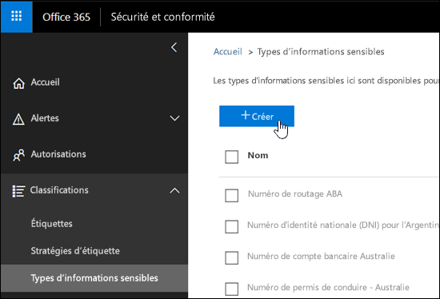
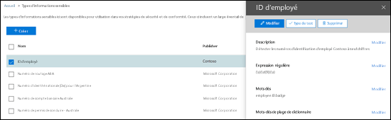
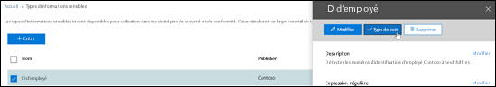
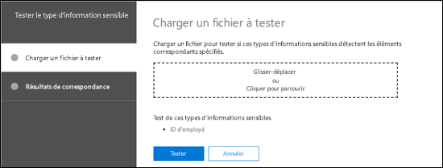

<!-- rename md file to match the display name -->
# Créer un type d’informations sensibles personnalisé dans le Centre de Conformité et Sécurité

Lisez cet article pour [créer un type d’informations sensibles personnalisé](custom-sensitive-info-types.md) dans le Centre de Conformité et Sécurité ([https://protection.office.com](https://protection.office.com)). Les types d’informations sensibles personnalisés que vous créez en utilisant cette méthode sont ajoutés au package de règles nommé `Microsoft.SCCManaged.CustomRulePack`.

Vous pouvez également créer des types d’informations sensibles personnalisés à l’aide de PowerShell et de fonctionnalités de correspondance exacte des données. Pour en savoir plus sur ces méthodes, consultez :
- [Créer un type d’informations sensibles personnalisé dans l’interface PowerShell du Centre de sécurité et conformité](create-a-custom-sensitive-information-type-in-scc-powershell.md)
- [Créer un type d’informations sensibles personnalisé pour DLP à l’aide d’une correspondance exacte des données](create-custom-sensitive-information-types-with-exact-data-match-based-classification.md)

## Avant de commencer

> [!NOTE]
> Vous devez avoir une autorisation en tant qu’administrateur général ou d’administrateur de conformité pour créer, tester et déployer un type d’informations sensibles personnalisé via l’interface utilisateur. Consulter [À propos des rôles d’administration](https://docs.microsoft.com/office365/admin/add-users/about-admin-roles?view=o365-worldwide) dans Office 365.

- Votre organisation doit disposer d’un abonnement, par exemple, Office 365 Entreprise, qui inclut la protection contre la perte de données (DLP). Voir [Description du service Stratégie et conformité de messagerie](https://docs.microsoft.com/office365/servicedescriptions/exchange-online-protection-service-description/messaging-policy-and-compliance-servicedesc). 

- Custom sensitive information types require familiarity with regular expressions (RegEx). For more information about the Boost.RegEx (formerly known as RegEx++) engine that's used for processing the text, see [Boost.Regex 5.1.3](https://www.boost.org/doc/libs/1_68_0/libs/regex/doc/html/).

  La division Support technique et Service clientèle Microsoft ne peut pas vous aider à créer des classifications personnalisées ou des modèles d’expressions régulières. Les ingénieurs du support technique peuvent offrir un support limité pour la fonctionnalité, comme vous fournir des exemples de modèles d’expressions régulières à des fins de test, ou vous aider à résoudre un problème avec un modèle d’expression régulière existant qui n’opère pas de déclenchement comme prévu. En revanche, ils ne peuvent pas garantir que le développement correspondant à du contenu personnalisé répondra à vos exigences ou obligations.

- La protection contre la perte de données DLP utilise le robot de recherche pour identifier et classer des informations sensibles dans des sites SharePoint Online et OneDrive Entreprise. Pour identifier votre nouveau type d’informations sensibles personnalisé dans du contenu existant, celui-ci doit être ré-analysé. Le contenu est analysé sur la base d’un planning, mais vous pouvez le réanalyser manuellement pour une collection de sites, une liste ou une bibliothèque. Pour plus d’informations, voir [Demander manuellement l’analyse et la réindexation d’un site, d’une bibliothèque ou d’une liste](https://docs.microsoft.com/sharepoint/crawl-site-content).

## Créer un type d’informations sensibles personnalisé dans le Centre de Conformité et Sécurité

Dans le Centre de Conformité et Sécurité, accédez à **Classifications** \> **Types d’informations sensibles** et cliquez sur **Créer**.

Les paramètres sont relativement évidents. Ils sont décrits sur la page associée de l’Assistant :

- **Nom**

- **Description**

- **Proximité**

- **Niveau de confiance**

- **Élément de modèle principal** (mots clés, expression régulière ou dictionnaire)

- Facultatif **Éléments de modèle pris en charge** (mots clés, expression régulière ou dictionnaire) et une valeur de **Coût minimum** correspondante.

Here's a scenario: You want a custom sensitive information type that detects 9-digit employee numbers in content, along with the keywords "employee" "ID" and "badge". To create this custom sensitive information type, do the following steps:

1. Dans le Centre de conformité et sécurité, accédez à **Classifications** \> **Types d’informations sensibles** et cliquez sur **Créer**.

    

2. Sur la page **Choisir un nom et une description** qui s’ouvre, entrez les valeurs suivantes :

  - **Nom** : ID d’employé.

  - **Description** : détecte les numéros d’identification d’employé Contoso à neuf chiffres.

    

    Lorsque vous avez terminé, cliquez sur **Suivant**.

3. Sur la page **Conditions requises pour la correspondance** qui s’ouvre, cliquez sur **Ajouter un élément** et configurez les paramètres suivants :

    - **Détecter le contenu contenant** :
 
      a. Click **Any of these** and select **Regular expression**.

      b. In the regular expression box, enter `(\s)(\d{9})(\s)` (nine-digit numbers surrounded by white space).
  
    - **Éléments de prise en charge** : cliquez sur **Ajouter des éléments de prise en charge** et sélectionnez **Contient cette liste de mots clés**.

    - Dans la zone **Contient cette liste de mots clés** qui s’affiche, configurez les paramètres suivants :

      - **Liste de mots clés** : saisissez la valeur suivante : employé, ID, badge.

      - **Nombre minimal** : conservez la valeur par défaut 1.

    - Conservez la valeur par défaut **Niveau de confiance** 60. 

    - Conservez la valeur par défaut **Caractère de proximité** 300.

    

    Lorsque vous avez terminé, cliquez sur **Suivant**.

4. Sur la page **Revoir et finaliser** qui s’affiche, passez en revue les paramètres, puis cliquez sur **Terminer**.

    

5. The next page encourages you to test the new custom sensitive information type by clicking **Yes**. For more information, see [Test custom sensitive information types in the Security & Compliance Center](#test-custom-sensitive-information-types-in-the-security--compliance-center). To test the rule later, click **No**.

    

### Comment savoir si cela a fonctionné ?

Pour vérifier que vous avez correctement créé un nouveau type d’informations sensibles, effectuez l’une des opérations suivantes :

  - Accédez à **Classifications** \> **Types d’informations sensibles** et vérifiez que le nouveau type d’informations sensibles personnalisé apparaît.

  - Test the new custom sensitive information type. For more information, see [Test custom sensitive information types in the Security & Compliance Center](#test-custom-sensitive-information-types-in-the-security--compliance-center).

## Modifier des types d’informations sensibles personnalisés dans le Centre de conformité et sécurité

**Remarques** :
<!-- check to see if this note contradicts the guidance in "customize a built in sensitive information type customize-a-built-in-sensitive-information-type it sure seems like it does-->
- You can only modify custom sensitive information types; you can't modify built-in sensitive information types. But you can use PowerShell to export built-in custom sensitive information types, customize them, and import them as custom sensitive information types. For more information, see [Customize a built-in sensitive information type](customize-a-built-in-sensitive-information-type.md).

- You can only modify custom sensitive information types that you created in the UI. If you used the [PowerShell procedure](create-a-custom-sensitive-information-type-in-scc-powershell.md) to import a custom sensitive information type rule package, you'll get an error.

Dans le Centre de conformité et sécurité, accédez à **Classifications** \> **Types d’informations sensibles**, sélectionnez le type d’informations sensibles personnalisé à modifier, puis cliquez sur **Modifier**.

  

The same options are available here as when you created the custom sensitive information type in the Security & Compliance Center. For more information, see [Create custom sensitive information types in the Security & Compliance Center](#create-custom-sensitive-information-types-in-the-security--compliance-center).

### Comment savoir si cela a fonctionné ?

Pour vérifier que vous avez correctement modifié un type d’informations sensibles, effectuez l’une des opérations suivantes :

  - Accédez à **Classifications** \> **Types d’informations sensibles** pour vérifier les propriétés du type d’informations sensibles personnalisé modifié. 

  - Test the modified custom sensitive information type. For more information, see [Test custom sensitive information types in the Security & Compliance Center](#test-custom-sensitive-information-types-in-the-security--compliance-center).

## Supprimer des types d’informations sensibles personnalisés dans le Centre de Conformité et Sécurité 

**Remarques** :

- Vous pouvez uniquement supprimer des types d’informations sensibles personnalisés ; vous ne pouvez pas supprimer des types d’informations sensibles intégrés.

- Avant de supprimer un type d’informations sensibles personnalisé, vérifiez qu’aucune stratégie DLP ou règle de flux de courrier Exchange (également appelées règles de transport) ne référence toujours le type d’informations sensibles.

1. Dans le Centre de Conformité et Sécurité, accédez à **Classifications** \> **Types d’informations sensibles** et sélectionnez un ou plusieurs types d’informations sensibles personnalisés à supprimer.

2. Dans la boîte de dialogue qui s’ouvre, cliquez sur **Supprimer** (ou **Supprimer des types d’informations sensibles** si vous en avez sélectionnés plusieurs).

    

3. Cliquez sur **Oui** lorsque le message d’avertissement s’affiche.

### Comment savoir si cela a fonctionné ?

Pour vérifier que vous avez supprimé correctement un type d’informations sensibles personnalisé, accédez à **Classifications** \> **Types d’informations sensibles** pour vérifier que le type d’informations sensibles personnalisé n’est plus répertorié.

## Tester des types d’informations sensibles personnalisés dans le Centre de Conformité et Sécurité

1. Dans le Centre de Conformité et Sécurité, accédez à **Classifications** \> **Types d’informations sensibles**.

2. Select one or more custom sensitive information types to test. In the fly-out that opens, click **Test type** (or **Test sensitive info types** if you selected more than one).

    

3. Dans la page **Télécharger le fichier à tester** qui s’ouvre, chargez un document à tester en faisant glisser un fichier ou en cliquant sur **Parcourir** et en sélectionnant un fichier.

    

4. Cliquez sur le bouton **Tester** pour rechercher des modèles dans le fichier.

5. Sur la page **Mettre en correspondance les résultats**, cliquez sur **Terminer**.

    
