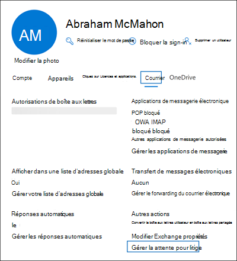

# <a name="create-a-litigation-hold"></a>Créer une conservation pour litige

[!include[Purview banner](../includes/purview-rebrand-banner.md)]

Vous pouvez placer une boîte aux lettres en attente de litige pour conserver tout le contenu de la boîte aux lettres, y compris les éléments supprimés et les versions d’origine des éléments modifiés. Lorsque vous placez une boîte aux lettres utilisateur en attente de litige, le contenu de la boîte aux lettres d’archivage de l’utilisateur (si elle est activée) est également conservé. Lorsque vous créez une conservation, vous pouvez spécifier une durée de conservation (également appelée *conservation basée sur le temps*) afin que les éléments supprimés et modifiés soient conservés pendant une période spécifiée, puis supprimés définitivement de la boîte aux lettres. Ou vous pouvez simplement conserver le contenu indéfiniment (appelé *conservation infinie*) ou jusqu’à ce que la conservation litige soit supprimée. Si vous spécifiez une période de conservation, elle est calculée à partir de la date de réception d’un message ou de la création d’un élément de boîte aux lettres. 
  
Voici ce qui se passe lorsque vous créez une conservation des litiges.
  
- Les éléments supprimés définitivement par l’utilisateur sont conservés dans le dossier Éléments récupérables dans la boîte aux lettres de l’utilisateur pendant la durée de conservation.

- Les éléments qui sont purgés du dossier Éléments récupérables par l’utilisateur sont conservés pendant la durée de la conservation.

- Le quota de stockage pour le dossier Éléments récupérables est passé de 30 Go à 110 Go.

- Les éléments dans les boîtes aux lettres primaire et d’archivage de l’utilisateur sont conservés

## <a name="assign-an-exchange-online-plan-2-license"></a>Attribuer une licence Exchange Online Plan 2

Pour placer une boîte aux lettres Exchange Online en attente de litige, une licence Exchange Online Plan 2 doit lui être attribuée. Si une licence Exchange Online Plan 1 est attribuée à une boîte aux lettres, vous devez lui attribuer une licence Archivage Exchange Online distincte pour la mettre en attente.

> [!NOTE]
> Pour Office 365 Éducation organisations, la conservation des litiges est prise en charge dans les abonnements Office 365 A1, qui incluent une licence Exchange Online Plan 1 avec des fonctionnalités supplémentaires. Pour plus d’informations, consultez la section « fonctionnalités Exchange Online » dans la [description du service Office 365 Éducation](/office365/servicedescriptions/office-365-platform-service-description/office-365-education#exchange-online-features).

## <a name="place-a-mailbox-on-litigation-hold"></a>Mettre une boîte aux lettres en attente pour litige

Voici les étapes à suivre pour placer une boîte aux lettres en attente de litige à l’aide de la Centre d'administration Microsoft 365.

1. Accédez à la <a href="https://go.microsoft.com/fwlink/p/?linkid=834822" target="_blank">Centre d'administration Microsoft 365</a>, puis cliquez sur **Utilisateurs** >  **Actif utilisateur.**

2. Sélectionnez l’utilisateur que vous souhaitez placer en conservation pour litige.

3. Dans la page de menu volant propriétés, cliquez sur l’onglet **Courrier** , puis, sous **Autres actions**, cliquez sur **Gérer la conservation des litiges**.

   

4. Dans la page de menu volant **Gérer les litiges** , activez la case à cocher **Activer la conservation des litiges** , puis entrez les informations facultatives suivantes :

    1. **Durée de conservation (jours)** : utilisez cette zone pour créer une conservation basée sur le temps et spécifier la durée pendant laquelle les éléments de boîte aux lettres sont conservés lorsque la boîte aux lettres est mise en attente contentieux. La durée est calculée à compter de la date de réception ou de création de l'élément de boîte aux lettres. Lorsque la durée de conservation expire pour un élément spécifique, cet élément n’est plus conservé. Si vous laissez cette zone vide, les éléments sont conservés indéfiniment ou jusqu’à ce que la conservation soit supprimée. Indiquez la période en nombre de jours.

    2. **Remarque visible pour l’utilisateur** : utilisez cette zone pour informer l’utilisateur que sa boîte aux lettres est en attente de litige. La note s’affiche sur la page Informations sur le compte dans la boîte aux lettres de l’utilisateur s’il utilise Outlook 2010 ou version ultérieure. Pour accéder à cette page, les utilisateurs peuvent cliquer sur **Fichier** dans Outlook.

    3. **Page web contenant plus d’informations pour l’utilisateur** : utilisez cette zone pour diriger l’utilisateur vers un site web pour plus d’informations sur la conservation des litiges. Cette URL apparaît sur la page Informations sur le compte dans la boîte aux lettres de l’utilisateur s’il utilise Outlook 2010 ou version ultérieure. Pour accéder à cette page, les utilisateurs peuvent cliquer sur **Fichier** dans Outlook.

. Cliquez sur **Enregistrer les modifications** dans la page de menu volant **Litiges** pour créer la conservation.

   Le système affiche une bannière indiquant qu’il peut prendre jusqu’à 240 minutes pour que la modification prenne effet.

### <a name="create-a-litigation-hold-using-powershell"></a>Créer une conservation des litiges à l’aide de PowerShell

Vous pouvez également créer une conservation des litiges en exécutant la commande suivante dans [Exchange Online PowerShell](/powershell/exchange/connect-to-exchange-online-powershell) :

```powershell
Set-Mailbox <username> -LitigationHoldEnabled $true
```

La commande précédente conserve indéfiniment les éléments, car la durée de conservation n’est pas spécifiée. Pour créer une conservation basée sur le temps, utilisez la commande suivante :

```powershell
Set-Mailbox <username> -LitigationHoldEnabled $true -LitigationHoldDuration <number of days>
```

Vous pouvez également exécuter la commande suivante pour vérifier si la boîte aux lettres est mise en attente pour litige :

```powershell
Get-Mailbox <username> | FL LitigationHoldEnabled
```

La valeur *True* indique que la boîte aux lettres est en attente de litige/

Pour plus d’informations, consultez [Set-Mailbox](/powershell/module/exchange/set-mailbox).

## <a name="how-does-litigation-hold-work"></a>Comment fonctionne la conservation des litiges ?

Dans le flux de travail d'éléments supprimés normal, un élément de boîte aux lettres est déplacé dans le sous-dossier Suppressions du dossier Éléments récupérables lorsqu'il est définitivement supprimé (MAJ + SUPPR) ou supprimé du dossier Éléments supprimés. Une stratégie de suppression (balise de rétention configurée avec une action de rétention Supprimer) déplace également les éléments dans le sous-dossier Suppressions à l'expiration de la période de rétention. Lorsqu'un utilisateur purge un élément du dossier Éléments récupérables ou lorsque la période de rétention des éléments supprimés expire, l'élément est déplacé dans le sous-dossier Purges et marqué pour suppression définitive. Il sera (purgé) d'Exchange lors du prochain traitement de la boîte aux lettres par l'Assistant Dossier géré.

Lorsqu’une boîte aux lettres est mise en attente pour litige, les éléments du sous-dossier Purges sont conservés pendant la durée de conservation spécifiée par la conservation litige. La durée de conservation est calculée à partir de la date de réception ou de création d'un élément, et correspond à la durée pendant laquelle les éléments du sous-dossier Purges sont conservés. Lorsque la durée de conservation d'un élément du sous-dossier expire, l'élément est marqué pour suppression définitive et supprimé d'Exchange lors du prochain traitement de la boîte aux lettres par l'Assistant Dossier géré. Si une boîte aux lettres est placée en conservation indéfinie, les éléments ne sont jamais purgés du sous-dossier Purges.

L'illustration suivante montre les sous-dossiers des dossiers Éléments récupérables et le processus de conservation inaltérable.


> [!NOTE]
> Si une conservation associée à un cas eDiscovery est placée sur une boîte aux lettres, les éléments purgés sont déplacés du sous-dossier Deletions vers le sous-dossier DiscoveryHolds et sont conservés jusqu’à ce que la boîte aux lettres soit libérée de la conservation eDiscovery.
