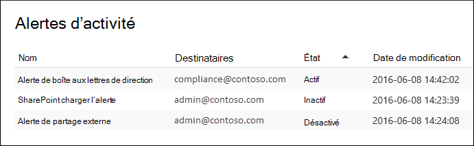

# Créer des alertes d’activité

Vous pouvez créer une alerte d’activité qui vous enverra une notification par courrier électronique lorsque les utilisateurs effectuent des activités spécifiques dans Office 365. Les alertes d’activité sont similaires à la recherche d’événements dans le journal d’audit, sauf qu’un message électronique vous est envoyé lorsqu’un événement pour une activité pour qui vous avez créé une alerte se produit.

 **Pourquoi utiliser des alertes d’activité au lieu de rechercher dans le journal d’audit ?** Il peut y avoir certains types d’activité ou d’activité effectués par des utilisateurs spécifiques que vous voulez vraiment connaître. Au lieu d’avoir à rechercher ces activités dans le journal d’audit, vous pouvez utiliser des alertes d’activité pour Microsoft 365 vous envoyer un message électronique lorsque les utilisateurs effectuent ces activités. Par exemple, vous pouvez créer une alerte d’activité pour vous avertir lorsqu’un utilisateur supprime des fichiers dans SharePoint, ou vous pouvez créer une alerte pour vous avertir lorsqu’un utilisateur supprime définitivement des messages de sa boîte aux lettres. La notification par courrier électronique qui vous est envoyée inclut des informations sur l’activité qui a été effectuée et l’utilisateur qui l’a effectuée.

> [!NOTE]
> Les alertes d’activité sont en cours d’precaté. Nous vous recommandons de commencer à utiliser des stratégies d’alerte dans le centre de sécurité et conformité au lieu de créer de nouvelles alertes d’activité. Les stratégies d’alerte fournissent des fonctionnalités supplémentaires, telles que la possibilité de créer une stratégie d’alerte qui déclenche une alerte lorsqu’un utilisateur effectue une activité spécifiée, et d’afficher des alertes sur la page Afficher les **alertes** dans le centre de sécurité et conformité. Pour plus d’informations, voir [Stratégies d’alerte.](alert-policies.md)

## Confirmer les rôles et configurer la journalisation d’audit

- Le rôle Configuration de l’organisation doit vous être attribué dans le Centre de conformité Microsoft 365 gérer les alertes d’activité. Par défaut, ce rôle est attribué aux groupes de rôles Administrateur de conformité et Gestion de l’organisation. Pour plus d’informations sur l’ajout de membres à des groupes de rôles, voir [Give users access to the Centre de conformité Microsoft 365](../security/office-365-security/grant-access-to-the-security-and-compliance-center.md).

- Vous (ou un autre administrateur) devez d’abord activer la journalisation d’audit pour votre organisation avant de commencer à utiliser les alertes d’activité. Pour ce faire, cliquez simplement sur **Démarrer** l’enregistrement de l’activité des utilisateurs et des administrateurs dans la page **Alertes d’activité.** (Si vous ne voyez pas ce lien, l’audit a déjà été désactivé pour votre organisation.) Vous pouvez également activer l’audit sur la page de recherche du journal **d’audit** dans la Centre de conformité Microsoft 365 (go to **Audit**). Vous ne devez le faire qu’une seule fois pour votre organisation.

- Vous pouvez créer des alertes pour les mêmes activités que vous pouvez rechercher dans le journal d’audit. Consultez la section [Plus](#more-information) d’informations pour obtenir la liste des scénarios courants (et l’activité spécifique à surveiller) pour qui vous pouvez créer des alertes.

- Vous pouvez utiliser la page **Alertes** d’activité dans le Centre de conformité Microsoft 365 pour créer des alertes uniquement pour les activités effectuées par les utilisateurs répertoriés dans le carnet d’adresses de votre organisation. Vous ne pouvez pas utiliser cette page pour créer des alertes pour les activités effectuées par des utilisateurs externes qui ne sont pas répertoriés dans le carnet d’adresses.

## Créer une alerte d’activité

1. Accédez à <https://compliance.microsoft.com/managealerts>.

2. Connectez-vous à l’aide de votre compte scolaire ou professionnel.

3. Dans la page **Alertes d’activité,** cliquez sur  **Nouveau**.

   La page de présentation pour créer une alerte d’activité s’affiche.

    

4. Complétez les champs suivants pour créer une alerte d’activité :

    1. **Nom** : tapez un nom pour l’alerte. Les noms des alertes doivent être uniques au sein de votre organisation.

    1. **Description** (facultatif) : décrire l’alerte, telle que les activités et les utilisateurs suivis et les utilisateurs vers qui les notifications par courrier électronique sont envoyées. Les descriptions permettent de décrire rapidement et facilement l’objectif de l’alerte aux autres administrateurs.

    1. **Type d’alerte** : **assurez-vous que l’option** Personnalisée est sélectionnée.

    1. **Envoyez cette alerte lorsque** - Cliquez sur **Envoyer cette** alerte quand puis configurez ces deux champs :

       - **Activités :** cliquez sur la liste liste de listes pour afficher les activités pour qui vous pouvez créer une alerte. Il s’agit de la même liste d’activités que celle qui s’affiche lorsque vous recherchez le journal d’audit. Vous pouvez sélectionner une ou plusieurs activités spécifiques ou cliquer sur le nom du groupe d’activités pour sélectionner toutes les activités du groupe. Pour obtenir une description de ces activités, consultez la section « Activités auditées » dans le journal [d’audit.](search-the-audit-log-in-security-and-compliance.md#audited-activities) Lorsqu’un utilisateur effectue l’une des activités que vous avez ajoutées à l’alerte, une notification par courrier électronique est envoyée.

       - **Utilisateurs** - Cliquez sur cette zone, puis sélectionnez un ou plusieurs utilisateurs. Si les utilisateurs de cette zone effectuent les activités que vous avez ajoutées à la zone **Activités,** une alerte est envoyée. Laissez la **zone Utilisateurs** vide pour envoyer une alerte lorsqu’un utilisateur de votre organisation effectue les activités spécifiées par l’alerte.

    1. Envoyez cette alerte à - Cliquez sur Envoyer cette **alerte,** puis cliquez dans la zone Destinataires et tapez  un nom pour ajouter les **utilisateurs** qui recevront une notification par courrier électronique lorsqu’un utilisateur (spécifié dans la zone Utilisateurs) effectue une activité (spécifiée dans la zone **Activités).**  Notez que vous êtes ajouté à la liste des destinataires par défaut. Vous pouvez supprimer votre nom de cette liste.

5. Cliquez **sur Enregistrer** pour créer l’alerte.

    La nouvelle alerte s’affiche dans la liste de la page **Alertes d’activité.**

    

    L’état de l’alerte est définie sur **On**. Notez que les destinataires qui recevront une notification par courrier électronique lors de l’envoi d’une alerte sont également répertoriés.

## Désactiver une alerte d’activité

Vous pouvez désactiver une alerte d’activité afin qu’aucune notification par courrier électronique ne soit envoyée. Une fois que vous avez éteint l’alerte d’activité, elle s’affiche toujours dans la liste des alertes d’activité pour votre organisation, et vous pouvez toujours afficher ses propriétés.

1. Accédez à <https://compliance.microsoft.com/managealerts>.

2. Connectez-vous à l’aide de votre compte scolaire ou professionnel.

3. Dans la liste des alertes d’activité pour votre organisation, cliquez sur l’alerte que vous souhaitez désactiver.

4. Dans la page Modifier  **l’alerte,** cliquez sur le bouton bascule Sur pour changer l’état sur **Off,** puis cliquez sur **Enregistrer**.

    L’état de l’alerte dans les pages **Alertes d’activité** est définie sur **Off**.

Pour ré-activer une alerte d’activité,  répétez simplement ces étapes et cliquez sur le bouton bascule Désactiver pour modifier l’état sur **Activer**.

## Plus d’informations

- Voici un exemple de notification par courrier électronique envoyée aux utilisateurs spécifiés dans le champ Envoyé à cette alerte (et répertoriés sous **Destinataires** sur la page **Alertes** d’activité) dans la Centre de conformité Microsoft 365.

    

- Voici quelques activités courantes de document et de messagerie pour qui vous pouvez créer des alertes d’activité. Les tableaux décrivent l’activité, le nom de l’activité pour qui créer une alerte  et le nom du groupe d’activités sous qui l’activité est répertoriée dans la liste de listes des activités. Pour consulter la liste complète des activités pour qui vous pouvez créer des alertes d’activité, consultez la section « Activités auditées » dans le journal [d’audit.](search-the-audit-log-in-security-and-compliance.md#audited-activities)

    > [!TIP]
    > Vous pouvez créer une alerte d’activité pour une seule activité effectuée par n’importe quel utilisateur. Vous pouvez également créer une alerte d’activité qui effectue le suivi de plusieurs activités effectuées par un ou plusieurs utilisateurs.

    Le tableau suivant répertorie certaines activités courantes liées aux documents SharePoint ou OneDrive Entreprise.

    | Lorsqu’un utilisateur fait cela... | Créer une alerte pour cette activité | Groupe d’activités |
    |:-----|:-----|:-----|
    |Affichage d’un document sur un site.  |Fichier consulté  |Activités de fichiers et de dossiers  |
    |Modifie ou modifie un document.  |Fichier modifié  |Activités de fichiers et de dossiers  |
    |Partage un document avec un utilisateur extérieur à votre organisation.  |Partager un fichier, un dossier ou un site    And    Invitation de partage créée    Pour plus d’informations, voir [Utiliser l’audit du partage dans le journal d’audit](use-sharing-auditing.md).  |Activités de demande d’accès et de partage  |
    |Télécharge ou télécharge un document.  |Fichier téléchargé    Et/ou    Fichier téléchargé  |Activités de fichiers et de dossiers  |
    |Modifie les autorisations d’accès à un site.  |Autorisations de site modifiées  |Activités d’administration des sites  |

    Le tableau suivant répertorie certaines activités courantes liées à la messagerie dans Exchange Online.

    | Lorsqu’un utilisateur fait cela... | Créer une alerte pour cette activité | Groupe d’activités |
    |:-----|:-----|:-----|
    |Supprime définitivement (purge) un message électronique de sa boîte aux lettres.  |Messages purgés de la boîte aux lettres  | Activités de la boîte aux lettres Exchange  |
    |Envoie un message électronique à partir d’une boîte aux lettres partagée.  |Message envoyé à l’aide d’autorisations Envoyer en tant que    And    Message envoyé à l’aide d’autorisations Envoyer de la part de  | Activités de la boîte aux lettres Exchange  |

- Vous pouvez également utiliser les cmdlets **New-ActivityAlert** et **Set-ActivityAlert** dans le Centre de sécurité & conformité PowerShell pour créer et modifier des alertes d’activité. Gardez les points suivants à l’esprit si vous utilisez ces cmdlets pour créer ou modifier des alertes d’activité :

  - Si vous utilisez une cmdlet pour ajouter une activité à  l’alerte qui n’est pas répertoriée dans la liste de listes des activités, un message s’affiche dans la page de propriétés de l’alerte qui indique « Cette alerte a des opérations personnalisées qui ne sont pas répertoriées dans le s picker ».

  - Une bonne raison d’utiliser les cmdlets pour créer ou modifier une alerte d’activité consiste à envoyer des notifications par courrier électronique à une personne extérieure à votre organisation. Cet utilisateur externe sera répertorié dans la liste des destinataires de l’alerte. Toutefois, si vous supprimez cet utilisateur externe de l’alerte, il ne peut pas être ajouté à l’alerte à l’aide de la page **Modifier l’alerte.** Vous devez rajouter l’utilisateur externe à l’aide de la cmdlet **Set-ActivityAlert** ou utiliser la cmdlet **New-ActivityAlert** pour ajouter le même (ou différent) utilisateur externe à une nouvelle alerte.
