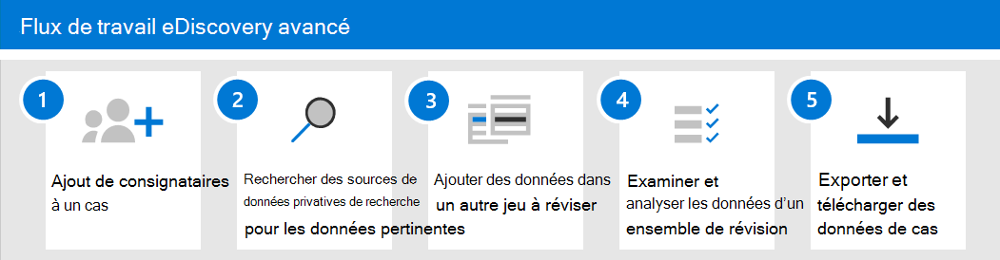

# Créer et gérer un cas Advanced eDiscovery

Après avoir mis en place Advanced eDiscovery et attribué des autorisations aux [responsables eDiscovery](get-started-with-advanced-ediscovery.md#step-2-assign-ediscovery-permissions) de votre organisation qui gèreront les cas, l’étape suivante consiste à créer et gérer un cas.

Cet article fournit également une vue d’ensemble de l’utilisation des cas pour gérer le flux de travail Advanced eDiscovery pour une enquête juridique.

## Créer un cas

Pour créer un cas et ajouter des membres, complétez les étapes suivantes. L’utilisateur qui crée le cas est automatiquement ajouté en tant que membre.

1. Go to [https://compliance.microsoft.com](https://compliance.microsoft.com) and sign in using the credentials for user account that has been assigned eDiscovery permissions. Les membres du groupe de rôles Gestion de l’organisation peuvent également créer des cas Advanced eDiscovery.

2. Dans le volet de navigation gauche du centre de conformité Microsoft 365, cliquez sur **Tout afficher**, puis cliquez sur **eDiscovery >avancée**.

3. Dans la page **Advanced eDiscovery,** cliquez sur l’onglet **Cas,** puis cliquez **sur Créer un cas.**

4. Dans la page de vol du cas **Nouvelle** découverte électronique, nommez le cas (obligatoire), puis tapez un numéro de cas et une description facultatifs. Le nom de cas doit être unique dans votre organisation.

5. Cliquez **sur Enregistrer** pour créer le cas.

   Le nouveau cas est créé et l’onglet **Paramètres** du nouveau cas s’affiche.

6. Dans la **vignette Autorisations & accès** sous l’onglet **Paramètres,** cliquez sur **Sélectionner,** puis cliquez sur Mettre **à jour.**

7. Cliquez sur **Mise à jour**.

8. Dans la page De gestion de ce  **cas** volant, sous **Gérer** les membres, cliquez sur Ajouter pour ajouter des membres au cas.

9. Dans la liste des personnes, cochez la case en regard des noms des personnes que vous souhaitez ajouter au cas. Comme indiqué précédemment, assurez-vous que les personnes que vous ajoutez au cas se sont vu attribuer les autorisations eDiscovery appropriées.

10. Une fois que vous avez sélectionné les personnes à ajouter en tant que membres du cas, cliquez sur **Ajouter**.

11. Dans la page de garde **Gérer ce cas**, cliquez sur **Enregistrer** pour enregistrer la nouvelle liste des membres de cas.

12. Cliquez sur **l’onglet** Accueil pour aller à la page d’accueil du cas.

## Gérer le flux de travail

Pour commencer à utiliser Advanced eDiscovery, voici un flux de travail de base qui s’aligne sur les pratiques [eDiscovery courantes.](advanced-ediscovery-edrm.md) Dans chacune de ces étapes, nous allons également mettre en évidence certaines fonctionnalités eDiscovery avancées étendues que vous pouvez explorer.

1. **[Ajoutez des dépositaires](add-custodians-to-case.md) et [des sources de données non privatives](non-custodial-data-sources.md) au cas.** La première étape après la création d’un cas consiste à ajouter des dépositaires. Un *dépositaire* est une personne particulièrement concernée par le contrôle administratif d’un document ou d’un fichier électronique. En outre, vous pouvez ajouter des sources de données qui ne sont pas associées à un utilisateur spécifique, mais qui peuvent être pertinentes pour le cas.

   Voici quelques choses qui se produisent (ou que vous pouvez faire) lorsque vous ajoutez des dépositaires à un cas :

   - Les données de la boîte aux lettres Exchange, du compte OneDrive et de tous les groupes Microsoft Teams ou Yammer dont le dépositaire est membre peuvent être « marquées » en tant que données de conservation dans le cas.
  
   - Les données du dépositaire sont réindexées (par un processus appelé *Indexation avancée).* Cela permet d’optimiser sa recherche à l’étape suivante.
  
   - Vous pouvez placer les données des dépositaires en conservation. Cela permet de conserver les données qui peuvent être pertinentes pour le cas au cours de l’examen.
  
   - Vous pouvez associer d’autres sources de données à un dépositaire (par exemple, vous pouvez associer un site SharePoint ou un groupe Microsoft 365 à un dépositaire) afin que ces données soient réindexées, placées en conservation et recherchés, tout comme les données de la boîte aux lettres du dépositaire ou du compte OneDrive.

   - Vous pouvez utiliser le flux [de travail de communications](managing-custodian-communications.md) dans Advanced eDiscovery pour envoyer une notification de conservation légale aux dépositaires.

2. **[Recherchez dans les sources de données les données pertinentes pour le cas.](collecting-data-for-ediscovery.md)** Après avoir ajouté des dépositaires et des sources de données non privatives à un cas, utilisez l’outil de recherche intégré pour rechercher dans ces sources de données les données qui peuvent être pertinentes pour le cas. Vous utilisez des mots clés,  des propriétés et des conditions pour créer des requêtes de recherche qui retournent des résultats de recherche avec les données les plus susceptibles d’être pertinentes pour le cas. Vous pouvez également :

   - Afficher [les statistiques de](search-statistics-in-advanced-ediscovery.md) recherche qui peuvent vous aider à affiner une requête de recherche pour affiner les résultats.

   - Affichez un aperçu des résultats de la recherche pour vérifier rapidement si les données pertinentes sont trouvées.

   - Révisez une requête et réexécutez la recherche.

3. **[Ajouter des données à un jeu à réviser.](add-data-to-review-set.md)** Une fois que vous avez configuré et vérifié qu’une recherche renvoie les données souhaitées, l’étape suivante consiste à ajouter les résultats de la recherche à un jeu à réviser. Lorsque vous ajoutez des données à un jeu à réviser, les éléments sont copiés à partir de leur emplacement d’origine vers un emplacement de stockage Azure sécurisé. Les données sont réindexées pour optimiser les recherches approfondies et rapides lors de la révision et de l’analyse des éléments du jeu à réviser. En outre, vous pouvez également [ajouter des données non Office 365 dans un jeu à réviser.](load-non-office-365-data-into-a-review-set.md)

   Il existe également un type spécial d’ensemble de révision à ajouter, appelé jeu de révision *de conversation.* Ces types de jeux de révisions fournissent des fonctionnalités de reconstruction de conversation pour reconstruire, réviser et exporter des conversations threadées comme celles de Microsoft Teams. Pour plus d’informations, voir [Examiner les conversations dans Advanced eDiscovery](conversation-review-sets.md).

4. **Examiner et analyser les données d’un jeu à réviser.** Maintenant que les données sont dans un jeu à réviser, vous pouvez utiliser un large éventail d’outils et de fonctionnalités pour afficher et analyser les données de cas dans le but de réduire le jeu de données à ce qui est le plus pertinent pour le cas que vous examinez. Voici une liste de certains outils et fonctionnalités que vous pouvez utiliser au cours de ce processus.

   - [Afficher des documents.](view-documents-in-review-set.md) Cela inclut l’affichage des métadonnées de chaque document dans un jeu à réviser et l’affichage du document dans sa version native ou sa version texte.

   - [Créer des requêtes et des filtres.](review-set-search.md) Vous créez des requêtes de recherche à l’aide de différents critères de recherche (y compris la possibilité de rechercher toutes les propriétés de métadonnées de [fichier)](document-metadata-fields-in-advanced-ediscovery.md)afin d’affiner et d’affiner les données de cas sur ce qui est le plus pertinent pour le cas. Vous pouvez également utiliser des filtres de jeu à réviser pour appliquer rapidement d’autres conditions aux résultats d’une requête de recherche afin d’affiner ces résultats. 

   - [Créer et utiliser des balises](tagging-documents.md). Vous pouvez appliquer des balises à des documents dans un jeu à réviser pour identifier ceux qui sont réactifs (ou non réactifs au cas), puis utiliser ces balises lors de la création de requêtes de recherche pour inclure ou exclure les documents marqués. Vous pouvez également baliser pour déterminer les documents à exporter.

   - [Annoter et redacter des documents.](view-documents-in-review-set.md#annotate-view) Vous pouvez utiliser l’outil d’annotation dans une révision pour annoter des documents et redessier du contenu dans des documents en tant que produit de travail. Nous générons une version PDF d’un document annoté ou rédigé au cours de la révision afin de réduire le risque d’exportation de la version native non expurgée du document.

   - [Analyser les données de cas.](analyzing-data-in-review-set.md) La fonctionnalité d’analyse dans Advanced eDiscovery est puissante. Après avoir exécuté des analyses sur les données du jeu à réviser, nous avons effectué des analyses telles que la détection des quasi-doublons, le thread de messagerie électronique et les thèmes qui peuvent aider à réduire le volume de documents à réviser. Nous générons également des rapports d’analyse qui résument le résultat de l’exécution de l’analyse. Comme indiqué précédemment, l’exécution de l’analyse exécute également le modèle de détection des privilèges [client-avocat.](attorney-privilege-detection.md#use-the-attorney-client-privilege-detection-model)

5. **Exporter et télécharger des données de cas.** Une dernière étape après la collecte, la révision et l’analyse des données de cas consiste à l’exporter hors d’Advanced eDiscovery pour révision externe ou pour révision par des personnes extérieures à l’équipe d’examen. L’exportation des données est un processus en deux étapes. La première étape  consiste à exporter les données hors de l’ensemble de révision et à les copier vers un autre emplacement de stockage Azure (un emplacement fourni par Microsoft ou un emplacement géré par votre organisation). Ensuite, vous utilisez l’Explorateur de stockage Azure [pour télécharger](download-export-jobs.md) les données sur un ordinateur local. Outre les fichiers de données exportés, le contenu du package d’exportation contient également un rapport d’exportation, un rapport de synthèse et un rapport d’erreurs.
