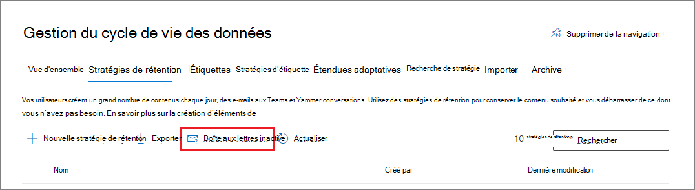

# <a name="create-and-manage-inactive-mailboxes"></a>Créer et gérer des boîtes aux lettres inactives

>*[Guide de sécurité et conformité pour les licences Microsoft 365](/office365/servicedescriptions/microsoft-365-service-descriptions/microsoft-365-tenantlevel-services-licensing-guidance/microsoft-365-security-compliance-licensing-guidance).*

Les boîtes aux lettres inactives vous permettent de conserver les courriers électroniques des anciens employés après leur départ de votre organisation et sont accessibles par des personnes autorisées qui ont reçu [des autorisations eDiscovery pour des raisons légales](assign-ediscovery-permissions.md) ou de conformité. Par exemple, les administrateurs, les agents de conformité et les gestionnaires d’enregistrements qui peuvent ensuite utiliser la recherche de contenu pour rechercher et exporter le contenu d’une boîte aux lettres inactive. Les boîtes aux lettres inactives ne peuvent pas recevoir de courriers, et n'apparaissent pas dans le carnet d'adresses partagé de votre organisation ou d'autres listes.

Pour plus d’informations sur les boîtes aux lettres inactives, voir [En savoir plus sur les boîtes aux lettres inactives.](inactive-mailboxes-in-office-365.md)

## <a name="create-an-inactive-mailbox"></a>Créer une boîte aux lettres inactive

Rendre une boîte aux lettres inactive nécessite une conservation de la boîte aux lettres, puis la suppression de la boîte aux lettres ou du compte d’utilisateur correspondant.

Pour rendre une boîte aux lettres inactive, elle doit être [concédée sous licence correctement](/office365/servicedescriptions/microsoft-365-service-descriptions/microsoft-365-tenantlevel-services-licensing-guidance/microsoft-365-security-compliance-licensing-guidance#email-archiving) afin qu’une conservation puisse être appliquée à la boîte aux lettres avant sa suppression. Une fois le compte d’utilisateur supprimé, toute licence Exchange Online associée au compte d’utilisateur sera disponible pour être attribuée à un nouvel utilisateur.

Nous vous recommandons d’utiliser la rétention Microsoft 365 pour appliquer la conservation sur la boîte aux lettres. D’autres méthodes sont abordées dans [En savoir plus sur les boîtes aux lettres inactives](inactive-mailboxes-in-office-365.md).

La meilleure façon de supprimer une boîte aux lettres consiste à supprimer le compte d’utilisateur correspondant dans le <a href="https://go.microsoft.com/fwlink/p/?linkid=2024339" target="_blank">Centre d'administration Microsoft 365</a>. Pour plus d’informations sur la suppression de comptes d’utilisateur, consultez [Supprimer un utilisateur de votre organisation](../admin/add-users/delete-a-user.md). Toutefois, vous pouvez également supprimer la boîte aux lettres à l’aide de l’applet de commande **Remove-Mailbox** dans Exchange Online PowerShell. Pour plus d’informations, consultez [Supprimer ou restaurer des boîtes aux lettres utilisateur dans Exchange Online](/exchange/recipients-in-exchange-online/delete-or-restore-mailboxes).

Le tableau suivant résume le processus de création d'une boîte aux lettres inactive pour différents scénarios de rétention.

<br/>

|À...|Vous devez…|Résultat|
|---|---|---|
|Conserver le contenu de la boîte aux lettres indéfiniment après le départ d’un employé de l’organisation|1. Appliquez des paramètres de rétention Microsoft 365 avec des actions de rétention pour la boîte aux lettres (stratégie de rétention) ou des éléments de messagerie spécifiques (une ou plusieurs étiquettes de rétention). <br /><br> 2. Attendez que les paramètres de rétention soient appliqués. <br /><br> 3. Supprimez le compte Microsoft 365 de l’utilisateur.|Tout le contenu de la boîte aux lettres inactive qui a des paramètres de rétention appliqués, y compris les éléments du dossier Éléments récupérables, est conservé indéfiniment.|
|Conserver tout le contenu de la boîte aux lettres pendant une période spécifique après le départ d’un employé de l’organisation, puis supprimer la boîte aux lettres|1. Appliquez une stratégie de rétention Microsoft 365 à la boîte aux lettres avec des paramètres de rétention qui conservent, puis suppriment des éléments à l’expiration de la période de rétention. <br /><br> 2. Attendez que les paramètres de rétention soient appliqués. <br /><br> 3. Supprimez le compte Microsoft 365 de l’utilisateur.|Lorsque la période de rétention d’un élément de boîte aux lettres expire, l’élément est déplacé vers le dossier Éléments récupérables, puis supprimé définitivement (purgé) de la boîte aux lettres inactive lorsque la période de rétention des éléments supprimés (pour les boîtes aux lettres Exchange) expire. La période de rétention de la stratégie de rétention Microsoft 365 est toujours basée sur la date d’origine à laquelle un élément de boîte aux lettres a été reçu ou créé.|


> [!NOTE]
> Si les paramètres de rétention De Microsoft 365 configurés pour conserver ou conserver puis supprimer du contenu sont déjà appliqués à la boîte aux lettres ou aux éléments de boîte aux lettres, ou si une conservation des litiges est déjà placée sur une boîte aux lettres, ou alors il vous suffit de supprimer le compte d’utilisateur correspondant pour créer une boîte aux lettres inactive.


## <a name="view-a-list-of-inactive-mailboxes"></a>Afficher la liste des boîtes aux lettres inactives

Pour afficher la liste des boîtes aux lettres inactives de votre organisation :

1. Accédez au <a href="https://go.microsoft.com/fwlink/p/?linkid=2077149" target="_blank">portail de conformité Microsoft Purview</a> et connectez-vous à l’aide des informations d’identification d’un Administrateur général ou d’un compte d’administrateur de conformité dans votre organisation.

2. Dans le volet de navigation gauche, sélectionnez **Gestion du cycle de vie des données** Stratégies de **rétention** >  **Microsoft 365** > .

3. Sélectionnez l’option **Boîte aux lettres inactive** :

   

4. La page **Boîtes aux lettres inactives** affiche la liste des boîtes aux lettres inactives. Sélectionnez-en une pour afficher des détails sur cette boîte aux lettres inactive. Les détails incluent l’identificateur Exchange de la boîte aux lettres et s’il est en [attente de litige](create-a-litigation-hold.md).
    
    Vous ne verrez pas d’autres types de conservations dans le volet d’informations, par exemple une stratégie de rétention Microsoft 365 ou une conservation eDiscovery. Pour trouver ces informations, consultez [Comment identifier le type de conservation placé sur une boîte aux lettres Exchange Online](identify-a-hold-on-an-exchange-online-mailbox.md).

Si vous avez de nombreuses boîtes aux lettres inactives, il peut être plus facile de rechercher et de trier un fichier CSV pour les détails que vous voyez dans la liste : dans la page **Boîtes aux lettres inactives** , sélectionnez :::image type="icon" source="../media/47205c65-babd-4b3a-bd7b-98dfd92883ba.png"::: **Exporter**.

Vous pouvez également exécuter la commande suivante dans Exchange Online PowerShell pour afficher la liste des boîtes aux lettres inactives :

```powershell
 Get-Mailbox -InactiveMailboxOnly | FT DisplayName,PrimarySMTPAddress,WhenSoftDeleted
```

Vous pouvez également exécuter la commande suivante pour exporter la liste des boîtes aux lettres inactives et d’autres informations dans un fichier CSV. Dans cet exemple, le fichier CSV est créé dans le répertoire actif.

```powershell
Get-Mailbox -InactiveMailboxOnly | Select Displayname,PrimarySMTPAddress,DistinguishedName,ExchangeGuid,WhenSoftDeleted | Export-Csv InactiveMailboxes.csv -NoType
```

> [!NOTE]
> Il est possible qu’une boîte aux lettres inactive ait la même adresse SMTP qu’une boîte aux lettres utilisateur active. Dans ce cas, la valeur de la propriété **DistinguishedName** ou **ExchangeGuid** peut être utilisée pour identifier de façon unique une boîte aux lettres inactive.
  
## <a name="search-and-export-the-contents-of-an-inactive-mailbox"></a>Recherche et exportation du contenu d'une boîte aux lettres inactive

Vous pouvez accéder au contenu de la boîte aux lettres inactive à l’aide de l’outil Recherche de contenu dans le portail de conformité Microsoft Purview. When you search an inactive mailbox, you can create a keyword search query to search for specific items or you can return the entire contents of the inactive mailbox. You can preview the search results or export the search results to an Outlook Data (PST) file or as individual email messages. For step-by-step procedures for searching mailboxes and exporting search results, see the following topics:
  
- [Recherche de contenu](content-search.md)

- [Exporter les résultats de la recherche](export-search-results.md)

Voici quelques éléments à prendre en considération lors de la recherche de boîtes aux lettres inactives.
  
- Si une recherche de contenu inclut une boîte aux lettres utilisateur et que cette boîte aux lettres est rendue inactive, la recherche de contenu continue à rechercher dans la boîte aux lettres inactive lorsque vous réexécutez la recherche une fois qu’elle est inactive.

- Dans certains cas, un utilisateur peut avoir une boîte aux lettres active et une boîte aux lettres inactive qui ont la même adresse SMTP. Dans ce cas, seule la boîte aux lettres spécifique que vous sélectionnez comme emplacement pour une recherche de contenu est recherchée. En d’autres termes, si vous ajoutez la boîte aux lettres d’un utilisateur à une recherche, vous ne pouvez pas supposer que ses boîtes aux lettres actives et inactives seront recherchées; seule la boîte aux lettres que vous ajoutez explicitement à la recherche est recherchée.

- Nous vous déconseillons vivement d’utiliser une boîte aux lettres active et une boîte aux lettres inactive portant la même adresse SMTP. Si vous devez réutiliser l’adresse SMTP actuellement affectée à une boîte aux lettres inactive, nous vous recommandons de récupérer la boîte aux lettres inactive ou de restaurer le contenu d’une boîte aux lettres inactive dans une boîte aux lettres active (ou l’archive d’une boîte aux lettres active), puis de supprimer la boîte aux lettres inactive.

## <a name="change-the-hold-duration-for-an-inactive-mailbox"></a>Modifier la durée de la conservation pour une boîte aux lettres inactive

Une fois qu’une boîte aux lettres est rendue inactive, vous pouvez peut-être modifier la durée de conservation appliquée à la boîte aux lettres inactive.

Pour connaître les procédures pas à pas, consultez [Modifier la durée de conservation d’une boîte aux lettres inactive](change-the-hold-duration-for-an-inactive-mailbox.md).
  
## <a name="recover-an-inactive-mailbox"></a>Récupérer une boîte aux lettres inactive

Si un ancien employé réintègre votre organisation, ou si un nouvel employé est embauché pour assumer les responsabilités d'un employé qui a quitté l'organisation, vous pouvez récupérer le contenu de la boîte aux lettres inactive. 

Lorsque vous récupérez une boîte aux lettres inactive, la boîte aux lettres est convertie en une nouvelle boîte aux lettres, le contenu et la structure de dossiers de la boîte aux lettres inactive sont conservés et la boîte aux lettres est liée à un nouveau compte d'utilisateur. Une fois récupérée, la boîte aux lettres inactive n'existe plus. 

Pour obtenir des procédures pas à pas et plus d’informations sur les événements de récupération d’une boîte aux lettres inactive, consultez [Récupérer une boîte aux lettres inactive](recover-an-inactive-mailbox.md).
  
## <a name="restore-the-contents-of-an-inactive-mailbox-to-another-mailbox"></a>Restaurer le contenu d'une boîte aux lettres inactive vers une autre boîte aux lettres

Si un autre employé assume les responsabilités de l'ancien employé, ou si un autre utilisateur doit accéder au contenu de la boîte aux lettres inactive, vous pouvez restaurer (ou fusionner) le contenu de la boîte aux lettres inactive vers une boîte aux lettres existante. 

Lorsque vous restaurez une boîte aux lettres inactive, le contenu est copié vers une autre boîte aux lettres. La boîte aux lettres inactive est conservée et reste une boîte aux lettres inactive. La boîte aux lettres inactive peut toujours faire l'objet d'une recherche à l'aide d'eDiscovery, son contenu peut être restauré vers une autre boîte aux lettres, ou il peut être récupéré ou supprimé ultérieurement. 

Pour connaître les procédures pas à pas, consultez [Restaurer une boîte aux lettres inactive](restore-an-inactive-mailbox.md).
  
## <a name="delete-an-inactive-mailbox"></a>Suppression d’une boîte aux lettres inactive

Si vous n’avez plus besoin de conserver le contenu d’une boîte aux lettres inactive, vous pouvez supprimer définitivement la boîte aux lettres inactive en supprimant la conservation appliquée à la boîte aux lettres inactive. La boîte aux lettres est conservée pendant 183 jours après la suppression de la stratégie de conservation ou de rétention et peut être récupérée pendant cette période. Après 183 jours, la boîte aux lettres est marquée pour suppression définitive et la boîte aux lettres devient non récupérable. 

Pour connaître les procédures pas à pas permettant de supprimer une conservation ou une stratégie de rétention pour supprimer définitivement une boîte aux lettres inactive, consultez [Supprimer une boîte aux lettres inactive](delete-an-inactive-mailbox.md).
