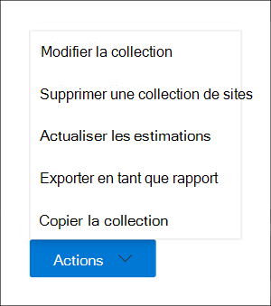

# Créer un brouillon de collection dans eDiscovery (Premium)

Une fois que vous avez identifié les consignatateurs et toutes les sources de données non gardiennes pour le cas, vous êtes prêt à identifier et à localiser un ensemble de documents pertinents. Pour ce faire, utilisez l’outil Collections pour rechercher du contenu pertinent dans les sources de données. Pour ce faire, créez une collection qui recherche du contenu qui correspond à vos critères de recherche dans les sources de données spécifiées. Vous avez la possibilité de créer un *brouillon de collection*, qui est une estimation des éléments trouvés, ou vous pouvez créer une collection qui ajoute automatiquement les éléments à un jeu de révision. Lorsque vous créez un brouillon de collection, vous pouvez afficher des informations sur les résultats estimés correspondant à la requête de recherche, telles que le nombre total et la taille des éléments trouvés, les différentes sources de données où ils ont été trouvés et des statistiques sur la requête de recherche. Vous pouvez également afficher un aperçu d’un exemple d’éléments renvoyés par la collection. À l’aide de ces statistiques, vous pouvez modifier la requête de recherche et réexécuter la collection brouillon pour affiner vos résultats. Une fois que vous êtes satisfait des résultats du regroupement, vous pouvez valider le regroupement dans un ensemble de révisions. Lorsque vous validez un brouillon de collection, les éléments retournés par la collection sont ajoutés à un ensemble de révisions à des fins de révision, d’analyse et d’exportation.

## Avant de créer un brouillon de collection

- Ajoutez des consignatateurs et des sources de données non gardiennes au cas avant de créer un brouillon de collection. Cela est nécessaire pour pouvoir sélectionner les sources de données lorsque vous créez un brouillon de collection. Pour plus d’informations, consultez l’article suivant :

  - [Ajouter des consignataires à un cas](add-custodians-to-case.md)

  - [Ajout de sources de données non consignataires à un cas](non-custodial-data-sources.md)

- Vous pouvez rechercher des sources de données supplémentaires (celles qui n’ont pas été ajoutées à l’affaire en tant qu’emplacements de garde ou de non-garde) dans un brouillon de collection pour trouver du contenu qui peut être pertinent pour le cas. Ces sources de données peuvent inclure des boîtes aux lettres, des sites SharePoint et Teams. Si cette situation s’applique à votre cas, compilez une liste de ces sources de données pour pouvoir les ajouter à la collection.

## Créer une collection au brouillon

1. Dans le portail de conformité Microsoft Purview, ouvrez le cas eDiscovery (Premium), puis sélectionnez l’onglet **Collections**.

2. Dans la page **Collections** , sélectionnez **Nouvelle collection** > **Standard**.

3. Tapez un nom (obligatoire) et une description (facultatif) pour la collection. Une fois la collection créée, vous ne pouvez pas modifier le nom, mais vous pouvez modifier la description.

4. Dans la page **Sources de données custodiales** , effectuez l’une des opérations suivantes pour identifier les sources de données de garde à partir de laquelle collecter du contenu :

   - Cliquez sur **Sélectionner les consignateurs** pour rechercher des consignatateurs spécifiques qui ont été ajoutés au cas. Si vous utilisez cette option, une liste des consignats de cas s’affiche. Sélectionnez un ou plusieurs consignatateurs. Une fois que vous avez sélectionné et ajouté les consignatateurs, vous pouvez également sélectionner les sources de données spécifiques à rechercher pour chaque consignateur. Ces sources de données qui sont affichées ont été spécifiées lorsque le consignateur a été ajouté au cas.

   - Cliquez sur le bouton **bascule Sélectionner tout** pour rechercher tous les consignats qui ont été ajoutés au cas. Lorsque vous sélectionnez cette option, toutes les sources de données de tous les consignats sont recherchées.

5. Dans la page **Sources de données non liées** à la garde, effectuez l’une des opérations suivantes pour identifier les sources de données non liées à la garde à partir des éléments suivants :

   - Cliquez sur **Sélectionner des sources de données non liées à la garde** pour sélectionner des sources de données non liées à la garde qui ont été ajoutées au cas. Si vous utilisez cette option, une liste de sources de données s’affiche. Sélectionnez une ou plusieurs de ces sources de données.

   - Cliquez sur le bouton bascule **Sélectionner tout** pour sélectionner toutes les sources de données non liées à la garde qui ont été ajoutées au cas.

6. Dans la page **Sources de données supplémentaires** , vous pouvez sélectionner d’autres boîtes aux lettres et sites à rechercher dans le cadre de la collection. Ces types de sources de données n’ont pas été ajoutés en tant qu’emplacements de données de garde ou non dans le cas. Vous disposez également de deux options lors de la recherche de sources de données supplémentaires :

   - Pour rechercher tous les emplacements de contenu d’un service spécifique (boîtes aux lettres Exchange, sites SharePoint et OneDrive ou dossiers publics Exchange), cliquez sur le bouton **bascule Sélectionner tout** dans la colonne **État** . Cette option recherche tous les emplacements de contenu dans le service sélectionné.

   - Pour rechercher un emplacement de contenu spécifique pour un service, cliquez sur le bouton **bascule Sélectionner tout** dans la colonne **État** , puis cliquez sur **Utilisateurs, groupes ou équipes** (pour les boîtes aux lettres Exchange) ou **Choisissez des sites** pour (sites SharePoint et OneDrive) pour rechercher des emplacements de contenu spécifiques.

7. Dans la page **Conditions** , vous pouvez créer la requête de recherche utilisée pour collecter des éléments à partir des sources de données que vous avez identifiées dans les pages précédentes de l’Assistant. Vous pouvez rechercher des mots clés, des paires property:value ou utiliser une liste de mots clés. Vous pouvez également ajouter différentes conditions de recherche pour affiner l’étendue de la collection. Pour plus d’informations, consultez [Les requêtes de recherche de build pour les regroupements](building-search-queries.md).

8. Dans la page **Enregistrer en tant que brouillon ou ajouter pour passer en revue l’ensemble** , **sélectionnez Enregistrer la collection comme brouillon**.

   > [!NOTE]
   > L’autre option de cette page vous permet de collecter des éléments et de les ajouter directement à un ensemble de révisions. Au lieu de créer un brouillon de collection pour lequel vous pouvez passer en revue les statistiques et afficher un aperçu d’un échantillon des résultats du regroupement, cette option ignore ce processus et ajoute automatiquement la collection à un ensemble de révisions. Si vous sélectionnez la deuxième option pour ajouter la collection à un ensemble de révisions, vous disposez de paramètres supplémentaires à configurer, tels que la collecte de threads de conversation entiers dans Microsoft Teams et Yammer et la collecte de pièces jointes cloud (également appelées *pièces jointes modernes*). Pour plus d’informations sur ces paramètres, consultez [Commit a draft collection to a review set](commit-draft-collection.md).

9. Dans la page **Vérifier votre collection** , vous pouvez passer en revue et mettre à jour les paramètres de collection que vous avez configurés sur les pages précédentes.

   - **Onglet Résumé** : Examinez et modifiez le nom et la description de la collection, les critères de recherche de collection, les emplacements de données supplémentaires et le type de collection.

   - **Onglet Sources** : Examinez et modifiez les sources de données custodiales et non-custodiales pour la collecte.

10. Cliquez sur **Envoyer** pour créer le brouillon de la collection. Une page s’affiche pour confirmer que la collection a été créée.

## Que se passe-t-il après avoir créé un brouillon de collection ?

Une fois que vous avez créé un brouillon de collection, il est répertorié dans la page **Collections** dans le cas et l’état indique qu’il est en cours. Un travail nommé **Préparation de l’aperçu de la recherche et des estimations** est également créé et affiché sur la page **Travaux** dans le cas.

Pendant le processus de collecte brouillon, eDiscovery (Premium) effectue une estimation de recherche à l’aide des critères de recherche et des sources de données que vous avez spécifiés dans la collection. eDiscovery (Premium) prépare également un échantillonnage d’éléments que vous pouvez prévisualiser. Une fois la collection terminée, les colonnes suivantes et les valeurs correspondantes sur la page **Collection** sont mises à jour :

- **État** : indique l’état et le type de collection. La valeur **Estimée** indique qu’une collection brouillon est terminée. Cette même valeur indique également que la collection est un brouillon et qu’elle n’a pas été ajoutée à un ensemble de révisions. La valeur **Validée** dans la colonne **État** indique que la collection a été ajoutée à un ensemble de révisions.

- **État de l’estimation** : indique l’état des résultats de recherche estimés et si les estimations et les statistiques de recherche sont prêtes à être examinées. La valeur **Réussie** indique que les résultats de la collection brouillon sont prêts à être examinés. Une fois que vous avez d’abord soumis un brouillon de collection, la valeur **En cours** s’affiche pour indiquer que la collection est toujours en cours d’exécution.

- **État d’aperçu** : indique l’état des exemples d’éléments que vous pouvez afficher en préversion. La valeur **Réussite** indique que les éléments sont prêts pour la préversion. Une fois que vous avez d’abord soumis un brouillon de collection, la valeur **En cours** s’affiche pour indiquer que la collection est toujours en cours d’exécution.

## Étapes suivantes après la fin d’une collection brouillon

Une fois le brouillon terminé, vous pouvez effectuer différentes tâches. Pour effectuer la plupart de ces tâches, accédez simplement à l’onglet **Collections** , puis cliquez sur le nom de la collection brouillon pour afficher la page de menu volant.

Voici une liste des opérations que vous pouvez effectuer à partir de la page de menu volant de la collection :

- Sélectionnez l’onglet **Résumé** pour afficher les informations récapitulatives sur la collection et les résultats de recherche estimés retournés par la collection. Cela inclut le nombre total d’éléments et la taille des résultats de recherche estimés, le nombre de boîtes aux lettres et de sites contenant des résultats de recherche et les conditions de recherche (si elles sont utilisées) utilisées pour étendre la collection.

- Sélectionnez l’onglet **Sources de données** pour afficher la liste des consignatateurs et des sources de données non gardiennes) qui ont fait l’objet d’une recherche dans la collection. Tous les emplacements de contenu supplémentaires qui ont fait l’objet d’une recherche sont **répertoriés sous Emplacements** sous l’onglet **Résumé** .

- Sélectionnez l’onglet **Statistiques de** recherche pour afficher les statistiques sur la collection. Cela inclut le nombre total et la taille des éléments trouvés dans chaque service (par exemple, les boîtes aux lettres Exchange ou les sites SharePoint) et un rapport de condition qui affiche des statistiques sur le nombre d’éléments retournés par différents composants de la requête de recherche utilisée par la collection. Pour plus d’informations, consultez [les statistiques et les rapports](collection-statistics-reports.md) de collecte.

- Cliquez sur **Vérifier l’exemple** (situé en bas de la page de menu volant) pour afficher un aperçu d’un échantillon des éléments retournés par la collection.

- Validez le brouillon de la collection dans un jeu de révision (en cliquant sur **Actions** > **Modifier la collection**). Cela signifie que vous réexécutez la collection (à l’aide des paramètres actuels) et ajoutez les éléments retournés par la collection à un jeu de révision. Comme expliqué précédemment, vous pouvez également configurer des paramètres supplémentaires (tels que le thread de conversation et les pièces jointes basées sur le cloud) lorsque vous ajoutez la collection à un ensemble de révisions. Pour plus d’informations et pour obtenir des instructions pas à pas, consultez [Commit a draft collection to a review set](commit-draft-collection.md).

## Gérer un brouillon de collection

Vous pouvez utiliser les options du menu **Actions** dans la page de menu volant d’un brouillon de collection pour effectuer différentes tâches de gestion.

Voici des descriptions des options de gestion.

- **Modifier la collection** : modifiez les paramètres de la collection brouillon. Après avoir apporté des modifications, vous pouvez réexécuter la collection et mettre à jour les estimations et les statistiques de recherche. Comme expliqué précédemment, vous utilisez cette option pour valider un brouillon de collection dans un ensemble de révisions.  

- **Supprimer une collection** : supprimer un brouillon de collection. Notez qu’une fois qu’un brouillon de collection est validé dans un ensemble de révisions, il ne peut pas être supprimé.

- **Actualiser les estimations** : réexécutez la requête (sur les sources de données) spécifiée dans le brouillon de la collection pour mettre à jour les estimations et les statistiques de recherche.

- **Exporter en tant que rapport** : exporte des informations sur le projet de collection vers un fichier CSV que vous pouvez télécharger sur votre ordinateur local. Le rapport d’exportation contient les informations suivantes :

  - Identité de chaque emplacement de contenu qui contient des éléments qui correspondent à la requête de recherche dans la collection brouillon. Ces emplacements sont généralement des boîtes aux lettres ou des sites.
  
  - Nombre total d’éléments dans chaque emplacement de contenu.
  
  - Taille totale (en octets) des éléments dans chaque emplacement de contenu.

  - Service (par exemple, Exchange ou SharePoint) dans lequel se trouve l’emplacement du contenu.

- **Copier une collection** : créez une collection brouillon en copiant les paramètres d’une collection existante. Vous devez utiliser un nom différent pour la nouvelle collection. Vous avez également la possibilité de modifier les paramètres avant d’envoyer la nouvelle collection. Une fois que vous l’avez envoyée, la requête de recherche est exécutée et de nouvelles estimations et statistiques sont générées. Il s’agit d’un bon moyen de créer rapidement une collection brouillon supplémentaire, puis de modifier les paramètres sélectionnés si nécessaire tout en conservant les informations dans la collection d’origine. Cela vous permet également de comparer facilement les résultats de deux collections similaires.

> [!NOTE]
> Une fois qu’un brouillon de collection est validé dans un ensemble de révisions, vous pouvez uniquement copier la collection et exporter un rapport.
