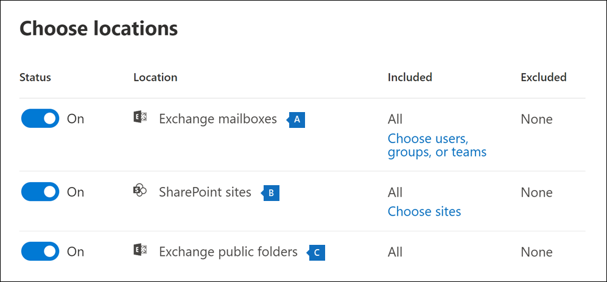
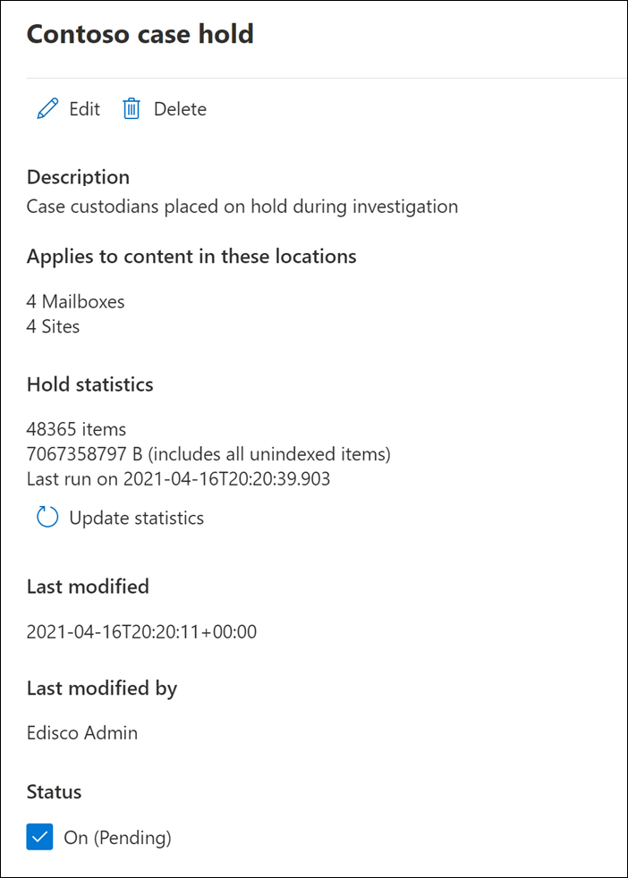

# <a name="create-an-ediscovery-hold"></a>Créer une suspension de cas eDiscovery

Vous pouvez utiliser un cas Microsoft Purview eDiscovery (Standard) pour créer des conservations afin de conserver le contenu susceptible d’être pertinent pour le cas. Vous pouvez placer une conservation sur les boîtes aux lettres Exchange et les comptes OneDrive Entreprise des personnes que vous examinez dans le cas. Vous pouvez également placer une conservation sur les boîtes aux lettres et les sites associés aux groupes Microsoft Teams, Office 365 et Yammer. Lorsque vous placez des emplacements de contenu en attente, le contenu est conservé jusqu’à ce que vous supprimiez l’emplacement de contenu de la conservation ou jusqu’à ce que vous supprimiez la conservation.

Une fois que vous avez créé une conservation eDiscovery, l’application de la conservation peut prendre jusqu’à 24 heures.

Lorsque vous créez une conservation, vous disposez des options suivantes pour étendre le contenu conservé dans les emplacements de contenu spécifiés :
  
- Créez une conservation infinie où tout le contenu dans les emplacements spécifiés est mis en attente. Vous pouvez également créer une conservation basée sur une requête où seul le contenu dans les emplacements spécifiés qui correspond à une requête de recherche est mis en attente.

- Spécifiez une plage de dates pour conserver uniquement le contenu qui a été envoyé, reçu ou créé dans cette plage de dates. Vous pouvez également conserver tout le contenu à des emplacements spécifiés, quel que soit le moment où il a été envoyé, reçu ou créé.
  
## <a name="how-to-create-an-ediscovery-hold"></a>Comment créer une conservation eDiscovery

Pour créer une conservation eDiscovery associée à un cas eDiscovery (Standard) :
  
1. Accédez au <a href="https://go.microsoft.com/fwlink/p/?linkid=2077149" target="_blank">portail de conformité Microsoft Purview</a> et connectez-vous à l’aide des informations d’identification du compte d’utilisateur qui a reçu les autorisations eDiscovery appropriées.

2. Dans le volet de navigation gauche, cliquez sur **Afficher tout**, puis sur **eDiscovery > Core**.

3. Dans la page **eDiscovery (Standard),** cliquez sur le nom du cas dans lequel vous souhaitez créer la conservation.

4. Dans la page **d’accueil** du cas, cliquez sur l’onglet **Maintenir** .
  
5. Dans la page **Conserver** , cliquez sur **Créer**.

6. Dans la page **De l’Assistant Nom de votre conservation** , donnez un nom à la conservation et ajoutez une description facultative, puis cliquez sur **Suivant**. Le nom de la conservation doit être unique dans toute votre organisation.

7. Dans la page **Choisir les emplacements** de l’Assistant, choisissez les emplacements de contenu que vous souhaitez mettre en attente. Vous pouvez mettre en attente des boîtes aux lettres, des sites et des dossiers publics.

    
  
   1. **Boîtes aux lettres Exchange** : définissez le bouton bascule sur **Activé**, puis cliquez sur **Sélectionner des utilisateurs, des groupes ou des équipes** pour spécifier les boîtes aux lettres à mettre en attente. Utilisez la zone de recherche pour rechercher des boîtes aux lettres utilisateur et des groupes de distribution (pour placer les boîtes aux lettres des membres du groupe en conservation) à placer en conservation. Vous pouvez également placer une conservation sur la boîte aux lettres associée pour une équipe Microsoft, un groupe Office 365 et un groupe Yammer. Pour plus d’informations sur les données d’application qui sont conservées lorsqu’une boîte aux lettres est mise en attente, consultez [Contenu stocké dans les boîtes aux lettres pour eDiscovery](what-is-stored-in-exo-mailbox.md).

   2. **Sites SharePoint** : définissez le bouton bascule sur **Activé** puis cliquez sur **Sélectionner des sites** pour spécifier les sites SharePoint et les comptes OneDrive à conserver. Saisissez l’URL de chaque site à placer en conservation. Vous pouvez également ajouter l’URL du site SharePoint pour une équipe Microsoft, un groupe Office 365 ou un groupe Yammer.
  
   3. **Dossiers publics Exchange** : définissez la bascule sur **Activé** pour mettre tous les dossiers publics en attente dans votre organisation Exchange Online. Vous ne pouvez pas choisir des dossiers publics spécifiques à mettre en attente. Laissez le bouton bascule désactivé si vous ne voulez pas maintenir les dossiers publics en attente.

   > [!IMPORTANT]
   > Lorsque vous ajoutez Exchange boîtes aux lettres ou SharePoint sites à une conservation, vous devez ajouter explicitement au moins un emplacement de contenu à la conservation. En d’autres termes, si vous définissez le bouton bascule **sur Activé** pour les boîtes aux lettres ou les sites, vous devez sélectionner des boîtes aux lettres ou des sites spécifiques à ajouter à la conservation. Dans le cas contraire, la conservation eDiscovery est créée, mais aucune boîte aux lettres ou site n’est ajoutée à la conservation, et les statistiques indiquent qu’aucun emplacement ou élément de contenu n’est en attente.

8. Lorsque vous avez terminé d’ajouter des emplacements à la conservation, cliquez sur **Suivant**.

9. Pour créer une conservation basée sur une requête à l’aide de mots clés ou de conditions, effectuez les étapes suivantes. Pour conserver tout le contenu dans les emplacements de contenu spécifiés, cliquez sur **Suivant**.

    
  
    1. Dans la zone sous **Mots clés**, tapez une requête pour conserver uniquement le contenu qui correspond aux critères de requête. Vous pouvez spécifier des mots clés, des propriétés de message électronique ou des propriétés de site, telles que des noms de fichiers. Vous pouvez également utiliser des requêtes plus complexes qui utilisent un opérateur booléen, tel que **ET**, **OU** ou **NON**.

    2. Cliquez sur **Ajouter une condition** pour ajouter une ou plusieurs conditions pour affiner la requête pour la conservation. Chaque condition ajoute une clause à la requête de recherche KQL qui est créée et exécutée lorsque vous créez la conservation. Par exemple, vous pouvez spécifier une plage de dates afin que les documents de courrier électronique ou de site créés dans la plage de dates soient conservés. Une condition est connectée logiquement à la requête de mot clé (spécifiée dans la zone **mots clés**) et à d’autres conditions par l’opérateur **ET**. Cela signifie que les éléments doivent satisfaire à la fois à la requête de mot clé et à la condition à conserver.

    Pour plus d’informations sur la création d’une requête de recherche et l’utilisation de conditions, consultez [les requêtes de mot clé et les conditions de recherche pour eDiscovery](keyword-queries-and-search-conditions.md).

10. Après avoir configuré une conservation basée sur une requête, cliquez sur **Suivant**.

11. Passez en revue vos paramètres (et modifiez-les si nécessaire), puis cliquez sur **Envoyer**.

> [!NOTE]
> Lorsque vous créez une conservation basée sur une requête, tout le contenu des emplacements sélectionnés est initialement mis en attente. Par la suite, tout contenu qui ne correspond pas à la requête spécifiée est effacé de la conservation tous les sept à 14 jours. Toutefois, une conservation basée sur une requête n’efface pas le contenu si plus de cinq conservations de n’importe quel type sont appliquées à un emplacement de contenu ou si un élément présente des problèmes d’indexation.

## <a name="query-based-holds-placed-on-sites"></a>Conservations basées sur des requêtes placées sur des sites

Gardez à l’esprit les éléments suivants lorsque vous placez une conservation eDiscovery basée sur une requête sur les documents situés dans SharePoint sites :

- Une conservation basée sur une requête conserve initialement tous les documents d’un site pendant une courte période après leur suppression. Cela signifie que lorsqu’un document est supprimé, il est déplacé vers la bibliothèque de conservation, même s’il ne correspond pas aux critères de la conservation basée sur une requête. Toutefois, les documents supprimés qui ne correspondent pas à une conservation basée sur une requête sont supprimés par un travail de minuteur qui traite la bibliothèque de conservation de la conservation. Le travail du minuteur s’exécute régulièrement et compare tous les documents de la bibliothèque de conservation des conservations à vos conservations eDiscovery basées sur une requête (et à d’autres types de conservations et de stratégies de rétention). Le travail du minuteur supprime les documents qui ne correspondent pas à une conservation basée sur une requête et conserve les documents qui le font.

- Les conservations basées sur des requêtes ne doivent pas être utilisées pour effectuer une conservation ciblée, comme la conservation de documents dans un dossier ou un site spécifique ou à l’aide d’autres critères de conservation basés sur l’emplacement. Cela peut avoir des résultats inattendus. Nous vous recommandons d’utiliser des critères de conservation non basés sur un emplacement tels que des mots clés, des plages de dates ou d’autres propriétés de document pour conserver les documents de site.

## <a name="ediscovery-hold-statistics"></a>Statistiques de conservation eDiscovery

Une fois que vous avez créé une conservation eDiscovery, des informations sur la nouvelle conservation s’affichent sur la page de menu volant de la conservation sélectionnée. Ces informations incluent le nombre de boîtes aux lettres et de sites en attente, ainsi que des statistiques sur le contenu qui a été mis en attente, telles que le nombre total et la taille des éléments mis en attente et la dernière fois que les statistiques de conservation ont été calculées. Ces statistiques de conservation vous aident à identifier la quantité de contenu liée au cas en cours de conservation.
  

  
Gardez à l’esprit les éléments suivants concernant les statistiques de conservation eDiscovery :
  
- Le nombre total d’éléments en attente indique le nombre d’éléments provenant de toutes les sources de contenu mises en attente. Si vous avez créé une conservation basée sur une requête, cette statistique indique le nombre d’éléments qui correspondent à la requête.

- Le nombre d’éléments en attente inclut également les éléments non indexés trouvés dans les emplacements de contenu. Si vous créez une conservation basée sur une requête, tous les éléments non indexés dans les emplacements de contenu sont mis en attente. Cela inclut les éléments non indexés qui ne correspondent pas aux critères de recherche d’une conservation basée sur une requête et aux éléments non indexés qui peuvent se trouver en dehors d’une condition de plage de dates. Cela est différent de ce qui se produit lorsque vous exécutez une recherche, dans laquelle les éléments non indexés qui ne correspondent pas à la requête de recherche ou qui sont exclus par une condition de plage de dates ne sont pas inclus dans les résultats de la recherche. Pour plus d’informations sur les éléments non indexés, consultez [Éléments partiellement indexés](partially-indexed-items-in-content-search.md).

- Vous pouvez obtenir les dernières statistiques de conservation en cliquant sur **Mettre à jour les statistiques** pour réexécuter une estimation de recherche qui calcule le nombre actuel d’éléments en attente.

- Il est normal que le nombre d’éléments en attente augmente au fil du temps, car les utilisateurs dont la boîte aux lettres ou le site est en attente envoient ou reçoivent généralement de nouveaux messages électroniques et créent de nouveaux documents dans SharePoint et OneDrive.

- Si une boîte aux lettres Exchange, un site SharePoint ou un compte OneDrive est déplacé vers une autre région dans un environnement multigéographique, les statistiques de ce site ne sont pas incluses dans les statistiques de conservation. Toutefois, le contenu de ces emplacements sera conservé. En outre, si une boîte aux lettres ou un site est déplacé vers une autre région, l’adresse SMTP ou l’URL affichée dans la conservation ne sera pas automatiquement mise à jour. Vous devrez modifier la conservation et mettre à jour l’URL ou l’adresse SMTP afin que les emplacements de contenu soient à nouveau inclus dans les statistiques de conservation

## <a name="search-locations-on-ediscovery-hold"></a>Emplacements de recherche dans la conservation eDiscovery

Lorsque vous [recherchez du contenu](search-for-content-in-core-ediscovery.md) dans un cas eDiscovery (Standard), vous pouvez configurer rapidement la recherche pour rechercher uniquement les emplacements de contenu qui ont été placés dans une conservation associée au cas.

Sélectionnez l’option **Emplacements en attente** pour rechercher tous les emplacements de contenu qui ont été mis en attente. Si le cas contient plusieurs conservations eDiscovery, les emplacements de contenu de toutes les conservations sont recherchés lorsque vous sélectionnez cette option. En outre, si un emplacement de contenu a été placé sur une conservation basée sur une requête, seuls les éléments qui correspondent à la requête de conservation sont recherchés lorsque vous exécutez la recherche. En d’autres termes, seul le contenu qui correspond aux critères de conservation et aux critères de recherche est retourné avec les résultats de la recherche. Par exemple, si un utilisateur a été placé sur une conservation de cas basée sur une requête qui conserve les éléments qui ont été envoyés ou créés avant une date spécifique, seuls ces éléments sont recherchés. Pour ce faire, connectez la requête case hold et la requête de recherche par un opérateur **AND** .

Voici d’autres éléments à garder à l’esprit lors de la recherche d’emplacements sur la conservation eDiscovery :

- Si un emplacement de contenu fait partie de plusieurs conservations dans le même cas, les requêtes de conservation sont combinées par les opérateurs **OR** lorsque vous effectuez une recherche dans cet emplacement de contenu à l’aide de l’option tout le contenu de cas. De même, si un emplacement de contenu fait partie de deux conservations différentes, où l’un est basé sur une requête et l’autre est une conservation infinie (où tout le contenu est mis en attente), tout le contenu est recherché en raison de la conservation infinie.

- Si une recherche est configurée pour rechercher des emplacements en attente et que vous modifiez une conservation eDiscovery dans le cas (en ajoutant ou en supprimant un emplacement ou en modifiant une requête de conservation), la configuration de la recherche est mise à jour avec ces modifications. Toutefois, vous devez réexécuter la recherche une fois la conservation modifiée pour mettre à jour les résultats de la recherche.

- Si plusieurs conservations eDiscovery sont placées sur un emplacement unique dans un cas eDiscovery et que vous choisissez de rechercher des emplacements en attente, le nombre maximal de mots clés pour cette requête de recherche est de 500. Cela est dû au fait que la recherche combine toutes les conservations basées sur des requêtes à l’aide de l’opérateur **OR** . S’il existe plus de 500 mots clés dans les requêtes de conservation combinées et la requête de recherche, tout le contenu de la boîte aux lettres est recherché, et pas seulement ce contenu qui correspond à la casse basée sur la requête.

- Si une conservation eDiscovery a l’état **On (Pending),** vous pouvez toujours rechercher les emplacements en attente pendant que la conservation est activée.

## <a name="preserve-content-in-microsoft-teams"></a>Conserver le contenu dans Microsoft Teams

Les conversations qui font partie d’un canal Microsoft Teams sont stockées dans la boîte aux lettres associée à l’équipe Microsoft. De même, les fichiers partagés par les membres d’une équipe dans un canal sont stockés sur le site SharePoint de l’équipe. Par conséquent, vous devez placer la boîte aux lettres d’équipe et le site SharePoint sur eDiscovery pour conserver les conversations et les fichiers dans un canal.

Les conversations qui font partie de la liste des conversations dans Teams (appelées *conversations 1:1* ou *conversations de groupe 1:N*) sont stockées dans les boîtes aux lettres des utilisateurs qui participent à la conversation. Les fichiers que les utilisateurs partagent dans les conversations sont stockés dans le compte OneDrive de l’utilisateur qui partage le fichier. Par conséquent, vous devez ajouter les boîtes aux lettres des utilisateurs individuels et les comptes OneDrive à une conservation eDiscovery pour conserver les conversations et les fichiers dans la liste des conversations. Il est judicieux de placer une conservation sur les boîtes aux lettres des membres d’une équipe Microsoft, en plus de mettre la boîte aux lettres et le site d’équipe en attente.

> [!NOTE]
> Si votre organisation dispose d’un déploiement hybride Exchange (ou si votre organisation synchronise une organisation Exchange locale avec Office 365) et a activé Microsoft Teams, les utilisateurs locaux peuvent utiliser l’application de conversation Teams et participer à des conversations 1:1 et à des conversations de groupe 1:N. Ces conversations sont stockées dans un stockage cloud associé à un utilisateur local. Si un utilisateur local est placé dans une conservation eDiscovery, le contenu de conversation Teams dans le stockage cloud est conservé. Pour plus d'informations, voir [Recherche de données de conversation des équipes pour les utilisateurs sur site](search-cloud-based-mailboxes-for-on-premises-users.md).

Pour plus d’informations sur la conservation Teams contenu, consultez [Placer un utilisateur ou une équipe Microsoft Teams en attente légale](/MicrosoftTeams/legal-hold).

### <a name="preserve-card-content"></a>Conserver le contenu de la carte

De même, le contenu de carte généré par les applications dans les canaux Teams, les conversations 1:1 et les conversations de groupe 1:N est stocké dans les boîtes aux lettres et est conservé lorsqu’une boîte aux lettres est placée dans une conservation eDiscovery. Une *carte* est un conteneur de l'assurance-chômage pour de petits morceaux de contenu. Les cartes peuvent avoir plusieurs propriétés et pièces jointes, et peuvent inclure des boutons qui déclenchent des actions de carte. Pour plus d’informations, consultez [Cartes](/microsoftteams/platform/task-modules-and-cards/what-are-cards). Comme pour le contenu des autres Teams, le lieu de stockage du contenu de la carte est basé sur l'endroit où la carte a été utilisée. Le contenu des cartes utilisées dans un canal Teams est stocké dans la boîte aux lettres du groupe Teams. Le contenu des cartes pour les chats 1:1 et 1xN est stocké dans les boîtes aux lettres des participants au conversation.

### <a name="preserve-meeting-and-call-information"></a>Conserver les informations de réunion et d’appel

Les informations récapitulatives pour les réunions et les appels dans un canal Teams sont également stockées dans les boîtes aux lettres des utilisateurs qui ont composé la réunion ou l’appel. Ce contenu est également conservé lorsqu’une conservation eDiscovery est placée sur les boîtes aux lettres utilisateur.

### <a name="preserve-content-in-private-channels"></a>Conserver le contenu dans les canaux privés

À compter de février 2020, nous avons également activé la possibilité de préserver le contenu dans les canaux privés. Étant donné que les conversations de canal privé sont stockées dans les boîtes aux lettres des participants à la conversation, le placement d’une boîte aux lettres utilisateur dans la conservation eDiscovery conserve les conversations de canal privé. En outre, si une boîte aux lettres d’utilisateur a été placée en conservation eDiscovery avant février 2020, la conservation s’applique désormais automatiquement aux messages de canal privé stockés dans cette boîte aux lettres. La conservation des fichiers partagés dans des canaux privés est également prise en charge.

### <a name="preserve-wiki-content"></a>Conserver le contenu wiki

Chaque chaîne d’équipe ou d’équipe contient également un Wiki pour la prise de notes et la collaboration. Le contenu wiki est automatiquement enregistré dans un fichier au format .mht. Ce fichier est stocké dans la bibliothèque de documents wiki Teams sur le site SharePoint de l’équipe. Vous pouvez conserver le contenu wiki en ajoutant le site SharePoint de l’équipe à une conservation eDiscovery.

> [!NOTE]
> La fonctionnalité de conservation du contenu Wiki pour une équipe ou un canal d’équipe (lorsque vous mettez le site SharePoint de l’équipe en attente) a été publiée le 22 juin 2017. Si un site d’équipe est en attente, le contenu wiki sera conservé à compter de cette date. Toutefois, si un site d’équipe est en attente et que le contenu wiki a été supprimé avant le 22 juin 2017, le contenu wiki n’a pas été conservé.

### <a name="office-365-groups"></a>Groupes Office 365

Teams repose sur des groupes Office 365. Par conséquent, placer des groupes Office 365 en conservation eDiscovery est similaire en plaçant Teams contenu en attente.

Gardez à l’esprit les éléments suivants lorsque vous placez des groupes Teams et Office 365 sur une conservation eDiscovery :

- Comme expliqué précédemment, pour mettre le contenu situé dans Teams et Office 365 Groupes en attente, vous devez spécifier la boîte aux lettres et le site SharePoint associé à un groupe ou une équipe.

- Exécutez l’applet **de commande Get-UnifiedGroup** dans [Exchange Online PowerShell](/powershell/exchange/connect-to-exchange-online-powershell) pour afficher les propriétés des groupes Teams et Office 365. Il s’agit d’un bon moyen d’obtenir l’URL du site associé à une équipe ou à un groupe Office 365. Par exemple, la commande suivante affiche les propriétés sélectionnées d’un groupe Office365 nommé Senior Leadership Team :

    ```text
    Get-UnifiedGroup "Senior Leadership Team" | FL DisplayName,Alias,PrimarySmtpAddress,SharePointSiteUrl

    DisplayName            : Senior Leadership Team
    Alias                  : seniorleadershipteam
    PrimarySmtpAddress     : seniorleadershipteam@contoso.onmicrosoft.com
    SharePointSiteUrl      : https://contoso.sharepoint.com/sites/seniorleadershipteam
    ```

    > [!NOTE]
    > Pour exécuter l'applet de commande **Get-UnifiedGroup**, vous devez avoir le rôle de destinataires en affichage seul dans Exchange Online ou être membre d’un groupe de rôles affecté du rôle de destinataires en affichage seul. 
  
- Lorsque la boîte aux lettres d’un utilisateur est recherchée, aucune équipe ou groupe Office 365 dont l’utilisateur est membre ne sera recherché. De même, lorsque vous placez une équipe ou un groupe Office 365 en attente eDiscovery, seule la boîte aux lettres du groupe et le site de groupe sont mis en attente. Les boîtes aux lettres et les sites OneDrive Entreprise des membres du groupe ne sont pas mis en attente, sauf si vous les ajoutez explicitement à la conservation eDiscovery. Par conséquent, si vous devez mettre une équipe ou un groupe Office 365 en attente pour une raison légale, envisagez d’ajouter les boîtes aux lettres et OneDrive comptes des membres de l’équipe ou du groupe sur la même conservation.

- Pour obtenir la liste des membres d’une équipe ou d’un groupe Office 365, vous pouvez afficher les propriétés de la page <a href="https://go.microsoft.com/fwlink/p/?linkid=2052855" target="_blank">**Groupes**</a> dans le Centre d'administration Microsoft 365. Vous pouvez également exécuter la commande suivante dans Exchange Online PowerShell :

    ```powershell
    Get-UnifiedGroupLinks <group or team name> -LinkType Members | FL DisplayName,PrimarySmtpAddress
    ```

    > [!NOTE]
    > Pour exécuter l'applet de commande **Get-UnifiedGroupLinks**, vous devez avoir le rôle de destinataires en affichage seul dans Exchange Online ou être membre d’un groupe de rôles affecté du rôle de destinataires en affichage seul.

## <a name="preserve-content-in-onedrive-accounts"></a>Conserver le contenu dans OneDrive comptes

Pour collecter une liste des URL des sites OneDrive Entreprise de votre organisation afin de pouvoir les ajouter à une conservation ou à une recherche associée à un cas eDiscovery, consultez [Créer une liste de tous les emplacements OneDrive de votre organisation](/onedrive/list-onedrive-urls). Le script de cet article crée un fichier texte qui contient une liste de tous les sites OneDrive de votre organisation. Pour exécuter ce script, vous devez installer et utiliser SharePoint Online Management Shell. N’oubliez pas d’ajouter l’URL du domaine MySite de votre organisation à chaque site OneDrive dans lequel vous souhaitez effectuer une recherche. Il s’agit du domaine où se trouve tout le contenu de votre OneDrive (par exemple,`https://contoso-my.sharepoint.com`). Voici un exemple d’URL pour le site d’un utilisateur OneDrive : `https://contoso-my.sharepoint.com/personal/sarad_contoso_onmicrosoft.com`.

> [!IMPORTANT]
> L’URL du compte OneDrive d’un utilisateur inclut son nom d’utilisateur principal (UPN) (par exemple, `https://alpinehouse-my.sharepoint.com/personal/sarad_alpinehouse_onmicrosoft_com`). Dans les rares cas où l’UPN d’une personne est modifié, son URL de OneDrive change également pour incorporer le nouvel UPN. Si le compte OneDrive d’un utilisateur fait partie d’une conservation eDiscovery, l’ancien et son UPN sont modifiés, vous devez mettre à jour la conservation et vous devrez mettre à jour la conservation et ajouter la nouvelle URL OneDrive de l’utilisateur et supprimer l’ancienne. Pour plus d’informations, voir [Comment les modifications du nom d’utilisateur principal affectent l’URL OneDrive](/onedrive/upn-changes).

## <a name="removing-content-locations-from-an-ediscovery-hold"></a>Suppression d’emplacements de contenu d’une conservation eDiscovery

Une fois qu’une boîte aux lettres, SharePoint site ou OneDrive compte est supprimé d’une conservation eDiscovery, une *conservation différée* est appliquée. Cela signifie que la suppression réelle de la conservation est retardée de 30 jours pour empêcher la suppression définitive (purgée) des données d’un emplacement de contenu. Cela donne aux administrateurs la possibilité de rechercher ou de récupérer du contenu qui sera purgé après la suppression d’une conservation eDiscovery. Les détails du fonctionnement de la conservation différée pour les boîtes aux lettres et les sites sont différents.

- **Boîtes aux lettres:** Une conservation différée est placée sur une boîte aux lettres la prochaine fois que l’Assistant Dossier géré traite la boîte aux lettres et détecte qu’une conservation eDiscovery a été supprimée. Plus précisément, une conservation différée est appliquée à une boîte aux lettres lorsque l’Assistant Dossier géré définit l’une des propriétés de boîte aux lettres suivantes sur **True** :

   - **DelayHoldApplied :** Cette propriété s’applique au contenu lié à l’e-mail (généré par des personnes utilisant Outlook et Outlook sur le web) stocké dans la boîte aux lettres d’un utilisateur.

   - **DelayReleaseHoldApplied :** Cette propriété s’applique au contenu cloud (généré par des applications non Outlook telles que Microsoft Teams, Microsoft Forms et Microsoft Yammer) stocké dans la boîte aux lettres d’un utilisateur. Les données cloud générées par une application Microsoft sont généralement stockées dans un dossier masqué dans la boîte aux lettres d’un utilisateur.

   Lorsqu’une conservation différée est placée sur la boîte aux lettres (lorsque l’une des propriétés précédentes est définie sur **True**), la boîte aux lettres est toujours considérée comme étant en attente pendant une durée de conservation illimitée, comme si la boîte aux lettres était en attente de litige. Au bout de 30 jours, la suspension du délai expire et Microsoft 365 tente automatiquement de supprimer la conservation différée (en définissant la propriété DelayHoldApplied ou DelayReleaseHoldApplied sur **False**) afin que la conservation soit supprimée. Une fois l’une de ces propriétés définie sur **False**, les éléments correspondants marqués pour suppression sont supprimés lors du prochain traitement de la boîte aux lettres par l’Assistant Dossier géré.

   Pour des informations supplémentaires, consultez [Gestion des boîtes aux lettres avec période de grâce](identify-a-hold-on-an-exchange-online-mailbox.md#managing-mailboxes-on-delay-hold).

- **SharePoint et les sites OneDrive :** tout contenu SharePoint ou OneDrive conservé dans la bibliothèque de conservation de conservation n’est pas supprimé pendant la période de délai de 30 jours après la suppression d’un site d’une conservation eDiscovery. Cela est similaire à ce qui se passe lorsqu’un site est libéré d’une stratégie de rétention. En outre, vous ne pouvez pas supprimer manuellement ce contenu dans la bibliothèque de conservation pendant la période de délai de 30 jours. 

   Pour plus d’informations, consultez [Publication d’une stratégie de rétention](retention.md#releasing-a-policy-for-retention).

Une conservation différée est également appliquée aux emplacements de contenu en attente lorsque vous fermez un cas eDiscovery (Standard), car les conservations sont désactivées lorsqu’un cas est fermé. Pour plus d’informations sur la fermeture d’un cas, consultez [Fermer, rouvrir et supprimer un cas eDiscovery (Standard).](close-reopen-delete-core-ediscovery-cases.md)

## <a name="ediscovery-hold-limits"></a>Limites de conservation eDiscovery

Le tableau suivant répertorie les limites pour les cas eDiscovery et les conservations de cas.

  | Description de la limite | Limite |
  |:-----|:-----|
  |Nombre maximal de cas pour une organisation.  <br/> |Aucune limite  <br/> |
  |Nombre maximal de stratégies de conservation eDiscovery pour une organisation. Cette limite inclut le total combiné des stratégies de conservation dans les cas eDiscovery (Standard) et eDiscovery (Premium).  <br/> |10 <sup>0001</sup>  <br/> |
  |Nombre maximal de boîtes aux lettres dans une conservation eDiscovery unique. Cette limite inclut le total combiné des boîtes aux lettres utilisateur et les boîtes aux lettres associées aux groupes Groupes Microsoft 365, Microsoft Teams et Yammer.  <br/> |1 000  <br/> |
  |Nombre maximal de sites dans une seule conservation eDiscovery. Cette limite inclut le total combiné des sites OneDrive Entreprise, des sites SharePoint et des sites associés aux groupes Groupes Microsoft 365, Microsoft Teams et Yammer.  <br/> |100  <br/> |
  |Nombre maximal de cas affichés sur la page d’accueil eDiscovery et nombre maximal d’éléments affichés dans les onglets Conservations, Recherches et Exportation dans un cas.  |1 <sup>0001</sup>|

   > [!NOTE]
   > <sup>1</sup> Pour afficher une liste de plus de 1 000 cas, conservations, recherches ou exportations, vous pouvez utiliser l’applet de commande PowerShell Sécurité & Conformité correspondante :
   >
   > - [Get-ComplianceCase](/powershell/module/exchange/get-compliancecase)
   > - [Get-CaseHoldPolicy](/powershell/module/exchange/get-caseholdpolicy)
   > - [Get-ComplianceSearch](/powershell/module/exchange/get-compliancesearch)
   > - [Get-ComplianceSearchAction](/powershell/module/exchange/get-compliancesearchaction)
