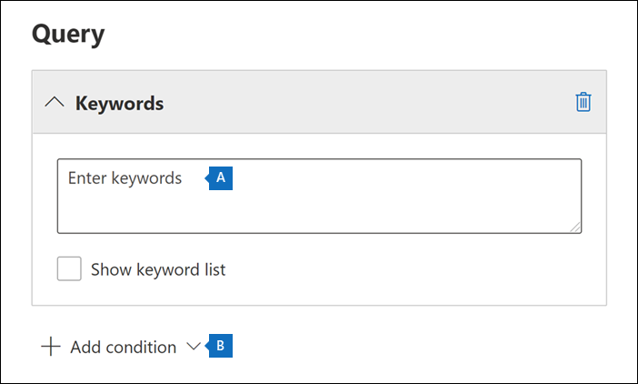

# <a name="create-an-ediscovery-hold"></a>Créer une suspension de cas eDiscovery

Vous pouvez utiliser un cas core eDiscovery pour créer des conservations afin de conserver le contenu qui peut être pertinent pour le cas. Vous pouvez placer en Exchange boîtes aux lettres et OneDrive Entreprise des personnes que vous examinez dans le cas. Vous pouvez également placer en attente les boîtes aux lettres et les sites associés à des groupes Microsoft Teams, Office 365 groupes Yammer web. Lorsque vous placez des emplacements de contenu en conservation, le contenu est conservé jusqu’à ce que vous supprimiez l’emplacement du contenu de la conservation ou jusqu’à ce que vous supprimiez la conservation.

Une fois que vous avez créé une attente eDiscovery, la prise en compte de la attente peut prendre jusqu’à 24 heures.

Lorsque vous créez une conservation, vous avez les options suivantes pour étendue du contenu qui est conservé dans les emplacements de contenu spécifiés :
  
- Créez une attente infinie dans laquelle tout le contenu des emplacements spécifiés est placé en attente. Vous pouvez également créer une mise en attente basée sur une requête dans laquelle seul le contenu des emplacements spécifiés qui correspond à une requête de recherche est mis en attente.

- Spécifiez une plage de dates pour conserver uniquement le contenu qui a été envoyé, reçu ou créé dans cette plage de dates. Vous pouvez également conserver tout le contenu à des emplacements spécifiés, quel que soit le moment où il a été envoyé, reçu ou créé.
  
## <a name="how-to-create-an-ediscovery-hold"></a>Comment créer une attente eDiscovery

Pour créer une attente eDiscovery associée à un cas core eDiscovery :
  
1. Go to [https://compliance.microsoft.com](https://compliance.microsoft.com) and sign in using the credentials for user account that has been assigned the appropriate eDiscovery permissions.

2. Dans le volet de navigation gauche du Centre de conformité Microsoft 365, cliquez sur Afficher **tout,** puis sur **eDiscovery > Core**.

3. Dans la page **Core eDiscovery,** cliquez sur le nom du cas où vous souhaitez créer la attente.

4. Dans la page **d’accueil** du cas, cliquez sur **l’onglet** Conserver.
  
5. Dans la page **Mettre en** attente, cliquez sur **Créer.**

6. Dans la page **Nom de l’Assistant** De votre attente, donnez un nom à la attente et ajoutez une description facultative, puis cliquez sur **Suivant**. Le nom de la conservation doit être unique dans toute votre organisation.

7. Dans la page **Choisir des emplacements** de l’Assistant, choisissez les emplacements de contenu que vous souhaitez placer en attente. Vous pouvez mettre en attente des boîtes aux lettres, des sites et des dossiers publics.

    
  
   1. **Boîtes aux lettres Exchange** : définissez le bouton bascule sur **Activé**, puis cliquez sur **Sélectionner des utilisateurs, des groupes ou des équipes** pour spécifier les boîtes aux lettres à mettre en attente. Utilisez la zone de recherche pour rechercher des boîtes aux lettres utilisateur et des groupes de distribution (pour placer les boîtes aux lettres des membres du groupe en conservation) à placer en conservation. Vous pouvez également placer en attente la boîte aux lettres associée pour une équipe Microsoft, un groupe Office 365 et un groupe Yammer groupe. Pour plus d’informations sur les données d’application qui sont conservées lorsqu’une boîte aux lettres est placée en conservation, voir Contenu stocké dans les boîtes aux lettres pour [eDiscovery](what-is-stored-in-exo-mailbox.md).

   2. **Sites SharePoint** : définissez le bouton bascule sur **Activé** puis cliquez sur **Sélectionner des sites** pour spécifier les sites SharePoint et les comptes OneDrive à conserver. Saisissez l’URL de chaque site à placer en conservation. Vous pouvez également ajouter l’URL du site SharePoint pour une équipe Microsoft, un groupe Office 365 ou un groupe Yammer microsoft.
  
   3. **Dossiers publics Exchange** : définissez la bascule sur **Activé** pour mettre tous les dossiers publics en attente dans votre organisation Exchange Online. Vous ne pouvez pas choisir des dossiers publics spécifiques à mettre en attente. Laissez le bouton bascule désactivé si vous ne voulez pas maintenir les dossiers publics en attente.

   > [!NOTE]
   > Vous devez ajouter au moins un emplacement de contenu à la attente. Dans le cas contraire, les statistiques de la hold-in eDiscovery indiquent qu’aucun des éléments n’est en attente.

8. Lorsque vous avez terminé d’ajouter des emplacements à la attente, cliquez sur **Suivant**.

9. Pour créer une attente basée sur une requête à l’aide de mots clés ou de conditions, complétez les étapes suivantes. Pour conserver tout le contenu dans les emplacements de contenu spécifiés, cliquez sur **Suivant**.

    
  
    1. Dans la zone sous **Mots clés,** tapez une requête pour conserver uniquement le contenu qui correspond aux critères de requête. Vous pouvez spécifier des mots clés, des propriétés de message électronique ou des propriétés de site, telles que des noms de fichiers. Vous pouvez également utiliser des requêtes plus complexes qui utilisent un opérateur booléen, tel que **AND**, **OR** ou **NOT**.

    2. Cliquez **sur Ajouter une condition** pour ajouter une ou plusieurs conditions afin de restreindre la requête pour la attente. Chaque condition ajoute une clause à la requête de recherche KQL qui est créée et qui s’exécute lorsque vous créez la requête de recherche KQL. Par exemple, vous pouvez spécifier une plage de dates afin que les documents électroniques ou de site créés dans la plage de dates soient conservés. Une condition est connectée logiquement à la requête  de mot clé (spécifiée dans la zone Mots clés) et à d’autres conditions par l’opérateur **AND.** Cela signifie que les éléments doivent satisfaire la requête de mot clé et la condition à conserver.

    Pour plus d’informations sur la création d’une requête de recherche et l’utilisation de conditions, voir Requêtes par mot clé et conditions de recherche [pour eDiscovery.](keyword-queries-and-search-conditions.md)

10. Après avoir configuré une attente basée sur une requête, cliquez sur **Suivant**.

11. Examinez vos paramètres (et modifiez-les si nécessaire), puis cliquez sur **Envoyer.**

## <a name="query-based-holds-placed-on-sites"></a>Des mises en garde basées sur des requêtes sont placées sur des sites

Gardez les points suivants à l’esprit lorsque vous placez une attente eDiscovery basée sur une requête sur les documents situés dans SharePoint sites :

- Une conservation basée sur une requête conserve initialement tous les documents d’un site pendant une courte période après leur suppression. Cela signifie que lorsqu’un document est supprimé, il est déplacé vers la bibliothèque de conservation et de préservation des documents même s’il ne correspond pas aux critères de la conservation basée sur une requête. Toutefois, les documents supprimés qui ne correspondent pas à une conservation basée sur une requête sont supprimés par un travail du timer qui traite la bibliothèque de conservation et de préservation. Le travail du timer s’exécute régulièrement et compare tous les documents de la bibliothèque de conservation et de préservation des documents à vos conservations eDiscovery basées sur des requêtes (et à d’autres types de conservations et stratégies de rétention). Le travail du temps supprime les documents qui ne correspondent pas à une conservation basée sur une requête et conserve les documents qui le font.

- Les conservations basées sur des requêtes ne doivent pas être utilisées pour effectuer une conservation ciblée, comme la conservation de documents dans un dossier ou un site spécifique ou à l’aide d’autres critères de conservation en fonction de l’emplacement. Cela peut avoir des résultats inattendus. Nous vous recommandons d’utiliser des critères de conservation non basés sur un emplacement, tels que des mots clés, des plages de dates ou d’autres propriétés de document, pour conserver les documents du site.

## <a name="ediscovery-hold-statistics"></a>Statistiques de la hold-in eDiscovery

Une fois que vous avez créé une attente eDiscovery, les informations sur la nouvelle attente s’affichent sur la page de présentation de la demande d’attente sélectionnée. Ces informations incluent le nombre de boîtes aux lettres et de sites en attente, ainsi que les statistiques sur le contenu placé en attente, telles que le nombre total et la taille des éléments placés en attente et la dernière fois que les statistiques de mise en attente ont été calculées. Ces statistiques de conservation vous aident à identifier la quantité de contenu liée au cas en cours de conservation.
  

  
Gardez les points suivants à l’esprit concernant les statistiques de la découverte électronique :
  
- Le nombre total d’éléments en attente indique le nombre d’éléments de toutes les sources de contenu placés en attente. Si vous avez créé une attente basée sur une requête, cette statistique indique le nombre d’éléments qui correspondent à la requête.

- Le nombre d’éléments en attente inclut également les éléments nonndex trouvés dans les emplacements de contenu. Si vous créez une mise en attente basée sur une requête, tous les éléments nonndex situés dans les emplacements de contenu sont placés en attente. Cela inclut les éléments nonndex qui ne correspondent pas aux critères de recherche d’une attente basée sur une requête et les éléments nonndex qui peuvent se trouver en dehors d’une condition de plage de dates. Cela est différent de ce qui se produit lorsque vous exécutez une recherche, dans laquelle les éléments nonndex qui ne correspondent pas à la requête de recherche ou qui sont exclus par une condition de plage de dates ne sont pas inclus dans les résultats de la recherche. Pour plus d’informations sur les éléments non indexés, voir [Éléments partiellement indexés.](partially-indexed-items-in-content-search.md)

- Vous pouvez obtenir les dernières  statistiques de mise en attente en cliquant sur Mettre à jour les statistiques pour réexécuter une estimation de la recherche qui calcule le nombre actuel d’éléments en attente.

- Il est normal que le nombre d’éléments en attente augmente au fil du temps, car les utilisateurs dont la boîte aux lettres ou le site est en attente envoient ou reçoivent généralement de nouveaux messages électroniques et créent des documents dans SharePoint et OneDrive.

- Si une boîte aux lettres, un site SharePoint ou un compte OneDrive Exchange est déplacé vers une autre région dans un environnement multigéogé, les statistiques de ce site ne seront pas incluses dans les statistiques de la OneDrive. Toutefois, le contenu de ces emplacements sera conservé. En outre, si une boîte aux lettres ou un site est déplacé vers une autre région, l’adresse SMTP ou l’URL affichée dans la mise en attente ne sera pas automatiquement mise à jour. Vous devez modifier la mise en attente et mettre à jour l’URL ou l’adresse SMTP afin que les emplacements de contenu soient de nouveau inclus dans les statistiques de la mise en attente.

## <a name="search-locations-on-ediscovery-hold"></a>Emplacements de recherche en attente eDiscovery

Lorsque vous [recherchez](search-for-content-in-core-ediscovery.md) du contenu dans un cas core eDiscovery, vous pouvez rapidement configurer la recherche pour rechercher uniquement les emplacements de contenu qui ont été placés en attente associée au cas.

Sélectionnez **l’option Emplacements en attente** pour rechercher tous les emplacements de contenu qui ont été placés en attente. Si le cas contient plusieurs holds eDiscovery, les emplacements de contenu de toutes les retenues sont recherchés lorsque vous sélectionnez cette option. En outre, si un emplacement de contenu a été placé en attente basée sur une requête, seuls les éléments qui correspondent à la requête de mise en attente seront recherchés lorsque vous exécuterez la recherche. En d’autres termes, seul le contenu qui correspond aux critères de recherche et aux critères de recherche est renvoyé avec les résultats de la recherche. Par exemple, si un utilisateur a été mis en attente de cas basé sur une requête qui conserve les éléments qui ont été envoyés ou créés avant une date spécifique, seuls ces éléments sont recherchés. Pour ce faire, connectez la requête de mise en attente et la requête de recherche par un **opérateur AND.**

Voici d’autres éléments à garder à l’esprit lors de la recherche d’emplacements en attente eDiscovery :

- Si un emplacement de contenu fait partie de plusieurs attentes dans le même cas, les requêtes de attente sont combinées par des opérateurs **OR** lorsque vous recherchez cet emplacement de contenu à l’aide de l’option de contenu tout le cas. De même, si un emplacement de contenu fait partie de deux attentes différentes, où l’un est basé sur une requête et l’autre est une attente infinie (où tout le contenu est mis en attente), tout le contenu est recherché en raison de la mise en attente infinie.

- Si une recherche est configurée pour rechercher des emplacements en attente, puis que vous modifiez une mise en attente eDiscovery dans le cas (en ajoutant ou supprimant un emplacement ou en modifiant une requête de mise en attente), la configuration de recherche est mise à jour avec ces modifications. Toutefois, vous devez réexécuter la recherche une fois la mise en attente modifiée pour mettre à jour les résultats de la recherche.

- Si plusieurs mises en attente eDiscovery sont placées sur un seul emplacement dans un cas eDiscovery et que vous choisissez de rechercher des emplacements en attente, le nombre maximal de mots clés pour cette requête de recherche est de 500. En raison du fait que la recherche combine toutes les requêtes basées sur des requêtes à l’aide de **l’opérateur OR.** S’il existe plus de 500 mots clés dans les requêtes de recherche et les requêtes de recherche combinées, tout le contenu de la boîte aux lettres est recherché, et pas seulement le contenu qui correspond aux cas basés sur une requête.

- Si l’état d’une attente eDiscovery est **On (Pending),** vous pouvez toujours rechercher les emplacements en attente pendant que la attente est allumée.

## <a name="preserve-content-in-microsoft-teams"></a>Conserver le contenu dans Microsoft Teams

Les conversations qui font partie d’un canal Microsoft Teams sont stockées dans la boîte aux lettres associée à Microsoft Team. De même, les fichiers partagés par les membres d’une équipe dans un canal sont stockés sur le site SharePoint de l’équipe. Par conséquent, vous devez placer la boîte aux lettres d’équipe et SharePoint site en conservation eDiscovery pour conserver les conversations et les fichiers dans un canal.

En outre, les conversations qui font partie de la liste de conversation dans Teams (appelées conversations *1:1* ou conversations de groupe *1:N)* sont stockées dans les boîtes aux lettres des utilisateurs qui participent à la conversation. Les fichiers que les utilisateurs partagent dans les conversations sont stockés dans le compte OneDrive de l’utilisateur qui partage le fichier. Par conséquent, vous devez ajouter les boîtes aux lettres utilisateur et les comptes OneDrive à une conservation eDiscovery pour conserver les conversations et les fichiers dans la liste de conversation. Il est bon de mettre en attente les boîtes aux lettres des membres d’une équipe Microsoft en plus de placer la boîte aux lettres et le site d’équipe en attente.

> [!NOTE]
> Si votre organisation dispose d’un déploiement hybride Exchange (ou si votre organisation synchronise une organisation Exchange sur site avec Office 365) et a activé Microsoft Teams, les utilisateurs locaux peuvent utiliser l’application de conversation Teams et participer à des conversations 1:1 et des conversations de groupe 1:N. Ces conversations sont stockées dans un stockage en nuage associé à un utilisateur local. Si un utilisateur local est placé en conservation eDiscovery, le contenu Teams conversation dans le stockage en nuage est conservé. Pour plus d'informations, voir [Recherche de données de conversation des équipes pour les utilisateurs sur site](search-cloud-based-mailboxes-for-on-premises-users.md).

Pour plus d’informations sur la conservation Teams contenu, voir Placer un utilisateur Microsoft Teams ou une équipe [en conservation légale.](/MicrosoftTeams/legal-hold)

### <a name="preserve-card-content"></a>Conserver le contenu de la carte

De même, le contenu de carte généré par les applications dans les canaux Teams, les conversations 1:1 et les conversations de groupe 1:N est stocké dans les boîtes aux lettres et est conservé lorsqu’une boîte aux lettres est placée en conservation eDiscovery. Une *carte* est un conteneur de l'assurance-chômage pour de petits morceaux de contenu. Les cartes peuvent avoir plusieurs propriétés et pièces jointes, et peuvent inclure des boutons qui déclenchent des actions de carte. Pour plus d’informations, voir [Cartes](/microsoftteams/platform/task-modules-and-cards/what-are-cards). Comme pour le contenu des autres Teams, le lieu de stockage du contenu de la carte est basé sur l'endroit où la carte a été utilisée. Le contenu des cartes utilisées dans un canal Teams est stocké dans la boîte aux lettres du groupe Teams. Le contenu des cartes pour les chats 1:1 et 1xN est stocké dans les boîtes aux lettres des participants au conversation.

### <a name="preserve-meeting-and-call-information"></a>Conserver les informations de réunion et d’appel

Les informations récapitulatifs pour les réunions et les appels dans un canal Teams sont également stockées dans les boîtes aux lettres des utilisateurs qui ont appelé la réunion ou l’appel. Ce contenu est également conservé lorsqu’une conservation eDiscovery est placée sur des boîtes aux lettres utilisateur.

### <a name="preserve-content-in-private-channels"></a>Conserver le contenu dans les canaux privés

À compter de février 2020, nous avons également désactivé la possibilité de conserver le contenu dans les canaux privés. Étant donné que les conversations de canal privé sont stockées dans les boîtes aux lettres des participants à la conversation, le fait de placer une boîte aux lettres utilisateur en conservation eDiscovery conserve les conversations de canal privé. En outre, si une boîte aux lettres d’utilisateur a été placée en attente eDiscovery avant février 2020, la mise en attente s’applique désormais automatiquement aux messages de canal privé stockés dans cette boîte aux lettres. La conservation des fichiers partagés dans des canaux privés est également prise en charge.

### <a name="preserve-wiki-content"></a>Conserver le contenu wiki

Chaque canal d’équipe ou d’équipe contient également un Wiki pour la prise de notes et la collaboration. Le contenu wiki est automatiquement enregistré dans un fichier au format .mht. Ce fichier est stocké dans la bibliothèque de documents wiki Teams sur le site SharePoint de l’équipe. Vous pouvez conserver le contenu wiki en ajoutant le site SharePoint de l’équipe à une conservation eDiscovery.

> [!NOTE]
> La possibilité de conserver le contenu Wiki pour un canal d’équipe ou d’équipe (lorsque vous placez le site SharePoint de l’équipe en conservation) a été publiée le 22 juin 2017. Si un site d’équipe est en attente, le contenu wiki est conservé à partir de cette date. Toutefois, si un site d’équipe est en attente et que le contenu wiki a été supprimé avant le 22 juin 2017, le contenu wiki n’a pas été conservé.

### <a name="office-365-groups"></a>Groupes Office 365

Teams est construit sur Office 365 groupes. Par conséquent, placer Office 365 groupes en attente eDiscovery est similaire à placer Teams contenu en attente.

Gardez les points suivants à l’esprit lorsque vous placez les groupes Teams et Office 365 en attente eDiscovery :

- Comme indiqué précédemment, pour placer le contenu situé dans les groupes Teams et Office 365 en attente, vous devez spécifier la boîte aux lettres et le site SharePoint associés à un groupe ou à une équipe.

- Exécutez **l’cmdlet Get-UnifiedGroup** [dans Exchange Online PowerShell](/powershell/exchange/connect-to-exchange-online-powershell) pour afficher les propriétés Teams et Office 365 groupes. C’est un bon moyen d’obtenir l’URL du site associé à une équipe ou un Office 365 groupe. Par exemple, la commande suivante affiche les propriétés sélectionnées d’un groupe Office365 nommé Senior Leadership Team :

    ```text
    Get-UnifiedGroup "Senior Leadership Team" | FL DisplayName,Alias,PrimarySmtpAddress,SharePointSiteUrl

    DisplayName            : Senior Leadership Team
    Alias                  : seniorleadershipteam
    PrimarySmtpAddress     : seniorleadershipteam@contoso.onmicrosoft.com
    SharePointSiteUrl      : https://contoso.sharepoint.com/sites/seniorleadershipteam
    ```

    > [!NOTE]
    > Pour exécuter l'applet de commande **Get-UnifiedGroup**, vous devez avoir le rôle de destinataires en affichage seul dans Exchange Online ou être membre d’un groupe de rôles affecté du rôle de destinataires en affichage seul. 
  
- Lorsque la recherche est sur la boîte aux lettres d’un utilisateur, aucune recherche n’est Office 365 groupe d’équipe ou de groupe dont l’utilisateur est membre. De même, lorsque vous placez une équipe ou un groupe Office 365 en attente eDiscovery, seules la boîte aux lettres de groupe et le site de groupe sont mis en attente. Les boîtes aux lettres et OneDrive Entreprise sites de membres du groupe ne sont pas mis en attente, sauf si vous les ajoutez explicitement à la mise en attente eDiscovery. Par exemple, si vous devez placer un groupe d’équipe ou de groupe Office 365 en attente pour une raison juridique, envisagez d’ajouter les boîtes aux lettres et les comptes OneDrive des membres de l’équipe ou du groupe en même temps.

- Pour obtenir la liste des membres d’une équipe ou d’un groupe Office 365, vous pouvez afficher les propriétés sur la **page** Groupes dans le Centre d’administration Microsoft 365. Vous pouvez également exécuter la commande suivante dans Exchange Online PowerShell :

    ```powershell
    Get-UnifiedGroupLinks <group or team name> -LinkType Members | FL DisplayName,PrimarySmtpAddress
    ```

    > [!NOTE]
    > Pour exécuter l'applet de commande **Get-UnifiedGroupLinks**, vous devez avoir le rôle de destinataires en affichage seul dans Exchange Online ou être membre d’un groupe de rôles affecté du rôle de destinataires en affichage seul.

## <a name="preserve-content-in-onedrive-accounts"></a>Conserver le contenu dans OneDrive comptes

Pour collecter une liste des URL pour les sites OneDrive Entreprise de votre organisation afin de pouvoir les ajouter à une attente ou à une recherche associée à un cas eDiscovery, voir Créer une liste de tous les emplacements [OneDrive](/onedrive/list-onedrive-urls)de votre organisation. Le script de cet article crée un fichier texte qui contient la liste de tous les sites OneDrive de votre organisation. Pour exécuter ce script, vous devez installer et utiliser SharePoint Online Management Shell. N’oubliez pas d’ajouter l’URL du domaine MySite de votre organisation à chaque site OneDrive dans lequel vous souhaitez effectuer une recherche. Il s’agit du domaine où se trouve tout le contenu de votre OneDrive (par exemple,`https://contoso-my.sharepoint.com`). Voici un exemple d’URL pour le site d’un utilisateur OneDrive : `https://contoso-my.sharepoint.com/personal/sarad_contoso_onmicrosoft.com`.

> [!IMPORTANT]
> L’URL du compte d’OneDrive utilisateur inclut son nom d’utilisateur principal (UPN) (par exemple, `https://alpinehouse-my.sharepoint.com/personal/sarad_alpinehouse_onmicrosoft_com` ). Dans les rares cas où l’UPN d’une personne est modifié, son URL OneDrive change également pour incorporer le nouveau nom d’upn. Si le compte OneDrive d’un utilisateur fait partie d’une mise en attente eDiscovery, qu’il est ancien et que son UPN est modifié, vous devez mettre à jour la mise en attente et ajouter la nouvelle URL OneDrive de l’utilisateur et supprimer l’ancienne. Pour plus d’informations, voir [Comment les modifications du nom d’utilisateur principal affectent l’URL OneDrive](/onedrive/upn-changes).

## <a name="removing-content-locations-from-an-ediscovery-hold"></a>Suppression d’emplacements de contenu d’une attente eDiscovery

Une fois qu’une boîte SharePoint, un site ou un compte OneDrive est supprimé d’une boîte aux lettres, d’un site ou d’un compte de découverte électronique, un délai *est* appliqué. Cela signifie que la suppression réelle de la attente est retardée de 30 jours pour empêcher la suppression définitive (purgée) des données d’un emplacement de contenu. Cela permet aux administrateurs de rechercher ou de récupérer du contenu qui sera purgé après la suppression d’une attente eDiscovery. Les détails du fonctionnement du délai d’attente pour les boîtes aux lettres et les sites sont différents.

- **Boîtes aux lettres :** Une mise en attente différée est placée sur une boîte aux lettres la prochaine fois que l’Assistant Dossier géré traite la boîte aux lettres et détecte qu’une mise en attente eDiscovery a été supprimée. Plus précisément, un délai d’attente est appliqué à une boîte aux lettres lorsque l’Assistant Dossier géré définit l’une des propriétés de boîte aux lettres suivantes sur **True**:

   - **DelayHoldApplied :** Cette propriété s’applique au contenu de messagerie électronique (généré par des personnes utilisant Outlook et Outlook sur le web) stocké dans la boîte aux lettres d’un utilisateur.

   - **DelayReleaseHoldApplied :** Cette propriété s’applique au contenu en nuage (généré par des applications non Outlook telles que Microsoft Teams, Microsoft Forms et Microsoft Yammer) stocké dans la boîte aux lettres d’un utilisateur. Les données cloud générées par une application Microsoft sont généralement stockées dans un dossier masqué dans la boîte aux lettres d’un utilisateur.

   Lorsqu’une mise en attente différée est placée sur la boîte aux lettres (lorsque l’une des propriétés précédentes est définie sur **True),** la boîte aux lettres est toujours considérée comme étant en attente pour une durée illimitée, comme si la boîte aux lettres était en attente pour litige. Au bout de 30 jours, le délai d’attente expire et Microsoft 365 tente automatiquement de supprimer le délai d’attente (en fixant la propriété DelayHoldApplied ou DelayReleaseHoldApplied sur **False)** afin que la mise en attente soit supprimée. Une fois que l’une de ces propriétés est définie sur **False,** les éléments correspondants marqués pour suppression sont purgés la prochaine fois que la boîte aux lettres est traitée par l’Assistant Dossier géré.

   Pour des informations supplémentaires, consultez [Gestion des boîtes aux lettres avec période de grâce](identify-a-hold-on-an-exchange-online-mailbox.md#managing-mailboxes-on-delay-hold).

- **SharePoint sites OneDrive sites :** Tout contenu SharePoint ou OneDrive conservé dans la bibliothèque de conservation et de préservation des données n’est pas supprimé pendant la période de conservation différée de 30 jours après la suppression d’un site d’une conservation eDiscovery. Cela est similaire à ce qui se produit lorsqu’un site est libéré d’une stratégie de rétention. En outre, vous ne pouvez pas supprimer manuellement ce contenu dans la bibliothèque de conservation et de préservation des données pendant la période de conservation différée de 30 jours. 

   Pour plus d’informations, voir [Publication d’une stratégie pour la rétention.](retention.md#releasing-a-policy-for-retention)

Un délai d’attente est également appliqué aux emplacements de contenu en attente lorsque vous fermez un cas core eDiscovery, car les attentes sont désactivées lorsqu’un cas est fermé. Pour plus d’informations sur la fermeture d’un cas, voir Fermer, rouvrir et supprimer un cas [core eDiscovery.](close-reopen-delete-core-ediscovery-cases.md)

## <a name="ediscovery-hold-limits"></a>Limites de la durée de la découverte électronique

Le tableau suivant répertorie les limites pour les cas eDiscovery et les cas en attente.

  | Description de la limite | Limite |
  |:-----|:-----|
  |Nombre maximal de cas pour une organisation.  <br/> |Sans limite  <br/> |
  |Nombre maximal de réserves eDiscovery pour une organisation.  <br/> |10 000  <br/> |
  |Nombre maximal de boîtes aux lettres dans une seule boîte aux lettres eDiscovery. Cette limite inclut le total combiné de boîtes aux lettres utilisateur et les boîtes aux lettres associées aux groupes Microsoft 365, Microsoft Teams et Yammer groupes.  <br/> |1 000  <br/> |
  |Nombre maximal de sites dans une seule attente eDiscovery. Cette limite inclut le total combiné des sites OneDrive Entreprise, des sites SharePoint et des sites associés aux groupes Microsoft 365, Microsoft Teams et Yammer groupes.  <br/> |100  <br/> |
  |Nombre maximal de cas affichés sur la page d’accueil eDiscovery et nombre maximal d’éléments affichés dans les onglets En cours d’affichage, Recherches et Exportation dans un cas. <sup>1</sup> |1 000|
  |||

   > [!NOTE]
   > <sup>1 Pour</sup> afficher une liste de plus de 1 000 cas, de mise en attente, de recherche ou d’exportation, vous pouvez utiliser l’cmdlet PowerShell Office 365 Security & Compliance :
   >
   > - [Get-ComplianceCase](/powershell/module/exchange/get-compliancecase)
   > - [Get-CaseHoldPolicy](/powershell/module/exchange/get-caseholdpolicy)
   > - [Get-ComplianceSearch](/powershell/module/exchange/get-compliancesearch)
   > - [Get-ComplianceSearchAction](/powershell/module/exchange/get-compliancesearchaction)
