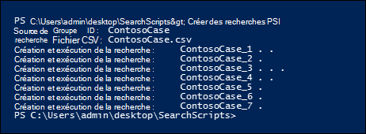

# <a name="create-report-on-and-delete-multiple-content-searches"></a>Créer, générer des rapports et supprimer plusieurs recherches de contenu

 Créer et signaler rapidement des recherches de découverte est souvent une étape importante dans eDiscovery et les enquêtes lorsque vous essayez d’en savoir plus sur les données sous-jacentes, ainsi que sur la richesse et la qualité de vos recherches. Pour vous aider à effectuer cette opération, le Centre de sécurité & conformité PowerShell propose un ensemble d’cmdlets pour automatiser des tâches de recherche de contenu chronophages. Ces scripts offrent un moyen rapide et facile de créer un certain nombre de recherches, puis d’exécuter des rapports sur les résultats de recherche estimés qui peuvent vous aider à déterminer la quantité de données en question. Vous pouvez également utiliser les scripts pour créer différentes versions de recherches afin de comparer les résultats que chacun produit. Ces scripts peuvent vous aider à identifier et à étiqueter rapidement et efficacement vos données.

## <a name="before-you-create-a-content-search"></a>Avant de créer une recherche de contenu

- Vous devez être membre du groupe de rôles Gestionnaire eDiscovery dans le Centre de conformité Microsoft 365 pour exécuter les scripts décrits dans cette rubrique.

- Pour collecter une liste des URL pour les sites OneDrive Entreprise de votre organisation que vous pouvez ajouter au fichier CSV à l’étape 1, voir Créer une liste de tous les emplacements [OneDrive](/onedrive/list-onedrive-urls)de votre organisation.

- N’oubliez pas d’enregistrer tous les fichiers que vous créez dans cette rubrique dans le même dossier. Cela facilitera l’exécuter.

- Les scripts incluent une gestion minimale des erreurs. Leur objectif principal est de créer, créer des rapports et supprimer rapidement plusieurs recherches de contenu.

- Les exemples de script fournis dans cette rubrique ne sont pris en charge dans aucun programme de support ou service standard de Microsoft. Les exemples de scripts sont fournis en l’état, sans garantie d’aucune sorte. Microsoft exclut toute garantie implicite, y compris, sans limitation, les garanties implicites de qualité marchande ou d’adéquation à un usage particulier. Vous assumez tous les risques liés à l’utilisation ou à l’exécution des exemples de scripts et de la documentation. En aucun cas, Microsoft, ses auteurs ou toute personne impliquée dans la création, la production ou la livraison des scripts ne sont responsables de dommages quelconques (y compris, sans limitation, pertes de bénéfices, interruption d’activité, perte d’informations commerciales ou toute autre perte pécuniaire) découlant de l’utilisation ou de l’impossibilité d’utiliser les exemples de scripts ou la documentation, même si Microsoft a été informé de la possibilité de tels dommages.

## <a name="step-1-create-a-csv-file-that-contains-information-about-the-searches-you-want-to-run"></a>Étape 1 : Créer un fichier CSV qui contient des informations sur les recherches que vous souhaitez exécuter

Le fichier de valeurs séparées par des virgules (CSV) que vous créez à cette étape contient une ligne pour chaque utilisateur qui souhaite effectuer une recherche. Vous pouvez effectuer une recherche dans la boîte aux lettres Exchange Online de l’utilisateur (qui inclut la boîte aux lettres d’archivage, si elle est activée) et son site OneDrive Entreprise site. Vous pouvez également rechercher uniquement la boîte aux lettres ou le site OneDrive Entreprise site. Vous pouvez également effectuer des recherches sur n’importe quel site de votre SharePoint Online. Le script que vous exécutez à l’étape 3 crée une recherche distincte pour chaque ligne du fichier CSV.

1. Copiez et collez le texte suivant dans un fichier .txt'aide du Bloc-notes. Enregistrez ce fichier dans un dossier sur votre ordinateur local. Vous enregistrerez également les autres scripts dans ce dossier.

   ```text
   ExchangeLocation,SharePointLocation,ContentMatchQuery,StartDate,EndDate
   sarad@contoso.onmicrosoft.com,https://contoso-my.sharepoint.com/personal/sarad_contoso_onmicrosoft_com,(lawsuit OR legal),1/1/2000,12/31/2005
   sarad@contoso.onmicrosoft.com,https://contoso-my.sharepoint.com/personal/sarad_contoso_onmicrosoft_com,(lawsuit OR legal),1/1/2006,12/31/2010
   sarad@contoso.onmicrosoft.com,https://contoso-my.sharepoint.com/personal/sarad_contoso_onmicrosoft_com,(lawsuit OR legal),1/1/2011,3/21/2016
   ,https://contoso.sharepoint.com/sites/contoso,,,3/21/2016
   ,https://contoso-my.sharepoint.com/personal/davidl_contoso_onmicrosoft_com,,1/1/2015,
   ,https://contoso-my.sharepoint.com/personal/janets_contoso_onmicrosoft_com,,1/1/2015,
   ```

   La première ligne, ou ligne d’en-tête, du fichier répertorie les paramètres qui seront utilisés par la cmdlet **New-ComplianceSearch** (dans le script de l’étape 3) pour créer une recherche de contenu. Les noms des paramètres sont séparés par des virgules. Assurez-vous qu’il n’y a pas d’espaces dans la ligne d’en-tête. Chaque ligne sous la ligne d’en-tête représente les valeurs de paramètre pour chaque recherche. N’oubliez pas de remplacer les données d’espace réservé dans le fichier CSV par vos données réelles.

2. Ouvrez le .txt dans Excel, puis utilisez les informations du tableau suivant pour modifier le fichier avec des informations pour chaque recherche.

   ****

   |Paramètre|Description|
   |---|---|
   |`ExchangeLocation`|Adresse SMTP de la boîte aux lettres de l’utilisateur.|
   |`SharePointLocation`|URL du site OneDrive Entreprise de l’utilisateur ou URL de n’importe quel site de votre organisation. Pour l’URL OneDrive Entreprise sites web, utilisez ce format : ` https://<your organization>-my.sharepoint.com/personal/<user alias>_<your organization>_onmicrosoft_com ` . Par exemple : `https://contoso-my.sharepoint.com/personal/sarad_contoso_onmicrosoft_com`.|
   |`ContentMatchQuery`|Requête de recherche pour la recherche. Pour plus d’informations sur la création d’une requête de recherche, voir Requêtes par mot clé et conditions de recherche [pour la recherche de contenu.](keyword-queries-and-search-conditions.md)|
   |`StartDate`|Pour le courrier électronique, date à laquelle un message a été reçu par un destinataire ou envoyé par l’expéditeur. Pour les documents SharePoint sites OneDrive Entreprise sites, date de la dernière modification d’un document ou après celui-là.|
   |`EndDate`|Pour le courrier électronique, date le ou avant qu’un message a été envoyé par un utilisateur. Pour les documents SharePoint ou OneDrive Entreprise sites web, la date à laquelle un document a été modifié pour la dernière fois ou avant celui-là.|
   |

3. Enregistrez Excel fichier CSV dans un dossier de votre ordinateur local. Le script que vous créez à l’étape 3 utilisera les informations de ce fichier CSV pour créer les recherches.

## <a name="step-2-connect-to-security--compliance-center-powershell"></a>Étape 2 : connectez-vous au Centre de sécurité et conformité PowerShell

L’étape suivante consiste à se connecter au Centre de sécurité et conformité PowerShell de votre organisation. Pour consulter des instructions détaillées, voir [Se connecter au Centre de sécurité et conformité PowerShell](/powershell/exchange/connect-to-scc-powershell).

## <a name="step-3-run-the-script-to-create-and-start-the-searches"></a>Étape 3 : Exécuter le script pour créer et démarrer les recherches

Le script de cette étape crée une recherche de contenu distincte pour chaque ligne du fichier CSV que vous avez créé à l’étape 1. Lorsque vous exécutez ce script, vous êtes invité à prendre deux valeurs :

- **ID de groupe de** recherche : ce nom permet d’organiser facilement les recherches créées à partir du fichier CSV. Chaque recherche créée est nommée avec l’ID de groupe de recherche, puis un numéro est ensuite indiqué au nom de la recherche. Par exemple, si vous entrez **ContosoCase** pour l’ID de groupe de recherche, les recherches sont nommées **ContosoCase_1,** **ContosoCase_2,** **ContosoCase_3,** etc. Notez que le nom que vous tapez est sensible à la cas. Lorsque vous utilisez l’ID de groupe de recherche aux étapes 4 et 5, vous devez utiliser le même cas que lors de sa création.

- **Fichier CSV** : nom du fichier CSV que vous avez créé à l’étape 1. N’oubliez pas d’inclure l’utilisation du nom de fichier complet, d’inclure l’extension .csv fichier complet ; par exemple,  `ContosoCase.csv` .

Pour exécuter le script :

1. Enregistrez le texte suivant dans un fichier Windows PowerShell script à l’aide d’un suffixe de nom de fichier .ps1 ; par exemple, `CreateSearches.ps1` . Enregistrez le fichier dans le dossier où vous avez enregistré les autres fichiers.

   ```Powershell
   # Get the Search Group ID and the location of the CSV input file
   $searchGroup = Read-Host 'Search Group ID'
   $csvFile = Read-Host 'Source CSV file'

   # Do a quick check to make sure our group name will not collide with other searches
   $searchCounter = 1
   import-csv $csvFile |
     ForEach-Object{

    $searchName = $searchGroup +'_' + $searchCounter
    $search = Get-ComplianceSearch $searchName -EA SilentlyContinue
    if ($search)
    {
       Write-Error "The Search Group ID conflicts with existing searches.  Please choose a search group name and restart the script."
       return
    }
    $searchCounter++
   }

   $searchCounter = 1
   import-csv $csvFile |
     ForEach-Object{

    # Create the query
    $query = $_.ContentMatchQuery
    if(($_.StartDate -or $_.EndDate))
    {
          # Add the appropriate date restrictions.  NOTE: Using the Date condition property here because it works across Exchange, SharePoint, and OneDrive for Business.
          # For Exchange, the Date condition property maps to the Sent and Received dates; for SharePoint and OneDrive for Business, it maps to Created and Modified dates.
          if($query)
          {
              $query += " AND"
          }
          $query += " ("
          if($_.StartDate)
          {
              $query += "Date >= " + $_.StartDate
          }
          if($_.EndDate)
          {
              if($_.StartDate)
              {
                  $query += " AND "
              }
              $query += "Date <= " + $_.EndDate
          }
          $query += ")"
    }

     # -ExchangeLocation can't be set to an empty string, set to null if there's no location.
     $exchangeLocation = $null
     if ( $_.ExchangeLocation)
     {
           $exchangeLocation = $_.ExchangeLocation
     }

    # Create and run the search
    $searchName = $searchGroup +'_' + $searchCounter
    Write-Host "Creating and running search: " $searchName -NoNewline
    $search = New-ComplianceSearch -Name $searchName -ExchangeLocation $exchangeLocation -SharePointLocation $_.SharePointLocation -ContentMatchQuery $query

    # Start and wait for each search to complete
    Start-ComplianceSearch $search.Name
    while ((Get-ComplianceSearch $search.Name).Status -ne "Completed")
    {
       Write-Host " ." -NoNewline
       Start-Sleep -s 3
    }
    Write-Host ""

    $searchCounter++
   }
   ```

2. Dans Windows PowerShell, allez dans le dossier où vous avez enregistré le script à l’étape précédente, puis exécutez le script . par exemple :

   ```Powershell
   .\CreateSearches.ps1
   ```

3. À **l’invite d’ID de** groupe de recherche, tapez un nom de groupe de recherche, puis appuyez sur **Entrée**; par exemple,  `ContosoCase` . N’oubliez pas que ce nom est sensible à la cas, vous devez donc le taper de la même manière dans les étapes suivantes.

4. À l’invite de fichiers **CSV source,** tapez le nom du fichier CSV, y compris l’extension .csv fichier . par exemple,  `ContosoCase.csv` .

5. Appuyez **sur Entrée** pour poursuivre l’exécution du script.

   Le script affiche la progression de la création et de l’exécution des recherches. Une fois le script terminé, il revient à l’invite.

   

## <a name="step-4-run-the-script-to-report-the-search-estimates"></a>Étape 4 : Exécuter le script pour signaler les estimations de recherche

Après avoir créé les recherches, l’étape suivante consiste à exécuter un script qui affiche un rapport simple du nombre d’accès à la recherche pour chaque recherche créée à l’étape 3. Le rapport inclut également la taille des résultats pour chaque recherche, ainsi que le nombre total d’occurrences et la taille totale de toutes les recherches. Lorsque vous exécutez le script de rapport, vous êtes invité à obtenir l’ID de groupe de recherche et un nom de fichier CSV si vous souhaitez enregistrer le rapport dans un fichier CSV.

1. Enregistrez le texte suivant dans un fichier Windows PowerShell script à l’aide d’un suffixe de nom de fichier .ps1 ; par exemple, `SearchReport.ps1` . Enregistrez le fichier dans le dossier où vous avez enregistré les autres fichiers.

   ```Powershell
   $searchGroup = Read-Host 'Search Group ID'
   $outputFile = Read-Host 'Enter a file name or file path to save the report to a .csv file. Leave blank to only display the report'
   $searches = Get-ComplianceSearch | ?{$_.Name -clike $searchGroup + "_*"}
   $allSearchStats = @()
   foreach ($partialObj in $searches)
   {
      $search = Get-ComplianceSearch $partialObj.Name
      $sizeMB = [System.Math]::Round($search.Size / 1MB, 2)
      $searchStatus = $search.Status
      if($search.Errors)
      {
          $searchStatus = "Failed"
      }elseif($search.NumFailedSources -gt 0)
      {
          $searchStatus = "Failed Sources"
      }
      $searchStats = New-Object PSObject
      Add-Member -InputObject $searchStats -MemberType NoteProperty -Name Name -Value $search.Name
      Add-Member -InputObject $searchStats -MemberType NoteProperty -Name ContentMatchQuery -Value $search.ContentMatchQuery
      Add-Member -InputObject $searchStats -MemberType NoteProperty -Name Status -Value $searchStatus
      Add-Member -InputObject $searchStats -MemberType NoteProperty -Name Items -Value $search.Items
      Add-Member -InputObject $searchStats -MemberType NoteProperty -Name "Size" -Value $search.Size
      Add-Member -InputObject $searchStats -MemberType NoteProperty -Name "Size(MB)" -Value $sizeMB
      $allSearchStats += $searchStats
   }
   # Calculate the totals
   $allItems = ($allSearchStats | Measure-Object Items -Sum).Sum
   # Convert the total size to MB and round to the nearst 100th
   $allSize = ($allSearchStats | Measure-Object 'Size' -Sum).Sum
   $allSizeMB = [System.Math]::Round($allSize  / 1MB, 2)
   # Get the total successful searches and total of all searches
   $allSuccessCount = ($allSearchStats |?{$_.Status -eq "Completed"}).Count
   $allCount = $allSearchStats.Count
   $allStatus = [string]$allSuccessCount + " of " + [string]$allCount
   # Totals Row
   $totalSearchStats = New-Object PSObject
   Add-Member -InputObject $totalSearchStats -MemberType NoteProperty -Name Name -Value "Total"
   Add-Member -InputObject $totalSearchStats -MemberType NoteProperty -Name Status -Value $allStatus
   Add-Member -InputObject $totalSearchStats -MemberType NoteProperty -Name Items -Value $allItems
   Add-Member -InputObject $totalSearchStats -MemberType NoteProperty -Name "Size(MB)" -Value $allSizeMB
   $allSearchStats += $totalSearchStats
   # Just get the columns we're interested in showing
   $allSearchStatsPrime = $allSearchStats | Select-Object Name, Status, Items, "Size(MB)", ContentMatchQuery
   # Print the results to the screen
   $allSearchStatsPrime |ft -AutoSize -Wrap
   # Save the results to a CSV file
   if ($outputFile)
   {
      $allSearchStatsPrime | Export-Csv -Path $outputFile -NoTypeInformation
   }
   ```

2. Dans Windows PowerShell, allez dans le dossier où vous avez enregistré le script à l’étape précédente, puis exécutez le script . par exemple :

   ```Powershell
   .\SearchReport.ps1
   ```

3. À **l’invite d’ID de** groupe de recherche, tapez un nom de groupe de recherche, puis appuyez sur **Entrée**; par  `ContosoCase` exemple. N’oubliez pas que ce nom est sensible à la cas, donc vous devez le taper comme vous l’avez fait lorsque vous avez écrit le script à l’étape 3.

4. À l’invite chemin d’accès du fichier pour enregistrer le rapport dans un fichier **CSV (laissez** vide pour afficher simplement le rapport), tapez un nom de fichier complet (y compris l’extension de fichier .csv) si vous souhaitez enregistrer le rapport dans un fichier CSV. nom du fichier CSV, y compris l’extension .csv fichier. Par exemple, vous pouvez taper pour l’enregistrer dans le répertoire actuel ou pour  `ContosoCaseReport.csv` l’enregistrer dans un autre  `C:\Users\admin\OneDrive for Business\ContosoCase\ContosoCaseReport.csv` dossier. Vous pouvez également laisser l’invite vide pour afficher le rapport, mais pas l’enregistrer dans un fichier.

5. Appuyez sur **Entrée**.

   Le script affiche la progression de la création et de l’exécution des recherches. Une fois le script terminé, le rapport s’affiche.

   

> [!NOTE]
> Si le même site ou boîte aux lettres est spécifié en tant qu’emplacement de contenu dans plusieurs recherches dans un groupe de recherche, l’estimation des résultats totaux dans le rapport (pour le nombre d’éléments et la taille totale) peut inclure des résultats pour les mêmes éléments. Cela est dû au fait que le même message électronique ou document sera compté plusieurs fois s’il correspond à la requête pour différentes recherches dans le groupe de recherche.

## <a name="step-5-run-the-script-to-delete-the-searches"></a>Étape 5 : Exécuter le script pour supprimer les recherches

Étant donné que vous créez peut-être un grand nombre de recherches, ce dernier script facilite simplement la suppression rapide des recherches que vous avez créées à l’étape 3. Comme les autres scripts, celui-ci vous invite également à obtenir l’ID de groupe de recherche. Toutes les recherches avec l’ID de groupe de recherche dans le nom de recherche sont supprimées lorsque vous exécutez ce script.

1. Enregistrez le texte suivant dans un fichier Windows PowerShell script à l’aide d’un suffixe de nom de fichier .ps1 ; par exemple, `DeleteSearches.ps1` . Enregistrez le fichier dans le dossier où vous avez enregistré les autres fichiers.

   ```Powershell
   # Delete all searches in a search group
   $searchGroup = Read-Host 'Search Group ID'
   Get-ComplianceSearch |
      ForEach-Object{
      # If the name matches the search group name pattern (case sensitive), delete the search
      if ($_.Name -cmatch $searchGroup + "_\d+")
      {
          Write-Host "Deleting search: " $_.Name
          Remove-ComplianceSearch $_.Name -Confirm:$false
      }
   }
   ```

2. Dans Windows PowerShell, allez dans le dossier où vous avez enregistré le script à l’étape précédente, puis exécutez le script . par exemple :

   ```Powershell
   .\DeleteSearches.ps1
   ```

3. À **l’invite d’ID** de groupe de recherche, tapez un nom de groupe de recherche pour les recherches à supprimer, puis appuyez sur **Entrée**; par exemple,  `ContosoCase` . N’oubliez pas que ce nom est sensible à la cas, donc vous devez le taper comme vous l’avez fait lorsque vous avez écrit le script à l’étape 3.

   Le script affiche le nom de chaque recherche supprimée.

   
