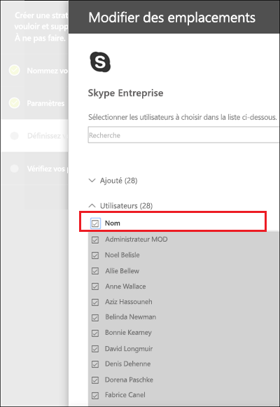
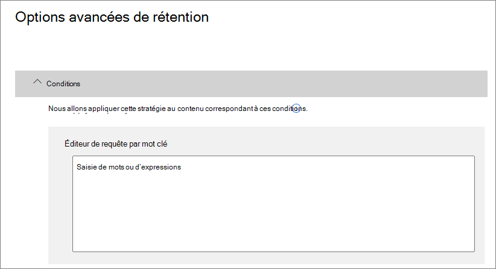

# Créer et configurer des stratégies de rétention

>*[Guide de sécurité et conformité pour les licences Microsoft 365](https://aka.ms/ComplianceSD).*

Utilisez une stratégie de rétention pour décider de manière proactive si vous souhaitez conserver le contenu, supprimer le contenu ou les deux, c’est-à-dire conserver puis supprimer le contenu. 

Si vous souhaitez en savoir plus sur le fonctionnement des stratégies de rétention, consultez la page [Découvrir les stratégies de rétention](retention-policies.md).

## Avant de commencer

Les membres de votre équipe de conformité, appelés à créer et gérer des stratégies de rétention, ont besoin d’autorisations pour accéder au [Centre de conformité Microsoft 365](https://compliance.microsoft.com/). Par défaut, votre administrateur client a accès à cet emplacement et peut accorder aux responsables de la conformité et à d’autres personnes un accès sans leur donner toutes les autorisations d’un administrateur client. Pour ce faire, il est recommandé d’accéder à la page **Autorisations** du [Centre de conformité Microsoft 365](https://compliance.microsoft.com/), de modifier le rôle de l’administrateur dans **Administrateur de conformité** et d’ajouter des membres à ce groupe de rôles. 

Ces autorisations sont nécessaires uniquement pour créer et appliquer une stratégie de rétention. La personne qui configure la stratégie de rétention n’a pas besoin d’accéder au contenu.

## Créer et configurer une stratégie de rétention

1. Dans le [Centre de conformité Microsoft 365](https://compliance.microsoft.com/), sélectionnez **Stratégies** > **Retention**.

2. Sélectionnez **Nouvelle stratégie de rétention** ou modifiez une stratégie de rétention existante.

3. Dans **Paramètres**, spécifiez tout d’abord les options de configuration de rétention ou de suppression du contenu. Vous pouvez créer une stratégie de rétention qui conserve uniquement le contenu sans le supprimer, conserve puis supprime le contenu après une période donnée, ou supprime simplement le contenu après une période donnée. Si vous souhaitez en savoir plus, consultez la rubrique [Paramètres de rétention et de suppression du contenu](#settings-for-retaining-and-deleting-content) sur cette page :
    
    Choisissez ensuite si la stratégie de rétention doit s’appliquer à tout le contenu ou au contenu qui répond à des conditions spécifiques. Si vous souhaitez en savoir plus sur ces paramètres avancés pour la rétention, consultez la rubrique [Paramètres avancés permettant d’identifier le contenu répondant à des conditions spécifiques](#advanced-settings-to-identify-content-that-meets-specific-conditions). 

4. Pour la page **Choisir les emplacements**, indiquez si la stratégie de rétention doit s’appliquer à tous les emplacements pris en charge dans votre organisation, ou si vous souhaitez spécifier les emplacements. Si vous choisissez des emplacements spécifiques, vous pouvez également spécifier des inclusions et des exclusions. 
    
    Pour Microsoft Teams : 
    - Vous devez sélectionner l’option pour choisir des emplacements spécifiques si vous souhaitez supprimer ou conserver les messages du canal Teams ou les conversations d’équipe. Lorsque vous sélectionnez l’une de ces options comme emplacements, les autres emplacements sont automatiquement exclus car une stratégie de rétention qui inclut ces données Teams ne peut pas inclure d’autres emplacements. 
    - Notez que pour les **messages du canal Teams**, les messages provenant des canaux standard sont inclus contrairement aux [canaux privés](https://docs.microsoft.com/microsoftteams/private-channels). Les messages provenant de canaux privés sont inclus pour les utilisateurs en tant que conversations de groupe lorsque vous sélectionnez l’emplacement **conversations Teams**.
    
    Si vous souhaitez en savoir plus sur le choix entre une stratégie de rétention pour l’organisation ou pour des emplacements spécifiques, consultez la rubrique [Application d’une stratégie de rétention à toute une organisation ou à des emplacements spécifiques](#applying-a-retention-policy-to-an-entire-organization-or-specific-locations) sur cette page.
    
    Si vous souhaitez des informations spécifiques sur les **groupes Office 365** et sur **Skype Entreprise**, consultez les sections suivantes, [Informations de configuration pour les groupes Microsoft 365](#configuration-information-for-microsoft-365-groups) et [Informations de configuration pour Skype Entreprise](#configuration-information-for-skype-for-business).

5. Terminez l’Assistant pour enregistrer vos paramètres.

Lorsque vous avez plusieurs stratégies de rétention, consultez la page [Principes de rétention et priorité](retention-policies.md#the-principles-of-retention-or-what-takes-precedence)

### Informations de configuration pour les groupes Microsoft 365

Pour conserver ou supprimer le contenu d’un groupe Microsoft 365 (anciennement appelé groupe Office 365), sélectionnez les emplacements des **groupes Office 365** lorsque vous choisissez des emplacements pour votre stratégie de rétention. Même si un groupe Microsoft 365 possède une boîte aux lettres Exchange, une stratégie de rétention qui inclut l’ensemble de l’emplacement de la **messagerie Exchange** n’inclut pas le contenu des boîtes aux lettres du groupe Microsoft 365. De plus, bien que l’emplacement de la **messagerie Exchange** vous permette initialement de spécifier une boîte aux lettres de groupe à inclure ou à exclure, vous recevez une erreur indiquant que « RemoteGroupMailbox » n’est pas une sélection valide pour l’emplacement Exchange, lorsque vous essayez d’enregistrer la stratégie de rétention.

Une stratégie de rétention appliquée à un groupe Microsoft 365 inclut la boîte aux lettres de groupe et le site. Une stratégie de rétention appliquée à un groupe Microsoft 365 protège les ressources créées par un groupe Microsoft 365, ce qui inclut Microsoft Teams.

### Informations de configuration de Skype Entreprise

À la différence de la messagerie Exchange, l’activation de l’emplacement Skype ne s’applique pas à l’ensemble de vos utilisateurs. Après avoir activé l’emplacement Skype, vous devez sélectionner manuellement chaque utilisateur dont vous souhaitez conserver les conversations :

  
Après avoir sélectionné **Choisir des utilisateurs**, vous pouvez inclure rapidement tous les utilisateurs en cochant la case **Nom** située dans l’en-tête de colonne. Toutefois, il est important de comprendre que chaque utilisateur compte comme une inclusion spécifique dans la stratégie. Par conséquent, si vous incluez plus de 1 000 utilisateurs, les limites indiquées dans la section précédente s’appliquent. Le fait de sélectionner tous les utilisateurs Skype ici ne revient pas au même qu’une stratégie à l’échelle de l’organisation qui serait en mesure d’inclure tous les utilisateurs Skype par défaut. 
  

  
Notez que **Historique des conversations**, un dossier dans Outlook, est une fonctionnalité qui n’a rien à voir avec l’archivage Skype. La fonctionnalité **Historique des conversations** peut être désactivée par l’utilisateur final, mais l’archivage pour Skype s’effectue en stockant une copie des conversations Skype dans un dossier masqué inaccessible à l’utilisateur, mais disponible pour eDiscovery.

## Paramètres pour la conservation et la suppression de contenu

Votre stratégie de rétention aura l’une des configurations suivantes pendant une période donnée lorsque vous sélectionnez les paramètres de conservation et de suppression de contenu :

- Conserver uniquement
- Conserver puis supprimer
- Supprimer uniquement

### Conservation du contenu pour une période donnée

Lorsque vous configurez une stratégie de rétention, vous choisissez de conserver le contenu indéfiniment ou pour un nombre déterminé de jours, mois ou années. La durée pendant laquelle le contenu est conservé est calculée selon l’ancienneté du contenu, et non à partir du moment où la stratégie de rétention est appliquée. Vous pouvez choisir si l’ancienneté est basée sur la date de création du contenu ou (pour OneDrive et SharePoint) sur la dernière date de modification.

Exemples :
  
- SharePoint : si vous souhaitez conserver le contenu d’une collection de site pendant sept ans à partir de sa dernière modification, et qu’un document dans cette collection de site n’a pas été modifié en six ans, le document sera conservé pendant un an de plus uniquement s’il n’est pas modifié. Si le document est de nouveau modifié, l’âge du document est calculé à partir de la date de dernière modification, et il sera conservé pendant sept années supplémentaires.
  
- Exchange : si vous voulez conserver le contenu d’une boîte aux lettres pendant sept ans et qu’un message a été envoyé il y a six ans, le message est conservé pendant un an seulement. Pour le contenu Exchange, l’âge est basé sur la date de réception des e-mails entrants ou la date d’envoi des e-mails sortants. La conservation du contenu en fonction de la date de dernière modification s’applique uniquement au contenu de site dans OneDrive et SharePoint.
  
Vous pouvez choisir si vous souhaitez que le contenu soit supprimé de façon définitive à la fin de la période de rétention :
  

  
### Suppression du contenu antérieur à une date spécifique

Une stratégie de rétention permet à la fois de conserver, puis de supprimer du contenu, ou de supprimer du contenu ancien sans le conserver.
  
Si votre stratégie de rétention supprime du contenu, il est important de comprendre que la période spécifiée pour une stratégie de rétention est calculée en fonction de la date de création ou de modification du contenu, et non de la date d’affectation de la stratégie.
  

  
Par exemple, supposons que vous créez une stratégie de rétention qui supprime le contenu au bout de trois ans, puis que vous affectez cette stratégie à tous les comptes OneDrive, qui contiennent un grand volume de contenu qui a été créé il y a quatre ou cinq ans. Dans ce cas, une grande partie du contenu est supprimée peu après l’attribution de la stratégie de rétention pour la première fois. Pour cette raison, il est important de comprendre qu’une stratégie de rétention qui supprime le contenu peut avoir un impact considérable sur votre contenu. 
  
Par conséquent, avant d’affecter une stratégie de rétention à un site pour la première fois, vous devez d’abord tenir compte de l’ancienneté du contenu existant et de la façon dont la stratégie peut avoir une incidence sur ce contenu. Vous pouvez également communiquer la nouvelle stratégie à vos utilisateurs avant de l’affecter, pour leur donner le temps d’évaluer les incidences éventuelles. Remarquez cet avertissement qui apparaît lorsque vous examinez les paramètres pour votre stratégie de rétention juste avant de la créer.
  

  
## Paramètres avancés permettant d’identifier le contenu répondant à des conditions spécifiques

Une stratégie de rétention peut s’appliquer à tout le contenu des emplacements qui lui est propre, ou vous pouvez choisir d’appliquer une stratégie de rétention uniquement au contenu qui contient des mots clés spécifiques ou [des types spécifiques d’informations sensibles](what-the-sensitive-information-types-look-for.md).
  

  
### Identifier le contenu qui contient des mots clés spécifiques

Vous pouvez appliquer une stratégie de rétention uniquement au contenu qui répond à des conditions spécifiques et mener des actions de rétention uniquement au niveau de ce contenu. Les conditions disponibles prennent en charge l’application d’une stratégie de rétention à du contenu comprenant des mots ou phrases spécifiques. Vous pouvez affiner votre requête à l’aide des opérateurs de recherche tels que ET, OU et SAUF. Pour plus d’informations sur ces opérateurs, consultez [Requêtes par mots clés et conditions de recherche pour la recherche de contenu](keyword-queries-and-search-conditions.md).
  
La prise en charge de l’ajout de propriétés utilisables dans une requête (par exemple, **subject:**) sera bientôt disponible.
  
La rétention basée sur une requête utilise l’index de recherche pour identifier le contenu.
  

  
### Identifier le contenu qui contient des informations sensibles

Vous pouvez également appliquer une stratégie de rétention uniquement au contenu qui contient [des types spécifiques d’informations sensibles](what-the-sensitive-information-types-look-for.md). Par exemple, vous pouvez choisir d’appliquer des exigences de rétention uniques seulement au contenu qui contient des informations d’identification personnelle (PII) telles que les identifiants fiscaux, les numéros de sécurité sociale ou les numéros de passeport.
  

  
Remarques :
  
- La rétention avancée des informations sensibles ne s’applique pas aux dossiers publics Exchange ou Skype Entreprise, car ces emplacements ne prennent pas en charge les types d’informations sensibles.
    
- Exchange Online utilise les règles de transport (également appelées règles de transport) pour identifier les informations sensibles. Par conséquent, cela fonctionne uniquement sur les messages en transit, et non sur tous les éléments déjà stockés dans une boîte aux lettres. Pour Exchange Online, cela signifie qu’une stratégie de rétention peut identifier les informations sensibles et mener des actions de rétention uniquement sur les messages qui arrivent **après** l’application de la stratégie à la boîte aux lettres. La rétention basée sur les requêtes décrite dans la section précédente n’a pas cette limitation, car elle utilise l’index de recherche pour identifier le contenu. 
    
## Application d’une stratégie de rétention à l’ensemble d’une organisation ou des emplacements spécifiques

Vous pouvez facilement appliquer une stratégie de rétention à l’ensemble d’une organisation, des emplacements entiers, ou uniquement à certains emplacements ou utilisateurs.
  
### Stratégie mise en place à l’échelle de l’organisation

Ce qui fait la force d’une stratégie de rétention, c’est que vous pouvez l’appliquer simultanément à tous les emplacements Microsoft 365 suivants :
  
- La messagerie électronique Exchange
    
- Les collections de sites SharePoint
    
- Les comptes OneDrive
    
- Les groupes Microsoft 365 (la stratégie s’applique au contenu de la boîte aux lettres du groupe et du site SharePoint associé)
    
- Les dossiers publics Exchange
    

Voici d’autres fonctionnalités importantes d’une stratégie de rétention mise en place à l’échelle de l’organisation :
  
- Il n’existe aucune limite au nombre de boîtes aux lettres ou de sites que la stratégie peut inclure.
    
- Pour Exchange, toute nouvelle boîte aux lettres créée après l’application de la stratégie hérite automatiquement de la stratégie.
  
### Une stratégie qui s’applique aux emplacements entiers

Lorsque vous choisissez des emplacements, vous pouvez facilement inclure ou exclure un emplacement entier, tel que la messagerie Exchange ou les comptes OneDrive. Pour ce faire, basculez l’**état** de cet emplacement sur Activé ou Désactivé. 
  
Comme pour une stratégie à l’échelle de l’organisation, si une stratégie s’applique à n’importe quelle combinaison d’emplacements entiers, il n’y a aucune limite au nombre de boîtes aux lettres ou de sites que la stratégie peut inclure. 

Par exemple, si une stratégie inclut tous les messages Exchange et tous les sites SharePoint, l’ensemble des sites et boîtes aux lettres sont inclus, quel que soit leur nombre. Et dans le cas d’Exchange, une boîte aux lettres créée après l’application de la stratégie héritera automatiquement de la stratégie.

### Une stratégie avec des inclusions ou des exclusions spécifiques

Vous pouvez également appliquer une stratégie de rétention à des utilisateurs, des groupes Microsoft 365, ou des sites spécifiques. Pour ce faire, activez l’**état** de cet emplacement, puis utilisez les liens pour inclure ou exclure des utilisateurs, des groupes Microsoft 365 ou des sites spécifiques. 
  
Toutefois, il existe certaines limites à l’utilisation de cette configuration lorsque votre stratégie de rétention inclut ou exclut plus de 1 000 emplacements spécifiques :
  
- Nombre maximal pour la stratégie de rétention :
    - 1 000 boîtes aux lettres
    - 1 000 groupes Microsoft 365
    - 1 000 utilisateurs pour conversations privées Teams
    - 100 sites (OneDrive et SharePoint)

Le nombre maximal de stratégies prises en charge pour un client est de 10 000. Ces éléments incluent les stratégies de rétention, les stratégies d’étiquette de rétention et les stratégies de rétention appliquées automatiquement.

Si vos stratégies de rétention sont susceptibles d’être soumises à ces limitations, choisissez les options de configuration qui s’appliquent à des emplacements entiers ou utilisez une stratégie à l’échelle de l’organisation.

## Mise à jour des stratégies de rétention

Si vous modifiez une stratégie de rétention et que le contenu est déjà soumis aux paramètres d’origine de cette stratégie, vos paramètres mis à jour seront automatiquement appliqués à ce contenu en plus du contenu nouvellement identifié.

En règle générale, cette mise à jour est assez rapide, mais peut prendre plusieurs jours. Lorsque la réplication de la stratégie au sein de vos emplacements Microsoft 365 est terminée, l’état de la stratégie de rétention dans le Centre de conformité Microsoft 365 passe de **Activé (en attente)** à **Activé (opération réussie)**.

## Rechercher les cmdlets PowerShell pour les stratégies de conservation

Pour utiliser les cmdlets des stratégies de conservation :
  
1. [Connexion au Centre de sécurité et de conformité Office 365 PowerShell](https://docs.microsoft.com/powershell/exchange/office-365-scc/connect-to-scc-powershell/connect-to-scc-powershell)
    
2. Utilisez les cmdlets ci-après du Centre de sécurité et de conformité Office 365 :
    
    - [Get-RetentionCompliancePolicy](https://docs.microsoft.com/powershell/module/exchange/get-retentioncompliancepolicy)
    
    - [New-RetentionCompliancePolicy](https://docs.microsoft.com/powershell/module/exchange/new-retentioncompliancepolicy)
    
    - [Remove-RetentionCompliancePolicy](https://docs.microsoft.com/powershell/module/exchange/remove-retentioncompliancepolicy)
    
    - [Set-RetentionCompliancePolicy](https://docs.microsoft.com/powershell/module/exchange/set-retentioncompliancepolicy)
    
    - [Get-RetentionComplianceRule](https://docs.microsoft.com/powershell/module/exchange/get-retentioncompliancerule)
    
    - [New-RetentionComplianceRule](https://docs.microsoft.com/powershell/module/exchange/new-retentioncompliancerule)
    
    - [Remove-RetentionComplianceRule](https://docs.microsoft.com/powershell/module/exchange/remove-retentioncompliancerule)
    
    - [Set-RetentionComplianceRule](https://docs.microsoft.com/powershell/module/exchange/set-retentioncompliancerule)

## Verrouiller une stratégie de rétention à l’aide de PowerShell

Vous devez utiliser PowerShell Si vous avez besoin d’utiliser le [Verrouillage de conservation](retention-policies.md#use-preservation-lock-to-comply-with-regulatory-requirements) pour vous conformer aux exigences réglementaires.

1. [Connectez-vous au Centre de sécurité et conformité Office 365 PowerShell](https://docs.microsoft.com/powershell/exchange/office-365-scc/connect-to-scc-powershell/connect-to-scc-powershell?view=exchange-ps).

2. Répertoriez vos stratégies de rétention et rechercher le nom de la stratégie que vous souhaitez verrouiller en exécutant `Get-RetentionCompliancePolicy`.
    
    
    
3. Enfin, pour placer un Verrouillage de Conservation sur la stratégie de rétention, exécutez `Set-RetentionCompliancePolicy` avec le paramètre `RestrictiveRetention` défini sur true. Par exemple :
    
        Set-RetentionCompliancePolicy -Identity "<Name of Policy>" – RestrictiveRetention $true
    
    
    
    Une fois ce cmdlet exécuté, sélectionnez **Oui pour tout** :
    
    

Un verrouillage de conservation est désormais placé sur la stratégie de rétention. Si vous exécutez `Get-RetentionCompliancePolicy`, le paramètre `RestrictiveRetention` est défini sur true. Par exemple :

`Get-RetentionCompliancePolicy -Identity "<Name of Policy>" |Fl`

  

