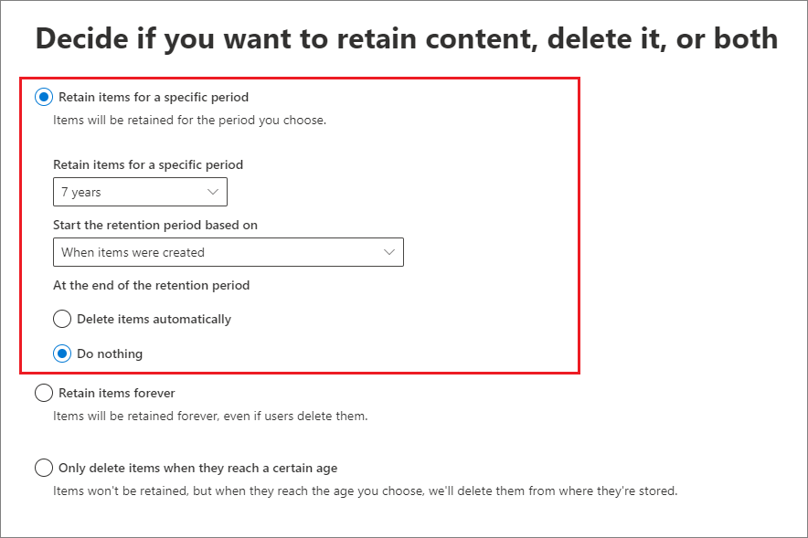

# <a name="create-and-configure-retention-policies"></a>Créer et configurer des stratégies de rétention

>*[Guide de sécurité et conformité pour les licences Microsoft 365](https://aka.ms/ComplianceSD).*

Utilisez une stratégie de rétention pour décider de manière proactive si vous souhaitez conserver le contenu, supprimer le contenu ou les deux, c’est-à-dire conserver puis supprimer le contenu. 

Une stratégie de rétention vous permet d’effectuer cela de façon très efficace en attribuant les mêmes paramètres de rétention au contenu par emplacement, au niveau d’un site ou d’une boîte aux lettres. Si vous ne savez pas si vous devez utiliser une stratégie ou une étiquette de rétention, voir [Stratégies et étiquettes de rétention](retention.md#retention-policies-and-retention-labels).

Si vous souhaitez en savoir plus sur les stratégies de rétention et le fonctionnement de la rétention, consultez la page [Découvrir la rétention](retention.md).

## <a name="before-you-begin"></a>Avant de commencer

L’administrateur général de votre organisation dispose de toutes les autorisations pour créer et gérer les stratégies de confidentialité. Si vous ne vous connectez pas en tant qu’administrateur général, voir [Autorisations nécessaires pour créer et gérer des stratégies et des étiquettes de confidentialité](get-started-with-retention.md#permissions-required-to-create-and-manage-retention-policies-and-retention-labels).

## <a name="create-and-configure-a-retention-policy"></a>Créer et configurer une stratégie de rétention

Bien qu’une stratégie de rétention puisse prendre en charge plusieurs emplacements, vous ne pouvez pas créer de stratégie de rétention unique qui inclut tous les emplacements pris en charge :
- E-mails Exchange
- Site SharePoint
- Comptes OneDrive
- Groupes Microsoft 365
- Skype Entreprise
- Dossiers publics Exchange
- Messages du canal Teams
- Conversations Teams

Lorsque vous sélectionnez l’un des emplacements Teams lors de la création d’une stratégie de rétention, les autres emplacements sont automatiquement exclus. Par conséquent, les instructions à suivre varient selon que vous devez inclure ou non les emplacements Teams :

- [Instructions relatives à une stratégie de rétention pour les emplacements Teams](#retention-policy-for-teams-locations)
- [Instructions relatives à une stratégie de rétention pour les emplacements autres que Teams](#retention-policy-for-locations-other-than-teams)

Lorsque vous avez plusieurs stratégies de rétention et que vous utilisez également des étiquettes de rétention, voir [Principes de rétention et priorité](retention.md#the-principles-of-retention-or-what-takes-precedence) pour comprendre le résultat lorsque plusieurs paramètres de rétention s’appliquent au même contenu.

### <a name="retention-policy-for-teams-locations"></a>Stratégie de rétention pour les emplacements Teams

1. Dans le [Centre de conformité Microsoft 365](https://compliance.microsoft.com/), sélectionnez **Stratégies** > **Retention**.

2. Sélectionnez **Nouvelle stratégie de rétention** pour créer une stratégie de rétention.

3. Sur la page **Indiquez si vous souhaitez conserver le contenu et/ou le supprimer** de l’assistant, spécifiez les options de configuration pour la conservation et la suppression du contenu. 
    
    Vous pouvez créer une stratégie de rétention qui conserve uniquement le contenu sans le supprimer, conserve puis supprime le contenu après une période donnée, ou supprime simplement le contenu après une période donnée. Si vous souhaitez en savoir plus, voir [Paramètres pour la conservation et la suppression du contenu](#settings-for-retaining-and-deleting-content) sur cette page.
    
    Ne sélectionnez pas **Utiliser les paramètres de rétention avancée**, car cette option n’est pas prise en charge pour les emplacements Teams. 

4. Sur la page **Choisir les emplacements**, cliquez sur **Me laisser choisir des emplacements spécifiques**. Activez ensuite l’un des emplacements Teams ou les deux : **Messages de canal Teams** et **Conversations Teams**.
     
    Pour **Messages de canal Teams**, les messages provenant des canaux standard sont inclus, contrairement à ceux des [canaux privés](https://docs.microsoft.com/microsoftteams/private-channels). Les canaux privés ne sont actuellement pas pris en charge par les stratégies de rétention.
    
    Par défaut, toutes les équipes sont sélectionnées, mais vous pouvez changer cela en spécifiant des équipes à inclure ou exclure.

5. Terminez l’assistant pour enregistrer vos paramètres.

Pour plus d’informations sur les stratégies de rétention pour Teams, voir [Stratégies de rétention dans Microsoft Teams](https://docs.microsoft.com/microsoftteams/retention-policies) dans la documentation Teams.

#### <a name="additional-retention-policy-needed-to-support-teams"></a>Stratégie de rétention supplémentaire requise pour la prise en charge de Teams

Teams n’est pas seulement des conversations et des messages de canaux. Si vous avez des équipes créées à partir d’un groupe Microsoft 365 (anciennement groupe Office 365), vous devez également configurer une stratégie de rétention qui inclut ce groupe Microsoft 365 à l’aide des **Groupes Office 365** emplacement. Cette stratégie de rétention s’applique au contenu de la boîte aux lettres, du site et des fichiers du groupe.

Si vous possédez des sites d’équipe qui ne sont pas connectés à un groupe Microsoft 365, vous avez besoin d’une stratégie de rétention qui inclut les emplacements de **sites SharePoint** ou **comptes OneDrive** pour conserver et supprimer des fichiers dans Teams :

- Les fichiers partagés dans une conversation sont stockés sur le compte OneDrive de l’utilisateur qui a partagé le fichier. 

- Les fichiers chargés dans les canaux sont stockés sur le site SharePoint associé à l’équipe.

> [!TIP]
> Vous pouvez appliquer une stratégie de rétention aux fichiers d’une équipe spécifique uniquement lorsque celle-ci n’est pas connectée à un groupe Microsoft 365 en sélectionnant le site SharePoint pour l’équipe, ainsi que les comptes OneDrive des utilisateurs au sein de Teams.

Il est possible qu’une stratégie de conservation appliquée aux groupes Microsoft 365, sites SharePoint ou comptes OneDrive supprime un fichier référencé dans une conversation ou un message de canal Teams avant la suppression de ces messages. Dans ce scénario, le fichier s’affiche encore dans le message Teams, mais lorsque les utilisateurs sélectionnent le fichier, un message d’erreur « fichier introuvable » s’affiche. Ce comportement n’est pas spécifique aux stratégies de rétention et peut également se produire si un utilisateur supprime manuellement un fichier à partir de SharePoint ou de OneDrive.


### <a name="retention-policy-for-locations-other-than-teams"></a>Stratégie de rétention pour les emplacements autres que Teams

1. Dans le [Centre de conformité Microsoft 365](https://compliance.microsoft.com/), sélectionnez **Stratégies** > **Retention**.

2. Sélectionnez **Nouvelle stratégie de rétention** pour créer une stratégie de rétention.

3. Sur la page **Indiquez si vous souhaitez conserver le contenu et/ou le supprimer** de l’assistant, spécifiez les options de configuration pour la conservation et la suppression du contenu. 
    
    Vous pouvez créer une stratégie de rétention qui conserve uniquement le contenu sans le supprimer, conserve puis supprime le contenu après une période donnée, ou supprime simplement le contenu après une période donnée. Si vous souhaitez en savoir plus, voir [Paramètres pour la conservation et la suppression du contenu](#settings-for-retaining-and-deleting-content) sur cette page.
    
    Choisissez ensuite si la stratégie de rétention doit s’appliquer à tout le contenu ou au contenu qui répond à des conditions spécifiques. Si vous souhaitez en savoir plus sur ces paramètres avancés pour la rétention, consultez la rubrique [Paramètres avancés permettant d’identifier le contenu répondant à des conditions spécifiques](#advanced-settings-to-identify-content-that-meets-specific-conditions). 

4. Pour la page **Choisir les emplacements**, indiquez si la stratégie de rétention doit s’appliquer à tous les emplacements pris en charge dans votre organisation, ou si vous souhaitez spécifier les emplacements. Si vous choisissez des emplacements spécifiques, vous pouvez également spécifier des inclusions et des exclusions. 
    
    Si vous souhaitez en savoir plus sur le choix entre une stratégie de rétention pour l’organisation ou pour des emplacements spécifiques, consultez la rubrique [Application d’une stratégie de rétention à toute une organisation ou à des emplacements spécifiques](#applying-a-retention-policy-to-an-entire-organization-or-specific-locations) sur cette page.
    
    Informations spécifiques aux emplacements :
    - [Messagerie Exchange et dossiers publics Exchange](#configuration-information-for-exchange-email-and-exchange-public-folders)
    - [Sites SharePoint et comptes OneDrive](#configuration-information-for-sharepoint-sites-and-onedrive-accounts)
    - [Groupes Office 365](#configuration-information-for-microsoft-365-groups)
    - [Skype Entreprise](#configuration-information-for-skype-for-business)

5. Terminez l’assistant pour enregistrer vos paramètres.


#### <a name="configuration-information-for-exchange-email-and-exchange-public-folders"></a>Informations de configuration pour la messagerie Exchange et les dossiers publics Exchange

L’emplacement **Courrier Exchange** prend en charge la rétention du courrier électronique, du calendrier et d’autres éléments de boîte aux lettres des utilisateurs en appliquant des paramètres de rétention au niveau d’une boîte aux lettres.

Les éléments de courrier suivants sont inclus : les messages (y compris les brouillons) avec leurs pièces jointes, les tâches et les éléments de calendrier lorsqu’ils ont une date de fin, ainsi que les notes. Les contacts, ainsi que les tâches et les éléments de calendrier qui n’ont pas de date de fin ne sont pas inclus. Les autres éléments stockés dans une boîte aux lettres, tels que les messages enregistrés de Skype et Teams, ne sont pas inclus à cet emplacement. Ces éléments ont leurs propres emplacements de rétention.

Même si un groupe Microsoft 365 possède une boîte aux lettres Exchange, une stratégie de rétention qui inclut l’ensemble de l’emplacement de la **messagerie Exchange** n’inclut pas le contenu des boîtes aux lettres du groupe Microsoft 365. Pour conserver le contenu de ces boîtes aux lettres, sélectionnez l’emplacement **groupes Office 365**.

L’emplacement **Dossiers publics Exchange** applique les paramètres de rétention à tous les dossiers publics et ne peut pas être appliqué au niveau d’un dossier ou d’une boîte aux lettres.

#### <a name="configuration-information-for-sharepoint-sites-and-onedrive-accounts"></a>Informations de configuration pour les sites SharePoint et les comptes OneDrive

Lorsque vous choisissez l’emplacement **Sites SharePoint**, la stratégie de rétention peut conserver et supprimer les documents des sites de communication SharePoint, des sites d’équipe qui ne sont pas connectés par des groupes Office 365 ainsi que des sites classiques. Cette option ne prend pas en charge les sites d’équipe connectés par des groupes Office 365. Utilisez plutôt des emplacements de **groupes Office 365** qui s’appliquent au contenu de la boîte aux lettres, du site et des fichiers du groupe.

Bien que la stratégie de rétention soit appliquée au niveau du site, seuls les documents ont des paramètres de rétention qui leur sont appliqués. Les paramètres de rétention ne s’appliquent pas aux structures d’organisation qui incluent des bibliothèques, des listes et des dossiers au sein du site. 

Lorsque vous spécifiez vos emplacements pour les sites SharePoint ou comptes OneDrive, aucune autorisation n’est nécessaire pour accéder au site, et aucune validation n’intervient au moment où vous spécifiez l’URL sur la page **Modifier les emplacements**. Toutefois, les sites SharePoint doivent être indexés, et l’existence des sites que vous spécifiez est vérifiée à la fin de l’assistant.

Si cette vérification échoue, un message apparaît pour vous informer que la validation de l’URL entrée a échoué, et que l’Assistant ne créera pas la stratégie de rétention tant que la vérification de validation n’aura pas abouti. Si ce message apparaît, revenez à l’assistant pour modifier l’URL ou supprimer le site de la stratégie de rétention.

Pour spécifier l’inclusion ou l’exclusion de comptes OneDrive individuels, l’URL présente le format suivant : `https://<tenant name>-my.sharepoint.com/personal/<user_name>_<tenant name>_com`

Par exemple, pour un utilisateur du client contoso dont le nom d’utilisateur est « rsimone » : `https://contoso-my.sharepoint.com/personal/rsimone_contoso_onmicrosoft_com`

Pour vérifier la syntaxe de votre client et identifier les URL des utilisateurs, voir [Obtenir la liste de toutes les URL OneDrive utilisateur de votre organisation](https://docs.microsoft.com/onedrive/list-onedrive-urls).

### <a name="configuration-information-for-microsoft-365-groups"></a>Informations de configuration pour les groupes Microsoft 365

Pour conserver ou supprimer le contenu d’un groupe Microsoft 365 (anciennement groupe Office 365), utilisez l’emplacement **Groupes Office 365**. Même si un groupe Microsoft 365 possède une boîte aux lettres Exchange, une stratégie de rétention qui inclut l’ensemble de l’emplacement de la **messagerie Exchange** n’inclut pas le contenu des boîtes aux lettres du groupe Microsoft 365. De plus, bien que l’emplacement de la **messagerie Exchange** vous permette initialement de spécifier une boîte aux lettres de groupe à inclure ou à exclure, vous recevez une erreur indiquant que « RemoteGroupMailbox » n’est pas une sélection valide pour l’emplacement Exchange, lorsque vous essayez d’enregistrer la stratégie de rétention.

Une stratégie de rétention appliquée à un groupe Microsoft 365 inclut la boîte aux lettres de groupe et le site. Une stratégie de rétention appliquée à un groupe Microsoft 365 protège les ressources créées par un groupe Microsoft 365, ce qui inclut Microsoft Teams.

### <a name="configuration-information-for-skype-for-business"></a>Informations de configuration de Skype Entreprise

À la différence de la messagerie Exchange, l’activation de l’emplacement Skype ne s’applique pas à l’ensemble de vos utilisateurs. Après avoir activé l’emplacement Skype, vous devez sélectionner manuellement chaque utilisateur dont vous souhaitez conserver les conversations :


  
Après avoir sélectionné **Choisir des utilisateurs**, vous pouvez inclure rapidement tous les utilisateurs en cochant la case **Nom** située dans l’en-tête de colonne. Toutefois, il est important de comprendre que chaque utilisateur compte comme une inclusion spécifique dans la stratégie. Par conséquent, si vous incluez plus de 1 000 utilisateurs, les limites indiquées dans la section précédente s’appliquent. Le fait de sélectionner tous les utilisateurs Skype ici ne revient pas au même qu’une stratégie à l’échelle de l’organisation qui serait en mesure d’inclure tous les utilisateurs Skype par défaut. 
  

  
Notez que **Historique des conversations**, un dossier dans Outlook, est une fonctionnalité qui n’a rien à voir avec l’archivage Skype. La fonctionnalité **Historique des conversations** peut être désactivée par l’utilisateur final, mais l’archivage pour Skype s’effectue en stockant une copie des conversations Skype dans un dossier masqué inaccessible à l’utilisateur, mais disponible pour eDiscovery.


## <a name="settings-for-retaining-and-deleting-content"></a>Paramètres pour la conservation et la suppression de contenu

Votre stratégie de rétention aura l’une des configurations suivantes pendant une période donnée lorsque vous sélectionnez les paramètres de conservation et de suppression de contenu :

- Conserver uniquement
- Conserver puis supprimer
- Supprimer uniquement

### <a name="retaining-content-for-a-specific-period-of-time"></a>Conservation du contenu pour une période donnée

Lorsque vous configurez une stratégie de rétention, vous choisissez de conserver le contenu indéfiniment ou pour un nombre déterminé de jours, mois ou années. La durée pendant laquelle le contenu est conservé est calculée selon l’ancienneté du contenu, et non à partir du moment où la stratégie de rétention est appliquée. Vous pouvez choisir si l’ancienneté est basée sur la date de création du contenu ou (pour OneDrive et SharePoint) sur la dernière date de modification.

Exemples :
  
- SharePoint : si vous souhaitez conserver le contenu d’une collection de site pendant sept ans à partir de sa dernière modification, et qu’un document dans cette collection de site n’a pas été modifié en six ans, le document sera conservé pendant un an de plus uniquement s’il n’est pas modifié. Si le document est de nouveau modifié, l’âge du document est calculé à partir de la date de dernière modification, et il sera conservé pendant sept années supplémentaires.
  
- Exchange : si vous voulez conserver le contenu d’une boîte aux lettres pendant sept ans et qu’un message a été envoyé il y a six ans, le message est conservé pendant un an seulement. Pour le contenu Exchange, l’âge est basé sur la date de réception des e-mails entrants ou la date d’envoi des e-mails sortants. La conservation du contenu en fonction de la date de dernière modification s’applique uniquement au contenu de site dans OneDrive et SharePoint.
  
Vous pouvez choisir si vous souhaitez que le contenu soit supprimé de façon définitive à la fin de la période de rétention :
  

  
### <a name="deleting-content-thats-older-than-a-specific-age"></a>Suppression du contenu antérieur à une date spécifique

Une stratégie de rétention permet à la fois de conserver, puis de supprimer du contenu, ou de supprimer du contenu ancien sans le conserver.
  
Si votre stratégie de rétention supprime du contenu, il est important de comprendre que la période spécifiée pour une stratégie de rétention est calculée en fonction de la date de création ou de modification du contenu, et non de la date d’affectation de la stratégie.
  

  
Par exemple, supposons que vous créez une stratégie de rétention qui supprime le contenu au bout de trois ans, puis que vous affectez cette stratégie à tous les comptes OneDrive, qui contiennent un grand volume de contenu qui a été créé il y a quatre ou cinq ans. Dans ce cas, une grande partie du contenu est supprimée peu après l’attribution de la stratégie de rétention pour la première fois. Pour cette raison, il est important de comprendre qu’une stratégie de rétention qui supprime le contenu peut avoir un impact considérable sur votre contenu. 
  
Par conséquent, avant d’affecter une stratégie de rétention à un site pour la première fois, vous devez d’abord tenir compte de l’ancienneté du contenu existant et de la façon dont la stratégie peut avoir une incidence sur ce contenu. Vous pouvez également communiquer la nouvelle stratégie à vos utilisateurs avant de l’affecter, pour leur donner le temps d’évaluer les incidences éventuelles. Remarquez cet avertissement qui apparaît lorsque vous examinez les paramètres pour votre stratégie de rétention juste avant de la créer.
  

  
## <a name="advanced-settings-to-identify-content-that-meets-specific-conditions"></a>Paramètres avancés permettant d’identifier le contenu répondant à des conditions spécifiques

Une stratégie de rétention peut s’appliquer à tout le contenu des emplacements qui lui est propre, ou vous pouvez choisir d’appliquer une stratégie de rétention uniquement au contenu qui contient des mots clés spécifiques ou [des types spécifiques d’informations sensibles](what-the-sensitive-information-types-look-for.md).
  

  
### <a name="identify-content-that-contains-specific-keywords"></a>Identifier le contenu qui contient des mots clés spécifiques

Vous pouvez appliquer une stratégie de rétention uniquement au contenu qui répond à des conditions spécifiques et mener des actions de rétention uniquement au niveau de ce contenu. Les conditions disponibles prennent en charge l’application d’une stratégie de rétention à du contenu comprenant des mots ou phrases spécifiques. Vous pouvez affiner votre requête à l’aide des opérateurs de recherche tels que ET, OU et SAUF. Pour plus d’informations sur ces opérateurs, consultez [Requêtes par mots clés et conditions de recherche pour la recherche de contenu](keyword-queries-and-search-conditions.md).
  
La prise en charge de l’ajout de propriétés utilisables dans une requête (par exemple, **subject:**) sera bientôt disponible.
  
La rétention basée sur une requête utilise l’index de recherche pour identifier le contenu.
  

  
### <a name="identify-content-that-contains-sensitive-information"></a>Identifier le contenu qui contient des informations sensibles

Vous pouvez également appliquer une politique de conservation uniquement au contenu qui contient [des types spécifiques d'informations sensibles](what-the-sensitive-information-types-look-for.md). Par exemple, vous pouvez choisir d'appliquer des exigences de conservation uniques uniquement au contenu qui contient des informations personnelles, telles que les numéros d'identification des contribuables, les numéros de sécurité sociale ou les numéros de passeport.
  

  
Remarques :
  
- La rétention avancée des informations sensibles ne s’applique pas aux dossiers publics Exchange ou Skype Entreprise, car ces emplacements ne prennent pas en charge les types d’informations sensibles.
    
- Exchange Online utilise les règles de flux de courrier (également appelées règles de transport) pour identifier les informations sensibles. Par conséquent, cela fonctionne uniquement sur les messages en transit, et non sur tous les éléments déjà stockés dans une boîte aux lettres. Pour Exchange Online, cela signifie qu’une stratégie de rétention peut identifier les informations sensibles et mener des actions de rétention uniquement sur les messages qui arrivent **après** l’application de la stratégie à la boîte aux lettres. La rétention basée sur les requêtes décrite dans la section précédente n’a pas cette limitation, car elle utilise l’index de recherche pour identifier le contenu. 
    
## <a name="applying-a-retention-policy-to-an-entire-organization-or-specific-locations"></a>Application d’une stratégie de rétention à l’ensemble d’une organisation ou des emplacements spécifiques

Vous pouvez facilement appliquer une stratégie de rétention à l’ensemble d’une organisation, des emplacements entiers, ou uniquement à certains emplacements ou utilisateurs.
  
### <a name="org-wide-policy"></a>Stratégie mise en place à l’échelle de l’organisation

Ce qui fait la force d’une stratégie de rétention, c’est que vous pouvez l’appliquer simultanément à tous les emplacements Microsoft 365 suivants :
  
- La messagerie électronique Exchange
    
- Les collections de sites SharePoint
    
- Les comptes OneDrive
    
- Groupes Microsoft 365
    
- Dossiers publics Exchange
    


Voici d’autres fonctionnalités importantes d’une stratégie de rétention mise en place à l’échelle de l’organisation :
  
- Il n’existe aucune limite au nombre de boîtes aux lettres ou de sites que la stratégie peut inclure.
    
- Pour Exchange, toute nouvelle boîte aux lettres créée après l’application de la stratégie hérite automatiquement de la stratégie.
  
### <a name="a-policy-that-applies-to-entire-locations"></a>Une stratégie qui s’applique aux emplacements entiers

Lorsque vous choisissez des emplacements, vous pouvez facilement inclure ou exclure un emplacement entier, tel que la messagerie Exchange ou les comptes OneDrive. Pour ce faire, basculez l’**état** de cet emplacement sur Activé ou Désactivé. 
  
Comme pour une stratégie à l’échelle de l’organisation, si une stratégie s’applique à n’importe quelle combinaison d’emplacements entiers, il n’y a aucune limite au nombre de boîtes aux lettres ou de sites que la stratégie peut inclure. 

Par exemple, si une stratégie inclut tous les messages Exchange et tous les sites SharePoint, l’ensemble des sites et boîtes aux lettres sont inclus, quel que soit leur nombre. Et dans le cas d’Exchange, une boîte aux lettres créée après l’application de la stratégie héritera automatiquement de la stratégie.

### <a name="a-policy-with-specific-inclusions-or-exclusions"></a>Une stratégie avec des inclusions ou des exclusions spécifiques

Vous pouvez également appliquer une stratégie de rétention à des utilisateurs, des groupes Microsoft 365, ou des sites spécifiques. Pour ce faire, activez l’**état** de cet emplacement, puis utilisez les liens pour inclure ou exclure des utilisateurs, des groupes Microsoft 365 ou des sites spécifiques. 
  
Toutefois, il existe certaines limites à l’utilisation de cette configuration lorsque votre stratégie de rétention inclut ou exclut plus de 1 000 emplacements spécifiques :
  
- Nombre maximal pour la stratégie de rétention :
    - 1 000 boîtes aux lettres
    - 1 000 groupes Microsoft 365
    - 1 000 utilisateurs pour conversations privées Teams
    - 100 sites (OneDrive et SharePoint)

Le nombre maximal de stratégies prises en charge pour un client est de 10 000. Ces éléments incluent les stratégies de rétention, les stratégies d’étiquette de rétention et les stratégies de rétention appliquées automatiquement.

Si vos stratégies de rétention sont susceptibles d’être soumises à ces limitations, choisissez les options de configuration qui s’appliquent à des emplacements entiers ou utilisez une stratégie à l’échelle de l’organisation.

## <a name="updating-retention-policies"></a>Mise à jour des stratégies de rétention

Si vous modifiez une stratégie de rétention et que le contenu est déjà soumis aux paramètres d’origine de cette stratégie, vos paramètres mis à jour seront automatiquement appliqués à ce contenu en plus du contenu nouvellement identifié.

En règle générale, cette mise à jour est assez rapide, mais peut prendre plusieurs jours. Lorsque la réplication de la stratégie au sein de vos emplacements Microsoft 365 est terminée, l’état de la stratégie de rétention dans le Centre de conformité Microsoft 365 passe de **Activé (en attente)** à **Activé (opération réussie)**.

## <a name="lock-a-retention-policy-by-using-powershell"></a>Verrouiller une stratégie de rétention à l’aide de PowerShell

Vous devez utiliser PowerShell si vous avez besoin d’utiliser le [Verrouillage de Conservation](retention.md#use-preservation-lock-to-comply-with-regulatory-requirements) pour vous conformer aux exigences réglementaires. Les administrateurs ne pouvant pas désactiver ou supprimer une stratégie de rétention après application d’un verrouillage de conservation, l’activation de cette fonctionnalité n’est pas disponible dans l’interface utilisateur pour la protection contre la configuration accidentelle.

Toutes les stratégies de rétention incluant une configuration prennent en charge le Verrouillage de conservation. Toutefois, lorsque vous utilisez les commandes PowerShell suivantes, vous remarquerez que le paramètre **Charge de travail** affiche toujours **Exchange, SharePoint, OneDriveForBusines, Skype, ModernGroup** plutôt que de refléter les charges de travail réelles configurées dans la stratégie. Il s’agit uniquement d’un problème d’affichage.

1. [Connectez-vous au Centre de conformité et sécurité PowerShell](https://docs.microsoft.com/powershell/exchange/office-365-scc/connect-to-scc-powershell/connect-to-scc-powershell?view=exchange-ps).

2. Répertoriez vos stratégies de rétention et recherchez le nom de la stratégie que vous souhaitez verrouiller en exécutant [Get-RetentionCompliancePolicy](https://powershell/module/exchange/get-retentioncompliancepolicy). Par exemple :
    
   
    
3. Pour placer un Verrouillage de conservation sur une stratégie de rétention, exécutez l’applet de commande [RetentionCompliancePolicy]( ) avec le nom de la stratégie de rétention, et le paramètre *RestrictiveRetention* défini sur True :
    
    ```powershell
    Set-RetentionCompliancePolicy -Identity "<Name of Policy>" –RestrictiveRetention $true
    ```
    
    Par exemple :
    
    
    
     Lorsque vous y êtes invité, lisez et accusez réception des restrictions incluses dans cette configuration en entrant **Y**:
    
   

Un verrouillage de conservation est désormais placé sur la stratégie de rétention. Pour confirmer, réexécutez `Get-RetentionCompliancePolicy`, mais indiquez le nom de la stratégie de rétention et affichez les paramètres de la stratégie :

```powershell
Get-RetentionCompliancePolicy -Identity "<Name of Policy>" |Fl
```

Vous devriez voir que **RestrictiveRetention** est paramétré sur **True**. Par exemple :


  

