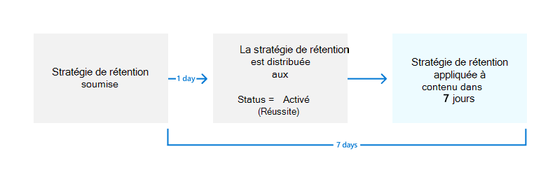

# <a name="create-and-configure-retention-policies"></a>Créer et configurer des stratégies de rétention

>*[Guide de sécurité et conformité pour les licences Microsoft 365](/office365/servicedescriptions/microsoft-365-service-descriptions/microsoft-365-tenantlevel-services-licensing-guidance/microsoft-365-security-compliance-licensing-guidance).*

Utilisez une stratégie de rétention pour gérer les données de votre organisation en décidant de manière proactive s'il faut conserver le contenu, le supprimer ou le conserver puis le supprimer.

Une stratégie de rétention vous permet de le faire très efficacement en attribuant les mêmes paramètres de rétention au niveau du conteneur pour qu'ils soient automatiquement hérités par le contenu de ce conteneur. Par exemple, tous les éléments des sites SharePoint, tous les messages électroniques dans les boîtes aux lettres Exchange des utilisateurs, tous les messages des canaux pour les équipes qui sont utilisés avec Microsoft Teams. Si vous ne savez pas si vous devez utiliser une stratégie de rétention au niveau du conteneur ou une étiquette de rétention au niveau de l’élément, consultez [Stratégies de rétention et étiquettes de rétention](retention.md#retention-policies-and-retention-labels).

Pour en savoir plus sur les stratégies de rétention et le fonctionnement de la rétention en Microsoft 365, consultez la page [Découvrir les stratégies et étiquettes de rétention](retention.md).

> [!NOTE]
> Les informations sur cette page sont pour les administrateurs de conformité. Si vous n'êtes pas administrateur et que vous souhaitez comprendre comment les stratégies de rétention ont été configurées pour les applications que vous utilisez, contactez votre service d'assistance, votre service informatique ou votre administrateur. Si vous voyez des messages concernant les stratégies de rétention dans les conversations Teams et dans les messages des canaux, vous trouverez peut-être utile d'examiner [Messages Teams concernant les stratégies de rétention](https://support.microsoft.com/office/teams-messages-about-retention-policies-c151fa2f-1558-4cf9-8e51-854e925b483b).

## <a name="before-you-begin"></a>Avant de commencer

L’administrateur général de votre organisation dispose de toutes les autorisations pour créer et gérer les stratégies de confidentialité. Si vous ne vous connectez pas en tant qu'administrateur général, consultez les [informations sur les autorisations pour la gestion du cycle de vie des données](get-started-with-data-lifecycle-management.md#permissions-for-retention-policies-and-retention-labels).

Déterminez avant de créer votre stratégie de rétention si elle sera **adaptative** ou **statique.** Pour plus d’informations, voir étendues de stratégie adaptative ou statique [pour la rétention.](retention.md#adaptive-or-static-policy-scopes-for-retention) Si vous décidez d’utiliser une stratégie adaptative, vous devez créer une ou plusieurs étendues adaptatives avant de créer votre stratégie de rétention, puis les sélectionner au cours du processus de création de stratégie de rétention. Pour obtenir des instructions, [consultez les informations de configuration pour les étendues adaptatives.](retention-settings.md#configuration-information-for-adaptive-scopes)

## <a name="create-and-configure-a-retention-policy"></a>Créer et configurer une stratégie de rétention

Bien qu’une stratégie de rétention puisse prendre en charge plusieurs services identifiés comme « emplacements » dans la stratégie de rétention, vous ne pouvez pas créer une stratégie de rétention unique qui inclut tous les emplacements pris en charge :

- E-mails Exchange
- Site SharePoint
- Comptes OneDrive
- Groupes Microsoft 365
- Skype Entreprise
- Dossiers publics Exchange
- Messages du canal Teams
- Conversations Teams
- Messages du canal privé Teams
- Messages communautaires Yammer
- Messages utilisateur de Yammer

Lorsque vous sélectionnez l’emplacement Teams ou Yammer lors de la création d’une stratégie de rétention, les autres emplacements sont automatiquement exclus. Cela signifie que les instructions à suivre varient selon que vous devez inclure les emplacements Teams ou Yammer :

- [Instructions relatives à une stratégie de rétention pour les emplacements Teams](#retention-policy-for-teams-locations)
- [Instructions relatives à une stratégie de rétention pour les emplacements Yammer](#retention-policy-for-yammer-locations)
- [Instructions relatives à une stratégie de rétention pour les emplacements autres que Teams et Yammer](#retention-policy-for-locations-other-than-teams-and-yammer)

> [!NOTE]
> Lorsque vous utilisez des stratégies adaptatives au lieu de stratégies statiques, vous pouvez configurer une stratégie de rétention unique pour inclure les emplacements Teams et Yammer de rétention. Ce n’est pas le cas pour les stratégies statiques dans Teams et Yammer de rétention nécessitent leur propre stratégie de rétention.

Lorsque vous avez plusieurs stratégies de rétention et que vous utilisez également des étiquettes de rétention, voir [Principes de rétention et priorité](retention.md#the-principles-of-retention-or-what-takes-precedence) pour comprendre le résultat lorsque plusieurs paramètres de rétention s’appliquent au même contenu.

### <a name="retention-policy-for-teams-locations"></a>Stratégie de rétention pour les emplacements Teams

> [!NOTE]
> Les stratégies de rétention prennent en charge [les canaux partagés](/MicrosoftTeams/shared-channels). Lorsque vous configurez les paramètres de rétention pour l'emplacement **des messages du canal Teams**, si une équipe a des canaux partagés, ils héritent des paramètres de rétention de leur équipe parente.

1. Dans le [Portail de conformité Microsoft Purview](https://compliance.microsoft.com/), sélectionnez **Gestion du cycle de vie des données** > **Stratégies de rétention**.

2. Sélectionnez **nouvelle stratégie de rétention** pour démarrer la configuration **Créer une stratégie de rétention** et nommez votre nouvelle stratégie de rétention.

3. Pour choisir **le type** de stratégie de rétention à créer, sélectionnez **Adaptatif** ou **Statique,** en fonction du choix que vous avez effectué à partir des [instructions](#before-you-begin) avant de commencer. Si vous n’avez pas encore créé **d’étendues adaptatives, vous pouvez sélectionner Adaptive**, mais comme il n’y aura aucune étendue adaptative à sélectionner, vous ne pourrez pas terminer la configuration avec cette option.

4. En fonction de l’étendue sélectionnée :
    
    - Si vous **avez** choisi Adaptatif : dans la page Choisir les étendues et les **emplacements** de stratégie adaptative, sélectionnez Ajouter des **étendues** et sélectionnez une ou plusieurs étendues adaptatives qui ont été créées. Sélectionnez ensuite un ou plusieurs emplacements. Les emplacements que vous pouvez sélectionner dépendent des [types d’étendue](retention-settings.md#configuration-information-for-adaptive-scopes) ajoutés. Par exemple, si vous avez uniquement **ajouté un type d’étendue** d’utilisateur, vous pourrez sélectionner Teams **conversations,** mais pas Teams **messages de canal.** 
    
    - Si vous avez choisi **Statique :** dans la **page** Choisir les emplacements à appliquer à la stratégie, sélectionnez un ou plusieurs emplacements pour Teams :
        - **Message de canal d'équipe** : messages provenant de chats de canal standard et partagé, et de réunions de canal standard et partagé, mais pas de [canaux privés](/microsoftteams/private-channels) qui ont leur propre emplacement de politique.
        - **Conversations Teams** : messages provenant de conversations privées individuelles, de conversations de groupe et de conversations de réunion.
        - **Messages de canal privé Teams** : messages provenant de conversations de canal privé et de réunions de canal privé. Si vous sélectionnez cette option, vous ne pouvez pas sélectionner les autres emplacements Teams dans la même stratégie de conservation.
        
       Par défaut, [toutes les équipes et tous les utilisateurs sont sélectionnés](retention-settings.md#a-policy-that-applies-to-entire-locations). Vous pouvez toutefois affiner cette sélection grâce aux [options **Choisir** et **Exclure**](retention-settings.md#a-policy-with-specific-inclusions-or-exclusions).

5. Pour **Décider si vous souhaitez conserver le contenu, supprimez-le ou les deux** pages, spécifiez les options de configuration pour conserver et supprimer le contenu.

   Vous pouvez créer une politique de conservation qui se contente de conserver le contenu sans le supprimer, de le conserver puis de le supprimer après une période donnée ou de le supprimer après une période donnée. Pour plus d'informations, voir [Paramètres de conservation et de suppression du contenu](retention-settings.md#settings-for-retaining-and-deleting-content).

6. Terminez l’assistant pour enregistrer vos paramètres.

Pour obtenir des conseils permettant de déterminer quand utiliser les stratégies de rétention pour Teams et comprendre l’expérience de l’utilisateur final, voir [Gérer les stratégies de rétention pour Microsoft Teams](/microsoftteams/retention-policies) dans la documentation Teams.

Pour obtenir des détails techniques sur le fonctionnement de la rétention pour Teams, y compris les éléments de messages pris en charge pour la rétention et le minutage des informations avec des exemples pas à pas, consultez [En savoir plus sur la rétention de Microsoft Teams](retention-policies-teams.md).

#### <a name="known-configuration-issues"></a>Problèmes de configuration connus

- Bien que vous puissiez sélectionner l’option pour démarrer la période de rétention lorsque les éléments ont été modifiés pour la dernière fois, la valeur **Lorsque les éléments ont été créés** est toujours utilisée. Pour les messages qui sont modifiés, une copie du message d’origine est enregistrée avec son timestamp d’origine pour identifier les cas où ce message avant modification a été créé, et le message après modification dispose d’un timestamp plus nouveau.

- Lorsque vous sélectionnez **Modifier** pour l’emplacement des conversations Teams, vous devriez voir les invités et utilisateurs qui n’utilisent pas de boîte aux lettres. Les stratégies de rétention ne sont pas conçues pour ces utilisateurs. Ne les sélectionnez pas.


#### <a name="additional-retention-policy-needed-to-support-teams"></a>Stratégie de rétention supplémentaire requise pour la prise en charge de Teams

Teams n’est pas seulement des conversations et des messages de canaux. Si vous avez des équipes créées à partir d’un groupe Microsoft 365 (anciennement groupe Office 365), vous devez également configurer une stratégie de rétention qui inclut ce groupe Microsoft 365 à l’aide de l’emplacement **Groupes Microsoft 365**. Cette stratégie de rétention s’applique au contenu de la boîte aux lettres, du site et des fichiers du groupe.

Si vous possédez des sites d’équipe qui ne sont pas connectés à un groupe Microsoft 365, vous avez besoin d’une stratégie de rétention qui inclut les emplacements de **sites SharePoint** ou **comptes OneDrive** pour conserver et supprimer des fichiers dans Teams :

- Les fichiers partagés dans une conversation sont stockés sur le compte OneDrive de l’utilisateur qui a partagé le fichier.

- Les fichiers chargés dans les canaux sont stockés sur le site SharePoint associé à l’équipe.

> [!TIP]
> Vous pouvez appliquer une stratégie de rétention aux fichiers d’une équipe spécifique uniquement lorsque celle-ci n’est pas connectée à un groupe Microsoft 365 en sélectionnant le site SharePoint pour l’équipe, ainsi que les comptes OneDrive des utilisateurs au sein de Teams.

Il est possible qu’une stratégie de conservation appliquée aux groupes Microsoft 365, sites SharePoint ou comptes OneDrive supprime un fichier référencé dans une conversation ou un message de canal Teams avant la suppression de ces messages. Dans ce scénario, le fichier s’affiche encore dans le message Teams, mais lorsque les utilisateurs sélectionnent le fichier, un message d’erreur « fichier introuvable » s’affiche. Ce comportement n’est pas spécifique aux stratégies de rétention et peut également se produire si un utilisateur supprime manuellement un fichier à partir de SharePoint ou de OneDrive.

### <a name="retention-policy-for-yammer-locations"></a>Stratégie de rétention pour les emplacements Yammer

> [!NOTE]
> Les stratégies de rétention pour Yammer n’avertissent actuellement pas les utilisateurs de la suppression de messages en raison d’une stratégie de rétention.
>
> Pour utiliser cette fonctionnalité, votre réseau Yammer doit être [Mode Natif](/yammer/configure-your-yammer-network/overview-native-mode), et non Mode Hybride.

1. Dans le [Portail de conformité Microsoft Purview](https://compliance.microsoft.com/), sélectionnez **Gestion du cycle de vie des données** > **Stratégies de rétention**.

2. Sélectionnez **Nouvelle stratégie de rétention** pour créer une stratégie de rétention.

3. Pour choisir **le type** de stratégie de rétention à créer, sélectionnez **Adaptatif** ou **Statique,** en fonction du choix que vous avez effectué à partir des [instructions](#before-you-begin) avant de commencer. Si vous n’avez pas encore créé **d’étendues adaptatives, vous pouvez sélectionner Adaptive**, mais comme il n’y aura aucune étendue adaptative à sélectionner, vous ne pourrez pas terminer la configuration avec cette option.

4. En fonction de l’étendue sélectionnée :
    
    - Si vous **avez** choisi Adaptatif : dans la page Choisir les étendues et les **emplacements** de stratégie adaptative, sélectionnez Ajouter des **étendues** et sélectionnez une ou plusieurs étendues adaptatives qui ont été créées. Sélectionnez ensuite un ou plusieurs emplacements. Les emplacements que vous pouvez sélectionner dépendent des [types d’étendue](retention-settings.md#configuration-information-for-adaptive-scopes) ajoutés. Par exemple, si vous avez uniquement ajouté un **type d’étendue d’utilisateur**, vous pourrez sélectionner Yammer **messages** utilisateur, mais pas Yammer messages de **la communauté.** 
    
    - Si vous avez choisi **Statique** : Sur la page **Choisir les emplacements** pour appliquer la politique, basculez sur l'un ou les deux emplacements pour Yammer : **Message de la communauté Yammer** et **Messages de l'utilisateur Yammer**.
        
        Par défaut, tous les utilisateurs et communautés sont sélectionnés, mais vous pouvez les affiner en spécifiant les groupes et les utilisateurs à inclure ou à exclure.
        
        Pour les messages privés Yammer : 
        - Si vous conservez la valeur par défaut à **Tous les utilisateurs** invités B2B Azure ne sont pas inclus. 
        - Si vous sélectionnez **Modifier** pour la colonne **Inclus**, vous pouvez appliquer une stratégie de rétention pour les utilisateurs externes si vous connaissez leur compte.

5. Pour **Décider si vous souhaitez conserver le contenu, supprimez-le ou les deux** pages, spécifiez les options de configuration pour conserver et supprimer le contenu. 
    
    Vous pouvez créer une politique de conservation qui se contente de conserver le contenu sans le supprimer, de le conserver puis de le supprimer après une période donnée ou de le supprimer après une période donnée. Pour plus d'informations, voir [Paramètres de conservation et de suppression du contenu](retention-settings.md#settings-for-retaining-and-deleting-content).

6. Terminez l’assistant pour enregistrer vos paramètres.

Pour en savoir plus sur le fonctionnement des stratégies de rétention pour Yammer, consultez la page [Découvrir les stratégies de rétention pour Yammer](retention-policies-yammer.md).

#### <a name="additional-retention-policies-needed-to-support-yammer"></a>Stratégies de rétention supplémentaires requises pour la prise en charge de Yammer

Yammer est bien plus que des messages de la communauté et des messages privés. Pour conserver et supprimer des courriers électroniques pour votre réseau Yammer, configurez une stratégie de rétention supplémentaire qui inclut les groupes Microsoft 365 utilisés pour Yammer, à l’aide de l'emplacement **Groupes Microsoft 365**.

Cet emplacement inclut également les fichiers qui sont chargés dans Yammer communautés. Ces fichiers sont stockés dans le site SharePoint connecté à un groupe pour la Yammer communauté.

Il est possible qu’une stratégie de rétention appliquée à des comptes SharePoint supprime un fichier référencé dans un message Yammer avant la suppression de ces messages. Dans ce scénario, le fichier s’affiche encore dans le message Yammer, mais lorsque les utilisateurs sélectionnent le fichier, un message d’erreur « fichier introuvable » s’affiche. Ce comportement n’est pas spécifique aux stratégies de rétention et peut également se produire si un utilisateur supprime manuellement un fichier à partir de SharePoint.

### <a name="retention-policy-for-locations-other-than-teams-and-yammer"></a>Stratégie de rétention pour les emplacements autres que Teams et Yammer

Utilisez les instructions suivantes pour les stratégies de rétention qui s’appliquent ces services:

- Exchange: Email et dossiers publics
- Sites SharePoint
- OneDrive: Comptes
- Groupes Microsoft 365
- Skype Entreprise

1. Dans le [Portail de conformité Microsoft Purview](https://compliance.microsoft.com/), sélectionnez **Gestion du cycle de vie des données** > **Stratégies de rétention**.

2. Sélectionnez **nouvelle stratégie de rétention** pour démarrer la configuration **Créer une stratégie de rétention** et nommez votre nouvelle stratégie de rétention.

3. Pour choisir **le type** de stratégie de rétention à créer, sélectionnez **Adaptatif** ou **Statique,** en fonction du choix que vous avez effectué à partir des [instructions](#before-you-begin) avant de commencer. Si vous n’avez pas encore créé **d’étendues adaptatives, vous pouvez sélectionner Adaptive**, mais comme il n’y aura aucune étendue adaptative à sélectionner, vous ne pourrez pas terminer la configuration avec cette option. Les stratégies adaptatives ne sont pas adaptées aux emplacements Exchange dossiers publics ou aux Skype Entreprise.

4. En fonction de l’étendue sélectionnée :
    
    - Si vous **avez** choisi Adaptatif : dans la page Choisir les étendues et les **emplacements** de stratégie adaptative, sélectionnez Ajouter des **étendues** et sélectionnez une ou plusieurs étendues adaptatives qui ont été créées. Sélectionnez ensuite un ou plusieurs emplacements. Les emplacements que vous pouvez sélectionner dépendent des [types d’étendue](retention-settings.md#configuration-information-for-adaptive-scopes) ajoutés. Par exemple, si vous avez uniquement **ajouté un type d’étendue** d’utilisateur, vous pourrez sélectionner Exchange **courrier** électronique, mais pas SharePoint **sites.** 
    
    - Si vous avez choisi **Statique** : Sur la page **Choose locations**, activez ou désactivez n'importe quel emplacement, à l'exception des emplacements pour Teams et Yammer. Vous pouvez laisser pour chaque emplacement la valeur par défaut [Appliquer la stratégie à l’intégralité de l’emplacement](retention-settings.md#a-policy-that-applies-to-entire-locations) ou [Spécifier des inclusions et des exclusions](retention-settings.md#a-policy-with-specific-inclusions-or-exclusions).
    
    Informations spécifiques aux emplacements :
    - [Messagerie Exchange et dossiers publics Exchange](retention-settings.md#configuration-information-for-exchange-email-and-exchange-public-folders)
    - [Sites SharePoint et comptes OneDrive](retention-settings.md#configuration-information-for-sharepoint-sites-and-onedrive-accounts)
    - [Groupes Microsoft 365](retention-settings.md#configuration-information-for-microsoft-365-groups)
    - [Skype Entreprise](retention-settings.md#configuration-information-for-skype-for-business)

5. Pour **Décider si vous souhaitez conserver le contenu, supprimez-le ou les deux** pages, spécifiez les options de configuration pour conserver et supprimer le contenu.
    
    Vous pouvez créer une stratégie de rétention qui conserve uniquement le contenu sans le supprimer, conserve puis supprime le contenu après une période donnée, ou supprime simplement le contenu après une période donnée. Si vous souhaitez en savoir plus, consultez [Paramètres pour la conservation et la suppression du contenu](retention-settings.md#settings-for-retaining-and-deleting-content) sur cette page.

6. Terminez l’assistant pour enregistrer vos paramètres.

## <a name="how-long-it-takes-for-retention-policies-to-take-effect"></a>Durée d’application des stratégies de rétention

Lorsque vous créez et soumettez une stratégie de rétention, l’application de la stratégie de rétention peut prendre jusqu’à sept jours :
  


Tout d’abord, la stratégie de rétention doit être distribuée aux emplacements que vous avez sélectionnés, puis appliquée au contenu. Vous pouvez toujours vérifier l’état de distribution de la stratégie de rétention en la sélectionnant dans la page **Stratégies de rétention** du portail de conformité Microsoft Purview. Dans le volet volant, si vous voyez **(Error)** inclus dans l'état, et dans les détails des emplacements, un message indiquant que le déploiement de la stratégie prend plus de temps que prévu ou que vous devez essayer de redéployer la stratégie, essayez d'exécuter la commande PowerShell [Set-AppRetentionCompliancePolicy](/powershell/module/exchange/set-appretentioncompliancepolicy) ou [Set-RetentionCompliancePolicy](/powershell/module/exchange/set-retentioncompliancepolicy) pour réessayer la distribution de la stratégie :

1. [Se connecter à Security & Compliance PowerShell](/powershell/exchange/connect-to-scc-powershell).

2. Exécutez une des commandes suivantes :
    
    - Pour les emplacements de la politique **les messages du canal privé Teams**, **les messages d’utilisateurs Yammer** ainsi que **les messages de la communauté Yammer**:
    
        ```PowerShell
        Set-AppRetentionCompliancePolicy -Identity <policy name> -RetryDistribution
        ```
    
    - Pour tous les autres emplacements de politique, tels que les **courriels Exchange**, **les sites SharePoint** et **les messages du canal Teams** :
    
        ```PowerShell
        Set-RetentionCompliancePolicy -Identity <policy name> -RetryDistribution
        ```

## <a name="updating-retention-policies"></a>Mise à jour des stratégies de rétention

Lorsque les paramètres de la stratégie de rétention sont déjà appliqués au contenu, une modification de la configuration de la stratégie est automatiquement appliquée à ce contenu en plus du contenu qui vient d’être identifié.

Certains paramètres ne peuvent pas être modifiés après la création et l’enregistrement de la stratégie, notamment le nom de la stratégie de rétention, le type d’étendue (adaptatif ou statique) et les paramètres de rétention à l’exception de la période de rétention.

## <a name="next-steps"></a>Prochaines étapes

Si certains éléments pour Exchange, SharePoint, OneDrive ou Groupes Microsoft 365 ont besoin de paramètres de rétention différents des paramètres de stratégie de rétention que vous avez configurés, [créez des étiquettes de rétention pour ces exceptions.](create-retention-labels-data-lifecycle-management.md)

Toutefois, si vous cherchez à gérer des éléments de grande valeur pour des exigences commerciales, légales ou réglementaires en matière de tenue de registres, [utilisez le plan de fichiers pour créer et gérer des étiquettes de rétention](file-plan-manager.md).
