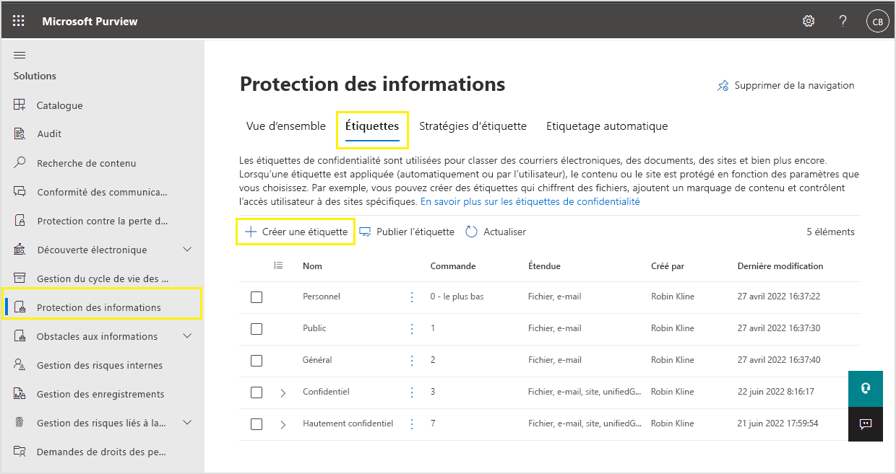

# <a name="create-and-configure-sensitivity-labels-and-their-policies"></a>Créer et configurer des étiquettes de confidentialité et leurs stratégies.

>*[Guide de sécurité et conformité pour les licences Microsoft 365](/office365/servicedescriptions/microsoft-365-service-descriptions/microsoft-365-tenantlevel-services-licensing-guidance/microsoft-365-security-compliance-licensing-guidance).*

L'ensemble des solutions Microsoft Information Protection (parfois sous la forme abrégée MIP) sont mises en œuvre à l’aide d’[étiquettes de confidentialité](sensitivity-labels.md). Pour créer et publier ces étiquettes, accédez au <a href="https://go.microsoft.com/fwlink/p/?linkid=2077149" target="_blank">Centre de conformité Microsoft 365</a>. Vous pouvez également utiliser l’ancien portail, le Centre de sécurité et conformité Office 365.

Commencez par créer et configurer les étiquettes de confidentialité que vous souhaitez rendre disponibles pour les applications et autres services. Par exemple, les étiquettes que vous voulez que les utilisateurs voient et appliquent à partir des applications Office. 

Puis créez une ou plusieurs stratégies d’étiquette contenant les étiquettes et paramètres de stratégie que vous configurez. La stratégie d’étiquette publie en effet les étiquettes et paramètres pour les utilisateurs et emplacements que vous sélectionnez.

## <a name="before-you-begin"></a>Avant de commencer

L’administrateur général de votre organisation dispose des autorisations totales pour créer et gérer tous les aspects des étiquettes de confidentialité. Si vous ne vous connectez pas en tant qu’administrateur général, voir [Autorisations nécessaires pour créer et gérer des étiquettes de confidentialité](get-started-with-sensitivity-labels.md#permissions-required-to-create-and-manage-sensitivity-labels).

## <a name="create-and-configure-sensitivity-labels"></a>Créer et configurer des étiquettes de confidentialité

1. Dans le [Centre de conformité Microsoft 365](https://compliance.microsoft.com/), sélectionnez **Solutions** > **Informations Protection**
    
    Si vous ne voyez pas immédiatement cette option, sélectionnez tout d’abord **Tout afficher**.

2. Dans la page **étiquettes** , sélectionnez **+ Créer une étiquette** pour démarrer la nouvelle configuration d’étiquette de confidentialité. 

    Par exemple, dans le Centre de conformité Microsoft 365 :

    

    > [!NOTE]
    > Par défaut, les clients n’ont pas d’étiquettes. Vous devez alors en créer. Les étiquettes de l’exemple d’image montrent les étiquettes par défaut qui ont été [déplacées à partir d’Azure Information Protection](/azure/information-protection/configure-policy-migrate-labels).

3. Sur la page **Définir l’étendue de cette étiquette**, les options sélectionnées déterminent l’étendue de l’étiquette pour les paramètres que vous pouvez configurer et l’emplacement où ils seront visibles lors de la publication :

    

    - Si **Fichiers et e-mails** est sélectionné, vous pouvez configurer les paramètres qui s’appliquent aux applications qui prennent en charge les étiquettes de confidentialité, telles qu’Office Word et Outlook. Si cette option n’est pas sélectionnée, vous verrez la première page de ces paramètres, mais vous ne pourrez pas les configurer et les étiquettes ne seront pas disponibles à la sélection pour les utilisateurs dans ces applications.

    - Si **Groupes et sites** est sélectionné, vous pouvez configurer les paramètres qui s’appliquent aux groupes Microsoft 365 et aux sites pour Teams et SharePoint. Si vous n’avez pas sélectionné cette option, vous verrez la première page de ces paramètres, mais vous ne pourrez pas les configurer et les utilisateurs ne pourront pas sélectionner étiquettes pour les groupes et le site.

    Pour plus d’informations sur les ressources de données **schématisées** étendue, consultez [Étiqueter automatiquement votre contenu dans Azure Purview](/azure/purview/create-sensitivity-label).

4. Suivez les invites de configuration pour les paramètres d’étiquette.

    Pour plus d’informations sur les paramètres d’étiquette, voir [Fonction des étiquettes de confidentialité](sensitivity-labels.md#what-sensitivity-labels-can-do) à partir des informations générales et utilisez l’aide de l’UI pour les paramètres individuels.

5. Répétez ces étapes pour créer d’autres étiquettes. Toutefois, si vous voulez créer une sous-étiquette, commencez par sélectionner l’étiquette parent, puis **...** pour **Plus d’actions**, enfin **Ajouter une sous-étiquette**.

6. Lorsque vous avez créé les étiquettes dont vous avez besoin, vérifiez leur ordre et déplacez-les vers le haut ou vers le bas si nécessaire. Pour modifier l’ordre d’une étiquette, sélectionnez **...** pour **Plus d’actions**, puis choisissez **Déplacer vers le haut** ou **Déplacer vers le bas**. Pour plus d’informations, voir [Priorité d'étiquette (trier les thèmes)](sensitivity-labels.md#label-priority-order-matters) dans les informations générales.

Pour modifier une étiquette existante, sélectionnez-la, puis choisissez le bouton **Modifier l'étiquette** :


Ce bouton démarre la configuration **Modifier l'étiquette de confidentialité**, vous permettant de modifier les paramètres d’étiquette à l’étape 4.

Ne supprimez pas une étiquette, sauf si vous comprenez l’impact pour les utilisateurs. Pour plus d’informations, consultez la section [Retrait et suppression d’étiquettes](#removing-and-deleting-labels). 

> [!NOTE]
> Si vous modifiez une étiquette, qui est déjà publiée, à l'aide d'une stratégie d'étiquette, aucune autre étape n'est nécessaire à la fin de la configuration. Par exemple, vous n’avez pas besoin de l’ajouter à une nouvelle stratégie d’étiquette pour que les modifications soient mises à disposition desdits utilisateurs. Veuillez toutefois patienter jusqu'à 24 heures pour que les modifications s’appliquent aux applications et aux services.

Les étiquettes sont disponibles dans des applications ou des services après les avoir publiées. Les étiquettes doivent être [ajoutées à une stratégie d'étiquette](#publish-sensitivity-labels-by-creating-a-label-policy) pour être publiées.

> [!IMPORTANT]
> Dans l'onglet **Étiquettes**, ne pas sélectionner l'onglet **Publier des étiquettes** (ou le bouton **Publier une étiquette** lorsque vous modifiez une étiquette), sauf si vous devez créer une nouvelle stratégie d'étiquette. Plusieurs stratégies d’étiquette sont nécessaires uniquement si les utilisateurs ont besoin d’étiquettes ou de paramètres de stratégie différents. Votre objectif est d’avoir autant de stratégies d’étiquettes que possible, mais il n’est pas rare de n’avoir qu’une seule stratégie d’étiquette par organisation.

### <a name="additional-label-settings-with-security--compliance-center-powershell"></a>Paramètres d’étiquette supplémentaires dans le Centre de sécurité et conformité PowerShell

D’autres paramètres d’étiquette sont disponibles dans l’applet de commande [Set-Label](/powershell/module/exchange/set-label) depuis le [Centre de sécurité et conformité PowerShell](/powershell/exchange/scc-powershell).

Par exemple :

- Utilisez le paramètre *LocaleSettings* pour des déploiements internationaux pour que les utilisateurs voient le nom de l’étiquette et l’info-bulle dans leur langue locale. La [section suivante](#example-configuration-to-configure-a-sensitivity-label-for-different-languages) présente un exemple de configuration qui spécifie le nom de l’étiquette et le texte d’info-bulle pour le français, l’italien et l’allemand.

- Le client d’étiquetage unifié Azure Information Protection prend en charge une liste complète de [paramètres avancés](/azure/information-protection/rms-client/clientv2-admin-guide-customizations) qui incluent la définition d’une couleur d’étiquette et l’application d’une propriété personnalisée lorsqu’une étiquette est appliquée. Si vous souhaitez obtenir la liste complète, veuillez consulter la rubrique [Paramètres avancés disponibles pour les étiquettes](/azure/information-protection/rms-client/clientv2-admin-guide-customizations#available-advanced-settings-for-labels) depuis le guide d’administration de ce client.

#### <a name="example-configuration-to-configure-a-sensitivity-label-for-different-languages"></a>Exemple de configuration d'une étiquette de confidentialité dans différentes langues

L’exemple suivant illustre la configuration PowerShell pour une étiquette intitulée « Public » avec un espace réservé au texte pour l’info-bulle. Dans cet exemple, le nom de l’étiquette et le texte d’info-bulle sont configurés pour le français, l'italien et l'allemand.

Suite à cette configuration, les utilisateurs disposant d'applications Office qui utilisent ces langues d’affichage voient leur nom d’étiquette et les info-bulles dans la même langue. De même, si votre client de l'étiquetage unifié Azure Information Protection est installé pour étiqueter des fichiers à partir de l’Explorateur de fichiers, les utilisateurs qui ont accès à ces versions linguistiques de Windows peuvent voir leurs noms d’étiquette et info-bulle dans leur langue locale lorsqu’ils effectuent des clics avec le bouton droit pour l’étiquetage.

Pour les langues que vous devez prendre en charge, utilisez les [identificateurs de langue](/deployoffice/office2016/language-identifiers-and-optionstate-id-values-in-office-2016#language-identifiers) d'Office (également appelés balises linguistiques), et spécifiez votre propre traduction pour le nom d’étiquette et l’info-bulle.

Avant d’exécuter les commandes dans PowerShell, vous devez tout d’abord vous [connecter au Centre de sécurité et conformité PowerShell](/powershell/exchange/connect-to-scc-powershell).

```powershell
$Languages = @("fr-fr","it-it","de-de")
$DisplayNames=@("Publique","Publico","Oeffentlich")
$Tooltips = @("Texte Français","Testo italiano","Deutscher text")
$label = "Public"
$DisplayNameLocaleSettings = [PSCustomObject]@{LocaleKey='DisplayName';
Settings=@(
@{key=$Languages[0];Value=$DisplayNames[0];}
@{key=$Languages[1];Value=$DisplayNames[1];}
@{key=$Languages[2];Value=$DisplayNames[2];})}
$TooltipLocaleSettings = [PSCustomObject]@{LocaleKey='Tooltip';
Settings=@(
@{key=$Languages[0];Value=$Tooltips[0];}
@{key=$Languages[1];Value=$Tooltips[1];}
@{key=$Languages[2];Value=$Tooltips[2];})}
Set-Label -Identity $Label -LocaleSettings (ConvertTo-Json $DisplayNameLocaleSettings -Depth 3 -Compress),(ConvertTo-Json $TooltipLocaleSettings -Depth 3 -Compress)
```

## <a name="publish-sensitivity-labels-by-creating-a-label-policy"></a>Publier des étiquettes de confidentialité en créant une stratégie d’étiquette

1. Dans le [Centre de conformité Microsoft 365](https://compliance.microsoft.com/), sélectionnez **Solutions** > **Informations Protection**
    
    Si vous ne voyez pas immédiatement cette option, sélectionnez tout d’abord **Tout afficher**.

2. Sélectionnez **l’onglet Stratégies** d’étiquette, puis **Publiez** l’étiquette pour démarrer la configuration **de la stratégie** :

    Par exemple, dans le Centre de conformité Microsoft 365 :

    

    > [!NOTE]
    > Par défaut, les clients n’ont pas de stratégies d’étiquette. Vous devez alors créer. 

3. Dans la **Choisissez des étiquettes de confidentialité pour publier** page, sélectionnez le **Choisir les étiquettes de confidentialité pour publier** lien. Sélectionnez les étiquettes que vous souhaitez rendre disponibles dans les applications et les services, puis choisissez **Ajouter**.

    > [!IMPORTANT]
    > Si vous sélectionnez une sous-étiquette, assurez-vous de sélectionner également son étiquette parente.

4. Vérifiez les étiquettes sélectionnées et, pour apporter toute modification, sélectionnez **Modifier**. Sinon, sélectionnez **Suivant**.

5. Suivez les invites pour configurer les paramètres de stratégie.

    Les paramètres de stratégie qui s’affichent correspondent à l’étendue des étiquettes que vous avez sélectionnées. Par exemple, si vous avez sélectionné des étiquettes dont l’étendue est uniquement **Fichiers et e-mails**, vous ne voyez pas les paramètres de stratégie **Appliquer cette étiquette par défaut aux groupes et sites** et **Demander aux utilisateurs d’appliquer une étiquette à leurs groupes et sites**.

    Si vous souhaitez en savoir plus sur ces paramètres, veuillez consulter la rubrique [Fonction des stratégies d’étiquette](sensitivity-labels.md#what-label-policies-can-do) depuis les informations générales, puis utiliser l’aide de l’Assistant pour les paramètres individuels.

    Pour les étiquettes configurées pour les **actifs Azure Purview (préversion)** : ces étiquettes n’ont pas de paramètres de stratégie associés.

6. Répétez ces étapes si vous avez besoin d'autres paramètres de stratégie pour des utilisateurs ou des étendues différents. Par exemple, vous souhaitez employer d’autres étiquettes pour un groupe d’utilisateurs, ou une étiquette par défaut différente pour un sous-ensemble d’utilisateurs. Ou, si vous avez configuré des étiquettes avec des étendues différentes.

7. Si vous créez plusieurs stratégies d’étiquette pouvant entraîner un conflit pour un utilisateur, vérifiez l’ordre des stratégies et, le cas échéant, déplacez-les vers le haut ou vers le bas. Pour modifier l’ordre d’une stratégie d'étiquette, sélectionnez **...** pour **Plus d’actions**, puis choisissez **Déplacer vers le haut** ou **Déplacer vers le bas**. Pour plus d’informations, voir [Priorité de stratégie d'étiquette (trier les thèmes)](sensitivity-labels.md#label-policy-priority-order-matters) dans les informations générales.

L’exécution de la **Créer une stratégie** la configuration publie automatiquement la stratégie d’étiquette. Pour apporter des modifications à une stratégie publiée, il vous suffit la modifier. Vous ne devez sélectionner aucune action de publication ou de republication spécifique.

Pour modifier une stratégie d'étiquette existante, sélectionnez-la, puis choisissez le bouton **Modifier la stratégie** : 


Ce bouton démarre la **Créer une stratégie** configuration, ce qui vous permet de modifier les étiquettes incluses et les paramètres d’étiquette. Une fois la configuration terminée, toutes les modifications sont automatiquement répliquées vers les utilisateurs et services sélectionnés.

Lorsque vous utilisez l’étiquette intégrée pour les applications Office sur Windows, macOS, iOS et Android, les utilisateurs voient de nouvelles étiquettes dans un délai de quatre heures et dans un délai d’une heure pour Word, Excel et PowerPoint sur le web lorsque vous actualisez le navigateur. Veuillez toutefois patienter jusqu'à 24 heures pour que les modifications s’appliquent aux applications et aux services.

La mise à jour d’autres applications et services prenant en charge les étiquettes de confidentialité peut intervenir plus souvent que 24 heures avec leurs propres calendriers et déclencheurs de mise à jour pour les mises à jour de stratégie. Consultez leur documentation pour plus de détails. Par exemple, pour le client de l’étiquetage unifié d’Azure Information Protection, consultez la ligne **Mise à jour de stratégie** dans le tableau des [Comparaisons détaillées pour les clients Azure Information Protection](/azure/information-protection/rms-client/use-client#detailed-comparisons-for-the-azure-information-protection-clients).

> [!TIP]
> N’oubliez pas de prendre en compte les dépendances de minutage qui peuvent parfois retarder le fonctionnement des étiquettes de confidentialité et des stratégies d’étiquette. Par exemple, le remplissage d’un nouveau groupe et les modifications d’appartenance au groupe, la latence de réplication réseau et les restrictions de bande passante, et [mise en cache de l’appartenance au groupe par le service Azure Information Protection](/azure/information-protection/prepare#group-membership-caching-by-azure-information-protection) pour les étiquettes qui appliquent le chiffrement.
> 
> Avec de nombreuses dépendances externes qui ont chacune leurs propres cycles de minutage, il ’ est judicieux d’attendre 24 heures avant de passer du temps à dépanner les étiquettes et les stratégies d’étiquette pour les modifications récentes.

### <a name="additional-label-policy-settings-with-security--compliance-center-powershell"></a>Paramètres de stratégie d’étiquette supplémentaires dans le Centre de sécurité et conformité PowerShell

Des paramètres de stratégie d’étiquette supplémentaires sont disponibles dans l’applet de commande [Set-LabelPolicy](/powershell/module/exchange/set-labelpolicy) depuis le [Centre de sécurité et conformité PowerShell](/powershell/exchange/scc-powershell).

Le client de l’étiquetage unifié d’Azure Information Protection prend en charge de nombreux [paramètres avancés](/azure/information-protection/rms-client/clientv2-admin-guide-customizations), notamment la migration depuis d’autres solutions d’étiquetage et les messages contextuels dans Outlook qui avertissent, justifient ou bloquent l’envoi d’e-mails. Pour obtenir la liste complète, voir [Paramètres avancés disponibles pour les stratégies d’étiquette](/azure/information-protection/rms-client/clientv2-admin-guide-customizations#available-advanced-settings-for-label-policies) depuis le guide d’administration de ce client.

## <a name="use-powershell-for-sensitivity-labels-and-their-policies"></a>Utiliser PowerShell pour les étiquettes de confidentialité ainsi que leurs stratégies

Vous pouvez désormais utiliser l’[Interface PowerShell du Centre de sécurité et conformité](/powershell/exchange/scc-powershell) pour créer et configurer tous les paramètres que vous pouvez voir dans le centre d’administration pour les étiquettes. Cela signifie qu’outre l’utilisation de PowerShell pour les paramètres qui ne sont pas disponibles dans les centres d’administration pour les étiquettes, vous pouvez désormais créer des scripts pour la création et la maintenance des étiquettes de confidentialité et des stratégies d’étiquette de confidentialité. 

Consultez la documentation ci-après relative aux paramètres et valeurs pris en charge :

- [New-Label](/powershell/module/exchange/new-label)
- [New-LabelPolicy](/powershell/module/exchange/new-labelpolicy)
- [Set-Label](/powershell/module/exchange/set-label)
- [Set-LabelPolicy](/powershell/module/exchange/set-labelpolicy)

Vous pouvez également utiliser [Remove-Label](/powershell/module/exchange/remove-label) et [Remove-LabelPolicy](/powershell/module/exchange/remove-labelpolicy) si vous devez créer un script pour la suppression d’étiquettes de confidentialité ou de stratégies d’étiquette de confidentialité. Toutefois, nous vous conseillons de lire la section suivante avant de supprimer des étiquettes de confidentialité.

## <a name="removing-and-deleting-labels"></a>Retrait et suppression d’étiquettes

Dans un environnement de production, il est peu probable que vous deviez supprimer des étiquettes de confidentialité d’une stratégie d’étiquette ou supprimer des étiquettes de confidentialité. Il est possible que vous deviez effectuer l’une ou l’autre de ces actions pendant une phase de test initiale. Assurez-vous de comprendre ce qui se passe lorsque vous effectuez l’une ou l’autre de ces actions.

La retrait d’une étiquette d’une stratégie d’étiquette est moins risquée que sa suppression, et vous pouvez toujours l’ajouter à une stratégie d’étiquette ultérieurement si nécessaire :

- Lorsque vous retirez une étiquette d’une stratégie d’étiquette afin que l’étiquette ne soit plus publiée aux utilisateurs spécifiés à l’origine, la prochaine fois que la stratégie d’étiquette est actualisée, les utilisateurs ne verront plus cette étiquette pour les sélectionner dans leur application Office. En revanche, si l’étiquette a été appliquée aux documents ou aux courriers électroniques, elle n’est pas retirée de ce contenu. Tout chiffrement appliqué par l’étiquette est conservé et le modèle de protection sous-jacent reste publié. 

- Pour les étiquettes retirées mais qui ont été précédemment appliquées au contenu, les utilisateurs qui utilisent l’étiquetage prédéfini pour Word, Excel et PowerPoint affichent tout de même le nom d’étiquette appliqué dans la barre d’État. De même, les étiquettes qui ont été retirées et qui ont été appliquées aux sites SharePoint affichent encore le nom de l’étiquette dans la colonne **Sensibilité**.

Par comparaison, lorsque vous supprimez une étiquette :

- Si l’étiquette a appliqué le chiffrement, le modèle de protection sous-jacent est archivé de sorte que le contenu précédemment protégé puisse rester ouvert. En raison de ce modèle de protection archivé, vous ne pouvez pas créer de nouvelle étiquette portant le même nom. Bien qu’il soit possible de supprimer un modèle de protection à l’aide de [PowerShell](/powershell/module/aipservice/remove-aipservicetemplate), ne procédez pas de la sorte, sauf si vous êtes sûr que vous n’avez pas besoin d’ouvrir le contenu chiffré avec le modèle archivé.

- Pour les applications de bureau : les informations d’étiquette sont conservées dans les métadonnées, mais étant donné qu’un ID d’étiquette vers un mappage de nom n’est plus possible, les utilisateurs ne voient pas le nom d’étiquette appliqué affiché (par exemple, dans la barre d’État) de sorte que le contenu ne soit pas étiqueté. Si l’étiquette a appliqué le chiffrement, le chiffrement reste et une fois le contenu ouvert, les utilisateurs voient toujours le nom et la description du modèle de protection désormais archivé.

- Pour Office sur le Web : les utilisateurs ne voient pas le nom de l’étiquette sur la barre d’état ni dans la colonne **Sensibilité**. Les informations d’étiquette dans les métadonnées restent uniquement si l’étiquette n’applique pas le chiffrement. Si l’étiquette a appliqué le chiffrement et que vous avez activé des [étiquettes de confidentialité pour SharePoint et OneDrive](sensitivity-labels-sharepoint-onedrive-files.md), les informations d’étiquette dans les métadonnées sont supprimées et le chiffrement est supprimé. 

Lorsque vous supprimez une étiquette de confidentialité d’une stratégie d’étiquette, ou supprimez une étiquette de confidentialité, la réplication de ces modifications peut prendre jusqu’à 24 heures pour tous les utilisateurs et services.

## <a name="next-steps"></a>Étapes suivantes

Pour configurer et utiliser vos étiquettes de confidentialité pour des scénarios déterminés, servez-vous des articles suivants :

- [Restreindre l’accès au contenu à l’aide du chiffrement dans les étiquettes de niveau de confidentialité](encryption-sensitivity-labels.md)

- [Appliquer automatiquement une étiquette de confidentialité au contenu](apply-sensitivity-label-automatically.md)

- [Utiliser des étiquettes de confidentialité avec les équipes, les groupes et les sites](sensitivity-labels-teams-groups-sites.md)

- [Activer les étiquettes de confidentialité pour les fichiers Office dans SharePoint et OneDrive](sensitivity-labels-sharepoint-onedrive-files.md)

Si vous souhaitez surveiller le mode d’utilisation de vos étiquettes, veuillez consulter la rubrique [Prise en main de la classification des données](data-classification-overview.md).
