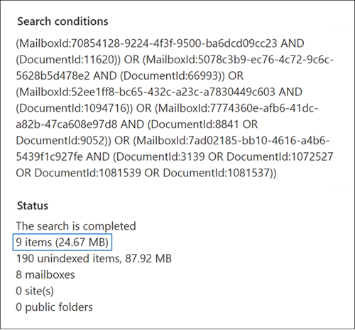

# Préparer un fichier CSV pour une recherche de contenu de liste d’ID

Vous pouvez rechercher des messages électroniques de boîte aux lettres spécifiques et d’autres éléments de boîte aux lettres à l’aide d’une liste Exchange ID de boîte aux lettres. Pour créer une recherche de liste d'identification, vous soumettez un fichier CSV (valeur séparée par des virgules) qui identifie les éléments spécifiques de la boîte aux lettres à rechercher. Pour ce fichier CSV, vous utilisez le fichier **Results.csv** ou le fichier Items.csv **nonndexé** inclus lorsque vous exportez les résultats de recherche de contenu ou exportez un rapport de recherche de contenu à partir d’une recherche de contenu existante. Ensuite, vous modifiez l’un de ces fichiers pour indiquer les éléments spécifiques à rechercher, créez une recherche de liste d’ID et soumettez le fichier CSV.

**Pourquoi créer une recherche de liste d’ID ?** Si vous ne parvenez pas à déterminer si un élément répond à une demande eDiscovery en fonction des métadonnées dans les fichiers **Results.csv** ou **non** Items.csv, vous pouvez utiliser une recherche de liste d’ID pour rechercher, afficher un aperçu, puis exporter cet élément pour déterminer s’il répond au cas que vous examinez. Les recherches de liste d’ID sont généralement utilisées pour rechercher et renvoyer un ensemble spécifique d’éléments nonndex.

Voici une vue d’ensemble rapide du processus de création d’une recherche de liste d’ID.

1. Créez et exécutez une nouvelle recherche dans le Centre de conformité Microsoft 365.

2. Exporter les résultats de recherche de contenu ou le rapport de recherche de contenu. Pour plus d'informations, voir :

    - [Exporter les résultats de la recherche de contenu](export-search-results.md)

    - [Exporter un rapport de recherche de contenu](export-a-content-search-report.md)

3. Modifiez **leResults.csv** fichier  ou le fichier Items.csvnon non Items.csvet identifiez les éléments de boîte aux lettres spécifiques à inclure dans la recherche de liste d’ID. Consultez [les instructions de](#prepare-the-csv-file-for-an-id-list-search) préparation d’un fichier CSV pour une recherche de liste d’ID.

4. Créez une recherche de liste d’ID (voir [les instructions)](#create-an-id-list-search)et soumettez le fichier CSV que vous avez préparé. La requête de recherche créée recherche uniquement les éléments sélectionnés dans le fichier CSV.

> [!NOTE]
> Les recherches de liste d’ID sont uniquement pris en charge pour les éléments de boîte aux lettres. Vous ne pouvez pas rechercher d’SharePoint et OneDrive documents dans une recherche de liste d’ID.

## Préparer le fichier CSV pour une recherche de liste d’ID

Après avoir exporté les résultats de recherche ou le rapport pour une recherche, effectuez les étapes suivantes pour préparer le fichier CSV pour une recherche de liste d’ID. Ce fichier CSV identifie chaque élément de la recherche de liste d’ID.

Vous pouvez utiliser un fichier CSV à partir d’une recherche qui incluait des sites SharePoint et des comptes OneDrive, mais vous pouvez uniquement sélectionner des éléments de boîte aux lettres pour une recherche de liste d’ID. Si vous sélectionnez un document dans SharePoint ou OneDrive, la validation du fichier CSV échoue lorsque vous créez une recherche de liste d’ID.

1. Ouvrez **leResults.csv** **fichier** Items.csvnon Excel.

2. Dans la **colonne Sélectionnée,** tapez **Oui** dans la cellule qui correspond à l’élément que vous souhaitez rechercher. Répétez cette étape pour chaque élément que vous souhaitez rechercher.

    > [!IMPORTANT]
    > Lorsque vous ouvrez le fichier CSV dans Excel, le format de données de la colonne **ID** de document a peut-être été modifié en **Général**. Cela entraîne l’affichage de l’ID de document pour un élément en notation scientifique. Par exemple, l’ID de document de « 481037338205 » s’affiche sous la mesure « 4.81037E+11 ». Si cela se produit, vous devez effectuer les étapes suivantes  pour modifier le format de données de la colonne **ID** de document en numéro afin de restaurer le format correct pour l’ID de document. Si vous ne le faites pas, la recherche de liste d’ID qui utilise le fichier CSV échoue.

3. Cliquez avec le bouton droit sur **l’intégralité de** la colonne ID de document et **sélectionnez Format de cellule.**

4. Dans la **zone Catégorie,** cliquez sur **Numéro**.

5. Modifiez le nombre de décimales sur **0,** puis cliquez sur **OK** pour enregistrer vos modifications. Notez que les valeurs de la colonne ID de document sont modifiées en nombres.

    Voici un exemple de fichier CSV prêt à être envoyé pour une recherche de contenu de liste d’ID.

    

6. Enregistrez le fichier CSV ou utilisez **Enregistrer sous** pour enregistrer le fichier avec un nom de fichier différent. Dans les deux cas, n’oubliez pas d’enregistrer le fichier au format CSV.

## Créer une recherche de liste d’ID

L’étape suivante consiste à créer une recherche de liste d’ID et à soumettre le fichier CSV que vous avez préparé à l’étape précédente.

> [!IMPORTANT]
> Vous devez créer une recherche de liste d’ID au plus 2 jours après l’exportation des résultats ou du rapport de recherche. Si les résultats ou le rapport de recherche exportés il y a plus de 2 jours, vous devez ré-exporter les résultats ou le rapport de recherche pour générer des fichiers CSV mis à jour. Vous pouvez ensuite préparer l’un des fichiers CSV mis à jour et l’utiliser pour créer une recherche de liste d’ID.

1. Accédez à <https://compliance.microsoft.com> et connectez-vous.

2. Dans le volet de navigation gauche du centre de conformité Microsoft 365, cliquez sur **Afficher tout** , puis sur **Recherche de contenu**.

3. Dans la page **de recherche de** contenu, cliquez sur Rechercher par liste **d’ID.**

4. Dans le programme volant Rechercher par **liste d’ID,** nommez  la recherche (et éventuellement décrivez-la), puis cliquez sur Parcourir et sélectionnez le fichier CSV que vous avez préparé à l’étape précédente.

    Microsoft 365 tente de valider le fichier CSV. Si la validation échoue, un message d’erreur s’affiche pour vous aider à résoudre les erreurs de validation. Le fichier CSV doit être validé avec succès pour créer une recherche de liste d’ID.

5. Une fois le fichier CSV validé, cliquez sur **Rechercher** pour créer la recherche de liste d’ID.

    Voici un exemple de page volante d’une recherche de liste d’ID qui affiche la requête générée et le nombre estimé de résultats de recherche.

    

    Le nombre d’éléments estimés affichés dans les statistiques pour la recherche d’ID doit correspondre au nombre d’éléments que vous avez sélectionnés dans le fichier CSV.

6. Afficher un aperçu ou exporter les éléments renvoyés par la recherche de liste d’ID.

## Plus d’informations

Si vous déplacez une boîte aux lettres après avoir créé une recherche de liste d’ID, la requête de recherche ne retourne pas les éléments spécifiés. Cela est dû au fait que la **propriété DocumentId** des éléments de boîte aux lettres est modifiée lorsqu’une boîte aux lettres est déplacée. Dans les rares cas où une boîte aux lettres est déplacée après avoir créé une recherche de liste d’ID, vous devez créer une recherche de contenu (ou mettre à jour les résultats de recherche pour une recherche existante), puis exporter les résultats ou le rapport de recherche pour générer des fichiers CSV mis à jour qui peuvent être utilisés pour créer une recherche de liste d’ID.
