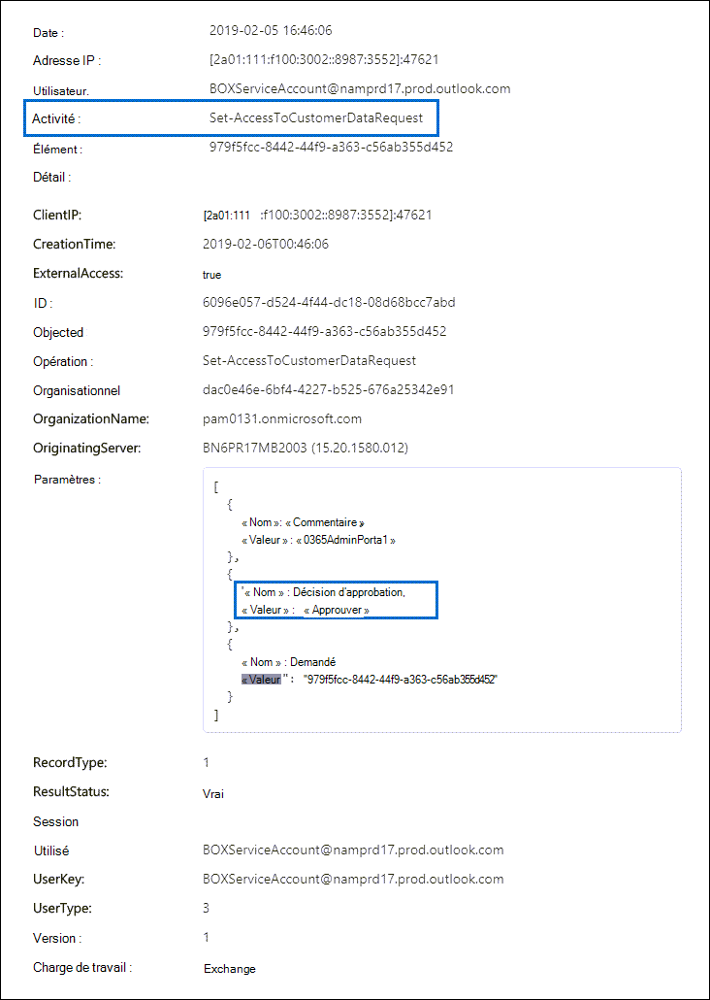

# Customer Lockbox dans Office 365

Cet article fournit des instructions de déploiement et de configuration pour Customer Lockbox. Customer Lockbox prend en charge les demandes d’accès aux données dans Exchange Online, SharePoint Online et OneDrive Entreprise. Pour recommander la prise en charge d’autres services, envoyez une [demande à Office 365 UserVoice](https://office365.uservoice.com/).

Pour voir les options de gestion des licences pour vos utilisateurs afin de bénéficier des offres de conformité Microsoft 365, y compris celle-ci, à compter du 1er avril 2020, consultez les conseils en matière de licences [Microsoft 365](/office365/servicedescriptions/microsoft-365-service-descriptions/microsoft-365-tenantlevel-services-licensing-guidance/microsoft-365-security-compliance-licensing-guidance)pour la conformité des & de sécurité.

Customer Lockbox garantit que Microsoft ne peut pas accéder à votre contenu pour effectuer une opération de service sans votre approbation explicite. Customer Lockbox vous permet d’accéder au flux de travail d’approbation pour les demandes d’accès à votre contenu.

Parfois, les ingénieurs Microsoft aident à résoudre les problèmes signalés par le client dans le processus de support. En règle générale, les problèmes sont résolus par le biais d’outils de télémétrie et de débogage étendus que Microsoft a mis en place pour ses services. Toutefois, dans certains cas, un ingénieur Microsoft doit accéder au contenu du client pour déterminer la cause première et résoudre le problème. Customer Lockbox nécessite l’intervention de l’ingénieur pour demander l’accès au client en tant que dernière étape du flux de travail d’approbation. Cela permet aux organisations d’approuver ou de refuser ces demandes et de fournir un contrôle d’accès direct au client.

### Vidéo de vue d’ensemble de Customer Lockbox

> [!VIDEO https://www.microsoft.com/videoplayer/embed/8fecf10b-1f03-4849-8b67-76d3d2a43f26?autoplay=false]

## Flux de travail Customer Lockbox

Les étapes suivantes décrivent le flux de travail classique lorsqu’un ingénieur Microsoft lance une demande Customer Lockbox :

1. Une personne d’une organisation connaît un problème avec sa boîte aux lettres Microsoft 365'utilisateur.

2. Une fois que l’utilisateur a dépanner le problème, mais qu’il ne peut pas le résoudre, il ouvre une demande de support auprès du Support Microsoft.

3. Un ingénieur du support Technique de Microsoft examine la demande de service et détermine la nécessité d’accéder au client de l’organisation pour réparer le problème dans Exchange Online.

4. L’ingénieur du support technique Microsoft se connecte à l’outil de demande Customer Lockbox et effectue une demande d’accès aux données qui inclut le nom du client de l’organisation, le numéro de demande de service et la durée estimée d’accès aux données par l’ingénieur.

5. Une fois la demande approuvée par le gestionnaire du support technique Microsoft, Customer Lockbox envoie à l’approbateur désigné dans l’organisation une notification par e-mail concernant la demande d’accès en attente de Microsoft.

    

   Toute personne à qui est attribué le rôle d’administrateur d’approbation d’accès Customer [Lockbox](/office365/admin/add-users/about-admin-roles) dans Microsoft 365 centre d’administration peut approuver les demandes Customer Lockbox.

6. L’approuveur se Microsoft 365 centre d’administration et approuve la demande. Cette étape déclenche la création d’un enregistrement d’audit disponible en effectuant une recherche dans le journal d’audit. Pour plus d’informations, [voir Auditer les demandes Customer Lockbox.](#auditing-customer-lockbox-requests)

   Si le client rejette la demande ou n’approuve pas la demande dans les 12 heures, la demande expire et aucun accès n’est accordé à l’ingénieur Microsoft.

   > [!IMPORTANT]
   > Microsoft n’inclut pas de liens dans les notifications par courrier électronique Customer Lockbox qui vous obligent à vous Office 365.

7. Après acceptation de la demande par l’approbateur de l’organisation, l’ingénieur Microsoft reçoit le message d’approbation, se connecte au client dans Exchange Online et corrige le problème rencontré par le client. Les ingénieurs Microsoft ont la durée demandée pour résoudre le problème après lequel l’accès est automatiquement révoqué.

> [!NOTE]
> Chaque action effectuée par un ingénieur Microsoft est enregistrée dans le journal d’audit. Vous pouvez rechercher et consulter ces enregistrements d’audit.

## Activer ou désactiver les demandes Customer Lockbox

Vous pouvez activer les contrôles Customer Lockbox dans le Centre d’administration Microsoft 365. Lorsque vous allumez Customer Lockbox, Microsoft doit obtenir l’approbation de votre organisation avant d’accéder au contenu de votre client.

1. À l’aide d’un compte scolaire ou scolaire où le rôle d’administrateur général ou d’approbation d’accès **Customer Lockbox** est attribué, accédez [https://admin.microsoft.com](https://admin.microsoft.com) à et connectez-vous.

2. Choose **Paramètres > Org Paramètres**.

3. Sélectionnez **Sécurité & Confidentialité** Customer  >  **Lockbox**  >  **Edit,**  puis déplacez le basculement sur Activer ou **Désactiver** pour activer ou désactiver la fonctionnalité.

    

## Approuver ou refuser une demande d’accès au Customer Lockbox

1. À l’aide d’un compte scolaire ou scolaire où le rôle d’administrateur général ou d’approbation d’accès **Customer Lockbox** est attribué, accédez [https://admin.microsoft.com](https://admin.microsoft.com) à et connectez-vous.

2. Choose **Support > Customer Lockbox Requests**.

    

    Une liste de demandes Customer Lockbox s’affiche.

    

3. Sélectionnez une demande Customer Lockbox, puis choisissez **Approuver** ou **Refuser.**

    

    Un message de confirmation concernant l’approbation de la demande Customer Lockbox s’affiche.

    

> [!NOTE]
> Utilisez la cmdlet Set-AccessToCustomerDataRequest pour approuver, refuser ou annuler les demandes de référentiel sécurisé du client Microsoft 365 qui contrôlent l’accès des ingénieurs de support Microsoft à vos données. Pour plus d’informations, [voir Set-AccessToCustomerDataRequest](/powershell/module/exchange/set-accesstocustomerdatarequest).

## Audit des demandes d’accès au Customer Lockbox

Les enregistrements d’audit qui correspondent aux demandes Customer Lockbox sont enregistrés dans le journal d’audit. Vous pouvez accéder à ces journaux à l’aide de l’outil de recherche du journal [d’audit](search-the-audit-log-in-security-and-compliance.md) dans le Centre de sécurité & conformité. Les actions liées à l’acceptation ou au refus d’une demande Customer Lockbox et les actions effectuées par les ingénieurs Microsoft (lorsque les demandes d’accès sont approuvées) sont également enregistrées dans le journal d’audit. Vous pouvez rechercher et consulter ces enregistrements d’audit.

### Rechercher dans le journal d’audit l’activité liée aux demandes Customer Lockbox

Avant de pouvoir utiliser le journal d’audit pour suivre des demandes d’accès Customer Lockbox, vous devez effectuer les étapes suivantes afin de configurer la journalisation d’audit. Pour plus d’informations, [consultez la recherche dans le journal d’audit dans](/office365/securitycompliance/search-the-audit-log-in-security-and-compliance#before-you-begin)le Centre de sécurité & conformité. Une fois l’installation terminée, utilisez les étapes suivantes pour créer une requête de recherche dans le journal d’audit afin de renvoyer les enregistrements d’audit liés à Customer Lockbox :

1. Accédez à [https://protection.office.com](https://protection.office.com).
  
2. Connectez-vous à l’aide de votre compte scolaire ou professionnel.

3. In the left pane of the Security & Compliance Center, choose **Search & investigation** audit log  >  **search**.

    La page **de recherche du journal d’audit** s’affiche.

    
  
4. Configurez les critères de recherche suivants : 

    1. **Activités :** laissez ce champ vide afin que la recherche renvoie des enregistrements d’audit pour toutes les activités. Cela est nécessaire pour retourner les enregistrements d’audit liés aux demandes Customer Lockbox et à l’activité correspondante effectuée par les ingénieurs Microsoft.

    1. **Date de début** et **date de fin** : sélectionnez une plage de dates et d’heures pour afficher les événements qui se sont produits au cours de cette période.

    1. **Utilisateurs** : laissez ce champ vide.

    1. **Fichier, dossier ou site** : laissez ce champ vide.

5. Cliquez sur **Rechercher** pour effectuer la recherche à l’aide de vos critères de recherche. 

    Les résultats de la recherche sont chargés et,  après quelques instants, ils sont affichés sous Résultats sur la page de recherche du **journal d’audit.**

6. Cliquez **sur Filtrer les** résultats sur la page des résultats de recherche et effectuer l’une des opérations suivantes :

   - Pour afficher les enregistrements d’audit liés à un approbateur dans votre organisation  approuvant ou refusant une demande Customer Lockbox : dans la zone sous la colonne Activité, tapez **Set-AccessToCustomerDataRequest**.

   - Pour afficher les enregistrements d’audit liés à un ingénieur Microsoft qui effectue des  actions en réponse à une demande d’accès au Customer Lockbox approuvée : dans la zone sous la colonne Utilisateur, tapez **Opérateur Microsoft**. La **colonne** Activité affiche l’action effectuée par l’ingénieur.

      

7. Dans la liste des résultats, cliquez sur un enregistrement d’audit pour l’afficher.

### Enregistrement d’audit pour une demande d’accès au Customer Lockbox

Lorsqu’une personne de votre organisation approuve ou refuse une demande Customer Lockbox, un enregistrement d’audit est enregistré dans le journal d’audit. L'enregistrement contient les informations suivantes.

| Propriété de l’enregistrement d’audit| Description|
|:---------- |:----------|
| Date       | La date et heure d’approbation ou de refus de la demande d’accès au Customer Lockbox.
| Adresse IP | L’adresse IP de l’ordinateur utilisé par l’approbateur pour approuver ou refuser une demande. |
| Utilisateur       | Le compte de service \[ \] BOXServiceAccount@.prod.outlook.com.            |
| Activité   | Set-AccessToCustomerDataRequest :il s’agit de l’activité d’audit enregistrée lorsque vous approuvez ou refusez une demande d’accès au Customer Lockbox.                                |
| Item       | Guid de la demande Customer Lockbox                             |

La capture d’écran suivante montre un exemple d’enregistrement du journal d’audit qui correspond à une demande Customer Lockbox approuvée. Si une demande Customer Lockbox a été refusée, la valeur du paramètre **ApprovalDecision** est **Deny**.

> [!TIP]
> Pour afficher des informations plus détaillées dans un enregistrement d’audit, cliquez **sur Plus d’informations.**

### L’enregistrement d’audit d’une action effectuée par un ingénieur Microsoft

Les actions effectuées par un ingénieur Microsoft après l’approbation d’une demande de Customer Lockbox (et qui peuvent entraîner l’accès au contenu client) sont enregistrées dans le journal d’audit. Ces enregistrements contiennent les informations suivantes.

| Propriété de l’enregistrement d’audit| Description|
|:---------- |:----------|
| Date       | Date et heure de l’action. Veuillez noter que l’heure d’exécution de cette action se situe dans les quatre heures qui suivent l’approbation de la demande d’accès au Customer Lockbox.              |
| Adresse IP | L’adresse IP de l’ordinateur utilisé par l’ingénieur Microsoft. |
| Utilisateur       | L’opérateur Microsoft : cette valeur indique que cet enregistrement est lié à une demande d’accès au Customer Lockbox.                                  |
| Activité   | Le nom de l’activité effectuée par l’ingénieur Microsoft.|
| Élément       | \<empty\>                                             |

## Foire aux questions

#### À quels services Microsoft 365 Customer Lockbox s’applique-t-il ?

Customer Lockbox est actuellement pris en charge dans Exchange Online, SharePoint Online et OneDrive Entreprise.

#### Customer Lockbox est-il disponible pour tous les clients ?

Customer Lockbox est inclus dans les abonnements Microsoft 365 ou Office 365 E5 et peut être ajouté à d’autres plans avec un abonnement de protection et conformité des informations ou de conformité avancée. Pour plus [d’informations, voir Plans et tarifs.](https://products.office.com/business/office-365-enterprise-e5-business-software)

#### Qu’est-ce que le contenu client ?

Le contenu client est les données créées par les utilisateurs Microsoft 365 services et applications. Les exemples de contenu client sont les suivants :

- Corps ou pièces jointes d’e-mails

- Contenu du site SharePoint

- Informations dans le corps d’un fichier SharePoint

- Skype Entreprise du fichier de présentation

- Messages instantanés (IM) ou conversations vocales

- Blob généré par le client ou données de stockage structurées (par exemple, les conteneurs SQL)

- Informations de sécurité appartenant au client (par exemple, certificats, clés de chiffrement et mots de passe)

- Inférences et toutes les inférences ultérieures, si le contenu client reste

Pour plus d’informations sur le contenu client dans Office 365, voir le [centre Office 365 de la confiance.](https://products.office.com/business/office-365-trust-center-privacy/)

#### Qui est averti lorsqu’il existe une demande d’accès à mon contenu ?

Les administrateurs globaux et toute personne affectée au rôle d’administrateur d’approbation d’accès Customer Lockbox sont avertis. Ce sont également les mêmes utilisateurs qui peuvent approuver les demandes Customer Lockbox.

#### Qui pouvez approuver ou rejeter ces demandes dans mon organisation ?

Les administrateurs globaux et toute personne affectée au rôle d’administrateur d’approbation d’accès Customer Lockbox peuvent approuver les demandes Customer Lockbox. Les clients contrôlent ces attributions de rôles dans leur organisation.

#### Comment choisir d’opter pour Customer Lockbox ?

Un administrateur général peut activer et configurer Customer Lockbox dans le centre d’administration Microsoft 365 ou Microsoft 365 client.

#### Si j’approuve une demande Customer Lockbox, que peut faire l’ingénieur et comment savoir ce qu’a fait l’ingénieur Microsoft ?

Une fois que vous avez approuvé une demande Customer Lockbox, l’ingénieur Microsoft a accordé ces privilèges nécessaires pour accéder au contenu client à l’aide d’cmdlets pré-approuvées. Les actions entreprises par les ingénieurs Microsoft en réponse aux demandes Customer Lockbox sont consignées et accessibles dans le journal d’audit du Centre de sécurité & conformité.

#### Comment savoir si Microsoft suit le processus d’approbation ?

Vous pouvez faire référence aux notifications d’approbation de courrier électronique envoyées aux administrateurs et aux approuveurs de votre organisation avec l’historique des demandes Customer Lockbox dans le Centre d’administration Microsoft 365 client.

Customer Lockbox est inclus dans le dernier rapport [d’audit SOC 1 SSAE 16.](https://servicetrust.microsoft.com/ViewPage/MSComplianceGuide?command=Download&downloadType=Document&downloadId=91592749-e86a-43ac-801e-121382614681&docTab=4ce99610-c9c0-11e7-8c2c-f908a777fa4d_SOC%20%2F%20SSAE%2016%20Reports) Pour plus d’informations, vous trouverez les derniers rapports dans le portail [d’confiance des services Microsoft.](https://servicetrust.microsoft.com/ViewPage/MSComplianceGuide?command=Download&downloadType=Document&downloadId=91592749-e86a-43ac-801e-121382614681&docTab=4ce99610-c9c0-11e7-8c2c-f908a777fa4d_SOC%20%2F%20SSAE%2016%20Reports)

#### Microsoft peut-il modifier la liste des approuveurs pour mon client ? Si ce n’est pas le cas, comment est-il interdit ?

Seul un administrateur général de votre organisation peut spécifier qui peut approuver les demandes Customer Lockbox. Cela signifie que seuls les membres du groupe Administrateur général dans Azure Active Directory peuvent spécifier qui peut approuver la demande. L’appartenance au groupe d’administrateurs Azure Active Directory est gérée uniquement par votre organisation.

#### Que se passe-t-il si j’ai besoin d’informations supplémentaires sur une demande d’accès au contenu pour l’approuver ?

Chaque demande Customer Lockbox contient un numéro Microsoft 365 de service. Vous pouvez contacter le Support Microsoft et référencer ce numéro de service pour obtenir plus d’informations sur la demande.

#### Lorsqu’une demande Customer Lockbox est approuvée, pendant combien de temps les autorisations sont-elles valides ?

Actuellement, la période maximale pour les autorisations d'accès accordées à l'ingénieur Microsoft est de 4 heures. L'ingénieur Microsoft peut également demander une période plus courte.

#### Comment puis-je obtenir un historique de toutes les demandes Customer Lockbox ?

Toutes les demandes Customer Lockbox sont vues dans le centre d’administration Microsoft 365 client.

#### Comment mettre en corrélation les demandes d’accès au contenu avec les journaux d’audit associés ?

Le flux d’activités du Centre de conformité contient les activités de journal de Customer Lockbox. Les clients peuvent faire référence aux activités du journal Customer Lockbox à partir du flux d’activités par rapport à la demande de courrier électronique qu’ils reçoivent.

#### Que se passe-t-il lorsqu’un client ne répond pas à une demande Customer Lockbox ?

Les demandes d’accès Customer Lockbox ont une durée par défaut de 12 heures. Si vous ne répondez pas à une demande dans un délai de 12 heures, la demande expire.

#### Que fait Microsoft lorsqu’un client rejette une demande Customer Lockbox ?

Si un client rejette une demande Customer Lockbox, aucun accès au contenu client ne se produit. Si un utilisateur de votre organisation continue de faire face à un problème de service qui oblige Microsoft à accéder au contenu du client pour résoudre le problème, le problème de service peut persister et Microsoft en informera l’utilisateur.

#### Customer Lockbox protège-t-il contre les demandes de données des organismes chargés de l’application de la loi ou d’autres tiers ?

Non. Microsoft prend au sérieux les demandes tierces pour les données client. En tant que fournisseur de services cloud, Microsoft fait toujours la défense de la confidentialité des données client. Dans le cas où nous obtenons une autorisation, Microsoft tente toujours de rediriger le tiers vers le client pour obtenir les informations. (Lisez le blog de Brad Smith : Protection des données client contre les espions du [gouvernement).](https://blogs.microsoft.com/blog/2013/12/04/protecting-customer-data-from-government-snooping/) Nous publions régulièrement [des informations détaillées](https://www.microsoft.com/corporate-responsibility/lerr) sur les demandes d’application de la loi reçues par Microsoft.

Pour plus d’informations, voir le Centre de gestion de la confidentialité [Microsoft](https://www.microsoft.com/trustcenter/default.aspx) concernant les demandes de données tierces et la section « Divulgation de données client » dans les conditions d’utilisation des [services](https://www.microsoft.com/Licensing/product-licensing/products.aspx) en ligne.

#### Comment Microsoft s’assure-t-il qu’un membre de son personnel n’a pas un accès permanent au contenu client dans Office 365 applications ?

Microsoft implémente des mesures préventives étendues par le biais de systèmes de contrôle d’accès et des mesures de témoin pour identifier et résoudre les tentatives de contournement de ces systèmes de contrôle d’accès. Microsoft 365 fonctionne avec les principes du moindre privilège et de l’accès juste-à-temps. Par conséquent, aucun personnel Microsoft n’a l’autorisation d’accéder régulièrement au contenu client. Si l’autorisation est accordée, elle est limitée. 

Microsoft 365 utilise un système de contrôle d’accès appelé *Lockbox* pour traiter les demandes d’autorisations qui accordent la possibilité d’effectuer des fonctions opérationnelles et administratives au sein du service. Un opérateur doit demander l’accès au contenu client à l’aide de Lockbox, ce qui nécessite ensuite qu’une deuxième personne prenne des mesures sur la demande (par exemple, l’approuver) avant d’accorder l’accès. Cette deuxième personne ne peut pas être le demandeur et doit être désignée pour approuver l’accès au contenu client. Ce n’est que si la demande est approuvée que l’opérateur acquiert un accès temporaire au contenu du client. Une fois la période d’élévation expirée, Lockbox révoque l’accès.

Pour plus [d’informations](https://www.microsoft.com/licensing/product-licensing/products) sur les pratiques générales de sécurité de Microsoft, reportez-vous aux Conditions d’accès aux services en ligne.

#### Dans quelles circonstances les ingénieurs Microsoft ont-ils besoin d’accéder à mon contenu ?

Le scénario le plus courant dans lequel les ingénieurs Microsoft ont besoin d’accéder au contenu client est lorsque le client effectue une demande de support nécessitant l’accès pour la résolution des problèmes. L’un des principes fondamentaux Microsoft 365 service fonctionne sans l’accès de Microsoft au contenu client. Presque toutes les opérations de service effectuées par Microsoft sont entièrement automatisées et l’implication humaine est hautement contrôlée et abstraite du contenu client. L’objectif de Microsoft 365'accès au contenu client pour prendre en charge le service n’est pas nécessaire tant que le client n’a pas approuvé une demande spécifique d’accès à Microsoft.

#### J’ai déjà pensé que mes données étaient sécurisées avec le cloud Microsoft, alors pourquoi ai-je besoin de Customer Lockbox ?

Customer Lockbox fournit une couche supplémentaire de contrôle en offrant aux clients la possibilité d’accorder une autorisation d’accès explicite pour les opérations de service. En montrant que des procédures sont en place pour l’autorisation d’accès aux données explicite, Customer Lockbox aide également les clients à respecter certaines obligations de conformité telles que HIPAA et FEDRAMP.