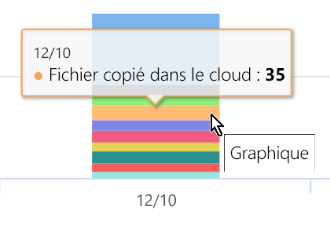

# Afficher l’activité sur votre contenu étiqueté (aperçu)

Les onglets vue d’ensemble de la classification des données et explorateur de contenu vous permettent de voir quel contenu a été découvert et étiqueté, ainsi que son emplacement. L’explorateur d’activité complète cette suite de fonctionnalités en vous permettant de contrôler les opérations effectuées avec votre contenu étiqueté. L’Explorateur d’activité permet de voir votre historique.

Vous pouvez filtrer les données par :

- plage de dates
- type d’activité
- emplacement
- utilisateur
- étiquette de confidentialité
- étiquette de rétention

Vous pouvez afficher les données sous la forme d’une liste ou d’un histogramme.

## Conditions préalables

Chaque compte accédant et utilisant l’Explorateur d’activités doit posséder une licence pour l’un de ces abonnements :

- Microsoft 365 (E5)
- Office 365 (E5)
- Complément Conformité avancée (E5)
- Complément Threat Intelligence avancé (E5)

## Type d’activité

Microsoft 365 contrôle et signale 12 types d’activités dans SharePoint Online, OneDrive et les points de terminaison. Les points de terminaison sont des appareils utilisateur exécutant Windows 10.

- Fichier créé
- Fichier modifié
- Fichier renommé
- Fichier copié dans le cloud
- Fichier consulté par une application non autorisée
- Fichier imprimé
- Fichier copié sur un support amovible
- Fichier copié sur le partage réseau
- Fichier lu
- Fichier copié dans le Presse-papiers
- Étiquette appliqué
- Étiquette modifiée (mise à niveau, rétrogradée ou supprimé)

L’intérêt de comprendre quelles actions sont accomplies avec votre contenu marqué par des étiquettes de confidentialité est de voir si les moyens de contrôle que vous avez déjà mis en place, comme les [stratégies de prévention de perte des données](data-loss-prevention-policies.md) sont efficaces ou non. Si ce n’est pas le cas ou si vous découvrez quelque chose d’inattendu tel qu’un grand nombre d’éléments qui sont étiquetés `highly confidential`et sont rétrogradés`general` vous pouvez gérer vos différentes stratégies et entreprendre de nouvelles actions pour limiter le comportement indésirable.

Une fois vos filtres définis, vous pouvez :

- pointer votre curseur sur un segment de l’histogramme pour afficher le nombre d’éléments inclus dans cette catégorie 
- exporter les données
- sélectionner un élément donné dans la liste et afficher les détails de l’action dans le menu volant

## Voir aussi
- [Étiquettes de confidentialité](sensitivity-labels.md)
- [Étiquettes de rétention](labels.md)
- [Éléments recherchés par les types d’informations sensibles](what-the-sensitive-information-types-look-for.md)
- [Vue d’ensemble des stratégies de rétention](retention-policies.md)
