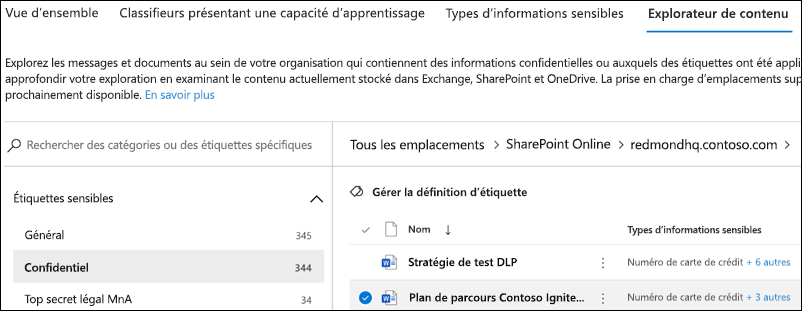
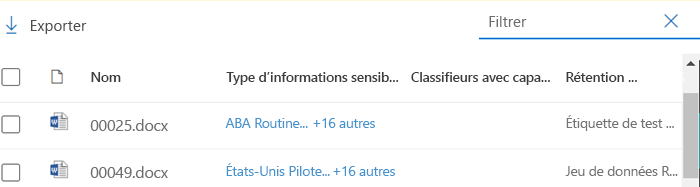

# Prise en main de l’explorateur de contenu

L’Explorateur de contenu de la classification des données vous permet d’afficher en mode natif les éléments qui ont été synthétisés dans la page vue d’ensemble.

## Configuration requise

Pour connaître les exigences en matière de licences, consultez [Information Protection : Analyse de classification des données : Vue d’ensemble du contenu et de l’Explorateur d’activités](/office365/servicedescriptions/microsoft-365-service-descriptions/microsoft-365-tenantlevel-services-licensing-guidance/microsoft-365-security-compliance-licensing-guidance#information-protection-data-classification-analytics-overview-content--activity-explorer)

### Autorisations

Pour accéder à l’onglet Explorateur de contenu, un compte doit être affecté à une appartenance dans l’un de ces rôles ou groupes de rôles. 

**Groupes de rôles Microsoft 365**

- Administrateur général
- Administrateur de conformité
- Administrateur de sécurité
- Administrateur de conformité des données

> [!IMPORTANT]
> L’appartenance à ces groupes de rôles ne vous permet pas d’afficher la liste des éléments ou le contenu des éléments dans l’explorateur de contenu.

> [!IMPORTANT]
> Seuls les administrateurs généraux peuvent gérer ou attribuer des autorisations à d’autres utilisateurs dans le Centre de conformité. Pour plus de détails, voir [Autoriser l’accès des utilisateurs au Centre de sécurité et conformité](../security/office-365-security/grant-access-to-the-security-and-compliance-center.md).
> 
### Autorisations requises pour accéder aux éléments dans l’explorateur de contenu

L’accès à l’explorateur de contenu est fortement restreint, car il vous permet de lire le contenu de fichiers numérisés.

> [!IMPORTANT]
> Ces autorisations remplacent les autorisations attribuées localement aux éléments, ce qui permet d’afficher le contenu. 

Il existe deux rôles qui accordent l’accès à l’Explorateur de contenu via le <a href="https://go.microsoft.com/fwlink/p/?linkid=2173597" target="_blank">Centre de conformité Microsoft 365</a> :

- **Visionneuse de contenu de l’Explorateur de contenu** : l’appartenance à ce groupe de rôles vous permet d’afficher le contenu de chaque élément de la liste. Le rôle `data classification list viewer` a été pré-attribué à ce groupe de rôles.

- **Visionneuse de contenu de l’Explorateur de contenu** : l’appartenance à ce groupe de rôles vous permet d’afficher le contenu de chaque élément de la liste. Le rôle `data classification content viewer` a été pré-attribué à ce groupe de rôles.

Le compte que vous utilisez pour accéder à l’Explorateur de contenu doit se trouver dans l’un des groupes de rôles ou les deux. Il s’agit de groupes de rôles indépendants qui ne sont pas cumulatifs. Par exemple, si vous voulez accorder à un compte la possibilité d’afficher les éléments et leur emplacement uniquement, attribuez des droits à la visionneuse de liste de l’Explorateur de contenu. Si vous souhaitez que ce même compte puisse également afficher le contenu des éléments de la liste, vous pouvez également octroyer des droits de visionneuse de contenu dans l’Explorateur de contenu.

Vous pouvez également attribuer l’un ou l’autre des rôles (ou les deux) à un groupe de rôles personnalisé afin de personnaliser l’accès à l’Explorateur de contenu.

Un administrateur général peut attribuer la Visionneuse de liste de l’Explorateur de contenus nécessaire et l'appartenance au groupe de rôles Visionneur de contenus/Explorateur de contenus.

#### Rôles et groupes de rôles en préversion

Il existe des rôles et des groupes de rôles en préversion que vous pouvez tester pour affiner vos contrôles d’accès.

Voici une liste des rôles Microsoft Information Protection (MIP) qui sont en préversion. Pour en savoir plus sur ces rôles, consultez [Rôles dans le Centre de sécurité et de conformité](../security/office-365-security/permissions-in-the-security-and-compliance-center.md#roles-in-the-security--compliance-center)

- Administrateur Information Protection
- Analyste Information Protection
- Enquêteur Information Protection
- Lecteur Information Protection

Voici une liste des groupes de rôles MIP en prévisualisation. Pour en savoir plus sur ces groupes, consultez [Groupes de rôles dans le Centre de sécurité et de conformité](../security/office-365-security/permissions-in-the-security-and-compliance-center.md#role-groups-in-the-security--compliance-center)

- Protection des informations
- Administrateurs Information Protection
- Analystes Information Protection
- Enquêteurs Information Protection
- Lecteurs Information Protection

## Explorateur de contenu

L’Explorateur de contenu présente un instantané actuel des éléments qui ont une étiquette de confidentialité, une étiquette de rétention ou ont été classés comme un type d’informations sensibles au sein de votre organisation.

### Types d’informations sensibles

Une [stratégie DLP](dlp-learn-about-dlp.md) peut aider à protéger les informations sensibles, définies selon des type d’**informations sensibles**. Microsoft 365 inclut des [définitions pour de nombreux types d’informations sensibles courantes](sensitive-information-type-entity-definitions.md) de nombreuses régions différentes qui sont prêtes à être utilisées. Par exemple, un numéro de carte de crédit, des numéros de compte bancaire, des numéros de carte d’identité nationale et des numéros de service Windows Live ID.

### Étiquettes de confidentialité

Une [étiquette de confidentialité](sensitivity-labels.md) est tout simplement une balise qui indique la valeur de l’élément pour votre organisation. Elle peut être appliquée manuellement ou automatiquement. Une fois appliquée, l'étiquette est intégrée au document et le suit où qu’il aille. L’étiquette de confidentialité permet d’appliquer différents comportements de protection, tels que le filigrane ou le chiffrement obligatoires.

Les étiquettes de confidentialité doivent être activées pour les fichiers stockés dans SharePoint et OneDrive pour que les données correspondantes apparaissent dans la page de classification des données. Pour plus d’informations, voir [Activer les étiquettes de confidentialité pour les fichiers Office dans SharePoint et OneDrive](sensitivity-labels-sharepoint-onedrive-files.md).

### Étiquettes de rétention

Les [étiquettes de rétention](retention.md) vous permettent de définir la durée de conservation d’un élément étiqueté et les étapes à suivre avant de le supprimer. Elles peuvent être appliquées manuellement ou automatiquement. Elles peuvent jouer un rôle en aidant votre organisation à respecter les exigences légales et réglementaires.

### Utilisation de l’Explorateur de contenu

1. Ouvrez **Centre de conformité Microsoft 365**  > **Classification de données** > **Explorateur de contenu**.
2. Si vous connaissez le nom de l’étiquette ou le type d’informations sensibles, vous pouvez le taper dans la zone de filtre.
3. Vous pouvez également rechercher l’élément en développant le type d’étiquette et en sélectionnant l’étiquette dans la liste.
4. Sélectionnez un emplacement sous **Tous les emplacements** et explorez la structure de dossiers vers l’élément.
5. Double-cliquez pour ouvrir l’élément en mode natif dans l’Explorateur de contenu.

### Exporter
Le contrôle des **exportations** crée un fichier .csv qui contient une liste de tout ce qui s’affiche dans le volet **Tous les emplacements**.

> [!NOTE]
> La mise à jour des nombres dans l’Explorateur de contenu peut prendre jusqu’à *sept jours*.

### Rechercher

Lorsque vous explorez dans un emplacement, tel qu'un dossier Exchange ou Teams, ou un site SharePoint ou OneDrive, l'outil de **recherche** apparaît.

L’étendue de l’outil de recherche définie ce qui s’affiche dans le volet **Tous les emplacements** et ce que vous pouvez rechercher varie en fonction de l’emplacement sélectionné. 

Lorsque **Exchange** ou **Teams** est l’emplacement sélectionné, vous pouvez effectuer une recherche sur l’adresse e-mail complète de la boîte aux lettres, par exemple `user@domainname.com`.

Lorsque **SharePoint** ou **OneDrive** sont les emplacement sélectionnés, l’outil de recherche s’affiche lorsque vous explorez les noms, les dossiers et les fichiers du site. 

Vous pouvez effectuer une recherche sur les éléments suivants :

|valeur|exemple  |
|---------|---------|
|nom complet du site    |`https://contoso.onmicrosoft.com/sites/sitename`    |
|nom du fichier    |    `RES_Resume_1234.txt`     |
|texte au début du nom de fichier| `RES`|
|texte après un caractère de soulignement (_) dans le nom de fichier|`Resume` ou `1234`| 
|extension du fichier|`txt`|

## Voir aussi

- [En savoir plus sur les étiquettes de niveau de confidentialité](sensitivity-labels.md)
- [En savoir plus sur les stratégies et les balises de rétention](retention.md)
- [Définitions d’entités des types d’informations sensibles.md](sensitive-information-type-entity-definitions.md)
- [En savoir plus sur la prévention des pertes de données](dlp-learn-about-dlp.md)
