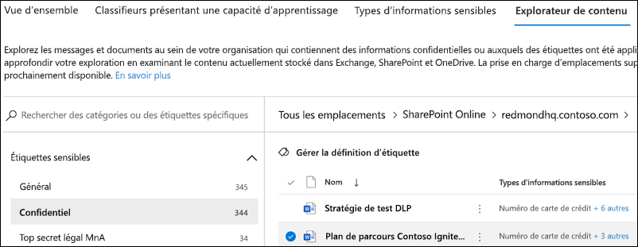

# Utilisation de l’Explorateur de contenu de la classification des données (préversion)

L’Explorateur de contenu de la classification des données vous permet d’afficher en mode natif les éléments qui ont été synthétisés dans la page vue d’ensemble.

## Explorateur de contenu

L’Explorateur de contenu est un instantané actuel des éléments qui ont une étiquette de confidentialité, une étiquette de rétention ou ont été classés comme un type d’informations sensibles au sein de votre organisation.

### Autorisations

Il existe deux rôles qui octroient l’accès à l’Explorateur de contenu :

- **Visionneuse de liste de l’Explorateur de contenu**: l’appartenance à ce rôle vous permet d’afficher chaque élément et son emplacement.

- **Visionneuse de contenu de l’Explorateur de contenu**: l’appartenance à ce rôle vous permet d’afficher le contenu de chaque élément dans la liste.

Le compte que vous utilisez pour accéder à l’Explorateur de contenu doit se trouver dans l’un des rôles ou les deux. Il s’agit de rôles indépendants qui ne sont pas cumulatifs. Par exemple, si vous voulez accorder à un compte la possibilité d’afficher les éléments et leur emplacement uniquement, attribuez des droits à la visionneuse de liste de l’Explorateur de contenu. Si vous souhaitez que ce même compte puisse également afficher le contenu des éléments de la liste, vous pouvez également octroyer des droits de visionneuse de contenu dans l’Explorateur de contenu.

### Utilisation de l’Explorateur de contenu

1. Ouvrez **Centre de conformité Microsoft 365**  > **Classification de données** > **Explorateur de contenu**.
2. Si vous connaissez le nom de l'étiquette ou le type d'informations sensibles, vous pouvez la taper dans la zone de recherche.
3. Vous pouvez également rechercher l'élément en développant le type d'étiquette et en sélectionnant l'étiquette dans la liste, un élément de la partie à l'étiquette de rétention de la liste est affiché ci-dessous.
4. Sélectionnez un emplacement sous **Tous les emplacements** et explorez la structure de dossiers vers l’élément.
5. Double-cliquez pour ouvrir l’élément en mode natif dans l’Explorateur de contenu.

## Voir aussi

- [Étiquettes de confidentialité](sensitivity-labels.md)
- [Étiquettes de rétention](labels.md)
- [Éléments recherchés par les types d’informations sensibles](what-the-sensitive-information-types-look-for.md)
- [Vue d’ensemble des stratégies de rétention](retention-policies.md)
