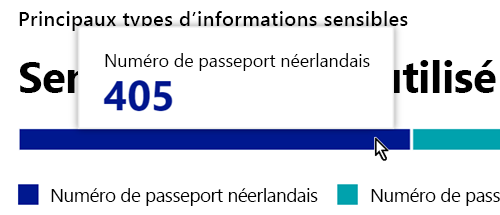
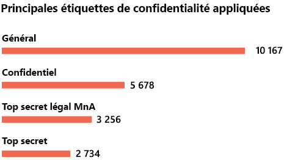
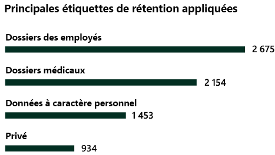

# En savoir plus sur la classification des données

En tant qu'administrateur Microsoft 365 ou administrateur de conformité, vous pouvez évaluer puis baliser le contenu de votre organisation afin de contrôler où il va, de le protéger où qu'il soit et de vous assurer qu'il est préservé et supprimé en fonction des besoins de votre organisation. Pour ce faire, vous devez utiliser les [étiquettes de confidentialité](sensitivity-labels.md), les [étiquettes de rétention](retention.md#retention-labels) et la classification des informations sensibles par types. Plusieurs méthodes s’offrent à vous pour effectuer la découverte, l’évaluation et le balisage, mais le résultat final est de disposer d’un grand nombre de documents et de messages électroniques balisés et classifiés avec ces étiquettes. Après avoir appliqué vos étiquettes de rétention et vos étiquettes de confidentialité, vous souhaiterez voir de quelle manière elles sont utilisées par vos clients. La page classification des données fournit une visibilité dans ce corps de contenu, notamment :

- le nombre d’éléments qui ont été classifiés en tant que types d’informations sensibles et la nature de ces classifications
- les étiquettes de confidentialité les plus utilisées dans Microsoft 365 et Azure Information Protection
- les étiquettes de rétention les plus utilisées
- la synthèse des activités que les utilisateurs effectuent sur votre contenu sensible
- les emplacements de vos données sensibles et conservées

Vous pouvez également gérer ces fonctionnalités sur la page classification de données :

- [classifieurs avec capacité d’apprentissage](classifier-learn-about.md)
- [types d’informations sensibles](sensitive-information-type-learn-about.md)
- [En savoir plus sur les types d’informations sensibles exacts basés sur la correspondance de données](sit-learn-about-exact-data-match-based-sits.md#learn-about-exact-data-match-based-sensitive-information-types)
- [Explorateur de contenu](data-classification-content-explorer.md)
- [Explorateur d’activités](data-classification-activity-explorer.md)

Vous trouverez la classification des données dans le <a href="https://go.microsoft.com/fwlink/p/?linkid=2077149" target="_blank">Centre de conformité Microsoft 365</a> ou <a href="https://go.microsoft.com/fwlink/p/?linkid=2077139" target="_blank">le portail Microsoft 365 Defender</a> > **Classification** > **Classification des données**.

Suivez une visite guidée par vidéo sur nos fonctionnalités de classification de données.

> [!VIDEO https://www.microsoft.com/videoplayer/embed/RE4vx8x]

La classification de données analyse votre contenu sensible et le contenu étiqueté avant votre création de stratégies. Cette opération est appelée **zéro gestion des modifications**. Cela vous permet de voir l’impact de toutes les étiquettes de rétention et de confidentialité sur votre environnement, et de vous aider à évaluer vos besoins en matière de protection et de stratégie de gouvernance.

## Configuration requise

### Autorisations

 Pour accéder à la page de classification de données, un compte doit être affecté à une appartenance dans l’un de ces rôles ou groupes de rôles.

**Groupes de rôles Microsoft 365**

- Administrateur général
- Administrateur de conformité
- Administrateur de sécurité
- Administrateur de conformité des données

> [!NOTE]
> Il est recommandé de toujours utiliser le rôle avec le moins de privilèges pour garantir l’accès à la classification des données de Microsoft 365.

#### Rôles et groupes de rôles en préversion

Il existe des rôles et des groupes de rôles en préversion que vous pouvez tester pour affiner vos contrôles d’accès.

Voici une liste des rôles Microsoft Information Protection (MIP) qui sont en préversion. Pour en savoir plus sur ces rôles, consultez [Rôles dans le Centre de sécurité et de conformité](../security/office-365-security/permissions-in-the-security-and-compliance-center.md#roles-in-the-security--compliance-center)

- Administrateur Information Protection
- Analyste Information Protection
- Enquêteur Information Protection
- Lecteur Information Protection

Voici une liste des groupes de rôles MIP en prévisualisation. Pour en savoir plus sur ces groupes, consultez [Groupes de rôles dans le Centre de sécurité et de conformité](../security/office-365-security/permissions-in-the-security-and-compliance-center.md#role-groups-in-the-security--compliance-center)

- Protection des informations
- Administrateurs Information Protection
- Analystes Information Protection
- Enquêteurs Information Protection
- Lecteurs Information Protection

## Types d’informations sensibles utilisés le plus fréquemment dans votre contenu

Microsoft 365 fournit de nombreuses définitions des types d’informations sensibles, par exemple un élément contenant un numéro de sécurité sociale ou un numéro de carte bancaire. Pour plus d’informations sur les types d’informations sensibles, voir les [Définitions d’entités des types d’informations sensibles](sensitive-information-type-entity-definitions.md).

La carte type d’informations sensibles présente les principaux types d’informations sensibles qui ont été détectés et étiquetés au sein de votre organisation.

Pour déterminer le nombre d’éléments dans une catégorie de classification donnée, pointez sur la barre pour la catégorie.

> [!NOTE]
> Si la carte affiche le message « Aucune donnée trouvée avec des informations sensibles », cela signifie qu’aucun élément de votre organisation n’a été classé comme étant un type d’informations sensibles ou qu’aucun élément n’a été analysé. Pour commencer à utiliser les étiquettes, voir :
>- [Prise en main des étiquettes de confidentialité](get-started-with-sensitivity-labels.md)
>- [Prise en main de la gestion des enregistrements](get-started-with-records-management.md)
>- [Définitions d’entités des types d’informations sensibles](sensitive-information-type-entity-definitions.md)

## Principales étiquettes de confidentialité appliquées au contenu

Lorsque vous appliquez une étiquette de confidentialité à un élément via Microsoft 365 ou Azure information protection (AIP), deux événements se produisent :

- Une balise qui indique que la valeur de l’élément pour votre organisation est incorporée dans le document et qu’elle le suivra partout.
- La présence de la balise permet différents comportements de protection, tels que le filigrane ou le chiffrement obligatoires. Lorsque la protection de point de terminaison est activée, vous pouvez même empêcher un élément de quitter votre contrôle organisationnel.

Pour plus d’informations sur les étiquettes de confidentialité, voir : [En savoir plus sur les étiquettes de confidentialité](sensitivity-labels.md).

Les étiquettes de confidentialité doivent être activées pour les fichiers stockés dans SharePoint et OneDrive pour que les données correspondantes apparaissent dans la page de classification des données. Pour plus d’informations, voir [Activer les étiquettes de confidentialité pour les fichiers Office dans SharePoint et OneDrive](sensitivity-labels-sharepoint-onedrive-files.md).

La carte d’étiquette de confidentialité affiche le nombre d’éléments (adresse de messagerie ou document) par niveau de confidentialité.

> [!NOTE]
> Si vous n’avez pas créé ou publié d’étiquettes de confidentialité ou si aucune étiquette de confidentialité n’a été appliquée à votre contenu, cette carte affiche le message « Aucune étiquette de confidentialité détectée ». Pour commencer à utiliser les étiquettes de confidentialité, consultez :
>- [Commencez avec les étiquettes de sensibilité](get-started-with-sensitivity-labels.md) ou pour AIP [Configurer la politique de protection des informations sur Azure](/azure/information-protection/configure-policy)

## Principales étiquettes de rétention appliquées au contenu

Les étiquettes de rétention sont utilisées pour gérer la disposition du contenu au sein de votre organisation. Lorsqu’elles sont appliquées, elles peuvent être utilisées pour contrôler la durée de conservation d’un document avant sa suppression, s’il doit être révisé avant sa suppression, la date d’expiration de sa période de rétention, ou s’il doit être marqué comme un enregistrement. Pour plus d’informations, voir [En savoir plus sur les stratégies et les étiquettes de rétention](retention.md).

La carte étiquettes de rétention les plus utilisées vous indique le nombre d’éléments ayant une étiquette de rétention donnée.

> [!NOTE]
> Si cette carte affiche le message, « Aucune étiquette de rétention détectée », cela veut dire que vous n’avez pas créé ou publié d’étiquettes de rétention ou qu’aucun contenu n’a eu d’étiquette appliquée. Pour commencer à utiliser les étiquettes de confidentialité, consultez :
>- [Prise en main de la gouvernance des informations](get-started-with-information-governance.md)

## Principales activités détectées

Cette carte décrit brièvement les actions les plus courantes que les utilisateurs effectuent sur les éléments étiquetés comme sensibles. Vous pouvez utiliser [L’explorateur d’activité](data-classification-activity-explorer.md) pour explorer en profondeur les différentes activités que Microsoft 365 suit sur le contenu étiqueté et le contenu qui se trouve sur les points de terminaison de Windows 10.

> [!NOTE]
> Si cette carte affiche le message « Aucune activité détectée », cela signifie qu’il n’y a eu aucune activité sur les fichiers, ou que l’audit de l’utilisateur et de l’administrateur n’est pas activé. Pour activer les journaux d’audit, consultez :
>- [Effectuer des recherches dans le journal d’audit depuis le centre de sécurité et conformité](search-the-audit-log-in-security-and-compliance.md)

## Données étiquetées confidentielles ou retenues par emplacement

L’objectif de la création de rapports sur la classification des données est de fournir une visibilité sur le nombre d’éléments qui ont une étiquette, ainsi que leur emplacement. Ces cartes vous permettent de connaître le nombre d’éléments étiquetés dans Exchange, SharePoint, OneDrive, etc.

> [!NOTE]
> Si cette carte affiche le message, « Aucun emplacement détecté », cela veut dire que vous n’avez pas créé ou publié d’étiquettes de confidentialité ou qu’aucune étiquette de confidentialité n’a été appliquée à votre contenu. Pour commencer à utiliser les étiquettes de confidentialité, consultez :
>- [Étiquettes de confidentialité](sensitivity-labels.md)

## Notes de publication de la préversion publique 

> [!NOTE]
> **Nombre de boîtes aux lettres Exchange**: vous remarquerez qu’une petite info-bulle s’affiche lorsque vous explorez les boîtes aux lettres Exchange. Il s'agit là d'évoquer le fait que le nombre agrégé affiché pour le type d’information sensible, l’étiquette de confidentialité et l’étiquette de rétention ne correspondent pas parfaitement au nombre d’éléments que vous trouverez dans la boîte aux lettres. Cela est dû au fait que l’exploration vers le bas dans le dossier extrait la vue dynamique du contenu, qui est classifié, tandis que le nombre agrégé est calculé. Informations que l’utilisateur doit remarquer même en cas d’écrémage

> [!NOTE]
> **Le rendu des documents chiffrés**: les fichiers SharePoint, Exchange et OneDrive chiffrés ne s’affichent pas dans l’Explorateur de contenu. Il s’agit d’un problème sensible qui nécessite un équilibre entre le besoin d'afficher le contenu de fichiers dans l’explorateur de contenu et la nécessité de conserver les contenus chiffrés. Avec les autorisations accordées par les groupes de rôles **Visionneuse de listes de l’Explorateur de contenu** et **Afficheur de contenu**, vous verrez une vue de liste des fichiers, des métadonnées de fichier et un lien que vous pouvez utiliser pour accéder au contenu via le client web. Informations que l’utilisateur doit remarquer même en cas d’écrémage

> [!NOTE]
> **Caractères pris en charge dans les noms d’étiquette de rétention dans la recherche SharePoint** : la recherche SharePoint ne prend pas en charge les noms d’étiquette de rétention avec `-`ou `_` . Par exemple, `Label-MIP` et `Label_MIP` ne sont pas pris en charge. La recherche SharePoint prend en charge ces caractères dans les noms d’étiquettes de confidentialité et les noms de type information sensible.

> [!NOTE]
> **OneDrive reste en préversion**: nous vous remercions pour vos précieux commentaires sur l’intégration de OneDrive pendant notre programme de préversion. À mesure que nous travaillons sur les détails, vous pouvez constater des données/flux incohérents. Nous continuerons à proposer OneDrive en préversion jusqu’à ce que tous les correctifs soient en place. Nous apprécions votre soutien constant.

## Voir aussi

- [Afficher l’activité des étiquettes](data-classification-activity-explorer.md)
- [Afficher le contenu étiqueté](data-classification-content-explorer.md)
- [En savoir plus sur les étiquettes de niveau de confidentialité](sensitivity-labels.md)
- [En savoir plus sur les stratégies et les balises de rétention](retention.md)
- [En savoir plus sur les types d’informations confidentielles](sensitive-information-type-learn-about.md).
- [Définitions d’entités des types d’informations sensibles](sensitive-information-type-entity-definitions.md)
- [Découvrez les classificateurs de formation (préversion)](classifier-learn-about.md)

Pour découvrir comment utiliser la classification des données afin de respecter les réglementations en matière de confidentialité des données, voir [Déployer la protection des informations pour les réglementations relatives à la confidentialité des données avec Microsoft 365](../solutions/information-protection-deploy.md)  (aka.ms/m365dataprivacy).
