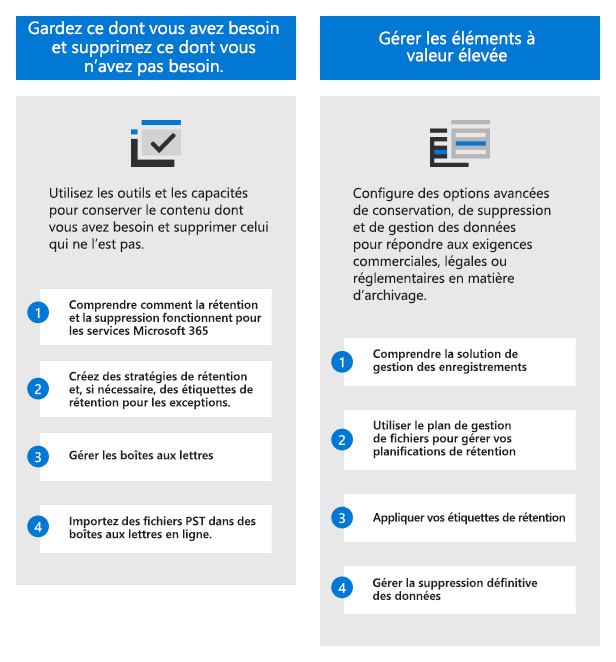
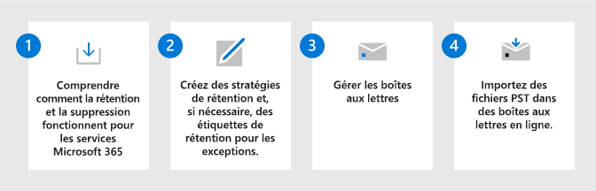
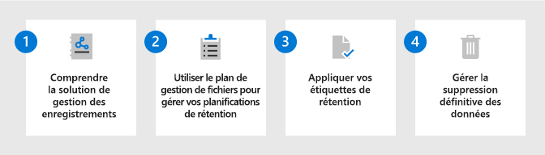

# Déployer une solution de gouvernance des données avec Microsoft Purview

>*[Guide de sécurité et conformité pour les licences Microsoft 365](/office365/servicedescriptions/microsoft-365-service-descriptions/microsoft-365-tenantlevel-services-licensing-guidance/microsoft-365-security-compliance-licensing-guidance).*

Utilisez **Gestion du cycle de vie des données Microsoft Purview** (anciennement appelé Gouvernance des informations Microsoft) et **Gestion des enregistrements Microsoft Purview** pour régir vos données Microsoft 365 à des fins de conformité ou de réglementation.

Pour la gouvernance des données qui mappe et gère les données dans votre patrimoine de données, y compris multi-cloud et SaaS (software-as-a-service), utilisez [Microsoft Purview Data Map, Microsoft Purview Data Catalog et Microsoft Purview Data Estate Insights](/azure/purview/overview).

Pour obtenir une solution de protection des données, consultez [Déployer une solution de protection des informations avec Microsoft Purview](information-protection-solution.md).

## Licences

Pour comprendre vos exigences et options de licence, consultez les informations du guide Microsoft 365 pour la sécurité et la conformité, section [Gestion du cycle de vie des données Microsoft Purview et à la section Gestion des enregistrements Microsoft Purview](/office365/servicedescriptions/microsoft-365-service-descriptions/microsoft-365-tenantlevel-services-licensing-guidance/microsoft-365-security-compliance-licensing-guidance#microsoft-purview-data-lifecycle-management--microsoft-purview-records-management) pour connaître les exigences en matière de licences au niveau des fonctionnalités.

## Gardez ce dont vous avez besoin et supprimez ce dont vous n'avez pas besoin.

Utilisez **Gestion du cycle de vie des données Microsoft Purview** (anciennement appelé Gouvernance des informations Microsoft) pour conserver ce dont vous avez besoin et supprimer ce dont vous n'avez pas besoin.

|Étape|Description|Plus d’informations|
|:---|:----------|:---------------|
|1| Comprendre comment la rétention et la suppression fonctionnent pour les services Microsoft 365.    Une fois que vous avez compris comment utiliser les stratégies de rétention et les étiquettes de rétention, identifiez vos charges de travail qui ont besoin d’une stratégie de rétention et si vous devez créer des étiquettes de rétention pour les exceptions. | [En savoir plus sur les stratégies et les balises de rétention](retention.md)|
|2| Créez des stratégies de rétention et, si nécessaire, des étiquettes de rétention pour les exceptions.    Les stratégies de rétention les plus couramment utilisées concernent Exchange, SharePoint, Teams, Groupes Microsoft 365 et Yammer. Vous pouvez configurer des exceptions pour les documents et les e-mails. | [Créer des stratégies de rétention](create-retention-policies.md) 
 [Créer et appliquer des étiquettes de rétention pour vos exceptions](create-retention-labels-information-governance.md).|
|3| Gérer les boîtes aux lettres.    Activez les boîtes aux lettres pour l’archivage et l’archivage à extension automatique, déterminez si vous devez personnaliser le moment où les e-mails sont déplacés vers la boîte aux lettres d’archivage et rendre les boîtes aux lettres inactives lorsque les utilisateurs quittent l’organisation.| [Activer des boîtes aux lettres d’archivage](enable-archive-mailboxes.md) 
 [Activer l'archivage à expansion automatique](enable-autoexpanding-archiving.md) 
 [Créer et gérer les boîtes aux lettres inactives](create-and-manage-inactive-mailboxes.md)|
|4| Importez des fichiers PST dans des boîtes aux lettres en ligne.     Si vous avez des fichiers PST qui contiennent des données que vous souhaitez régir, vous pouvez les importer à l’aide du chargement réseau ou de l’expédition de lecteurs.| [Utilisez le chargement réseau pour importer les fichiers PST de votre organisation.](use-network-upload-to-import-pst-files.md) 
 [Utiliser l’envoi de lecteurs pour importer des fichiers PST](use-drive-shipping-to-import-pst-files-to-office-365.md)|

Pour en savoir plus sur les fonctionnalités de cette solution, consultez [En savoir plus sur la gestion du cycle de vie des données](information-governance.md).

## Gérer les éléments à valeur élevée

Utilisez la **Gestion des enregistrements Microsoft Purview** pour gérer les éléments à valeur élevée de votre organisation pour les exigences de conservation des enregistrements commerciales, légales ou réglementaires.

|Étape|Description|Plus d’informations|
|:---|:----------|:---------------|
|1| Comprendre la solution de gestion des enregistrements.    Utilisez des étiquettes de rétention avec des options de configuration plus flexibles et, si nécessaire, déclarez des éléments en tant qu’enregistrements. | [En savoir plus sur la gestion des enregistrements](records-management.md)|
|2| Utiliser le plan de gestion de fichiers pour gérer vos planifications de rétention.    Le plan de gestion de fichiers vous permet de créer des étiquettes de rétention de manière interactive ou d’importer en bloc et d’exporter à des fins d’analyse. Les étiquettes que vous créez avec le plan de gestion de fichiers prennent en charge des informations administratives supplémentaires pour vous aider à identifier et à suivre les exigences commerciales ou réglementaires. | [Utiliser le plan de gestion de fichiers pour créer et gérer des étiquettes de rétention](file-plan-manager.md)|
|3| Appliquer vos étiquettes de rétention.    Vos étiquettes de rétention peuvent être publiées et appliquées manuellement ou automatiquement dans des applications, ou automatiquement basées sur des informations sensibles, des mots clés ou des propriétés pouvant faire l’être, des classifieurs pouvant être formés ou des pièces jointes cloud. |[Publier des étiquettes de rétention et les appliquer dans les applications](create-apply-retention-labels.md) 
 [Appliquer automatiquement une étiquette de rétention au contenu](apply-retention-labels-automatically.md)|
|4| Gérer la suppression définitive des données.    Connu sous le nom de destruction de données, vous pouvez exiger une révision manuelle du contenu avant sa suppression définitive et fournir une preuve de destruction pour les enregistrements. |[Gérer la disposition du contenu](disposition.md)|

> [!TIP]
> Consultez la liste des [scénarios courants](get-started-with-records-management.md#common-scenarios) pour les configurations supplémentaires prises en charge par la gestion des enregistrements.

Pour en savoir plus sur les fonctionnalités de cette solution, consultez [En savoir plus sur la gestion des enregistrements](records-management.md).

## Ressources de formation

Modules d’apprentissage pour les consultants et les administrateurs :

- [Introduction à la protection de l'information et à la gestion du cycle de vie des données dans Microsoft Purview](/learn/modules/m365-compliance-information-governance)
- [Gérer le cycle de vie des données dans Microsoft Purview](/learn/modules/m365-compliance-information-govern-information/)
- [Gérer les enregistrements dans Microsoft Purview](/learn/modules/m365-compliance-information-manage-records/)

Pour obtenir de la documentation sur la prise en charge des utilisateurs lors du déploiement de ces solutions, consultez les sections de documentation de l’utilisateur final pour la [gestion du cycle de vie des données](get-started-with-information-governance.md#end-user-documentation) et la [gestion des enregistrements](get-started-with-records-management.md#end-user-documentation).