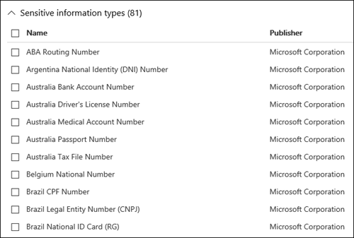
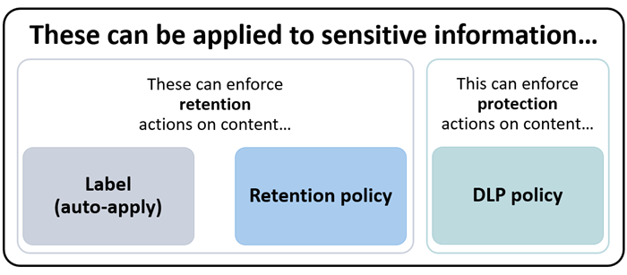

# Référence en matière de prévention des pertes de données
 
> [!IMPORTANT]
> Il s’agit d’un sujet de référence n’est plus la principale ressource Microsoft 365 de la prévention des pertes de données (DLP). L’ensemble de contenu DLP est en cours de mise à jour et de restructuration. Les sujets abordés dans cet article passeront à de nouveaux articles mis à jour. Pour plus d’informations sur DLP, voir En [savoir plus sur la prévention des pertes de données](dlp-learn-about-dlp.md).

<!-- this topic needs to be split into smaller, more coherent ones. It is confusing as it is. -->
<!-- move this note to a more appropriate place, no topic should start with a note -->
> [!NOTE]
> Des fonctionnalités de protection contre la perte de données ont récemment été ajoutées aux messages de discussion et de canal Microsoft Teams pour les utilisateurs titulaires d’une licence de Conformité avancée Office 365, disponible sous la forme d’une option autonome et incluse dans Office 365 E5 et Microsoft 365 E5 Conformité. Pour en savoir plus sur les conditions d’octroi de licences, consultez [Conseils sur la gestion des licences des services de niveau client de Microsoft 365](/office365/servicedescriptions/microsoft-365-service-descriptions/microsoft-365-tenantlevel-services-licensing-guidance).

<!-- MOVED TO LEARN ABOUT To comply with business standards and industry regulations, organizations must protect sensitive information and prevent its inadvertent disclosure. Sensitive information can include financial data or personally identifiable information (PII) such as credit card numbers, social security numbers, or health records. With a data loss prevention (DLP) policy in the Office 365 Security &amp; Compliance Center, you can identify, monitor, and automatically protect sensitive information across Office 365.
  
With a DLP policy, you can:
  
- **Identify sensitive information across many locations, such as Exchange Online, SharePoint Online, OneDrive for Business, and Microsoft Teams.**
    
    For example, you can identify any document containing a credit card number that's stored in any OneDrive for Business site, or you can monitor just the OneDrive sites of specific people.
    
- **Prevent the accidental sharing of sensitive information**. 
    
    For example, you can identify any document or email containing a health record that's shared with people outside your organization, and then automatically block access to that document or block the email from being sent.
    
- **Monitor and protect sensitive information in the desktop versions of Excel, PowerPoint, and Word.**
    
    Just like in Exchange Online, SharePoint Online, and OneDrive for Business, these Office desktop programs include the same capabilities to identify sensitive information and apply DLP policies. DLP provides continuous monitoring when people share content in these Office programs.
    
- **Help users learn how to stay compliant without interrupting their workflow.**
    
    You can educate your users about DLP policies and help them remain compliant without blocking their work. For example, if a user tries to share a document containing sensitive information, a DLP policy can both send them an email notification and show them a policy tip in the context of the document library that allows them to override the policy if they have a business justification. The same policy tips also appear in Outlook on the web, Outlook, Excel, PowerPoint, and Word.
    
- **View DLP alerts and reports showing content that matches your organization’s DLP policies.**
    
    To view alerts and metadata related to your DLP policies you can use the [DLP Alerts Management Dashboard](dlp-configure-view-alerts-policies.md). You can also view policy match reports to assess how your organization is complying with a DLP policy. If a DLP policy allows users to override a policy tip and report a false positive, you can also view what users have reported

-->    
## Créer et gérer les stratégies DLP

Vous créez et gérez des stratégies DLP sur la page Protection contre la perte de données dans le Centre de conformité Microsoft 365.
  

  
<!-- MOVED TO LEARN ABOUT ## What a DLP policy contains

A DLP policy contains a few basic things:
  
- Where to protect the content: **locations** such as Exchange Online, SharePoint Online, and OneDrive for Business sites, as well as Microsoft Teams chat and channel messages. 
    
- When and how to protect the content by enforcing **rules** comprised of: 
    
  - **Conditions** the content must match before the rule is enforced. For example, a rule might be configured to look only for content containing Social Security numbers that's been shared with people outside your organization. 
    
  - **Actions** that you want the rule to take automatically when content matching the conditions is found. For example, a rule might be configured to block access to a document and send both the user and compliance officer an email notification. -->
    
Vous pouvez utiliser une règle pour répondre à une exigence de protection particulière, puis utiliser une stratégie DLP pour regrouper des spécifications requises communes en matière de protection, par exemple l’ensemble des règles requises pour se conformer à une réglementation spécifique.
  
Par exemple, vous pouvez avoir une stratégie DLP qui vous aide à détecter la présence d’informations visées par la loi américaine sur l’assurance maladie (Health Insurance Portability Accountability Act, ou HIPAA). Cette stratégie DLP peut contribuer à protéger les données HIPAA (quoi) sur tous les sites SharePoint Online et tous les sites OneDrive Entreprise (où) en recherchant les documents contenant ces informations sensibles partagées avec des personnes extérieures à votre organisation (conditions), et en bloquant l’accès au document et en envoyant une notification (actions). Ces conditions sont stockées en tant que règles individuelles et regroupées sous la forme d’une stratégie DLP pour simplifier la gestion et la création de rapports.
  

  
<!-- MOVED TO LEARN ABOUT ### Locations

DLP policies are applied to sensitive items across Microsoft 365 locations and can be further scoped as detailed in this table.

|Location | Include/exclude by|
|---------|---------|
|Exchange email| distribution groups|
|SharePoint sites |sites |
|OneDrive accounts |accounts |
|Teams chat and channel messages |accounts |
|Windows 10 devices |user or group |
|Microsoft Cloud App Security |instance |
 -->

Si vous décidez d’inclure des groupes de distribution particuliers dans Exchange, la stratégie DLP est uniquement étendue aux membres de ceux-ci. De manière identique, l’exclusion d’un groupe de distribution exclut tous ses membres de l’évaluation de la stratégie. Vous pouvez choisir de limiter une stratégie aux membres des listes de distribution, aux groupes de distribution dynamiques et aux groupes de sécurité. Une stratégie DLP ne peut pas contenir plus de 50 inclusions et exclusions de ce genre.

Si vous optez pour l’inclusion ou l’exclusion de sites SharePoint spécifiques, la stratégie DLP ne peut pas contenir plus de 100 inclusions et exclusions. Vous pouvez néanmoins contourner cette limite en appliquant une stratégie mise en place à l’échelle de l’organisation ou une stratégie qui s’applique aux emplacements entiers.

Si vous choisissez d’inclure ou d’exclure des comptes ou groupes OneDrive spécifiques, une stratégie DLP peut contenir au plus 100 comptes d’utilisateurs ou 50 groupes pour l’inclusion ou l’exclusion.

> [!NOTE]
> L’élaboration de l’étendue de la stratégie OneDrive Entreprise à l’aide de comptes ou de groupes est en préversion publique. Au cours de cette phase, vous pouvez inclure ou exclure des comptes d’utilisateurs et des groupes dans le cadre d’une stratégie DLP. Les inclusions et exclusions dans le cadre de la même stratégie ne sont pas prises en charge.
  
### Règles

> [!NOTE]
> Le comportement par défaut d’une stratégie DLP, lorsque aucune alerte n’est configurée, n’est pas une alerte, ni un déclenchement. Cela s’applique uniquement aux types d’informations par défaut. Pour les types d’informations personnalisés, le système émet une alerte même si aucune action n’est définie dans la stratégie.

Les règles appliquent vos exigences professionnelles au contenu de votre organisation. Une stratégie contient une ou plusieurs règles et chaque règle se compose de conditions et d’actions. Pour chaque règle, lorsque les conditions sont remplies, les actions sont exécutées automatiquement. Les règles sont exécutées de façon séquentielle, en commençant par la règle de priorité la plus élevée dans chaque stratégie.
  
Une règle fournit également des options pour informer les utilisateurs (avec des conseils de stratégie et des notifications par courrier électronique) et les administrateurs (avec des rapports d’incident de courrier) que le contenu satisfait à la règle.
  
Les différents composants d’une règle sont décrits ci-dessous.
  

  
#### Conditions

Les conditions sont importantes car elles déterminent les types d’informations que vous recherchez, et le moment auquel effectuer une action. Par exemple, vous pouvez choisir d’ignorer les documents contenant des numéros de passeport, sauf si le document contient plus de 10 numéros et est partagé avec des personnes extérieures à votre organisation.
  
Les conditions concernent le **contenu**, par exemple les types d’informations sensibles que vous recherchez et aussi le **contexte**, par exemple les personnes avec lesquelles le document est partagé. Vous pouvez utiliser les conditions pour affecter différentes actions à différents niveaux de risque. Par exemple, un contenu sensible partagé en interne peut être moins risqué et nécessiter moins d’actions qu’un contenu sensible partagé avec des personnes extérieures à l’organisation. 
  

  
Les conditions actuellement disponibles peuvent déterminer si :
  
- Le contenu comporte un type d’informations sensibles.
    
- Le contenu comporte une étiquette. Pour plus d’informations, reportez-vous à la section ci-dessous, [Utilisation d’une étiquette comme condition dans une stratégie DLP](#using-a-retention-label-as-a-condition-in-a-dlp-policy).
    
- Le contenu est partagé avec des personnes extérieures ou internes à votre organisation.

  > [!NOTE]
  > Les utilisateurs qui ont des comptes non invités dans le client Active Directory ou Azure Active Directory d’une organisation hôte sont considérés comme des personnes internes à l’organisation.
    
#### Types d’informations sensibles

Une stratégie DLP peut contribuer à protéger les informations sensibles, définies selon des **types d’informations sensibles**. Microsoft 365 inclut les définitions de nombreux types d’informations sensibles courants dans diverses régions, prêtes pour utilisation, comme les numéros de carte de crédit, numéros de compte bancaire, numéros de carte d’identité et numéros de passeport. 
  

  
Lorsqu’une stratégie DLP recherche un type d’informations sensibles tel qu’un numéro de carte de crédit, il ne recherche pas simplement un nombre à 16 chiffres. Chaque type d’information sensible est défini et détecté en utilisant une combinaison de :
  
- Mots clés.
    
- Fonctions internes pour valider les sommes de contrôle ou la composition.
    
- Évaluation des expressions régulières pour trouver des correspondances au modèle.
    
- Autres analyses de contenu.
    
La détection DLP peut ainsi atteindre un haut niveau de précision tout en réduisant le nombre de faux positifs susceptibles d’interrompre le travail.
  
#### Actions

Lorsque le contenu remplit une condition stipulée dans une règle, vous pouvez y appliquer des mesures de protection automatiques.
  

  
Avec les actions désormais disponibles, vous pouvez :
  
- **Restreindre l’accès au contenu** Selon vos besoins, vous pouvez restreindre l’accès au contenu de trois façons :

  1. Restreindre l’accès au contenu pour tout le monde.
  2. Restreindre l’accès au contenu pour les personnes extérieures à l’organisation.
  3. Restreindre l’accès à « toute personne disposant du lien ».

  Pour le contenu d’un site, cela signifie que les autorisations pour le document sont limitées pour tout le monde, sauf pour l’administrateur principal de la collection de sites, le propriétaire du document et la personne qui a modifié le document pour la dernière fois. Ces personnes peuvent supprimer les informations sensibles du document ou prendre des mesures correctives. Lorsque le document est conforme, les autorisations d’origine sont automatiquement restaurées. Lorsque l’accès à un document est bloqué, le document s’affiche avec une icône de conseil de stratégie spéciale dans la bibliothèque sur le site. 
    
  
  
  Pour le contenu des messages électroniques, cette action bloque l’envoi du message. Selon la configuration de la règle DLP, l’expéditeur voit une notification d’échec de remise ou (si la règle utilise une notification) un conseil de stratégie et/ou une notification de messagerie.
    
  
  
#### Notifications de l’utilisateur et remplacements de l’utilisateur

Vous pouvez utiliser les notifications et les remplacements pour informer vos utilisateurs sur les stratégies DLP et les aider à respecter les règles de conformité sans bloquer leur travail. Par exemple, si un utilisateur tente de partager un document contenant des informations sensibles, une stratégie DLP peut lui envoyer une notification par courrier électronique et afficher un conseil de stratégie dans le contexte de la bibliothèque de documents, qui lui permet de remplacer la stratégie s’il a une raison professionnelle de le faire.
  

  
Le message électronique permet de notifier les personnes qui ont envoyé, partagé ou modifié le contenu en dernier et, pour le contenu de site, l’administrateur de la collection de sites et le propriétaire du document. De plus, vous pouvez ajouter ou supprimer les destinataires de votre choix du courrier électronique de notification.
  
En plus d’envoyer une notification par courrier électronique, une notification utilisateur affiche un conseil de stratégie :
  
- Dans Outlook et Outlook sur le web.
    
- Pour un document sur SharePoint Online ou un site OneDrive Entreprise.
    
- Dans Excel, PowerPoint et Word, lorsque le document est stocké sur un site inclus dans une stratégie DLP.
    
La notification par courrier électronique et le conseil de stratégie expliquent pourquoi un contenu est en conflit avec une stratégie DLP. Si vous le choisissez, la notification par courrier électronique et le conseil de stratégie peuvent permettre aux utilisateurs de remplacer une règle en signalant un faux positif ou en fournissant une justification professionnelle. Cela peut vous aider à informer les utilisateurs de vos stratégies DLP et à les appliquer sans interrompre le travail. Les informations sur les remplacements et les faux positifs sont également enregistrées pour la création de rapports (consultez la rubrique ci-dessous sur les rapports DLP) et incluses dans les rapports d’incident (section suivante), afin que le responsable de la mise en conformité puisse les consulter régulièrement.
  
Dans un compte OneDrive Entreprise, un conseil de stratégie se présente comme ceci.
  

 Pour en savoir plus sur les notifications utilisateur et les conseils de stratégie en matière de stratégie DLP, voir [Utilisation des notifications et des conseils de stratégie](use-notifications-and-policy-tips.md).

#### Rapports sur les alertes et les incidents

Lorsqu’une règle est satisfaite, vous pouvez envoyer un e-mail d’alerte contenant les détails de celle-ci à votre responsable de la conformité (ou toute autre personne de votre choix). Ce message d’alerte comporte un lien vers le [Tableau de bord de gestion des alertes DLP](dlp-configure-view-alerts-policies.md) auquel le responsable de la conformité peut accéder pour afficher les détails des alertes et des événements. Le tableau de bord contient les détails de l’événement ayant déclenché l’alerte, ainsi que les détails de la stratégie DLP correspondante et le contenu sensible détecté.

En outre, vous pouvez également envoyer un rapport d’incident incluant les détails de l’événement. Ce rapport comprend des informations sur l’élément qui a fait l’objet d’une correspondance, le contenu qui a satisfait à la règle ainsi que le nom de la personne qui a modifié le contenu en dernier. Pour les messages électroniques, le rapport inclut également sous forme de pièce jointe le message d’origine qui correspond à une stratégie DLP.

> [!div class="mx-imgBorder"]
> 

DLP n’analyse pas les messages électronique de la même façon que les éléments dans SharePoint Online ou OneDrive Entreprise. Dans SharePoint Online et OneDrive Entreprise, DLP analyse les éléments existants, ainsi que les nouveaux et génère un rapport d’incident et d’alerte chaque fois qu’une correspondance est trouvée. Dans Exchange Online, DLP analyse uniquement les nouveaux e-mails, puis génère un rapport en cas de correspondance de stratégie. DLP ***ne peut pas*** analyser ou mettre en correspondance les éléments de messagerie existants qui sont stockés dans une boîte aux lettres ou une archive.
  
## Opérateurs logiques et opérateurs de regroupement

Votre stratégie de protection contre la perte de données a souvent une exigence simple, par exemple, celle d’identifier tout contenu avec un numéro de sécurité sociale. Toutefois, dans d’autres scénarios, votre stratégie de protection contre la perte de données devra identifier des données plus vagues.
  
Par exemple, pour identifier le contenu soumis à la réglementation des États-Unis sur le Health Insurance Act (HIPAA), vous devez rechercher :
  
- Le contenu qui contient certains types d’informations sensibles, par exemple un numéro de sécurité sociale ou le numéro émis par l’agence du médicament (DEA).
    
    AND
    
- Le contenu plus difficile à identifier, comme les communications relatives aux soins du patient ou la description des services médicaux fournis. L’identification de ce contenu nécessite une correspondance de mots clés d’une très importante liste de mots clés, telle que la classification internationale des maladies (ICD-9-CM ou ICD-10-CM).
    
Vous pouvez facilement identifier ces données vaguement définies à l’aide d’opérateurs logiques et d’opérateurs de regroupement (ET, OU). Lorsque vous créez une stratégie de protection contre la perte de données, vous pouvez :
  
- Regrouper les types d’informations sensibles
    
- Choisir l’opérateur logique dans les types d’informations sensibles au sein d’un groupe et entre les groupes eux-mêmes.
    
### Choisir l’opérateur au sein d’un groupe

Dans un groupe, vous pouvez choisir si tout ou partie des conditions dans ce groupe doivent être satisfaites pour que le contenu corresponde à la règle.
  

  
### Ajout d’un groupe

Vous pouvez rapidement ajouter un groupe, qui peut avoir ses propres conditions et son propre opérateur au sein de ce groupe.
  

  
### Choix de l’opérateur entre les groupes

Entre les groupes, vous pouvez choisir si les conditions dans un seul groupe ou tous les groupes doivent être satisfaites pour que le contenu corresponde à la règle.
  
Par exemple, le type d’informations sensibles intégrées pour la réglementation des États-Unis sur le **HIPAA** a une règle qui utilise un opérateur **ET** entre les groupes, de sorte qu’elle identifie le contenu qui contient : 
  
- le groupe **identificateurs de données personnelles** (au moins un numéro de sécurité sociale **OU** numéro DEA) 
    
    **ET**
    
- le groupe **termes médicaux** (au moins un mot-clé ICD-9-CM **OU** mot clé ICD-10-CM) 
    

  
## La priorité de traitement des règles

Lorsque vous créez des règles dans une stratégie, chaque règle se voit attribuer une priorité en fonction de son ordre de création. Cela signifie que la première règle créée a priorité sur la deuxième et ainsi de suite.

> [!div class="mx-imgBorder"]
> 
  
Une fois que vous avez configuré plusieurs stratégies DLP, vous pouvez modifier la priorité d’une ou plusieurs stratégies. Pour ce faire, sélectionnez une stratégie, sélectionnez **Modifier la stratégie**, puis utilisez la liste **Priorité** pour préciser sa priorité.

> [!div class="mx-imgBorder"]
> 

Lorsque des règles sont appliquées au contenu, elles sont traitées dans l’ordre de priorité. Si le contenu correspond à plusieurs règles, celles-ci sont traitées dans l’ordre de priorité et l’action la plus restrictive est appliquée. Par exemple, si le contenu correspond à toutes les règles suivantes, la règle 3 est appliquée, car c’est celle qui a la priorité la plus élevée et est la plus restrictive :
  
- Règle 1 : informe seulement les utilisateurs
    
- Règle 2 : informe les utilisateurs, limite l’accès et permet le remplacement de l’utilisateur
    
- Règle 3 : informe les utilisateurs, limite l’accès et ne permet pas le remplacement de l’utilisateur
    
- Règle 4 : informe seulement les utilisateurs
    
- Règle 5 : limite l’accès
    
- Règle 6 : informe les utilisateurs, limite l’accès et ne permet pas le remplacement de l’utilisateur
    
Dans cet exemple, notez que les correspondances de toutes les règles sont enregistrées dans les journaux d’audit et apparaissent dans les rapports DLP, même si seule la règle la plus restrictive est appliquée.
  
En ce qui concerne les conseils de stratégie, veuillez noter les éléments suivants :
  
- Uniquement le conseil de stratégie de la priorité la plus élevée, la règle la plus restrictive est affichée. Par exemple, un conseil de stratégie à partir d’une règle qui bloque l’accès au contenu est affiché sur un conseil de stratégie à partir d’une règle qui envoie simplement une notification. Cela évite que les personnes voient une cascade de conseils de stratégie.
    
- Si les conseils de stratégie de la règle la plus restrictive autorisent les utilisateurs à remplacer la règle, toute autre règle également mise en correspondance avec le contenu est aussi remplacée.
    
## Optimisation des règles pour une correspondance plus facile ou plus difficile

Lorsque les utilisateurs créent et activent leurs stratégies DLP, ils rencontrent parfois les problèmes suivants :
  
- Trop de contenu qui **ne constitue pas** des informations sensibles correspond aux règles. Autrement dit, le nombre de faux positifs est trop élevé. 
    
- Trop peu de contenu **qui constitue** des informations sensibles correspond aux règles. En d’autres termes, les mesures de protection ne sont pas appliquées aux informations sensibles. 
    
Pour résoudre ces problèmes, vous pouvez optimiser vos règles en ajustant le nombre d’instances et la précision de correspondance pour que le contenu corresponde plus ou moins aux règles. Chaque type d’informations sensibles utilisé dans une règle a un nombre d’instances et une précision de correspondance.
  
### Nombre d’instances

Le nombre d’instances indique simplement combien d’occurrences d’un type spécifique d’informations sensibles doivent être présentes pour que le contenu corresponde à la règle. Par exemple, le contenu correspond à la règle illustrée ci-dessous si les valeurs entre 1 et 9 sont uniques dans un pays donné. les numéros de passeport sont identifiés.

> [!NOTE]
> Le nombre d’instances inclut uniquement le nombre de correspondances **Uniques** avec des types d’informations confidentielles et des mots clés. Par exemple, si un courrier contient 10 occurrences du même numéro de carte de paiement, ces 10 occurrences comptent pour une seule instance d’un numéro de carte de paiement.
  
L’optimisation des règles à l’aide du nombre d’instances est simple :
  
- Pour que la règle corresponde plus facilement, diminuez la valeur **min** et/ou augmentez la valeur **max**. Vous pouvez également donner à **max** une valeur **quelconque** en supprimant la valeur numérique. 
    
- Pour que la règle corresponde plus difficilement, augmentez la valeur **min**. 
    
En règle générale, les actions moins restrictives, telles que l’envoi de notifications à l’utilisateur, s’utilisent dans une règle avec un nombre d’instances inférieur (par exemple, 1 à 9). Quant aux actions plus restrictives, telles que la limitation de l’accès au contenu sans autoriser les remplacements de l’utilisateur, elles s’utilisent dans une règle avec un nombre d’instances supérieur (par exemple, entre 10 et une valeur supérieure).
  

  
### Précision de correspondance

Comme décrit ci-dessus, un type d’informations sensibles est défini et détecté en utilisant une combinaison de différents types de critères. En règle générale, un type d’informations sensibles est défini par plusieurs de ces combinaisons, appelés modèles. Un modèle qui nécessite moins de critères a une précision de correspondance (ou niveau de confiance) inférieure, alors qu’un modèle qui nécessite plus de critères a une précision de correspondance (ou niveau de confiance) supérieure. Pour en savoir plus sur les modèles et les niveaux de confiance réels utilisés par chaque type d’informations sensibles, consultez [Définitions d’entités des types d’informations sensibles](sensitive-information-type-entity-definitions.md).
  
Par exemple, le type d’informations sensibles Numéro de carte bancaire est défini par deux modèles :
  
- Un modèle avec une confiance de 65 % qui nécessite :
    
  - Un nombre dans le format d’un numéro de carte bancaire.
    
  - Un nombre qui passe la somme de contrôle.
    
- Un modèle avec une confiance de 85 % qui nécessite :
    
  - Un nombre dans le format d’un numéro de carte bancaire.
    
  - Un nombre qui passe la somme de contrôle.
    
  - Un mot clé ou une date d’expiration dans le bon format.
    
Vous pouvez utiliser ces niveaux de confiance (ou précision de correspondance) dans vos règles. En règle générale, les actions moins restrictives, telles que l’envoi de notifications à l’utilisateur, s’utilisent dans une règle avec une précision de correspondance inférieure. Quant aux actions plus restrictives, telles que la limitation de l’accès au contenu sans autoriser les remplacements de l’utilisateur, elles s’utilisent dans une règle avec une précision de correspondance supérieure.
  
Il est essentiel de comprendre que lorsqu’un type spécifique d’informations sensibles, comme un numéro de carte bancaire, est identifié dans le contenu, un seul niveau de confiance est renvoyé :
  
- Si toutes les correspondances correspondent à un seul modèle, le niveau de confiance de ce modèle est renvoyé.
    
- En cas de correspondances à plusieurs modèles (par exemple, des correspondances à deux niveaux de confiance différents), un niveau de confiance supérieur à celui de chacun des modèles est renvoyé. Il s’agit de la partie délicate. Par exemple, pour une carte bancaire, si les modèles à 65 % et 85 % correspondent, le niveau de confiance renvoyé pour ce type d’informations sensibles est supérieur à 90 %, car plus de critères signifie plus de confiance.
    
Par conséquent si vous voulez créer deux règles mutuellement exclusives pour les cartes bancaires, une pour la précision de correspondance de 65 % et une pour la précision de correspondance de 85 %, les plages de précision de correspondance se présenteraient comme suit. La première règle ne prend que les correspondances au modèle à 65 %. La deuxième règle prend les correspondances avec **au moins une** correspondance à 85 % et **peut éventuellement avoir** d’autres correspondances de confiance inférieure. 
  

  
Pour ces raisons, les conseils pour la création de règles avec des précisions de correspondance différentes sont les suivants :
  
- En général, le niveau de confiance le plus faible utilise la même valeur pour **min** et **max** (pas un intervalle). 
    
- Le niveau de confiance le plus élevé est généralement un intervalle commençant juste au-dessus du niveau de confiance inférieur et allant jusqu’à 100.
    
- Tous les niveaux de confiance intermédiaires commencent généralement juste au-dessus du niveau de confiance inférieur pour finir juste en dessous du niveau de confiance supérieur.
    
## Utilisation d’une étiquette de rétention comme condition dans une stratégie DLP

Lorsque vous utilisez une [étiquette de rétention](retention.md#retention-labels) précédemment créée et publiée comme condition dans une stratégie DLP, vous devez tenir compte des éléments suivants :

- L’étiquette de rétention doit être déjà créée et publiée avant de tenter de l’utiliser en tant que condition dans une stratégie DLP.
- La synchronisation des étiquettes de rétention publiées peut prendre de un à sept jours. Pour plus d’informations, voir [Lorsque les étiquettes de rétention sont disponibles à l’application](create-apply-retention-labels.md#when-retention-labels-become-available-to-apply) pour les étiquettes de rétention publiées dans une stratégie de rétention, et [Temps nécessaire pour la prise d’effet des étiquettes de rétention](apply-retention-labels-automatically.md#how-long-it-takes-for-retention-labels-to-take-effect) pour les étiquettes de rétention publiées automatiquement.
- L’utilisation d’une étiquette de rétention dans une stratégie **est prise en charge uniquement pour des éléments SharePoint et OneDrive**.

  

  Vous souhaitez peut-être utiliser une étiquette de rétention dans une stratégie DLP si vous avez des éléments sous rétention et suppression auxquels vous voulez appliquer des contrôles supplémentaires, par exemple :

  - Vous avez publié une étiquette de rétention nommée **année fiscale 2018** qui, lorsqu’elle est appliquée à des documents fiscaux de 2018 stockés dans SharePoint, les conserve pendant 10 ans, puis les supprime. Vous ne souhaitez pas non plus que ces éléments soient partagés à l’extérieur de votre organisation, ce que vous pouvez faire grâce à une stratégie DLP.

  > [!IMPORTANT]
  > L’erreur ci-après s’affiche si vous spécifiez une étiquette de rétention comme condition dans une stratégie DLP et que vous incluez également Exchange et/ou Teams comme emplacement : **« La protection du contenu étiqueté dans les messages électroniques et d’équipe n’est pas prise en charge. Supprimez l’étiquette ci-dessous ou désactivez Exchange ou Teams en tant qu’emplacement. »** Cela est dû au fait qu’Exchange transport n’évalue pas les métadonnées d’étiquette lors de l’envoi et de la distribution des messages. 

### Utilisation d’une étiquette de confidentialité comme condition dans une stratégie DLP

[En savoir plus](./dlp-sensitivity-label-as-condition.md) sur l’utilisation de l’étiquette Sensibilité comme condition dans les stratégies DLP.
  
### Relations entre cette fonctionnalité et d’autres fonctionnalités

Plusieurs fonctionnalités peuvent être appliquées à du contenu comportant des informations sensibles :
  
- Une [étiquette de rétention et une stratégie de rétention](retention.md) peuvent toutes deux permettre d’appliquer des mesures de **rétention** à ce type de contenu. 
    
- Et une stratégie DLP peut permettre d’y appliquer des mesures de **protection**. Avant l’application de ces mesures, une stratégie DLP peut exiger que d’autres conditions soient remplies en plus du contenu comportant une étiquette. 
    

  
Notez qu’une stratégie DLP offre des capacités de détection plus approfondies qu’une étiquette ou qu’une stratégie de rétention appliquées à des informations sensibles. Une stratégie DLP peut déclencher l’application de mesures de protection sur du contenu comportant des informations sensibles, et si les informations sensibles sont supprimées du contenu, ces mesures de protection sont annulées lors de l’analyse de contenu suivante. Mais si une stratégie de rétention ou une étiquette est appliquée au contenu comportant des informations sensibles, il s’agit d’une mesure unique qui ne peut pas être annulée, même si les informations sensibles sont supprimées.
  
L’utilisation d’une étiquette comme condition dans une stratégie DLP vous permet d’appliquer des mesures de rétention et de protection au contenu associé à cette étiquette. Un contenu comportant une étiquette et un contenu comportant des informations sensibles sont semblables : l’étiquette et les informations sensibles sont des propriétés utilisées pour classifier le contenu dans le but d’y appliquer des mesures.
  

  
## Paramètres simples et paramètres avancés

Lorsque vous créez une stratégie DLP, vous devez choisir entre les paramètres simples ou avancés :
  
- Les **paramètres simples** permettent de créer le type le plus courant de stratégie DLP sans utiliser l’éditeur de règles pour créer ou modifier des règles. 
    
- Les **paramètres avancés** utilisent l’éditeur de règles pour vous donner un contrôle total sur chaque paramètre de votre stratégie DLP. 
    
Soyez rassuré, en réalité, les paramètres simples et avancés fonctionnent de la même manière, en appliquant des règles composées de conditions et d’actions, uniquement avec les paramètres simples, vous ne pouvez pas afficher l’éditeur de règle. C’est un moyen rapide de créer une stratégie DLP.
  
### Paramètres simples

Le scénario de protection contre la perte de données (DLP) de loin le plus courant consiste à créer une stratégie pour empêcher le partage de contenu comportant des informations sensibles avec des personnes extérieures à votre organisation, et à exécuter des actions de correction automatiques telles que la restriction de l’accès au contenu, l’envoi de notifications aux utilisateurs finaux ou à l’administrateur, et l’audit de l’événement en vue d’un examen ultérieur. Les stratégies de protection contre la perte de données (DLP) permettent d’empêcher la divulgation accidentelle d’informations sensibles.
  
Pour atteindre cet objectif plus facilement, vous pouvez choisir d’utiliser les **paramètres simples** lorsque vous créez une stratégie DLP. Ces paramètres proposent toutes les options nécessaires pour implémenter les stratégies DLP les plus courantes, sans avoir à ouvrir l’éditeur de règles.
  

  
### Paramètres avancés

Si vous devez créer des stratégies DLP plus personnalisées, vous pouvez choisir d’utiliser les **paramètres avancés**.
  
Les paramètres avancés présentent l’éditeur de règles, où vous contrôlez entièrement chaque option, y compris le nombre d’instances et la précision des correspondances (niveau de confiance) pour chaque règle.
  
Pour accéder rapidement à une section, cliquez sur un élément de la navigation supérieure de l’éditeur de règles.
  

  
## Modèles de stratégie de protection contre la perte de données (DLP)

La première étape de la création d’une stratégie DLP consiste à choisir les informations à protéger. En utilisant un modèle DLP, vous n’avez alors pas à faire l’effort de créer intégralement un ensemble de règles et d’identifier les types d’informations à inclure par défaut. Vous pouvez ensuite ajouter des éléments à ces exigences ou modifier ces dernières pour ajuster la règle afin de répondre aux besoins spécifiques de votre organisation.
  
Un modèle de stratégie DLP préconfiguré peut vous aider à détecter des types spécifiques d’informations sensibles, comme des données HIPAA, des données PCI-DSS, des données Gramm-Leach-Bliley Act ou même des informations d’identification personnelle propres aux paramètres régionaux. Pour faciliter la recherche et la protection des types d’informations sensibles courants, les modèles de stratégie inclus dans Microsoft 365 contiennent déjà les types d’informations sensibles les plus courants, nécessaires pour commencer.
  

  
Votre organisation peut également avoir ses exigences propres, auquel cas vous pouvez créer entièrement une stratégie DLP en choisissant l’option **Stratégie personnalisée**. Une stratégie personnalisée est vide et ne contient aucune règle prédéfinie. 
  
<!-- ## Roll out DLP policies gradually with test mode

rehomed to Plan for DLP

When you create your DLP policies, you should consider rolling them out gradually to assess their impact and test their effectiveness before fully enforcing them. For example, you don't want a new DLP policy to unintentionally block access to thousands of documents that people require access to in order to get their work done.
  
If you're creating DLP policies with a large potential impact, we recommend following this sequence:
  
1. **Start in test mode without Policy Tips** and then use the DLP reports and any incident reports to assess the impact. You can use DLP reports to view the number, location, type, and severity of policy matches. Based on the results, you can fine tune the rules as needed. In test mode, DLP policies will not impact the productivity of people working in your organization. 
    
2. **Move to Test mode with notifications and Policy Tips** so that you can begin to teach users about your compliance policies and prepare them for the rules that are going to be applied. At this stage, you can also ask users to report false positives so that you can further refine the rules. 
    
3. **Start full enforcement on the policies** so that the actions in the rules are applied and the content's protected. Continue to monitor the DLP reports and any incident reports or notifications to make sure that the results are what you intend. 

    

    You can turn off a DLP policy at any time, which affects all rules in the policy. However, each rule can also be turned off individually by toggling its status in the rule editor.

    

    You can also change the priority of multiple rules in a policy. To do that, open a policy for editing. In a row for a rule, choose the ellipses (**...**), and then choose an option, such as **Move down** or **Bring to last**.

    > [!div class="mx-imgBorder"]
    > -->
  
## Rapports DLP

Après avoir créé et activé vos stratégies DLP, vous voudrez vérifier qu’elles fonctionnent comme prévu et vous aident à assurer la conformité. Avec les rapports DLP, vous pouvez rapidement consulter le nombre de correspondances de stratégie DLP et de règle dans le temps, ainsi que le nombre de faux positifs et de remplacements. Pour chaque rapport, vous pouvez filtrer ces correspondances par emplacement, par période et même affiner le filtrage sur une stratégie, règle ou action spécifique.
  
Grâce aux rapports DLP, vous pouvez obtenir une vue d’ensemble des activités et :
  
- Vous concentrer sur des périodes de temps spécifiques et comprendre les raisons des pics et des tendances.
    
- Découvrir les processus d’entreprise qui enfreignent les stratégies de conformité de votre organisation.
    
- Comprendre l’incidence des stratégies DLP sur l’entreprise.
    
En outre, vous pouvez utiliser les rapports DLP pour affiner vos stratégies DLP lorsque vous les exécutez.
  

  
## Fonctionnement des stratégies DLP

DLP détecte les informations sensibles à l’aide d’une analyse approfondie du contenu (et pas d’une simple analyse de texte). Cette analyse approfondie utilise les correspondances de mots clés, les correspondances de dictionnaire, l’évaluation des expressions régulières, les fonctions internes et d’autres méthodes pour détecter le contenu qui correspond à vos stratégies DLP. Seul un petit pourcentage de vos données peut être considéré comme sensible. Une stratégie DLP peut identifier, surveiller et protéger automatiquement ces données uniquement, sans gêner ou affecter les personnes travaillant avec le reste de votre contenu.
  
### Synchronisation des stratégies

Une fois qu’une stratégie DLP est créée dans le centre de conformité et de sécurité, elle est stockée dans un magasin central de stratégies, puis synchronisée avec différentes sources de contenu, notamment les suivantes :
  
- Depuis Exchange Online vers Outlook sur le web et Outlook.
    
- Sites OneDrive Entreprise.
    
- Sites SharePoint Online.
    
- Programmes de bureau Office (Excel, PowerPoint et Word).

- Canaux et messages de conversations Microsoft Teams.
    
Une fois la stratégie synchronisée avec les emplacements adéquats, elle commence à évaluer le contenu et à mettre en place des actions.
<!-- what is the time delay for first deployment of a policy and what is the sync schedule? -->
  
### Évaluation des stratégies dans les sites OneDrive Entreprise et SharePoint Online

Dans l’ensemble de vos sites SharePoint Online et OneDrive Entreprise, les documents changent constamment : ils sont continuellement créés, modifiés, partagés, etc. Cela signifie que les documents peuvent à tout moment soit être en conflit, soit être conformes à la stratégie DLP. Par exemple, une personne peut télécharger un document ne contenant aucune information sensible sur le site de son équipe mais une autre personne peut ensuite modifier le même document et y ajouter des informations sensibles.
  
Pour cette raison, les stratégies DLP vérifient les correspondances de stratégie fréquemment dans les documents en arrière-plan. Vous pouvez considérer ceci comme une évaluation asynchrone des stratégies.<!-- what is the frequency? looks like it is tied to the search crawl schedule -->
  
#### Mode de fonctionnement
 
Au fur et à mesure de l’ajout ou de la modification de documents dans ses sites, le moteur de recherche analyse le contenu de sorte que vous puissiez le rechercher ultérieurement. Pendant ce temps, le contenu est également analysé pour vérifier s’il présente des informations sensibles et s’il est partagé. Les informations sensibles trouvées sont stockées en toute sécurité dans l’index de recherche, afin que seule l’équipe de conformité puisse y accéder, et pas les utilisateurs standard. Chaque stratégie DLP que vous avez activée s’exécute en arrière-plan (de façon asynchrone), en vérifiant fréquemment le contenu qui correspond à une stratégie et en appliquant des actions pour le protéger de toute divulgation accidentelle.
  

  
<!-- conflict with a DLP policy is bad wording --> Enfin, les documents peuvent entrer en conflit avec une stratégie DLP, mais ils peuvent également y devenir conformes. Par exemple, si une personne ajoute des numéros de carte de crédit à un document, une stratégie DLP peut alors bloquer l’accès au document automatiquement. Toutefois, si cette personne supprime ensuite les informations sensibles, l’action (dans ce cas, le blocage) est annulée automatiquement à la prochaine évaluation du document par rapport à la stratégie.
  
La protection contre la perte de données évalue le contenu pouvant être indexé. Pour plus d’informations sur les types de fichiers analysés par défaut, consultez la rubrique [Extensions de nom de fichier et types de fichier analysés par défaut dans SharePoint Server](/SharePoint/technical-reference/default-crawled-file-name-extensions-and-parsed-file-types).

> [!NOTE]
> Afin d’éviter que les documents ne soient partagés avant que les stratégies DLP n’aient eu l’occasion de les analyser, le partage de nouveaux fichiers en SharePoint peut être bloqué jusqu’à ce que son contenu ait été indexé. Pour plus d’informations, consultez [Marquer les nouveaux fichiers comme sensibles par défaut](/sharepoint/sensitive-by-default). 
  
### Évaluation des stratégies dans Exchange Online, Outlook et Outlook sur le web

Lorsque vous créez une stratégie DLP incluant Exchange Online en tant qu’emplacement, celle-ci est synchronisée à partir du centre de conformité et de sécurité Office 365 avec Exchange Online, puis d’Exchange Online vers Outlook sur le web et Outlook.
  
Lors de la rédaction d’un message dans Outlook, l’utilisateur peut voir les conseils de stratégie, puisque le contenu en cours de création est évalué par rapport aux stratégies DLP. Une fois le message envoyé, il est évalué par rapport aux stratégies DLP comme élément normal du flux de messagerie, en même temps que les règles de flux de courrier Exchange (règles de transport) et les stratégies DLP créées dans le centre d’administration Exchange. Les stratégies DLP analysent le message ainsi que les éventuelles pièces jointes.
  
### Évaluation des stratégies dans les programmes de bureau Office

<!-- same capability to identify sensitive information line conflates sensitive information types and such -->
Excel, PowerPoint et Word incluent la même capacité à identifier les informations sensibles et à appliquer les stratégies DLP que SharePoint Online et OneDrive Entreprise. Ces programmes Office synchronisent leurs stratégies DLP directement à partir du magasin central de stratégies, puis évaluent en permanence le contenu par rapport aux stratégies DLP lorsque les utilisateurs travaillent avec des documents ouverts à partir d’un site inclus dans une stratégie DLP.
  
L’évaluation des stratégies DLP dans Office est conçue pour ne pas avoir d’incidence sur les performances des programmes ou la productivité des personnes qui travaillent sur le contenu. Si elles travaillent sur un document volumineux ou que l’ordinateur de l’utilisateur est occupé, l’affichage d’un conseil de stratégie peut prendre quelques secondes.

### Évaluation des stratégies dans Microsoft Teams
 <!--what do you mean that it's synched to user accounts?  I thought DLP policies were applied to locations not users like sensitivity labels are  -->

Lorsque vous créez une stratégie DLP qui inclut Microsoft Teams comme emplacement, celle-ci est synchronisée à partir du centre de conformité et de sécurité Office 365 avec les comptes utilisateurs et les canaux et messages de conversation Microsoft Teams. Selon la configuration des stratégies DLP, lorsque quelqu’un tente de partager des informations sensibles dans une conversation ou un message de canal Microsoft Teams, le message peut être bloqué ou révoqué. Les documents qui contiennent des informations sensibles et qui sont partagés avec des invités (utilisateurs externes) ne s’ouvrent pas pour ces utilisateurs. Consultez l’article sur la [protection contre la perte de données et Microsoft Teams](dlp-microsoft-teams.md) pour obtenir plus d’informations à ce sujet.
 
## Autorisations

Les membres de votre équipe de mise en conformité qui créeront des stratégies DLP ont besoin des autorisations d’accès au Centre de conformité et de sécurité. Par défaut, votre administrateur de client a accès à cet emplacement et peut autoriser des agents de conformité et d’autres personnes à accéder au Centre de sécurité et conformité, sans pour autant leur octroyer toutes les autorisations d’un administrateur de client. Pour cela, nous vous recommandons de :
  
1. Créer un groupe dans Microsoft 365 et d’y ajouter des responsables de la mise en conformité.
    
2. Créer un groupe de rôles sur la page **Autorisations** du Centre de sécurité et de conformité. 

3. Lors de la création du groupe de rôles, utilisez la section **Choisir des rôles** pour ajouter le rôle suivant au groupe de rôles : **Gestion de la conformité DLP**.
    
4. Utilisez la section **Choisir des membres** pour ajouter le groupe Microsoft 365 que vous avez créé précédemment au groupe de rôles.

Vous pouvez également créer un groupe de rôles avec des privilèges en affichage seul vers les stratégies DLP et les rapports DLP en accordant au rôle **Gestion de la conformité DLP en affichage seul**.

Pour plus d’informations, voir [Give users access to the Office 365 Compliance Center](../security/office-365-security/grant-access-to-the-security-and-compliance-center.md).
  
Ces autorisations sont requises uniquement pour créer et appliquer une stratégie DLP. L’application d’une stratégie ne nécessite pas d’accès au contenu.
  
## Trouver les applets de commande DLP

Pour utiliser la plupart des applets de commande du Centre de conformité et de sécurité, vous devez :
  
1. [Vous connecter au Centre de sécurité &amp; conformité Office 365 à l’aide de PowerShell à distance](/powershell/exchange/connect-to-scc-powershell).
    
2. Utiliser l’une de ces [applets de commande de stratégie et de conformité DLP](/powershell/module/exchange/export-dlppolicycollection).
    
Toutefois, les rapports DLP doivent extraire des données de Microsoft 365, y compris Exchange Online. Pour cette raison, les **applets de commande des rapports DLP sont disponibles dans Exchange Online Powershell (et non dans le centre de conformité &amp; sécurité Powershell)**. Par conséquent, pour utiliser les applets de commande pour les rapports DLP, vous devez :
  
1. [Vous connecter à Exchange Online à l'aide de Remote PowerShell](/powershell/exchange/connect-to-exchange-online-powershell).
    
2. Utilisez l’une de ces applets de commande pour les rapports DLP :
    
    - [Get-DlpDetectionsReport](/powershell/module/exchange/Get-DlpDetectionsReport)

    - [Get-DlpDetailReport](/powershell/module/exchange/Get-DlpDetailReport)
    
## Plus d’informations

- [Création d’une stratégie DLP à partir d’un modèle](create-a-dlp-policy-from-a-template.md)
    
- [Envoyer des notifications et afficher des conseils de stratégie pour les stratégies DLP](use-notifications-and-policy-tips.md)
    
- [Créer une stratégie DLP pour protéger les documents avec l’ICF ou d’autres propriétés](protect-documents-that-have-fci-or-other-properties.md)
    
- [Contenu des modèles de stratégie DLP](what-the-dlp-policy-templates-include.md)
    
- [Définitions d’entités des types d’informations sensibles](sensitive-information-type-entity-definitions.md)
    
- [Éléments recherchés par les fonctions DLP](what-the-dlp-functions-look-for.md)
    
- [Créer un type d’informations sensibles personnalisé](create-a-custom-sensitive-information-type.md)
