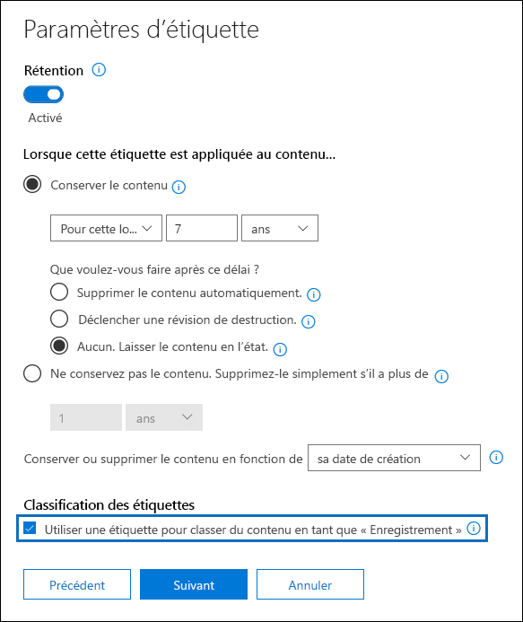
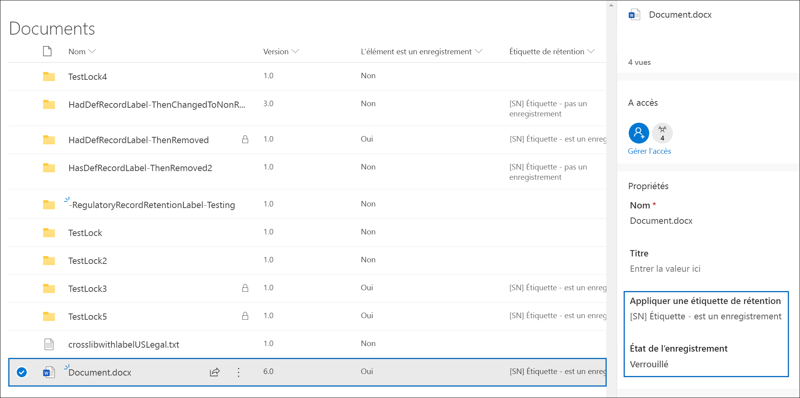

# Déclarer des enregistrements à l’aide d’étiquettes de rétention

>*[Guide de sécurité et conformité pour les licences Microsoft 365](https://aka.ms/ComplianceSD).*

Pour déclarer des articles comme étant un enregistrement, vous utilisez [des étiquettes de conservation](retention.md#retention-labels)qui marquent le contenu comme étant un enregistrement. Vous pouvez soit publier ces étiquettes pour permettre aux utilisateurs et aux administrateurs de les appliquer manuellement au contenu, soit appliquer automatiquement ces étiquettes au contenu que vous voulez marquer comme enregistrement.

## Configuration d’étiquettes de rétention pour déclarer des enregistrements

Lorsque vous créez ou configurez une étiquette de conservation, sélectionnez l'option permettant de marquer le contenu comme un enregistrement.

>[!NOTE] 
> L’option de marquage du contenu en tant qu’enregistrement n’est pas disponible lorsque vous créez ou configurez des étiquettes de rétention depuis **Gouvernance des informations** dans le centre de conformité Microsoft 365. Au lieu de cela, vous devez utiliser**Gestion des enregistrements**.

Créer un nouveau label de conservation qui marque le contenu comme un enregistrement :

1. Dans le [centre de conformité Microsoft 365](https://compliance.microsoft.com), accédez à **Gestion des enregistrements** \> **Plan de gestion de fichiers**. Dans la page **plan de fichiers**, cliquez **créer une étiquette**.

2. Sur la page **Paramètres d’étiquette** de l’Assistant, choisissez l’option permettant de classifier du contenu sous la forme d’un enregistrement.
    
   

3. Appliquez l’étiquette de rétention aux documents SharePoint ou OneDrive et aux messages électroniques Exchange, le cas échéant. Pour obtenir des instructions :
    
    - [Créer des étiquettes de rétention et les appliquer dans les applications](create-apply-retention-labels.md)
    
    - [Appliquer automatiquement une étiquette de rétention au contenu](apply-retention-labels-automatically.md)

## Application de l’étiquette de rétention configurée au contenu

Lorsque des étiquettes de rétention qui marquent le contenu en tant qu’enregistrement sont mises à la disposition des utilisateurs pour qu’ils les appliquent dans les applications :

- Pour Exchange, tout utilisateur disposant d’un accès en écriture à la boîte aux lettres peut appliquer ces étiquettes. 
- Pour SharePoint et OneDrive, tous les utilisateurs du groupe Membres par défaut (niveau d’autorisation Collaboration) peuvent appliquer ces étiquettes.

Exemple d’un document marqué en tant qu’enregistrement à l’aide d’une étiquette de rétention :

## Étapes suivantes

Pour une liste des scénarios pris en charge par la gestion des documents, voir [Scénarios communs pour la gestion des documents](get-started-with-records-management.md#common-scenarios-for-records-management).
