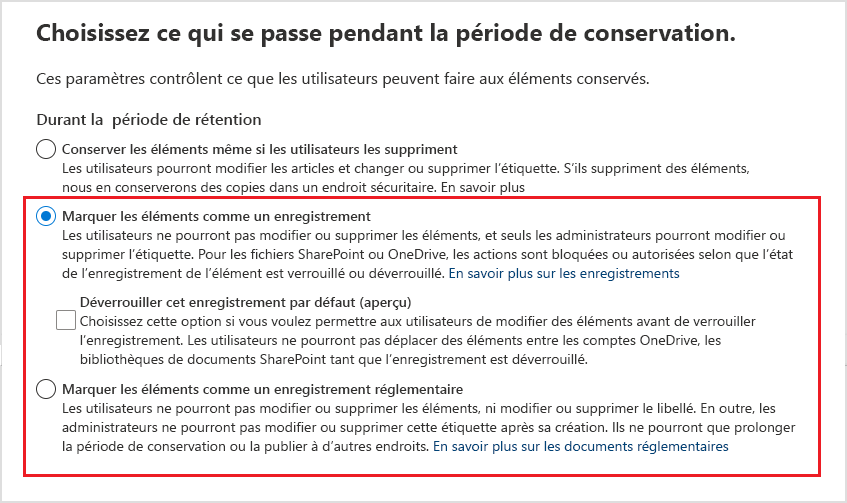

# <a name="declare-records-by-using-retention-labels"></a>Déclarer des enregistrements à l’aide d’étiquettes de rétention

>*[Guide de sécurité et conformité pour les licences Microsoft 365](/office365/servicedescriptions/microsoft-365-service-descriptions/microsoft-365-tenantlevel-services-licensing-guidance/microsoft-365-security-compliance-licensing-guidance).*

Pour déclarer des documents et courriers électroniques comme [enregistrements](records-management.md#records), utilisez [des étiquettes de rétention](retention.md#retention-labels) qui servent à marquer du contenu comme **enregistrement** ou **enregistrement réglementaire**.

Si vous n’êtes pas certain d’utiliser un enregistrement ou un enregistrement réglementaire, voir [comparer les restrictions relatives aux actions autorisées ou bloquées](records-management.md#compare-restrictions-for-what-actions-are-allowed-or-blocked). Si vous avez besoin d’utiliser des enregistrements réglementaires, vous devez commencer par exécuter une commande PowerShell, comme décrit dans la section suivante.

Vous pouvez soit publier ces étiquettes dans une stratégie d’étiquette de rétention pour permettre aux utilisateurs et aux administrateurs de les appliquer au contenu, ou pour les étiquettes qui marquent les éléments comme enregistrements ( mais pas enregistrements réglementaire) appliquer automatiquement ces étiquettes au contenu que vous voulez marquer comme enregistrement.

## <a name="how-to-display-the-option-to-mark-content-as-a-regulatory-record"></a>Comment afficher l’option de marquage du contenu en tant qu’enregistrement réglementaire

> [!NOTE]
> La procédure suivante est une action pouvant être audité, à l’aide de la journalisation **option d’enregistrement réglementaire activée pour les étiquettes de rétention** dans la section du journal d’audit [Stratégie de rétention et activités des étiquettes de rétention](search-the-audit-log-in-security-and-compliance.md#retention-policy-and-retention-label-activities).

Par défaut, l’option d’étiquette de rétention permettant de marquer du contenu en tant qu’enregistrement de réglementation n’apparaît pas dans l’assistant de l’étiquette de rétention. Pour afficher cette option, vous devez commencer par exécuter une commande PowerShell:

1. [Connectez-vous au PowerShell du Centre de sécurité et conformité Office 365](/powershell/exchange/office-365-scc/connect-to-scc-powershell/connect-to-scc-powershell).

2. Exécutez la l’applet commande suivant :

    ```powershell
    Set-RegulatoryComplianceUI -Enabled $true
    ````

    Il n’y a pas d’invite à confirmer et le paramètre prend effet immédiatement.

Si vous changez d’avis sur la façon de voir cette option dans l’assistant étiquette de rétention, vous pouvez la masquer à nouveau en exécutant le même applet de commande avec la **valeur** faux: `Set-RegulatoryComplianceUI -Enabled $false`

## <a name="configuring-retention-labels-to-declare-records"></a>Configuration d’étiquettes de rétention pour déclarer des enregistrements

Lorsque vous créez une étiquette de rétention à partir de la solution **Gestion des enregistrements** dans le Centre de conformité Microsoft 365, vous pouvez sélectionner l’option **Marquer les éléments en tant qu’enregistrement**. Ensuite, en tant qu’option supplémentaire actuellement déployée en préversion, déverrouillez l’enregistrement par défaut pour SharePoint et OneDrive.

L’option supplémentaire de **Déverrouiller cet enregistrement par défaut** permet aux utilisateurs de déclarer eux-mêmes les enregistrements, car ils verrouillent l’enregistrement lorsqu’ils ont terminé de modifier le contenu. Pour plus d’informations sur ce scénario pris en charge, consultez [Utiliser le contrôle de version des enregistrements pour mettre à jour les enregistrements stockés dans SharePoint ou OneDrive](record-versioning.md).

Si vous avez exécuté la commande PowerShell à partir de la section précédente, vous pouvez marquer les éléments comme un enregistrement réglementaire de manière alternative.

Par exemple :



En utilisant cette étiquette de rétention, vous pouvez désormais l’appliquer aux documents SharePoint ou OneDrive et aux messages électroniques Exchange, comme souhaité.

Pour instructions complètes :

- [Publier des étiquettes de rétention et les appliquer dans les applications](create-apply-retention-labels.md)

- [Appliquer une étiquette de rétention au contenu automatiquement](apply-retention-labels-automatically.md) (non pris en charge pour les enregistrements réglementaires)

## <a name="tenant-setting-for-editing-record-properties"></a>Paramètre du client pour la modification des propriétés d’enregistrement

Si vous utilisez des étiquettes de rétention pour déclarer des éléments en tant qu’enregistrements (plutôt que des enregistrements réglementaires) dans SharePoint et OneDrive, déterminez si vous devez modifier le paramètre de locataire par défaut qui permet aux utilisateurs de modifier les propriétés pour un [fichier verrouillé](record-versioning.md)lorsque les fichiers sont supérieurs à 0 octets.

Pour modifier cette valeur par défaut, accédez au [Centre de conformité Microsoft 365](https://compliance.microsoft.com/) > **Gestion des enregistrements** > **Paramètres de gestion des enregistrements** > **Étiquettes de rétention** > **Autorisez la modification des propriétés d’enregistrement** puis désactivez le paramètre **Autorisez les utilisateurs à modifier les propriétés d’enregistrement**.

## <a name="applying-the-configured-retention-label-to-content"></a>Application de l’étiquette de rétention configurée au contenu

Lorsque des étiquettes de rétention qui marquent le contenu en tant qu’enregistrement ou enregistrement réglementaire sont mises à la disposition des utilisateurs pour qu’ils les appliquent dans les applications:

- Pour Exchange, tout utilisateur disposant d’un accès en écriture à la boîte aux lettres peut appliquer ces étiquettes.
- Pour SharePoint et OneDrive, tous les utilisateurs du groupe Membres par défaut (niveau d’autorisation Collaboration) peuvent appliquer ces étiquettes.

Exemple d’un document marqué en tant qu’enregistrement à l’aide d’une étiquette de rétention :


## <a name="searching-the-audit-log-for-labeled-items-that-were-declared-records"></a>Effectuer une recherche du journal d’audit pour les éléments étiquetés déclarés comme enregistrements.

Les actions d’étiquetage pour déclarer des éléments comme enregistrements sont enregistrés dans le journal d’audit.

Pour les éléments SharePoint :
- Dans **Activités sur les fichiers et les pages**, sélectionnez **Changement d’une étiquette de rétention pour un fichier**. Cet événement d’audit est destiné aux étiquettes de rétention marquant des éléments comme enregistrements, des enregistrements réglementaires ou qui sont des étiquettes de rétention standard.

Pour les éléments Exchange :
- Dans **Activités sur la boîte aux lettres Exchange**, sélectionnez **Message étiqueté comme enregistrement**. Cet événement d’audit est destiné aux étiquettes de rétention marquant des éléments comme enregistrements ou des enregistrements réglementaires.

Pour plus d’informations sur la recherche de ces événements, consultez [Effectuer une recherche dans le journal d’audit dans le centre de sécurité et conformité](search-the-audit-log-in-security-and-compliance.md#file-and-page-activities).

## <a name="next-steps"></a>Étapes suivantes

Comprendre comment utiliser le [contrôle de version des enregistrements pour mettre à jour les enregistrements stockés dans SharePoint ou OneDrive](record-versioning.md).