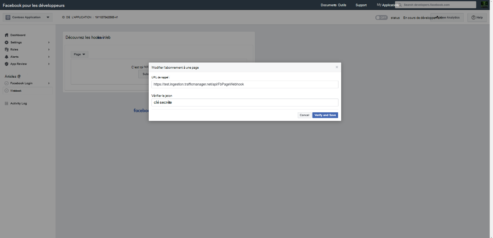

# Déployer un connecteur pour archiver les données des pages Facebook Business

[!include[Purview banner](../includes/purview-rebrand-banner.md)]

Cet article contient le processus pas à pas pour déployer un connecteur qui utilise le service d’importation Office 365 pour importer des données à partir de pages Facebook Business vers Microsoft 365. Pour obtenir une vue d’ensemble générale de ce processus et une liste des conditions préalables requises pour déployer un connecteur Facebook, consultez [Configurer un connecteur pour archiver les données Facebook](archive-facebook-data-with-sample-connector.md).

## Étape 1 : Créer une application dans Azure Active Directory

1. Accédez à <https://portal.azure.com> et connectez-vous à l’aide des informations d’identification d’un compte d’administrateur général.

    

2. Dans le volet de navigation gauche, cliquez sur **Azure Active Directory**.

    

3. Dans le volet de navigation gauche, cliquez sur **inscriptions d'applications (préversion),** puis sur **Nouvelle inscription**.

    

4. Inscrivez l’application. Sous URI de redirection, sélectionnez Web dans la liste déroulante de type d’application, puis tapez <https://portal.azure.com> dans la zone de l’URI.

   

5. Copiez **l’ID d’application (client)** et **l’ID d’annuaire (locataire)** et enregistrez-les dans un fichier texte ou un autre emplacement sécurisé. Vous utiliserez ces ID dans les étapes suivantes.

   

6. Accédez à **Certificats & secrets pour la nouvelle application.**

   

7. Cliquez sur **Nouveau secret client**

   

8. Créez un secret. Dans la zone de description, tapez le secret, puis choisissez une période d’expiration.

    

9. Copiez la valeur du secret et enregistrez-la dans un fichier texte ou un autre emplacement de stockage. Il s’agit du secret d’application AAD que vous utiliserez dans les étapes ultérieures.

   

## Étape 2 : Déployer le service web du connecteur à partir de GitHub sur votre compte Azure

1. Accédez à [ce site GitHub](https://github.com/microsoft/m365-sample-connector-csharp-aspnet), puis cliquez sur **Déployer sur Azure**.

    

2. Après avoir cliqué sur **Déployer sur Azure**, vous êtes redirigé vers un Portail Azure avec une page de modèle personnalisée. Renseignez les **informations de base** et **Paramètres**, puis cliquez sur **Acheter**.

   - **Abonnement:** Sélectionnez votre abonnement Azure sur lequel vous souhaitez déployer le service web du connecteur de pages Facebook Business.

   - **Groupe de ressources :** Choisissez ou créez un groupe de ressources. Un groupe de ressources est un conteneur qui contient des ressources associées pour une solution Azure.

   - **Emplacement:** Choisissez un emplacement.

   - **Nom de l’application web :** Fournissez un nom unique pour l’application web du connecteur. Le nom doit comporter entre 3 et 18 caractères. Ce nom est utilisé pour créer l’URL d’Azure App Service ; Par exemple, si vous fournissez le nom de l’application web de **fbconnector** , l’URL du service d’application Azure sera **fbconnector.azurewebsites.net**.

   - **tenantId :** ID de locataire de votre organisation Microsoft 365 que vous avez copiée après avoir créé l’application de connecteur Facebook dans Azure Active Directory à l’étape 1.

   - **APISecretKey :** Vous pouvez taper n’importe quelle valeur comme secret. Il est utilisé pour accéder à l’application web du connecteur à l’étape 5.

     

3. Une fois le déploiement réussi, la page ressemble à la capture d’écran suivante :

   

## Étape 3 : Inscrire l’application Facebook

1. Accédez à <https://developers.facebook.com>, connectez-vous à l’aide des informations d’identification du compte pour les pages Facebook Business de votre organisation, puis cliquez sur **Ajouter une nouvelle application**.

   

2. Créez un ID d’application.

   

3. Dans le volet de navigation gauche, cliquez sur **Ajouter des produits** , puis sur **Configurer** dans la vignette **Connexion Facebook** .

   

4. Sur la page Intégrer la connexion Facebook, cliquez sur **Web**.

   

5. Ajouter l’URL d’Azure App Service ; par exemple `https://fbconnector.azurewebsites.net`.

   

6. Suivez la section Démarrage rapide de la configuration de la connexion Facebook.

   

7. Dans le volet de navigation gauche sous **Connexion Facebook**, cliquez sur **Paramètres** et ajoutez l’URI de redirection OAuth dans la zone **URI de redirection OAuth valide**. Utilisez le format **\<connectorserviceuri>/Views/FacebookOAuth**, où la valeur de connectorserviceuri est l’URL du service d’application Azure pour votre organisation, par exemple. `https://fbconnector.azurewebsites.net`

   

8. Dans le volet de navigation gauche, cliquez sur **Ajouter des produits** , puis sur **Webhooks.** Dans le menu **déroulant Page** , cliquez sur **Page**.

   

9. Ajoutez l’URL de rappel webhooks et ajoutez un jeton de vérification. Format de l’URL de rappel, utilisez le format `<connectorserviceuri>/api/FbPageWebhook`, où la valeur de connectorserviceuri est l’URL azure app service pour votre organisation ; par exemple `https://fbconnector.azurewebsites.net`.

   Le jeton de vérification doit ressembler à un mot de passe fort. Copiez le jeton de vérification dans un fichier texte ou un autre emplacement de stockage.

   

10. Testez et abonnez-vous au point de terminaison pour le flux.

    

11. Ajoutez une URL de confidentialité, une icône d’application et une utilisation professionnelle. Copiez également l’ID d’application et le secret d’application dans un fichier texte ou un autre emplacement de stockage.

    

12. Rendre l’application publique.

    

13. Ajoutez un utilisateur au rôle d’administrateur ou de testeur.

    

14. Ajoutez l’autorisation **d’accès au contenu public de la page** .

    

15. Ajouter l’autorisation Gérer les pages.

    

16. Obtenez l’application examinée par Facebook.

    

## Étape 4 : Configurer l’application web du connecteur

1. Accédez à `https://<AzureAppResourceName>.azurewebsites.net` (où AzureAppResourceName est le nom de votre ressource d’application Azure que vous avez nommée à l’étape 4). Par exemple, si le nom est **fbconnector**, accédez à `https://fbconnector.azurewebsites.net`. La page d’accueil de l’application ressemble à la capture d’écran suivante :

   

2. Cliquez sur **Configurer** pour afficher une page de connexion.

   

3. Dans la zone ID de locataire, tapez ou collez votre ID de locataire (que vous avez obtenu à l’étape 2). Dans la zone de mot de passe, tapez ou collez la clé APISecretKey (obtenue à l’étape 2), puis cliquez sur **Définir la configuration Paramètres** pour afficher la page des détails de configuration.

    

4. Entrez les paramètres de configuration suivants

   - **ID d’application Facebook :** ID d’application pour l’application Facebook que vous avez obtenu à l’étape 3.

   - **Secret d’application Facebook :** Secret d’application pour l’application Facebook que vous avez obtenue à l’étape 3.

   - **Les webhooks Facebook vérifient le jeton :** Jeton de vérification que vous avez créé à l’étape 3.

   - **AAD ID d’application : ID** d’application pour l’application Azure Active Directory que vous avez créée à l’étape 1.

   - **AAD secret d’application :** valeur du secret APISecretKey que vous avez créé à l’étape 1.

5. Cliquez sur **Enregistrer** pour enregistrer les paramètres du connecteur.

## Étape 5 : Configurer un connecteur Facebook dans le portail de conformité

1. Accédez au portail de conformité Microsoft Purview, puis sélectionnez <a href="https://go.microsoft.com/fwlink/p/?linkid=2173865" target="_blank">**Connecteurs de données**</a.

2. Dans la page **Connecteurs de données** sous **les pages Facebook Business**, cliquez sur **Afficher**.

3. Sur la page **Des pages d’affaires Facebook** , cliquez sur **Ajouter un connecteur**.

4. Dans la page **Conditions d’utilisation** , cliquez sur **Accepter**.

5. Dans la page **Ajouter des informations d’identification pour votre application de connecteur** , entrez les informations suivantes, puis cliquez sur **Valider la connexion**.

   

   - Dans la zone **Nom** , tapez un nom pour le connecteur, tel que la **page d’actualités Facebook**.

   - Dans la zone **URL de connexion** , tapez ou collez l’URL azure app service ; par exemple `https://fbconnector.azurewebsites.net`.

   - Dans la zone **Mot de passe, tapez** ou collez la valeur de la clé APISecretKey que vous avez ajoutée à l’étape 2.

   - Dans la **zone d’ID Azure App**, tapez ou collez la valeur de l’ID d’application (client) également appelé AAD ID d’application que vous avez créé à l’étape 1.

6. Une fois la connexion validée, cliquez sur **Suivant**.

7. Dans la **page Autoriser Microsoft 365 d’importer des données**, tapez ou collez à nouveau apiSecretKey, puis cliquez sur **Connexion à l’application web**.

8. Dans la page **Configurer l’application connecteur Facebook** , cliquez sur **Connexion avec Facebook** et connectez-vous à l’aide des informations d’identification du compte pour les pages Facebook Business de votre organisation. Assurez-vous que le rôle d’administrateur des pages Facebook Business de votre organisation est attribué au compte Facebook auquel vous vous êtes connecté.

   

9. Une liste des pages métier gérées par le compte Facebook auquel vous vous êtes connecté s’affiche. Sélectionnez la page à archiver, puis cliquez sur **Suivant**.

   

10. Cliquez sur **Continuer** pour quitter la configuration de l’application de service de connecteur.

11. Dans la page **Définir les filtres** , vous pouvez appliquer un filtre pour importer initialement des éléments d’un certain âge. Sélectionnez un âge, puis cliquez sur **Suivant**.

12. Dans la page **Choisir l’emplacement de stockage, tapez** l’adresse e-mail de Microsoft 365 boîte aux lettres vers laquelle les éléments Facebook seront importés, puis cliquez sur **Suivant**.

13. Cliquez sur **Suivant** pour passer en revue les paramètres du connecteur, puis cliquez sur **Terminer** pour terminer la configuration du connecteur.

14. Dans le centre de conformité, accédez à la page **Connecteurs de données** , puis cliquez sur l’onglet **Connecteurs** pour voir la progression du processus d’importation.
