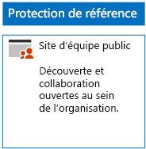
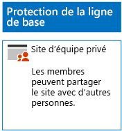
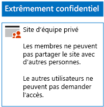

# Déployer des sites SharePoint Online pour trois niveaux de protection

Utilisez les étapes de cet article pour concevoir et déployer des sites d’équipe SharePoint Online de base de référence, sensibles et hautement confidentiels. Pour plus d’informations sur ces trois niveaux de protection, consultez [Sécuriser des sites et des fichiers SharePoint Online](../security/office-365-security/secure-sharepoint-online-sites-and-files.md).
  
## Sites d’équipe SharePoint Online de base de référence

La protection Base de référence inclut les sites d’équipe publics et privés. Les sites d’équipe publics peuvent être découverts et sont accessibles par toute personne de l’organisation. Les sites privés peuvent être découverts et sont accessibles seulement par les membres du groupe Office 365 associé au site d’équipe. Ces deux types de sites d’équipe permettent aux membres de partager le site avec d’autres utilisateurs.
  
### Public

Pour créer un site d’équipe SharePoint Online de base de référence avec un accès et des autorisations publics, suivez [ces instructions](https://support.office.com/article/create-a-team-site-in-sharepoint-ef10c1e7-15f3-42a3-98aa-b5972711777d).

Voici la configuration finale.
  

  
### Privé

Pour créer un site d’équipe SharePoint Online de base de référence avec un accès et des autorisations privés, suivez [ces instructions](https://support.office.com/article/create-a-team-site-in-sharepoint-ef10c1e7-15f3-42a3-98aa-b5972711777d).
  
Voici la configuration finale.
  

  
## Sites d’équipe SharePoint Online sensibles

Un site d’équipe SharePoint Online sensible démarre en tant que site d’équipe privé.
  
Commencez par créer le site d’équipe privé SharePoint Online en suivant [ces instructions](https://support.office.com/article/create-a-team-site-in-sharepoint-ef10c1e7-15f3-42a3-98aa-b5972711777d).

Ensuite, dans le nouveau site d’équipe SharePoint Online, configurez d’autres paramètres autorisations en suivant ces étapes.

1.  Dans la barre d’outils du site d’équipe SharePoint, cliquez sur l’icône Paramètres, puis cliquez sur **Autorisations du site**.
2.  Dans le volet **Autorisations de site**, sous **Paramètres de partage**, cliquez sur **Modifier les paramètres de partage**.
3.  Sous **Autorisations de partage**, sélectionnez **Seuls les propriétaires du site peuvent partager des fichiers, des dossiers et le site**, puis cliquez sur **Enregistrer**.

Voici les résultats que vous devez escompter :

- La possibilité pour les membres de partager avec d’autres membres est désactivée.
- La possibilité pour les non-membres de demander l’accès est activée.

Voici la configuration finale.
  

  
Les membres du site, via l’appartenance à un des groupes d’accès, peuvent désormais collaborer sur les ressources du site de façon sécurisée.
  
## Sites d’équipe SharePoint Online hautement confidentiels

Un site d’équipe SharePoint Online hautement confidentiel est un site d’équipe privé avec des paramètres d’autorisations supplémentaires.

Commencez par créer le site d’équipe privé SharePoint Online en suivant [ces instructions](https://support.office.com/article/create-a-team-site-in-sharepoint-ef10c1e7-15f3-42a3-98aa-b5972711777d).

Ensuite, dans le nouveau site d’équipe SharePoint Online, configurez d’autres paramètres autorisations en suivant ces étapes.

1.  Dans la barre d’outils du site d’équipe SharePoint, cliquez sur l’icône Paramètres, puis cliquez sur **Autorisations du site**.
2.  Dans le volet **Autorisations de site**, sous **Paramètres de partage**, cliquez sur **Modifier les paramètres de partage**.
3.  Sous **Autorisations de partage**, sélectionnez **Seuls les propriétaires du site peuvent partager des fichiers, des dossiers et le site**.
4. Désactivez **Autoriser les demandes d’accès**, puis cliquez sur **Enregistrer**.

Voici les résultats que vous devez escompter :

- La possibilité pour les membres de partager avec d’autres membres est désactivée.
- La possibilité pour les non-membres de demander l’accès est désactivée.

Voici la configuration finale.
  

  
Les membres du site, via l’appartenance à un des groupes d’accès, peuvent désormais collaborer sur les ressources du site de façon sécurisée.
  
## Étape suivante

[Protéger les fichiers SharePoint Online avec des étiquettes Office 365 et la protection contre la perte de données](protect-sharepoint-online-files-with-office-365-labels-and-dlp.md)

## Voir aussi

[Sécuriser les fichiers et sites SharePoint Online](../security/office-365-security/secure-sharepoint-online-sites-and-files.md)
  
[Conseils de sécurité Microsoft pour les campagnes électorales, les organisations à but non lucratif et d’autres organisations flexibles](/security/office-365-security/microsoft-security-guidance-for-political-campaigns-nonprofits-and-other-agile-o.md)
  
[Adoption du cloud et solutions hybrides](https://docs.microsoft.com/office365/enterprise/cloud-adoption-and-hybrid-solutions)
