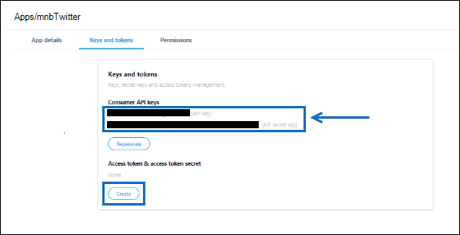

# Déployer un connecteur pour archiver des données Twitter

Cet article contient le processus pas à pas pour déployer un connecteur qui utilise le service d’importation Office 365 pour importer des données à partir du compte Twitter de votre organisation vers Microsoft 365. Pour une vue d’ensemble de ce processus et une liste des conditions préalables requises pour déployer un connecteur Twitter, voir Configurer un connecteur pour archiver les [données Twitter. ](archive-twitter-data-with-sample-connector.md) 

## Étape 1 : Créer une application dans Azure Active Directory

1. Go to <https://portal.azure.com> and sign in using the credentials of a global admin account.

   

2. Dans le volet de navigation gauche, cliquez sur **Azure Active Directory**.

   

3. Dans le volet de navigation de gauche, cliquez sur **Inscriptions d’applications (prévisualisation),** puis sur **Nouvelle inscription.**

   

4. Inscrivez l’application. Sous **URI de redirection (facultatif),** sélectionnez **Web** dans la liste rouge type d’application, puis tapez dans la zone de `https://portal.azure.com` l’URI.

   

5. Copiez **l’ID d’application (client)** et l’ID d’annuaire **(client)** et enregistrez-les dans un fichier texte ou un autre emplacement sûr. Vous utiliserez ces ID dans les étapes ultérieures.

    

6. Go to **Certificates & secrets for the new app** and under Client **secrets** click New **client secret**.

   

7. Créez une nouvelle secret. Dans la zone de description, tapez le secret, puis choisissez une période d’expiration. 

   

8. Copiez la valeur de la secret et enregistrez-la dans un fichier texte ou un autre emplacement de stockage. Il s’agit de la question secrète de l’application AAD que vous utiliserez dans les étapes ultérieures.

   

## Étape 2 : Déployer le service web connecteur à partir de GitHub votre compte Azure

1. Go to [this GitHub site](https://github.com/microsoft/m365-sample-twitter-connector-csharp-aspnet) and click Deploy to **Azure**.

    

2. Une fois que vous avez **cliqué sur Déployer** vers Azure, vous êtes redirigé vers un portail Azure avec une page de modèle personnalisée. Remplissez les **informations de base** et **Paramètres,** puis cliquez sur **Acheter.**

   

    - **Abonnement :** Sélectionnez votre abonnement Azure sur qui vous souhaitez déployer le service web de connecteur Twitter.
    
    - **Groupe de ressources :** Choisissez ou créez un groupe de ressources. Un groupe de ressources est un conteneur qui contient des ressources associées pour une solution Azure.

    - **Emplacement :** Choisissez un emplacement.

    - **Nom de l’application web :** Fournissez un nom unique pour l’application web du connecteur. La longueur du nom doit être de 3 à 18 caractères. Ce nom est utilisé pour créer l’URL du service d’application Azure ; par exemple, si vous fournissez le nom de l’application Web **twitterconnector,** l’URL du service d’application Azure **sera twitterconnector.azurewebsites.net**.
    
    - **tenantId :** ID client de votre organisation Microsoft 365 que vous avez copié après avoir créé l’application connecteur Facebook dans Azure Active Directory à l’étape 1.
    
   - **APISecretKey :** Vous pouvez taper n’importe quelle valeur comme secret. Il permet d’accéder à l’application web de connecteur à l’étape 5.

3. Une fois le déploiement réussi, la page ressemble à la capture d’écran suivante :

    

## Étape 3 : Créer l’application Twitter

1. Go to https://developer.twitter.com , log in using the credentials for the developer account for your organization, and then click **Apps**.

   
2. Cliquez **sur Créer une application.**
   
   

3. Sous **Détails de l’application,** ajoutez des informations sur l’application.

   

4. Dans le tableau de bord du développeur Twitter, sélectionnez l’application que vous avez créée, puis cliquez sur **Détails.**
   
   

5. Sous **l’onglet** Clés et jetons, sous Clés **d’API** consommateur, copiez la clé d’API et la clé secrète API et enregistrez-les dans un fichier texte ou un autre emplacement de stockage. Cliquez ensuite **sur Créer** pour générer un jeton d’accès et une secret de jeton d’accès, puis copiez-les dans un fichier texte ou un autre emplacement de stockage.
   
   

   Cliquez ensuite **sur Créer** pour générer un jeton d’accès et une secret de jeton d’accès, puis copiez-les dans un fichier texte ou un autre emplacement de stockage.

6. Cliquez sur **l’onglet Autorisations** et configurez les autorisations comme illustré dans la capture d’écran suivante :

   

7. Après avoir enregistrer les paramètres d’autorisation, cliquez sur l’onglet **Détails** de l’application, puis cliquez sur **Modifier > modifier les détails.**

   

8. Effectuer les tâches suivantes :

   - Cochez la case pour autoriser l’application connecteur à se connecter à Twitter.
   
   - Ajoutez l’URI de redirection OAuth au format suivant : **\<connectorserviceuri> /Views/TwitterOAuth**, où la valeur de *connectorserviceuri* est l’URL du service d’application Azure pour votre organisation ; par exemple, https://twitterconnector.azurewebsites.net/Views/TwitterOAuth .

    

L’application de développement Twitter est maintenant prête à être utilisé.

## Étape 4 : Configurer l’application web du connecteur 

1. Go to https:// \<AzureAppResourceName> .azurewebsites.net (where **AzureAppResourceName** is the name of your Azure app resource that you named in Step 4). Par exemple, si le nom est **twitterconnector**, allez à https://twitterconnector.azurewebsites.net . La page d’accueil de l’application ressemble à la capture d’écran suivante :

   

2. Cliquez **sur Configurer pour** afficher une page de signature.

   

3. Dans la zone ID de locataire, tapez ou collez votre ID de client (que vous avez obtenu à l’étape 2). Dans la zone de mot de passe, tapez ou collez la clé APISecretKey (obtenue à l’étape 2), puis cliquez sur Définir la configuration **Paramètres** pour afficher la page de détails de configuration.

   

4. Entrez les paramètres de configuration suivants 

   - **Clé d’api Twitter :** Clé d’API pour l’application Twitter que vous avez créée à l’étape 3.
   
   - **Clé secrète de l’api Twitter :** Clé secrète API pour l’application Twitter que vous avez créée à l’étape 3.
   
   - **Jeton d’accès Twitter :** Jeton d’accès que vous avez créé à l’étape 3.
   
   - **Secret du jeton d’accès Twitter :** Secret de jeton d’accès que vous avez créé à l’étape 3.
   
   - **ID d’application AAD :** ID de l’application Azure Active Directory que vous avez créée à l’étape 1
   
   - **Secret d’application AAD :** Valeur de la clé secrète APISecretKey que vous avez créée à l’étape 1.

5. Cliquez **sur Enregistrer** pour enregistrer les paramètres du connecteur.

## Étape 5 : Configurer un connecteur Twitter dans le centre Microsoft 365 conformité

1. Go to [https://compliance.microsoft.com](https://compliance.microsoft.com) and then click Data **connectors** in the left nav.

2. Dans la page **Connecteurs de données** sous **Twitter,** cliquez sur **Afficher.**

3. Dans la page **Twitter,** cliquez sur **Ajouter un connecteur.**

4. Dans la page **Conditions d’utilisation,** cliquez sur **Accepter.**

5. Dans la page **Ajouter des informations d’identification pour votre** application de connecteur, entrez les informations suivantes, puis cliquez sur Valider la **connexion.**

   

    - Dans la **zone** Nom, tapez un nom pour le connecteur, tel que le handle **d’aide de Twitter.**
    
    - Dans la zone **URL du connecteur,** tapez ou collez l’URL du service d’application Azure . par `https://twitterconnector.azurewebsites.net` exemple.
    
    - Dans la **zone Mot** de passe, tapez ou collez la valeur de l’APISecretKey que vous avez créée à l’étape 2.
    
    - Dans la **zone ID** d’application Azure, tapez ou collez la valeur de l’ID d’application Azure (également appelé *ID client)* que vous avez obtenue à l’étape 1.

6. Une fois la connexion validée, cliquez sur **Suivant.**

7. Dans la page **Autoriser Microsoft 365** importer des données, tapez ou collez de nouveau l’APISecretKey, puis cliquez sur Login **web app**.

8. Cliquez **sur Se connecter avec Twitter.**

9. Sur la page de connexion à Twitter, connectez-vous à l’aide des informations d’identification du compte Twitter de votre organisation.

   

   Une fois que vous êtes connecté, la page Twitter affiche le message suivant, « Le travail connecteur Twitter a été correctement installé ».

10. Cliquez **sur Continuer** pour terminer la configuration du connecteur Twitter.

11. Dans la page **Définir les filtres,** vous pouvez appliquer un filtre pour importer initialement des éléments d’un certain âge. Sélectionnez un âge, puis cliquez sur **Suivant**.

12. Dans la page **Choisir** l’emplacement de stockage, tapez l’adresse de messagerie Microsoft 365 boîte aux lettres dans Microsoft 365 vers qui les éléments Twitter seront importés, puis cliquez sur **Suivant**.

13. Cliquez **sur Suivant** pour passer en revue les paramètres du connecteur, puis cliquez sur **Terminer** pour terminer la configuration du connecteur.

14. Dans le centre de conformité, allez à la page **Connecteurs** de données, puis cliquez sur l’onglet **Connecteurs** pour voir la progression du processus d’importation.
