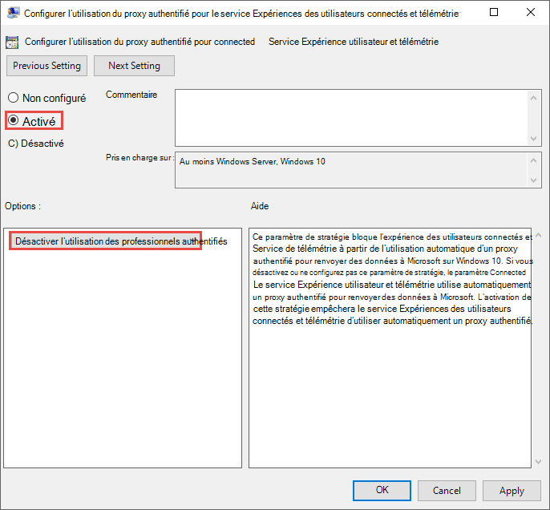
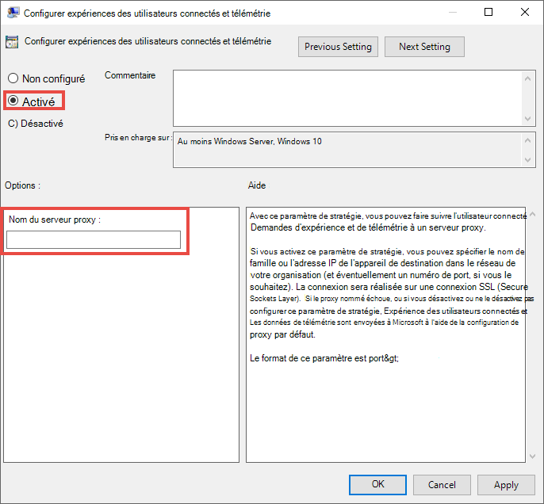

# <a name="configure-device-proxy-and-internet-connection-settings-for-information-protection"></a>Configurer les paramètres de proxy d’appareil et de connexion Internet pour Information Protection

Les technologies de Microsoft pour point de terminaison utilisent Microsoft Windows HTTP (WinHTTP) pour signaler des données et communiquer avec le service cloud du point de terminaison Microsoft. Le service incorporé s’exécute dans le contexte système à l’aide du compte LocalSystem.

> [!TIP]
> Pour les organisations qui utilisent des proxies de transfert comme passerelle vers l'Internet, vous pouvez utiliser la protection du réseau pour enquêter derrière un proxy. Pour plus d'informations, voir [Enquêter sur les événements de connexion qui se produisent derrière les procurations](/windows/security/threat-protection/microsoft-defender-atp/investigate-behind-proxy).

Le paramètre de configuration de WinHTTP est indépendant des paramètres du proxy de navigation Internet de Windows (WinINet) et ne peut découvrir un serveur proxy qu'en utilisant les méthodes de découverte automatique suivantes :

- Proxy transparent
- Protocole WPAD (Web Proxy Auto-Discovery Protocol)

> [!NOTE]
> Si vous utilisez un proxy transparent ou WPAD dans votre topologie de réseau, vous n'avez pas besoin de paramètres de configuration particuliers. Pour plus d'informations sur le Defender for Endpoint URL exclusions in the proxy, voir[Activer l'accès aux URL des services DLP dans le cloud du point de terminaison dans le serveur proxy](#enable-access-to-endpoint-dlp-cloud-service-urls-in-the-proxy-server).

- Configuration manuelle du proxy statique :
  - Configuration basée sur le registre
  - WinHTTP configuré à l'aide de la commande netsh – Convient uniquement aux ordinateurs de bureau à topologie stable (par exemple : un ordinateur de bureau dans un réseau d'entreprise derrière le même proxy)

## <a name="configure-the-proxy-server-manually-using-a-registry-based-static-proxy"></a>Configurer le serveur proxy manuellement en utilisant un proxy statique basé sur le registre

Pour les terminaux qui ne sont pas autorisés à se connecter à Internet, vous devez configurer un proxy statique basé sur le registre. Vous devez configurer ceci pour autoriser uniquement Microsoft Endpoint DLP à signaler des données de diagnostic et à communiquer avec le service cloud Microsoft Endpoint.

Le proxy statique est configurable via une stratégie de groupe. La stratégie de groupe se trouve sous :

1. Ouvrir **Modèles administratifs > Composants Windows > Collections de données et Builds d’aperçu > Configurer l’utilisation du proxy authentifié pour l’expérience utilisateur connecté et le service de télémétrie**

2. Définir sur **Activer** puis sélectionnez **Désactiver l'utilisation d'un proxy authentifié**:

   

3. Ouvrir **Modèles administratifs > Composants Windows > Collections de données et Builds d’aperçu > Configurer l’utilisation du proxy authentifié pour l’expérience utilisateur connecté et le service de télémétrie**:

   Configurer le proxy

   

   La stratégie définit deux valeurs de registre `TelemetryProxyServer` comme REG_SZ et `DisableEnterpriseAuthProxy` comme REG_DWORD sous la clé de registre `HKLM\Software\Policies\Microsoft\Windows\DataCollection`.

   La valeur de registre TelemetryProxyServer est au format \<server name or ip\>:\<port\>. Par exemple, **10.0.0.6:8080**

   Cette valeur de registre `DisableEnterpriseAuthProxy` doit être égale à 1.

## <a name="configure-the-proxy-server-manually-using-netsh-command"></a>Configurer le serveur proxy manuellement à l’aide de la commande « netsh »

Utiliser netsh pour configurer un proxy statique à l’échelle du système.

> [!NOTE]
> Cela affectera toutes les applications, y compris les services Windows qui utilisent WinHTTP avec un proxy par défaut. - Les ordinateurs portables qui changent de topologie (par exemple : du bureau à la maison) fonctionneront mal avec netsh. Utiliser la configuration statique du proxy basée sur le registre.

1. Ouvrez une invite de commandes avec élévation de privilèges :
    1. Accéder à **Démarrer** et taper **cmd**
    2. Cliquez avec le bouton droit sur **Invite de commandes** et sélectionnez **Exécuter en tant qu'administrateur**.

2. Entrez la commande suivante et appuyez sur **Entrée** :

   `netsh winhttp set proxy <proxy>:<port>`

   Par exemple : **netsh winhttp initialiser proxy 10.0.0.6:8080**

3. Pour réinitialiser le proxy winhttp, entrez la commande suivante et appuyez sur **Entrée** :

   `netsh winhttp reset proxy`

Pour plus d’informations, voir [la syntaxe, les contextes et le formatage de la commande Netsh](/windows-server/networking/technologies/netsh/netsh-contexts).

## <a name="enable-access-to-endpoint-dlp-cloud-service-urls-in-the-proxy-server"></a>Activer l’accès aux URL des services cloud DLP de point de terminaison dans le serveur proxy

Si un proxy ou un pare-feu bloque tout le trafic par défaut et n'autorise le passage que de domaines spécifiques, ajoutez les domaines énumérés dans la feuille téléchargeable à la liste des domaines autorisés.

Cette [de calcul téléchargeable](https://download.microsoft.com/download/8/a/5/8a51eee5-cd02-431c-9d78-a58b7f77c070/mde-urls.xlsx) énumère les services et leurs URL associés auxquels votre réseau doit pouvoir se connecter. Vous devez vous assurer qu'il n'y a pas de pare-feu ou de règles de filtrage du réseau qui refuseraient l'accès à ces URL, ou vous pouvez avoir besoin de créer une règle d'autorisation spécifique pour eux.

Si l’analyse HTTPS (inspection SSL) est activée pour un proxy ou un pare-feu, excluez les domaines répertoriés dans le tableau ci-dessus de l’analyse HTTPS.
Si un proxy ou un pare-feu bloque le trafic anonyme, étant donné que le point de terminaison DLP se connecte à partir du contexte système, assurez-vous que le trafic anonyme est autorisé dans les URL répertoriées précédemment.

## <a name="verify-client-connectivity-to-microsoft-cloud-service-urls"></a>Vérifier la connectivité du client aux URL des services cloud Microsoft

Vérifier que la configuration du proxy a été effectuée avec succès, que WinHTTP peut découvrir et communiquer par le biais du serveur proxy dans votre environnement, et que le serveur proxy permet le trafic vers les URL du service Defender for Endpoint.

1. Téléchargez l’ [outil Analyseur de client MDATP](https://aka.ms/mdatpanalyzer) sur le PC sur lequel la DLP de point de terminaison est en cours d’exécution.
2. Extraire le contenu de MDATPClientAnalyzer.zip sur l’appareil.
3. Ouvrez une invite de commandes avec élévation de privilèges :
    1. Accéder à **Démarrer** et taper **cmd**.
    1. Cliquez avec le bouton droit sur **Invite de commandes** et sélectionnez **Exécuter en tant qu'administrateur**.
4. Entrez la commande suivante et appuyez sur **Entrée** :

   `HardDrivePath\MDATPClientAnalyzer.cmd`

   Remplacez la *HardDrivePath* par le chemin d’accès dans lequel l’outil MDATPClientAnalyzer automatiquement a été téléchargé, par exemple.

   **C:\Work\tools\MDATPClientAnalyzer\MDATPClientAnalyzer.cmd**

5. Extraire le fichier **MDATPClientAnalysult.zip** _ créé par l’outil dans le dossier utilisé dans le _HardDrivePath*.

6. Open **MDATPClientAnalyzerResult.txt** et vérifiez que vous avez effectué les étapes de configuration du proxy pour permettre la découverte du serveur et l'accès aux URL des services.  L'outil vérifie la connectivité des URL du service Defender for Endpoint avec lesquelles le client Defender for Endpoint est configuré pour interagir. Il imprime ensuite les résultats dans le fichier **MDATPClientAnalyzerResult.txt** pour chaque URL pouvant être utilisée pour communiquer avec Defender pour les services Endpoint. Par exemple :

   ```DOS
   Testing URL: https://xxx.microsoft.com/xxx
   1 - Default proxy: Succeeded (200)
   2 - Proxy auto discovery (WPAD): Succeeded (200)
   3 - Proxy disabled: Succeeded (200)
   4 - Named proxy: Doesn't exist
   5 - Command-line proxy: Doesn't exist
   ```

Si au moins une des options de connectivité renvoie un état (200), le client Defender pour le point de terminaison peut communiquer avec l’URL testée correctement à l’aide de cette méthode de connectivité.

Toutefois, si les résultats du contrôle de la connectivité indiquent un échec, une erreur HTTP est affichée (voir Codes d'état HTTP). Vous pouvez ensuite utiliser les URL du tableau figurant dans la section [Activer l'accès aux URL du service DLP dans le nuage de points terminaux dans le serveur proxy](#enable-access-to-endpoint-dlp-cloud-service-urls-in-the-proxy-server). Les URL que vous utiliserez dépendent de la région sélectionnée au cours de la procédure d’intégration.

> [!NOTE]
>
> L’outil Analyseur de connectivité n’est pas compatible avec la règle de réduction de la surface d’attaque [Bloquer les créations de processus provenant des commandes PSExec et WMI](/microsoft-365/security/defender-endpoint/attack-surface-reduction-rules-reference#block-process-creations-originating-from-psexec-and-wmi-commands). Vous devrez désactiver temporairement cette règle pour exécuter l'outil de connectivité.
>
> Lorsque TelemetryProxyServer est défini, dans le registre ou via la stratégie de groupe, Defender pour les points de terminaison se rabat sur le mode direct s'il ne peut pas accéder au proxy défini. Sujets connexes :
>
> - Appareils Windows 10 embarqués
> - Résolution des problèmes liés à l'intégration de Microsoft Endpoint DLP.

## <a name="see-also"></a>Voir aussi

- [Découvrir la protection contre la perte de données de point de terminaison](endpoint-dlp-learn-about.md)
- [Utilisation de la prévention des pertes de données sur les points de terminaison](endpoint-dlp-using.md)
- [En savoir plus sur la prévention des pertes de données](dlp-learn-about-dlp.md)
- [Création, test et réglage d’une stratégie DLP](create-test-tune-dlp-policy.md)
- [Prise en main de l’explorateur d’activités](data-classification-activity-explorer.md)
- [Microsoft Defender pour point de terminaison](/windows/security/threat-protection/)
- [Outils et méthodes d’intégration pour les appareils Windows 10](/windows/security/threat-protection/microsoft-defender-atp/configure-endpoints).
- [Abonnement Microsoft 365](https://www.microsoft.com/microsoft-365/compare-microsoft-365-enterprise-plans?rtc=1)
- [Azure AD appareils joints](/azure/active-directory/devices/concept-azure-ad-join)
- [Télécharger le nouveau Microsoft Edge sur la base de chrome](https://support.microsoft.com/help/4501095/download-the-new-microsoft-edge-based-on-chromium)
