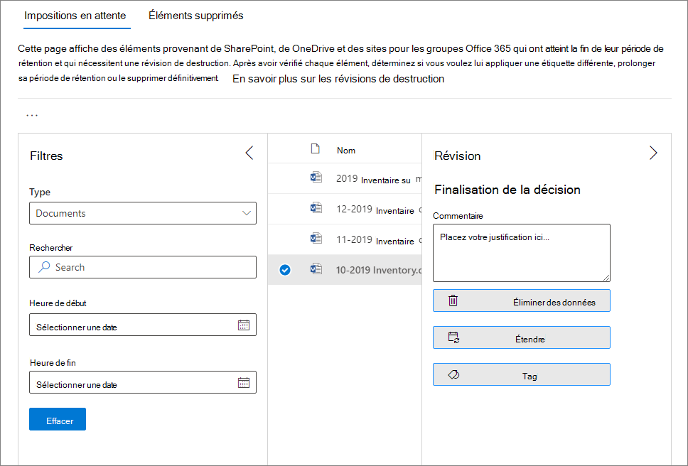
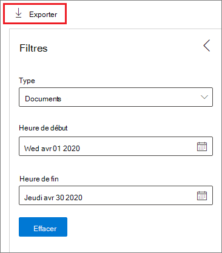

# Disposition de contenu

>*[Guide de sécurité et conformité pour les licences Microsoft 365](https://aka.ms/ComplianceSD).*

Utilisez l’onglet **disposition** de la **gestion des enregistrements** dans le centre de conformité Microsoft 365 pour gérer les révisions de disposition et afficher les [enregistrements](records.md) qui ont été supprimés automatiquement à la fin de leur période de rétention. 

## Conditions préalables à l’affichage des suppressions de contenu

Pour gérer les révisions de disposition et vérifier que les enregistrements ont été supprimés, vous devez disposer d’autorisations suffisantes et l’audit doit être activé.

### Autorisations pour la disposition

Pour accéder à l’onglet **disposition** dans le centre de conformité Microsoft 365, les utilisateurs doivent disposer du rôle gestion de la **disposition** et du rôle **journaux d’audit en affichage seul** . Bien que le Conseil standard consiste à ajouter des utilisateurs aux groupes de rôles par défaut, dans ce cas, nous vous recommandons de créer un nouveau groupe de rôles appelé **Relecteurs de disposition** qui a ces deux rôles et d’ajouter des utilisateurs à ce groupe en fonction de vos besoins. Un groupe de rôles unique pour la disposition réduit les frais généraux d’administration et permet aux utilisateurs d’obtenir plus facilement les autorisations combinées dont ils ont besoin.

> [!NOTE]
> Même un administrateur global doit disposer du rôle de **gestion** de la disposition. Par conséquent, si les administrateurs globaux ont besoin d’accéder à l’onglet disposition, ils sont en tant que membres du groupe de rôles **Relecteurs de disposition** . 

Spécifique au rôle **journaux d’audit en affichage seul** :

- Étant donné que la cmdlet sous-jacente utilisée pour effectuer des recherches dans le journal d’audit est une applet de commande Exchange Online, vous devez attribuer ce rôle à des utilisateurs à l’aide du [Centre d’administration Exchange dans Exchange Online](https://docs.microsoft.com/Exchange/exchange-admin-center), plutôt qu’en utilisant la page des **autorisations** dans le centre de sécurité & conformité. Pour obtenir des instructions, consultez la rubrique [gérer des groupes de rôles dans Exchange Online](https://docs.microsoft.com/Exchange/permissions-exo/role-groups).

- Les groupes Microsoft 365 ([anciennement groupes Office 365](https://techcommunity.microsoft.com/t5/microsoft-365-blog/office-365-groups-will-become-microsoft-365-groups/ba-p/1303601)) ne sont pas pris en charge pour ce rôle. Attribuez plutôt des boîtes aux lettres utilisateur, des utilisateurs de messagerie ou des groupes de sécurité à extension messagerie.

Pour obtenir des instructions permettant d’accorder aux utilisateurs le rôle de **gestion de disposition** et de créer votre rôle de **réviseur de disposition** , consultez la rubrique accorder aux utilisateurs l' [accès au &amp; Centre de sécurité conformité Office 365](../security/office-365-security/grant-access-to-the-security-and-compliance-center.md).

### Activer l’audit

Assurez-vous que l’audit est activé au moins un jour avant la première action de disposition. Pour plus d’informations, consultez la rubrique relative [à la recherche dans le journal d’audit dans le centre de sécurité &amp; conformité Office 365](search-the-audit-log-in-security-and-compliance.md). 

## Révisions avant destruction

Lorsque le contenu atteint la fin de sa période de rétention, il existe plusieurs raisons pour lesquelles vous pouvez souhaiter examiner ce contenu pour décider s’il peut être supprimé en toute sécurité (« supprimé »). Par exemple, vous devrez peut-être :
  
- Suspendre la suppression du contenu pertinent en cas de litige ou d’audit.
    
- Supprimer le contenu de la liste de disposition pour le stocker dans une archive, si ce contenu a une recherche ou une valeur historique.
    
- Affecter une période de rétention différente au contenu, peut-être parce que les paramètres de rétention d’origine étaient une solution temporaire ou provisoire.
    
- Renvoyer le contenu aux clients ou le transférer vers une autre organisation.

Lorsqu’une révision de disposition est déclenchée à la fin de la période de rétention :
  
- Les personnes que vous choisissez reçoivent une notification par courrier électronique dont le contenu doit être révisé. Ces relecteurs peuvent être des utilisateurs individuels, des groupes de distribution ou de sécurité, ou des groupes Microsoft 365 ([anciennement groupes Office 365](https://techcommunity.microsoft.com/t5/microsoft-365-blog/office-365-groups-will-become-microsoft-365-groups/ba-p/1303601)). Notez que les notifications sont envoyées chaque semaine.
    
- Les réviseurs accèdent à l’onglet **disposition** dans le centre de conformité Microsoft 365 pour examiner le contenu et décider s’il faut le supprimer définitivement, prolonger sa période de rétention ou appliquer une étiquette de rétention différente.

Une révision de disposition peut inclure du contenu dans des boîtes aux lettres Exchange, des sites SharePoint, des comptes OneDrive et des groupes Microsoft 365. Le contenu en attente d’une révision de disposition dans ces emplacements est supprimé uniquement lorsqu’un relecteur choisit de supprimer définitivement le contenu.

> [!NOTE]
> Une boîte aux lettres doit avoir au moins 10 Mo de données pour prendre en charge les révisions de la disposition.

Vous pouvez obtenir une vue d’ensemble de toutes les destructions en attente dans l’onglet **vue d’ensemble** . Par exemple :

Lorsque vous sélectionnez l’option **afficher toutes les mises en attente**, vous êtes redirigé vers la page de **disposition** . Par exemple :

### Flux de travail pour une révision de disposition

Le diagramme suivant illustre le flux de travail de base pour une révision de la disposition lorsqu’une étiquette de rétention est publiée, puis appliquée manuellement par un utilisateur. Par ailleurs, une étiquette de rétention configurée pour une révision de disposition peut être appliquée automatiquement au contenu.
  

  
Le déclenchement d’une révision de disposition à la fin de la période de rétention est une option de configuration qui n’est disponible qu’avec une étiquette de rétention. Cette option n’est pas disponible pour une stratégie de rétention. Pour plus d’informations sur ces deux solutions de rétention, voir [en savoir plus sur les stratégies de rétention et les étiquettes de conservation](retention.md).
  

 
> [!NOTE]
> Lorsque vous sélectionnez l’option **informer ces personnes lorsque des éléments sont prêts à être examinés**, spécifiez un groupe de sécurité utilisateur ou à extension messagerie. Les groupes Microsoft 365 ([anciennement groupes Office 365](https://techcommunity.microsoft.com/t5/microsoft-365-blog/office-365-groups-will-become-microsoft-365-groups/ba-p/1303601)) ne sont pas pris en charge pour cette option.

### Affichage et suppression de contenu

Lorsqu’un réviseur est averti par courrier électronique que le contenu est prêt à être révisé, il passe à l’onglet **disposition** de la **gestion des enregistrements** dans le centre de conformité Microsoft 365. Les relecteurs peuvent voir le nombre d’éléments pour chaque étiquette de rétention en attente de destruction, puis sélectionner une étiquette de rétention pour afficher l’ensemble du contenu portant cette étiquette.

Une fois que vous avez sélectionné une étiquette de rétention, vous voyez toutes les impositions en attente de cette étiquette à partir de l’onglet **destruction en attente** . Sélectionnez un ou plusieurs éléments où vous pouvez choisir une action et entrez un commentaire de justification :

Comme vous pouvez le voir à partir de l’image, les actions prises en charge sont les suivantes : 
  
- Supprimer définitivement l’élément
- Prolonger la période de rétention
- Appliquer une étiquette de rétention différente

En vous fournissant des autorisations sur l’emplacement et le contenu, vous pouvez utiliser le lien dans la colonne **emplacement** pour afficher les documents à leur emplacement d’origine. Lors d’une révision de destruction, le contenu ne se déplace jamais à partir de son emplacement d’origine et n’est jamais supprimé tant que le relecteur n’a pas choisi de le faire.

Les notifications par courrier électronique sont envoyées automatiquement aux relecteurs chaque semaine. Ce processus planifié signifie que lorsque le contenu atteint la fin de sa période de rétention, il peut falloir jusqu’à sept jours pour que les relecteurs reçoivent la notification par courrier électronique que le contenu attend.
  
Toutes les actions de disposition peuvent être auditées et le texte de justification entré par le réviseur est enregistré et affiché dans la colonne **Commentaire** de la page **éléments supprimés** .
  
### Durée jusqu’à la suppression définitive du contenu supprimé

Le contenu en attente d’une révision de disposition est supprimé uniquement lorsqu’un relecteur choisit de supprimer définitivement le contenu. Lorsque le réviseur choisit cette option, le contenu du site SharePoint ou du compte OneDrive est éligible pour le processus de nettoyage standard décrit dans la rubrique [fonctionnement des paramètres de rétention avec du contenu sur place](retention.md#how-retention-settings-work-with-content-in-place).

## Destruction des enregistrements

> [!NOTE]
> La possibilité d’afficher des enregistrements qui ont été supprimés automatiquement sans révision de disposition est toujours déployée sur les clients, de sorte que vous pouvez ne pas voir tous les éléments supprimés pendant cette période de déploiement.

Utilisez l’onglet **disposition** de la page **gestion des enregistrements** pour identifier les enregistrements supprimés automatiquement. Ces éléments affichent les **enregistrements supprimés** dans la colonne **type** . Par exemple :

Les éléments affichés sous l’onglet **éléments supprimés** pour les étiquettes d’enregistrement sont conservés pendant une période maximale de sept ans après la suppression de l’élément, avec une limite de 1 million éléments par enregistrement pour cette période. Si vous voyez le nombre **total** proche de cette limite de 1 million et que vous avez besoin de preuves d’imposition pour vos enregistrements, contactez le [support Microsoft](https://docs.microsoft.com/office365/admin/contact-support-for-business-products).

> [!NOTE]
> Cette fonctionnalité est basée sur les informations du [Journal d’audit unifié](search-the-audit-log-in-security-and-compliance.md) et nécessite donc un audit pour être [activé et](turn-audit-log-search-on-or-off.md) utilisable dans une requête afin que les événements correspondants soient capturés.
    
## Filtrer et exporter les vues

Lorsque vous sélectionnez une étiquette de rétention à partir de la page de **disposition** , l’onglet **destruction en attente** (le cas échéant) et l’onglet **éléments supprimés** vous permettent de filtrer les affichages pour faciliter la recherche des éléments. 

Pour les impositions en attente, la plage horaire est basée sur la date d’expiration. Pour les éléments supprimés, la plage horaire est basée sur la date de suppression.
  
Vous pouvez exporter des informations sur les éléments de l’affichage en tant que fichier. csv que vous pouvez ensuite trier et gérer à l’aide d’Excel :

  

