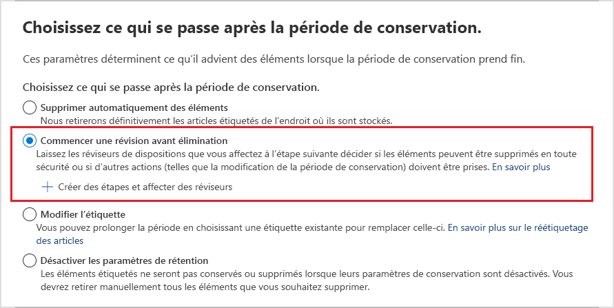
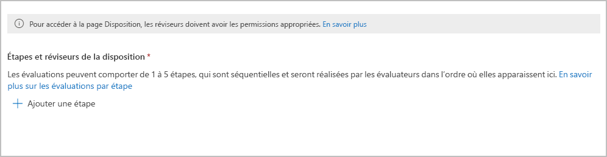
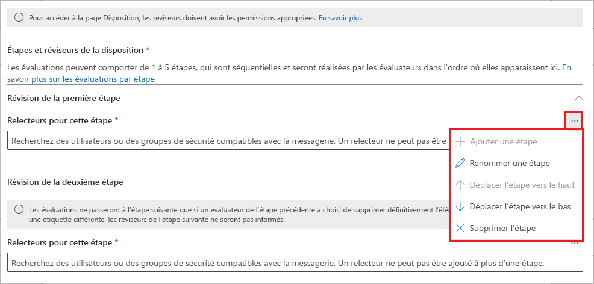
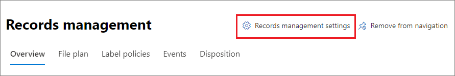

# <a name="disposition-of-content"></a>Destruction de contenu

>*[Guide de sécurité et conformité pour les licences Microsoft 365](/office365/servicedescriptions/microsoft-365-service-descriptions/microsoft-365-tenantlevel-services-licensing-guidance/microsoft-365-security-compliance-licensing-guidance).*

[!include[Purview banner](../includes/purview-rebrand-banner.md)]

Utilisez la page **Disposition** de la **gestion des documents du portail de conformité** Microsoft Purview pour gérer les examens de disposition et afficher les [métadonnées](records-management.md#records) des documents qui ont été automatiquement supprimés à la fin de leur période de conservation.

## <a name="prerequisites-for-viewing-content-dispositions"></a>Conditions préalables pour l’affichage des suppressions de contenu

Pour gérer les révisions de disposition et confirmer que les enregistrements ont été supprimés, vous devez disposer des autorisations suffisantes et l'audit doit être activé. Soyez également conscient des [limites](retention-limits.md#maximum-number-of-items-for-disposition) de disposition.

### <a name="permissions-for-disposition"></a>Autorisations pour la destruction

Pour accéder à l'onglet **Disposition** du portail de conformité Microsoft Purview, les utilisateurs doivent avoir le rôle **Gestion de la disposition**. A partir de décembre 2020, ce rôle est désormais inclus dans le groupe de rôle par défaut de **Gestion des enregistrements**.

> [!NOTE]
> Par défaut, un administrateur général ne se voit pas attribuer le rôle de **Gestion des destructions**. 

Pour accorder aux utilisateurs uniquement les autorisations dont ils ont besoin pour les révisions avant destruction sans leur permettre d'afficher et de configurer d'autres fonctionnalités pour la conservation et la gestion des documents, créez un groupe de rôles personnalisé (par exemple, appelé « Réviseurs avant destruction ») et attribuez à ce groupe le rôle de **Gestion des destructions**.

Pour obtenir des instructions pour ajouter des utilisateurs aux rôles par défaut ou créer vos propres groupes de rôles, consultez [Autorisations dans le Portail de conformité Microsoft Purview](microsoft-365-compliance-center-permissions.md).

En outre :

- Pour afficher le contenu des éléments pendant le processus de destruction, ajoutez des utilisateurs au groupe de rôle **Visionneuse de contenu de l’Explorateur de contenu**. Si les utilisateurs ne disposent pas des autorisations de ce groupe de rôles, ils peuvent tout de même sélectionner une action de réexamen de la disposition pour effectuer le réexamen de la disposition, mais ils doivent le faire sans pouvoir visualiser le contenu de l'élément dans le mini-volet de réexamen du portail de conformité Microsoft Purview.

- Par défaut, chaque personne qui accède à la page **Destruction** ne voit que les éléments qu'elle est chargée de réviser. Pour qu'un administrateur de gestion des enregistrements puisse voir tous les éléments attribués à tous les utilisateurs et toutes les étiquettes de rétention qui sont configurées pour la révision avant destruction : accédez à **Paramètres de gestion des enregistrements** > **Destruction** pour sélectionner, puis activer un groupe de sécurité à extension messagerie qui contient le comptes administrateur.
    
    Les groupes de sécurité et les groupes Microsoft 365 qui ne sont pas à extension messagerie ne prennent pas en charge cette fonctionnalité et ne sont pas affichés dans la liste à sélectionner. Si vous devez créer un nouveau groupe de sécurité compatible avec la messagerie, utilisez le lien vers le <a href="https://go.microsoft.com/fwlink/p/?linkid=2024339" target="_blank">Centre d'administration de Microsoft 365</a> pour créer le nouveau groupe. 
    
    > [!IMPORTANT]
    > Après avoir activé le groupe, vous ne pouvez plus le modifier dans le portail de conformité Microsoft Purview. Consultez la section suivante pour savoir comment activer un autre groupe à l’aide de PowerShell.

- L’**option paramètres de gestion des enregistrements** est visible uniquement pour les administrateurs de gestion des enregistrements. 

#### <a name="enabling-another-security-group-for-disposition"></a>Activation d’un autre groupe de sécurité pour sa disposition

Après avoir activé un groupe de sécurité pour la destruction à partir des **paramètres de gestion des enregistrements** dans le portail de conformité Microsoft Purview, vous ne pouvez pas désactiver cette autorisation pour le groupe ou remplacer le groupe sélectionné dans le portail de conformité Microsoft Purview. Toutefois, vous pouvez activer un autre groupe de sécurité activé pour le courrier en utilisant le cmdlet [Enable-ComplianceTagStorage](/powershell/module/exchange/enable-compliancetagstorage).

Par exemple : 

```PowerShell
Enable-ComplianceTagStorage -RecordsManagementSecurityGroupEmail dispositionreviewers@contosoi.com
````

### <a name="enable-auditing"></a>Activer l’audit

Assurez-vous que l’audit est activé au moins un jour avant la première action de destruction. Pour plus d'informations, voir [Recherche dans le journal d'audit dans le portail de conformité Microsoft Purview](search-the-audit-log-in-security-and-compliance.md). 

## <a name="disposition-reviews"></a>Révisions avant destruction

Lorsque le contenu atteint la fin de la période de rétention, vous souhaiterez peut-être réviser ce contenu et confirmer s’il peut être supprimé définitivement (« supprimé »). Par exemple, au lieu de supprimer le contenu, vous devrez peut-être :
  
- Suspendre la destruction de contenu pertinent pour un litige ou un audit.

- Affecter une période de rétention différente au contenu, peut-être parce que les paramètres de rétention d’origine étaient une solution temporaire ou provisoire.

- Déplacez le contenu de son emplacement existant vers un emplacement d’archivage, par exemple, si ce contenu a des valeurs d’historique ou de recherche.

Lorsqu'une révision de disposition est déclenchée à la fin de la période de conservation, les réviseurs que vous choisissez reçoivent une notification par e-mail indiquant qu'ils ont du contenu à réviser. Ces réviseurs peuvent être des utilisateurs individuels ou des groupes de sécurité à extension messagerie.

Vous pouvez personnaliser l’e-mail qu’ils reçoivent, notamment les instructions dans d’autres langues. Pour un support multilingue, vous devez vous-même spécifier les traductions et ce texte personnalisé s’affiche pour tous les réviseurs indépendamment de leurs paramètres régionaux.

Les utilisateurs reçoivent une première notification par courrier par étiquette à la fin de la période de rétention de l'élément, avec un rappel par étiquette une fois par semaine de toutes les révisions de destruction qui leur sont attribués. Ils peuvent cliquer sur le lien figurant dans les e-mails de notification et de rappel pour accéder directement à la page **Gestion des documents** > **– Disposition** dans le portail de conformité Microsoft Purview afin d'examiner le contenu et de prendre une décision. Les réviseurs peuvent également se rendre sur cette page de **disposition** dans le portail de conformité Microsoft Purview. Ensuite :

- Les réviseurs voient uniquement les révisions avant destruction qui leur sont affectées, tandis que les administrateurs qui sont ajoutés au Groupe de sécurité du gestionnaire des enregistrements voient toutes les révisions avant destruction.

- Les réviseurs peuvent ajouter de nouveaux utilisateurs dans la même révision avant destruction. Notez que cette action n’accorde pas automatiquement à ces utilisateurs ajoutés les [autorisations requises.](#permissions-for-disposition)

- Pour le processus de révision avant destruction, un volet de mini-évaluation pour chaque élément afficher un aperçu du contenu qu’ils sont autorisés à voir. S’ils ne disposent d’aucune autorisation, ils peuvent sélectionner le lien du contenu et demander des autorisations. Ce volet de mini-évaluation dispose également d’onglets pour les informations supplémentaires sur le contenu :
   - **Détails** pour afficher les propriétés indexées, leur emplacement, le créateur et la date de création, l’auteur et la date de la dernière modification.
   - **Historique** qui affiche l’historique à ce jour de toutes les actions de révision avant destruction avec les commentaires du réviseur, si disponible.

Une révision de destruction peut inclure du contenu dans les boîtes aux lettres Exchange, les sites SharePoint et les comptes OneDrive. Le contenu en attente de révision de destruction dans ces emplacements est définitivement supprimé uniquement lorsqu’un réviseur choisit de supprimer définitivement le contenu lors de l’étape finale de la destruction.

> [!NOTE]
> Une boîte aux lettres doit avoir au moins 10 Mo de données pour prendre en charge les révisions de suppression.

Les administrateurs peuvent voir un aperçu de toutes les dispositions en attente dans l'onglet **Aperçu**. Les réviseurs ne voient que leurs éléments en attente de disposition. Par exemple :


Lorsque vous sélectionnez l’option **Afficher toutes les dispositions en attente**, vous êtes redirigé vers la page **Disposition**. Par exemple :


### <a name="workflow-for-a-disposition-review"></a>Flux de travail pour une révision de destruction

Le diagramme suivant illustre le flux de travail de base pour une révision de disposition (en une seule étape) lorsqu’une étiquette de rétention est publiée, puis appliquée manuellement par un utilisateur. Une étiquette de rétention configurée pour une révision de destruction peut également être appliquée automatiquement au contenu.
  


### <a name="how-to-configure-a-retention-label-for-disposition-review"></a>Comment configurer une étiquette de rétention pour la révision avant destruction

Le déclenchement d’une révision avant destruction à la fin de la période de rétention est une option de configuration disponible uniquement avec une étiquette de rétention. La révision avant destruction n’est pas disponible pour une stratégie de rétention. Pour plus d’informations sur ces deux solutions de rétention, consultez [En savoir plus sur les stratégies de rétention et les étiquettes de rétention](retention.md).

Ensuite, sur la page **Choisir ce qui se passe après la période de rétention** pour une étiquette de rétention :


 
Après avoir sélectionné l'option **Démarrer une révision avant destruction**, sélectionnez **+ Créer des étapes et assigner des réviseurs**. Sur la page suivante de la configuration, vous indiquerez le nombre d'étapes consécutives de destruction que vous souhaitez suivre et les réviseurs de destruction pour chaque étape :

 

Sélectionnez **+ Ajouter une étape**, puis nommez-la à des fins d’identification. Spécifiez ensuite les réviseurs pour cette étape.

Pour les réviseurs, spécifiez jusqu’à 10 utilisateurs individuels ou groupes de sécurité avec fonction de courrier. Les groupes Microsoft 365 ([anciennement groupes Office 365](https://techcommunity.microsoft.com/t5/microsoft-365-blog/office-365-groups-will-become-microsoft-365-groups/ba-p/1303601)) ne sont pas pris en charge pour cette option.

Si plusieurs personnes doivent examiner un élément à la fin de sa période de rétention, sélectionnez **Ajouter une autre étape** et répétez le processus de configuration pour le nombre d'étapes dont vous avez besoin, avec un maximum de cinq étapes. 

Dans chaque étape individuelle de destruction, tout utilisateur spécifié pour cette étape est autorisé à mettre en œuvre la prochaine action pour l’élément à la fin de sa période de rétention. Cet utilisateur peut également ajouter d’autres utilisateurs à leur étape de révision avant destruction.

> [!NOTE]
> Si vous avez configuré les étiquettes de rétention avant que la révision de destruction en plusieurs étapes ne soit disponible, vous pouvez mettre à niveau vos étiquettes pour qu'elles prennent en charge cette fonctionnalité : Modifiez l'étiquette et sélectionnez **Modifier les étapes et les réviseurs** sur la page **Choisissez ce qui se passe après la période de rétention**.

Pendant la phase de configuration, pour chaque étape spécifiée, vous pouvez la renommer, la réorganiser ou la supprimer en sélectionnant **Modifier les étapes et les réviseurs** qui s’affichent désormais pour l’option **Démarrer une révision avant destruction** . Ensuite, pour chaque étape, vous pouvez sélectionner l’option Actions de phase (**...**) : 



Cependant, vous ne pouvez pas réarranger ou supprimer une étape après la création d’une étiquette de rétention. Seules les options **Ajouter une étape** et **Renommer une étape** sont disponibles. Vous pouvez toujours modifier les réviseurs.

Après avoir spécifié vos réviseurs, n’oubliez pas de leur accorder l’autorisation du rôle de **Gestion de destruction**. Pour plus d’informations, voir la section [Autorisations de destruction](#permissions-for-disposition) sur cette page.

### <a name="how-to-customize-email-messages-for-disposition-review"></a>Comment personnaliser des messages électroniques pour la révision avant destruction

Exemple de notification par défaut envoyée par e-mail au réviseur :


Vous pouvez personnaliser les messages électroniques envoyés aux relecteurs de disposition pour la notification initiale, puis les rappels.

À partir de l'une des pages de gestion des enregistrements du portail de conformité Microsoft Purview, sélectionnez **Paramètres de gestion des enregistrements**:  



Sous l’onglet **Disposition**, dans la section **Notifications par e-mail pour les révisions de destruction**, sélectionnez et spécifiez si vous souhaitez utiliser uniquement le message électronique par défaut ou ajouter votre propre texte au message par défaut. Votre texte personnalisé est ajouté aux instructions de l’e-mail après les informations sur l’étiquette de rétention et avant les instructions des étapes suivantes.

Un texte dans toutes les langues peut être ajouté, cependant, la mise en forme et les images ne sont actuellement pas prises en charge. Les adresses e-mail et les URL peuvent être saisies en tant que texte et, en fonction du client d’e-mail, affichées en tant que lien hypertexte ou de texte non mis en forme dans l’e-mail personnalisé.

Texte d’exemple à ajouter :

```console
If you need additional information, visit the helpdesk website (https://support.contoso.com) or send them an email (helpdesk@contoso.com).
```

Sélectionnez **Enregistrer** pour enregistrer toute modification.

### <a name="viewing-and-disposing-of-content"></a>Affichage et destruction de contenu

Lorsqu'un réviseur est informé par e-mail que le contenu est prêt à être examiné, il peut cliquer sur un lien dans l'e-mail qui l'amène directement à la page **Disposition** de la **gestion des documents** dans le portail de conformité Microsoft Purview. Les réviseurs peuvent voir le nombre d’éléments en attente de destruction pour chaque étiquette de rétention à l’aide de **Type** qui afficher la **Destructions en attente**. Ils peuvent ensuite sélectionner une étiquette de rétention, puis **Ouvrir dans une nouvelle fenêtre** pour voir tout le contenu de cette étiquette :


Sur la page **Dispositions en attente**, ils voient toutes les dispositions en attente pour cette étiquette. Lorsqu'un ou plusieurs éléments sont sélectionnés, ils peuvent utiliser le volet de mini-aperçu et les onglets **Source**, **Détails**, et **Historique** pour inspecter le contenu avant de prendre des mesures :


Si vous utilisez la barre de défilement horizontal ou si vous fermez le volet de mini-évaluation, vous voyez d’autres colonnes incluant la date d’expiration et le nom de l’étape de révision avant destruction.

Comme vous pouvez le voir dans l’exemple affiché, les actions prises en charge sont les suivantes : 
  
- **Approuver la destruction** :
    - Lorsque cette action est sélectionnée pour une étape intermédiaire de la révision avant destruction (vous avez configuré plusieurs étapes) : l’élément se déplace vers la prochaine étape de la destruction.
    - Lorsque cette action est sélectionnée pour l’étape finale de la révision avant destruction ou qu’il n’existe qu’une seule étape de destruction : l’élément est marqué comme éligible pour une suppression définitive, qu’un travail de minuteur actionne ensuite dans les 7 jours. Le minutage exact de la suppression définitive de l’élément dépend de la charge de travail. Pour plus d’informations, voir [Fonctionnement de la rétention pour SharePoint et OneDrive](retention-policies-sharepoint.md#how-retention-works-for-sharepoint-and-onedrive) et [Fonctionnement de la rétention pour Exchange](retention-policies-exchange.md#how-retention-works-for-exchange).

- **Attribuer un nouveau libellé** :
    - Lorsque cette action est sélectionnée, l’élément quitte le procession de révision avant destruction pour l’étiquette d’origine. L’élément est ensuite soumis aux paramètres de rétention de la nouvelle étiquette de rétention sélectionnée.

- **Étendre** :
    - Lorsque cette action est sélectionnée, la révision avant destruction est suspendue de manière effective jusqu’à la fin de la période étendue, puis la révision avant destruction est déclenchée à nouveau à partir de la première étape.

- **Ajouter des réviseurs** :
    - Lorsque cette action est sélectionnée, l’utilisateur est invité à spécifier et ajouter d’autres utilisateurs pour la révision.
    > [!NOTE]
    > Cette action n’accorde pas automatiquement les [autorisations requises](#permissions-for-disposition) aux utilisateurs ajoutés. S'ils n'ont pas ces autorisations, ils ne peuvent pas participer à l'examen des dispositions.

À chaque action entreprise correspond un événement d'audit dans le groupe d'activités d'audit [Activités de révision de disposition](search-the-audit-log-in-security-and-compliance.md#disposition-review-activities).

Lors d’une révision avant destruction, le contenu ne quitte jamais son emplacement d’origine et il n’est pas marqué pour une suppression définitive tant que cette action n’est pas sélectionnée par un réviseur pour l’étape finale ou la seule étape avant destruction.

## <a name="disposition-of-records"></a>Destruction des enregistrements

À partir de la page principale **Gestion des enregistrements** > l’onglet **Disposition**, vous pouvez identifier les éléments suivants :

- Éléments supprimés suite à une révision avant destruction.
- Les éléments marqués comme enregistrement ou enregistrement réglementaire qui ont été automatiquement supprimés à la fin de leur période de rétention.

Ces éléments affichent **Records Disposed** dans la colonne **Type**. Par exemple :


> [!NOTE]
> Cette fonctionnalité est basée sur les informations du [Journal d’audit unifié](search-the-audit-log-in-security-and-compliance.md) et nécessite par conséquent que l’audit soit [Activé et accessible à la recherche](turn-audit-log-search-on-or-off.md) pour la capture des événements correspondants.

Pour l'audit des éléments supprimés qui ont été marqués comme enregistrements ou enregistrements réglementaires, recherchez **Fichier supprimé marqué comme enregistrement** dans la catégorie **Activités de fichier et de page**. Cet événement d'audit s'applique aux documents et aux e-mails.

## <a name="filter-and-export-the-views"></a>Filtrer et exporter les affichages

Lorsque vous sélectionnez une étiquette de rétention dans la page **Destruction** , l’onglet **Destruction en attente** (le cas échéant) et **Éléments supprimés** vous permettent de filtrer les affichages pour trouver des éléments plus facilement.

Pour les destructions en attente, la plage horaire est basée sur la date d’expiration. Pour les éléments supprimés, la plage horaire est basée sur la date de suppression.
  
Vous pouvez exporter les informations relatives aux éléments de l’une ou l’autre vue en tant que fichier .csv que vous pouvez ensuite trier et gérer à l’aide d’Excel.
