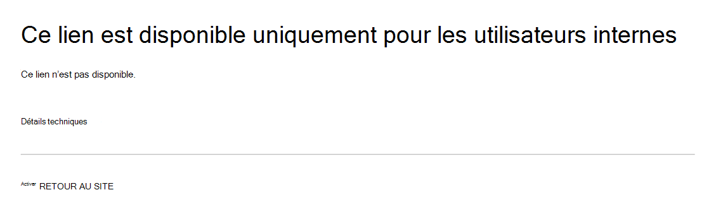

# Prévention des pertes de données et Microsoft Teams

Si votre organisation dispose d’une protection contre la perte de données (DLP), vous pouvez définir des stratégies qui empêchent les utilisateurs de partager des informations sensibles dans un canal Microsoft Teams ou une session de conversation. Voici quelques exemples de fonctionnement de cette protection :

- **Exemple 1 : protection des informations sensibles dans les messages**. Supposons qu’une personne tente de partager des informations sensibles dans une conversation Teams ou un canal avec des invités (utilisateurs externes). Si vous avez défini une stratégie DLP pour éviter cela, les messages avec des informations sensibles envoyés à des utilisateurs externes sont supprimés. Cela se produit automatiquement et en quelques secondes, en fonction de la configuration de votre stratégie DLP.

    > [!NOTE]
    > La DLP pour Microsoft Teams bloque le contenu sensible lorsqu’il est partagé avec Microsoft Teams utilisateurs qui ont : - [accès invité dans](/MicrosoftTeams/guest-access) les équipes et les canaux ; ou - [accès externe](/MicrosoftTeams/manage-external-access) dans les réunions et les sessions de conversation. 
La DLP pour les sessions de conversation externe ne fonctionne que si l’expéditeur et le destinataire sont en mode Teams uniquement et utilisent la fédération Microsoft Teams [native.](/microsoftteams/manage-external-access) La prévention contre la Teams ne bloque pas les messages en cas [d’Skype Entreprise](/microsoftteams/teams-and-skypeforbusiness-coexistence-and-interoperability#interoperability-of-teams-and-skype-for-business) sessions de conversation fédérée non natives ou non natives.

- **Exemple 2 : protection des informations sensibles dans les documents**. Supposons qu’une personne tente de partager un document avec des invités dans un canal Microsoft Teams ou une conversation, et que le document contient des informations sensibles. Si vous avez défini une stratégie DLP pour éviter cela, le document ne s’ouvre pas pour ces utilisateurs. Votre stratégie DLP doit inclure SharePoint et OneDrive pour que la protection soit en place. Il s’agit d’un exemple de DLP pour les SharePoint qui s’affiche dans Microsoft Teams et qui nécessite donc que les utilisateurs soient titulaires d’une licence pour Office 365 DLP (inclus dans Office 365 E3), mais ne nécessite pas que les utilisateurs soient titulaires d’une licence pour Conformité avancée Office 365.)

## Gestion des licences DLP pour Microsoft Teams

[Les fonctionnalités de protection](dlp-learn-about-dlp.md) contre la perte de données ont été étendues pour inclure Microsoft Teams messages de conversation et de canal, y compris les **messages de canal privé** pour :

- Office 365 E5/A5
- Microsoft 365 E5/A5
- Protection des informations et gouvernance Microsoft 365
- Conformité avancée Office 365

Office 365 et Microsoft 365 E3 incluent la protection DLP pour SharePoint Online, OneDrive et Exchange Online. Cela inclut également les fichiers partagés via Teams, car Teams utilise SharePoint Online et OneDrive pour partager des fichiers.

La prise en charge de la protection DLP dans Teams chat nécessite E5.

Pour en savoir plus sur les conditions d’octroi de licences, consultez [Conseils sur la gestion des licences des services de niveau client de Microsoft 365](/office365/servicedescriptions/microsoft-365-service-descriptions/microsoft-365-tenantlevel-services-licensing-guidance/microsoft-365-security-compliance-licensing-guidance).

> [!IMPORTANT]
> DLP s’applique uniquement aux messages réels dans le thread de conversation ou de canal. Les notifications d’activité, qui incluent un aperçu de message court et  s’affichent en fonction des paramètres de notification d’un utilisateur, ne sont pas incluses dans Teams DLP. Toutes les informations sensibles présentes dans la partie du message qui s’affiche dans l’aperçu resteront visibles dans la notification même après l’application de la stratégie DLP et la suppression des informations sensibles du message lui-même.

## Étendue de la protection DLP

La protection DLP est appliquée différemment Teams entités.

|Comptes d’utilisateur/groupes/liste  |Teams Entité |Protection DLP disponible|
|---------|---------|---------|
|comptes d’utilisateur individuels     |Conversations 1:1/n         |oui         |
|     |conversations générales         |non         |
|     |canaux privés         |oui         |
|groupes de sécurité/listes de distribution  | Conversations 1:1/n         |oui         |
|     |conversations générales         |non         |
|     |canaux privés         |oui        |
|Microsoft 365 groupe    |Conversations 1:1/n          |non         |
|     |conversations générales          |oui        |
|     |canaux privés|non| 

## Les conseils de stratégie aident à former les utilisateurs

De la même manière que dans [Exchange, Outlook, Outlook](data-loss-prevention-policies.md#policy-evaluation-in-exchange-online-outlook-and-outlook-on-the-web)sur le web, [SharePoint Online, les sites OneDrive Entreprise](data-loss-prevention-policies.md#policy-evaluation-in-onedrive-for-business-and-sharepoint-online-sites)et les clients de bureau [Office,](data-loss-prevention-policies.md#policy-evaluation-in-the-office-desktop-programs)des conseils de stratégie s’affichent lorsqu’une action se déclenche avec une stratégie DLP. Voici un exemple de conseil de stratégie :

Ici, l’expéditeur a tenté de partager un numéro de sécurité sociale dans un canal Microsoft Teams réseau. Le **lien Que puis-je faire ?** ouvre une boîte de dialogue qui fournit des options à l’expéditeur pour résoudre le problème. Notez que l’expéditeur peut choisir de remplacer la stratégie ou d’avertir un administrateur de la réviser et de la résoudre.

Dans votre organisation, vous pouvez choisir d’autoriser les utilisateurs à remplacer une stratégie DLP. Lorsque vous configurez vos stratégies DLP, vous pouvez utiliser les conseils de stratégie par défaut ou personnaliser les conseils [de](#to-customize-policy-tips) stratégie pour votre organisation.

Pour revenir à notre exemple, où un expéditeur a partagé un numéro de sécurité sociale dans un canal Teams, voici ce que le destinataire a vu :

> [!div class="mx-imgBorder"]
> 

### Pour personnaliser les conseils de stratégie

Pour effectuer cette tâche, vous devez avoir un rôle qui dispose des autorisations pour modifier les stratégies DLP. Pour en savoir plus, voir [Autorisations](data-loss-prevention-policies.md#permissions).

1. Go to the Compliance Center ( [https://compliance.microsoft.com](https://compliance.microsoft.com) ) and sign in.

2. Cliquez sur **Protection contre la perte de données** > **(Stratégie)**.

3. Select a policy, and next to **Policy settings**, choose **Edit**.

4. Créez une règle ou modifiez une règle existante pour la stratégie.

    > [!div class="mx-imgBorder"]
    > 

5. Sous **l’onglet Notifications de** l’utilisateur, sélectionnez Personnaliser le texte de l’e-mail et/ou personnaliser les options de texte du **conseil de** stratégie. 

    > [!div class="mx-imgBorder"]
    >    

6. Spécifiez le texte que vous souhaitez utiliser pour les notifications par courrier électronique et/ou les conseils de stratégie, puis sélectionnez **Enregistrer**.

7. Sous **l’onglet Paramètres de stratégie,** sélectionnez **Enregistrer.**

Laissez environ une heure pour que vos modifications fonctionnent dans votre centre de données et se synchronisent avec les comptes d’utilisateurs.
 <!-- why are these syncing to user accounts? -->

## Ajouter Microsoft Teams comme emplacement aux stratégies DLP existantes

Pour effectuer cette tâche, vous devez avoir un rôle qui dispose des autorisations pour modifier les stratégies DLP. Pour en savoir plus, voir [Autorisations](data-loss-prevention-policies.md#permissions).

1. Go to the Compliance Center ( [https://compliance.microsoft.com](https://compliance.microsoft.com) ) and sign in.

2. Cliquez sur **Protection contre la perte de données** > **(Stratégie)**.

3. Sélectionnez une stratégie et regardez les valeurs sous **Emplacements.** Si vous voyez Teams **messages de conversation et de** canal, vous êtes tous ensemble. Si ce n’est pas le cas, cliquez sur **Modifier.**

    > [!div class="mx-imgBorder"]
    > 

4. Dans la **colonne État,** activer la stratégie pour les messages **Teams de conversation et de canal.**

    > [!div class="mx-imgBorder"]
    > 

5. Sous **l’onglet** Choisir des emplacements, conservez le paramètre par défaut de tous les comptes, ou sélectionnez **Choisir des emplacements spécifiques.** Vous pouvez spécifier :

    1. jusqu’à 1 000 comptes individuels à inclure ou à exclure
    1. listes de distribution et groupes de sécurité à inclure ou à exclure; 
    <!-- 1. the shared mailbox of a shared channel. **This is a public preview feature.**--> 
    
6. Sélectionnez **Suivant**.

7. Cliquez sur **Enregistrer**.

Laissez environ une heure pour que vos modifications fonctionnent dans votre centre de données et se synchronisent avec les comptes d’utilisateurs.
<!-- again, why user accounts? -->

## Définir une nouvelle stratégie DLP pour Microsoft Teams

Pour effectuer cette tâche, vous devez avoir un rôle qui dispose des autorisations pour modifier les stratégies DLP. Pour en savoir plus, voir [Autorisations](data-loss-prevention-policies.md#permissions).

1. Go to the Compliance Center ( [https://compliance.microsoft.com](https://compliance.microsoft.com) ) and sign in.

2. Cliquez sur **Protection contre la perte de données** > **(Stratégie)** > **+ Créer une stratégie**.

3. Choisissez un [modèle,](data-loss-prevention-policies.md#dlp-policy-templates)puis choisissez **Suivant.**

    Dans notre exemple, nous avons choisi le modèle de données d’informations d’identification personnelle des États-Unis.

    > [!div class="mx-imgBorder"]
    >  

4. Sous **l’onglet Nom de votre stratégie,** spécifiez un nom et une description pour la stratégie, puis choisissez **Suivant**.

5. Sous **l’onglet** Choisir des emplacements, conservez le paramètre par défaut de tous les comptes, ou sélectionnez **Choisir des emplacements spécifiques.** Vous pouvez spécifier :

    1. jusqu’à 1 000 comptes individuels à inclure ou à exclure
    1. listes de distribution et groupes de sécurité à inclure ou à exclure; **Il s’agit d’une fonctionnalité de prévisualisation publique.**
    <!-- 1. the shared mailbox of a shared channel. **This is a public preview feature.**-->  

    

    > [!NOTE]
    > Si vous souhaitez vous assurer que les documents qui contiennent des informations sensibles ne sont pas partagés de manière inappropriée dans Teams, assurez-vous que les **sites SharePoint** et les comptes OneDrive sont **allumés,** ainsi que les messages de conversation et de canal **Teams.**

6. Sous **l’onglet Paramètres** de stratégie, sous Personnaliser le **type** de contenu à protéger, conservez les paramètres simples par défaut, ou choisissez Utiliser les **paramètres** avancés, puis choisissez **Suivant**. Si vous choisissez des paramètres avancés, vous pouvez créer ou modifier des règles pour votre stratégie. Pour obtenir de l’aide, voir [Paramètres simples et paramètres avancés.](data-loss-prevention-policies.md#simple-settings-vs-advanced-settings)

7.  Sous **l’onglet Paramètres de stratégie,** sous Que voulez-vous faire si nous détectons des informations sensibles **?**, examinez les paramètres. C’est ici que vous pouvez choisir de conserver les conseils de stratégie par défaut et les [notifications par courrier électronique,](use-notifications-and-policy-tips.md)ou de les personnaliser.

    > [!div class="mx-imgBorder"]
    > 

    Lorsque vous avez terminé de passer en revue ou de modifier les paramètres, choisissez **Suivant**.

8. Sous l’onglet **Paramètres** de stratégie, sous Voulez-vous activer la stratégie ou d’abord tester les éléments **?**, choisissez d’activer la [stratégie,](dlp-overview-plan-for-dlp.md#policy-deployment)de la tester en premier ou de la maintenir désactivée pour l’instant, puis choisissez **Suivant.**

    > [!div class="mx-imgBorder"]
    > 

9. Sous **l’onglet Examiner vos paramètres,** examinez les paramètres de votre nouvelle stratégie. Sélectionnez **Modifier** pour apporter des modifications. Lorsque vous avez terminé, choisissez **Créer.**

Laissez environ une heure à votre nouvelle stratégie pour passer par votre centre de données et se synchroniser avec les comptes d’utilisateurs.

## Empêcher l'accès externe aux documents sensibles

Pour vous assurer que SharePoint documents contenant des informations sensibles ne peuvent pas être accessibles par des invités externes à partir de SharePoint ou Teams par défaut, sélectionnez les éléments suivants :

- Vous pouvez vous assurer que les documents sont protégés jusqu’à ce que DLP analyse et les marque comme étant sûrs à partager en marquant les nouveaux fichiers comme sensibles [par défaut.](/sharepoint/sensitive-by-default)

- Structure de stratégie DLP recommandée

    - **Conditions**
        - Le contenu contient l’un de ces types d’informations sensibles : [Sélectionner tout ce qui s’applique]
        
        - Le contenu est partagé à partir Microsoft 365 avec des personnes extérieures à mon organisation
        
          > [!div class="mx-imgBorder"]
          > 

    - **Actions**
        - Restreindre l’accès au contenu pour utilisateurs externe
        
        - Informer les utilisateurs à l’aide de courriers électroniques et de conseils de stratégie
        
        - Envoyer des rapports d’incident à l’administrateur
        
        > [!div class="mx-imgBorder"]
        > 

Stratégie DLP en action lors de la tentative de partage d’un document dans SharePoint contenant des informations sensibles avec un invité externe :

> [!div class="mx-imgBorder"]
> 

Stratégie DLP en action lorsque l’invité tente d’ouvrir un document Teams avec un bloc externe :

> [!div class="mx-imgBorder"]
> 

## Articles connexes

- [Création, test et réglage d’une stratégie DLP](create-test-tune-dlp-policy.md)
- [Envoi des notifications et affichage des conseils de stratégie pour les stratégies DLP](use-notifications-and-policy-tips.md)
