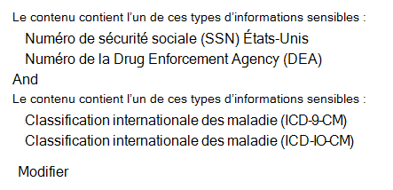
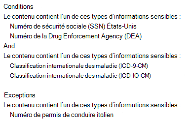
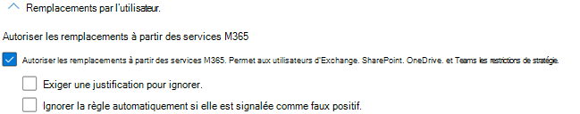
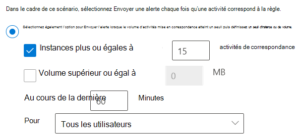

# Référence de stratégie de protection contre la perte de données

Les stratégies de protection contre la perte de données (DLP) ont de nombreux composants qui peuvent être configurés. Pour créer une stratégie efficace, vous devez comprendre l’objectif de chaque composant et la façon dont sa configuration modifie le comportement de la stratégie. Cet article fournit une anatomie détaillée d’une stratégie DLP.

## Modèles de stratégie 

Les modèles de stratégie DLP sont pré-triés en quatre catégories :

- ceux qui peuvent détecter et protéger les types **d’informations** financières
- ceux qui peuvent détecter et protéger les types d’informations médicales **et médicales**
- ceux qui peuvent détecter et protéger les types d’informations **de** confidentialité
- modèle **personnalisé** que vous pouvez utiliser pour créer votre propre stratégie si l’un des autres ne répond pas aux besoins de votre organisation.

Ce tableau répertorie tous les modèles de stratégie et les types d’informations sensibles qu’ils couvrent. 

Actuel depuis le 23/06/2021

|Catégorie| Modèle | SIT |
|---------|---------|---------|
|Financier| Données financières en Australie| - [Code SWIFT](sensitive-information-type-entity-definitions.md#swift-code)   - [Numéro de fichier fiscal australie](sensitive-information-type-entity-definitions.md#australia-tax-file-number)   - [Numéro de compte bancaire australie](sensitive-information-type-entity-definitions.md#australia-bank-account-number)   - [Numéro de carte de crédit](sensitive-information-type-entity-definitions.md#credit-card-number)|
|Financier| Données financières pour le Canada |- [Numéro de carte de crédit](sensitive-information-type-entity-definitions.md#credit-card-number)   -  [Numéro de compte bancaire canada](sensitive-information-type-entity-definitions.md#canada-bank-account-number)|
|Financier| Données financières pour la France |- [Numéro de carte de crédit](sensitive-information-type-entity-definitions.md#credit-card-number)   - [Numéro de carte de crédit de l’UE](sensitive-information-type-entity-definitions.md#eu-debit-card-number)|
|Financier| Données financières en Allemagne |- [Numéro de carte de crédit](sensitive-information-type-entity-definitions.md#credit-card-number)   - [Numéro de carte de crédit de l’UE](sensitive-information-type-entity-definitions.md#eu-debit-card-number)|
|Financier| Données financières en Israël |- [Numéro de compte bancaire Israël](sensitive-information-type-entity-definitions.md#israel-bank-account-number)   - [Code SWIFT](sensitive-information-type-entity-definitions.md#swift-code)   - [Numéro de carte de crédit](sensitive-information-type-entity-definitions.md#credit-card-number)|
|Financier| Données financières au Japon |- [Numéro de compte bancaire Japon](sensitive-information-type-entity-definitions.md#japan-bank-account-number)   - [Numéro de carte de crédit](sensitive-information-type-entity-definitions.md#credit-card-number)|
|Financier| PCI Data Security Standard (PCI DSS)|- [Numéro de carte de crédit](sensitive-information-type-entity-definitions.md#credit-card-number)|
|Financier| Loi anti-cybercriminalité en Arabie Saoudite|- [Code SWIFT](sensitive-information-type-entity-definitions.md#swift-code)   - [Numéro de compte bancaire international (IBAN)](sensitive-information-type-entity-definitions.md#international-banking-account-number-iban) |
|Financier| Données financières en Arabie Saoudite |- [Numéro de carte de crédit](sensitive-information-type-entity-definitions.md#credit-card-number)   - [Code SWIFT](sensitive-information-type-entity-definitions.md#swift-code)   - [Numéro de compte bancaire international (IBAN)](sensitive-information-type-entity-definitions.md#international-banking-account-number-iban)|
|Financier| Données financières pour le Royaume-Uni|- [Numéro de carte de crédit](sensitive-information-type-entity-definitions.md#credit-card-number)   - [Numéro de carte de crédit de l’UE](sensitive-information-type-entity-definitions.md#eu-debit-card-number)   - [Code SWIFT](sensitive-information-type-entity-definitions.md#swift-code)|
|Financier| Données financières américaines|- [Numéro de carte de crédit](sensitive-information-type-entity-definitions.md#credit-card-number)   - [Numéro de compte bancaire américain](sensitive-information-type-entity-definitions.md#us-bank-account-number)  - [Numéro de routage ABA](sensitive-information-type-entity-definitions.md#aba-routing-number)|
|Financier| U.S. Federal Trade Commission (FTC) Consumer Rules|- [Numéro de carte de crédit](sensitive-information-type-entity-definitions.md#credit-card-number)   - [Numéro de compte bancaire américain](sensitive-information-type-entity-definitions.md#us-bank-account-number)  - [Numéro de routage ABA](sensitive-information-type-entity-definitions.md#aba-routing-number)|
|Financier| U.S. Gramm-Leach-Bliley Act (GLBA) Enhanced|- [Numéro de carte de crédit](sensitive-information-type-entity-definitions.md#credit-card-number)   - [Numéro de compte bancaire américain](sensitive-information-type-entity-definitions.md#us-bank-account-number)  - [Numéro d’identification du contribuable individuel (ITIN) des États-Unis](sensitive-information-type-entity-definitions.md#us-individual-taxpayer-identification-number-itin)    - [Numéro de sécurité sociale (SSN) des États-Unis](sensitive-information-type-entity-definitions.md#us-social-security-number-ssn)  - [Numéro de passeport des États-Unis/du Royaume-Uni](sensitive-information-type-entity-definitions.md#us--uk-passport-number)   -[Numéro de permis de conduire américain](sensitive-information-type-entity-definitions.md#us-drivers-license-number)|
|Financier| U.S. Gramm-Leach-Bliley Act (GLBA)|- [Numéro de carte de crédit](sensitive-information-type-entity-definitions.md#credit-card-number)   - [Numéro de compte bancaire américain](sensitive-information-type-entity-definitions.md#us-bank-account-number)  - [Numéro d’identification du contribuable individuel (ITIN) des États-Unis](sensitive-information-type-entity-definitions.md#us-individual-taxpayer-identification-number-itin)    - [Numéro de sécurité sociale (SSN) des États-Unis](sensitive-information-type-entity-definitions.md#us-social-security-number-ssn)|
|Santé et médical| Australia Health Records Act (HRIP Act) Enhanced |- [Numéro de fichier fiscal australie](sensitive-information-type-entity-definitions.md#australia-tax-file-number)   - [Numéro de compte médical australie](sensitive-information-type-entity-definitions.md#australia-medical-account-number)|
|Santé et médical| Australia Health Records Act (HRIP Act)|- [Numéro de fichier fiscal australie](sensitive-information-type-entity-definitions.md#australia-tax-file-number)   - [Numéro de compte médical australie](sensitive-information-type-entity-definitions.md#australia-medical-account-number)|
|Santé et médical| Canada Health Information Act (HIA) |- [Numéro de passeport canada](sensitive-information-type-entity-definitions.md#canada-passport-number)  - [Numéro d’assurance sociale canada](sensitive-information-type-entity-definitions.md#canada-social-insurance-number)   - [Numéro de service de santé canada](sensitive-information-type-entity-definitions.md#canada-health-service-number)   - [Numéro d’identification personnelle de santé canada](sensitive-information-type-entity-definitions.md#canada-personal-health-identification-number-phin)|
|Santé et médical| Canada Personal Health Information Act (PHIA)Pér.|- [Numéro d’assurance sociale canada](sensitive-information-type-entity-definitions.md#canada-social-insurance-number)   - [Numéro de service de santé canada](sensitive-information-type-entity-definitions.md#canada-health-service-number)   - [Numéro d’identification personnelle de santé canada](sensitive-information-type-entity-definitions.md#canada-personal-health-identification-number-phin)|
|Santé et médical| Canada Personal Health Act (PHIPA)Pér. |- [Numéro de passeport canada](sensitive-information-type-entity-definitions.md#canada-passport-number)  - [Numéro d’assurance sociale canada](sensitive-information-type-entity-definitions.md#canada-social-insurance-number)   - [Numéro de service de santé canada](sensitive-information-type-entity-definitions.md#canada-health-service-number)   - [Numéro d’identification personnelle de santé canada](sensitive-information-type-entity-definitions.md#canada-personal-health-identification-number-phin)|
|Santé et médical| U.K. Access to Medical Reports Act|- [Numéro de service de santé national du Royaume-Uni](sensitive-information-type-entity-definitions.md#uk-national-health-service-number)   - [Numéro d’assurance national (NINO) du Royaume-Uni](sensitive-information-type-entity-definitions.md#uk-national-insurance-number-nino)|
|Santé et médical| U.S. Health Insurance Act (HIPAA) Enhanced|  - [Classification internationale des maladie (ICD-9-CM)](sensitive-information-type-entity-definitions.md#international-classification-of-diseases-icd-9-cm)   - [Classification internationale des maladie (ICD-10-CM)](sensitive-information-type-entity-definitions.md#international-classification-of-diseases-icd-10-cm) |
|Santé et médical| U.S. Health Insurance Act (HIPAA)| - [Classification internationale des maladie (ICD-9-CM)](sensitive-information-type-entity-definitions.md#international-classification-of-diseases-icd-9-cm)   - [Classification internationale des maladie (ICD-10-CM)](sensitive-information-type-entity-definitions.md#international-classification-of-diseases-icd-10-cm)|
|Confidentialité| Amélioration de la loi sur la protection de la vie privée en Australie|- [Numéro de permis de conduire australien](sensitive-information-type-entity-definitions.md#australia-drivers-license-number)   - [Numéro de passeport australien](sensitive-information-type-entity-definitions.md#australia-passport-number)|
|Confidentialité| Australia Privacy Act|- [Numéro de permis de conduire australien](sensitive-information-type-entity-definitions.md#australia-drivers-license-number)   - [Numéro de passeport australien](sensitive-information-type-entity-definitions.md#australia-passport-number)|
|Confidentialité| Australia Personally Identifiable Information (PII) Data|- [Numéro de fichier fiscal australie](sensitive-information-type-entity-definitions.md#australia-tax-file-number)   - [Numéro de permis de conduire australien](sensitive-information-type-entity-definitions.md#australia-drivers-license-number)|
|Confidentialité| Canada Personally Identifiable Information (PII) Data|- [Numéro de permis de conduire canada](sensitive-information-type-entity-definitions.md#canada-drivers-license-number)  - [Numéro de compte bancaire canada](sensitive-information-type-entity-definitions.md#canada-bank-account-number)   - [Numéro de passeport canada](sensitive-information-type-entity-definitions.md#canada-passport-number)  - [Numéro d’assurance sociale canada](sensitive-information-type-entity-definitions.md#canada-social-insurance-number)   - [Numéro de service de santé canada](sensitive-information-type-entity-definitions.md#canada-health-service-number)   - [Numéro d’identification personnelle de santé canada](sensitive-information-type-entity-definitions.md#canada-personal-health-identification-number-phin)|
|Confidentialité| Canada Personal Information Protection Act (PIPA)|- [Numéro de passeport canada](sensitive-information-type-entity-definitions.md#canada-passport-number)  - [Numéro d’assurance sociale canada](sensitive-information-type-entity-definitions.md#canada-social-insurance-number)   - [Numéro de service de santé canada](sensitive-information-type-entity-definitions.md#canada-health-service-number)   - [Numéro d’identification personnelle de santé canada](sensitive-information-type-entity-definitions.md#canada-personal-health-identification-number-phin)|
|Confidentialité| Canada Personal Information Protection and Electronic Documents Act (PIPEDA)|- [Numéro de passeport australien](sensitive-information-type-entity-definitions.md#australia-passport-number)   [Numéro de permis de conduire canada](sensitive-information-type-entity-definitions.md#canada-drivers-license-number)   - [Numéro de compte bancaire canada](sensitive-information-type-entity-definitions.md#canada-bank-account-number)   - [Numéro de passeport canada](sensitive-information-type-entity-definitions.md#canada-passport-number)  - [Numéro d’assurance sociale canada](sensitive-information-type-entity-definitions.md#canada-social-insurance-number)   - [Numéro de service de santé canada](sensitive-information-type-entity-definitions.md#canada-health-service-number)   - [Numéro d’identification personnelle de santé canada](sensitive-information-type-entity-definitions.md#canada-personal-health-identification-number-phin)|
|Confidentialité| Loi informatique et liberté en France|- [Carte d’identité nationale (CNI) france](sensitive-information-type-entity-definitions.md#france-national-id-card-cni)   - [Numéro de sécurité sociale français (INSEE)](sensitive-information-type-entity-definitions.md#france-social-security-number-insee)|
|Confidentialité| France Personally Identifiable Information (PII) Data|- [Numéro de sécurité sociale français (INSEE)](sensitive-information-type-entity-definitions.md#france-social-security-number-insee)   - [Numéro de permis de conduire français](sensitive-information-type-entity-definitions.md#france-drivers-license-number)   - [Numéro de passeport français](sensitive-information-type-entity-definitions.md#france-passport-number)   - [Carte d’identité nationale (CNI) france](sensitive-information-type-entity-definitions.md#france-national-id-card-cni)|
|Confidentialité| Règlement général sur la protection des données (R GDPR) amélioré|- [Numéro de carte de crédit de l’UE](sensitive-information-type-entity-definitions.md#eu-debit-card-number)   - [Numéro de permis de conduire de l’UE](sensitive-information-type-entity-definitions.md#eu-drivers-license-number)   - [Numéro d’identification national de l’UE](sensitive-information-type-entity-definitions.md#eu-national-identification-number)   - [Numéro de passeport de l’UE](sensitive-information-type-entity-definitions.md#eu-passport-number)   - [Numéro de sécurité sociale de l’UE ou identification équivalente](sensitive-information-type-entity-definitions.md#eu-social-security-number-or-equivalent-identification)   - [Numéro d’identification fiscale de l’UE](sensitive-information-type-entity-definitions.md#eu-tax-identification-number)| 
|Confidentialité| Règlement général sur la protection des données (RGPD)|- [Numéro de carte de crédit de l’UE](sensitive-information-type-entity-definitions.md#eu-debit-card-number)   - [Numéro de permis de conduire de l’UE](sensitive-information-type-entity-definitions.md#eu-drivers-license-number)   - [Numéro d’identification national de l’UE](sensitive-information-type-entity-definitions.md#eu-national-identification-number)  - [Numéro de passeport de l’UE](sensitive-information-type-entity-definitions.md#eu-passport-number)   - [Numéro de sécurité sociale de l’UE ou identification équivalente](sensitive-information-type-entity-definitions.md#eu-social-security-number-or-equivalent-identification)  - [Numéro d’identification fiscale de l’UE](sensitive-information-type-entity-definitions.md#eu-tax-identification-number)|
|Confidentialité| Germany Personally Identifiable Information (PII) Data|- [Numéro de permis de conduire allemand](sensitive-information-type-entity-definitions.md#germany-drivers-license-number)   - [Numéro de passeport allemand](sensitive-information-type-entity-definitions.md#germany-passport-number)| 
|Confidentialité| Israel Personally Identifiable Information (PII) Data|- [Numéro d’identification national Israël](sensitive-information-type-entity-definitions.md#israel-national-identification-number)| 
|Confidentialité| Israel Protection of Privacy|- [Numéro d’identification national Israël](sensitive-information-type-entity-definitions.md#israel-national-identification-number)  - [Numéro de compte bancaire Israël](sensitive-information-type-entity-definitions.md#israel-bank-account-number)|
|Confidentialité| Données d’informations d’identification personnelle (PII) du Japon améliorées|- [Numéro d’assurance sociale Japon (SIN)](sensitive-information-type-entity-definitions.md#japan-social-insurance-number-sin)  - [Japan My Number - Personal](sensitive-information-type-entity-definitions.md#japan-my-number---personal)  - [Numéro de passeport Japon](sensitive-information-type-entity-definitions.md#japan-passport-number)  - [Numéro de permis de conduire Japon](sensitive-information-type-entity-definitions.md#japan-drivers-license-number)|
|Confidentialité| Japan Personally Identifiable Information (PII) Data|- [Numéro d’enregistrement du résident japonais](sensitive-information-type-entity-definitions.md#japan-resident-registration-number)   - [Numéro d’assurance sociale Japon (SIN)](sensitive-information-type-entity-definitions.md#japan-social-insurance-number-sin)|
|Confidentialité| Protection améliorée des informations personnelles au Japon|- [Numéro d’assurance sociale Japon (SIN)](sensitive-information-type-entity-definitions.md#japan-social-insurance-number-sin)   - [Japan My Number - Personal](sensitive-information-type-entity-definitions.md#japan-my-number---personal)  - [Numéro de passeport Japon](sensitive-information-type-entity-definitions.md#japan-passport-number)   - [Numéro de permis de conduire Japon](sensitive-information-type-entity-definitions.md#japan-drivers-license-number)| 
|Confidentialité| Japan Protection of Personal Information|- [Numéro d’enregistrement du résident japonais](sensitive-information-type-entity-definitions.md#japan-resident-registration-number)  - [Numéro d’assurance sociale Japon (SIN)](sensitive-information-type-entity-definitions.md#japan-social-insurance-number-sin)|
|Confidentialité| Données d’identification personnelle (PII) en Arabie Saoudite|- [ID national arabie saoudite](sensitive-information-type-entity-definitions.md#saudi-arabia-national-id)|
|Confidentialité| U.K. Data Protection Act|- [Numéro d’assurance national (NINO) du Royaume-Uni](sensitive-information-type-entity-definitions.md#uk-national-insurance-number-nino)   - [Numéro de passeport des États-Unis/du Royaume-Uni](sensitive-information-type-entity-definitions.md#us--uk-passport-number)   - [Code SWIFT](sensitive-information-type-entity-definitions.md#swift-code)|
|Confidentialité| U.K. Privacy and Electronic Communications Regulations|- [Code SWIFT](sensitive-information-type-entity-definitions.md#swift-code)|
|Confidentialité| U.K. Personally Identifiable Information (PII) Data|- [Numéro d’assurance national (NINO) du Royaume-Uni](sensitive-information-type-entity-definitions.md#uk-national-insurance-number-nino)   - [Numéro de passeport des États-Unis/du Royaume-Uni](sensitive-information-type-entity-definitions.md#us--uk-passport-number)|
|Confidentialité| U.K. Personal Information Online Code of Practice (PIOCP)|- [Numéro d’assurance national (NINO) du Royaume-Uni](sensitive-information-type-entity-definitions.md#uk-national-insurance-number-nino)   - [Numéro de service de santé national du Royaume-Uni](sensitive-information-type-entity-definitions.md#uk-national-health-service-number)   - [Code SWIFT](sensitive-information-type-entity-definitions.md#swift-code)|
|Confidentialité| U.S Patriot Act Enhanced|- [Numéro de carte de crédit](sensitive-information-type-entity-definitions.md#credit-card-number)   - [Numéro de compte bancaire américain](sensitive-information-type-entity-definitions.md#us-bank-account-number)  - [Numéro d’identification du contribuable individuel (ITIN) des États-Unis](sensitive-information-type-entity-definitions.md#us-individual-taxpayer-identification-number-itin)    - [Numéro de sécurité sociale (SSN) des États-Unis](sensitive-information-type-entity-definitions.md#us-social-security-number-ssn)|
|Confidentialité| U.S. Patriot Act|- [Numéro de carte de crédit](sensitive-information-type-entity-definitions.md#credit-card-number)   - [Numéro de compte bancaire américain](sensitive-information-type-entity-definitions.md#us-bank-account-number)  - [Numéro d’identification du contribuable individuel (ITIN) des États-Unis](sensitive-information-type-entity-definitions.md#us-individual-taxpayer-identification-number-itin)    - [Numéro de sécurité sociale (SSN) des États-Unis](sensitive-information-type-entity-definitions.md#us-social-security-number-ssn)|
|Confidentialité| Données d’informations d’identification personnelle (PII) améliorées pour les États-Unis|- [Numéro d’identification du contribuable individuel (ITIN) des États-Unis](sensitive-information-type-entity-definitions.md#us-individual-taxpayer-identification-number-itin)    - [Numéro de sécurité sociale (SSN) des États-Unis](sensitive-information-type-entity-definitions.md#us-social-security-number-ssn)  - [Numéro de passeport des États-Unis/du Royaume-Uni](sensitive-information-type-entity-definitions.md#us--uk-passport-number)|
|Confidentialité| U.S. Personally Identifiable Information (PII) Data|- [Numéro d’identification du contribuable individuel (ITIN) des États-Unis](sensitive-information-type-entity-definitions.md#us-individual-taxpayer-identification-number-itin)    - [Numéro de sécurité sociale (SSN) des États-Unis](sensitive-information-type-entity-definitions.md#us-social-security-number-ssn)  - [Numéro de passeport des États-Unis/du Royaume-Uni](sensitive-information-type-entity-definitions.md#us--uk-passport-number)|
|Confidentialité| U.S. State Breach Notification Laws Enhanced|- [Numéro de carte de crédit](sensitive-information-type-entity-definitions.md#credit-card-number)   - [Numéro de compte bancaire américain](sensitive-information-type-entity-definitions.md#us-bank-account-number)  -[Numéro de permis de conduire américain](sensitive-information-type-entity-definitions.md#us-drivers-license-number)   - [Numéro de sécurité sociale (SSN) des États-Unis](sensitive-information-type-entity-definitions.md#us-social-security-number-ssn)   - [Numéro de passeport des États-Unis/du Royaume-Uni](sensitive-information-type-entity-definitions.md#us--uk-passport-number)|
|Confidentialité| U.S. State Breach Notification Laws|- [Numéro de carte de crédit](sensitive-information-type-entity-definitions.md#credit-card-number)   - [Numéro de compte bancaire américain](sensitive-information-type-entity-definitions.md#us-bank-account-number)  -[Numéro de permis de conduire américain](sensitive-information-type-entity-definitions.md#us-drivers-license-number)   - [Numéro de sécurité sociale (SSN) des États-Unis](sensitive-information-type-entity-definitions.md#us-social-security-number-ssn)|
|Confidentialité| U.S. State Social Security Number Confidentiality Laws|- [Numéro de sécurité sociale (SSN) des États-Unis](sensitive-information-type-entity-definitions.md#us-social-security-number-ssn)| 

## Emplacements

<!--This section covers a mapping of data-at-rest, data-in-use, and data-in-motion to the locations/workloads. It introduces the idea that the options that are selected here have a direct impact on the UI that they will encounter further along in the policy creation/edit flow. It will also cover the dependencies between locations (eg. Teams chat and channel requires SharePoint and ODB). It will also include the impact of the different scope settings. eg. If you want the policy to be applied to DEF, but not HIJ, you should configure your include/exclude scopes like this......--> 

Une stratégie DLP peut rechercher et protéger des éléments qui contiennent des informations sensibles à plusieurs emplacements.

|Emplacement  |Inclure/exclure l’étendue  |état des données  |conditions préalables supplémentaires |
|---------|---------|---------|---------|
|Exchange en ligne |groupe de distribution | data-in-motion| non |
|SharePoint sites en ligne   |sites       | données au repos   données en cours d’utilisation | non|
|Les comptes OneDrive Entreprise| compte ou groupe de distribution |données au repos   données en cours d’utilisation|non|
|conversation et messages de canal Teams     | compte ou groupe de distribution |data-in-motion   données en cours d’utilisation |  non       |
|Microsoft Cloud App Security (MCAS)   | instance d’application cloud       |données au repos         | - [Utiliser des stratégies de protection contre la perte de données pour les applications cloud non Microsoft](dlp-use-policies-non-microsoft-cloud-apps.md#use-data-loss-prevention-policies-for-non-microsoft-cloud-apps)        |
|Appareils  |utilisateurs ou groupe         |données au repos    données en cours d’utilisation    data-in-motion         |- [En savoir plus sur Microsoft 365 protection contre la perte de données de point de terminaison](endpoint-dlp-learn-about.md#learn-about-microsoft-365-endpoint-data-loss-prevention)  - [Mise en place de la protection contre la perte de données de point de terminaison](endpoint-dlp-getting-started.md#get-started-with-endpoint-data-loss-prevention)  - [Configurer les paramètres de proxy d’appareil et de connexion Internet pour le point de terminaison DLP](endpoint-dlp-configure-proxy.md#configure-device-proxy-and-internet-connection-settings-for-endpoint-dlp)        |
|Référentiels locaux (partages de fichiers et SharePoint)    |référentiel         | données au repos         | - [En savoir plus sur Microsoft 365 protection contre la perte de données sur site](dlp-on-premises-scanner-learn.md#learn-about-the-microsoft-365-data-loss-prevention-on-premises-scanner)   - [Mise en place du scanneur local de protection contre la perte de données](dlp-on-premises-scanner-get-started.md#get-started-with-the-data-loss-prevention-on-premises-scanner)         |

Si vous décidez d’inclure des groupes de distribution particuliers dans Exchange, la stratégie DLP est uniquement étendue aux membres de ceux-ci. De manière identique, l’exclusion d’un groupe de distribution exclut tous ses membres de l’évaluation de la stratégie. Vous pouvez choisir de limiter une stratégie aux membres des listes de distribution, aux groupes de distribution dynamiques et aux groupes de sécurité. Une stratégie DLP ne peut pas contenir plus de 50 inclusions et exclusions de ce genre.

Si vous optez pour l’inclusion ou l’exclusion de sites SharePoint ou de comptes OneDrive spécifiques, notez qu’une stratégie DLP ne peut pas contenir plus de 100 inclusions et exclusions. Vous pouvez néanmoins contourner cette limite en appliquant une stratégie mise en place à l’échelle de l’organisation ou une stratégie qui s’applique aux emplacements entiers.

Si vous choisissez d’inclure ou d’exclure des comptes ou groupes OneDrive spécifiques, une stratégie DLP peut contenir au plus 100 comptes d’utilisateurs ou 50 groupes pour l’inclusion ou l’exclusion.

### Prise en charge de l’emplacement pour la définition du contenu

Les stratégies DLP détectent les éléments sensibles en les faisant correspondre à un type d’informations sensibles (SIT), à une étiquette de confidentialité ou à une étiquette de rétention. Chaque emplacement prend en charge différentes méthodes de définition de contenu sensible. En outre, lorsque vous combinez des emplacements dans une stratégie, la façon dont le contenu peut être défini peut changer par rapport à la façon dont il peut être défini par un seul emplacement. 

> [!IMPORTANT]
> Lorsque vous sélectionnez plusieurs emplacements pour une stratégie, une valeur « non » pour une catégorie de définition de contenu est prioritaire sur la valeur « oui ». Par exemple, lorsque vous sélectionnez des sites SharePoint uniquement, la stratégie prendra en charge la détection d’éléments sensibles par une ou plusieurs valeurs SIT, par étiquette de confidentialité ou par étiquette de rétention. Toutefois, lorsque vous sélectionnez SharePoint ***sites*** et Teams les emplacements des messages de conversation et de canal, la stratégie ne prendra en charge que la détection d’éléments sensibles par SIT. 

|location|  le contenu peut être défini par SIT|  le contenu peut être défini sur une étiquette de sensibilité|   le contenu peut être défini par une étiquette de rétention|
|---------|---------|---------|---------|
|Exchange en ligne|oui| Oui|    Non|
|SharePoint sites en ligne|   oui|    oui|    oui|
|Les comptes OneDrive Entreprise|    oui|    oui|    oui|
|Teams Messages de conversation et de canal |  Oui|    Non| Non|
|Appareils    |oui |  Oui|    Non|
|Microsoft Cloud App Security|  oui|    oui|    oui|
|Référentiels locaux|  oui|    Oui|    Non|

> [!NOTE]
> DLP prend en charge la détection d’étiquettes de confidentialité sur les e-mails et les réseaux attachemnets Voir, Utiliser des étiquettes de confidentialité comme conditions dans les stratégies [DLP](dlp-sensitivity-label-as-condition.md#use-sensitivity-labels-as-conditions-in-dlp-policies)

## Rules

<!--This section introduces the classifications of content that, when detected, can be protected. Link out to [Learn about sensitive information types]() and [Sensitive information type entity definitions](sensitive-information-type-entity-definitions.md#sensitive-information-type-entity-definitions) as well as labels (cross referenced by supporting workload). It will touch on the purpose of multiple conditions, confidence levels (link out to [more on confidence levels](sensitive-information-type-learn-about.md#more-on-confidence-levels)) and confidence levels video. How to use the confidence level to change the behavior of a policy in conjunction with the instance count.  eg. if you want your policy to trigger when it encounters situation DEF, set your conditions like HIJ.-->
<!--
- What is a rule in the context of a Policy?
- when and why should I have more than one rule?
- The purpose of rule groups
- How do I tune the behavior of a Policy through the tuning of rules
- what's in a rule-->

Les règles sont la logique métier des stratégies DLP. Ils sont constitués des :

- [**Conditions**](#conditions) qui, lorsqu’elles correspondent, déclenchent la stratégie
- [**Exceptions**](#exceptions) aux conditions
- [**Actions**](#actions) à prendre lorsque la stratégie est déclenchée
- [**Notifications des utilisateurs**](#user-notifications-and-policy-tips) pour informer vos utilisateurs lorsqu’ils font une chose qui déclenche une stratégie et les informer de la façon dont votre organisation souhaite que les informations sensibles soient traitées
- [**Les remplacements d’utilisateurs**](#user-overrides) lorsqu’ils sont configurés par un administrateur permettent aux utilisateurs de remplacer de manière sélective une action de blocage
- [**Rapports d’incident**](#incident-reports) qui avertissent les administrateurs et les autres parties prenantes clés lorsqu’une correspondance de règle se produit
- [**Options supplémentaires qui**](#additional-options) définissent la priorité pour l’évaluation des règles et peuvent arrêter le traitement des règles et des stratégies.

 Une stratégie contient une ou plusieurs règles. Les règles sont exécutées de façon séquentielle, en commençant par la règle de priorité la plus élevée dans chaque stratégie.

### La priorité de traitement des règles

Une priorité est attribuée à chaque règle dans l’ordre dans lequel elle est créée, c’est-à-dire que la règle créée en premier a la première priorité, la règle créée en deuxième a la deuxième priorité, et ainsi de suite. 
  

Lorsque des règles sont appliquées au contenu, elles sont traitées dans l’ordre de priorité. Si le contenu correspond à plusieurs règles, la première règle évaluée qui a l’action la plus restrictive est appliquée. Par exemple, si le contenu correspond à toutes les règles suivantes, la règle 3 est appliquée, car c’est celle qui a la priorité la plus élevée et est la plus restrictive :
  
- Règle 1 : informe seulement les utilisateurs
- Règle 2 : informe les utilisateurs, limite l’accès et permet le remplacement de l’utilisateur
- Règle 3 : informe les utilisateurs, limite l’accès et ne permet pas le remplacement de l’utilisateur
- Règle 4 : restreint l’accès

Les règles 1, 2 et 4 sont évaluées, mais ne sont pas appliquées. Dans cet exemple, les correspondances pour toutes les règles sont enregistrées dans les journaux d’audit et affichées dans les rapports DLP, même si seule la règle la plus restrictive est appliquée.

Vous pouvez utiliser une règle pour répondre à une exigence de protection particulière, puis utiliser une stratégie DLP pour regrouper des spécifications requises communes en matière de protection, par exemple l’ensemble des règles requises pour se conformer à une réglementation spécifique.
  
Par exemple, vous pouvez avoir une stratégie DLP qui vous aide à détecter la présence d’informations visées par la loi américaine sur l’assurance maladie (Health Insurance Portability Accountability Act, ou HIPAA). Cette stratégie DLP peut contribuer à protéger les données HIPAA (quoi) sur tous les sites SharePoint Online et tous les sites OneDrive Entreprise (où) en recherchant les documents contenant ces informations sensibles partagées avec des personnes extérieures à votre organisation (conditions), et en bloquant l’accès au document et en envoyant une notification (actions). Ces conditions sont stockées en tant que règles individuelles et regroupées sous la forme d’une stratégie DLP pour simplifier la gestion et la création de rapports.
  

### Conditions

Les conditions sont inclusives et vous permet de définir ce que vous souhaitez que la règle recherche et le contexte dans lequel ces éléments sont utilisés. Ils indiquent à l'&#8212; de règle lorsque  vous trouvez un élément qui ressemble à ceci et qui est utilisé comme ceci *&#8212;* il s’agit d’une correspondance et le reste des actions de la stratégie doivent être prises sur celui-ci. Vous pouvez utiliser les conditions pour affecter différentes actions à différents niveaux de risque. Par exemple, un contenu sensible partagé en interne peut être moins risqué et nécessiter moins d’actions qu’un contenu sensible partagé avec des personnes extérieures à l’organisation.

> [!NOTE]
> Les utilisateurs qui ont des comptes non invités dans le client Active Directory ou Azure Active Directory d’une organisation hôte sont considérés comme des personnes internes à l’organisation. 

#### Le contenu contient

 Tous les emplacements de prise **en charge du contenu contiennent** une condition. Vous pouvez sélectionner plusieurs instances de chaque type de contenu et affiner les conditions à l’aide de l’un de ces **opérateurs** (logiques OR) ou tous ces **opérateurs** (logiques AND) :

- [types d’informations sensibles](sensitive-information-type-learn-about.md#learn-about-sensitive-information-types)
- [étiquettes de sensibilité](sensitivity-labels.md)
- [étiquettes de rétention](retention.md#using-a-retention-label-as-a-condition-in-a-dlp-policy)

en fonction des [emplacements que](#location-support-for-how-content-can-be-defined) vous choisissez d’appliquer à la stratégie. 

Les TS ont un niveau de [**confiance**](https://www.microsoft.com/videoplayer/embed/RE4Hx60) prédéfiny que vous pouvez modifier si nécessaire. Pour plus d’informations, [voir Plus sur les niveaux de confiance.](sensitive-information-type-learn-about.md#more-on-confidence-levels) Les sits ont également une plage prédéfingée d’occurrences d’un sit  qui doivent être trouvées pour correspondre à la règle, par exemple, si la plage de nombre d’instances est définie entre un et neuf, la sit doit se produire au moins une fois et jusqu’à neuf fois pour que la règle corresponde.

La règle recherche uniquement la présence des étiquettes **de sensibilité** et des étiquettes **de** rétention que vous choisissez. 

#### Contexte de condition

Les options de contexte disponibles changent en fonction de l’emplacement que vous choisissez. Si vous sélectionnez plusieurs emplacements, seules les conditions communes aux emplacements sont disponibles.

##### Conditions Exchange prend en charge :

- Le contenu contient
- Le contenu est partagé à partir Microsoft 365
- Le contenu est reçu de
- L’adresse IP de l’expéditeur est
- L’expéditeur a-t-il surchargé le conseil de stratégie
- L’expéditeur est
- Le domaine de l’expéditeur est
- L’adresse de l’expéditeur contient des mots
- L’adresse de l’expéditeur contient des modèles
- L’attribut AD de l’expéditeur contient des mots ou des expressions
- L’attribut AD de l’expéditeur correspond aux modèles
- L’expéditeur est membre de
- Le contenu de la pièce jointe n’a pas pu être analysé
- L’analyse du contenu de la pièce jointe n’a pas été terminée
- La pièce jointe est protégée par mot de passe
- L’extension de fichier est
- Le destinataire est membre de
- Le domaine du destinataire est
- Le destinataire est
- L'adresse du destinataire contient les mots
- L’adresse du destinataire correspond aux modèles
- L’attribut AD du destinataire contient des mots ou des expressions
- L’attribut AD du destinataire correspond aux modèles
- Le nom du document contient des mots ou des expressions
- Le nom du document correspond aux modèles
- La propriété du document est
- La taille du document est égale ou supérieure à
- Le contenu du document contient des mots ou des expressions
- Le contenu du document correspond aux modèles
- L’objet contient des mots ou des expressions
- L’objet correspond aux modèles
- L’objet ou le corps contient des mots ou des expressions
- L’objet ou le corps correspond aux modèles
- Le jeu de caractères de contenu contient des mots
- L’en-tête contient des mots ou des expressions
- L’en-tête correspond aux modèles
- La taille du message est égale ou supérieure à
- Le type de message est
- L’importance du message est

##### Conditions SharePoint prend en charge
 
- Le contenu contient
- Le contenu est partagé à partir Microsoft 365
- L’extension de fichier est
- La propriété du document est

##### Conditions OneDrive les comptes prend en charge

- Le contenu contient
- Le contenu est partagé à partir Microsoft 365
- L’extension de fichier est
- La propriété du document est

##### Conditions de Teams prise en charge des messages de conversation et de canal

- Le contenu contient
- Le contenu est partagé à partir Microsoft 365

##### Conditions que les appareils prend en charge

- contenu contient
- Voir, [Activités de point de terminaison que vous pouvez surveiller et prendre des mesures sur](endpoint-dlp-learn-about.md#endpoint-activities-you-can-monitor-and-take-action-on)

##### Conditions Microsoft Cloud App Security prise en charge

- Le contenu contient
- Le contenu est partagé à partir Microsoft 365

##### Référentiels locaux

- Le contenu contient
- L’extension de fichier est
- La propriété du document est

#### Groupes de conditions

Parfois, vous avez besoin d’une règle pour identifier une seule chose, comme tout le contenu qui contient un numéro de sécurité sociale des États-Unis, qui est défini par une seule sit. Toutefois, dans de nombreux scénarios, où les types d’éléments que vous essayez d’identifier sont plus complexes et, par conséquent, plus difficiles à définir, une plus grande flexibilité dans la définition des conditions est nécessaire.

Par exemple, pour identifier le contenu soumis à la réglementation des États-Unis sur le Health Insurance Act (HIPAA), vous devez rechercher :
  
- Le contenu qui contient certains types d’informations sensibles, par exemple un numéro de sécurité sociale ou le numéro émis par l’agence du médicament (DEA).
    
    AND
    
- Le contenu plus difficile à identifier, comme les communications relatives aux soins du patient ou la description des services médicaux fournis. L’identification de ce contenu nécessite une correspondance de mots clés d’une très importante liste de mots clés, telle que la classification internationale des maladies (ICD-9-CM ou ICD-10-CM).
    
Vous pouvez identifier ce type de données en groupant des conditions et en utilisant des opérateurs logiques (AND, OR) entre les groupes.
    
Pour la **loi américaine HIPPA (Health Insurance Act),** les conditions sont regroupées comme ceci :

Le premier groupe contient les sits qui identifient et identifient les individus, et le deuxième groupe contient les SIT qui identifient le diagnostic médical.

### Exceptions

Dans les règles, les exceptions définissent les conditions utilisées pour exclure un élément de la stratégie. Logiquement, conditions exclusives évaluées après les conditions inclusives et le contexte. Ils indiquent à l'&#8212; de règle lorsque  vous trouvez un  élément qui ressemble à ceci et qui est utilisé comme ceci et qu’il s’agit d’une correspondance et que le reste des actions de la stratégie doivent être prises sur celui-ci, sauf si ***...***&#8212; 

Par exemple, en respectant la stratégie HIPPA, nous pouvons modifier la règle pour exclure tout élément contenant un numéro de permis de conduire en Belgique, comme ceci :

Les conditions d’exceptions qui sont pris en charge par l’emplacement sont identiques à toutes les conditions d’inclusion, la seule différence étant la pré-attente de « Sauf si » pour chaque condition prise en charge.

Tout comme tous les emplacements, la condition inclusive est prise en charge :

- Le contenu contient

l’exception serait :

- **Sauf si le** contenu contient 

### Actions 

Tout élément qui passe par les **filtres** inclus * conditions _ et _*_exceptions exclusives_*_ aura toutes les _*_actions_*_ définies dans la règle qui lui sont appliquées. Vous devez configurer les options requises pour prendre en charge l’action. Par exemple, si vous sélectionnez Exchange avec l’action _ Restreindre l’accès ou chiffrer le contenu dans les emplacements *Microsoft 365** action que vous devez choisir parmi ces options :

- Empêcher les utilisateurs d’accéder à des SharePoint, des OneDrive et des Teams partagés
    - Bloquer tout le monde. Seuls le propriétaire du contenu, le dernier modificateur et l’administrateur du site continueront à y accéder
    - Bloquez uniquement les personnes extérieures à votre organisation. Les utilisateurs au sein de votre organisation continueront d’y avoir accès.
- Chiffrer les courriers (applicable uniquement au contenu dans Exchange)

Les actions disponibles dans une règle dépendent des emplacements qui ont été sélectionnés. Si vous sélectionnez un seul emplacement pour la stratégie à appliquer, les actions disponibles sont répertoriées ci-dessous.

> [!IMPORTANT]
> Pour les emplacements SharePoint Online et OneDrive Entreprise les documents seront bloqués de manière proactive immédiatement après la détection d’informations sensibles, que le document soit partagé ou non, pour tous les utilisateurs externes, tandis que les utilisateurs internes continueront d’avoir accès au document.

#### Exchange actions d’emplacement :

- Restreindre l’accès ou chiffrer le contenu à Microsoft 365 emplacements
- Définir des en-têtes
- Supprimer l’en-tête
- Rediriger le message vers des utilisateurs spécifiques
- Transmettre le message pour approbation au responsable de l’expéditeur
- Transmettre le message pour approbation à des approuveurs spécifiques
- Ajouter un destinataire à la zone À
- Ajouter un destinataire à la zone Cc
- Ajouter un destinataire à la zone Bcc
- Ajouter le responsable de l’expéditeur en tant que destinataire
- Suppression du chiffrement de messages O365 et de la protection des droits
- Prédépender l’objet de l’e-mail
- Ajouter une clause d’exclusion de responsabilité HTML

#### SharePoint actions d’emplacement des sites :

- Restreindre l’accès ou chiffrer le contenu à Microsoft 365 emplacements

#### OneDrive emplacements de compte :

- Restreindre l’accès ou chiffrer le contenu à Microsoft 365 emplacements

#### Teams Conversation et messages de canal

- Restreindre l’accès ou chiffrer le contenu à Microsoft 365 emplacements

#### Appareils :

- Auditer ou restreindre les activités sur Windows appareils

> [!NOTE]
> Les appareils offrent la possibilité **d’auditer** une **activité,** de bloquer une activité ou de bloquer une activité **avec** remplacement d’une activité.

L’emplacement des appareils fournit un certain nombre de sous-activités (conditions) et d’actions. Pour en savoir plus, [consultez Les activités de point de terminaison](endpoint-dlp-learn-about.md#endpoint-activities-you-can-monitor-and-take-action-on)que vous pouvez surveiller et prendre des mesures sur . 

#### Microsoft Cloud App Security :

- Restreindre l’accès ou chiffrer le contenu à Microsoft 365 emplacements
- Restreindre les applications tierces

#### Référentiels locaux :

- Restreindre l’accès ou supprimer des fichiers locaux

#### Actions disponibles lorsque vous combinez des emplacements

Si vous sélectionnez Exchange et tout autre emplacement unique pour la stratégie à appliquer, le

- Restreindre l’accès ou chiffrer le contenu à Microsoft 365 emplacements

et

- toutes les actions pour l’emplacement Exchange non-accès

seront disponibles.

Si vous sélectionnez au moins deux emplacements non Exchange pour la stratégie à appliquer, le

- Restreindre l’accès ou chiffrer le contenu à Microsoft 365 emplacements

AND

- toutes les actions pour les emplacements Exchange non-bureau 

seront disponibles.

Par exemple, si vous sélectionnez Exchange et Appareils comme emplacements, ces actions seront disponibles :

- Restreindre l’accès ou chiffrer le contenu à Microsoft 365 emplacements
- Auditer ou restreindre les activités sur Windows appareils

Si vous sélectionnez Périphériques et Microsoft Cloud App Security, ces actions seront disponibles :

- Restreindre l’accès ou chiffrer le contenu à Microsoft 365 emplacements
- Auditer ou restreindre les activités sur Windows appareils
- Restreindre les applications tierces

L’application ou non des actions dépend de la façon dont vous configurez le mode de la stratégie. Vous pouvez choisir d’exécuter la stratégie en mode test avec ou sans afficher de conseil de stratégie en sélectionnant l’option Tester **en premier.** Vous choisissez d’exécuter la stratégie dès qu’une heure  après sa création en sélectionnant l’option Activer immédiatement, ou vous pouvez choisir de simplement l’enregistrer et d’y revenir ultérieurement en sélectionnant l’option  Désactiver. 

<!-- This section needs to explain that the actions available depend on the locations selected AND that the observed behavior of a policy is produced through an interaction of the configured actions AND the configured status (off, test, apply) of a policy. It will detail the purpose of each of the available actions and the location/desired outcome interaction and provide examples eg. how to use the Restrict Third Party apps in the context of a policy that is applied to endpoints so that users can't use a upload content to a third party site or the interaction of on-premises scanner with restrict access or remove on-premises files.  Also what happens when I select multiple locations? provide abundant examples for most common scenarios-->

### Notifications utilisateur et conseils de stratégie

<!--This section introduces the business need for user notifications, what they are, their benefit, how to use them, how to customize them, and links out to 

- https://docs.microsoft.com/en-us/microsoft-365/compliance/use-notifications-and-policy-tips?view=o365-worldwide
- https://docs.microsoft.com/en-us/microsoft-365/compliance/dlp-policy-tips-reference?view=o365-worldwide

for where they are used/expected behavior-->

<!--You can use notifications and overrides to educate your users about DLP policies and help them remain compliant without blocking their work. For example, if a user tries to share a document containing sensitive information, a DLP policy can both send them an email notification and show them a policy tip in the context of the document library that allows them to override the policy if they have a business justification.-->

Lorsqu’un utilisateur tente une action sur un élément sensible dans un contexte qui répond aux conditions et aux exceptions d’une règle, vous pouvez lui en faire part par courrier électronique de notification de l’utilisateur et dans des fenêtres contextibles de conseils de stratégie de contexte. Ces notifications sont utiles car elles permettent d’accroître la sensibilisation et d’informer les personnes sur les stratégies DLP de votre organisation. 

Par exemple, le contenu tel qu’un Excel de travail sur un site OneDrive Entreprise qui contient des informations d’identification personnelle (PII) et qui est partagé avec un utilisateur externe.

> [!NOTE]
> Les e-mails de notification sont envoyés sans protection.

Vous pouvez également donner aux personnes la possibilité de remplacer la [stratégie,](#user-overrides)afin qu’elles ne sont pas bloquées s’ils ont un besoin commercial valide ou si la stratégie détecte un faux positif.

Les options de configuration des notifications utilisateur et des conseils de stratégie varient en fonction des emplacements d’analyse que vous avez sélectionnés. Si vous avez sélectionné :

- Exchange
- SharePoint
- OneDrive
- Teams Conversation et canal
- MCAS

Vous pouvez activer/désactiver les notifications des utilisateurs pour différentes applications Microsoft. Consultez la référence des conseils de stratégie de protection [contre la perte de données.](dlp-policy-tips-reference.md#data-loss-prevention-policy-tips-reference)
- Vous pouvez activer/désactiver **Avertir les utilisateurs dans Office 365 service à l’aide d’un conseil de stratégie.
    - notifications par courrier électronique à l’utilisateur qui a reçu, partagé ou modifié le contenu ou
    - avertir des personnes spécifiques

vous pouvez également choisir de personnaliser le texte de l’e-mail, l’objet et le texte du conseil de stratégie.

Si vous avez sélectionné périphériques uniquement, vous obtenez toutes les options disponibles pour Exchange, SharePoint, OneDrive, Teams Chat et Canal et MCAS, ainsi que la possibilité de personnaliser le titre et le contenu de la notification qui s’affiche sur l’appareil Windows 10.

  

> [!NOTE]
> Les notifications utilisateur et les conseils de stratégie ne sont pas disponibles pour l’emplacement local

> [!NOTE]
> Uniquement le conseil de stratégie de la priorité la plus élevée, la règle la plus restrictive est affichée. Par exemple, un conseil de stratégie à partir d’une règle qui bloque l’accès au contenu est affiché sur un conseil de stratégie à partir d’une règle qui envoie simplement une notification. Cela évite que les personnes voient une cascade de conseils de stratégie.

Pour en savoir plus sur la configuration et l’utilisation des conseils de stratégie et de notification utilisateur, notamment sur la personnalisation de la notification et du texte du conseil, voir 
- [Envoi des notifications et affichage des conseils de stratégie pour les stratégies DLP](use-notifications-and-policy-tips.md#send-email-notifications-and-show-policy-tips-for-dlp-policies)
- [Référence de stratégie de protection contre la perte de données](dlp-policy-reference.md#data-loss-prevention-policy-reference)

  
<!--The email can notify the person who sent, shared, or last modified the content and, for site content, the primary site collection administrator and document owner. In addition, you can add or remove whomever you choose from the email notification.
  
In addition to sending an email notification, a user notification displays a policy tip:
  
- In Outlook and Outlook on the web.
    
- For the document on a SharePoint Online or OneDrive for Business site.
    
- In Excel, PowerPoint, and Word, when the document is stored on a site included in a DLP policy.
    
The email notification and policy tip explain why content conflicts with a DLP policy. If you choose, the email notification and policy tip can allow users to override a rule by reporting a false positive or providing a business justification. This can help you educate users about your DLP policies and enforce them without preventing people from doing their work. Information about overrides and false positives is also logged for reporting (see below about the DLP reports) and included in the incident reports (next section), so that the compliance officer can regularly review this information.
  
Here's what a policy tip looks like in a OneDrive for Business account.
  

 To learn more about user notifications and policy tips in DLP policies, see [Use notifications and policy tips](use-notifications-and-policy-tips.md).

> [!NOTE]
> The default behavior of a DLP policy, when there is no alert configured, is not to alert or trigger. This applies only to default information types. For custom information types, the system will alert even if there is no action defined in the policy.
-->

### Remplacements par l’utilisateur

L’objectif des substitutions utilisateur est de donner aux **utilisateurs** un moyen de contourner, avec justification, les actions de blocage de stratégie DLP sur des éléments sensibles dans Exchange, SharePoint, OneDrive ou Teams afin qu’ils peuvent poursuivre leur travail. Les substitutions utilisateur sont activées uniquement lorsque les services De notification aux utilisateurs dans **Office 365** avec un conseil de stratégie sont activés, de sorte que les remplacements utilisateur vont de pair avec les notifications et les conseils de stratégie. 

> [!NOTE]
> Les substitutions utilisateur ne sont pas disponibles pour l’emplacement des référentiels locaux.

En règle générale, les substitutions utilisateur sont utiles lorsque votre organisation est en cours de déploiement pour la première fois d’une stratégie. Les commentaires que vous obtenez à partir de toutes les justifications de remplacement et l’identification des faux positifs vous aident à ajuster la stratégie. 

<!-- This section covers what they are and how to best use them in conjunction with Test/Turn it on right away and link out to where to find the business justification for the override (DLP reports?  https://docs.microsoft.com/en-us/microsoft-365/compliance/view-the-dlp-reports?view=o365-worldwide)  https://docs.microsoft.com/en-us/microsoft-365/compliance/view-the-dlp-reports?view=o365-worldwide#view-the-justification-submitted-by-a-user-for-an-override-->

- Si les conseils de stratégie de la règle la plus restrictive autorisent les utilisateurs à remplacer la règle, toute autre règle également mise en correspondance avec le contenu est aussi remplacée.
 
<!---->
 
Pour en savoir plus sur les remplacements d’utilisateurs, voir :

- [Afficher la justification envoyée par un utilisateur pour un remplacement](view-the-dlp-reports.md#view-the-justification-submitted-by-a-user-for-an-override)

### Rapports d’incident

<!--DLP interacts with other M365 information protection services, like IR. Link this to a process outline for triaging/managing/resolving DLP incidents

https://docs.microsoft.com/en-us/microsoft-365/compliance/view-the-dlp-reports?view=o365-worldwide
https://docs.microsoft.com/en-us/microsoft-365/compliance/dlp-configure-view-alerts-policies?view=o365-worldwide-->

Lorsqu’une règle est satisfaite, vous pouvez envoyer un rapport d’incident contenant les détails de l’événement à votre responsable de la mise en conformité (ou une autre personne de votre choix). Ce rapport comprend des informations sur l’élément qui a fait l’objet d’une correspondance, le contenu qui a satisfait à la règle ainsi que le nom de la personne qui a modifié le contenu en dernier. Pour les messages électroniques, le rapport inclut également sous forme de pièce jointe le message d’origine qui correspond à une stratégie DLP.

DLP feeds incident information to other Microsoft 365 information protection services, like [Insider Risk management in Microsoft 365](insider-risk-management.md#learn-about-insider-risk-management-in-microsoft-365). Pour obtenir des informations d’incident à la gestion des risques internes, vous devez définir le niveau de gravité des rapports **d’incident** sur **Élevé**.

<!---->

Vous pouvez choisir d’envoyer une alerte chaque fois qu’une activité correspond à une règle, ce qui peut être très bruyant ou de regrouper les incidents en moins d’alertes en fonction du nombre de correspondances ou du volume d’éléments sur une période donnée.

DLP n’analyse pas les messages électronique de la même façon que les éléments dans SharePoint Online ou OneDrive Entreprise. Dans SharePoint Online et OneDrive Entreprise, DLP analyse les éléments existants, ainsi que les nouveaux et génère un rapport d’incident chaque fois qu’une correspondance est trouvée. Dans Exchange Online, DLP analyse uniquement les nouveaux messages électroniques et génère un rapport en cas de correspondance de stratégie. DLP ***ne peut pas*** analyser ou mettre en correspondance les éléments de messagerie existants qui sont stockés dans une boîte aux lettres ou une archive.

### Options supplémentaires

Si vous avez plusieurs règles dans une stratégie, vous pouvez utiliser les **options** supplémentaires pour contrôler le traitement supplémentaire des règles en cas de correspondance avec la règle que vous modifiez et définir la priorité pour l’évaluation de la règle.

## Voir aussi

- [En savoir plus sur la prévention des pertes de données](dlp-learn-about-dlp.md#learn-about-data-loss-prevention)
- [Planifier la protection contre la perte de données (DLP)](dlp-overview-plan-for-dlp.md#plan-for-data-loss-prevention-dlp)
- [Création d’une stratégie DLP à partir d’un modèle](create-a-dlp-policy-from-a-template.md#create-a-dlp-policy-from-a-template)
- [Création, test et réglage d’une stratégie DLP](create-test-tune-dlp-policy.md#create-test-and-tune-a-dlp-policy)