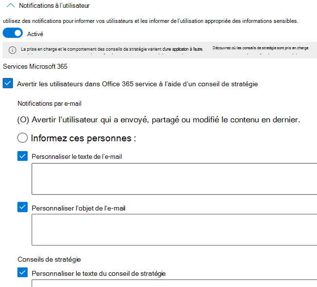

# Informations de référence sur la stratégie de protection contre la perte de données

Les stratégies de protection contre la perte de données (DLP) ont de nombreux composants à configurer. Pour créer une stratégie efficace, vous devez comprendre quel est l’objectif de chaque composant et comment sa configuration modifie le comportement de la stratégie. Cet article fournit une anatomie détaillée d’une stratégie DLP.

## Modèles de stratégie 

Les modèles de stratégie DLP sont pré triés en quatre catégories :

- Qui peuvent détecter et protéger les types d’informations **financières** .
- Celles qui peuvent détecter et protéger les types d’informations **médicales et médicales** .
- Qui peuvent détecter et protéger les types d’informations de **confidentialité** .
- Modèle **personnalisé** que vous pouvez utiliser pour créer votre propre stratégie si l’un des autres ne répond pas aux besoins de votre organisation.

Ce tableau répertorie tous les modèles de stratégie et les types d’informations sensibles (SIT) qu’ils couvrent. 

mise à jour : 23/06/2021

|Catégorie| Modèle | S' ASSEOIR |
|---------|---------|---------|
|Financier| Données financières en Australie| - [Code SWIFT](sensitive-information-type-entity-definitions.md#swift-code)   - [Numéro de fichier fiscal en Australie](sensitive-information-type-entity-definitions.md#australia-tax-file-number)   - [Numéro de compte bancaire en Australie](sensitive-information-type-entity-definitions.md#australia-bank-account-number)   - [Numéro de carte de crédit](sensitive-information-type-entity-definitions.md#credit-card-number)|
|Financier| Données financières du Canada |- [Numéro de carte de crédit](sensitive-information-type-entity-definitions.md#credit-card-number)   - [Numéro de compte bancaire au Canada](sensitive-information-type-entity-definitions.md#canada-bank-account-number)|
|Financier| Données financières de la France |- [Numéro de carte de crédit](sensitive-information-type-entity-definitions.md#credit-card-number)   - [Numéro de carte de débit de l’UE](sensitive-information-type-entity-definitions.md#eu-debit-card-number)|
|Financier| Données financières en Allemagne |- [Numéro de carte de crédit](sensitive-information-type-entity-definitions.md#credit-card-number)   - [Numéro de carte de débit de l’UE](sensitive-information-type-entity-definitions.md#eu-debit-card-number)|
|Financier| Données financières en Israël |- [Numéro de compte bancaire en Israël](sensitive-information-type-entity-definitions.md#israel-bank-account-number)   - [Code SWIFT](sensitive-information-type-entity-definitions.md#swift-code)   - [Numéro de carte de crédit](sensitive-information-type-entity-definitions.md#credit-card-number)|
|Financier| Données financières au Japon |- [Numéro de compte bancaire au Japon](sensitive-information-type-entity-definitions.md#japan-bank-account-number)   - [Numéro de carte de crédit](sensitive-information-type-entity-definitions.md#credit-card-number)|
|Financier| PCI Data Security Standard (PCI DSS)|- [Numéro de carte de crédit](sensitive-information-type-entity-definitions.md#credit-card-number)|
|Financier| Loi anti-cybercriminalité en Arabie saoudite|- [Code SWIFT](sensitive-information-type-entity-definitions.md#swift-code)   - [Numéro de compte bancaire international (IBAN)](sensitive-information-type-entity-definitions.md#international-banking-account-number-iban) |
|Financier| Données financières en Arabie Saoudite |- [Numéro de carte de crédit](sensitive-information-type-entity-definitions.md#credit-card-number)   - [Code SWIFT](sensitive-information-type-entity-definitions.md#swift-code)   - [Numéro de compte bancaire international (IBAN)](sensitive-information-type-entity-definitions.md#international-banking-account-number-iban)|
|Financier| Données financières du Royaume-Uni|- [Numéro de carte de crédit](sensitive-information-type-entity-definitions.md#credit-card-number)   - [Numéro de carte de débit de l’UE](sensitive-information-type-entity-definitions.md#eu-debit-card-number)   - [Code SWIFT](sensitive-information-type-entity-definitions.md#swift-code)|
|Financier| Données financières américaines|- [Numéro de carte de crédit](sensitive-information-type-entity-definitions.md#credit-card-number)   - [Numéro de compte bancaire américain](sensitive-information-type-entity-definitions.md#us-bank-account-number)  - [Numéro de routage ABA](sensitive-information-type-entity-definitions.md#aba-routing-number)|
|Financier| U.S. Federal Trade Commission (FTC) Consumer Rules|- [Numéro de carte de crédit](sensitive-information-type-entity-definitions.md#credit-card-number)   - [Numéro de compte bancaire américain](sensitive-information-type-entity-definitions.md#us-bank-account-number)  - [Numéro de routage ABA](sensitive-information-type-entity-definitions.md#aba-routing-number)|
|Financier| U.S. Gramm-Leach-Bliley Act (GLBA) Enhanced|- [Numéro de carte de crédit](sensitive-information-type-entity-definitions.md#credit-card-number)   - [Numéro de compte bancaire américain](sensitive-information-type-entity-definitions.md#us-bank-account-number)  - [Numéro d’identification du contribuable (ITIN) des États-Unis](sensitive-information-type-entity-definitions.md#us-individual-taxpayer-identification-number-itin)    - [Numéro de sécurité sociale (SSN) des États-Unis](sensitive-information-type-entity-definitions.md#us-social-security-number-ssn)  - [Numéro de passeport des États-Unis/Du Royaume-Uni](sensitive-information-type-entity-definitions.md#usuk-passport-number)   -[Numéro de permis de conduire américain](sensitive-information-type-entity-definitions.md#us-drivers-license-number)  - [Tous les noms complets](sensitive-information-type-entity-definitions.md#all-full-names)  - [Adresses physiques américaines](sensitive-information-type-entity-definitions.md#us-physical-addresses)|
|Financier| U.S. Gramm-Leach-Bliley Act (GLBA)|- [Numéro de carte de crédit](sensitive-information-type-entity-definitions.md#credit-card-number)   - [Numéro de compte bancaire américain](sensitive-information-type-entity-definitions.md#us-bank-account-number)  - [Numéro d’identification du contribuable (ITIN) des États-Unis](sensitive-information-type-entity-definitions.md#us-individual-taxpayer-identification-number-itin)    - [Numéro de sécurité sociale (SSN) des États-Unis](sensitive-information-type-entity-definitions.md#us-social-security-number-ssn)|
|Santé et médical| Australia Health Records Act (HRIP Act) Enhanced |- [Numéro de fichier fiscal en Australie](sensitive-information-type-entity-definitions.md#australia-tax-file-number)   - [Numéro de compte médical en Australie](sensitive-information-type-entity-definitions.md#australia-medical-account-number)   - [Tous les noms complets](sensitive-information-type-entity-definitions.md#all-full-names)   - [Toutes les conditions générales médicales](sensitive-information-type-entity-definitions.md#all-medical-terms-and-conditions)   - [Adresses physiques de l’Australie](sensitive-information-type-entity-definitions.md#australia-physical-addresses)|
|Santé et médical| Australia Health Records Act (HRIP Act)|- [Numéro de fichier fiscal en Australie](sensitive-information-type-entity-definitions.md#australia-tax-file-number)   - [Numéro de compte médical en Australie](sensitive-information-type-entity-definitions.md#australia-medical-account-number)|
|Santé et médical| Canada Health Information Act (HIA) |- [Numéro de passeport du Canada](sensitive-information-type-entity-definitions.md#canada-passport-number)  - [Numéro d’assurance sociale du Canada](sensitive-information-type-entity-definitions.md#canada-social-insurance-number)   - [Numéro du service de santé du Canada](sensitive-information-type-entity-definitions.md#canada-health-service-number)   - [Numéro d’identification de la santé personnelle du Canada](sensitive-information-type-entity-definitions.md#canada-personal-health-identification-number-phin)|
|Santé et médical| Canada Personal Health Information Act (PHIA) Manitoba|- [Numéro d’assurance sociale du Canada](sensitive-information-type-entity-definitions.md#canada-social-insurance-number)   - [Numéro du service de santé du Canada](sensitive-information-type-entity-definitions.md#canada-health-service-number)   - [Numéro d’identification de la santé personnelle du Canada](sensitive-information-type-entity-definitions.md#canada-personal-health-identification-number-phin)|
|Santé et médical| Canada Personal Health Act (PHIPA) Ontario |- [Numéro de passeport du Canada](sensitive-information-type-entity-definitions.md#canada-passport-number)  - [Numéro d’assurance sociale du Canada](sensitive-information-type-entity-definitions.md#canada-social-insurance-number)   - [Numéro du service de santé du Canada](sensitive-information-type-entity-definitions.md#canada-health-service-number)   - [Numéro d’identification de la santé personnelle du Canada](sensitive-information-type-entity-definitions.md#canada-personal-health-identification-number-phin)|
|Santé et médical| U.K. Access to Medical Reports Act|- [Numéro de service de santé national du Royaume-Uni](sensitive-information-type-entity-definitions.md#uk-national-health-service-number)   - [Numéro d’assurance nationale du Royaume-Uni (NINO)](sensitive-information-type-entity-definitions.md#uk-national-insurance-number-nino)|
|Santé et médical| Loi américaine sur l’assurance maladie (HIPAA) améliorée|  - [Classification internationale des maladies (ICD-9-CM)](sensitive-information-type-entity-definitions.md#international-classification-of-diseases-icd-9-cm)   - [Classification internationale des maladies (ICD-10-CM)](sensitive-information-type-entity-definitions.md#international-classification-of-diseases-icd-10-cm)   - [Tous les noms complets](sensitive-information-type-entity-definitions.md#all-full-names)   - [Toutes les conditions générales médicales](sensitive-information-type-entity-definitions.md#all-medical-terms-and-conditions)   - [Adresses physiques américaines](sensitive-information-type-entity-definitions.md#us-physical-addresses)|
|Santé et médical| U.S. Health Insurance Act (HIPAA)| - [Classification internationale des maladies (ICD-9-CM)](sensitive-information-type-entity-definitions.md#international-classification-of-diseases-icd-9-cm)   - [Classification internationale des maladies (ICD-10-CM)](sensitive-information-type-entity-definitions.md#international-classification-of-diseases-icd-10-cm)|
|Confidentialité| Australie Privacy Act Enhanced|- [Numéro de permis de conduire en Australie](sensitive-information-type-entity-definitions.md#australia-drivers-license-number)   - [Numéro de passeport en Australie](sensitive-information-type-entity-definitions.md#australia-passport-number)   - [Tous les noms complets](sensitive-information-type-entity-definitions.md#all-full-names)   - [Toutes les conditions générales médicales](sensitive-information-type-entity-definitions.md#all-medical-terms-and-conditions)   - [Adresses physiques de l’Australie](sensitive-information-type-entity-definitions.md#australia-physical-addresses)|
|Confidentialité| Australia Privacy Act|- [Numéro de permis de conduire en Australie](sensitive-information-type-entity-definitions.md#australia-drivers-license-number)   - [Numéro de passeport en Australie](sensitive-information-type-entity-definitions.md#australia-passport-number)|
|Confidentialité| Australia Personally Identifiable Information (PII) Data|- [Numéro de fichier fiscal en Australie](sensitive-information-type-entity-definitions.md#australia-tax-file-number)   - [Numéro de permis de conduire en Australie](sensitive-information-type-entity-definitions.md#australia-drivers-license-number)|
|Confidentialité| Canada Personally Identifiable Information (PII) Data|- [Numéro de permis de conduire au Canada](sensitive-information-type-entity-definitions.md#canada-drivers-license-number)  - [Numéro de compte bancaire au Canada](sensitive-information-type-entity-definitions.md#canada-bank-account-number)   - [Numéro de passeport du Canada](sensitive-information-type-entity-definitions.md#canada-passport-number)  - [Numéro d’assurance sociale du Canada](sensitive-information-type-entity-definitions.md#canada-social-insurance-number)   - [Numéro du service de santé du Canada](sensitive-information-type-entity-definitions.md#canada-health-service-number)   - [Numéro d’identification de la santé personnelle du Canada](sensitive-information-type-entity-definitions.md#canada-personal-health-identification-number-phin)|
|Confidentialité| Canada Personal Information Protection Act (PIPA)|- [Numéro de passeport du Canada](sensitive-information-type-entity-definitions.md#canada-passport-number)  - [Numéro d’assurance sociale du Canada](sensitive-information-type-entity-definitions.md#canada-social-insurance-number)   - [Numéro du service de santé du Canada](sensitive-information-type-entity-definitions.md#canada-health-service-number)   - [Numéro d’identification de la santé personnelle du Canada](sensitive-information-type-entity-definitions.md#canada-personal-health-identification-number-phin)|
|Confidentialité| Canada Personal Information Protection and Electronic Documents Act (PIPEDA)|- [Numéro de permis de conduire au Canada](sensitive-information-type-entity-definitions.md#canada-drivers-license-number)   - [Numéro de compte bancaire au Canada](sensitive-information-type-entity-definitions.md#canada-bank-account-number)   - [Numéro de passeport du Canada](sensitive-information-type-entity-definitions.md#canada-passport-number)  - [Numéro d’assurance sociale du Canada](sensitive-information-type-entity-definitions.md#canada-social-insurance-number)   - [Numéro du service de santé du Canada](sensitive-information-type-entity-definitions.md#canada-health-service-number)   - [Numéro d’identification de la santé personnelle du Canada](sensitive-information-type-entity-definitions.md#canada-personal-health-identification-number-phin)|
|Confidentialité| Loi informatique et liberté en France|- [Carte d’identité nationale de France (CNI)](sensitive-information-type-entity-definitions.md#france-national-id-card-cni)   - [Numéro de sécurité sociale en France (INSEE)](sensitive-information-type-entity-definitions.md#france-social-security-number-insee)|
|Confidentialité| France Personally Identifiable Information (PII) Data|- [Numéro de sécurité sociale en France (INSEE)](sensitive-information-type-entity-definitions.md#france-social-security-number-insee)   - [Numéro de permis de conduire en France](sensitive-information-type-entity-definitions.md#france-drivers-license-number)   - [Numéro de passeport en France](sensitive-information-type-entity-definitions.md#france-passport-number)   - [Carte d’identité nationale de France (CNI)](sensitive-information-type-entity-definitions.md#france-national-id-card-cni)|
|Confidentialité| Règlement général sur la protection des données (RGPD) amélioré|- [Adresses physiques en Autriche](sensitive-information-type-entity-definitions.md#austria-physical-addresses)   - [Adresses physiques belges](sensitive-information-type-entity-definitions.md#belgium-physical-addresses)  - [Adresses physiques bulgares](sensitive-information-type-entity-definitions.md#bulgaria-physical-addresses)  - [Adresses physiques croates](sensitive-information-type-entity-definitions.md#croatia-physical-addresses)  - [Adresses physiques de Chypre](sensitive-information-type-entity-definitions.md#cyprus-physical-addresses)  - [Adresses physiques de la République tchèque](sensitive-information-type-entity-definitions.md#czech-republic-physical-addresses)  - [Adresses physiques du Danemark](sensitive-information-type-entity-definitions.md#denmark-physical-addresses)  - [Adresses physiques estoniennes](sensitive-information-type-entity-definitions.md#estonia-physical-addresses)  - [Adresses physiques en Finlande](sensitive-information-type-entity-definitions.md#finland-physical-addresses)  - [Adresses physiques de la France](sensitive-information-type-entity-definitions.md#france-physical-addresses)  - [Adresses physiques allemandes](sensitive-information-type-entity-definitions.md#germany-physical-addresses)  - [Adresses physiques de la Grèce](sensitive-information-type-entity-definitions.md#greece-physical-addresses)  - [Adresses physiques en Hongrie](sensitive-information-type-entity-definitions.md#hungary-physical-addresses)  - [Adresses physiques de l’Irlande](sensitive-information-type-entity-definitions.md#ireland-physical-addresses)  - [Adresses physiques en Italie](sensitive-information-type-entity-definitions.md#italy-physical-addresses)  - [Adresses physiques lettones](sensitive-information-type-entity-definitions.md#latvia-physical-addresses)  - [Adresses physiques lituaniennes](sensitive-information-type-entity-definitions.md#lithuania-physical-addresses)  - [Adresses physiques luxembourgeoises](sensitive-information-type-entity-definitions.md#luxemburg-physical-addresses)  - [Adresses physiques de Malte](sensitive-information-type-entity-definitions.md#malta-physical-addresses)  - [Adresses physiques des Pays-Bas](sensitive-information-type-entity-definitions.md#netherlands-physical-addresses)  - [Adresses physiques en Pologne](sensitive-information-type-entity-definitions.md#poland-physical-addresses)  - [Adresses physiques portugaises](sensitive-information-type-entity-definitions.md#portugal-physical-addresses)  - [Adresses physiques en Roumanie](sensitive-information-type-entity-definitions.md#romania-physical-addresses)  - [Adresses physiques en Slovaquie](sensitive-information-type-entity-definitions.md#slovakia-physical-addresses)  - [Adresses physiques slovènes](sensitive-information-type-entity-definitions.md#slovenia-physical-addresses)  - [Adresses physiques en Espagne](sensitive-information-type-entity-definitions.md#spain-physical-addresses)  - [Adresses physiques en Suède](sensitive-information-type-entity-definitions.md#sweden-physical-addresses)  - [Numéro de sécurité sociale en Autriche](sensitive-information-type-entity-definitions.md#austria-social-security-number)  - [Numéro de sécurité sociale en France (INSEE)](sensitive-information-type-entity-definitions.md#france-social-security-number-insee)  - [Numéro de sécurité sociale en Grèce (AMKA)](sensitive-information-type-entity-definitions.md#greece-social-security-number-amka)  - [Numéro de sécurité sociale hongrois (TAJ)](sensitive-information-type-entity-definitions.md#hungary-social-security-number-taj)  - [Numéro de sécurité sociale en Espagne (SSN)](sensitive-information-type-entity-definitions.md#spain-social-security-number-ssn)  - [Carte d’identité d’Autriche](sensitive-information-type-entity-definitions.md#austria-identity-card)  - [Carte d’identité de Chypre](sensitive-information-type-entity-definitions.md#cyprus-identity-card)  - [Numéro de carte d’identité d’Allemagne](sensitive-information-type-entity-definitions.md#germany-identity-card-number)  - [Numéro de carte d’identité de Malte](sensitive-information-type-entity-definitions.md#malta-identity-card-number)  - [Carte d’identité nationale de France (CNI)](sensitive-information-type-entity-definitions.md#france-national-id-card-cni)  - [Carte nationale d’ID de Grèce](sensitive-information-type-entity-definitions.md#greece-national-id-card)  - [ID national de la Finlande](sensitive-information-type-entity-definitions.md#finland-national-id)  - [Poland National ID (PESEL)](sensitive-information-type-entity-definitions.md#poland-national-id-pesel)  - [ID national de la Suède](sensitive-information-type-entity-definitions.md#sweden-national-id)  - [Numéro d’identification personnelle croate (OIB)](sensitive-information-type-entity-definitions.md#croatia-personal-identification-oib-number)  - [Numéro d’identité personnelle tchèque](sensitive-information-type-entity-definitions.md#czech-personal-identity-number)  - [Numéro d’identification personnelle du Danemark](sensitive-information-type-entity-definitions.md#denmark-personal-identification-number)  - [Code d’identification personnelle de l’Estonie](sensitive-information-type-entity-definitions.md#estonia-personal-identification-code)  - [Numéro d’identification personnelle en Hongrie](sensitive-information-type-entity-definitions.md#hungary-personal-identification-number)  - [Numéro d’identification national du Luxembourg (personnes physiques)](sensitive-information-type-entity-definitions.md#luxemburg-national-identification-number-natural-persons)  - [Numéro d’identification national du Luxembourg (personnes non naturelles)](sensitive-information-type-entity-definitions.md#luxemburg-national-identification-number-non-natural-persons)  - [Code fiscal de l’Italie](sensitive-information-type-entity-definitions.md#italy-fiscal-code)  - [Code personnel letton](sensitive-information-type-entity-definitions.md#latvia-personal-code)  - [Code personnel lituanien](sensitive-information-type-entity-definitions.md#lithuania-personal-code)  - [Code numérique personnel roumain (CNP)](sensitive-information-type-entity-definitions.md#romania-personal-numeric-code-cnp)  - [Numéro du BSN (Netherlands Citizen’s Service)](sensitive-information-type-entity-definitions.md#netherlands-citizens-service-bsn-number)  - [Numéro de service public personnel (PPS) en Irlande](sensitive-information-type-entity-definitions.md#ireland-personal-public-service-pps-number)  - [Numéro civil uniforme en Bulgarie](sensitive-information-type-entity-definitions.md#bulgaria-uniform-civil-number)  - [Numéro national de belgique](sensitive-information-type-entity-definitions.md#belgium-national-number)  - [Espagne DNI](sensitive-information-type-entity-definitions.md#spain-dni)  - [Slovénie Unique Master Citizen Number](sensitive-information-type-entity-definitions.md#slovenia-unique-master-citizen-number)  - [Numéro personnel en Slovaquie](sensitive-information-type-entity-definitions.md#slovakia-personal-number)  - [Numéro de carte de citoyen du Portugal](sensitive-information-type-entity-definitions.md#portugal-citizen-card-number)  - [Numéro d’ID fiscal de Malte](sensitive-information-type-entity-definitions.md#malta-tax-identification-number)  - [Numéro d’identification fiscale en Autriche](sensitive-information-type-entity-definitions.md#austria-tax-identification-number)  - [Numéro d’identification fiscale de Chypre](sensitive-information-type-entity-definitions.md#cyprus-tax-identification-number)  - [Numéro d’identification fiscale en France (numéro SPI.)](sensitive-information-type-entity-definitions.md#france-tax-identification-number)  - [Numéro d’identification fiscale en Allemagne](sensitive-information-type-entity-definitions.md#germany-tax-identification-number)  - [Numéro d’identification fiscale grecque](sensitive-information-type-entity-definitions.md#greece-tax-identification-number)  - [Numéro d’identification fiscale en Hongrie](sensitive-information-type-entity-definitions.md#hungary-tax-identification-number)  - [Numéro d’identification fiscale aux Pays-Bas](sensitive-information-type-entity-definitions.md#netherlands-tax-identification-number)  - [Numéro d’identification fiscale en Pologne](sensitive-information-type-entity-definitions.md#poland-tax-identification-number)  - [Numéro d’identification fiscale du Portugal](sensitive-information-type-entity-definitions.md#portugal-tax-identification-number)  - [Numéro d’identification fiscale en Slovénie](sensitive-information-type-entity-definitions.md#slovenia-tax-identification-number)  - [Numéro d’identification fiscale en Espagne](sensitive-information-type-entity-definitions.md#spain-tax-identification-number)  - [Numéro d’identification fiscale en Suède](sensitive-information-type-entity-definitions.md#sweden-tax-identification-number)  - [Permis de conduire en Autriche](sensitive-information-type-entity-definitions.md#austria-drivers-license-number)  - [Numéro de permis de conduire en Belgique](sensitive-information-type-entity-definitions.md#belgium-drivers-license-number)  - [Numéro de permis de conduire en Bulgarie](sensitive-information-type-entity-definitions.md#bulgaria-drivers-license-number)  - [Numéro de permis de conduire en Croatie](sensitive-information-type-entity-definitions.md#croatia-drivers-license-number)  - [Numéro de permis de conduire de Chypre](sensitive-information-type-entity-definitions.md#cyprus-drivers-license-number)  - [Numéro de permis de conduire tchèque](sensitive-information-type-entity-definitions.md#czech-drivers-license-number)  - [Numéro de permis de conduire au Danemark](sensitive-information-type-entity-definitions.md#denmark-drivers-license-number)  - [Numéro de permis de conduire estonien](sensitive-information-type-entity-definitions.md#estonia-drivers-license-number)  - [Numéro de permis de conduire en Finlande](sensitive-information-type-entity-definitions.md#finland-drivers-license-number)  - [Numéro de permis de conduire en France](sensitive-information-type-entity-definitions.md#france-drivers-license-number)  - [Numéro de permis de conduire allemand](sensitive-information-type-entity-definitions.md#germany-drivers-license-number)  - [Numéro de permis de conduire en Grèce](sensitive-information-type-entity-definitions.md#greece-drivers-license-number)  - [Numéro de permis de conduire en Hongrie](sensitive-information-type-entity-definitions.md#hungary-drivers-license-number)  - [Numéro de permis de conduire en Irlande](sensitive-information-type-entity-definitions.md#ireland-drivers-license-number)  - [Numéro de permis de conduire en Italie](sensitive-information-type-entity-definitions.md#italy-drivers-license-number)  - [Numéro de permis de conduire letton](sensitive-information-type-entity-definitions.md#latvia-drivers-license-number)  - [Numéro de permis de conduire en Lituanie](sensitive-information-type-entity-definitions.md#lithuania-drivers-license-number)  - [Numéro de permis de conduire du Luxemburg](sensitive-information-type-entity-definitions.md#luxemburg-drivers-license-number)  - [Numéro de permis de conduire de Malte](sensitive-information-type-entity-definitions.md#malta-drivers-license-number)  - [Numéro de permis de conduire aux Pays-Bas](sensitive-information-type-entity-definitions.md#netherlands-drivers-license-number)  - [Numéro de permis de conduire en Pologne](sensitive-information-type-entity-definitions.md#poland-drivers-license-number)  - [Numéro de permis de conduire au Portugal](sensitive-information-type-entity-definitions.md#portugal-drivers-license-number)  - [Numéro de permis de conduire en Roumanie](sensitive-information-type-entity-definitions.md#romania-drivers-license-number)  - [Numéro de permis de conduire en Slovaquie](sensitive-information-type-entity-definitions.md#slovakia-drivers-license-number)  - [Numéro de permis de conduire en Slovénie](sensitive-information-type-entity-definitions.md#slovenia-drivers-license-number)  - [Numéro de permis de conduire en Espagne](sensitive-information-type-entity-definitions.md#spain-drivers-license-number)  - [Numéro de permis de conduire en Suède](sensitive-information-type-entity-definitions.md#sweden-drivers-license-number)  - [Numéro de passeport en Autriche](sensitive-information-type-entity-definitions.md#austria-passport-number)  - [Numéro de passeport en Belgique](sensitive-information-type-entity-definitions.md#belgium-passport-number)  - [Numéro de passeport en Bulgarie](sensitive-information-type-entity-definitions.md#bulgaria-passport-number)  - [Numéro de passeport en Croatie](sensitive-information-type-entity-definitions.md#croatia-passport-number)  - [Numéro de passeport de Chypre](sensitive-information-type-entity-definitions.md#cyprus-passport-number)  - [Numéro de passeport de la République tchèque](sensitive-information-type-entity-definitions.md#czech-passport-number)  - [Numéro de passeport du Danemark](sensitive-information-type-entity-definitions.md#denmark-passport-number)  - [Numéro de passeport estonien](sensitive-information-type-entity-definitions.md#estonia-passport-number)  - [Numéro de passeport en Finlande](sensitive-information-type-entity-definitions.md#finland-passport-number)  - [Numéro de passeport en France](sensitive-information-type-entity-definitions.md#france-passport-number)  - [Numéro de passeport allemand](sensitive-information-type-entity-definitions.md#germany-passport-number)  - [Numéro de passeport en Grèce](sensitive-information-type-entity-definitions.md#greece-passport-number)  - [Numéro de passeport en Hongrie](sensitive-information-type-entity-definitions.md#hungary-passport-number)  - [Numéro de passeport en Irlande](sensitive-information-type-entity-definitions.md#ireland-passport-number)  - [Numéro de passeport en Italie](sensitive-information-type-entity-definitions.md#italy-passport-number)  - [Numéro de passeport letton](sensitive-information-type-entity-definitions.md#latvia-passport-number)  - [Numéro de passeport en Lituanie](sensitive-information-type-entity-definitions.md#lithuania-passport-number)  - [Numéro de passeport de Luxemburg](sensitive-information-type-entity-definitions.md#luxemburg-passport-number)  - [Numéro de passeport maltais](sensitive-information-type-entity-definitions.md#malta-passport-number)  - [Numéro de passeport des Pays-Bas](sensitive-information-type-entity-definitions.md#netherlands-passport-number)  - [Passeport pologne](sensitive-information-type-entity-definitions.md#poland-passport-number)  - [Numéro de passeport du Portugal](sensitive-information-type-entity-definitions.md#portugal-passport-number)  - [Numéro de passeport en Roumanie](sensitive-information-type-entity-definitions.md#romania-passport-number)  - [Numéro de passeport en Slovaquie](sensitive-information-type-entity-definitions.md#slovakia-passport-number)  - [Numéro de passeport en Slovénie](sensitive-information-type-entity-definitions.md#slovenia-passport-number)  - [Numéro de passeport en Espagne](sensitive-information-type-entity-definitions.md#spain-passport-number)  - [Numéro de passeport en Suède](sensitive-information-type-entity-definitions.md#sweden-passport-number)  - [Numéro de carte de débit de l’UE](sensitive-information-type-entity-definitions.md#eu-debit-card-number)  - [Tous les noms complets](sensitive-information-type-entity-definitions.md#all-full-names)|
|Confidentialité| Règlement général sur la protection des données (RGPD)|- [Numéro de carte de débit de l’UE](sensitive-information-type-entity-definitions.md#eu-debit-card-number)   - [Numéro de permis de conduire de l’UE](sensitive-information-type-entity-definitions.md#eu-drivers-license-number)   - [Numéro d’identification nationale de l’UE](sensitive-information-type-entity-definitions.md#eu-national-identification-number)  - [Numéro de passeport de l’UE](sensitive-information-type-entity-definitions.md#eu-passport-number)   - [Numéro de sécurité sociale de l’UE ou identification équivalente](sensitive-information-type-entity-definitions.md#eu-social-security-number-or-equivalent-identification)  - [Numéro d’identification fiscale de l’UE](sensitive-information-type-entity-definitions.md#eu-tax-identification-number)|
|Confidentialité| Germany Personally Identifiable Information (PII) Data|- [Numéro de permis de conduire en Allemagne](sensitive-information-type-entity-definitions.md#germany-drivers-license-number)   - [Numéro de passeport en Allemagne](sensitive-information-type-entity-definitions.md#germany-passport-number)| 
|Confidentialité| Israel Personally Identifiable Information (PII) Data|- [Numéro d’identification nationale d’Israël](sensitive-information-type-entity-definitions.md#israel-national-identification-number)| 
|Confidentialité| Israel Protection of Privacy|- [Numéro d’identification nationale d’Israël](sensitive-information-type-entity-definitions.md#israel-national-identification-number)  - [Numéro de compte bancaire en Israël](sensitive-information-type-entity-definitions.md#israel-bank-account-number)|
|Confidentialité| Amélioration des données d’informations d’identification personnelle (PII) au Japon|- [Numéro d’assurance sociale du Japon (SIN)](sensitive-information-type-entity-definitions.md#japan-social-insurance-number-sin)  - [Japon Mon numéro - Personnel](sensitive-information-type-entity-definitions.md#japan-my-number---personal)  - [Numéro de passeport au Japon](sensitive-information-type-entity-definitions.md#japan-passport-number)  - [Numéro de permis de conduire au Japon](sensitive-information-type-entity-definitions.md#japan-drivers-license-number)  - [Tous les noms complets](sensitive-information-type-entity-definitions.md#all-full-names)  - [Adresses physiques du Japon](sensitive-information-type-entity-definitions.md#all-physical-addresses)|
|Confidentialité| Japan Personally Identifiable Information (PII) Data|- [Numéro d’inscription des résidents du Japon](sensitive-information-type-entity-definitions.md#japan-resident-registration-number)   - [Numéro d’assurance sociale du Japon (SIN)](sensitive-information-type-entity-definitions.md#japan-social-insurance-number-sin)|
|Confidentialité| Amélioration de la protection des informations personnelles au Japon|- [Numéro d’assurance sociale du Japon (SIN)](sensitive-information-type-entity-definitions.md#japan-social-insurance-number-sin)   - [Japon Mon numéro - Personnel](sensitive-information-type-entity-definitions.md#japan-my-number---personal)  - [Numéro de passeport au Japon](sensitive-information-type-entity-definitions.md#japan-passport-number)   - [Numéro de permis de conduire au Japon](sensitive-information-type-entity-definitions.md#japan-drivers-license-number)  - [Tous les noms complets](sensitive-information-type-entity-definitions.md#all-full-names)  - [Adresses physiques du Japon](sensitive-information-type-entity-definitions.md#all-physical-addresses)|
|Confidentialité| Japan Protection of Personal Information|- [Numéro d’inscription des résidents du Japon](sensitive-information-type-entity-definitions.md#japan-resident-registration-number)  - [Numéro d’assurance sociale du Japon (SIN)](sensitive-information-type-entity-definitions.md#japan-social-insurance-number-sin)|
|Confidentialité| Données d’identification personnelle (PII) de l’Arabie saoudite|- [ID national de l’Arabie saoudite](sensitive-information-type-entity-definitions.md#saudi-arabia-national-id)|
|Confidentialité| U.K. Data Protection Act|- [Numéro d’assurance nationale du Royaume-Uni (NINO)](sensitive-information-type-entity-definitions.md#uk-national-insurance-number-nino)   - [Numéro de passeport des États-Unis/Du Royaume-Uni](sensitive-information-type-entity-definitions.md#usuk-passport-number)   - [Code SWIFT](sensitive-information-type-entity-definitions.md#swift-code)|
|Confidentialité| U.K. Privacy and Electronic Communications Regulations|- [Code SWIFT](sensitive-information-type-entity-definitions.md#swift-code)|
|Confidentialité| U.K. Personally Identifiable Information (PII) Data|- [Numéro d’assurance nationale du Royaume-Uni (NINO)](sensitive-information-type-entity-definitions.md#uk-national-insurance-number-nino)   - [Numéro de passeport des États-Unis/Du Royaume-Uni](sensitive-information-type-entity-definitions.md#usuk-passport-number)|
|Confidentialité| U.K. Personal Information Online Code of Practice (PIOCP)|- [Numéro d’assurance nationale du Royaume-Uni (NINO)](sensitive-information-type-entity-definitions.md#uk-national-insurance-number-nino)   - [Numéro de service de santé national du Royaume-Uni](sensitive-information-type-entity-definitions.md#uk-national-health-service-number)   - [Code SWIFT](sensitive-information-type-entity-definitions.md#swift-code)|
|Confidentialité| U.S Patriot Act amélioré|- [Numéro de carte de crédit](sensitive-information-type-entity-definitions.md#credit-card-number)   - [Numéro de compte bancaire américain](sensitive-information-type-entity-definitions.md#us-bank-account-number)  - [Numéro d’identification du contribuable (ITIN) des États-Unis](sensitive-information-type-entity-definitions.md#us-individual-taxpayer-identification-number-itin)    - [Numéro de sécurité sociale (SSN) des États-Unis](sensitive-information-type-entity-definitions.md#us-social-security-number-ssn)  - [Tous les noms complets](sensitive-information-type-entity-definitions.md#all-full-names)  - [Adresses physiques américaines](sensitive-information-type-entity-definitions.md#us-physical-addresses)|
|Confidentialité| U.S. Patriot Act|- [Numéro de carte de crédit](sensitive-information-type-entity-definitions.md#credit-card-number)   - [Numéro de compte bancaire américain](sensitive-information-type-entity-definitions.md#us-bank-account-number)  - [Numéro d’identification du contribuable (ITIN) des États-Unis](sensitive-information-type-entity-definitions.md#us-individual-taxpayer-identification-number-itin)    - [Numéro de sécurité sociale (SSN) des États-Unis](sensitive-information-type-entity-definitions.md#us-social-security-number-ssn)|
|Confidentialité| Données d’identification personnelle (PII) améliorées aux États-Unis|- [Numéro d’identification du contribuable (ITIN) des États-Unis](sensitive-information-type-entity-definitions.md#us-individual-taxpayer-identification-number-itin)    - [Numéro de sécurité sociale (SSN) des États-Unis](sensitive-information-type-entity-definitions.md#us-social-security-number-ssn)  - [Numéro de passeport des États-Unis/Du Royaume-Uni](sensitive-information-type-entity-definitions.md#usuk-passport-number)  - [Tous les noms complets](sensitive-information-type-entity-definitions.md#all-full-names)  - [Adresses physiques américaines](sensitive-information-type-entity-definitions.md#us-physical-addresses)|
|Confidentialité| U.S. Personally Identifiable Information (PII) Data|- [Numéro d’identification du contribuable (ITIN) des États-Unis](sensitive-information-type-entity-definitions.md#us-individual-taxpayer-identification-number-itin)    - [Numéro de sécurité sociale (SSN) des États-Unis](sensitive-information-type-entity-definitions.md#us-social-security-number-ssn)  - [Numéro de passeport des États-Unis/Du Royaume-Uni](sensitive-information-type-entity-definitions.md#usuk-passport-number)|
|Confidentialité| Les lois sur les notifications de violation de l’État des États-Unis ont été améliorées|- [Numéro de carte de crédit](sensitive-information-type-entity-definitions.md#credit-card-number)   - [Numéro de compte bancaire américain](sensitive-information-type-entity-definitions.md#us-bank-account-number)  -[Numéro de permis de conduire américain](sensitive-information-type-entity-definitions.md#us-drivers-license-number)   - [Numéro de sécurité sociale (SSN) des États-Unis](sensitive-information-type-entity-definitions.md#us-social-security-number-ssn)  - [Tous les noms complets](sensitive-information-type-entity-definitions.md#all-full-names)   - [Numéro de passeport des États-Unis/Du Royaume-Uni](sensitive-information-type-entity-definitions.md#usuk-passport-number)  - [Toutes les conditions générales médicales](sensitive-information-type-entity-definitions.md#all-medical-terms-and-conditions)|
|Confidentialité| U.S. State Breach Notification Laws|- [Numéro de carte de crédit](sensitive-information-type-entity-definitions.md#credit-card-number)   - [Numéro de compte bancaire américain](sensitive-information-type-entity-definitions.md#us-bank-account-number)  -[Numéro de permis de conduire américain](sensitive-information-type-entity-definitions.md#us-drivers-license-number)   - [Numéro de sécurité sociale (SSN) des États-Unis](sensitive-information-type-entity-definitions.md#us-social-security-number-ssn)|
|Confidentialité| U.S. State Social Security Number Confidentiality Laws|- [Numéro de sécurité sociale (SSN) des États-Unis](sensitive-information-type-entity-definitions.md#us-social-security-number-ssn)|

## Emplacements

Une stratégie DLP peut rechercher et protéger des éléments qui contiennent des informations sensibles sur plusieurs emplacements.

|Emplacement  |Inclure/exclure l’étendue  |État des données  |Prérequis supplémentaires |
|---------|---------|---------|---------|
|e-mail Exchange en ligne |groupe de distribution | données en mouvement| Non |
|sites en ligne SharePoint   |sites       | données au repos   données utilisées | Non|
|Les comptes OneDrive Entreprise| compte ou groupe de distribution |données au repos   données utilisées|Non|
|conversation et messages de canal Teams     | compte ou groupe de distribution |données en mouvement   données utilisées |  Non       |
|Microsoft Defender for Cloud Apps   | instance d’application cloud       |données au repos         | - [Utiliser des stratégies de protection contre la perte de données pour les applications cloud non Microsoft](dlp-use-policies-non-microsoft-cloud-apps.md#use-data-loss-prevention-policies-for-non-microsoft-cloud-apps)        |
|Appareils  |utilisateurs ou groupe         |données au repos    données utilisées    données en mouvement         |- [En savoir plus sur Microsoft 365 protection contre la perte de données de point de terminaison](endpoint-dlp-learn-about.md#learn-about-microsoft-365-endpoint-data-loss-prevention)  - [Démarrage avec protection contre la perte de données de point de terminaison](endpoint-dlp-getting-started.md#get-started-with-endpoint-data-loss-prevention)  - [Configurer les paramètres de proxy d’appareil et de connexion Internet pour Information Protection](device-onboarding-configure-proxy.md#configure-device-proxy-and-internet-connection-settings-for-information-protection) |
|Référentiels locaux (partages de fichiers et SharePoint)    |Référentiel         | données au repos         | - [En savoir plus sur le scanneur local Microsoft 365 la protection contre la perte de données](dlp-on-premises-scanner-learn.md#learn-about-the-microsoft-365-data-loss-prevention-on-premises-scanner)   - [Démarrage avec le scanneur local de protection contre la perte de données](dlp-on-premises-scanner-get-started.md#get-started-with-the-data-loss-prevention-on-premises-scanner)         |
|PowerBI| Espaces | données utilisées | Non|

Si vous décidez d’inclure des groupes de distribution particuliers dans Exchange, la stratégie DLP est uniquement étendue aux membres de ceux-ci. De manière identique, l’exclusion d’un groupe de distribution exclut tous ses membres de l’évaluation de la stratégie. Vous pouvez choisir de limiter une stratégie aux membres des listes de distribution, aux groupes de distribution dynamiques et aux groupes de sécurité. Une stratégie DLP ne peut pas contenir plus de 50 inclusions et exclusions de ce genre.

Si vous optez pour l’inclusion ou l’exclusion de sites SharePoint ou de comptes OneDrive spécifiques, notez qu’une stratégie DLP ne peut pas contenir plus de 100 inclusions et exclusions. Vous pouvez néanmoins contourner cette limite en appliquant une stratégie mise en place à l’échelle de l’organisation ou une stratégie qui s’applique aux emplacements entiers.

Si vous choisissez d’inclure ou d’exclure des comptes ou groupes OneDrive spécifiques, une stratégie DLP peut contenir au plus 100 comptes d’utilisateurs ou 50 groupes pour l’inclusion ou l’exclusion.

### Prise en charge de l’emplacement pour la façon dont le contenu peut être défini

Les stratégies DLP détectent les éléments sensibles en les mettant en correspondance avec un type d’informations sensibles (SIT), une étiquette de confidentialité ou une étiquette de rétention. Chaque emplacement prend en charge différentes méthodes de définition de contenu sensible. Lorsque vous combinez des emplacements dans une stratégie, la façon dont le contenu peut être défini peut changer par la façon dont il peut être défini par un emplacement unique. 

> [!IMPORTANT]
> Lorsque vous sélectionnez plusieurs emplacements pour une stratégie, une valeur « non » pour une catégorie de définition de contenu est prioritaire sur la valeur « oui ». Par exemple, lorsque vous sélectionnez SharePoint sites uniquement, la stratégie prend en charge la détection d’éléments sensibles par un ou plusieurs sit, par étiquette de confidentialité ou par étiquette de rétention. Toutefois, lorsque vous sélectionnez SharePoint sites ***et*** Teams emplacements de messages de conversation et de canal, la stratégie prend uniquement en charge la détection des éléments sensibles par SIT.

|Emplacement| Le contenu peut être défini par SIT| Le contenu peut être défini sur une étiquette de confidentialité| Le contenu peut être défini par une étiquette de rétention|
|---------|---------|---------|---------|
|e-mail Exchange en ligne|Oui| Oui| Non|
|sites en ligne SharePoint| Oui| Oui| Oui|
|Les comptes OneDrive Entreprise| Oui| Oui| Oui|
|Teams messages de conversation et de canal | Oui| Non| Non|
|Appareils |Oui | Oui|  Non|
|Microsoft Defender for Cloud Apps | Oui| Oui| Oui|
|Référentiels locaux| Oui| Oui| Non|
|PowerBI|Oui | Oui| Non|

> [!NOTE]
> DLP prend en charge la détection des étiquettes de confidentialité sur les e-mails et les pièces jointes Voir, [Utiliser les étiquettes de confidentialité comme conditions dans les stratégies DLP](dlp-sensitivity-label-as-condition.md#use-sensitivity-labels-as-conditions-in-dlp-policies).

## Rules

<!--This section introduces the classifications of content that, when detected, can be protected. Link out to [Learn about sensitive information types]() and [Sensitive information type entity definitions](sensitive-information-type-entity-definitions.md#sensitive-information-type-entity-definitions) as well as labels (cross referenced by supporting workload). It will touch on the purpose of multiple conditions, confidence levels (link out to [more on confidence levels](sensitive-information-type-learn-about.md#more-on-confidence-levels)) and confidence levels video. How to use the confidence level to change the behavior of a policy in conjunction with the instance count.  eg. if you want your policy to trigger when it encounters situation DEF, set your conditions like HIJ.-->
<!--
- What is a rule in the context of a Policy?
- when and why should I have more than one rule?
- The purpose of rule groups
- How do I tune the behavior of a Policy through the tuning of rules
- what's in a rule-->

Les règles sont la logique métier des stratégies DLP. Elles se composent des éléments suivantes :

- [**Conditions**](#conditions) qui, lorsqu’elle est mise en correspondance, déclenchent la stratégie
- [**Exceptions**](#exceptions) aux conditions
- [**Actions**](#actions) à effectuer lorsque la stratégie est déclenchée
- [**Notifications**](#user-notifications-and-policy-tips) utilisateur pour informer vos utilisateurs lorsqu’ils font quelque chose qui déclenche une stratégie et les aider à les informer sur la façon dont votre organisation souhaite que les informations sensibles soient traitées
- [**Les remplacements d’utilisateurs**](#user-overrides) lorsqu’ils sont configurés par un administrateur permettent aux utilisateurs de substituer de manière sélective une action de blocage
- [**Rapports d’incidents**](#incident-reports) qui informent les administrateurs et d’autres parties prenantes clés lorsqu’une correspondance de règle se produit
- [**Options supplémentaires**](#additional-options) qui définissent la priorité pour l’évaluation des règles et peuvent arrêter le traitement des règles et des stratégies.

 Une stratégie contient une ou plusieurs règles. Les règles sont exécutées de façon séquentielle, en commençant par la règle de priorité la plus élevée dans chaque stratégie.

### La priorité de traitement des règles

#### Charges de travail de service hébergées

Pour les charges de travail de service hébergées, comme Exchange Online, SharePoint Online et OneDrive Entreprise, chaque règle se voit attribuer une priorité dans l’ordre dans lequel elle est créée. Cela signifie que la règle créée en premier a la première priorité, la règle créée en deuxième a la deuxième priorité, et ainsi de suite. 
  

Lorsque des règles sont appliquées au contenu, elles sont traitées dans l’ordre de priorité. Si le contenu correspond à plusieurs règles, la première règle évaluée avec l’action la *plus* restrictive est appliquée. Par exemple, si le contenu correspond à toutes les règles suivantes, la *règle 3* est appliquée, car il s’agit de la règle la plus prioritaire et la plus restrictive :
  
- Règle 1 : informe seulement les utilisateurs
- Règle 2 : informe les utilisateurs, limite l’accès et permet le remplacement de l’utilisateur
- *Règle 3 : informe les utilisateurs, limite l’accès et ne permet pas le remplacement de l’utilisateur*
- Règle 4 : restreint l’accès

Les règles 1, 2 et 4 seraient évaluées, mais pas appliquées. Dans cet exemple, les correspondances pour toutes les règles sont enregistrées dans les journaux d’audit et affichées dans les rapports DLP, même si seule la règle la plus restrictive est appliquée.

Vous pouvez utiliser une règle pour répondre à une exigence de protection particulière, puis utiliser une stratégie DLP pour regrouper des spécifications requises communes en matière de protection, par exemple l’ensemble des règles requises pour se conformer à une réglementation spécifique.
  
Par exemple, vous pouvez avoir une stratégie DLP qui vous aide à détecter la présence d’informations visées par la loi américaine sur l’assurance maladie (Health Insurance Portability Accountability Act, ou HIPAA). Cette stratégie DLP peut contribuer à protéger les données HIPAA (quoi) sur tous les sites SharePoint Online et tous les sites OneDrive Entreprise (où) en recherchant les documents contenant ces informations sensibles partagées avec des personnes extérieures à votre organisation (conditions), et en bloquant l’accès au document et en envoyant une notification (actions). Ces conditions sont stockées en tant que règles individuelles et regroupées sous la forme d’une stratégie DLP pour simplifier la gestion et la création de rapports.
  

#### Pour les points de terminaison

La priorité des règles sur les points de terminaison est également affectée en fonction de l’ordre dans lequel elle est créée. Cela signifie que la règle créée en premier a la première priorité, la règle créée en deuxième a la deuxième priorité, et ainsi de suite. 

Lorsqu’un fichier sur un point de terminaison correspond à plusieurs stratégies DLP, la première règle activée avec l’application la plus restrictive [sur les activités de point](endpoint-dlp-learn-about.md#endpoint-activities-you-can-monitor-and-take-action-on) de terminaison est celle qui est appliquée sur le contenu. Par exemple, si le contenu correspond à toutes les règles suivantes, la règle 2 est prioritaire sur les autres règles, car elle est la plus restrictive.

- Règle 1 : audite uniquement toutes les activités 
- *Règle 2 : bloque toutes les activités*
- Règle 3 : bloque toute activité avec l’option permettant à l’utilisateur final de remplacer

Dans l’exemple ci-dessous, la règle 1 est prioritaire sur les autres règles correspondantes, car elle est la plus restrictive.

- *Règle 1 : bloque l’activité et n’autorise pas le remplacement par l’utilisateur*
- Règle 2 : bloque l’activité et autorise les remplacements d’utilisateurs
- Règle 3 : audite uniquement toutes les activités
- Règle 4 : aucune application

Toutes les autres règles sont évaluées, mais leurs actions ne sont pas appliquées. Les journaux d’audit affichent la règle la plus restrictive appliquée au fichier. S’il existe plusieurs règles qui correspondent et qu’elles sont tout aussi restrictives, la stratégie et la priorité de règle régissent la règle qui serait appliquée sur le fichier.

### Conditions

Les conditions sont inclusives et vous définissez ce que vous souhaitez que la règle recherche et le contexte dans lequel ces éléments sont utilisés. Ils indiquent à la règle &#8212; lorsque vous trouvez un élément qui ressemble à *ceci* et qui est utilisé comme *cela* &#8212; il s’agit d’une correspondance et les autres actions de la stratégie doivent être effectuées sur celui-ci. Vous pouvez utiliser les conditions pour affecter différentes actions à différents niveaux de risque. Par exemple, un contenu sensible partagé en interne peut être moins risqué et nécessiter moins d’actions qu’un contenu sensible partagé avec des personnes extérieures à l’organisation.

> [!NOTE]
> Les utilisateurs qui ont des comptes non invités dans le client Active Directory ou Azure Active Directory d’une organisation hôte sont considérés comme des personnes internes à l’organisation. 

#### Le contenu contient

 Tous les emplacements prennent en charge la condition **contenu contient** . Vous pouvez sélectionner plusieurs instances de chaque type de contenu et affiner les conditions en utilisant l’un **de ces** opérateurs (OR logique) ou **tous ces** opérateurs (AND logiques) :

- [types d’informations sensibles](sensitive-information-type-learn-about.md#learn-about-sensitive-information-types)
- [étiquettes de confidentialité](sensitivity-labels.md)
- [étiquettes de rétention](retention.md#using-a-retention-label-as-a-condition-in-a-dlp-policy)

selon [l’emplacement auquel](#location-support-for-how-content-can-be-defined) vous choisissez d’appliquer la stratégie. 

La règle recherche uniquement la présence d’étiquettes de **confidentialité** et **d’étiquettes de rétention** que vous sélectionnez. 

Les SIT ont un [**niveau de confiance**](https://www.microsoft.com/videoplayer/embed/RE4Hx60) prédéfini que vous pouvez modifier si nécessaire. Pour plus d’informations, consultez [Plus sur les niveaux de confiance](sensitive-information-type-learn-about.md#more-on-confidence-levels). 

> [!IMPORTANT]
> Les SIT ont deux façons différentes de définir les paramètres de nombre d’instances uniques max. Pour plus d’informations, voir [Nombre d’instances prises en charge pour SIT](create-a-custom-sensitive-information-type.md#instance-count-supported-values-for-sit).

#### Contexte de condition

Les options de contexte disponibles changent en fonction de l’emplacement que vous choisissez. Si vous sélectionnez plusieurs emplacements, seules les conditions communes aux emplacements sont disponibles.

##### Conditions prises en charge par Exchange

- Le contenu contient
- Le contenu est partagé à partir de Microsoft 365
- Le contenu est reçu de
- L’adresse IP de l’expéditeur est
- L’expéditeur a remplacé l’info-bulle de stratégie
- L’expéditeur est
- Le domaine de l’expéditeur est
- L’adresse de l’expéditeur contient des mots
- L’adresse de l’expéditeur contient des modèles
- L’attribut AD de l’expéditeur contient des mots ou des expressions
- L’attribut AD de l’expéditeur correspond aux modèles
- L’expéditeur est membre de
- Le contenu de la pièce jointe n’a pas pu être analysé
- L’analyse du contenu de la pièce jointe n’a pas été terminée
- La pièce jointe est protégée par mot de passe
- L’extension de fichier est
- Le destinataire est membre de
- Le domaine du destinataire est
- Le destinataire est
- L'adresse du destinataire contient les mots
- L’adresse du destinataire correspond aux modèles
- L’attribut AD du destinataire contient des mots ou des expressions
- L’attribut AD du destinataire correspond aux modèles
- Le nom du document contient des mots ou des expressions
- Le nom du document correspond aux modèles
- La propriété du document est
- La taille du document est égale ou supérieure à
- Le contenu du document contient des mots ou des expressions
- Le contenu du document correspond aux modèles
- L’objet contient des mots ou des expressions
- L’objet correspond aux modèles
- Objet ou corps contient des mots ou des expressions
- L’objet ou le corps correspond aux modèles
- Le jeu de caractères de contenu contient des mots
- L’en-tête contient des mots ou des expressions
- L’en-tête correspond aux modèles
- La taille du message est égale ou supérieure à
- Le type de message est
- L’importance du message est

##### Conditions prises en charge par SharePoint
 
- Le contenu contient
- Le contenu est partagé à partir de Microsoft 365
- Document créé par
- Document créé par un membre de
- Le nom du document contient des mots ou des expressions
- Le nom du document correspond aux modèles
- Taille du document dépassée
- La propriété du document est
- L’extension de fichier est

##### Conditions prises en charge par les comptes OneDrive

- Le contenu contient
- Le contenu est partagé à partir de Microsoft 365
- Document créé par
- Document créé par un membre de
- Le nom du document contient des mots ou des expressions
- Le nom du document correspond aux modèles
- Taille du document dépassée
- La propriété du document est
- L’extension de fichier est

##### Conditions prises en charge Teams les messages de conversation et de canal

- Le contenu contient
- Le contenu est partagé à partir de Microsoft 365
- L’expéditeur est 
- Le domaine de l’expéditeur est 
- Le domaine du destinataire est 
- Le destinataire est 

##### Conditions prises en charge par les appareils

- Le contenu contient
- Consultez les activités de point de terminaison sur [laquelle vous pouvez surveiller et prendre des mesures](endpoint-dlp-learn-about.md#endpoint-activities-you-can-monitor-and-take-action-on)

##### Conditions prises en charge par Microsoft Defender for Cloud Apps

- Le contenu contient
- Le contenu est partagé à partir de Microsoft 365

##### Les référentiels locaux de conditions prennent en charge

- Le contenu contient
- L’extension de fichier est
- La propriété du document est

##### Conditions prises en charge par PowerBI

- Le contenu contient

#### Groupes de conditions

Parfois, vous avez besoin d’une règle pour identifier une seule chose, comme tout le contenu qui contient un numéro de sécurité sociale des États-Unis, qui est défini par un sit unique. Toutefois, dans de nombreux scénarios, où les types d’éléments que vous essayez d’identifier sont plus complexes et, par conséquent, plus difficiles à définir, il est nécessaire de disposer d’une plus grande flexibilité dans la définition des conditions.

Par exemple, pour identifier le contenu soumis à la réglementation des États-Unis sur le Health Insurance Act (HIPAA), vous devez rechercher :
  
- Le contenu qui contient certains types d’informations sensibles, par exemple un numéro de sécurité sociale ou le numéro émis par l’agence du médicament (DEA).
    
    AND
    
- Le contenu plus difficile à identifier, comme les communications relatives aux soins du patient ou la description des services médicaux fournis. L’identification de ce contenu nécessite des mots clés correspondants à partir de listes de mots clés volumineux, telles que la Classification internationale des maladies (ICD-9-CM ou ICD-10-CM).
    
Vous pouvez identifier ce type de données en regroupant des conditions et en utilisant des opérateurs logiques (AND, OR) entre les groupes.
    
Pour la **Loi américaine sur l’assurance maladie (HIPPA),** les conditions sont regroupées comme suit :

Le premier groupe contient les SIT qui identifient et individuels, et le deuxième groupe contient les SIT qui identifient le diagnostic médical.

### Exceptions

Dans les règles, les exceptions définissent des conditions utilisées pour exclure un élément de la stratégie. Logiquement, conditions exclusives qui sont évaluées après les conditions inclusives et le contexte. Ils indiquent à la règle &#8212; lorsque vous trouvez un élément qui ressemble à *ceci* et qui est utilisé comme *suit* : il s’agit d’une correspondance et les autres actions de la stratégie doivent être effectuées ***dessus, sauf si***... &#8212; 

Par exemple, en respectant la stratégie HIPPA, nous pourrions modifier la règle pour exclure tout élément qui contient un numéro de permis de conduire belge, comme suit :

Les conditions d’exception prises en charge par l’emplacement sont identiques à toutes les conditions d’inclusion, la seule différence étant l’attente de « Sauf si » pour chaque condition prise en charge. Si une règle contient uniquement des exceptions, elle s’applique à tous les e-mails ou fichiers qui ne répondent pas aux critères d’exclusion.

Tout comme tous les emplacements prennent en charge la condition inclusive :

- Le contenu contient

l’exception serait la suivante :

- **Sauf si** le contenu contient 

### Actions 

Tout élément qui le fait via les filtres inclus ***conditions** _ et _*_exceptions exclusives_*_ aura toutes les _*_actions_*_ définies dans la règle qui lui est appliquée. Vous devrez configurer les options requises pour prendre en charge l’action. Par exemple, si vous sélectionnez Exchange avec l’action _ *Restreindre l’accès ou chiffrer le contenu dans Microsoft 365 emplacements**, vous devez choisir parmi les options suivantes :

- Empêcher les utilisateurs d’accéder au contenu partagé SharePoint, OneDrive et Teams
    - Bloquez tout le monde. Seuls le propriétaire du contenu, le dernier modificateur et l’administrateur de site continueront d’avoir accès
    - Bloquez uniquement les personnes extérieures à votre organisation. Les utilisateurs au sein de votre organisation continueront d’avoir accès.
- Chiffrer les courriers (applicable uniquement au contenu dans Exchange)

Les actions disponibles dans une règle dépendent des emplacements sélectionnés. Si vous sélectionnez un seul emplacement pour la stratégie à appliquer, les actions disponibles sont répertoriées ci-dessous.

> [!IMPORTANT]
> Pour SharePoint documents en ligne et OneDrive Entreprise emplacements seront bloqués de manière proactive juste après la détection d’informations sensibles, que le document soit partagé ou non, pour tous les utilisateurs externes, tandis que les utilisateurs internes continueront d’avoir accès au document.

#### actions d’emplacement Exchange

- Restreindre l’accès ou chiffrer le contenu dans Microsoft 365 emplacements
- Définir des en-têtes
- Supprimer l’en-tête
- Rediriger le message vers des utilisateurs spécifiques
- Transférer le message pour approbation au responsable de l’expéditeur
- Transférer le message pour approbation à des approbateurs spécifiques
- Ajouter un destinataire à la zone À
- Ajouter un destinataire à la zone Cc
- Ajouter un destinataire à la zone CCI
- Ajouter le gestionnaire de l’expéditeur en tant que destinataire
- Suppression du chiffrement des messages O365 et de la protection des droits
- Ajouter l’objet de l’e-mail
- Modifier l’objet de l’e-mail
- Ajouter une clause d’exclusion de responsabilité HTML

#### actions d’emplacement de sites SharePoint

- Restreindre l’accès ou chiffrer le contenu dans Microsoft 365 emplacements

#### OneDrive actions d’emplacement de compte

- Restreindre l’accès ou chiffrer le contenu dans Microsoft 365 emplacements

#### actions de conversation Teams et de messages de canal

- Restreindre l’accès ou chiffrer le contenu dans Microsoft 365 emplacements

#### Actions des appareils

- Auditer ou restreindre les activités sur les appareils Windows

Pour utiliser ces paramètres, vous devez configurer des options dans **les paramètres DLP** et dans la stratégie dans laquelle vous souhaitez les utiliser. Pour plus d’informations, consultez [applications restreintes et groupes d’applications](dlp-configure-endpoint-settings.md#restricted-apps-and-app-groups) .

L’emplacement des appareils fournit de nombreuses sous-activités (conditions) et actions. Pour plus d’informations, consultez [les activités de point de terminaison sur laquelle vous pouvez surveiller et prendre des mesures](endpoint-dlp-learn-about.md#endpoint-activities-you-can-monitor-and-take-action-on).

Lorsque vous sélectionnez **Auditer ou restreindre les activités sur Windows appareils**, vous pouvez limiter les activités utilisateur par domaine de service ou navigateur, et définir l’étendue des actions effectuées par DLP :

- Toutes les applications
- Par une liste d’applications restreintes que vous définissez
- Groupe d’applications restreint (préversion) que vous définissez.

##### Activités de domaine de service et de navigateur

Lorsque vous configurez les **domaines de service cloud Allow/Block** et la liste **des navigateurs non autorisés** (voir [Navigateur et restrictions de domaine pour les données sensibles](dlp-configure-endpoint-settings.md#browser-and-domain-restrictions-to-sensitive-data)) et qu’un utilisateur tente de charger un fichier protégé dans un domaine de service cloud ou d’y accéder à partir d’un navigateur non autorisé, vous pouvez configurer l’action de stratégie sur `Audit only`, `Block with override`ou `Block` l’activité.

##### Activités de fichiers pour toutes les applications

Avec l’option **Activités de fichier pour toutes les applications** , vous sélectionnez **Ne pas restreindre les activités de fichier** ou **Appliquer des restrictions à des activités spécifiques**. Lorsque vous sélectionnez d’appliquer des restrictions à des activités spécifiques, les actions que vous sélectionnez ici sont appliquées lorsqu’un utilisateur a accédé à un élément protégé DLP. Vous pouvez indiquer à DLP , `Audit only``Block with override``Block` (les actions) sur ces activités utilisateur :

- **Copier dans le Presse-papiers**
- **Copier sur un lecteur amovible USB** 
- **Copier vers un partage réseau**
- **Print**
- **Copier ou déplacer à l’aide d’une application Bluetooth non autorisée**
- **Services de bureau à distance**

##### Activités d'application restreintes  

Précédemment appelé applications non autorisées, vous définissez une liste d’applications dans les paramètres DLP du point de terminaison sur lesquels vous souhaitez appliquer des restrictions. Lorsqu’un utilisateur tente d’accéder à un fichier protégé DLP à l’aide d’une application figurant dans la liste, vous pouvez `Audit only`soit , `Block with override`soit `Block` l’activité. Les actions DLP **définies dans les activités d’application restreintes sont remplacées** si l’application est membre d’un groupe d’applications restreint. Ensuite, les actions définies dans le groupe d’applications restreintes sont appliquées.

##### Activités de fichiers pour les applications dans des groupes d’applications restreintes (préversion)

Vous définissez vos groupes d’applications restreints dans les paramètres DLP du point de terminaison et ajoutez des groupes d’applications restreints à vos stratégies. Lorsque vous ajoutez un groupe d’applications restreint à une stratégie, vous devez sélectionner l’une des options suivantes :

- Ne restreignez pas l'activité des fichiers
- Appliquer des restrictions à toutes les activités
- Appliquer des restrictions à une activité spécifique

Quand vous sélectionnez l’une des options *Appliquer les restrictions* et qu’un utilisateur tente d’accéder à un fichier protégé par DLP à l’aide d’une application qui se trouve dans le groupe d’applications restreintes, vous pouvez `Audit only`, `Block with override`ou `Block` par activité. Les actions DLP que vous définissez ici remplacent les actions **définies dans les activités d’application restreintes** et **les activités de fichier pour toutes les applications** de l’application.

Pour plus d’informations, consultez [applications restreintes et groupes d’applications](dlp-configure-endpoint-settings.md#restricted-apps-and-app-groups) . 

#### actions Microsoft Defender for Cloud Apps

- Restreindre l’accès ou chiffrer le contenu dans Microsoft 365 emplacements
- Restreindre les applications tierces

#### Actions de référentiels locaux

- Restreindre l’accès ou supprimer des fichiers locaux

#### Actions PowerBI

- Informer les utilisateurs à l’aide de courriers électroniques et de conseils de stratégie
- Envoyer des alertes à l’administrateur

#### Actions disponibles lorsque vous combinez des emplacements

Si vous sélectionnez Exchange et tout autre emplacement unique auquel la stratégie doit être appliquée, le

- Restreindre l’accès ou chiffrer le contenu dans Microsoft 365 emplacements

et

- toutes les actions pour l’emplacement non Exchange

actions seront disponibles.

Si vous sélectionnez au moins deux emplacements non Exchange pour la stratégie à appliquer, le

- Restreindre l’accès ou chiffrer le contenu dans Microsoft 365 emplacements

AND

- toutes les actions pour les emplacements non Exchange 

actions seront disponibles.

Par exemple, si vous sélectionnez Exchange et Appareils comme emplacements, ces actions sont disponibles :

- Restreindre l’accès ou chiffrer le contenu dans Microsoft 365 emplacements
- Auditer ou restreindre les activités sur les appareils Windows

Si vous sélectionnez Appareils et Microsoft Defender for Cloud Apps, ces actions sont disponibles :

- Restreindre l’accès ou chiffrer le contenu dans Microsoft 365 emplacements
- Auditer ou restreindre les activités sur les appareils Windows
- Restreindre les applications tierces

L’effet ou non d’une action dépend de la façon dont vous configurez le mode de la stratégie. Vous pouvez choisir d’exécuter la stratégie en mode test avec ou sans afficher l’info-bulle de stratégie en sélectionnant la **première option Tester** . Vous choisissez d’exécuter la stratégie dès qu’une heure après sa création en sélectionnant l’option **Activer immédiatement** , ou vous pouvez choisir de l’enregistrer et d’y revenir plus tard en sélectionnant **l’option Conserver** . 

<!-- This section needs to explain that the actions available depend on the locations selected AND that the observed behavior of a policy is produced through an interaction of the configured actions AND the configured status (off, test, apply) of a policy. It will detail the purpose of each of the available actions and the location/desired outcome interaction and provide examples eg. how to use the Restrict Third Party apps in the context of a policy that is applied to endpoints so that users can't use a upload content to a third party site or the interaction of on-premises scanner with restrict access or remove on-premises files.  Also what happens when I select multiple locations? provide abundant examples for most common scenarios-->

### Notifications utilisateur et conseils de stratégie

<!--This section introduces the business need for user notifications, what they are, their benefit, how to use them, how to customize them, and links out to 

- https://docs.microsoft.com/en-us/microsoft-365/compliance/use-notifications-and-policy-tips?view=o365-worldwide
- https://docs.microsoft.com/en-us/microsoft-365/compliance/dlp-policy-tips-reference?view=o365-worldwide

for where they are used/expected behavior-->

<!--You can use notifications and overrides to educate your users about DLP policies and help them remain compliant without blocking their work. For example, if a user tries to share a document containing sensitive information, a DLP policy can both send them an email notification and show them a policy tip in the context of the document library that allows them to override the policy if they have a business justification.-->

Lorsqu’un utilisateur tente une action sur un élément sensible dans un contexte qui répond aux conditions et exceptions d’une règle, vous pouvez l’informer à ce sujet via des e-mails de notification utilisateur et dans des fenêtres contextuelles de conseil de stratégie. Ces notifications sont utiles, car elles sensibilisent davantage les utilisateurs aux stratégies DLP de votre organisation.

Par exemple, du contenu tel qu’un classeur Excel sur un site OneDrive Entreprise qui contient des informations d’identification personnelle (PII) et qui est partagé avec un invité.

> [!NOTE]
> Les e-mails de notification sont envoyés sans protection.

Vous pouvez également donner aux utilisateurs la possibilité de [remplacer la stratégie](#user-overrides), afin qu’ils ne soient pas bloqués s’ils ont un besoin commercial valide ou si la stratégie détecte un faux positif.

Les options de configuration des notifications utilisateur et des conseils de stratégie varient en fonction des emplacements de surveillance que vous avez sélectionnés. Si vous avez sélectionné :

- Exchange
- SharePoint
- OneDrive
- Teams conversation et canal
- Defender for Cloud Apps

Vous pouvez activer/désactiver les notifications utilisateur pour différentes applications Microsoft. Consultez [les informations de référence sur les conseils de stratégie de protection contre la perte de données](dlp-policy-tips-reference.md#data-loss-prevention-policy-tips-reference)

- Vous pouvez activer/désactiver **la notification des utilisateurs dans Office 365 service** à l’aide d’un conseil de stratégie.
    - notifications par e-mail à l’utilisateur qui a envoyé, partagé ou modifié pour la dernière fois le contenu OU
    - avertir des personnes spécifiques

et personnalisez le texte de l’e-mail, l’objet et le texte de l’info-bulle de stratégie.

Si vous avez sélectionné Appareils uniquement, vous obtiendrez toutes les mêmes options disponibles pour Exchange, SharePoint, OneDrive, Teams Conversation et canal et Defender pour le cloud Apps, ainsi que la possibilité de personnaliser le titre et le contenu de la notification qui s’affiche sur le Windows 10 appareil.

  

Vous pouvez personnaliser le titre et le corps du texte à l’aide de ces paramètres. Le texte du corps prend en charge les éléments suivants :

|Nom commun  |Parameter  |Exemple
|---------|---------|---------|
|nom du fichier     |%%FileName%% | Doc 1 de Contoso |
|nom du processus     |%%ProcessName%% | Word |
|nom de la stratégie     |%%PolicyName%%| Contoso hautement confidentiel |
|action | %%AppliedActions%% | collage du contenu du document du Presse-papiers à une autre application |

**%%AppliedActions%%** remplace ces valeurs dans le corps du message :

|nom commun de l’action |valeur remplacée par le paramètre %%AppliedActions%% |
|---------|---------|
|copier vers un stockage amovible    |*écriture dans un stockage amovible*         |
|copier sur un partage réseau     |*écriture dans un partage réseau*         |
|Imprimer     |*Impression*         |
|coller à partir du Presse-papiers  |*collage à partir du Presse-papiers*         |
|copier via bluetooth   |*transfert via Bluetooth*         |
|ouvrir avec une application non autorisée     |*ouverture avec cette application*         |
|copier sur un bureau à distance (RDP)     |*transfert vers le bureau à distance*         |
|chargement vers un site web non autorisé     |*chargement sur ce site*         |
|accès à l’élément via un navigateur non autorisé     |*ouverture avec ce navigateur*         |

Utilisation de ce texte personnalisé

*%%AppliedActions%% Le nom de fichier %%FileName%% via %%ProcessName%% n’est pas autorisé par votre organisation. Cliquez sur « Autoriser » si vous souhaitez contourner la stratégie %%PolicyName%%* 

produit ce texte dans la notification personnalisée :

*Collage à partir du nom de fichier du Presse-papiers : contoso doc 1 via WINWORD.EXE n’est pas autorisé par votre organisation. Cliquez sur le bouton « Autoriser » si vous souhaitez contourner la stratégie Contoso hautement confidentielle*
 

> [!NOTE]
> Les notifications utilisateur et les conseils de stratégie ne sont pas disponibles pour l’emplacement local

> [!NOTE]
> Uniquement le conseil de stratégie de la priorité la plus élevée, la règle la plus restrictive est affichée. Par exemple, un conseil de stratégie à partir d’une règle qui bloque l’accès au contenu est affiché sur un conseil de stratégie à partir d’une règle qui envoie simplement une notification. Cela évite que les personnes voient une cascade de conseils de stratégie.

Pour en savoir plus sur la configuration et l’utilisation des notifications utilisateur et des conseils de stratégie, notamment sur la personnalisation de la notification et du texte de l’info-bulle, consultez 
- [Envoyer des notifications par e-mail et afficher des conseils de stratégie pour les stratégies DLP](use-notifications-and-policy-tips.md#send-email-notifications-and-show-policy-tips-for-dlp-policies).
  
<!--The email can notify the person who sent, shared, or last modified the content and, for site content, the primary site collection administrator and document owner. In addition, you can add or remove whomever you choose from the email notification.
  
In addition to sending an email notification, a user notification displays a policy tip:
  
- In Outlook and Outlook on the web.
    
- For the document on a SharePoint Online or OneDrive for Business site.
    
- In Excel, PowerPoint, and Word, when the document is stored on a site included in a DLP policy.
    
The email notification and policy tip explain why content conflicts with a DLP policy. If you choose, the email notification and policy tip can allow users to override a rule by reporting a false positive or providing a business justification. This can help you educate users about your DLP policies and enforce them without preventing people from doing their work. Information about overrides and false positives is also logged for reporting (see below about the DLP reports) and included in the incident reports (next section), so that the compliance officer can regularly review this information.
  
Here's what a policy tip looks like in a OneDrive for Business account.
  

 To learn more about user notifications and policy tips in DLP policies, see [Use notifications and policy tips](use-notifications-and-policy-tips.md).

> [!NOTE]
> The default behavior of a DLP policy, when there is no alert configured, is not to alert or trigger. This applies only to default information types. For custom information types, the system will alert even if there is no action defined in the policy.
-->

### Remplacements par l’utilisateur

L’objectif des **remplacements d’utilisateurs** est de donner aux utilisateurs un moyen de contourner, avec justification, les actions de blocage de stratégie DLP sur les éléments sensibles dans Exchange, SharePoint, OneDrive ou Teams afin qu’ils puissent continuer leur travail. Les remplacements d’utilisateurs sont activés uniquement lorsque la notification aux **utilisateurs dans les services Office 365 avec un conseil de stratégie** est activée. Par conséquent, les remplacements utilisateur vont de pair avec les notifications et les conseils de stratégie. 

> [!NOTE]
> Les remplacements d’utilisateurs ne sont pas disponibles pour l’emplacement des référentiels locaux.

En règle générale, les remplacements d’utilisateurs sont utiles lorsque votre organisation déploie une stratégie pour la première fois. Les commentaires que vous obtenez à partir de toute justification de remplacement et l’identification de faux positifs vous aident à paramétrer la stratégie. 

<!-- This section covers what they are and how to best use them in conjunction with Test/Turn it on right away and link out to where to find the business justification for the override (DLP reports?  https://docs.microsoft.com/en-us/microsoft-365/compliance/view-the-dlp-reports?view=o365-worldwide)  https://docs.microsoft.com/en-us/microsoft-365/compliance/view-the-dlp-reports?view=o365-worldwide#view-the-justification-submitted-by-a-user-for-an-override-->

- Si les conseils de stratégie de la règle la plus restrictive autorisent les utilisateurs à remplacer la règle, toute autre règle également mise en correspondance avec le contenu est aussi remplacée.
 
<!---->
 
Pour en savoir plus sur les remplacements d’utilisateurs, consultez :

- [Afficher la justification soumise par un utilisateur pour une substitution](view-the-dlp-reports.md#view-the-justification-submitted-by-a-user-for-an-override)

### Rapports d’incident

<!--DLP interacts with other M365 information protection services, like IR. Link this to a process outline for triaging/managing/resolving DLP incidents

https://docs.microsoft.com/en-us/microsoft-365/compliance/view-the-dlp-reports?view=o365-worldwide
https://docs.microsoft.com/en-us/microsoft-365/compliance/dlp-configure-view-alerts-policies?view=o365-worldwide-->

Lorsqu’une règle est satisfaite, vous pouvez envoyer un rapport d’incident contenant les détails de l’événement à votre responsable de la mise en conformité (ou une autre personne de votre choix). Le rapport contient des informations sur l’élément qui a été mis en correspondance, le contenu réel correspondant à la règle et le nom de la personne qui a modifié le contenu pour la dernière fois. Pour les messages électroniques, le rapport inclut également sous forme de pièce jointe le message d’origine qui correspond à une stratégie DLP.

DLP alimente les informations sur les incidents à d’autres services de protection des informations Microsoft 365, tels que [la gestion des risques internes dans Microsoft 365](insider-risk-management.md#learn-about-insider-risk-management-in-microsoft-365). Pour obtenir des informations sur les incidents à la gestion des risques internes, vous devez définir le niveau de gravité **des rapports d’incident** sur **Élevé**.

<!---->

Les alertes peuvent être envoyées chaque fois qu’une activité correspond à une règle, ce qui peut être bruyant, ou elles peuvent être agrégées en moins d’alertes en fonction du nombre de correspondances ou du volume d’éléments sur une période définie.

DLP analyse les e-mails différemment de ce qu’il ne fait SharePoint en ligne ou OneDrive Entreprise éléments. Dans SharePoint Online et OneDrive Entreprise, DLP analyse les éléments existants, ainsi que les nouveaux et génère un rapport d’incident chaque fois qu’une correspondance est trouvée. Dans Exchange Online, DLP analyse uniquement les nouveaux messages électroniques et génère un rapport en cas de correspondance de stratégie. DLP ***ne peut pas*** analyser ou mettre en correspondance les éléments de messagerie existants qui sont stockés dans une boîte aux lettres ou une archive.

### Options supplémentaires

Si vous avez plusieurs règles dans une stratégie, vous pouvez utiliser les **options Supplémentaires** pour contrôler le traitement ultérieur des règles s’il existe une correspondance avec la règle que vous modifiez et définir la priorité pour l’évaluation de la règle.

## Voir aussi

- [En savoir plus sur la prévention des pertes de données](dlp-learn-about-dlp.md#learn-about-data-loss-prevention)
- [Planifier la protection contre la perte de données (DLP)](dlp-overview-plan-for-dlp.md#plan-for-data-loss-prevention-dlp)
- [Création d’une stratégie DLP à partir d’un modèle](create-a-dlp-policy-from-a-template.md#create-a-dlp-policy-from-a-template)
- [Création, test et réglage d’une stratégie DLP](create-test-tune-dlp-policy.md#create-test-and-tune-a-dlp-policy)
