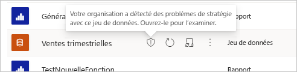
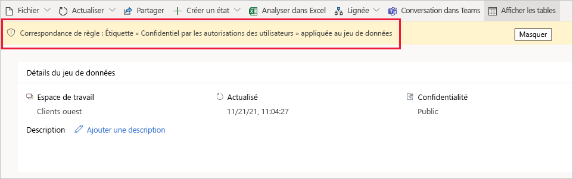
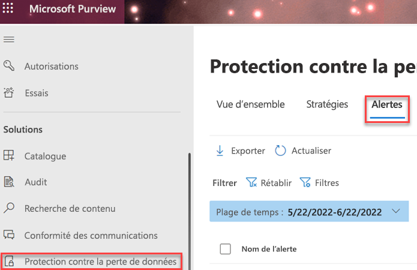

# Démarrage avec des stratégies de protection contre la perte de données pour Power BI (préversion)

Pour aider les organisations à détecter et protéger leurs données sensibles, [les stratégies de protection contre la perte de données (DLP) Microsoft Purview](/microsoft-365/compliance/dlp-learn-about-dlp) prennent en charge Power BI. Lorsqu’un jeu de données Power BI correspond aux critères d’une stratégie DLP, une alerte qui explique la nature du contenu sensible peut être déclenchée. Cette alerte est également inscrite sous l’onglet **Alertes** de protection contre la perte de données du portail de conformité Microsoft pour la surveillance et la gestion par les administrateurs. En outre, les alertes par e-mail peuvent être envoyées aux administrateurs et aux utilisateurs spécifiés.

[!INCLUDE [purview-preview](../includes/purview-preview.md)]

## Considérations et limitations

- Les stratégies DLP s’appliquent aux espaces de travail. Seuls les espaces de travail hébergés dans les capacités Premium Gen2 sont pris en charge. Pour plus d’informations, consultez [Qu’est-ce que Power BI Premium Gen2 ?](/power-bi/enterprise/service-premium-gen2-what-is)
- Les charges de travail d’évaluation du jeu de données DLP ont un impact sur la capacité. Le contrôle des charges de travail d’évaluation DLP n’est pas pris en charge.
- Les espaces de travail classiques et nouveaux sont pris en charge, tant qu’ils sont hébergés dans des capacités Premium Gen2.
- Vous devez créer une stratégie personnalisée DLP personnalisée pour Power BI. Les modèles DLP ne sont pas pris en charge.
- Les stratégies DLP appliquées à l’emplacement DLP prennent en charge les étiquettes de confidentialité et les types d’informations sensibles en tant que conditions. 
- Les stratégies DLP pour Power BI ne sont pas prises en charge pour les exemples de jeux de données, [les jeux de données de streaming](/power-bi/connect-data/service-real-time-streaming)ou les jeux de données qui se connectent à leur source de données via [DirectQuery](/power-bi/connect-data/desktop-use-directquery) ou [une connexion active](/power-bi/connect-data/desktop-directquery-about#live-connections).
- Les stratégies DLP pour Power BI ne sont pas prises en charge dans les clouds souverains.

## Licences et autorisations

### Licences SKU/abonnements

Avant de commencer à utiliser DLP pour Power BI, vous devez confirmer votre [abonnement Microsoft 365](https://www.microsoft.com/microsoft-365/compare-microsoft-365-enterprise-plans?rtc=1). Pour obtenir des conseils complets sur les licences, consultez [les conseils Microsoft 365 pour la sécurité et la conformité](/office365/servicedescriptions/microsoft-365-service-descriptions/microsoft-365-tenantlevel-services-licensing-guidance/microsoft-365-security-compliance-licensing-guidance#information-protection).

### Autorisations

Les données du point de terminaison DLP peuvent être affichées dans [l’Explorateur d’activités](/microsoft-365/compliance/data-classification-activity-explorer). Quatre rôles accordent l’autorisation à l’Explorateur d’activités ; le compte que vous utilisez pour accéder aux données doit être membre de l’un d’eux.

- Administrateur général
- Administrateur de conformité
- Administrateur de sécurité
- Administrateur de conformité des données

## Fonctionnement des stratégies DLP pour Power BI

Vous définissez une stratégie DLP dans la section protection contre la perte de données du portail de conformité. Consultez, [Concevoir une stratégie de protection contre la perte de données](dlp-policy-design.md#design-a-data-loss-prevention-policy). Dans la stratégie, vous spécifiez les étiquettes de confidentialité que vous souhaitez détecter. Vous spécifiez également la ou les actions qui se produisent lorsque la stratégie détecte un jeu de données auquel une étiquette de confidentialité spécifiée est appliquée. Les stratégies DLP prennent en charge deux actions pour Power BI :

- Notification de l’utilisateur via des conseils de stratégie.
- Les alertes. Les alertes peuvent être envoyées par e-mail aux administrateurs et aux utilisateurs. En outre, les administrateurs peuvent surveiller et gérer les alertes sous l’onglet **Alertes** du Centre de conformité. 

Lorsqu’un jeu de données est évalué par DLP et correspond aux conditions d’une stratégie DLP, les actions définies dans la stratégie sont appliquées. Un jeu de données est évalué lorsqu’un jeu de données est :

- Publier
- Republier
- Actualisé à la demande
- Actualisé de façon planifiée

>[!NOTE]
> L’évaluation DLP du jeu de données ne se produit pas si l’une des conditions suivantes est vraie :
> - L’initiateur de l’événement est un principal de service.
> - Le propriétaire du jeu de données est un principal de service ou un utilisateur B2B.

### Que se passe-t-il lorsqu’un jeu de données correspond à une stratégie DLP ?

Lorsqu’un jeu de données correspond à une stratégie DLP :

- Si la stratégie a une notification utilisateur configurée, elle est marquée dans le service Power BI avec une icône de bouclier pour indiquer qu’elle correspond à une stratégie DLP.

    

    Ouvrez la page des détails du jeu de données pour voir un conseil de stratégie qui explique la correspondance de stratégie et comment le type détecté d’informations sensibles doit être géré.

    

    >[!NOTE]
    > Si vous masquez le conseil de stratégie, il n’est pas supprimé. Il apparaîtra la prochaine fois que vous visiterez la page.

- Si les alertes sont activées dans la stratégie, une alerte est enregistrée sous l’onglet **Alertes** dlp dans le Centre de conformité, et (si elle est configurée), un e-mail est envoyé aux administrateurs et/ou aux utilisateurs spécifiés. L’image suivante montre l’onglet **Alertes** dans la section Protection contre la perte de données du portail de conformité Microsoft Purview.

    

## Configurer une stratégie DLP pour Power BI

Suivez les procédures décrites dans [Créer, tester et paramétrer une stratégie DLP](create-test-tune-dlp-policy.md#create-test-and-tune-a-dlp-policy) et utiliser le modèle personnalisé.

> [!IMPORTANT]
> Lorsque vous sélectionnez les emplacements de votre stratégie DLP pour Power BI, sélectionnez uniquement l’emplacement Power BI. Ne sélectionnez aucun autre emplacement, cette configuration n’est pas prise en charge. 

<!--1. Log into the [Microsoft Purview compliance portal](https://compliance.microsoft.com).

1. Choose the **Data loss prevention** solution in the navigation pane, select the **Policies** tab, choose **Create policy**.

    

1. Choose the **Custom** category and then the **Custom policy** template.
    
    >[!NOTE]
    >No other categories or templates are currently supported.

    
 
    When done, click **Next**.

1. Name the policy and provide a meaningful description.

    
 
    When done, click **Next**.

1. Enable Power BI as a location for the DLP policy. **Disable all other locations**. Currently, DLP policies for Power BI must specify Power BI as the sole location.

    

    By default the policy will apply to all workspaces. Alternatively, you can specify particular workspaces to include in the policy as well as workspaces to exclude from the policy.
    >[!NOTE]
    > DLP actions are supported only for workspaces hosted in Premium Gen2 capacities.

    If you select **Choose workspaces** or **Exclude workspaces**, a dialog will allow you to create a list of included (or excluded) workspaces. You must specify workspaces by workspace object ID. Click the info icon for information about how to find workspace object IDs.

    
 
    After enabling Power BI as a DLP location for the policy and choosing which workspaces the policy will apply to, click **Next**.

1. The **Define policy settings** page appears. Choose **Create or customize advanced DLP rules** to begin defining your policy.

    
 
    When done, click **Next**.

1. On the **Customize advanced DLP rules** page, you can either start creating a new rule or choose an existing rule to edit. Click **Create rule**.

    

1. The **Create rule** page appears. On the create rule page, provide a name and description for the rule, and then configure the other sections, which are described following the image below.

    
 
### Conditions

In the condition section, you define the conditions under which the policy will apply to a dataset. Conditions are created in groups. Groups make it possible to construct complex conditions.

1. Open the conditions section, choose **Add condition** and then **Content contains**.

    
 
    This opens the first group (named Default – you can change this).

1. Choose **Add**, and then **Sensitivity labels**.
        
    >[!NOTE]
    > Sensitive info types are currently not supported.
    
    
 
    When you choose **Sensitivity labels**, you will be able to choose a particular sensitivity label from a list that will appear.

    You can add additional sensitivity labels to the group. To the right of the group name, you can specify **Any of these** or **All of these**. This determines whether matches on all or any of the labels is required for the condition to hold. Make sure **Any of these** is selected, since datasets can’t have more than one label applied.

    The image below shows a group (Default) that contains two sensitivity label conditions. The logic Any of these means that a match on any one of the sensitivity labels in the group constitutes “true” for that group.

     
 
    You can create more than one group, and you can control the logic between the groups with **AND** or **OR** logic. 

    The image below shows a rule containing two groups, joined by **OR** logic.

     
 
### Exceptions

If the sensitivity label of the dataset matches any of the defined exceptions, the rule won’t be applied to the dataset. 

Exceptions are configured in the same way as conditions, described above.
    

 
### Actions

Protection actions are currently unavailable for Power BI DLP policies.

### User notifications

The user notifications section is where you configure your policy tip. Turn on the toggle, select the **Notify users in Office 365 service with a policy tip** and **Policy tips** checkboxes, and write your policy tip in the text box.

 
### User overrides
 
User overrides are currently unavailable for Power BI DLP policies.

 
 
### Incident reports

Assign a severity level that will be shown in alerts generated from this policy. Enable (default) or disable email notification to admins, specify users or groups for email notification, and configure the details about when notification will occur.

   
### Additional options

 
## Monitor and manage policy alerts

Log into the Microsoft Purview compliance portal and navigate to **Data loss prevention > Alerts**.

Click on an alert to start drilling down to its details and to see management options.
-->
## Prochaines étapes

- [En savoir plus sur la prévention des pertes de données](/microsoft-365/compliance/dlp-learn-about-dlp)
- [Étiquettes de confidentialité dans Power BI](/power-bi/enterprise/service-security-sensitivity-label-overview)
- [Schéma d’audit pour les étiquettes de confidentialité dans Power BI](/power-bi/enterprise/service-security-sensitivity-label-audit-schema)
