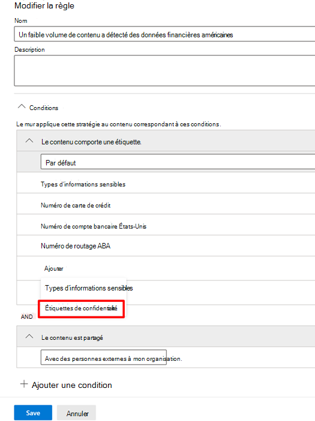

# Utiliser les étiquettes de confidentialité comme condition dans les stratégies de protection contre la perte de données

Vous pouvez utiliser [ les étiquettes de confidentialité](sensitivity-labels.md)comme condition dans les stratégies de protection contre la perte de données pour cet emplacement:

- Messagerie Exchange Online
- SharePoint Online
- Sites OneDrive Entreprise
- Appareils Windows 10

Les étiquettes de confidentialité apparaissent comme une option dans la liste du **Contenu**.

> [!div class="mx-imgBorder"]
> 

> [!IMPORTANT]
> **Les Etiquettes de Confidentialité** comme condition ne seront pas disponibles si vous avez sélectionné **Conversation d’équipe et messages de canaux** comme emplacement d’application de la stratégie DLP.

## Éléments, scénarios et conseils de stratégie pris en charge

Vous pouvez utiliser des étiquettes de confidentialité comme conditions sur ces éléments et dans ces scénarios.

### Éléments non pris en charge 

|Service  |Type d’élément  |Disponible pour l’astuce de stratégie  |Applicable  |
|---------|---------|---------|---------|
|Exchange    |Message électronique         |oui         |oui         |
|Exchange    |Pièce jointe         |non         |oui **         |
|SharePoint Online     |éléments dans SharePoint Online         |oui         |oui         |
|OneDrive Entreprise     |éléments         |oui         |oui         |
|Teams     |Teams et messages de canal         |non applicable         |non applicable         |
|Teams     |pièces jointes         |Oui **         |Oui **         |
|Appareils Windows 10     |éléments         |oui         |oui         |
|MCAS (préversion) |éléments         |oui         |oui         |

\* La détection DLP des pièces jointes de courrier associées à une étiquette de confidentialité est uniquement prise en charge par les types de fichier Office.

\** Les pièces jointes envoyées dans Teams au cours des conversations ou canaux de 1:1 sont chargées automatiquement sur OneDrive pour Entreprise et SharePoint. Par conséquent, si SharePoint Online ou OneDrive pour Entreprise sont inclus dans votre stratégie DLP, les pièces jointes à étiquettes envoyées dans Teams sont automatiquement incluses dans l’étendue de cette condition. Il n’est pas nécessaire de sélectionner Teams comme emplacement dans la stratégie DLP.

> [!NOTE]
> La capacité de DLP à détecter les étiquettes de confidentialité dans SharePoint et OneDrive Entreprise est limitée. Pour plus d’informations, voir [Activer les étiquettes de confidentialité pour les fichiers Office dans SharePoint et OneDrive](sensitivity-labels-sharepoint-onedrive-files.md#limitations).

### Scénarios pris en charge

- L’administrateur DLP peut afficher la liste de toutes les étiquettes de confidentialité du client lorsqu’il choisit d’inclure une ou plusieurs étiquettes de confidentialité comme condition.

- L’utilisation d’étiquettes de confidentialité comme condition est prise en charge dans toutes les charges de travail, comme indiqué dans la matrice de support ci-dessus.

- Les conseils de stratégie DLP continueront à être présentés dans les charges de travail (sauf Outlook Win32) pour les stratégies DLP qui contiennent une étiquette de confidentialité comme condition.

- Les étiquettes de confidentialité s’affichent également dans le message de rapport d’incident si une stratégie DLP avec une étiquette de confidentialité comme condition est associée.

- Les détails de l’étiquette de confidentialité s’affichent également dans le journal d’audit de correspondance des règles DLP pour une correspondance de stratégie DLP qui contient l’étiquette de confidentialité comme condition.

### Conseils de stratégie de support

|Charge de travail  |Prise en charge/non prise en charge des conseils de stratégie  |
|---------|---------|
|OWA |    Pris en charge     |
|Outlook Win 32    |  non pris en charge       |
|SharePoint   |   Pris en charge      |
|OneDrive Entreprise    |    Pris en charge     |
|appareils de point de terminaison   |  non pris en charge       |
